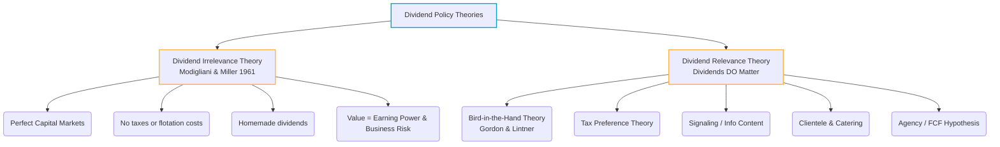
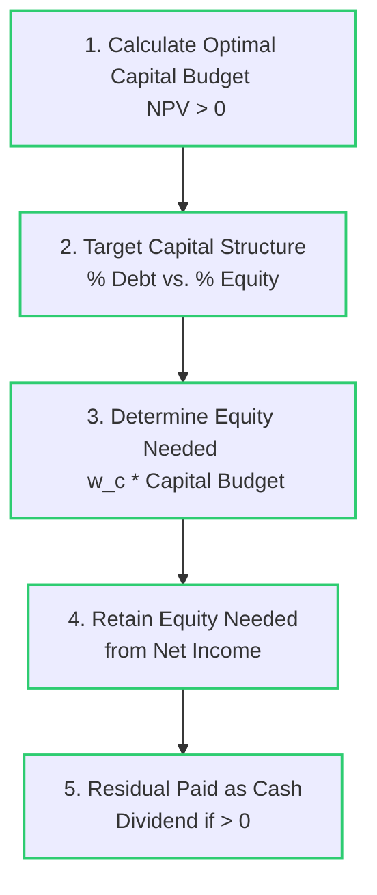

# Dividend Policy: Payout Decisions

> [!abstract] Curriculum & Syllabus Context
>
> - **Course:** ACC 302 Financial Management
> - **Phase:** Phase 7: Dividend Policy (Payout Decisions)
> - **Target Reading:** Smart & Zutter (16e) Chapter 14; Van Horne (13e) Chapter 18
> - **Syllabus Focus:** Payout vs retention trade-offs, dividend timeline (declaration, record, ex-dividend, payment), share repurchase methods, tax treatment of dividends vs repurchases, dividend theories (MM Irrelevance, Bird-in-the-Hand, Tax Preference, Signaling, Clientele, Agency), residual dividend model, stock dividends, and stock splits.

---

### LO 7.1: Fundamentals of Payout Policy & Cash Distribution Mechanics

#### 1. Definition and Scope of Payout Policy
> [!info] Key Definition: Payout Policy
>
> **Payout policy** refers to the strategic decisions a firm makes regarding whether to distribute cash to shareholders, how much cash to distribute, and the specific mechanism (cash dividends vs. share repurchases) used to execute the distribution.

* **The Payout vs. Retention Trade-off:** Every dollar earned after interest and corporate taxes can either be:
  1. **Retained and Reinvested:** Increasing the common equity base, funding positive Net Present Value ($NPV$) capital budgeting projects, and driving future capital gains ($g$).
  2. **Distributed to Shareholders:** Providing immediate cash flow via dividends or repurchases, but reducing internally generated equity available for capital expenditures.
* **Impact on Capital Structure and WACC:** Retained earnings represent internal common equity ($r_s$). Retaining less earnings forces the firm to either issue new external equity ($r_e$, which incurs flotation costs $F$) or increase debt financing, shifting the firm's capital structure debt-to-equity ratio ($D/E$) and altering its Weighted Average Cost of Capital ($WACC$).

#### 2. Cash Dividend Payment Procedures
Firms normally declare cash dividends on a quarterly basis. When the Board of Directors approves a dividend, four critical dates govern the mechanics:
1. **Declaration Date:** The date on which the Board of Directors formally issues a statement declaring a dividend. On this date, the declared dividend becomes an official accounting liability of the firm (*Dividends Payable*), reducing *Retained Earnings*.
2. **Holder-of-Record Date (Record Date):** The date specified by the directors on which the company closes its stock-transfer books and compiles the official roster of shareholders entitled to receive the declared dividend.
3. **Ex-Dividend Date:** The date on which the right to the current dividend no longer accompanies the stock. Under standard settlement conventions, the ex-dividend date is set **one business day prior to the holder-of-record date**. 
   * *Buyer/Seller Entitlement:* If an investor purchases stock **before** the ex-dividend date, they receive the dividend (*cum-dividend*). If purchased **on or after** the ex-dividend date, the seller receives the dividend.
   * *Stock Price Adjustment:* In a friction-free market (without taxes), the stock price drops on the ex-dividend date by the exact dollar amount of the dividend:
     > [!quote] Formula & Derivation: Ex-Dividend Price Drop
     > $$P_{\text{ex}} = P_{\text{cum}} - D$$
     *(Note: Due to tax differentials between cash dividends and capital gains, empirical studies show the stock price actually drops by roughly 80% to 90% of the dividend value).*
4. **Payment Date:** The date on which the firm actually mails check payments or executes electronic funds transfers (EFT) to the holders of record.

#### 3. Share Repurchase Procedures
In a share repurchase (stock buyback), a firm re-acquires its own outstanding common stock, converting those shares into **Treasury Stock**. The four primary execution methods include:
1. **Open-Market Share Repurchase:** The firm buys back shares on the open secondary market (e.g., NYSE or NASDAQ) through a broker at prevailing market prices. This is the most common and flexible method.
2. **Fixed-Price Tender Offer:** The firm issues a formal offer to all shareholders to buy back a specified number of shares at a fixed specified price, typically set at a 10% to 20% premium over the current market price. If oversubscribed, shares are repurchased on a pro-rata basis.
3. **Dutch Auction Share Repurchase:** The firm specifies the total dollar amount or number of shares it wishes to buy back along with a price range (e.g., $\$30.00$ to $\$35.00$). Shareholders tender their shares specifying the minimum price they are willing to accept. The firm constructs a demand schedule and sets the lowest clearing price necessary to acquire the target shares.
4. **Targeted Share Repurchase:** The firm negotiates directly to buy back a large block of stock from a single major shareholder (e.g., to eliminate a corporate raider threatening a hostile takeover, often referred to as "greenmail").

#### 4. Tax Treatment: Dividends vs. Repurchases
* **Dividends:** Taxed in the year received by individual shareholders. Under modern U.S. tax law, qualified dividends are taxed at preferential capital gains rates (0%, 15%, or 20% plus a 3.8% net investment income tax for high earners).
* **Share Repurchases:** Offer significant tax deferral and tax minimization advantages:
  1. *Voluntary Participation:* Shareholders who choose not to tender incur zero tax liability.
  2. *Taxation on Capital Gains Only:* Tendering shareholders pay tax only on the net capital gain ($P_{\text{sale}} - P_{\text{basis}}$), not on the gross distribution proceeds.
* **Corporate Dividend Exclusion:** Under corporate tax codes, a corporation receiving dividends from another domestic firm can exclude a large percentage (50% to 65%+) of dividend income from taxable income to prevent triple taxation.

#### 5. Dividend Reinvestment Plans (DRIPs)
DRIPs allow shareholders to automatically reinvest cash dividends in additional shares of the issuing company, usually with zero brokerage commissions:
* **Old Stock DRIPs:** A bank trustee uses the pooled cash dividends to purchase existing shares on the open market.
* **New Stock DRIPs:** The company issues brand-new common stock to participants (often at a 3% to 5% discount to market price), thereby raising new equity capital without incurring underwriting/flotation costs.
* *Taxation Warning:* Shareholders must pay income taxes on the value of reinvested dividends in the year received, even though they receive stock instead of cash.

---

### LO 7.2: Theories of Dividend Relevance & Irrelevance

#### 1. Dividend Irrelevance Theory (Modigliani & Miller - MM, 1961)
* **Core Proposition:** Merton Miller and Franco Modigliani proved that in a perfect capital market, a firm's dividend policy has **no effect** on either the total market value of the firm ($V$) or its cost of capital ($WACC$).
* **Key Assumptions of Perfect Capital Markets:**
  1. Zero personal and corporate taxes.
  2. Zero transactions costs for investors and zero flotation costs for firms.
  3. Symmetric information (investors and managers possess identical information about future cash flows).
  4. Investment policy is given and fixed (all positive $NPV$ projects are funded).
* **Proof via Homemade Dividends:** Shareholders can replicate any desired cash flow stream independently. If a firm pays no dividend but an investor wants cash, the investor can create a **"homemade dividend"** by selling a fraction of their shares.
* **Conclusion:** The value of the firm is determined strictly by its **earning power and business risk** (the cash flow productivity of its underlying assets), not by how earnings are split between dividends and retained earnings.
#### 2. Arguments for Dividend Relevance (Dividends DO Matter)
##### A. Bird-in-the-Hand Theory (Myron Gordon & John Lintner)
* **Argument:** Investors prefer a sure dividend payment today ("a bird in the hand") to an uncertain future capital gain ("two in the bush").
* **Impact on Required Return:** Because future capital gains are riskier than current dividends, investors' required return on equity ($r_s$) rises as the dividend payout ratio is reduced. Thus, **higher payout ratios maximize stock price**.
* **MM's Counter-Critique ("Bird-in-the-Hand Fallacy"):** MM argued the riskiness of the firm's cash flows to investors is determined solely by the riskiness of its **operating cash flows**, not by its payout distribution policy.
##### B. Tax Preference / Differential Tax Theory
* **Argument:** In real markets, capital gains enjoy significant tax advantages over cash dividends:
  1. *Tax Rate Differential:* Capital gains have historically been taxed at lower rates.
  2. *Tax Deferral Advantage:* Taxes on capital gains are paid only when the stock is sold (*realized*), creating a valuable time-value-of-money tax deferral option.
  3. *Stepped-Up Basis:* Capital gains tax is eliminated if stock is held until death.
* **Conclusion:** Investors prefer low-payout/high-retention firms, requiring a higher before-tax return ($r_s$) on high-dividend stocks to offset the tax penalty.
##### C. Information Content or Signaling Hypothesis
* **Argument:** In markets with **asymmetric information**, managers possess superior knowledge regarding firm prospects. Dividend announcements serve as a credible financial **signal**:
  * **Dividend Increase:** Conveys a positive signal that management forecasts higher permanent earnings and cash flow capacity.
  * **Dividend Cut:** Conveys a negative signal that management anticipates depressed future cash flows.
##### D. Clientele Effect & Catering Theory
* **Clientele Effect:** Different groups (clienteles) of investors prefer different payout policies due to tax brackets or cash income requirements.
  * *High-Payout Clientele:* Retirees, low-tax/tax-exempt pension funds.
  * *Low-Payout Clientele:* High-income individuals seeking capital appreciation to defer taxes.
* **Catering Theory (Baker & Wurgler):** Managers cater to shifting investor sentiment over time—initiating dividends when market sentiment favors safe stocks, and omitting dividends when investors demand speculative growth.
##### E. Agency Cost Theory & Free Cash Flow Hypothesis (Michael Jensen)
* **Argument:** Retaining excess free cash flow ($FCF$) inside the firm grants managers discretionary power, increasing agency costs (perk consumption, empire building, and negative-$NPV$ projects).
* **Disciplining Mechanism:** Paying high regular dividends forces managers to regularly enter the external capital markets to raise new investment capital, subjecting their project choices to external scrutiny by investment bankers.

---
### LO 7.3: Establishing Dividend Policy in Practice & The Residual Dividend Model
#### 1. Mechanics of the Residual Dividend Model
> [!info] Key Definition: Residual Dividend Model
>
> Under the **Residual Dividend Model**, a firm treats dividend payout as a strict mathematical residual—paying dividends only out of "leftover" earnings after funding all acceptable capital budgeting projects.

#### 2. The Four-Step Residual Procedure
> [!quote] Formula & Derivation: Residual Dividend Calculation
>
> 1. **Determine the Optimal Capital Budget:** Identify projects with $NPV > 0$.
> 2. **Determine Equity Funding Needed:** 
>    $$\text{Required Equity} = w_c \times (\text{Total Capital Budget})$$
> 3. **Fund Equity Requirement from Net Income:** Utilize retained earnings first, as internal equity ($r_s$) is cheaper than external equity ($r_e$).
> 4. **Pay Out Residual Earnings:**
>    $$\text{Dividends} = \text{Net Income} - \left[ w_c \times (\text{Total Capital Budget}) \right]$$
>    $$\text{Payout Ratio} = \frac{\text{Dividends}}{\text{Net Income}}$$

#### 3. Practical Application: Long-Run Target vs. Annual Volatility
* **The Residual Dilemma:** Strict annual adherence to the residual model causes extreme **dividend volatility** (e.g., 60% payout in year 1, 0% payout in year 2), sending erratic signals and upsetting clienteles.
* **Practical Solution:** Financial managers use the residual dividend model to establish a **long-run target payout ratio** over a 5-to-10 year planning horizon, while maintaining stable, smooth dollar payments in any single year.

#### 4. Earnings vs. Cash Flows in Dividend Safety
* Accounting Net Income (accrual basis) does not equal cash in the bank. Cash dividends must be paid in liquid cash.
* Analysts evaluate dividend safety using **Cash Flow Per Share ($CFPS$)** and the cash flow payout ratio ($\text{DPS} / \text{CFPS}$) rather than the accounting payout ratio.

---

### LO 7.4: Types of Dividend Policies in Corporate Practice

Firms typically adopt one of three structured payout policies in practice:

| Policy Type | Mechanics & Description | Primary Advantage | Major Disadvantage / Risk |
| :--- | :--- | :--- | :--- |
| **1. Constant-Payout-Ratio** | Pays a fixed percentage of net income as cash dividends every period ($\text{DPS} = \text{EPS} \times \text{Constant } \%$). | Automatically aligns cash distribution with periodic profitability. | Dividends fluctuate wildly with earnings; drops to $\$0$ during loss years, creating negative signals. |
| **2. Regular Dividend Policy** | Pays a fixed, predictable dollar amount per share ($\text{DPS}$) each period. Raised only when permanent higher earnings are established. | Minimizes investor uncertainty, satisfies income clienteles, and conveys positive stability signals. | Can strain liquidity if earnings experience a temporary cyclical collapse below the fixed payout. |
| **3. Low-Regular-and-Extra** | Pays a low, easily sustainable baseline regular dividend, supplemented by an "extra" dividend in highly profitable years. | Provides management maximum financial flexibility while assuring investors of a reliable baseline cash flow. | Investors may come to expect "extra" dividends as permanent, diluting the positive signaling effect. |

---

### LO 7.5: Factors Influencing Dividend Policy Decisions

When establishing dividend policy, corporate financial managers must evaluate four major sets of constraints and considerations:

#### 1. Legal Constraints & Statutory Rules
* **Capital Impairment Rule:** Prohibits firms from paying dividends out of "legal capital" (par value or paid-in capital). Dividends must be funded from cumulative **Retained Earnings** to protect senior creditors.
* **Insolvency Rule:** Prohibits cash dividend distributions if the firm is legally or technically insolvent.
* **Penalty Tax on Improperly Accumulated Earnings:** Prevents closely held corporations from retaining excessive earnings solely to help wealthy owners avoid personal dividend income taxes.

#### 2. Contractual Constraints
* **Bond Indentures & Debt Agreements:** Restrictive loan covenants often limit dividend payments (e.g., stipulating minimum thresholds for the *Current Ratio* or *Times Interest Earned* ratio).
* **Preferred Stock Restrictions:** Cumulative preferred stock arrearages must be fully satisfied before any cash dividends can be paid to common stockholders.

#### 3. Investment Opportunities & Financial Flexibility
* **Growth Prospects:** High-growth firms with abundant positive-$NPV$ opportunities maintain low payout ratios to conserve internal equity.
* **Cost of Capital & Flotation Costs:** If external equity flotation costs ($F$) are high, retaining earnings is significantly cheaper than selling new stock ($r_e > r_s$), favoring lower dividend payouts.

#### 4. Market & Control Considerations
* **Dilution of Control:** If a firm pays out cash as dividends and later needs equity capital, issuing new stock may dilute the voting control of existing management/owners. Retaining earnings preserves control.

---

### LO 7.6: Stock Dividends, Stock Splits, and Reverse Splits

#### 1. Stock Dividends
A **stock dividend** is a payment of additional shares of stock to existing shareholders in proportion to their current ownership.
* **Accounting Treatment:**
  * *Small (Ordinary) Stock Dividend (< 20% - 25%):* An amount equal to the **market value** of the issued shares is transferred from *Retained Earnings* to *Common Stock (par)* and *Paid-in Capital in Excess of Par*.
  * *Large Stock Dividend (> 20% - 25%):* An amount equal to the **par value** of the issued shares is transferred from *Retained Earnings* to *Common Stock*.
* **Economic Impact:** Purely cosmetic; total stockholders' equity remains unchanged. Each share's proportional ownership claim is identical, so EPS, DPS, and market price per share decrease proportionally:
  > [!quote] Formula & Derivation: Price Adjustment Post-Stock Dividend
  > $$P_{\text{post}} = \frac{P_{\text{pre}}}{1 + \text{Stock Dividend } \%}$$

#### 2. Stock Splits
A **stock split** increases the number of outstanding shares by reducing the par value per share proportionally (e.g., a 2-for-1 split doubles the share count and halves the par value).
* **Accounting Impact:** **Zero change** in Retained Earnings, Paid-in Capital, or Total Stockholders' Equity accounts. Only the par value and total share count are updated.
* **Motivation:** Keeps the stock price within a "popular trading range" (historically $\$20$ to $\$80$ per share) to enhance liquidity.

#### 3. Reverse Stock Splits
In a **reverse stock split**, the firm decreases the number of outstanding shares, increasing the par value and market price per share proportionally (e.g., a 1-for-5 reverse split replaces 5 old shares with 1 new share).
* **Motivation:** Primary reason is to boost a depressed stock price above stock exchange listing minimums (e.g., NASDAQ's $\$1.00$ minimum bid price rule) to avoid delisting.
* **Market Reaction:** Generally associated with negative abnormal returns due to the negative signal of historical financial distress.

#### 4. Share Repurchase vs. Cash Dividend Numerical Comparison
In a perfect capital market, distributing cash via share repurchases versus cash dividends yields identical total wealth for shareholders:
* *Cash Dividend:* Shareholder receives cash dividend $D_1$, but stock price drops to $P_0 - D_1$. Total wealth = $D_1 + (P_0 - D_1) = P_0$.
* *Share Repurchase:* Share count drops from $N_0$ to $N_1 = N_0 - \frac{\text{Total Cash}}{P_0}$. EPS rises to $\frac{\text{Net Income}}{N_1}$, pushing the post-repurchase stock price up so that $P_1 = P_0$.

---

### LO 7.7: High-Yield Numerical Problem Walkthroughs

> [!example] Problem 1: Residual Dividend Model under Varying Capital Budgets
>
> **Scenario:** Chittagong Apparel Ltd. has a target capital structure of 40% debt and 60% common equity. The firm expects net income of $\$5,000,000$ for the upcoming year. Calculate the total cash dividend, per-share dividend (DPS, assuming 1,000,000 shares), and dividend payout ratio under three alternative capital budgets:
> 1. *Poor Opportunities:* Capital Budget = $\$3,000,000$
> 2. *Average Opportunities:* Capital Budget = $\$7,000,000$
> 3. *Good Opportunities:* Capital Budget = $\$10,000,000$
> 
> **Solution Steps:**
> 
> **1. Capital Budget = $\$3,000,000$**
> $$\text{Equity Required} = 0.60 \times \$3,000,000 = \$1,800,000$$
> $$\text{Dividends} = \text{Net Income} - \text{Equity Required} = \$5,000,000 - \$1,800,000 = \$3,200,000$$
> $$\text{DPS} = \frac{\$3,200,000}{1,000,000 \text{ shares}} = \$3.20 \text{ per share}$$
> $$\text{Payout Ratio} = \frac{\$3,200,000}{\$5,000,000} = 64.0\%$$
> 
> **2. Capital Budget = $\$7,000,000$**
> $$\text{Equity Required} = 0.60 \times \$7,000,000 = \$4,200,000$$
> $$\text{Dividends} = \$5,000,000 - \$4,200,000 = \$800,000$$
> $$\text{DPS} = \frac{\$800,000}{1,000,000 \text{ shares}} = \$0.80 \text{ per share}$$
> $$\text{Payout Ratio} = \frac{\$800,000}{\$5,000,000} = 16.0\%$$
> 
> **3. Capital Budget = $\$10,000,000$**
> $$\text{Equity Required} = 0.60 \times \$10,000,000 = \$6,000,000$$
> $$\text{Residual} = \$5,000,000 - \$6,000,000 = -\$1,000,000$$
> *Since the residual is negative, no dividends are paid ($0$), and the firm must issue $\$1,000,000$ of new external common stock.*
> $$\text{Dividends} = \$0, \quad \text{DPS} = \$0.00, \quad \text{Payout Ratio} = 0.0\%$$

> [!example] Problem 2: Stock Split and Stock Dividend Adjustments
>
> **Scenario:** Karnaphuli Steel Mills currently has 500,000 common shares outstanding selling at $\$60$ per share. Net income is $\$2,500,000$ ($\text{EPS} = \$5.00$) and current $\text{DPS} = \$2.00$.
> 4. Calculate the new share count, EPS, DPS, and market price per share if the firm executes a **5-for-2 stock split**.
> 5. Calculate the new share count, EPS, and market price per share if the firm pays a **25% stock dividend**.
> 
> **Solution Steps:**
> 
> **1. 5-for-2 Stock Split:**
> $$\text{Split Factor} = \frac{5}{2} = 2.5$$
> $$\text{New Share Count} = 500,000 \times 2.5 = 1,250,000 \text{ shares}$$
> $$\text{New EPS} = \frac{\$5.00}{2.5} = \$2.00 \quad \left(\text{or } \frac{\$2,500,000}{1,250,000} = \$2.00\right)$$
> $$\text{New DPS} = \frac{\$2.00}{2.5} = \$0.80$$
> $$\text{Expected Stock Price} = \frac{\$60.00}{2.5} = \$24.00$$
> 
> **2. 25% Stock Dividend:**
> $$\text{New Share Count} = 500,000 \times (1 + 0.25) = 625,000 \text{ shares}$$
> $$\text{New EPS} = \frac{\$2,500,000}{625,000 \text{ shares}} = \$4.00$$
> $$\text{Expected Stock Price} = \frac{\$60.00}{1 + 0.25} = \$48.00$$

> [!example] Problem 3: Share Repurchase vs. Cash Dividend Valuation
>
> **Scenario:** Apex Technology has net income of $\$4,000,000$ and 1,000,000 shares outstanding trading at $\$40.00$ per share ($\text{P/E} = 10.0\times$). The firm has $\$1,000,000$ of excess cash to distribute.
> 6. If paid as a cash dividend, calculate DPS, the post-dividend stock price, and total wealth per share.
> 7. If used to repurchase shares at $\$40.00$, calculate the number of shares repurchased, new EPS, and post-repurchase stock price (assuming P/E remains $10.0\times$).
> 
> **Solution Steps:**
> 
> **1. Cash Dividend Alternative:**
> $$\text{DPS} = \frac{\$1,000,000}{1,000,000 \text{ shares}} = \$1.00 \text{ per share}$$
> $$\text{Post-Dividend Stock Price} = P_0 - \text{DPS} = \$40.00 - \$1.00 = \$39.00$$
> $$\text{Total Wealth per Share} = \text{DPS} + P_{\text{post}} = \$1.00 + \$39.00 = \$40.00$$
> 
> **2. Share Repurchase Alternative:**
> $$\text{Shares Repurchased} = \frac{\$1,000,000}{\$40.00} = 25,000 \text{ shares}$$
> $$\text{Remaining Shares} = 1,000,000 - 25,000 = 975,000 \text{ shares}$$
> $$\text{New EPS} = \frac{\$4,000,000}{975,000 \text{ shares}} \approx \$4.1026 \text{ per share}$$
> $$\text{Post-Repurchase Stock Price} = \text{New EPS} \times \text{P/E} = \$4.1026 \times 10.0 = \$41.026 \approx \$41.03$$
> *Note: In a frictionless market, the post-repurchase price per share remains $\$40.00$ if cash is deducted before valuation, demonstrating total wealth equivalence ($\$40.00$).*
