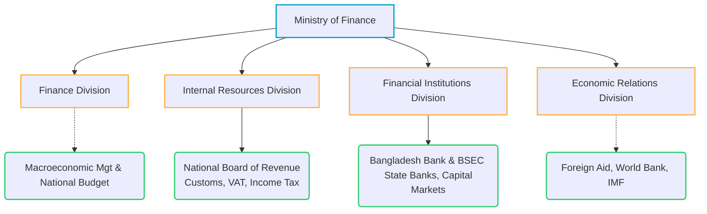

# Applied Financial Management Practice in Bangladesh

> [!abstract] Curriculum & Syllabus Context
>
> - **Course:** ACC 302 Financial Management
> - **Phase:** Phase 9: Applied Institutional Context & Local Practice
> - **Target Reading:** Public Procurement Act 2006; BSEC Corporate Governance Code 2018; Financial Reporting Act 2015
> - **Syllabus Focus:** Goals of SOEs vs private enterprises in Bangladesh, Medium Term Budget Framework (MTBF), iBAS++, public procurement (e-GP), Ministry of Finance organizational hierarchy, BSEC CGC 2018 governance rules, Banking sector NPLs and CRR/SLR controls, corporate bond market gaps, and local case studies.

---

### LO 9.1: Goals and Objectives of Public vs. Private Sector Enterprises in Bangladesh

#### 1. State-Owned Enterprises (SOEs) and Public Sector Entities
* **Dual Mandate Tension:** Public sector enterprises in Bangladesh operate under a complex balance between commercial profitability and social welfare objectives.
* **Core Public Sector Goals:**
  * **Social Equity and Public Welfare:** Providing essential goods and services (e.g., electricity by BPDB, petroleum by BPC, water by WASA, jute/textiles by BJMC/BTMC) at subsidized or affordable prices to low-income populations.
  * **Employment Generation & Regional Balance:** Serving as major employers and promoting industrialization in underdeveloped geographic regions.
  * **Macroeconomic Stability:** Stabilizing domestic price levels for vital commodities and inputs to curb inflationary pressures.
* **Commercial Constraints:** Price controls and administered pricing mandated by the government often force SOEs to incur operating losses (under-recovery of costs), making conventional financial metrics like $ROE$ or shareholder wealth maximization secondary to fiscal support and public service mandates.

#### 2. Private Sector Enterprises in Bangladesh
* **Primary Objective:** Aligns with standard corporate finance theory—**Shareholder Wealth Maximization**, operationalized via market price per share on the Dhaka Stock Exchange (DSE) and Chittagong Stock Exchange (CSE).
* **Key Private Sector Goals:**
  * **Profitability and Return on Invested Capital (ROIC):** Maximizing net profit margins, earnings per share ($EPS$), and return on equity ($ROE$).
  * **Market Share Expansion:** Scaling operations in high-growth sectors (Readymade Garments/RMG, Pharmaceuticals, Consumer Goods/FMCG, Telecom, and Leather).
  * **Regulatory Compliance & Capital Raising:** Adhering to BSEC regulations to maintain public listing status, secure institutional capital, and access foreign portfolio investment.

---

### LO 9.2: Techniques of Public Financial Management (PFM) in Bangladesh

#### 1. Medium Term Budget Framework (MTBF)
> [!info] Key Definition: MTBF
>
> **Medium Term Budget Framework (MTBF)** is a multi-year expenditure planning system that links the allocation of public resources directly to long-term national strategic priorities (e.g., 8th Five Year Plan, Perspective Plan 2041).

* **Structure:** Extends budgeting beyond a single fiscal year ($1$-year horizon) by establishing a $3$-to-$5$ year rolling macroeconomic framework for line ministries.
* **Financial Control Mechanism:** Forces line ministries to estimate resource ceilings, operational costs, and capital expenditure spending plans within binding top-down budget limits.

#### 2. iBAS++ (Integrated Budget and Accounting System)
* **Core Function:** The centralized, web-based Government Resource Planning (GRP) software used by the Ministry of Finance for national budget preparation, execution, and accounting.
* **Key Modules:**
  * Payroll and pension management for public servants.
  * Real-time tracking of revenue collection and expenditure payments across all government offices nationwide.
  * Electronic Fund Transfer (EFT) for direct government payments, eliminating payment leakage and manual ledger delays.

#### 3. Public Procurement Framework (PPA 2006 & PPR 2008)
* **Legislative Framework:** Governed by the **Public Procurement Act 2006 (PPA 2006)** and **Public Procurement Rules 2008 (PPR 2008)** under the Central Procurement Technical Unit (CPTU) / Bangladesh Public Procurement Authority (BPPA).
* **e-GP System (electronic Government Procurement):**
  * An online portal (`eprocure.gov.bd`) mandating digital tendering, bid evaluation, and contract awards for public sector infrastructure and procurement.
  * **Objectives:** Enhances transparency, reduces tender-bedding and corruption, enforces fair competition, and streamlines public capital budgeting implementation.

#### 4. Legislative Control & Oversight Bodies
* **Comptroller and Auditor General (CAG):** The supreme audit institution of Bangladesh, constitutionally mandated to conduct financial, compliance, and performance audits of all public sector accounts and SOEs.
* **Parliamentary Standing Committee on Public Accounts (PAC):** Legislative body that reviews CAG audit reports, summons accounting officers, and enforces accountability for financial irregularities and unauthorized public expenditures.

---

### LO 9.3: Organizations and Management Structures

#### 1. Executive Financial Hierarchy in Bangladesh

1. **Ministry of Finance (MoF):** The central economic body comprising four main divisions:
   * **Finance Division:** Responsible for macroeconomic management, national budget formulation, and PFM reforms.
   * **Internal Resources Division (IRD):** Houses the **National Board of Revenue (NBR)**, the chief authority for collecting direct and indirect taxes.
   * **Financial Institutions Division (FID):** Oversees state-owned commercial banks, specialized financial institutions, and capital market regulators.
   * **Economic Relations Division (ERD):** Coordinates foreign aid, sovereign loans, and bilateral/multilateral development assistance.

#### 2. Regulatory Infrastructure of Capital Markets
* **Bangladesh Securities and Exchange Commission (BSEC):** The primary statutory regulator of capital markets. Regulates stock exchanges, listed companies, merchant banks, mutual funds, and credit rating agencies.
* **Stock Exchanges:**
  * **Dhaka Stock Exchange (DSE):** Established in 1954; the primary automated stock exchange operating trading indices (DSEX, DS30, DSES).
  * **Chittagong Stock Exchange (CSE):** Secondary stock exchange operating in Chittagong and Dhaka.

---

### LO 9.4: Control Measures and Regulatory Frameworks

#### 1. BSEC Corporate Governance Code (CGC 2018)
Promulgated to ensure transparency, minority shareholder protection, and board accountability in publicly listed companies:
* **Board Composition:** Minimum board size of 5 and maximum of 20 directors. At least **one-fifth ($1/5th$)** must be independent directors.
* **Separation of Roles:** The positions of **Chairman of the Board** and **Chief Executive Officer (CEO)** must be held by different individuals.
* **Board Committees:**
  * **Audit Committee:** Must consist of at least 3 members, chaired by an Independent Director, with at least one member holding a professional accounting credential (FCA/FCMA).
  * **Nomination and Remuneration Committee (NRC):** Enforces structured succession planning and transparent executive compensation.
* **Financial Certifications:** The CEO and CFO must jointly certify to the Board that financial statements present a true and fair view.

#### 2. Financial Reporting Act (FRA 2015) & Financial Reporting Council (FRC)
* **Legislative Origin:** Enacted in 2015 to eliminate fraudulent accounting, financial statement manipulation, and auditor negligence.
* **Financial Reporting Council (FRC):** An independent statutory regulator overseeing public interest entities (PIEs), statutory auditors, and accounting professional bodies (ICAB, ICMAB).

#### 3. Banking Sector Regulations (Bangladesh Bank)
* **Central Bank Role:** **Bangladesh Bank (BB)** functions as the monetary authority, statutory regulator, and lender of last resort.
* **Core Regulatory Tools:**
  * **Cash Reserve Ratio (CRR) & Statutory Liquidity Ratio (SLR):** Mandatory liquidity buffers held by commercial banks with Bangladesh Bank.
  * **Single Borrower Exposure Limit:** Restricts total credit exposure to a single client/group to 25% of a bank's total regulatory capital to prevent loan concentration risk.
  * **Loan Classification and Provisioning:** Classifies non-performing loans (NPLs) into Sub-Standard ($SS$), Doubtful ($DF$), and Bad/Loss ($BL$) with mandatory loan-loss provisioning requirements ranging from 1% to 100%.

---

### LO 9.5: Problems, Challenges, and Prospects in Bangladeshi Financial Management

#### 1. Core Financial Sector Problems & Challenges
> [!warning] Key Exam Pitfall: Structural Market Issues
>
> 1. **High Non-Performing Loans (NPLs):** High levels of defaulted loans and weak credit risk management in commercial banks.
> 2. **Absence of a Deep Long-Term Corporate Bond Market:** Severe structural mismatch where Bangladeshi firms rely almost exclusively on short-term bank loans ($1$-to-$5$ years) to finance long-term capital budgeting projects ($10$-to-$20$ years).
> 3. **SOE Inefficiencies:** Operational overstaffing and administered pricing mechanisms leading to continuous operating deficits funded by fiscal transfers.
> 4. **Market Imperfections:** Concentrated family ownership leading to agency conflicts, dominance of speculative retail investors, and administrative price floors (e.g., BSEC "Floor Price" restrictions).

#### 2. Financial Prospects and Emerging Innovations
1. **Islamic Capital Markets & Sukuk Bonds:** Introduction of Government and Corporate Sovereign **Sukuk** (Islamic asset-backed bonds) to mobilize liquidity-rich Islamic banking funds for national infrastructure projects.
2. **Digital Financial Services (DFS) & Mobile Financial Services (MFS):** Rapid expansion of MFS platforms (e.g., bKash, Nagad) driving financial inclusion and digitizing corporate wage disbursements.
3. **Sustainable Finance & Green Banking:** Bangladesh Bank mandates that commercial banks allocate at least 5% of direct term-loan disbursements to green projects (solar energy, effluent treatment plants).

---

### LO 9.6: Gap Analysis: International Textbook Theory vs. Bangladesh Financial Market Realities

| Theoretical Finance Concept (Gitman / Brigham / Van Horne) | Bangladesh Financial Market Reality | Operational Impact on Financial Managers |
| :--- | :--- | :--- |
| **Efficient Market Hypothesis (EMH):** Security prices rapidly adjust to all public information (Weak / Semi-Strong Form). | **Inefficient / Speculative Market:** High retail participation, rumor-driven trading, asymmetric insider information, and administrative floor price interventions. | Technical analysis and sentiment tracking often outweigh fundamental DCF valuation models in short-term share price movements. |
| **Optimal Capital Structure (M&M / Trade-Off Theory):** Firms balance interest tax shields against financial distress costs to find target debt ratios. | **Over-Reliance on Bank Debt:** Equity dilution is avoided by family sponsors; corporate bond markets are virtually non-existent, making bank credit the primary source of debt capital. | Capital structure is constrained by bank credit availability and single-borrower exposure limits rather than open market bond issuance. |
| **CAPM & Cost of Equity ($r_s = R_f + \beta RP_m$):** Required equity return depends on systematic market risk ($\beta$). | **Distorted Risk-Free Rates ($R_f$):** Government National Savings Certificates (NSD) have historically offered risk-free returns exceeding bank deposit and equity yields. | High government risk-free rates create a high hurdle rate, crowding out private investment and distorting CAPM estimates. |
| **Capital Budgeting DCF Discounting (WACC):** Projects discounted at market-determined WACC over full project lifespans. | **Asset-Liability Maturity Mismatch:** Financing long-term capital outlays with short-term, variable-rate bank loans creates severe interest rate and refinancing risks. | Project evaluation requires strict stress-testing against short-term interest rate spikes and credit rollover availability. |
| **Dividend Irrelevance / Residual Dividend Model:** Dividends represent residual cash after funding all positive-NPV projects. | **Regulatory Payout Mandates:** BSEC rules mandate minimum cash dividend payouts (or impose tax penalties on retained earnings exceeding reserves). | Corporate dividend policy is heavily dictated by regulatory compliance and tax penalties rather than pure residual cash flow availability. |

---

### LO 9.7: High-Yield Local Case Studies / Applied Illustrations

> [!example] Case Study 1: Capital Budgeting & Maturity Mismatch in Bangladeshi Infrastructure
>
> **Scenario:** A Bangladeshi manufacturing conglomerate plans a BDT 5,000 Million expansion project requiring a 12-year payback horizon.
> **Market Reality:** Incapable of issuing a 12-year corporate bond due to a non-existent secondary bond market.
> **Financial Solution:**
> 1. Forming a **Syndicated Term Loan** co-financed by 5 private commercial banks and a non-bank financial institution (NBFI) under a 7-year floating-rate credit agreement.
> 2. Factoring in **Refinancing Risk** at Year 7 and hedging against sudden Bangladesh Bank monetary policy rate adjustments (e.g., changes in the SMART interest rate benchmark).

> [!example] Case Study 2: BSEC Dividend Compliance & Tax Penalty Calculation
>
> **Scenario:** Apex Consumer Goods Ltd. reports Net Income of BDT 100 Million. The company has Retained Earnings and Reserves equal to 150% of its Paid-up Capital.
> **Regulatory Rule:** Under Bangladeshi tax law (Section 16G / BSEC guidelines), if a listed company fails to distribute at least 30% of its annual net profit as cash dividend, or if its retained earnings exceed 100% of paid-up capital without stock/cash distribution, a 10% tax penalty is levied on the total retained amount.
> **Managerial Action:** The CFO must recommend a cash dividend of at least BDT 30 Million ($30\%$) to avoid penalty taxation and comply with BSEC listing conditions, overriding a pure residual dividend approach.

> [!example] Case Study 3: Levered Beta and Capital Structure Adjustments under Bangladesh Tax Rules
>
> **Scenario:** Square Textiles Ltd. considers altering its debt-equity ratio from $20:80$ to $40:60$. The corporate tax rate for publicly listed manufacturing companies in Bangladesh is $20\%$ (or $22.5\%$).
> **Application of Hamada Equation:**
> $$\beta_L = \beta_U \left[1 + (1 - T)\left(\frac{D}{E}\right)\right]$$
> Where $T = 0.225$. Increasing the debt-to-equity ratio ($D/E$) from $0.25$ ($20/80$) to $0.667$ ($40/60$) increases the levered Beta ($\beta_L$), elevating the required return on equity ($r_s$) under CAPM, which the CFO must balance against the interest tax shield benefit ($r_d \cdot T$).