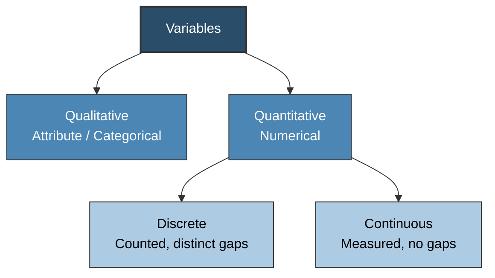

# Probability Foundations & Sampling Theory

> [!abstract] Curriculum & Syllabus Context
>
> - **Course:** ACC 303 Advanced Statistical Techniques
> - **Module:** Module 1: Probability Foundations & Sampling Theory
> - **Target Reading:** Lind, Marchal & Wathen (18e) Ch. 1 & 8; Kothari (2e) Ch. 1 & 4; Gujarati & Porter (5e) App. A (A.1–A.6)
> - **Syllabus Focus:** Population vs. sample, census vs. sample survey, qualitative vs. quantitative variables, 4 levels of measurement, probability & non-probability sampling designs (SRS, Systematic, Stratified Neyman allocation, Cluster), sampling vs. non-sampling errors, standard error of the mean, Finite Population Correction (FPC), and Central Limit Theorem (CLT).

---

### 1.1 What Is Statistics? Fundamental Concepts & Data Classification

#### 1. Definition of Statistics
> [!info] Key Definition
>
> Statistical analysis is fundamental to modern business decision-making and econometric modeling. The term **statistics** carries two distinct definitions based on context:
> * **Plural Sense ("statistics")**: Numerical facts, figures, or data collected for analysis (e.g., inflation rate of $2.5\%$, quarterly GDP growth of $3.1\%$, or average hourly wage of $\$27.56$).
> * **Singular Sense ("statistics")**: The scientific discipline and methodology concerning the collection, organization, presentation, analysis, and interpretation of data to assist in making effective decisions under conditions of uncertainty.

---

#### 2. Branches of Statistics: Descriptive vs. Inferential
Statistical methods are formally bifurcated into two primary branches based on research objectives and data availability:

* **Descriptive Statistics**: Statistical procedures and graphical techniques utilized to organize, summarize, and present raw numerical data in an informative, structured format. 
  * *Primary Tools*: Frequency tables, histograms, bar charts, pie charts, scatter plots, measures of location (mean, median, mode), and measures of dispersion (variance, standard deviation, interquartile range).
  * *Scope*: Confined strictly to the observed dataset; no probabilistic conclusions are extended to unobserved entities.

* **Inferential Statistics**: The body of statistical methods used to draw inferences, conclusions, or estimates about unknown population parameters based strictly on sample statistics.
  * *Primary Tools*: Probability distributions, point and interval estimation, parametric and non-parametric hypothesis testing, Analysis of Variance (ANOVA), and regression analysis.
  * *Scope*: Evaluates risks and uncertainty by applying probability theory to quantify the margin of error (sampling error) inherent in generalizing from a sample to an entire population.

---

#### 3. Population vs. Sample & Census vs. Sample Survey
To conduct empirical research, the domain of inquiry must be clearly conceptualized:

| **Dimension** | **Population (Universe)** | **Sample** |
| :--- | :--- | :--- |
| **Definition** | The complete set of all individuals, objects, or items possessing common characteristics under study. | A subset or portion of the population selected for empirical analysis. |
| **Size Symbol** | $N$ (Population size) | $n$ (Sample size) |
| **Numerical Measure** | **Parameter**: Fixed, unknown summary value (e.g., Mean $\mu$, Standard Deviation $\sigma$, Proportion $\pi$). | **Statistic**: Random variable computed from sample data (e.g., Mean $\bar{X}$, Std Dev $s$, Proportion $p$). |
| **Data Collection** | **Census**: Complete enumeration of every element. | **Sample Survey**: Investigation of the selected sample units. |

* **Methodological Trade-offs**:
  * A **Census** eliminates sampling error because every population unit is examined. However, for large or infinite populations, a census is economically prohibitive, time-consuming, physically impossible (e.g., measuring lifespan of industrial batteries), or destructive (e.g., blood testing). Furthermore, censuses accumulate non-sampling and administrative errors as $N$ grows.
  * A **Sample Survey** dramatically reduces data collection costs, accelerates research timelines, and allows deeper data probing. However, it introduces **sampling error** due to random variations between sample statistics and true population parameters.

---

#### 4. Scientific Classification of Variables

A **variable** is a quantity or characteristic that can take on different numerical values or categories across observations.
* **Qualitative (Attribute/Categorical) Variable**: A non-numeric characteristic where individual observations are classified into distinct categories (e.g., gender, PC brand preference, marital status, state of residence). Summarized using counts, frequencies, and percentages.
* **Quantitative Variable**: A variable that is expressed numerically.
  * **Discrete Quantitative Variable**: A variable that can assume only distinct, clearly separated integer values with "gaps" between possible values. Discrete variables typically arise from **counting** operations (e.g., number of bedrooms in a house: $1, 2, 3$; number of defective components per batch).
  * **Continuous Quantitative Variable**: A variable that can assume any real numerical value within a given continuous interval. Continuous variables result from **measuring** operations and depend on the precision of the measuring instrument (e.g., flight duration, atmospheric pressure, student GPA, body weight).

---
#### 5. The Four Levels of Measurement
The mathematical level of measurement determines the appropriate statistical tools, charts, and mathematical operations that can validly be applied to a variable.

| **Scale Level** | **Characteristics** | **Mathematical Operations** | **Permissible Statistics** | **Examples** |
| :--- | :--- | :--- | :--- | :--- |
| **1. Nominal** | Categories only; labels or names. No natural order or ranking. | Counting frequencies only. $=$ or $\neq$ | Mode, Chi-Square ($\chi^2$), Contingency Coefficient. | Gender, Eye color, Jersey numbers, Religion. |
| **2. Ordinal** | Relative ranking or rating. Distances between ranks unknown. | Order comparison. $>$ or $<$ | Median, Percentiles, Spearman Rank Correlation. | Class rank, Likert scale, Bond ratings (AAA, AA, A). |
| **3. Interval** | Equal distances between values. No natural zero (zero is arbitrary). | Addition, Subtraction. $+$ or $-$ | Mean, Std Dev, Variance, $t$-test, $F$-test, Pearson $r$. | Fahrenheit/Celsius temp, SAT scores, Dress size. |
| **4. Ratio** | Equal intervals PLUS absolute zero. Absence of attribute at zero. | All arithmetic operations. $\times$ and $\div$ | Geometric Mean, Coefficient of Variation, All advanced econometrics. | Monthly income, Distance, Weight, Production units. |

---
### 1.2 Research Methodology & Sampling Design
#### 1. The Research Process

Research in business and economics is a systematic, multi-step process designed to solve problems and establish empirical relationships.

---

#### 2. Key Steps in Developing a Sample Design
1. **Defining the Target Universe/Population**: Specifying whether the universe is finite ($N$ is known and countable) or infinite ($N$ is theoretically unlimited).
2. **Identifying the Sampling Unit**: Selecting the elementary unit to be sampled (e.g., geographic region, household, firm, or individual).
3. **Establishing the Sampling Frame (Source List)**: Constructing or obtaining a comprehensive, accurate list of all sampling units in the population.
4. **Determining Sample Size ($n$)**: Calculating an optimal sample size that balances statistical precision, confidence level, population variability, and cost.
5. **Selecting the Sampling Procedure**: Deciding between probability and non-probability sampling designs.

---

#### 3. Classification of Sampling Designs

##### A. Non-Probability Sampling Designs
Under non-probability sampling, elements do not have a known or equal probability of selection. Selection depends on human judgment or convenience:
* **Purposive / Judgment Sampling**: Items are selected deliberately by the researcher based on personal expertise and belief that the sample represents the population. 
  > [!warning] Limitation
  > Highly vulnerable to researcher bias; sampling error cannot be calculated.
* **Convenience Sampling**: Selecting population units that are easily accessible (e.g., surveying students in a single cafeteria). 
  > [!warning] Limitation
  > Generates severely biased results that cannot be generalized to broader populations.
* **Quota Sampling**: Interviewers are given specific quotas to fill across non-overlapping categories (e.g., 50 males, 50 females) but selection within quotas is left to interviewer discretion.

##### B. Probability Sampling Designs
Every element in the population has a known, non-zero probability of being included in the sample, ensuring unbiased estimation and allowing formal mathematical calculation of sampling error.

1. **Simple Random Sampling (SRS)**:
   * Each possible sample combination of size $n$ from a finite population $N$ has an equal probability of selection:
     $$P(\text{Sample}) = \frac{1}{\binom{N}{n}} = \frac{1}{\frac{N!}{n!(N-n)!}}$$
   * Implemented using lottery draws or computerized random number generators (e.g., Tippett's random number tables).

2. **Systematic Random Sampling**:
   * Elements are selected at equal numeric intervals through an ordered sampling frame.
   * **Procedure**: Calculate sampling interval $k = \frac{N}{n}$. Select a random starting integer $r$ between $1$ and $k$. The sample consists of elements:
     $$r, \; r+k, \; r+2k, \; r+3k, \; \dots, \; r+(n-1)k$$
   > [!warning] Critical Risk
   > If the sampling frame possesses a hidden periodic structure or cycle that matches $k$, the sample will suffer from severe systematic bias.

3. **Stratified Random Sampling**:
   * Used when a population is non-homogeneous. The population $N$ is divided into non-overlapping, internally homogeneous subgroups called **strata** ($N_1, N_2, \dots, N_k$). Independent simple random samples are drawn from each stratum.
   * **Proportional Allocation**: Stratum sample size $n_i$ is directly proportional to stratum population size $N_i$:
     $$n_i = n \cdot \left(\frac{N_i}{N}\right)$$
   * **Optimum (Neyman) Allocation**: Accounts for differences in both stratum size ($N_i$) and stratum variability ($\sigma_i$). Stratum sample size $n_i$ is computed as:
     $$n_i = n \cdot \frac{N_i \sigma_i}{\sum_{j=1}^k N_j \sigma_j}$$
     *(Allocates larger sample sizes to larger and more variable strata, minimizing the variance of the sample estimator for a fixed total sample size).*

4. **Cluster Sampling**:
   * The population is divided into naturally occurring, internally heterogeneous subgroups called **clusters** (e.g., geographic blocks, corporate branches). A random sample of clusters is chosen, and either all elements within chosen clusters are examined (one-stage) or simple random samples are drawn within chosen clusters (two-stage).
   * *Trade-off*: Highly cost-effective for geographically dispersed populations, but yields higher sampling error than SRS for a given sample size due to intra-cluster correlation.

5. **Area Sampling**: A primary form of cluster sampling where clusters are defined by geographical subdivisions (e.g., counties, census tracts).

6. **Multi-Stage Sampling**: Sequential random sampling across hierarchical levels in large-scale national surveys (e.g., Primary Stage: States $\rightarrow$ Secondary Stage: Districts $\rightarrow$ Tertiary Stage: Towns $\rightarrow$ Final Stage: Households).

7. **Sequential Sampling**: Sample size $n$ is not fixed prior to the survey; items are drawn sequentially until cumulative evidence satisfies a statistical decision rule under statistical quality control.

---

### 1.3 Sampling Errors, Standard Error, and Central Limit Theorem

#### 1. Sampling Error vs. Non-Sampling Error
* **Sampling Error**: The random variation or difference between a sample statistic ($\bar{X}$) and the true population parameter ($\mu$):
  $$\text{Sampling Error} = \bar{X} - \mu$$
  Sampling errors occur purely due to chance. The expected value of sampling error is zero. As sample size $n$ increases, sampling error decreases at the rate of $\frac{1}{\sqrt{n}}$.

* **Non-Sampling (Systematic) Error**: Errors caused by human mistake, flawed sampling frame, ambiguous survey questions, non-response bias, uncalibrated instruments, or incorrect data recording. Non-sampling errors do *not* decrease with larger sample sizes and can severely distort research conclusions.

---

#### 2. The Sampling Distribution of the Sample Mean
The **sampling distribution of the sample mean** is a probability distribution consisting of all possible sample means ($\bar{X}$) calculated from all possible random samples of a specified size $n$ drawn from a given population $N$.

##### Mathematical Properties of the Sampling Distribution:
1. **Expected Value (Unbiasedness)**: The mean of the sampling distribution of sample means ($\mu_{\bar{x}}$) is strictly equal to the true population mean ($\mu$):
   $$\mu_{\bar{x}} = E(\bar{X}) = \mu$$

2. **Standard Error of the Mean ($\sigma_{\bar{x}}$)**: The standard deviation of the sampling distribution of sample means, measuring the dispersion of sample estimates around the population mean:
   $$\sigma_{\bar{x}} = \frac{\sigma}{\sqrt{n}} \quad \text{(for infinite populations or sampling with replacement)}$$

---

#### 3. Finite Population Correction (FPC) Factor
When sampling is conducted **without replacement** from a finite population of size $N$, and the sample size $n$ constitutes more than $5\%$ of the population ($\frac{n}{N} > 0.05$), the standard error formula must be multiplied by the Finite Population Correction (FPC) factor:

> [!quote] Finite Population Correction (FPC)
>
> $$\text{FPC} = \sqrt{\frac{N - n}{N - 1}}$$
> $$\sigma_{\bar{x}} = \frac{\sigma}{\sqrt{n}} \cdot \sqrt{\frac{N - n}{N - 1}}$$

*Impact of FPC*: As the sample size $n$ approaches population size $N$, $\text{FPC} \to 0$, reflecting the fact that as $n \to N$, uncertainty vanishes and the sampling error approaches zero.

---

#### 4. The Central Limit Theorem (CLT)
> [!info] Fundamental Theorem: The Central Limit Theorem
>
> The Central Limit Theorem is the foundational theorem of inferential statistics and classical econometrics.
> 
> **Statement**: If random samples of size $n$ are selected from **any** population possessing a finite mean $\mu$ and a finite variance $\sigma^2$, as the sample size $n$ increases ($n \ge 30$), the sampling distribution of the sample mean $\bar{X}$ approaches a **normal distribution** with mean $\mu$ and variance $\frac{\sigma^2}{n}$, regardless of the structural shape of the underlying population probability distribution.
> 
> $$\bar{X} \xrightarrow{d} N\left(\mu, \; \frac{\sigma^2}{n}\right) \quad \text{as } n \to \infty$$

##### Standard Normal Transformation ($Z$-score) for Sample Means:
Using the CLT, any sample mean $\bar{X}$ from a large sample ($n \ge 30$) can be standardized into a standard normal random variable $Z \sim N(0,1)$:

$$Z = \frac{\bar{X} - \mu}{\sigma_{\bar{x}}} = \frac{\bar{X} - \mu}{\frac{\sigma}{\sqrt{n}}}$$

---

### 1.4 Mathematical Review of Probability Foundations & Random Variables

#### 1. Probability Definitions & Axioms
* **Sample Space ($S$)**: The set of all possible outcomes of a chance experiment.
* **Event ($A$)**: A specific subset of outcomes in $S$.
* **Axioms of Probability**:
  1. $0 \le P(A) \le 1$ for every event $A$.
  2. $P(S) = 1$.
  3. For mutually exclusive events $A_1, A_2, \dots$: $P\left(\bigcup_{i=1}^\infty A_i\right) = \sum_{i=1}^\infty P(A_i)$.

---

#### 2. Probability Density Functions (PDF)

##### A. Discrete Random Variable
A random variable $X$ taking distinct values $x_1, x_2, \dots$ with discrete PDF $f(x) = P(X = x)$:
$$f(x_i) \ge 0 \quad \forall i, \qquad \sum_{i=1}^\infty f(x_i) = 1$$

##### B. Continuous Random Variable
A random variable $X$ defined over a continuous interval with PDF $f(x)$:
$$f(x) \ge 0 \quad \forall x, \qquad \int_{-\infty}^{\infty} f(x) dx = 1, \qquad P(a \le X \le b) = \int_{a}^{b} f(x) dx$$
> [!warning] Exception / Rule
>
> *Fundamental Property*: For any continuous random variable, the probability of assuming an exact single value is zero: $P(X = c) = 0$.

---

#### 3. Bivariate & Joint Probability Density Functions
When two random variables $X$ and $Y$ are observed simultaneously:

* **Joint PDF $f(x,y)$**:
  * Discrete: $\sum_x \sum_y f(x,y) = 1$
  * Continuous: $\int_{-\infty}^{\infty} \int_{-\infty}^{\infty} f(x,y) \, dx \, dy = 1$

* **Marginal Probability Density Functions**:
  * Marginal PDF of $X$: $f(x) = \sum_y f(x,y)$ (discrete) or $f(x) = \int_{-\infty}^{\infty} f(x,y) \, dy$ (continuous).
  * Marginal PDF of $Y$: $f(y) = \sum_x f(x,y)$ (discrete) or $f(y) = \int_{-\infty}^{\infty} f(x,y) \, dx$ (continuous).

* **Conditional Probability Density Functions**:
  $$f(x|y) = \frac{f(x,y)}{f(y)} \quad \text{for } f(y) > 0, \qquad f(y|x) = \frac{f(x,y)}{f(x)} \quad \text{for } f(x) > 0$$

* **Statistical Independence**:
  Random variables $X$ and $Y$ are statistically independent if and only if their joint density equals the product of their marginal densities for all $(x,y)$:
  $$f(x,y) = f(x) \cdot f(y)$$

---

#### 4. Mathematical Expectations & Moments

##### A. Expected Value $E(X)$
* Discrete: $E(X) = \mu = \sum_x x \cdot f(x)$
* Continuous: $E(X) = \mu = \int_{-\infty}^{\infty} x \cdot f(x) \, dx$

##### B. Algebraic Properties of Expectations
1. $E(b) = b$ for any constant $b$.
2. $E(aX + b) = a E(X) + b$.
3. $E(X + Y) = E(X) + E(Y)$ (always holds, regardless of independence).
4. If $X$ and $Y$ are statistically independent: $E(XY) = E(X) \cdot E(Y)$.

##### C. Variance $\text{Var}(X) = \sigma^2$
$$\text{Var}(X) = \sigma^2 = E\left[(X - \mu)^2\right] = E(X^2) - [E(X)]^2$$
*Properties*:
* $\text{Var}(b) = 0$
* $\text{Var}(aX + b) = a^2 \text{Var}(X)$
* If $X$ and $Y$ are independent: $\text{Var}(aX + bY) = a^2 \text{Var}(X) + b^2 \text{Var}(Y)$.

##### D. Covariance $\text{Cov}(X,Y) = \sigma_{XY}$
$$\text{Cov}(X,Y) = E\left[(X - \mu_X)(Y - \mu_Y)\right] = E(XY) - E(X)E(Y)$$
If $X$ and $Y$ are independent, $\text{Cov}(X,Y) = 0$ (note: converse is not generally true unless $X,Y$ are bivariate normal).

##### E. Population Correlation Coefficient $\rho$
$$\rho = \frac{\text{Cov}(X,Y)}{\sigma_X \sigma_Y}, \qquad -1 \le \rho \le 1$$

##### F. Higher Central Moments, Skewness, and Kurtosis
* **$r$-th Central Moment**: $\mu_r = E\left[(X - \mu)^r\right]$
* **Skewness ($S$)**: Measures lack of symmetry (3rd standardized moment):
  $$S = \frac{E\left[(X - \mu)^3\right]}{\sigma^3}$$
  * $S = 0$: Symmetric distribution.
  * $S > 0$: Positively skewed (long right tail).
  * $S < 0$: Negatively skewed (long left tail).

* **Kurtosis ($K$)**: Measures peakness and tail-heaviness (4th standardized moment):
  $$K = \frac{E\left[(X - \mu)^4\right]}{\sigma^4}$$
  * $K = 3$: Mesokurtic (Standard Normal Distribution).
  * $K > 3$: Leptokurtic (Pied/slim peak, fat/heavy tails).
  * $K < 3$: Platykurtic (Flat peak, thin tails).

---

### 1.5 Theoretical Probability Distributions Summary

| **Distribution** | **PDF / PMF $f(x)$** | **Mean $E(X)$** | **Variance $\text{Var}(X)$** | **Key Properties / Notes** |
| :--- | :--- | :--- | :--- | :--- |
| **Normal $N(\mu, \sigma^2)$** | $\frac{1}{\sigma\sqrt{2\pi}} e^{-\frac{1}{2}\left(\frac{x-\mu}{\sigma}\right)^2}$ | $\mu$ | $\sigma^2$ | Symmetric, bell-shaped; $S=0, K=3$. $Z = \frac{X-\mu}{\sigma} \sim N(0,1)$. |
| **Chi-Square $\chi^2_k$** | Distribution of $\sum_{i=1}^k Z_i^2$   where $Z_i \stackrel{iid}{\sim} N(0,1)$ | $k$ | $2k$ | Non-negative, right-skewed;   approaches Normal as $k \to \infty$. |
| **Student's $t_k$** | $\frac{Z}{\sqrt{W/k}}, \; Z \sim N(0,1), W \sim \chi^2_k$ | $0 \; (k > 1)$ | $\frac{k}{k-2} \; (k > 2)$ | Symmetric, bell-shaped, heavy tails;  approaches $N(0,1)$ as $k \to \infty$. |
| **Fisher's $F_{k_1, k_2}$** | $\frac{W_1 / k_1}{W_2 / k_2}, \; W_1 \sim \chi^2_{k_1}, W_2 \sim \chi^2_{k_2}$ | $\frac{k_2}{k_2 - 2} \; (k_2 > 2)$ | Complex formula | Non-negative, right-skewed;   $F_{1, k} = t_k^2$. |
| **Binomial $B(n, p)$** | $\binom{n}{x} p^x (1-p)^{n-x}$   $x \in \{0, 1, \dots, n\}$ | $np$ | $np(1-p)$ | Discrete counts of success in $n$ trials;  approaches Normal as $n \to \infty$. |
| **Poisson $\text{Pois}(\lambda)$** | $\frac{e^{-\lambda} \lambda^x}{x!}, \; x \in \{0, 1, 2, \dots\}$ | $\lambda$ | $\lambda$ | Rare events per interval;  Mean equals Variance $= \lambda$. |

---

### 1.6 Step-by-Step Numerical Problem Walkthroughs with Full Solutions

> [!example] Numerical Problem 1: Stratified Sampling & Neyman Optimum Allocation
>
> **Context**: A business research institute needs to draw a sample of $n = 120$ firms from a total population of $N = 10,000$ companies categorized into three financial strata:
> * Stratum 1 (Large-cap): $N_1 = 2,000$, $\sigma_1 = 25$
> * Stratum 2 (Mid-cap): $N_2 = 3,000$, $\sigma_2 = 15$
> * Stratum 3 (Small-cap): $N_3 = 5,000$, $\sigma_3 = 10$
> 
> **Required**:
> 1. Compute the stratum sample sizes ($n_1, n_2, n_3$) under **Proportional Allocation**.
> 2. Compute the stratum sample sizes ($n_1, n_2, n_3$) under **Optimum (Neyman) Allocation**.
> 3. Provide the theoretical justification for why Neyman allocation differs from Proportional allocation.
> 
> ---
> 
> ##### Solution Walkthrough:
> 
> **Part 1: Proportional Allocation**
> Under proportional allocation, the proportion of elements sampled from each stratum equals the proportion of the population in that stratum:
> $$n_i = n \cdot \left(\frac{N_i}{N}\right)$$
> 
> * **Stratum 1**:
>   $$n_1 = 120 \cdot \left(\frac{2,000}{10,000}\right) = 120 \cdot 0.20 = 24$$
> * **Stratum 2**:
>   $$n_2 = 120 \cdot \left(\frac{3,000}{10,000}\right) = 120 \cdot 0.30 = 36$$
> * **Stratum 3**:
>   $$n_3 = 120 \cdot \left(\frac{5,000}{10,000}\right) = 120 \cdot 0.50 = 60$$
> * **Check**: $n_1 + n_2 + n_3 = 24 + 36 + 60 = 120$.
> 
> ---
> 
> **Part 2: Optimum (Neyman) Allocation**
> Under Neyman allocation, the sample size allocated to stratum $i$ is proportional to the product of stratum population size ($N_i$) and stratum standard deviation ($\sigma_i$):
> $$n_i = n \cdot \frac{N_i \sigma_i}{\sum_{j=1}^3 N_j \sigma_j}$$
> 
> * **Step 1: Compute $N_i \sigma_i$ for each stratum**:
>   * Stratum 1: $N_1 \sigma_1 = 2,000 \times 25 = 50,000$
>   * Stratum 2: $N_2 \sigma_2 = 3,000 \times 15 = 45,000$
>   * Stratum 3: $N_3 \sigma_3 = 5,000 \times 10 = 50,000$
>   * **Sum**: $\sum_{j=1}^3 N_j \sigma_j = 50,000 + 45,000 + 50,000 = 145,000$
> 
> * **Step 2: Compute $n_i$ for each stratum**:
>   * **Stratum 1**:
>     $$n_1 = 120 \cdot \frac{50,000}{145,000} = 120 \cdot 0.344828 = 41.38 \approx 41$$
>   * **Stratum 2**:
>     $$n_2 = 120 \cdot \frac{45,000}{145,000} = 120 \cdot 0.310345 = 37.24 \approx 37$$
>   * **Stratum 3**:
>     $$n_3 = 120 \cdot \frac{50,000}{145,000} = 120 \cdot 0.344828 = 41.38 \approx 42$$
> * **Check**: $41 + 37 + 42 = 120$.
> 
> ---
> 
> **Part 3: Theoretical Justification**
> Proportional allocation assigns sample size purely based on stratum size, ignoring internal variation. Neyman optimum allocation assigns a significantly larger sample size to Stratum 1 ($n_1 = 41$ vs $24$) because Stratum 1 exhibits much higher internal variability ($\sigma_1 = 25$ vs $\sigma_3 = 10$). By taking larger samples from more variable strata, Neyman allocation minimizes the overall variance of the stratified sample mean estimator $V(\bar{X}_{\text{st}})$ for a fixed total sample size $n$.

---

> [!example] Numerical Problem 2: Central Limit Theorem & Sampling Error Probability Analysis
>
> **Context**: An airline tracks the annual maintenance cost of commercial passenger jets. The population mean annual maintenance cost is $\mu = \$14,500$ with a population standard deviation of $\sigma = \$3,200$. The underlying distribution of maintenance costs across individual aircraft is strongly positively skewed. A simple random sample of $n = 64$ aircraft is selected.
> 
> **Required**:
> 1. Describe the shape of the sampling distribution of the sample mean $\bar{X}$ and state the governing statistical theorem.
> 2. Calculate the standard error of the sample mean ($\sigma_{\bar{x}}$).
> 3. Compute the probability that the sample mean maintenance cost $\bar{X}$ falls between $\$14,000$ and $\$15,300$.
> 4. Compute the probability that the sampling error $(\bar{X} - \mu)$ exceeds $\$500$ in absolute magnitude.
> 
> ---
> 
> ##### Solution Walkthrough:
> 
> **Part 1: Shape of the Sampling Distribution**
> Although the underlying population distribution is positively skewed, the sample size $n = 64$ exceeds 30 ($n \ge 30$). By the **Central Limit Theorem (CLT)**, the sampling distribution of the sample mean $\bar{X}$ is approximately normal:
> $$\bar{X} \sim N\left(\mu = 14,500, \; \sigma_{\bar{x}}^2 = \frac{3,200^2}{64}\right)$$
> 
> ---
> 
> **Part 2: Standard Error Calculation**
> $$\sigma_{\bar{x}} = \frac{\sigma}{\sqrt{n}} = \frac{3,200}{\sqrt{64}} = \frac{3,200}{8} = 400$$
> The standard error of the mean is **$\$400$**.
> 
> ---
> 
> **Part 3: Probability $P(\$14,000 \le \bar{X} \le \$15,300)$**
> * **Step 1: Standardize lower boundary $\bar{X}_1 = 14,000$ into $Z_1$**:
>   $$Z_1 = \frac{\bar{X}_1 - \mu}{\sigma_{\bar{x}}} = \frac{14,000 - 14,500}{400} = \frac{-500}{400} = -1.25$$
> 
> * **Step 2: Standardize upper boundary $\bar{X}_2 = 15,300$ into $Z_2$**:
>   $$Z_2 = \frac{\bar{X}_2 - \mu}{\sigma_{\bar{x}}} = \frac{15,300 - 14,500}{400} = \frac{800}{400} = +2.00$$
> 
> * **Step 3: Evaluate probabilities using Standard Normal Tables**:
>   * Area between $Z = -1.25$ and $Z = 0$: $P(-1.25 \le Z \le 0) = 0.3944$
>   * Area between $Z = 0$ and $Z = +2.00$: $P(0 \le Z \le 2.00) = 0.4772$
>   * Total Probability:
>     $$P(-1.25 \le Z \le 2.00) = 0.3944 + 0.4772 = 0.8716 \quad (87.16\%)$$
> 
> ---
> 
> **Part 4: Probability that Sampling Error Exceeds $\$500$**
> Sampling error is defined as $|\bar{X} - \mu| > 500$, which implies:
> $$\bar{X} < 14,000 \quad \text{or} \quad \bar{X} > 15,000$$
> 
> * **Standardize $\bar{X} = 14,000$**: $Z = \frac{14,000 - 14,500}{400} = -1.25$
> * **Standardize $\bar{X} = 15,000$**: $Z = \frac{15,000 - 14,500}{400} = +1.25$
> 
> * **Compute tail probabilities**:
>   * $P(Z < -1.25) = 0.5000 - 0.3944 = 0.1056$
>   * $P(Z > +1.25) = 0.5000 - 0.3944 = 0.1056$
>   * Combined tail probability:
>     $$P(|\bar{X} - \mu| > 500) = 0.1056 + 0.1056 = 0.2112 \quad (21.12\%)$$
