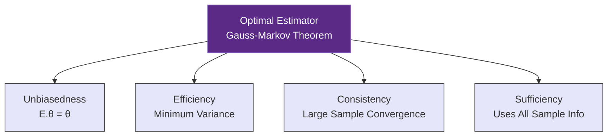
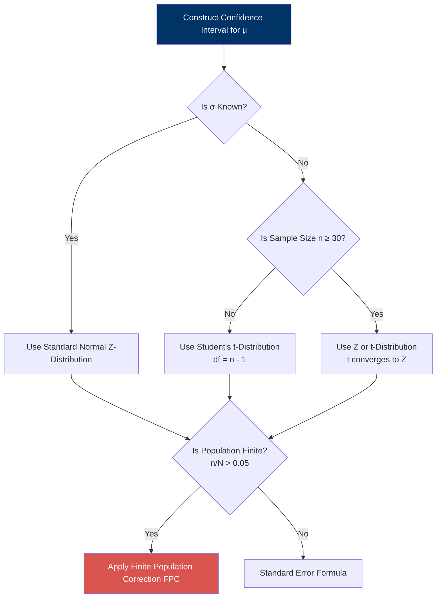

# Estimation Theory & Sample Size Determination

> [!abstract] Curriculum & Syllabus Context
>
> - **Course:** ACC 303 Advanced Statistical Techniques
> - **Module:** Module 2: Estimation Theory & Sample Size Determination
> - **Target Reading:** Gujarati & Porter (5e) App. A (A.7); Lind, Marchal & Wathen (18e) Ch. 9; Kothari (2e) Ch. 8
> - **Syllabus Focus:** Point vs. interval estimation, BLUE properties (unbiasedness, efficiency, consistency, sufficiency), Gauss-Markov theorem foundations, confidence intervals for population means (sigma known vs. unknown t-distribution), finite population adjustments, population proportions, and sample size determination for means and proportions.

---

### 1. Theoretical Foundations of Point & Interval Estimation

In statistical inference, researchers utilize sample data to make generalizable statements or conclusions about unknown population parameters. Classical statistical inference comprises two fundamental branches: **Estimation** and **Hypothesis Testing**.

#### Point Estimator vs. Point Estimate
> [!info] Key Definition
>
> - **Point Estimator**: A point estimator is a mathematical function, statistic, or rule derived from sample observations that is used to calculate a single numerical value estimating an unknown population parameter $\theta$. Formally, an estimator is represented as a random variable $\hat{\theta} = f(X_1, X_2, \dots, X_n)$, which varies across repeated random samples.
> - **Point Estimate**: A point estimate is the specific numerical value generated by evaluating the point estimator formula using a concrete, realized sample of data. For example, if the point estimator for the population mean $\mu$ is the sample mean $\bar{x} = \frac{1}{n} \sum_{i=1}^{n} x_i$, and a sample of $n=50$ yields a value of $45.4$, then $\bar{x}$ is the point estimator and $45.4$ is the point estimate.

#### Interval Estimator vs. Confidence Interval
> [!info] Key Definition
>
> - **Interval Estimator**: An interval estimator is a rule or formula that uses sample statistics to construct a random numerical interval $(\hat{\theta}_{L}, \hat{\theta}_{U})$ around the estimator. This interval has a specified probability $(1- \alpha)$ of enclosing the true, unobserved population parameter $\theta$:
> $$P(\hat{\theta}_{L} \le \theta \le \hat{\theta}_{U}) = 1 - \alpha$$
> where $\hat{\theta}_{L} = \hat{\theta} - \delta$ represents the lower confidence limit, $\hat{\theta}_{U} = \hat{\theta} + \delta$ represents the upper confidence limit, $1- \alpha$ is the **confidence coefficient** (or confidence level), and $\alpha$ ($0 < \alpha < 1$) is the **level of significance** (the probability of committing a Type I error).
> - **Confidence Interval**: Once a specific sample is drawn and numerical values are calculated for $\hat{\theta}_{L}$ and $\hat{\theta}_{U}$ (e.g., $\$44,846 \le \mu \le \$45,994$), the interval is no longer random; it is fixed.

#### Long-Run Frequency Interpretation of Confidence Intervals
> [!warning] Exam Pitfall / Exception
>
> Because population parameter $\theta$ is a fixed (though unknown) constant, it is mathematically incorrect to state that "there is a $95\%$ probability that the true population mean lies between $\$44,846$ and $\$45,994$." Once numerical limits are evaluated:
> - The parameter $\theta$ either lies inside the fixed numerical interval or it does not. Therefore, the probability statement is strictly $1$ or $0$.
> - The $95\%$ confidence level refers to the **long-run frequency property of the estimation methodology**: If an infinite number of random samples of size $n$ were drawn from the same population and a $95\%$ confidence interval were constructed for each sample using the same formula, $95\%$ of those constructed random intervals would successfully contain the true population parameter $\theta$, while $5\%$ would fail to enclose it due to sampling variability.

---

### 2. Desirable Properties of Estimators (BLUE Criteria)

To choose the optimal estimator among competing sample statistics, econometricians and mathematical statisticians evaluate estimators against four primary statistical criteria: **Unbiasedness**, **Efficiency**, **Consistency**, and **Sufficiency**. An estimator meeting these criteria is classified as a **Best Linear Unbiased Estimator (BLUE)** under the **Gauss-Markov Theorem**.

---
#### Property 1: Unbiasedness
An estimator $\hat{\theta}$ is said to be an **unbiased estimator** of a population parameter $\theta$ if the expected value (mean of the sampling distribution) of $\hat{\theta}$ equals $\theta$ across repeated sampling of size $n$:
$$E(\hat{\theta}) = \theta \quad \text{or} \quad E(\hat{\theta}) - \theta = 0$$

If $E(\hat{\theta}) \neq \theta$, the estimator possesses a **bias**, defined mathematically as:
$$\text{Bias}(\hat{\theta}) = E(\hat{\theta}) - \theta$$

> [!quote] Formula & Derivation: Proof that Sample Mean ($\bar{x}$) is an Unbiased Estimator of Population Mean ($\mu$)
>
> Let $x_1, x_2, \dots, x_n$ be an independent and identically distributed (i.i.d.) random sample drawn from a population with mean $E(x_i) = \mu$ and variance $\text{Var}(x_i) = \sigma^2$.
> The sample mean estimator is defined as:
> $$\bar{x} = \frac{1}{n} \sum_{i=1}^{n} x_i$$
> Taking the mathematical expectation operator $E(\cdot)$ on both sides:
> $$E(\bar{x}) = E\left( \frac{1}{n} \sum_{i=1}^{n} x_i \right)$$
> By the linearity property of expectations, constants can be factored out, and expectation distributes over sums:
> $$E(\bar{x}) = \frac{1}{n} \sum_{i=1}^{n} E(x_i)$$
> Since each $x_i$ is drawn from the population with mean $E(x_i) = \mu$:
> $$E(\bar{x}) = \frac{1}{n} \sum_{i=1}^{n} \mu = \frac{1}{n} (n \cdot \mu) = \mu$$
> Thus, $E(\bar{x}) = \mu$, proving that the sample mean $\bar{x}$ is a strictly unbiased estimator of $\mu$ for any sample size $n$.

> [!quote] Formula & Derivation: Proof that Unadjusted Sample Variance $S^2 = \frac{\sum (x_i - \bar{x})^2}{n}$ is Biased, and $s^2 = \frac{\sum (x_i - \bar{x})^2}{n-1}$ is Unbiased
>
> Consider the unadjusted sample variance estimator $S^2 = \frac{1}{n} \sum_{i=1}^{n} (x_i - \bar{x})^2$.
> Express $x_i - \bar{x}$ relative to the true population mean $\mu$:
> $$x_i - \bar{x} = (x_i - \mu) - (\bar{x} - \mu)$$
> Squaring both sides:
> $$(x_i - \bar{x})^2 = [(x_i - \mu) - (\bar{x} - \mu)]^2 = (x_i - \mu)^2 - 2(x_i - \mu)(\bar{x} - \mu) + (\bar{x} - \mu)^2$$
> Summing across all $i = 1, \dots, n$:
> $$\sum_{i=1}^{n} (x_i - \bar{x})^2 = \sum_{i=1}^{n} (x_i - \mu)^2 - 2(\bar{x} - \mu)\sum_{i=1}^{n} (x_i - \mu) + n(\bar{x} - \mu)^2$$
> Note that $\sum_{i=1}^{n} (x_i - \mu) = n(\bar{x} - \mu)$. Substituting this in:
> $$\sum_{i=1}^{n} (x_i - \bar{x})^2 = \sum_{i=1}^{n} (x_i - \mu)^2 - 2n(\bar{x} - \mu)^2 + n(\bar{x} - \mu)^2 = \sum_{i=1}^{n} (x_i - \mu)^2 - n(\bar{x} - \mu)^2$$
> Now, take the mathematical expectation of the sum of squared deviations:
> $$E\left[ \sum_{i=1}^{n} (x_i - \bar{x})^2 \right] = \sum_{i=1}^{n} E[(x_i - \mu)^2] - n E[(\bar{x} - \mu)^2]$$
> By definition, $E[(x_i - \mu)^2] = \text{Var}(x_i) = \sigma^2$, and $E[(\bar{x} - \mu)^2] = \text{Var}(\bar{x}) = \frac{\sigma^2}{n}$. Therefore:
> $$E\left[ \sum_{i=1}^{n} (x_i - \bar{x})^2 \right] = \sum_{i=1}^{n} \sigma^2 - n \left( \frac{\sigma^2}{n} \right) = n\sigma^2 - \sigma^2 = (n - 1)\sigma^2$$
> Now evaluate the expected value of the unadjusted sample variance $S^2 = \frac{1}{n} \sum_{i=1}^{n} (x_i - \bar{x})^2$:
> $$E(S^2) = \frac{1}{n} E\left[ \sum_{i=1}^{n} (x_i - \bar{x})^2 \right] = \frac{n-1}{n} \sigma^2 = \sigma^2 - \frac{1}{n} \sigma^2$$
> This proves that $S^2$ is **biased downward** in small samples by a factor of $\frac{n-1}{n}$.
> To eliminate this bias, define the adjusted sample variance $s^2$ using $n-1$ degrees of freedom in the denominator:
> $$s^2 = \frac{1}{n-1} \sum_{i=1}^{n} (x_i - \bar{x})^2$$
> Taking its expectation:
> $$E(s^2) = \frac{1}{n-1} E\left[ \sum_{i=1}^{n} (x_i - \bar{x})^2 \right] = \frac{1}{n-1} (n - 1)\sigma^2 = \sigma^2$$
> Hence, $s^2$ is an unbiased estimator of $\sigma^2$.

##### Asymptotic Unbiasedness
An estimator $\hat{\theta}_n$ is **asymptotically unbiased** if the limit of its expectation as sample size $n$ approaches infinity equals $\theta$:
$$\lim_{n \to \infty} E(\hat{\theta}_n) = \theta$$
For the unadjusted sample variance $S^2$:
$$\lim_{n \to \infty} E(S^2) = \lim_{n \to \infty} \left( \frac{n-1}{n} \sigma^2 \right) = \sigma^2 \lim_{n \to \infty} \left( 1 - \frac{1}{n} \right) = \sigma^2 (1 - 0) = \sigma^2$$
Thus, while $S^2$ is biased in finite samples, it is asymptotically unbiased.

---
#### Property 2: Efficiency (Minimum Variance Criterion)
If $\hat{\theta}_1$ and $\hat{\theta}_2$ are two competing unbiased estimators of parameter $\theta$, $\hat{\theta}_1$ is defined as **more efficient** than $\hat{\theta}_2$ if its sampling variance is strictly smaller:
$$\text{Var}(\hat{\theta}_1) < \text{Var}(\hat{\theta}_2)$$
An unbiased estimator that achieves the lowest possible variance among all unbiased estimators is called the **most efficient** or **minimum-variance unbiased estimator (MVUE)**.
##### Minimum Mean-Squared Error (MSE) Criterion
When comparing biased and unbiased estimators, efficiency is generalized via Mean Squared Error:
$$\text{MSE}(\hat{\theta}) = E[(\hat{\theta} - \theta)^2]$$
We expand $\text{MSE}(\hat{\theta})$ by adding and subtracting $E(\hat{\theta})$:
$$\text{MSE}(\hat{\theta}) = E\left[ \{ (\hat{\theta} - E(\hat{\theta})) + (E(\hat{\theta}) - \theta) \}^2 \right]$$
$$\text{MSE}(\hat{\theta}) = E\left[ (\hat{\theta} - E(\hat{\theta}))^2 \right] + E\left[ (E(\hat{\theta}) - \theta)^2 \right] + 2 E\left[ (\hat{\theta} - E(\hat{\theta}))(E(\hat{\theta}) - \theta) \right]$$
Since $(E(\hat{\theta}) - \theta)$ is a constant, $E[\hat{\theta} - E(\hat{\theta})] = E(\hat{\theta}) - E(\hat{\theta}) = 0$, making the cross-product term drop out:
$$\text{MSE}(\hat{\theta}) = \text{Var}(\hat{\theta}) + [\text{Bias}(\hat{\theta})]^2$$
The MSE criterion allows a researcher to accept a small amount of bias if it dramatically reduces sampling variance, achieving a lower overall $\text{MSE}$.

---
#### Property 3: Consistency
Consistency is a **large-sample (asymptotic)** property. An estimator $\hat{\theta}_n$ is a **consistent estimator** of parameter $\theta$ if the probability distribution of $\hat{\theta}_n$ collapses around $\theta$ as sample size $n$ increases indefinitely. Formally:
$$\lim_{n \to \infty} P(|\hat{\theta}_n - \theta| < \epsilon) = 1 \quad \text{for any } \epsilon > 0$$
In probability limit notation:
$$\text{plim}_{n \to \infty} \hat{\theta}_n = \theta$$
##### Sufficient Conditions for Consistency
An estimator $\hat{\theta}_n$ is consistent if both its bias and its variance approach zero as $n \to \infty$:
1. $\lim_{n \to \infty} \text{Bias}(\hat{\theta}_n) = 0$
2. $\lim_{n \to \infty} \text{Var}(\hat{\theta}_n) = 0$
##### Consistency of Sample Mean ($\bar{x}$)
1. $\text{Bias}(\bar{x}) = 0$ for all $n$, so $\lim_{n \to \infty} \text{Bias}(\bar{x}) = 0$.
2. $\text{Var}(\bar{x}) = \frac{\sigma^2}{n}$, so $\lim_{n \to \infty} \text{Var}(\bar{x}) = \lim_{n \to \infty} \frac{\sigma^2}{n} = 0$.
Since both conditions hold, $\bar{x}$ is a consistent estimator of $\mu$ (demonstrating the **Weak Law of Large Numbers**).
##### Slutsky Property (Invariance Property of Consistency)
Unlike expected values (where $E[g(\hat{\theta})] \neq g(E[\hat{\theta}])$ for non-linear functions $g$), probability limits preserve non-linear transformations:
If $\text{plim}(\hat{\theta}_n) = \theta$, then for any continuous function $g(\hat{\theta}_n)$:
$$\text{plim}[g(\hat{\theta}_n)] = g(\theta)$$
For instance, if $s^2$ is a consistent estimator of $\sigma^2$, then $s = \sqrt{s^2}$ is a consistent estimator of $\sigma$.

---
#### Property 4: Sufficiency
An estimator $\hat{\theta}$ is **sufficient** if it utilizes all the information regarding the parameter $\theta$ contained in the sample, such that no other estimator calculated from the same sample can provide additional information about $\theta$.
By the **Neyman-Fisher Factorization Theorem**, a statistic $\hat{\theta} = t(X)$ is sufficient for $\theta$ if and only if the joint probability density function $f(x_1, \dots, x_n; \theta)$ can be factored into two non-negative functions:
$$f(x_1, \dots, x_n; \theta) = g(t(x), \theta) \cdot h(x_1, \dots, x_n)$$
where $h(x_1, \dots, x_n)$ does not depend on the parameter $\theta$, and $g(t(x), \theta)$ depends on $x$ only through the statistic $t(x)$.

---
#### Gauss-Markov Theorem and BLUE Criteria
Under the assumptions of the **Classical Linear Regression Model (CLRM)**, an estimator $\hat{\theta}$ is a **Best Linear Unbiased Estimator (BLUE)** if:
1. **Linearity**: It is a linear combination of the sample observations $Y_i$ (e.g., $\hat{\theta} = \sum k_i Y_i$).
2. **Unbiasedness**: Its expected value equals the true parameter ($E(\hat{\theta}) = \theta$).
3. **Efficiency (Best)**: It possesses the minimum variance among the entire class of linear unbiased estimators.

---
### 3. Confidence Intervals for Population Means ($\mu$)

The construction of confidence intervals for a population mean depends on two crucial factors:
1. Whether the population standard deviation $\sigma$ is **known** or **unknown**.
2. Whether the population is **infinite** or **finite** (requiring the Finite Population Correction factor).

---

#### Case A: Population Standard Deviation ($\sigma$) Known
When $\sigma$ is known (from historical operational data or long-term quality control baselines), and either the underlying population is normally distributed or $n \ge 30$ (invoking the Central Limit Theorem), the sampling distribution of the sample mean $\bar{x}$ is normally distributed:
$$\bar{x} \sim N\left(\mu, \sigma_{\bar{x}}^2\right), \quad \text{where } \sigma_{\bar{x}} = \frac{\sigma}{\sqrt{n}}$$

Standardizing $\bar{x}$ yields the Standard Normal test statistic $Z$:
$$Z = \frac{\bar{x} - \mu}{\sigma / \sqrt{n}} \sim N(0, 1)$$

> [!quote] Formula & Derivation: Derivation of the Confidence Interval
>
> Starting with the probability statement under $N(0,1)$:
> $$P\left( -z_{\alpha/2} \le Z \le z_{\alpha/2} \right) = 1 - \alpha$$
> Substitute $Z = \frac{\bar{x} - \mu}{\sigma / \sqrt{n}}$:
> $$P\left( -z_{\alpha/2} \le \frac{\bar{x} - \mu}{\sigma / \sqrt{n}} \le z_{\alpha/2} \right) = 1 - \alpha$$
> Multiply all terms by the standard error $\frac{\sigma}{\sqrt{n}}$:
> $$P\left( -z_{\alpha/2} \frac{\sigma}{\sqrt{n}} \le \bar{x} - \mu \le z_{\alpha/2} \frac{\sigma}{\sqrt{n}} \right) = 1 - \alpha$$
> Subtract $\bar{x}$ from all terms:
> $$P\left( -\bar{x} - z_{\alpha/2} \frac{\sigma}{\sqrt{n}} \le -\mu \le -\bar{x} + z_{\alpha/2} \frac{\sigma}{\sqrt{n}} \right) = 1 - \alpha$$
> Multiply the entire inequality by $-1$ (which reverses the inequality signs):
> $$P\left( \bar{x} - z_{\alpha/2} \frac{\sigma}{\sqrt{n}} \le \mu \le \bar{x} + z_{\alpha/2} \frac{\sigma}{\sqrt{n}} \right) = 1 - \alpha$$

##### General Formula ($\sigma$ Known)
$$\text{CI}_{1-\alpha} = \bar{x} \pm z_{\alpha/2} \frac{\sigma}{\sqrt{n}}$$
where:
- $\bar{x}$ is the point estimate of the population mean.
- $z_{\alpha/2}$ is the critical $Z$-value leaving an area of $\alpha/2$ in each tail of $N(0,1)$.
- $E = z_{\alpha/2} \frac{\sigma}{\sqrt{n}}$ is the **Margin of Error**.

##### Standard Critical $Z$-Values
- $90\%$ Confidence Level ($\alpha = 0.10, \alpha/2 = 0.05$): $z_{0.05} = 1.645$
- $95\%$ Confidence Level ($\alpha = 0.05, \alpha/2 = 0.025$): $z_{0.025} = 1.960$
- $99\%$ Confidence Level ($\alpha = 0.01, \alpha/2 = 0.005$): $z_{0.005} = 2.576$

---

#### Case B: Population Standard Deviation ($\sigma$) Unknown ($t$-Distribution)
When $\sigma$ is unknown, the sample standard deviation $s = \sqrt{\frac{\sum (x_i - \bar{x})^2}{n-1}}$ must be used as a point estimate for $\sigma$.
Substituting $s$ for $\sigma$ converts the standard normal variate into **Student's $t$-statistic**:
$$t = \frac{\bar{x} - \mu}{s / \sqrt{n}}$$

##### Properties of Student's $t$-Distribution (William S. Gosset)
1. **Continuous and Symmetric**: Like $N(0,1)$, the $t$-distribution is continuous, bell-shaped, and symmetric around its mean of $0$.
2. **Dispersion / Heavy Tails**: It is more spread out than $N(0,1)$, having higher probability density in the tails because substituting the random variable $s$ for constant $\sigma$ introduces additional sampling uncertainty.
3. **Degrees of Freedom ($df$)**: The shape of $t$ depends uniquely on $df = n - 1$.
4. **Asymptotic Convergence**: As $n \to \infty$ ($df \to \infty$), $s \to \sigma$, and the $t$-distribution converges to the standard normal distribution $N(0,1)$.

> [!quote] General Formula ($\sigma$ Unknown)
>
> $$\text{CI}_{1-\alpha} = \bar{x} \pm t_{\alpha/2, n-1} \frac{s}{\sqrt{n}}$$
> where $t_{\alpha/2, n-1}$ is the critical value from the $t$-table corresponding to tail area $\alpha/2$ and $df = n - 1$.

---

#### Case C: Finite Population Correction (FPC) Factor
When sampling is conducted **without replacement** from a **finite population** of size $N$, and the sample size $n$ exceeds $5\%$ of the population ($n/N > 0.05$), the observations are no longer independent. The variance of the sample mean is reduced because a substantial proportion of the population has been sampled.

> [!quote] Adjusted Confidence Intervals (Finite Population)
>
> **The Finite Population Correction (FPC) Factor**
> $$\text{FPC} = \sqrt{\frac{N - n}{N - 1}}$$
> 
> **If $\sigma$ is known**:
> $$\text{CI}_{1-\alpha} = \bar{x} \pm z_{\alpha/2} \frac{\sigma}{\sqrt{n}} \sqrt{\frac{N - n}{N - 1}}$$
> 
> **If $\sigma$ is unknown**:
> $$\text{CI}_{1-\alpha} = \bar{x} \pm t_{\alpha/2, n-1} \frac{s}{\sqrt{n}} \sqrt{\frac{N - n}{N - 1}}$$

---

### 4. Confidence Intervals for Population Proportions ($\pi$ or $p$)

When analyzing qualitative or categorical variables (e.g., defective vs. non-defective, vote yes vs. no), interest centers on estimating the **population proportion** $\pi$.

#### Binomial Assumptions & Normal Approximation Conditions
A proportion estimation problem adheres to a Binomial probability distribution if:
1. The sample data consist of counts of $x$ successes in $n$ independent trials.
2. Each trial has only two mutually exclusive outcomes (Success vs. Failure).
3. The probability of success $\pi$ remains constant across trials.
4. Sampling satisfies $n\pi \ge 5$ and $n(1-\pi) \ge 5$ (or $np \ge 5$ and $n(1-p) \ge 5$), allowing the Central Limit Theorem to approximate the binomial distribution with a continuous Normal distribution.

> [!quote] Standard Error & Confidence Interval for Proportions
>
> **Point Estimator**: $p = \frac{x}{n}$
> **Standard Error of Proportion**: $s_p = \sqrt{\frac{p(1-p)}{n}}$
> 
> **General Confidence Interval**:
> $$\text{CI}_{1-\alpha} = p \pm z_{\alpha/2} \sqrt{\frac{p(1-p)}{n}}$$
> 
> **Adjusted Formula for Finite Populations ($n/N > 0.05$)**:
> $$\text{CI}_{1-\alpha} = p \pm z_{\alpha/2} \sqrt{\frac{p(1-p)}{n}} \sqrt{\frac{N - n}{N - 1}}$$

---

### 5. Mathematical Sample Size Determination

A critical stage in research design is determining the optimal sample size $n$ required to achieve a target precision (acceptable margin of error $E$) at a specified confidence level $(1-\alpha)$.

---

#### 1. Sample Size for Estimating Population Mean ($\mu$)
To derive $n$, set the margin of error formula equal to $E$:
$$E = z_{\alpha/2} \frac{\sigma}{\sqrt{n}}$$
Multiply both sides by $\sqrt{n}$:
$$E \cdot \sqrt{n} = z_{\alpha/2} \cdot \sigma$$
Divide by $E$:
$$\sqrt{n} = \frac{z_{\alpha/2} \cdot \sigma}{E}$$

> [!quote] Target Sample Size ($n$) Formula
>
> $$n = \left( \frac{z_{\alpha/2} \cdot \sigma}{E} \right)^2$$
> 
> **Sample Size Formula for Finite Population ($\mu$)**:
> $$n = \frac{z_{\alpha/2}^2 \cdot N \cdot \sigma^2}{(N - 1)E^2 + z_{\alpha/2}^2 \cdot \sigma^2}$$

##### Estimating Population Standard Deviation ($\sigma$) when Unknown
1. **Pilot Study**: Conduct a small preliminary study ($n_0 \ge 30$) and use sample standard deviation $s$.
2. **Comparable Studies**: Use reported standard deviations from prior historical research.
3. **Range Rule of Thumb**: Under the Empirical Rule, $99.73\%$ of observations lie within $\mu \pm 3\sigma$ (a span of $6\sigma$). Thus:
$$\sigma \approx \frac{\text{Estimated Range}}{6} = \frac{\text{Maximum} - \text{Minimum}}{6}$$

---

#### 2. Sample Size for Estimating Population Proportion ($\pi$)
Set the proportion margin of error equal to $E$:
$$E = z_{\alpha/2} \sqrt{\frac{\pi(1-\pi)}{n}}$$

> [!quote] Target Sample Size ($n$) for Proportions
>
> $$n = \pi(1-\pi) \left( \frac{z_{\alpha/2}}{E} \right)^2$$
> 
> **Sample Size Formula for Finite Population ($\pi$)**:
> $$n = \frac{z_{\alpha/2}^2 \cdot p \cdot (1-p) \cdot N}{(N - 1)E^2 + z_{\alpha/2}^2 \cdot p \cdot (1-p)}$$

##### Conservative / Maximum Sample Size Rule
> [!warning] Exam Pitfall / Exception
>
> Because the variance $\pi(1-\pi)$ achieves its mathematical maximum at $\pi = 0.50$:
> $$\max \left[ \pi(1-\pi) \right] = (0.50)(1 - 0.50) = 0.25$$
> If no historical estimate or pilot data exists for $\pi$, set $p = 0.50$. This yields the most conservative (largest) required sample size, guaranteeing that the specified margin of error $E$ will not be exceeded regardless of the true $\pi$:
> $$n_{\text{conservative}} = 0.25 \left( \frac{z_{\alpha/2}}{E} \right)^2$$
> *Note: Any fractional result for sample size calculations must always be rounded **up** to the nearest whole integer (e.g., $384.16 \to 385$).*

---

### 6. Comprehensive Numerical Problem Walkthroughs with Full Solutions

---

> [!example] Numerical Problem 1: Confidence Interval for Mean ($\sigma$ Known & Finite Population)
>
> **Scenario**: A regional bank manages a finite population of $N = 250$ commercial loan accounts. A random sample of $n = 40$ accounts is drawn without replacement. The sample mean loan balance is $\bar{x} = \$450,000$. From long-term historical records, the population standard deviation is known to be $\sigma = \$75,000$.
> **Task**: Construct a $90\%$ confidence interval for the true mean loan balance $\mu$ across all 250 accounts.
> 
> ##### Step-by-Step Solution:
> 1. **Check Finite Population Correction Condition**:
>    $$\frac{n}{N} = \frac{40}{250} = 0.16 \quad (16\% > 5\%)$$
>    Since $n/N > 0.05$, the FPC factor must be applied.
> 
> 2. **Identify Critical $Z$-Value**:
>    For a $90\%$ confidence level ($1-\alpha = 0.90, \alpha = 0.10, \alpha/2 = 0.05$):
>    $$z_{0.05} = 1.645$$
> 
> 3. **Calculate Unadjusted Standard Error**:
>    $$\sigma_{\bar{x}} = \frac{\sigma}{\sqrt{n}} = \frac{75,000}{\sqrt{40}} = \frac{75,000}{6.324555} = 11,858.541$$
> 
> 4. **Calculate Finite Population Correction Factor**:
>    $$\text{FPC} = \sqrt{\frac{N - n}{N - 1}} = \sqrt{\frac{250 - 40}{250 - 1}} = \sqrt{\frac{210}{249}} = \sqrt{0.843373} = 0.918353$$
> 
> 5. **Calculate Adjusted Margin of Error ($E$)**:
>    $$E = z_{\alpha/2} \cdot \frac{\sigma}{\sqrt{n}} \cdot \text{FPC} = (1.645) \cdot (11,858.541) \cdot (0.918353) = 17,914.49$$
> 
> 6. **Evaluate Confidence Interval Limits**:
>    $$\text{Lower Limit} = \bar{x} - E = 450,000 - 17,914.49 = \$432,085.51$$
>    $$\text{Upper Limit} = \bar{x} + E = 450,000 + 17,914.49 = \$467,914.49$$
> 
> 7. **Conclusion**:
>    We are $90\%$ confident that the true population mean commercial loan balance for all 250 accounts lies between **$\$432,085.51$** and **$\$467,914.49$**.

---

> [!example] Numerical Problem 2: Confidence Interval for Mean ($\sigma$ Unknown, Small Sample $t$-Distribution)
>
> **Scenario**: A tire manufacturer investigates the remaining tread depth of its tires after 50,000 miles. A random sample of $n = 10$ tires reveals:
> - Sample Mean ($\bar{x}$) = $0.32$ inches
> - Sample Standard Deviation ($s$) = $0.09$ inches
> **Task**: Construct a $95\%$ confidence interval for the population mean tread depth $\mu$.
> 
> ##### Step-by-Step Solution:
> 1. **Identify Distribution and Degrees of Freedom**:
>    Since $\sigma$ is unknown and sample size is small ($n = 10 < 30$), use Student's $t$-distribution with $df = n - 1 = 10 - 1 = 9$.
> 
> 2. **Find Critical $t$-Value**:
>    For $95\%$ confidence ($1-\alpha = 0.95, \alpha = 0.05$) two-tailed test with $df = 9$:
>    $$t_{0.025, 9} = 2.262$$
> 
> 3. **Calculate Standard Error of the Mean**:
>    $$s_{\bar{x}} = \frac{s}{\sqrt{n}} = \frac{0.09}{\sqrt{10}} = \frac{0.09}{3.162278} = 0.0284605 \text{ inches}$$
> 
> 4. **Calculate Margin of Error ($E$)**:
>    $$E = t_{\alpha/2, n-1} \cdot \left( \frac{s}{\sqrt{n}} \right) = (2.262) \cdot (0.0284605) = 0.064378 \text{ inches}$$
> 
> 5. **Evaluate Confidence Interval Limits**:
>    $$\text{Lower Limit} = 0.32 - 0.064378 = 0.2556 \text{ inches}$$
>    $$\text{Upper Limit} = 0.32 + 0.064378 = 0.3844 \text{ inches}$$
> 
> 6. **Conclusion**:
>    We are $95\%$ confident that the true mean remaining tread depth after 50,000 miles lies between **$0.2556$ inches** and **$0.3844$ inches**. Since the proposed standard benchmark of $0.30$ inches falls within this interval, it is plausible that the true population mean is $0.30$ inches.

---

> [!example] Numerical Problem 3: Confidence Interval for Population Proportion ($\pi$)
>
> **Scenario**: In a random survey of $n = 2,000$ members of a national union, $x = 1,600$ members indicate support for a proposed union merger.
> **Task**: Construct a $95\%$ confidence interval for the population proportion $\pi$ of union members supporting the merger. Determine if the requirement of a $75\%$ supermajority is satisfied.
> 
> ##### Step-by-Step Solution:
> 1. **Compute Sample Proportion ($p$)**:
>    $$p = \frac{x}{n} = \frac{1,600}{2,000} = 0.80$$
> 
> 2. **Verify Normal Approximation Conditions**:
>    $$np = 2,000(0.80) = 1,600 \ge 5$$
>    $$n(1-p) = 2,000(0.20) = 400 \ge 5$$
>    Conditions are fully satisfied.
> 
> 3. **Identify Critical $Z$-Value**:
>    For $95\%$ confidence ($1-\alpha = 0.95$):
>    $$z_{0.025} = 1.960$$
> 
> 4. **Calculate Standard Error of Proportion ($s_p$)**:
>    $$s_p = \sqrt{\frac{p(1-p)}{n}} = \sqrt{\frac{(0.80)(0.20)}{2,000}} = \sqrt{\frac{0.16}{2,000}} = \sqrt{0.00008} = 0.0089443$$
> 
> 5. **Calculate Margin of Error ($E$)**:
>    $$E = z_{0.025} \cdot s_p = (1.960) \cdot (0.0089443) = 0.017531 \approx 0.018 \quad (1.8\%)$$
> 
> 6. **Evaluate Confidence Limits**:
>    $$\text{Lower Limit} = 0.80 - 0.017531 = 0.78247 \quad (78.25\%)$$
>    $$\text{Upper Limit} = 0.80 + 0.017531 = 0.81753 \quad (81.75\%)$$
> 
> 7. **Conclusion & Decision**:
>    We are $95\%$ confident that the true population proportion of union members favoring the merger is between **$78.25\%$** and **$81.75\%$**. Because the entire confidence interval lies strictly above the required $75.0\%$ supermajority threshold (lower limit $78.25\% > 75.0\%$), we conclude with $95\%$ confidence that the merger proposal will pass.

---

> [!example] Numerical Problem 4: Sample Size Determination for Mean and Proportion
>
> **Scenario A (Mean)**: A public administrator wants to estimate the mean monthly earnings of city council members with a margin of error $E = \$100$ at a $95\%$ confidence level. Past Department of Labor studies indicate a population standard deviation $\sigma = \$1,000$.
> **Scenario B (Proportion)**: A political pollster wants to estimate the proportion of voters supporting a policy change within a margin of error $E = 0.03$ ($3\%$) at a $95\%$ confidence level. No prior estimate for $\pi$ exists.
> 
> ##### Step-by-Step Solution (Scenario A: Mean):
> 1. **Identify Inputs**: $E = 100, \sigma = 1000, z_{0.025} = 1.960$.
> 2. **Apply Sample Size Formula**:
>    $$n = \left( \frac{z_{\alpha/2} \cdot \sigma}{E} \right)^2 = \left( \frac{1.960 \cdot 1,000}{100} \right)^2 = (19.6)^2 = 384.16$$
> 3. **Round Up**:
>    $$n = 385 \text{ city council members}$$
> 
> ##### Step-by-Step Solution (Scenario B: Proportion):
> 4. **Identify Inputs**: $E = 0.03, z_{0.025} = 1.960$. Since $\pi$ is unknown, apply the conservative rule $p = 0.50$.
> 5. **Apply Sample Size Formula**:
>    $$n = p(1-p) \left( \frac{z_{\alpha/2}}{E} \right)^2 = (0.50)(0.50) \left( \frac{1.960}{0.03} \right)^2 = 0.25 \cdot (65.3333)^2 = 0.25 \cdot 4268.444 = 1067.111$$
> 6. **Round Up**:
>    $$n = 1,068 \text{ voters}$$
