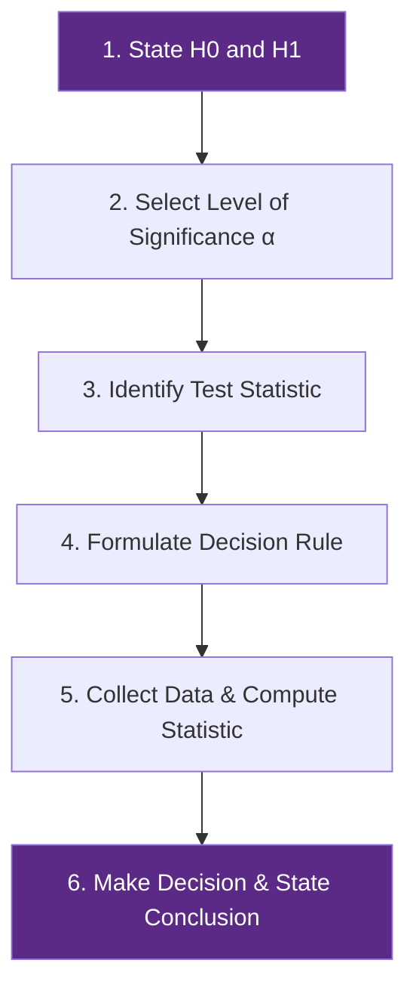
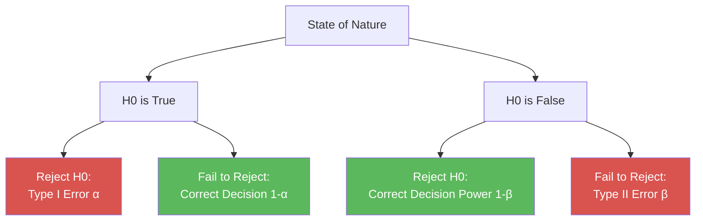

# Hypothesis Testing Foundations: Parametric & Nonparametric

> [!abstract] Curriculum & Syllabus Context
>
> - **Course:** ACC 303 Advanced Statistical Techniques
> - **Module:** Module 3: Hypothesis Testing Foundations (Parametric & Nonparametric)
> - **Target Reading:** Gujarati & Porter (5e) App. A (A.8); Lind, Marchal & Wathen (18e) Ch. 10, 11 & 15; Kothari (2e) Ch. 9 & 10
> - **Syllabus Focus:** 6-step hypothesis testing protocol, null vs. alternative hypotheses, Type I error, Type II error, statistical power (1 - beta), p-values, one-sample & two-sample Z/t tests, paired t-test vs. Sandler's A-test, two-variance F-test, Chi-square goodness-of-fit, test of independence in contingency tables, Yates' continuity correction, and measures of association (Phi, Cramer's V, Contingency C).

---

### Section 1: Conceptual Foundations of Hypothesis Testing

#### 1. Statistical Definition & Logic of Hypothesis Testing
> [!info] Key Definition
>
> In statistical inference, a **hypothesis** is a quantitative claim or assertion about an unknown population parameter (e.g., population mean $\mu$, population proportion $p$, or population variance $\sigma^2$). Hypothesis testing provides a formal, probability-based decision-making framework to evaluate whether empirical sample evidence supports or contradicts a specified hypothesis.

Two competing hypotheses are always formulated:
1. **Null Hypothesis ($H_0$)**: The baseline hypothesis being tested, representing a statement of "no effect", "no difference", or status quo. It is formulated for the explicit purpose of being rejected if sample evidence proves incompatible with it. The null hypothesis always contains an equality condition ($=$, $\le$, or $\ge$).
2. **Alternative Hypothesis ($H_1$ or $H_a$)**: The research hypothesis that is accepted if the sample data provide sufficient statistical proof that $H_0$ is false. It represents the claim the researcher seeks to establish ($\ne$, $>$, or $<$).

$$\begin{aligned}
\text{Two-Tailed Test:} \quad & H_0: \mu = \mu_0 \quad \text{vs.} \quad H_1: \mu \ne \mu_0 \\
\text{Right-Tailed Test:} \quad & H_0: \mu \le \mu_0 \quad \text{vs.} \quad H_1: \mu > \mu_0 \\
\text{Left-Tailed Test:} \quad & H_0: \mu \ge \mu_0 \quad \text{vs.} \quad H_1: \mu < \mu_0
\end{aligned}$$

---

#### 2. Classical Frameworks: Neyman-Pearson vs. Fisherian Approaches
In statistical literature, two complementary paradigms govern hypothesis testing:
* **Neyman-Pearson Approach (Decision-Theoretic)**: Focuses on setting a predetermined level of significance ($\alpha$), establishing critical rejection regions prior to data collection, and balancing Type I ($\alpha$) and Type II ($\beta$) errors to choose between two explicit decisions (Reject $H_0$ vs. Fail to Reject $H_0$).
* **Fisherian Approach (Test-of-Significance)**: Measures the continuous strength of evidence against $H_0$ via the exact $p$-value (observed significance level), leaving the final evaluation of evidence strength to the researcher without rigid binary decision boundaries.

---

#### 3. Confidence Interval Approach vs. Test-of-Significance Approach
Hypothesis testing and confidence interval estimation are mathematically equivalent duals under classical normal theory:
* **Confidence Interval Approach**: Constructs a $(1-\alpha)100\%$ confidence interval for parameter $\theta$. If the hypothesized value $\theta_0$ lies *inside* the interval $[\theta_L, \theta_U]$, $H_0$ is not rejected at level $\alpha$. If $\theta_0$ falls *outside* the interval, $H_0$ is rejected at level $\alpha$.
* **Test-of-Significance Approach**: Computes a standardized test statistic $T(\mathbf{X})$ under $H_0$ and compares it to a critical threshold $T_{\text{crit}}$ derived from the sampling distribution under $H_0$.

$$\text{For a two-tailed test at level } \alpha: \quad \mu_0 \in \left( \bar{x} \pm t_{\alpha/2, df} \frac{s}{\sqrt{n}} \right) \iff |t_{\text{calc}}| \le t_{\alpha/2, df}$$

---

#### 4. The 6-Step Systematic Hypothesis Testing Framework

Every formal test of hypothesis follows a rigorous 6-step protocol:
1. **Step 1: State $H_0$ and $H_1$**: Define population parameters and specify directional or non-directional claims.
2. **Step 2: Select Level of Significance ($\alpha$)**: Choose the maximum acceptable risk of committing a Type I error (typically $\alpha = 0.05, 0.01,$ or $0.10$).
3. **Step 3: Identify Test Statistic**: Select the probability distribution ($Z, t, F, \text{or } \chi^2$) based on sample size $n$, population variance knowledge, and data measurement scale.
4. **Step 4: Formulate Decision Rule**: Establish critical values and rejection regions based on $\alpha$, degrees of freedom ($df$), and test tail direction.
5. **Step 5: Collect Sample Data & Compute Test Statistic**: Calculate the sample point estimates and evaluate the numerical test statistic or $p$-value.
6. **Step 6: Make Statistical Decision & State Economic/Business Conclusion**: Reject $H_0$ if test statistic falls in the rejection region ($p\text{-value} \le \alpha$); otherwise, fail to reject $H_0$. Contextualize the result in business terms.

---
#### 5. $p$-Value (Exact Level of Significance)
> [!info] Key Definition
>
> The **$p$-value** is the lowest significance level at which $H_0$ can be rejected. It represents the exact probability of obtaining a test statistic as extreme as, or more extreme than, the observed sample value, assuming $H_0$ is true.

$$\begin{aligned}
\text{Right-Tailed Test:} \quad & p\text{-value} = P(Z \ge Z_{\text{calc}} \mid H_0 \text{ true}) \\
\text{Left-Tailed Test:} \quad & p\text{-value} = P(Z \le Z_{\text{calc}} \mid H_0 \text{ true}) \\
\text{Two-Tailed Test:} \quad & p\text{-value} = 2 \cdot P(Z \ge |Z_{\text{calc}}| \mid H_0 \text{ true})
\end{aligned}$$

**Decision Rule using $p$-value**:
* If $p\text{-value} \le \alpha \implies \text{Reject } H_0$ (Statistically Significant Result).
* If $p\text{-value} > \alpha \implies \text{Fail to Reject } H_0$ (Statistically Insignificant Result).

**Strength of Evidence Guidelines**:
* $p < 0.01$: Very strong evidence against $H_0$.
* $0.01 \le p < 0.05$: Strong evidence against $H_0$.
* $0.05 \le p < 0.10$: Weak/marginal evidence against $H_0$.
* $p \ge 0.10$: Insufficient evidence against $H_0$.

---
#### 6. Decision Errors and Power of a Test

In any hypothesis test, two types of classification errors can occur because decisions are made using sample data rather than complete population census:

| State of Nature $\setminus$ Decision | Do Not Reject $H_0$ | Reject $H_0$ |
| :--- | :--- | :--- |
| **$H_0$ is True** | Correct Decision ($1 - \alpha$) | **Type I Error ($\alpha$)** |
| **$H_0$ is False** | **Type II Error ($\beta$)** | Correct Decision ($1 - \beta$) [Power] |

> [!info] Key Definition
>
> * **Type I Error ($\alpha$)**: Rejecting $H_0$ when $H_0$ is true. $\alpha = P(\text{Reject } H_0 \mid H_0 \text{ is true})$. Controlled directly by setting the level of significance.
> * **Type II Error ($\beta$)**: Failing to reject $H_0$ when $H_0$ is false. $\beta = P(\text{Fail to Reject } H_0 \mid H_1 \text{ is true})$.
> * **Power of a Test ($1 - \beta$)**: The probability of correctly rejecting a false null hypothesis. Power measures the sensitivity of the test to detect a true underlying effect or parameter shift:
> $$\text{Power} = 1 - \beta = P(\text{Reject } H_0 \mid \mu = \mu_1 \ne \mu_0)$$

**Factors Influencing Test Power**:
1. **Effect Size ($\mu_1 - \mu_0$)**: As the true parameter shifts further from $\mu_0$, $\beta$ decreases and power ($1 - \beta$) increases.
2. **Sample Size ($n$)**: Increasing $n$ reduces standard error ($\sigma_{\bar{x}} = \sigma / \sqrt{n}$), narrowing sampling distributions and dramatically boosting power.
3. **Significance Level ($\alpha$)**: Decreasing $\alpha$ (e.g., $0.05 \to 0.01$) widens the non-rejection region, increasing $\beta$ and reducing power.
4. **Population Variance ($\sigma^2$)**: Lower variance reduces overlap between sampling distributions under $H_0$ and $H_1$, increasing power.

---

### Section 2: One-Sample Parametric Tests of Hypotheses

---

#### 1. Testing Population Mean ($\mu$) with Known $\sigma$ ($Z$-Test)
> [!quote] Formula & Derivation
>
> When sampling from a normal population (or when $n \ge 30$ by CLT) and the population standard deviation $\sigma$ is known:
> $$\text{Test Statistic:} \quad Z_{\text{calc}} = \frac{\bar{x} - \mu_0}{\sigma / \sqrt{n}} \sim N(0, 1)$$

---

#### 2. Testing Population Mean ($\mu$) with Unknown $\sigma$ ($t$-Test)
> [!quote] Formula & Derivation
>
> When population standard deviation $\sigma$ is unknown and estimated by sample standard deviation $s$:
> $$\text{Test Statistic:} \quad t_{\text{calc}} = \frac{\bar{x} - \mu_0}{s / \sqrt{n}} \sim t_{df = n - 1}$$

---

#### 3. Testing Population Proportion ($p$ or $\pi$) ($Z$-Test for Proportions)
> [!quote] Formula & Derivation
>
> When testing a binomial proportion $p$ under large-sample conditions ($n\pi_0 \ge 5$ and $n(1-\pi_0) \ge 5$):
> $$\text{Test Statistic:} \quad Z_{\text{calc}} = \frac{\hat{p} - \pi_0}{\sigma_{\hat{p}}} = \frac{\hat{p} - \pi_0}{\sqrt{\frac{\pi_0(1 - \pi_0)}{n}}} \sim N(0, 1)$$
> where $\hat{p} = \frac{X}{n}$ is the sample proportion.

---

#### 4. Testing Population Variance ($\sigma^2$) ($\chi^2$-Test)
> [!quote] Formula & Derivation
>
> When testing whether a population variance $\sigma^2$ equals a hypothesized value $\sigma_0^2$ in a normal population:
> $$\text{Test Statistic:} \quad \chi^2_{\text{calc}} = \frac{(n - 1)s^2}{\sigma_0^2} \sim \chi^2_{df = n - 1}$$
> Critical rejection boundaries at level $\alpha$ for a two-tailed test are $\chi^2_{1 - \alpha/2, n-1}$ and $\chi^2_{\alpha/2, n-1}$.

---

### Section 3: Two-Sample Parametric Tests of Hypotheses

---

#### 1. Testing Difference Between Two Independent Population Means ($\mu_1 - \mu_2$)

> [!quote] Formula & Derivation
>
> ##### Case A: Known Population Variances ($\sigma_1^2, \sigma_2^2$)
> $$\text{Test Statistic:} \quad Z_{\text{calc}} = \frac{(\bar{x}_1 - \bar{x}_2) - (\mu_1 - \mu_2)_0}{\sqrt{\frac{\sigma_1^2}{n_1} + \frac{\sigma_2^2}{n_2}}} \sim N(0, 1)$$
> 
> ##### Case B: Unknown but Equal Variances ($\sigma_1^2 = \sigma_2^2 = \sigma^2$) — Pooled $t$-Test
> When population variances are unknown but assumed equal, sample variances $s_1^2$ and $s_2^2$ are combined into a weighted **pooled variance** $s_p^2$:
> $$s_p^2 = \frac{(n_1 - 1)s_1^2 + (n_2 - 1)s_2^2}{n_1 + n_2 - 2}$$
> $$\text{Test Statistic:} \quad t_{\text{calc}} = \frac{(\bar{x}_1 - \bar{x}_2) - 0}{\sqrt{s_p^2 \left( \frac{1}{n_1} + \frac{1}{n_2} \right)}} \sim t_{df = n_1 + n_2 - 2}$$
> 
> ##### Case C: Unknown and Unequal Variances ($\sigma_1^2 \ne \sigma_2^2$) — Welch's $t$-Test
> When equal variance assumption is violated:
> $$t_{\text{calc}} = \frac{(\bar{x}_1 - \bar{x}_2) - 0}{\sqrt{\frac{s_1^2}{n_1} + \frac{s_2^2}{n_2}}}$$
> The effective degrees of freedom are calculated using the **Satterthwaite approximation** (rounded down to nearest integer):
> $$df = \frac{\left( \frac{s_1^2}{n_1} + \frac{s_2^2}{n_2} \right)^2}{\frac{\left(s_1^2 / n_1\right)^2}{n_1 - 1} + \frac{\left(s_2^2 / n_2\right)^2}{n_2 - 1}}$$

---

#### 2. Testing Difference Between Dependent / Paired Samples (Matched Pairs $t$-Test)
> [!quote] Formula & Derivation
>
> When observations are paired across two samples (e.g., before-and-after treatments on same subjects), extraneous subject-to-subject variation is eliminated by analyzing individual differences $D_i = X_{1i} - X_{2i}$:
> $$\bar{D} = \frac{\sum D_i}{n}, \quad s_D = \sqrt{\frac{\sum (D_i - \bar{D})^2}{n - 1}} = \sqrt{\frac{\sum D_i^2 - \frac{(\sum D_i)^2}{n}}{n - 1}}$$
> $$\text{Test Statistic:} \quad t_{\text{calc}} = \frac{\bar{D} - \mu_D}{s_D / \sqrt{n}} \sim t_{df = n - 1}$$

---

#### 3. Alternative Paired Formulation: Sandler's $A$-Test
> [!quote] Formula & Derivation
>
> Developed by Joseph Sandler (1955), **Sandler's $A$-test** is a computationally simplified, mathematically exact substitute for the paired Student's $t$-test when $H_0: \mu_D = 0$:
> $$A_{\text{calc}} = \frac{\sum D_i^2}{\left( \sum D_i \right)^2}$$
> 
> **Exact Relationship between $A$ and $t$**:
> $$A = \frac{n - 1}{n \cdot t^2} + \frac{1}{n} \iff t = \sqrt{\frac{n - 1}{A \cdot n - 1}}$$
> *Decision Rule for $A$-Test*: Because $A$ is inversely proportional to $t^2$, $H_0$ is rejected if $A_{\text{calc}} \le A_{\text{table}}(\alpha, df = n - 1)$.

---

#### 4. Testing Difference Between Two Population Proportions ($p_1 - p_2$)
> [!quote] Formula & Derivation
>
> To test $H_0: \pi_1 = \pi_2 = \pi$, samples are combined to compute the **pooled sample proportion** $p_c$:
> $$p_c = \frac{X_1 + X_2}{n_1 + n_2} = \frac{n_1 p_1 + n_2 p_2}{n_1 + n_2}$$
> $$\text{Test Statistic:} \quad Z_{\text{calc}} = \frac{p_1 - p_2}{\sqrt{p_c (1 - p_c) \left( \frac{1}{n_1} + \frac{1}{n_2} \right)}} \sim N(0, 1)$$

---

#### 5. Testing Equality of Two Normal Population Variances ($F$-Test)
> [!quote] Formula & Derivation
>
> To test whether two independent normal populations have equal variances ($H_0: \sigma_1^2 = \sigma_2^2$ vs. $H_1: \sigma_1^2 \ne \sigma_2^2$):
> $$\text{Test Statistic:} \quad F_{\text{calc}} = \frac{s_1^2}{s_2^2} \quad \text{where } s_1^2 \ge s_2^2$$
> $$F_{\text{calc}} \sim F(df_1 = n_1 - 1, \, df_2 = n_2 - 1)$$
> By placing the larger sample variance in the numerator ($s_1^2 \ge s_2^2$), $F_{\text{calc}} \ge 1.0$, requiring only upper-tail critical evaluation at $\alpha/2$ level.

---

### Section 4: Nonparametric Hypothesis Testing (Nominal Data & Chi-Square Tests)

---

#### 1. Parametric vs. Nonparametric Methods
* **Parametric Tests**: Require stringent distributional assumptions (normality, homoscedasticity) and interval/ratio scale data. They possess higher statistical power when assumptions hold.
* **Nonparametric (Distribution-Free) Tests**: Require no assumptions regarding parent population distribution parameters. Applicable to nominal or ordinal data, robust against extreme outliers, but require larger sample sizes to achieve equal power.

---

#### 2. Properties of the Chi-Square ($\chi^2$) Distribution
1. **Asymmetry & Range**: Non-negative continuous distribution ($0 \le \chi^2 < \infty$), positively skewed for small $df$.
2. **Degrees of Freedom Convergence**: As $df \to \infty$, the $\chi^2$ distribution approaches a normal distribution ($N(df, 2df)$).
3. **Additive Property**: If $\chi_1^2, \chi_2^2, \dots, \chi_k^2$ are independent $\chi^2$ random variables with $df_1, df_2, \dots, df_k$, then $\sum \chi_i^2 \sim \chi^2\left(\sum df_i\right)$.

---

#### 3. Chi-Square Goodness-of-Fit Test
> [!quote] Formula & Derivation
>
> Evaluates whether an observed sample frequency distribution $f_o$ conforms to a theoretical population distribution $f_e$.
> $$\text{Test Statistic:} \quad \chi^2_{\text{calc}} = \sum_{i=1}^{k} \frac{(f_{oi} - f_{ei})^2}{f_{ei}} \sim \chi^2_{df = k - 1 - m}$$
> where $k$ is the number of categories, $f_{ei} = n \cdot \pi_i$ is expected frequency, and $m$ is the number of population parameters estimated from sample data.

> [!warning] Exam Pitfall / Exception
>
> *Rule for Minimum Expected Frequencies*:
> 1. No category should have an expected frequency $f_e < 1.0$.
> 2. No more than 20% of categories should have $f_e < 5.0$. If violated, adjacent categories must be merged.

---

#### 4. Contingency Table Analysis (Test of Independence of Attributes)
> [!quote] Formula & Derivation
>
> Evaluates whether two qualitative attributes $A$ (with $r$ rows) and $B$ (with $c$ columns) are cross-classified independently in an $r \times c$ contingency table ($H_0$: Attribute A and Attribute B are independent).
> $$\text{Expected Cell Frequency:} \quad E_{ij} = \frac{(\text{Row } i \text{ Total}) \times (\text{Column } j \text{ Total})}{N} = \frac{R_i \cdot C_j}{N}$$
> $$\text{Test Statistic:} \quad \chi^2_{\text{calc}} = \sum_{i=1}^{r} \sum_{j=1}^{c} \frac{(O_{ij} - E_{ij})^2}{E_{ij}} \sim \chi^2_{df = (r - 1)(c - 1)}$$

---

#### 5. Yates' Correction for Continuity ($2 \times 2$ Contingency Tables)
> [!quote] Formula & Derivation
>
> When analyzing a $2 \times 2$ table with small cell frequencies ($n < 50$ or $f_e < 10$), Frank Yates introduced a continuity correction that subtracts $0.5$ from absolute cell deviations $|O - E|$ to adjust for approximating a discrete binomial count with a continuous $\chi^2$ distribution:
> $$\chi^2_{\text{Yates}} = \sum \frac{(|O_{ij} - E_{ij}| - 0.5)^2}{E_{ij}}$$
> 
> **Algebraic $2 \times 2$ Shortcut Formula with Yates' Correction**:
> Given cell counts $\begin{pmatrix} a & b \\ c & d \end{pmatrix}$ with $N = a + b + c + d$:
> $$\chi^2_{\text{Yates}} = \frac{N \left( |ad - bc| - \frac{N}{2} \right)^2}{(a + b)(c + d)(a + c)(b + d)}$$

---

#### 6. Measures of Association Derived from Chi-Square
Because $\chi^2_{\text{calc}}$ grows proportionally with sample size $N$, it measures statistical significance but not association magnitude. Two normalized measures are derived:

> [!quote] Formula & Derivation
>
> 1. **Phi Coefficient ($\phi$)** (for $2 \times 2$ tables):
> $$\phi = \sqrt{\frac{\chi^2}{N}}$$
> 
> 2. **Cramer's $V$** (for general $r \times c$ tables):
> $$V = \sqrt{\frac{\chi^2}{N \cdot \min(r - 1, c - 1)}}$$
> 
> 3. **Pearson's Coefficient of Contingency ($C$)**:
> $$C = \sqrt{\frac{\chi^2}{\chi^2 + N}}$$
> The theoretical maximum for $C$ in a $k \times k$ table is $C_{\max} = \sqrt{\frac{k - 1}{k}}$ (for $2 \times 2$, $C_{\max} = \sqrt{0.5} \approx 0.707$).

---

### Section 5: Step-by-Step Numerical Problem Walkthroughs with Solutions

---

> [!example] Numerical Problem 1: Type II Error ($\beta$) and Power ($1 - \beta$) Calculation
>
> **Scenario**: A manufacturing plant monitors steel rod tensile strength. $H_0: \mu \le 100 \text{ ksi}$ vs. $H_1: \mu > 100 \text{ ksi}$. Population standard deviation is $\sigma = 15 \text{ ksi}$. A sample of $n = 25$ rods is tested at significance level $\alpha = 0.05$.
> Suppose the true population mean shifts to $\mu_1 = 108 \text{ ksi}$.
> 1. Determine the critical sample mean $\bar{x}_c$ for the decision rule.
> 2. Calculate the probability of a Type II error ($\beta$).
> 3. Calculate the statistical power ($1 - \beta$) of the test.
> 
> **Solution**:
> 4. **Standard Error**:
> $$\sigma_{\bar{x}} = \frac{\sigma}{\sqrt{n}} = \frac{15}{\sqrt{25}} = \frac{15}{5} = 3.0 \text{ ksi}$$
> 
> 5. **Critical Decision Boundary ($\bar{x}_c$) under $H_0$ ($\mu_0 = 100$)**:
> For a right-tailed $Z$-test at $\alpha = 0.05$, $Z_{\alpha} = 1.645$.
> $$\bar{x}_c = \mu_0 + Z_{\alpha} \cdot \sigma_{\bar{x}} = 100 + (1.645)(3.0) = 100 + 4.935 = 104.935 \text{ ksi}$$
> *Decision Rule*: Reject $H_0$ if $\bar{x} > 104.935$; fail to reject $H_0$ if $\bar{x} \le 104.935$.
> 
> 6. **Probability of Type II Error ($\beta$) under True $\mu_1 = 108$**:
> $$\beta = P(\bar{x} \le 104.935 \mid \mu = 108) = P\left( Z \le \frac{104.935 - 108}{3.0} \right) = P\left( Z \le \frac{-3.065}{3.0} \right) = P(Z \le -1.0217)$$
> From standard normal distribution tables:
> $$P(Z \le -1.02) = 0.1539$$
> Thus, $\beta \approx 0.1539 \text{ or } 15.39\%$.
> 
> 7. **Power of the Test ($1 - \beta$)**:
> $$\text{Power} = 1 - \beta = 1 - 0.1539 = 0.8461 \text{ or } 84.61\%$$

---

> [!example] Numerical Problem 2: Paired $t$-Test vs. Sandler's $A$-Test Comparison
>
> **Scenario**: Memory retention scores of $n = 9$ executives measured before and after a training seminar:
> 
> | Executive ($i$) | 1 | 2 | 3 | 4 | 5 | 6 | 7 | 8 | 9 |
> | :--- | :--- | :--- | :--- | :--- | :--- | :--- | :--- | :--- | :--- |
> | **Before ($X_1$)** | 10 | 15 | 9 | 3 | 7 | 12 | 16 | 17 | 4 |
> | **After ($X_2$)** | 12 | 17 | 8 | 5 | 6 | 11 | 18 | 20 | 3 |
> 
> Test $H_0: \mu_D = 0$ vs. $H_1: \mu_D \ne 0$ at $\alpha = 0.05$ using both Paired $t$-test and Sandler's $A$-test.
> 
> **Solution**:
> 1. **Differences $D_i = X_{1i} - X_{2i}$**:
>    * $D = [10-12, 15-17, 9-8, 3-5, 7-6, 12-11, 16-18, 17-20, 4-3]$
>    * $D = [-2, -2, +1, -2, +1, +1, -2, -3, +1]$
> 2. **Summations**:
>    * $\sum D_i = (-2) + (-2) + 1 + (-2) + 1 + 1 + (-2) + (-3) + 1 = -5$
>    * $D_i^2 = [4, 4, 1, 4, 1, 1, 4, 9, 1]$
>    * $\sum D_i^2 = 4 + 4 + 1 + 4 + 1 + 1 + 4 + 9 + 1 = 29$
> 3. **Paired $t$-Test Calculations**:
>    $$\bar{D} = \frac{\sum D_i}{n} = \frac{-5}{9} = -0.5556$$
>    $$s_D^2 = \frac{\sum D_i^2 - \frac{(\sum D_i)^2}{n}}{n - 1} = \frac{29 - \frac{(-5)^2}{9}}{8} = \frac{29 - 2.7778}{8} = \frac{26.2222}{8} = 3.2778 \implies s_D = 1.8105$$
>    $$t_{\text{calc}} = \frac{\bar{D} - 0}{s_D / \sqrt{n}} = \frac{-0.5556}{1.8105 / 3} = \frac{-0.5556}{0.6035} = -0.9206$$
>    *Critical $t$-value* for $df = 8, \alpha = 0.05$ (two-tailed): $t_{\text{crit}} = \pm 2.306$.
>    *Decision*: Since $|t_{\text{calc}}| = 0.9206 < 2.306$, fail to reject $H_0$. Training has no statistically significant effect.
> 
> 4. **Sandler's $A$-Test Calculations**:
>    $$A_{\text{calc}} = \frac{\sum D_i^2}{\left( \sum D_i \right)^2} = \frac{29}{(-5)^2} = \frac{29}{25} = 1.1600$$
>    *Verify Exact Identity to $t$*:
>    $$A = \frac{n - 1}{n \cdot t^2} + \frac{1}{n} = \frac{8}{9(-0.9206)^2} + \frac{1}{9} = \frac{8}{9(0.8475)} + 0.1111 = \frac{8}{7.6275} + 0.1111 = 1.0488 + 0.1111 = 1.1599 \approx 1.1600$$
>    *Critical $A$-value* from Sandler's Table for $df = 8, \alpha = 0.05$ (two-tailed): $A_{\text{crit}} = 0.278$.
>    *Decision Rule*: Reject $H_0$ if $A_{\text{calc}} \le A_{\text{crit}}$.
>    Since $A_{\text{calc}} = 1.1600 > 0.278$, fail to reject $H_0$. Both tests yield identical statistical conclusions.

---

> [!example] Numerical Problem 3: Chi-Square Test of Independence with Yates' Correction
>
> **Scenario**: A clinical trial evaluates a new vaccine against infection:
> 
> | Group | Infected | Not Infected | Total |
> | :--- | :--- | :--- | :--- |
> | **Vaccinated ($A$)** | 12 ($a$) | 88 ($b$) | 100 |
> | **Control ($B$)** | 28 ($c$) | 72 ($d$) | 100 |
> | **Total** | 40 | 160 | 200 ($N$) |
> 
> Test $H_0$: Infection status is independent of vaccination at $\alpha = 0.05$. Calculate raw $\chi^2$, Yates' corrected $\chi^2$, Phi coefficient ($\phi$), and Contingency coefficient ($C$).
> 
> **Solution**:
> 1. **Expected Cell Frequencies ($E_{ij} = \frac{R_i \cdot C_j}{N}$)**:
>    * $E_{11} = \frac{100 \times 40}{200} = 20.0, \quad E_{12} = \frac{100 \times 160}{200} = 80.0$
>    * $E_{21} = \frac{100 \times 40}{200} = 20.0, \quad E_{22} = \frac{100 \times 160}{200} = 80.0$
> 
> 2. **Standard Uncorrected Chi-Square ($\chi^2_{\text{raw}}$)**:
>    $$\chi^2_{\text{raw}} = \frac{(12 - 20)^2}{20} + \frac{(88 - 80)^2}{80} + \frac{(28 - 20)^2}{20} + \frac{(72 - 80)^2}{80} = \frac{64}{20} + \frac{64}{80} + \frac{64}{20} + \frac{64}{80} = 3.2 + 0.8 + 3.2 + 0.8 = 8.000$$
> 
> 3. **Yates' Corrected Chi-Square ($\chi^2_{\text{Yates}}$)**:
>    $$\chi^2_{\text{Yates}} = \sum \frac{(|O - E| - 0.5)^2}{E} = \frac{(|12-20|-0.5)^2}{20} + \frac{(|88-80|-0.5)^2}{80} + \frac{(|28-20|-0.5)^2}{20} + \frac{(|72-80|-0.5)^2}{80}$$
>    $$\chi^2_{\text{Yates}} = \frac{7.5^2}{20} + \frac{7.5^2}{80} + \frac{7.5^2}{20} + \frac{7.5^2}{80} = \frac{56.25}{20} + \frac{56.25}{80} + \frac{56.25}{20} + \frac{56.25}{80} = 2.8125 + 0.7031 + 2.8125 + 0.7031 = 7.03125$$
> 
>    *Shortcut Formula Verification*:
>    $$ad = 12 \times 72 = 864, \quad bc = 88 \times 28 = 2464 \implies |ad - bc| = |864 - 2464| = 1600$$
>    $$\chi^2_{\text{Yates}} = \frac{200 \left( 1600 - \frac{200}{2} \right)^2}{(100)(100)(40)(160)} = \frac{200 (1500)^2}{64,000,000} = \frac{200 \times 2,250,000}{64,000,000} = \frac{450,000,000}{64,000,000} = 7.03125$$
> 
> 4. **Critical Decision**:
>    Degrees of Freedom $df = (2-1)(2-1) = 1$.
>    Critical Value $\chi^2_{0.05, 1} = 3.841$.
>    *Decision*: Since $\chi^2_{\text{Yates}} = 7.031 > 3.841$, reject $H_0$. Infection rate is significantly lower in the vaccinated group.
> 
> 5. **Measures of Association**:
>    * **Phi Coefficient ($\phi$)**:
>      $$\phi = \sqrt{\frac{\chi^2_{\text{raw}}}{N}} = \sqrt{\frac{8.00}{200}} = \sqrt{0.04} = 0.200$$
>    * **Coefficient of Contingency ($C$)**:
>      $$C = \sqrt{\frac{\chi^2_{\text{raw}}}{\chi^2_{\text{raw}} + N}} = \sqrt{\frac{8.00}{8.00 + 200}} = \sqrt{\frac{8}{208}} = \sqrt{0.03846} = 0.1961$$
