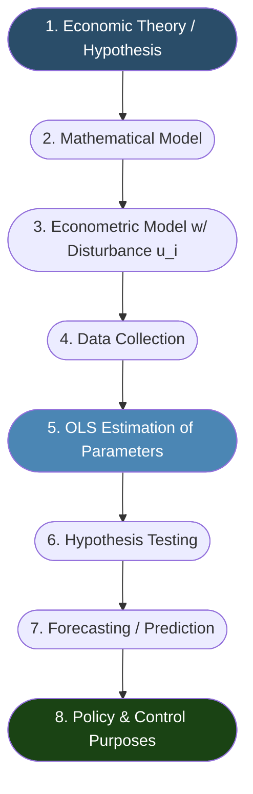
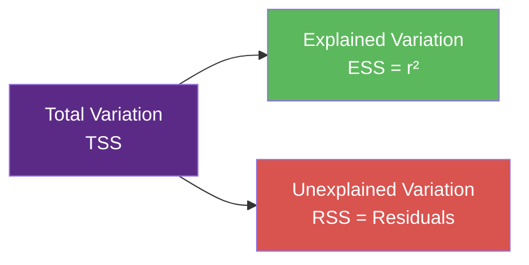

# Single-Equation Linear Regression Analysis

> [!abstract] Curriculum & Syllabus Context
>
> - **Course:** ACC 303 Advanced Statistical Techniques
> - **Module:** Module 5: Single-Equation Linear Regression Analysis (Nature & Two-Variable)
> - **Target Reading:** Gujarati & Porter (5e) Intro & Ch. 1–5; Lind, Marchal & Wathen (18e) Ch. 13
> - **Syllabus Focus:** Methodology of econometrics, regression vs. causation vs. correlation, PRF vs. SRF, linearity in parameters, stochastic disturbance term rationale, Ordinary Least Squares (OLS) derivation, 10 CLRM assumptions, Gauss-Markov BLUE proof, coefficient of determination (r^2), Classical Normal Linear Regression Model (CNLRM), Maximum Likelihood Estimation, hypothesis testing of regression parameters (t-test & 2-t rule), regression ANOVA (F = t^2), mean & individual prediction intervals, and Jarque-Bera normality test.

---

### Syllabus Topics & Sequential Reading Roadmap

This module covers **Syllabus Topics 6, 7 & 8: The Nature of Regression, Two-Variable Regression Analysis (Estimation & Inference)**.

#### Assigned Readings & Multi-Source Synthesis Mappings:
1. **Gujarati & Porter (5e) — Introduction**: Methodology of traditional econometrics, mathematical vs. econometric models, and the role of data.
2. **Gujarati & Porter (5e) — Chapter 1**: The Nature of Regression Analysis (Modern interpretation, regression vs. correlation, cross-section vs. time-series vs. panel data).
3. **Gujarati & Porter (5e) — Chapter 2**: Two-Variable Regression Analysis: Some Basic Ideas (PRF, SRF, structural definition of linearity in variables vs. parameters).
4. **Gujarati & Porter (5e) — Chapter 3**: Two-Variable Regression Model: The Problem of Estimation (OLS derivation, 10 CLRM assumptions, Gauss-Markov Theorem/BLUE proof, $r^2$).
5. **Gujarati & Porter (5e) — Chapter 4**: Classical Normal Linear Regression Model (CNLRM) (Normality assumption of $u_i$, Central Limit Theorem justification, Maximum Likelihood Estimation).
6. **Gujarati & Porter (5e) — Chapter 5**: Two-Variable Regression: Interval Estimation and Hypothesis Testing (Confidence intervals, $t$-tests, ANOVA in regression, prediction intervals, Jarque-Bera normality test).
7. **Lind, Marchal & Wathen (18e) — Chapter 13**: Correlation and Linear Regression (Standard error of estimate, prediction/confidence intervals for $Y$).

---

### Topic 1: Methodology of Traditional Econometrics & The Nature of Regression

#### 1. The 8-Step Classical Econometric Methodology

Traditional econometric analysis follows a structured 8-step process designed to bridge economic theory with empirical measurement:
1. **Statement of Theory or Hypothesis**: Formulating an economic proposition from economic theory.
   * *Example (Keynesian Consumption Theory)*: The marginal propensity to consume ($MPC = \frac{dY}{dX}$) is positive but less than unity: $0 < MPC < 1$.
2. **Specification of the Mathematical Model**: Expressing the theoretical hypothesis in exact, deterministic mathematical equations.
   * *Equation*: $Y = \beta_1 + \beta_2 X \quad (0 < \beta_2 < 1)$
   * Here $Y$ is personal consumption expenditure, $X$ is gross domestic product (income), $\beta_1$ is the intercept (autonomous consumption), and $\beta_2$ is the slope coefficient ($MPC$).
3. **Specification of the Econometric Model**: Modifying the deterministic model to account for real-world inexactness by introducing a random, stochastic disturbance term ($u_i$).
   * *Equation*: $Y_i = \beta_1 + \beta_2 X_i + u_i$
   * The error term $u_i$ captures individual variations, omitted variables, measurement errors, and intrinsic human randomness.
4. **Obtaining Data**: Collecting quantitative observational data on the dependent and explanatory variables ($Y_i, X_i$).
5. **Estimation of the Parameters of the Econometric Model**: Applying statistical techniques—primarily Ordinary Least Squares (OLS)—to obtain numerical estimates ($\hat{\beta}_1, \hat{\beta}_2$) for the unknown parameters ($\beta_1, \beta_2$).
   * *Estimated Model*: $\hat{Y}_i = \hat{\beta}_1 + \hat{\beta}_2 X_i$
6. **Hypothesis Testing**: Using statistical inference ($t$-tests, $p$-values, confidence intervals) to evaluate whether the estimated parameters align with theoretical predictions. For instance, testing $H_0: \beta_2 = 1$ versus $H_1: \beta_2 < 1$.
7. **Forecasting or Prediction**: Utilizing the validated model to forecast future values of the dependent variable ($Y_0$) based on projected or known future values of the regressor ($X_0$).
8. **Use of the Model for Control or Policy Purposes**: Applying the estimated equation to manipulate policy variables ($X$) to achieve target macroeconomic outcomes ($Y$).

---
#### 2. Fundamental Distinctions in Regression Analysis
##### A. Regression vs. Causation
> [!warning] Exam Pitfall / Exception
>
> **Causation**: Statistical regression **does not** establish physical or logical causation on its own. Causation must be justified by underlying economic or physical theory. A statistically significant regression relationship between two variables may reflect a genuine causal link, a mutual relationship driven by a third omitted factor, or a spurious correlation.

##### B. Regression vs. Correlation
* **Symmetry**: Correlation treats $Y$ and $X$ completely symmetrically. The correlation between $X$ and $Y$ ($r_{XY}$) is identical to the correlation between $Y$ and $X$ ($r_{YX}$). In regression, the relationship is asymmetrical: $Y$ is treated as a random/stochastic variable, while $X$ is treated as fixed in repeated sampling.
* **Randomness**: In correlation analysis, both variables are assumed to be random variables following a bivariate normal distribution. In regression analysis, only the dependent variable ($Y$) needs to be random; the regressors ($X$) are conditioned upon as fixed numbers.
##### C. Types of Economic Data
1. **Cross-Sectional Data**: Data collected on one or more variables at a single point in time across multiple economic entities (e.g., households, firms, countries).
2. **Time Series Data**: Data collected on one variable or a set of variables over successive time intervals (e.g., daily stock prices, quarterly GDP, annual inflation). Time series observations often exhibit temporal ordering and serial dependence.
3. **Pooled / Panel (Longitudinal) Data**: A combination of cross-sectional and time-series features, where the same cross-sectional units (e.g., 50 states) are followed over multiple time periods (e.g., 20 years).

---
### Topic 2: Two-Variable Regression Analysis: PRF & SRF
#### 1. Population Regression Function (PRF) & Conditional Expectation Function (CEF)
> [!info] Key Definition
>
> The **Conditional Expectation Function (CEF)** or **Population Regression Function (PRF)** is the locus of the conditional means $E(Y|X_i)$ across all sub-populations of $Y$:
> $$E(Y|X_i) = f(X_i)$$
> When the functional form $f(X_i)$ is linear in parameters, the linear PRF is expressed as:
> $$E(Y|X_i) = \beta_1 + \beta_2 X_i$$
> where $\beta_1$ is the population intercept and $\beta_2$ is the population slope coefficient.

---
#### 2. Structural Definition of Linearity
In econometric theory, the term "linear regression" strictly refers to **linearity in the parameters**, not necessarily linearity in the variables:
* **Linearity in the Variables**: The conditional expectation $E(Y|X_i)$ is a straight-line function of $X_i$.
  * $E(Y|X_i) = \beta_1 + \beta_2 X_i$ (Linear in variables and parameters)
  * $E(Y|X_i) = \beta_1 + \beta_2 X_i^2$ (Nonlinear in variable $X$, but linear in parameters $\beta_1, \beta_2$)
* **Linearity in the Parameters**: The parameters ($\beta_1, \beta_2$) appear with an exponent of 1 and are not multiplied, divided, or transformed by other parameters.
  * $E(Y|X_i) = \beta_1 + \beta_2^2 X_i$ (**Nonlinear** in parameter $\beta_2$)
  * $E(Y|X_i) = \beta_1 + e^{\beta_2} X_i$ (**Nonlinear** in parameter $\beta_2$)

> [!info] Key Definition
>
> **Rule**: All models linear in the parameters can be estimated using Classical Linear Regression Model (CLRM) theory and Ordinary Least Squares (OLS).

---
#### 3. Stochastic Specification of the PRF
Since individual observations $Y_i$ deviate from their conditional mean $E(Y|X_i)$, an individual observation is expressed as:
$$Y_i = E(Y|X_i) + u_i = \beta_1 + \beta_2 X_i + u_i$$
where $u_i$ is the stochastic disturbance or error term:
$$u_i = Y_i - E(Y|X_i) = Y_i - (\beta_1 + \beta_2 X_i)$$

By taking conditional expectations on both sides:
$$E(u_i|X_i) = E(Y_i|X_i) - E(Y|X_i) = 0$$
##### Rationale for the Stochastic Disturbance Term ($u_i$)
Gujarati identifies 7 explicit reasons why an error term $u_i$ is inherently necessary in regression models:
1. **Theoretical Ignorance**: Economic theory rarely identifies all variables that influence a phenomenon.
2. **Unavailability of Data**: Data on relevant variables (e.g., subjective consumer expectations) may be missing or unmeasurable.
3. **Core vs. Peripheral Variables**: To maintain model parsimony, minor explanatory factors are left out and aggregated into $u_i$.
4. **Intrinsic Randomness in Human Behavior**: Human decisions exhibit inherent variability that cannot be explained even with full information.
5. **Poor Proxy Variables**: When ideal theoretical variables cannot be measured, imperfect empirical proxies introduce measurement noise into $u_i$.
6. **Principle of Parsimony (Occam's Razor)**: Models should be kept as simple as possible.
7. **Wrong Functional Form**: Imperfect linear approximations of complex nonlinear relationships are absorbed by $u_i$.

---
#### 4. The Sample Regression Function (SRF)
In practice, the population parameters ($\beta_1, \beta_2$) are unknown because we only possess a finite random sample from the population. We estimate the PRF using the **Sample Regression Function (SRF)**:
* **Deterministic SRF Form**:
$$\hat{Y}_i = \hat{\beta}_1 + \hat{\beta}_2 X_i$$
where $\hat{Y}_i$ is the estimator of $E(Y|X_i)$, $\hat{\beta}_1$ is the estimator of $\beta_1$, and $\hat{\beta}_2$ is the estimator of $\beta_2$.
* **Stochastic SRF Form**:
$$Y_i = \hat{\beta}_1 + \hat{\beta}_2 X_i + \hat{u}_i = \hat{Y}_i + \hat{u}_i$$
where $\hat{u}_i$ is the sample residual ($Y_i - \hat{Y}_i$), serving as the sample counterpart to $u_i$.

---
### Topic 3: Ordinary Least Squares (OLS) Estimation & CLRM Assumptions
#### 1. The Least-Squares Criterion & Derivation of Normal Equations
To fit a sample regression line $Y_i = \hat{\beta}_1 + \hat{\beta}_2 X_i + \hat{u}_i$ to a dataset of $n$ pairs $(X_i, Y_i)$, Carl Friedrich Gauss proposed minimizing the **Residual Sum of Squares (RSS)**:

$$\text{RSS} = \sum_{i=1}^n \hat{u}_i^2 = \sum_{i=1}^n (Y_i - \hat{Y}_i)^2 = \sum_{i=1}^n (Y_i - \hat{\beta}_1 - \hat{\beta}_2 X_i)^2$$

> [!quote] Formula & Derivation: Derivation via Differential Calculus
>
> To minimize $\text{RSS}(\hat{\beta}_1, \hat{\beta}_2)$, take first-order partial derivatives with respect to $\hat{\beta}_1$ and $\hat{\beta}_2$ and set them equal to zero:
> $$\frac{\partial \sum \hat{u}_i^2}{\partial \hat{\beta}_1} = -2 \sum_{i=1}^n (Y_i - \hat{\beta}_1 - \hat{\beta}_2 X_i) = 0 \implies \sum_{i=1}^n (Y_i - \hat{\beta}_1 - \hat{\beta}_2 X_i) = 0 \quad \text{--- (1)}$$
> $$\frac{\partial \sum \hat{u}_i^2}{\partial \hat{\beta}_2} = -2 \sum_{i=1}^n X_i (Y_i - \hat{\beta}_1 - \hat{\beta}_2 X_i) = 0 \implies \sum_{i=1}^n X_i (Y_i - \hat{\beta}_1 - \hat{\beta}_2 X_i) = 0 \quad \text{--- (2)}$$
> Rearranging (1) and (2) yields the **OLS Normal Equations**:
> $$\sum Y_i = n \hat{\beta}_1 + \hat{\beta}_2 \sum X_i \quad \text{--- [Normal Equation 1]}$$
> $$\sum X_i Y_i = \hat{\beta}_1 \sum X_i + \hat{\beta}_2 \sum X_i^2 \quad \text{--- [Normal Equation 2]}$$
> ##### Solving for $\hat{\beta}_1$ and $\hat{\beta}_2$:
> From Normal Equation 1, divide by $n$:
> $$\bar{Y} = \hat{\beta}_1 + \hat{\beta}_2 \bar{X} \implies \hat{\beta}_1 = \bar{Y} - \hat{\beta}_2 \bar{X}$$
> Substitute $\hat{\beta}_1$ into Normal Equation 2:
> $$\sum X_i Y_i = (\bar{Y} - \hat{\beta}_2 \bar{X})\sum X_i + \hat{\beta}_2 \sum X_i^2$$
> $$\sum X_i Y_i = n \bar{X} \bar{Y} - \hat{\beta}_2 n \bar{X}^2 + \hat{\beta}_2 \sum X_i^2$$
> $$\sum X_i Y_i - n \bar{X} \bar{Y} = \hat{\beta}_2 \left( \sum X_i^2 - n \bar{X}^2 \right)$$
> Using deviation notation where $x_i = X_i - \bar{X}$ and $y_i = Y_i - \bar{Y}$:
> $$\sum x_i^2 = \sum X_i^2 - n \bar{X}^2 \quad \text{and} \quad \sum x_i y_i = \sum X_i Y_i - n \bar{X} \bar{Y}$$
> Thus, the OLS estimators are:
> $$\hat{\beta}_2 = \frac{\sum x_i y_i}{\sum x_i^2} = \frac{n \sum X_i Y_i - (\sum X_i)(\sum Y_i)}{n \sum X_i^2 - (\sum X_i)^2}$$
> $$\hat{\beta}_1 = \bar{Y} - \hat{\beta}_2 \bar{X}$$

---
#### 2. Numerical Properties of OLS Estimators
Numerical properties hold automatically as a pure mathematical consequence of the least-squares minimization, regardless of how the underlying data were generated:
1. **Sum of Residuals is Zero**: $\sum \hat{u}_i = 0$ (and consequently the mean residual $\bar{\hat{u}} = 0$).
2. **Sample Regression Line Passes Through Means**: The fitted regression line always passes through $(\bar{X}, \bar{Y})$.
3. **Mean of Estimated $\hat{Y}_i$ Equals Mean of Observed $Y_i$**: $\bar{\hat{Y}} = \bar{Y}$.
4. **Residuals are Uncorrelated with $X_i$**: $\sum X_i \hat{u}_i = 0$ (or $\sum x_i \hat{u}_i = 0$).
5. **Residuals are Uncorrelated with Predicted $\hat{Y}_i$**: $\sum \hat{Y}_i \hat{u}_i = 0$.

---
#### 3. The 10 Assumptions of the Classical Linear Regression Model (CLRM)
To perform statistical inference and evaluate estimator precision, the CLRM imposes 10 fundamental assumptions on the Population Regression Function and error term $u_i$:
* **Assumption 1 (Linearity in Parameters)**: $Y_i = \beta_1 + \beta_2 X_i + u_i$. The regression model is linear in parameters.
* **Assumption 2 (Fixed $X$ Values or $X$ Independent of Disturbance)**: $X$ values are fixed in repeated sampling, or if $X$ is stochastic, $\text{Cov}(X_i, u_i) = 0$.
* **Assumption 3 (Zero Conditional Mean of Disturbance)**: $E(u_i|X_i) = 0$. For any given $X_i$, the mean of error terms is zero.
* **Assumption 4 (Homoscedasticity or Constant Error Variance)**: $\text{Var}(u_i|X_i) = \sigma^2$ for all $i$. The variance of each $u_i$ conditional on $X_i$ is a constant positive finite value $\sigma^2$.
* **Assumption 5 (No Autocorrelation / Serial Correlation)**: $\text{Cov}(u_i, u_j | X_i, X_j) = 0$ for all $i \neq j$. Error terms are uncorrelated across observations.
* **Assumption 6 (Number of Observations $n >$ Parameters $k$)**: The sample size $n$ must exceed the number of parameters to be estimated ($n > 2$ in simple regression).
* **Assumption 7 (Variability in $X$ Values)**: $\text{Var}(X) > 0$, meaning not all $X_i$ values in a sample are identical ($\sum x_i^2 > 0$).
* **Assumption 8 (No Perfect Multicollinearity)**: There are no exact linear relationships among explanatory variables (extended to multiple regression).
* **Assumption 9 (No Specification Bias)**: The regression model is correctly specified in terms of functional form and included variables.
* **Assumption 10 (Normality of $u_i$)**: $u_i \sim \text{NID}(0, \sigma^2)$. The errors are normally and independently distributed (introduced in CNLRM).

---
#### 4. Precision and Standard Errors of Least-Squares Estimators
> [!quote] Formula & Derivation: Variances and Standard Errors
>
> Under CLRM Assumptions 1 through 7, the sampling variances and standard errors of $\hat{\beta}_1$ and $\hat{\beta}_2$ are:
> $$\text{Var}(\hat{\beta}_2) = \frac{\sigma^2}{\sum x_i^2} \implies \text{se}(\hat{\beta}_2) = \frac{\sigma}{\sqrt{\sum x_i^2}}$$
> $$\text{Var}(\hat{\beta}_1) = \frac{\sum X_i^2}{n \sum x_i^2} \sigma^2 \implies \text{se}(\hat{\beta}_1) = \sqrt{\frac{\sum X_i^2}{n \sum x_i^2}} \cdot \sigma$$
> $$\text{Cov}(\hat{\beta}_1, \hat{\beta}_2) = -\bar{X} \cdot \text{Var}(\hat{\beta}_2) = -\frac{\bar{X} \sigma^2}{\sum x_i^2}$$
> ##### Unbiased Estimation of Population Error Variance ($\sigma^2$):
> Since $\sigma^2$ is unknown, it is estimated using the unbiased OLS sample variance estimator $\hat{\sigma}^2$:
> $$\hat{\sigma}^2 = \frac{\sum \hat{u}_i^2}{n - 2} = \frac{\text{RSS}}{n - 2}$$
> where $n - 2$ is the degrees of freedom (reflecting 2 linear restrictions imposed by estimating $\hat{\beta}_1$ and $\hat{\beta}_2$).
> The positive square root $\hat{\sigma} = \sqrt{\frac{\text{RSS}}{n-2}}$ is called the **Standard Error of the Estimate** ($\text{se}$).

---
### Topic 4: The Gauss-Markov Theorem & BLUE Proofs
The theoretical justification for using OLS rests on the **Gauss-Markov Theorem**:

> [!info] Fundamental Theorem: Gauss-Markov Theorem
>
> Given the assumptions of the Classical Linear Regression Model (CLRM), the Ordinary Least Squares estimators $(\hat{\beta}_1, \hat{\beta}_2)$ are **BLUE** (Best Linear Unbiased Estimators) in the class of all linear unbiased estimators.
> To be **BLUE**, an estimator must satisfy three distinct criteria:
> 1. **Linear**: It is a linear function of the random dependent variable $Y_i$.
> 2. **Unbiased**: Its expected value equals the true population parameter: $E(\hat{\beta}_2) = \beta_2$.
> 3. **Best (Efficient)**: It possesses the minimum variance among all linear unbiased estimators.

---
#### 1. Mathematical Proof of Linearity of $\hat{\beta}_2$
> [!quote] Formula & Derivation
>
> Express $\hat{\beta}_2$ in terms of $Y_i$:
> $$\hat{\beta}_2 = \frac{\sum x_i y_i}{\sum x_i^2} = \frac{\sum x_i (Y_i - \bar{Y})}{\sum x_i^2} = \frac{\sum x_i Y_i - \bar{Y}\sum x_i}{\sum x_i^2}$$
> Since $\sum x_i = \sum (X_i - \bar{X}) = 0$:
> $$\hat{\beta}_2 = \sum_{i=1}^n k_i Y_i \quad \text{where} \quad k_i = \frac{x_i}{\sum x_i^2}$$
> Because $X_i$ is nonstochastic, $k_i$ is a set of nonstochastic weights. Thus $\hat{\beta}_2$ is a linear combination of $Y_i$.
> ##### Key Algebraic Properties of Weights $k_i$:
> 1. $\sum k_i = \sum \left( \frac{x_i}{\sum x_i^2} \right) = \frac{\sum x_i}{\sum x_i^2} = 0$
> 2. $\sum k_i^2 = \sum \left( \frac{x_i}{\sum x_i^2} \right)^2 = \frac{\sum x_i^2}{(\sum x_i^2)^2} = \frac{1}{\sum x_i^2}$
> 3. $\sum k_i X_i = \sum k_i (x_i + \bar{X}) = \sum k_i x_i + \bar{X} \sum k_i = \frac{\sum x_i^2}{\sum x_i^2} + 0 = 1$

---
#### 2. Mathematical Proof of Unbiasedness of $\hat{\beta}_2$
> [!quote] Formula & Derivation
>
> Substitute $Y_i = \beta_1 + \beta_2 X_i + u_i$ into $\hat{\beta}_2 = \sum k_i Y_i$:
> $$\hat{\beta}_2 = \sum k_i (\beta_1 + \beta_2 X_i + u_i) = \beta_1 \sum k_i + \beta_2 \sum k_i X_i + \sum k_i u_i$$
> Applying properties (1) $\sum k_i = 0$ and (3) $\sum k_i X_i = 1$:
> $$\hat{\beta}_2 = \beta_1 (0) + \beta_2 (1) + \sum k_i u_i = \beta_2 + \sum k_i u_i$$
> Take conditional expectations on both sides:
> $$E(\hat{\beta}_2) = E\left( \beta_2 + \sum k_i u_i \right) = \beta_2 + \sum k_i E(u_i|X_i)$$
> Since $E(u_i|X_i) = 0$ (Assumption 3):
> $$E(\hat{\beta}_2) = \beta_2 \quad \text{[$\hat{\beta}_2$ is an unbiased estimator of $\beta_2$]}$$

---
#### 3. Mathematical Proof of Minimum Variance (Efficiency)
> [!quote] Formula & Derivation
>
> Let $\beta_2^*$ be any alternative linear estimator of $\beta_2$:
> $$\beta_2^* = \sum w_i Y_i$$
> where $w_i = k_i + d_i$, and $d_i$ are arbitrary constants.
> ##### For $\beta_2^*$ to be Unbiased:
> $$E(\beta_2^*) = E\left( \sum (k_i + d_i) Y_i \right) = \sum (k_i + d_i) E(Y_i) = \sum (k_i + d_i) (\beta_1 + \beta_2 X_i)$$
> $$= \beta_1 \sum (k_i + d_i) + \beta_2 \sum (k_i + d_i) X_i = \beta_1 \left( \sum k_i + \sum d_i \right) + \beta_2 \left( \sum k_i X_i + \sum d_i X_i \right)$$
> Since $\sum k_i = 0$ and $\sum k_i X_i = 1$:
> $$E(\beta_2^*) = \beta_1 \sum d_i + \beta_2 \left( 1 + \sum d_i X_i \right)$$
> For $E(\beta_2^*) = \beta_2$ to hold identically for any $\beta_1, \beta_2$, we must require:
> $$\sum d_i = 0 \quad \text{and} \quad \sum d_i X_i = 0$$
> ##### Variance of $\beta_2^*$:
> $$\text{Var}(\beta_2^*) = \text{Var}\left( \sum w_i Y_i \right) = \sum w_i^2 \text{Var}(Y_i) = \sigma^2 \sum w_i^2 = \sigma^2 \sum (k_i + d_i)^2$$
> $$\text{Var}(\beta_2^*) = \sigma^2 \left( \sum k_i^2 + \sum d_i^2 + 2 \sum k_i d_i \right)$$
> Evaluate $\sum k_i d_i$:
> $$\sum k_i d_i = \sum \left( \frac{x_i}{\sum x_i^2} \right) d_i = \frac{\sum x_i d_i}{\sum x_i^2} = \frac{\sum (X_i - \bar{X}) d_i}{\sum x_i^2} = \frac{\sum X_i d_i - \bar{X} \sum d_i}{\sum x_i^2} = 0$$
> Therefore:
> $$\text{Var}(\beta_2^*) = \sigma^2 \sum k_i^2 + \sigma^2 \sum d_i^2 = \text{Var}(\hat{\beta}_2) + \sigma^2 \sum d_i^2$$
> Since $\sigma^2 \sum d_i^2 \ge 0$ (as it is a sum of squared terms):
> $$\text{Var}(\beta_2^*) \ge \text{Var}(\hat{\beta}_2)$$
> $\text{Var}(\beta_2^*)$ achieves its minimum strictly when $d_i = 0$ for all $i$, which implies $w_i = k_i$ and $\beta_2^* = \hat{\beta}_2$. Thus, OLS estimator $\hat{\beta}_2$ has the minimum variance in the class of all linear unbiased estimators. $\blacksquare$

---
### Topic 5: Goodness of Fit: Coefficient of Determination ($r^2$)
#### 1. Partitioning Total Variation ($TSS = ESS + RSS$)

To measure how well the estimated line fits the sample data, partition the total variation of $Y_i$ around its mean $\bar{Y}$:

$$(Y_i - \bar{Y}) = (\hat{Y}_i - \bar{Y}) + (Y_i - \hat{Y}_i) = \hat{y}_i + \hat{u}_i$$

Squaring both sides and summing over all $n$ sample observations:
$$\sum (Y_i - \bar{Y})^2 = \sum (\hat{Y}_i - \bar{Y})^2 + \sum \hat{u}_i^2 + 2 \sum \hat{y}_i \hat{u}_i$$

Since $\sum \hat{y}_i \hat{u}_i = \hat{\beta}_2 \sum x_i \hat{u}_i = 0$ (by Numerical Property 4):
$$\sum (Y_i - \bar{Y})^2 = \sum (\hat{Y}_i - \bar{Y})^2 + \sum \hat{u}_i^2$$

$$\text{TSS} = \text{ESS} + \text{RSS}$$
* **TSS (Total Sum of Squares)**: $\sum y_i^2 = \sum (Y_i - \bar{Y})^2$ — Total variation of actual $Y$ values around sample mean.
* **ESS (Explained Sum of Squares)**: $\sum \hat{y}_i^2 = \sum (\hat{Y}_i - \bar{Y})^2 = \hat{\beta}_2^2 \sum x_i^2$ — Variation in $Y$ explained by the regression line.
* **RSS (Residual Sum of Squares)**: $\sum \hat{u}_i^2$ — Unexplained variation due to residual errors.

---

#### 2. Mathematical Definition & Formulas for $r^2$
> [!quote] Formula & Derivation
>
> The **Coefficient of Determination ($r^2$)** is the proportion of total variation in $Y$ explained by regressor $X$:
> 
> $$r^2 = \frac{\text{ESS}}{\text{TSS}} = \frac{\sum \hat{y}_i^2}{\sum y_i^2} = \frac{\hat{\beta}_2^2 \sum x_i^2}{\sum y_i^2}$$
> 
> Alternatively:
> $$r^2 = 1 - \frac{\text{RSS}}{\text{TSS}} = 1 - \frac{\sum \hat{u}_i^2}{\sum y_i^2}$$
> 
> Computational formula using sample covariance and variances:
> $$r^2 = \frac{(\sum x_i y_i)^2}{\sum x_i^2 \sum y_i^2}$$

##### Properties of $r^2$:
1. **Range**: $0 \le r^2 \le 1$.
   * $r^2 = 1 \implies \text{RSS} = 0$ (Perfect fit; all sample points lie exactly on the line).
   * $r^2 = 0 \implies \text{ESS} = 0 \implies \hat{\beta}_2 = 0$ ($X$ has no linear association with $Y$).
2. **Relation to Pearson's $r$**: In a two-variable model, $r^2$ is the exact square of Pearson's sample correlation coefficient $r$:
$$r = \pm \sqrt{r^2} = \frac{\sum x_i y_i}{\sqrt{\sum x_i^2 \sum y_i^2}}$$

---

### Topic 6: Classical Normal Linear Regression Model (CNLRM) & Maximum Likelihood

#### 1. The Normality Assumption & Central Limit Theorem
The CNLRM adds Assumption 10 to the CLRM, specifying that each error term $u_i$ is normally distributed:
$$u_i \sim \text{NID}(0, \sigma^2)$$

##### Theoretical Justification via the Central Limit Theorem (CLT):
By the Central Limit Theorem, $u_i$ represents the sum of a large number of independent, unobserved random variables (omitted factors, measurement noise, behavioral variations). As the number of these micro-factors increases, their sum converges in distribution to a normal distribution regardless of the individual distributions of the underlying factors.

---

#### 2. Exact Probability Distributions of OLS Estimators
Because $\hat{\beta}_1$ and $\hat{\beta}_2$ are linear combinations of $u_i$ ($\hat{\beta}_2 = \sum k_i Y_i$), any linear combination of normally distributed variables is itself normally distributed:

1. **Distribution of Slope Estimator $\hat{\beta}_2$**:
$$\hat{\beta}_2 \sim N\left( \beta_2, \sigma_{\hat{\beta}_2}^2 \right) \quad \text{where} \quad \sigma_{\hat{\beta}_2}^2 = \frac{\sigma^2}{\sum x_i^2}$$
$$\implies Z = \frac{\hat{\beta}_2 - \beta_2}{\sigma / \sqrt{\sum x_i^2}} \sim N(0, 1)$$

2. **Distribution of Intercept Estimator $\hat{\beta}_1$**:
$$\hat{\beta}_1 \sim N\left( \beta_1, \sigma_{\hat{\beta}_1}^2 \right) \quad \text{where} \quad \sigma_{\hat{\beta}_1}^2 = \frac{\sum X_i^2}{n \sum x_i^2} \sigma^2$$

3. **Distribution of Variance Estimator $\hat{\sigma}^2$**:
$$\frac{\text{RSS}}{\sigma^2} = \frac{(n-2)\hat{\sigma}^2}{\sigma^2} \sim \chi^2_{n-2}$$
$\hat{\sigma}^2$ follows a Chi-Square distribution with $n - 2$ degrees of freedom and is distributed **independently** of $\hat{\beta}_1$ and $\hat{\beta}_2$.

---

#### 3. The Method of Maximum Likelihood (ML) Estimation
Maximum Likelihood Estimation selects parameter values ($\tilde{\beta}_1, \tilde{\beta}_2, \tilde{\sigma}^2$) that maximize the probability density (likelihood) of observing the given sample data.

Under $u_i \sim \text{NID}(0, \sigma^2)$, $Y_i \sim N(\beta_1 + \beta_2 X_i, \sigma^2)$. The joint probability density function (Likelihood Function $LF$) for $n$ independent observations is:

$$LF(\beta_1, \beta_2, \sigma^2) = \prod_{i=1}^n f(Y_i) = \frac{1}{\sigma^n (2\pi)^{n/2}} \exp \left\{ -\frac{1}{2\sigma^2} \sum_{i=1}^n (Y_i - \beta_1 - \beta_2 X_i)^2 \right\}$$

> [!quote] Formula & Derivation: ML Maximization
>
> ##### Natural Log-Likelihood Function ($\ln LF$):
> $$\ln LF = -\frac{n}{2} \ln(2\pi) - \frac{n}{2} \ln(\sigma^2) - \frac{1}{2\sigma^2} \sum_{i=1}^n (Y_i - \beta_1 - \beta_2 X_i)^2$$
> 
> ##### Maximization (First-Order Conditions):
> Differentiate $\ln LF$ partially with respect to $\beta_1, \beta_2, \sigma^2$ and set to zero:
> 
> $$\frac{\partial \ln LF}{\partial \beta_1} = \frac{1}{\sigma^2} \sum (Y_i - \beta_1 - \beta_2 X_i) = 0$$
> $$\frac{\partial \ln LF}{\partial \beta_2} = \frac{1}{\sigma^2} \sum X_i (Y_i - \beta_1 - \beta_2 X_i) = 0$$
> $$\frac{\partial \ln LF}{\partial \sigma^2} = -\frac{n}{2\sigma^2} + \frac{1}{2\sigma^4} \sum (Y_i - \beta_1 - \beta_2 X_i)^2 = 0$$
> 
> Solving these equations:
> 1. **ML Estimators for Coefficients**:
> $$\tilde{\beta}_2 = \frac{\sum x_i y_i}{\sum x_i^2} = \hat{\beta}_2^{\text{OLS}}$$
> $$\tilde{\beta}_1 = \bar{Y} - \tilde{\beta}_2 \bar{X} = \hat{\beta}_1^{\text{OLS}}$$
> The ML estimators for regression slope and intercept are **identical** to the OLS estimators.
> 
> 2. **ML Estimator for Error Variance**:
> $$\tilde{\sigma}^2 = \frac{1}{n} \sum_{i=1}^n \hat{u}_i^2 = \frac{\text{RSS}}{n}$$

##### Comparison of OLS vs. ML Variance Estimators:
* $\hat{\sigma}_{\text{OLS}}^2 = \frac{\text{RSS}}{n-2}$ (Unbiased: $E(\hat{\sigma}_{\text{OLS}}^2) = \sigma^2$).
* $\tilde{\sigma}_{\text{ML}}^2 = \frac{\text{RSS}}{n} = \left( \frac{n-2}{n} \right) \hat{\sigma}_{\text{OLS}}^2$ (Biased downward in small samples: $E(\tilde{\sigma}_{\text{ML}}^2) = \frac{n-2}{n} \sigma^2$).
* **Asymptotic Equivalence**: As $n \to \infty$, $\lim_{n \to \infty} \left( \frac{n-2}{n} \right) = 1$, making $\tilde{\sigma}_{\text{ML}}^2$ **asymptotically unbiased and consistent**.

---

### Topic 7: Interval Estimation & Hypothesis Testing

#### 1. Confidence Intervals for $\beta_1, \beta_2$ and $\sigma^2$
Since $\sigma^2$ is estimated by $\hat{\sigma}^2$, replace $\sigma$ with $\text{se}(\hat{\beta}_2)$ using Student's $t$-distribution with $n-2$ df:

$$t = \frac{\hat{\beta}_2 - \beta_2}{\text{se}(\hat{\beta}_2)} = \frac{\hat{\beta}_2 - \beta_2}{\hat{\sigma} / \sqrt{\sum x_i^2}} \sim t_{n-2}$$

> [!quote] Formula & Derivation: Confidence Intervals
>
> ##### $100(1-\alpha)\%$ Confidence Interval for $\beta_2$:
> $$\text{Pr} \left( \hat{\beta}_2 - t_{\alpha/2, n-2} \cdot \text{se}(\hat{\beta}_2) \le \beta_2 \le \hat{\beta}_2 + t_{\alpha/2, n-2} \cdot \text{se}(\hat{\beta}_2) \right) = 1 - \alpha$$
> 
> ##### $100(1-\alpha)\%$ Confidence Interval for $\beta_1$:
> $$\hat{\beta}_1 \pm t_{\alpha/2, n-2} \cdot \text{se}(\hat{\beta}_1) = \hat{\beta}_1 \pm t_{\alpha/2, n-2} \sqrt{\frac{\sum X_i^2}{n \sum x_i^2}} \hat{\sigma}$$
> 
> ##### $100(1-\alpha)\%$ Confidence Interval for $\sigma^2$:
> Using $\frac{(n-2)\hat{\sigma}^2}{\sigma^2} \sim \chi^2_{n-2}$:
> $$\text{Pr} \left( \frac{(n-2)\hat{\sigma}^2}{\chi^2_{\alpha/2, n-2}} \le \sigma^2 \le \frac{(n-2)\hat{\sigma}^2}{\chi^2_{1-\alpha/2, n-2}} \right) = 1 - \alpha$$

---

#### 2. Hypothesis Testing: Test-of-Significance Approach & $2-t$ Rule
To test $H_0: \beta_2 = \beta_2^*$ versus $H_1: \beta_2 \neq \beta_2^*$:
Compute the test statistic:
$$t_{\text{calc}} = \frac{\hat{\beta}_2 - \beta_2^*}{\text{se}(\hat{\beta}_2)}$$

* **Decision Rule**: Reject $H_0$ if $|t_{\text{calc}}| > t_{\alpha/2, n-2}$ or if $p\text{-value} < \alpha$.

> [!info] Key Definition: The "2-t" Rule of Thumb
>
> For a two-tailed test at $\alpha = 0.05$ with degrees of freedom $n - 2 \ge 20$, the critical $t$-value is approximately 2.
> * **Rule**: If $|t_{\text{calc}}| = \left| \frac{\hat{\beta}_2}{\text{se}(\hat{\beta}_2)} \right| > 2$, reject $H_0: \beta_2 = 0$ at the 5% significance level and conclude that $X$ has a statistically significant linear effect on $Y$.

---

#### 3. Analysis of Variance (ANOVA) in Regression & $F$-Test
ANOVA partitions the total sum of squares ($\text{TSS}$) to test the overall significance of the regression model:

$$H_0: \beta_2 = 0 \quad \text{vs.} \quad H_1: \beta_2 \neq 0$$

##### ANOVA Table for Simple Two-Variable Regression:

$$ \begin{array}{lcccc}
\hline
\textbf{Source of Variation} & \textbf{Sum of Squares } (SS) & \textbf{df} & \textbf{Mean Square } (MS) & \textbf{Calculated } F\textbf{-ratio} \\
\hline
\textbf{Due to Regression (ESS)} & \text{ESS} = \hat{\beta}_2^2 \sum x_i^2 & 1 & \text{MSS}_{\text{reg}} = \frac{\text{ESS}}{1} & F = \frac{\text{MSS}_{\text{reg}}}{\text{MSS}_{\text{res}}} = \frac{\hat{\beta}_2^2 \sum x_i^2}{\hat{\sigma}^2} \\
\textbf{Due to Residuals (RSS)} & \text{RSS} = \sum \hat{u}_i^2 & n - 2 & \text{MSS}_{\text{res}} = \hat{\sigma}^2 = \frac{\text{RSS}}{n-2} & - \\
\hline
\textbf{Total (TSS)} & \text{TSS} = \sum y_i^2 & n - 1 & - & - \\
\hline \hline
\end{array} $$

> [!quote] Formula & Derivation: Mathematical Proof $F_{1, n-2} = t_{n-2}^2$
>
> ##### ANOVA $F$-Statistic in Terms of $r^2$:
> $$F = \frac{\text{ESS} / 1}{\text{RSS} / (n-2)} = \frac{\text{ESS} / \text{TSS}}{\text{RSS} / \text{TSS} \cdot \frac{1}{n-2}} = \frac{r^2}{1 - r^2} (n - 2) \sim F_{1, n-2}$$
> 
> ##### Proof:
> From the $t$-statistic for $H_0: \beta_2 = 0$:
> $$t = \frac{\hat{\beta}_2}{\text{se}(\hat{\beta}_2)} = \frac{\hat{\beta}_2}{\hat{\sigma} / \sqrt{\sum x_i^2}}$$
> 
> Squaring both sides:
> $$t^2 = \frac{\hat{\beta}_2^2 \sum x_i^2}{\hat{\sigma}^2} = \frac{\text{ESS} / 1}{\text{RSS} / (n-2)} = F$$
> 
> Thus, in a simple two-variable regression, a two-tailed $t$-test on $\hat{\beta}_2$ is mathematically identical to the $F$-test in the ANOVA table ($F_{1, n-2} = t^2$). $\blacksquare$

---

#### 4. Prediction in Linear Regression Analysis
Given a specific value $X = X_0$, two types of predictions can be constructed:

1. **Mean Prediction ($E(Y|X_0)$)**: Estimating the mean value of $Y$ for all individuals with $X = X_0$.
   * **Point Predictor**: $\hat{Y}_0 = \hat{\beta}_1 + \hat{\beta}_2 X_0$
   * **Variance of Mean Predictor**:
     $$\text{Var}(\hat{Y}_0) = \sigma^2 \left[ \frac{1}{n} + \frac{(X_0 - \bar{X})^2}{\sum x_i^2} \right]$$
   * **$100(1-\alpha)\%$ Confidence Interval for $E(Y|X_0)$**:
     $$\hat{Y}_0 \pm t_{\alpha/2, n-2} \cdot \hat{\sigma} \sqrt{\frac{1}{n} + \frac{(X_0 - \bar{X})^2}{\sum x_i^2}}$$

2. **Individual Prediction ($Y_0$)**: Predicting a single individual observation $Y_0$ corresponding to $X = X_0$.
   * **Point Predictor**: $\hat{Y}_0 = \hat{\beta}_1 + \hat{\beta}_2 X_0$
   * **Variance of Individual Forecast Error ($Y_0 - \hat{Y}_0$)**:
     $$\text{Var}(Y_0 - \hat{Y}_0) = \sigma^2 \left[ 1 + \frac{1}{n} + \frac{(X_0 - \bar{X})^2}{\sum x_i^2} \right]$$
   * **$100(1-\alpha)\%$ Prediction Interval for Individual $Y_0$**:
     $$\hat{Y}_0 \pm t_{\alpha/2, n-2} \cdot \hat{\sigma} \sqrt{1 + \frac{1}{n} + \frac{(X_0 - \bar{X})^2}{\sum x_i^2}}$$

*Note*: Individual prediction intervals are always wider than mean confidence intervals due to the additional error term variance $\sigma^2$ (the "+1" term).

---

#### 5. Testing Normality of Residuals: Jarque-Bera (JB) Test
The Jarque-Bera test evaluates whether OLS residuals $\hat{u}_i$ exhibit sample skewness ($S$) and kurtosis ($K$) consistent with a normal distribution ($S=0, K=3$):

$$S = \frac{\frac{1}{n}\sum \hat{u}_i^3}{\left( \frac{1}{n}\sum \hat{u}_i^2 \right)^{3/2}} \quad \text{and} \quad K = \frac{\frac{1}{n}\sum \hat{u}_i^4}{\left( \frac{1}{n}\sum \hat{u}_i^2 \right)^2}$$

$$\text{JB Statistic} = n \left[ \frac{S^2}{6} + \frac{(K - 3)^2}{24} \right] \sim \chi^2_2$$

* **Null Hypothesis**: $H_0: S = 0 \text{ and } K = 3$ (Residuals are normally distributed).
* **Decision Rule**: If $\text{JB}_{\text{calc}} > \chi^2_{\alpha, 2}$, reject $H_0$ and conclude that residuals are non-normal.

---

### Topic 8: Comprehensive Numerical Walkthrough

> [!example] Numerical Problem: Comprehensive 10-Step OLS Calculation
>
> #### Problem Statement
> An educational researcher collects data on $n = 10$ workers to analyze the relationship between Years of Education ($X$) and Hourly Wage in dollars ($Y$):
> 
> | Worker $i$ | $1$ | $2$ | $3$ | $4$ | $5$ | $6$ | $7$ | $8$ | $9$ | $10$ |
> | :--- | :---: | :---: | :---: | :---: | :---: | :---: | :---: | :---: | :---: | :---: |
> | **Education $X_i$ (years)** | $8$ | $10$ | $11$ | $12$ | $12$ | $14$ | $15$ | $16$ | $17$ | $18$ |
> | **Wage $Y_i$ (\$/hr)** | $10$ | $12$ | $13$ | $15$ | $16$ | $19$ | $20$ | $23$ | $25$ | $27$ |
> 
> ##### Tasks:
> 1. Calculate sample means $\bar{X}, \bar{Y}$ and deviation sums $\sum x_i^2, \sum y_i^2, \sum x_i y_i$.
> 2. Compute OLS slope $\hat{\beta}_2$ and intercept $\hat{\beta}_1$.
> 3. Compute residual sum of squares ($\text{RSS}$), unbiased error variance $\hat{\sigma}^2$, and standard errors $\text{se}(\hat{\beta}_2), \text{se}(\hat{\beta}_1)$.
> 4. Compute coefficient of determination $r^2$ and Pearson correlation $r$.
> 5. Test $H_0: \beta_2 = 0$ using $t$-test and construct 95% confidence intervals for $\beta_2$.
> 6. Construct the ANOVA table and perform the $F$-test. Show $F = t^2$.
> 7. Construct a 95% mean confidence interval and 95% individual prediction interval for a worker with $X_0 = 14$ years of education.
> 
> ---
> 
> #### Step-by-Step Mathematical Solution
> 
> ##### Step 1: Basic Summary Calculations
> * $n = 10$
> * $\sum X_i = 8 + 10 + 11 + 12 + 12 + 14 + 15 + 16 + 17 + 18 = 133 \implies \bar{X} = 13.3$ years
> * $\sum Y_i = 10 + 12 + 13 + 15 + 16 + 19 + 20 + 23 + 25 + 27 = 170 \implies \bar{Y} = 17.0$ dollars
> * $\sum X_i^2 = 8^2 + 10^2 + 11^2 + 12^2 + 12^2 + 14^2 + 15^2 + 16^2 + 17^2 + 18^2 = 1863$
> * $\sum Y_i^2 = 10^2 + 12^2 + 13^2 + 15^2 + 16^2 + 19^2 + 20^2 + 23^2 + 25^2 + 27^2 = 3178$
> * $\sum X_i Y_i = (8 \cdot 10) + (10 \cdot 12) + (11 \cdot 13) + (12 \cdot 15) + (12 \cdot 16) + (14 \cdot 19) + (15 \cdot 20) + (16 \cdot 23) + (17 \cdot 25) + (18 \cdot 27) = 2422$
> 
> ##### Deviation Sums of Squares & Cross-Products:
> $$\sum x_i^2 = \sum X_i^2 - n \bar{X}^2 = 1863 - 10(13.3)^2 = 1863 - 1768.9 = 94.1$$
> $$\sum y_i^2 = \sum Y_i^2 - n \bar{Y}^2 = 3178 - 10(17.0)^2 = 3178 - 2890.0 = 288.0 = \text{TSS}$$
> $$\sum x_i y_i = \sum X_i Y_i - n \bar{X} \bar{Y} = 2422 - 10(13.3)(17.0) = 2422 - 2261.0 = 161.0$$
> 
> ---
> 
> ##### Step 2: OLS Estimates
> $$\hat{\beta}_2 = \frac{\sum x_i y_i}{\sum x_i^2} = \frac{161.0}{94.1} \approx 1.7109458 \approx 1.7109$$
> $$\hat{\beta}_1 = \bar{Y} - \hat{\beta}_2 \bar{X} = 17.0 - (1.7109458 \cdot 13.3) = 17.0 - 22.755579 = -5.755579 \approx -5.7556$$
> 
> ##### Estimated Sample Regression Function:
> $$\hat{Y}_i = -5.7556 + 1.7109 X_i$$
> * **Interpretation**: Each additional year of education is associated with an estimated increase of $\$1.71$ in hourly wage.
> 
> ---
> 
> ##### Step 3: Variation & Standard Error Calculations
> $$\text{ESS} = \hat{\beta}_2^2 \sum x_i^2 = (1.7109458)^2 \cdot 94.1 = 2.7533355 \cdot 94.1 = 275.4089$$
> $$\text{RSS} = \text{TSS} - \text{ESS} = 288.0 - 275.4089 = 12.5911$$
> 
> ##### Error Variance $\hat{\sigma}^2$ & Standard Error of Regression $\hat{\sigma}$:
> $$\hat{\sigma}^2 = \frac{\text{RSS}}{n - 2} = \frac{12.5911}{10 - 2} = \frac{12.5911}{8} = 1.5738875 \approx 1.5739$$
> $$\hat{\sigma} = \sqrt{1.5738875} \approx 1.25455 \approx 1.2546$$
> 
> ##### Standard Errors of Coefficients:
> $$\text{se}(\hat{\beta}_2) = \sqrt{\frac{\hat{\sigma}^2}{\sum x_i^2}} = \sqrt{\frac{1.5738875}{94.1}} = \sqrt{0.0167257} \approx 0.129328 \approx 0.1293$$
> $$\text{se}(\hat{\beta}_1) = \sqrt{\frac{\sum X_i^2}{n \sum x_i^2} \hat{\sigma}^2} = \sqrt{\frac{1863}{10 \cdot 94.1} \cdot 1.5738875} = \sqrt{1.9798087 \cdot 1.5738875} = \sqrt{3.1160} \approx 1.76522 \approx 1.7652$$
> 
> ---
> 
> ##### Step 4: Coefficient of Determination ($r^2$) & Correlation ($r$)
> $$r^2 = \frac{\text{ESS}}{\text{TSS}} = \frac{275.4089}{288.0} \approx 0.95628 \approx 0.9563 \quad (95.63\%)$$
> $$r = +\sqrt{0.95628} \approx +0.9779$$
> * **Interpretation**: $95.63\%$ of the total variation in hourly wages is explained by years of education.
> 
> ---
> 
> ##### Step 5: Hypothesis Testing & Confidence Intervals for $\beta_2$
> To test $H_0: \beta_2 = 0$ vs. $H_1: \beta_2 \neq 0$:
> $$t_{\text{calc}} = \frac{\hat{\beta}_2 - 0}{\text{se}(\hat{\beta}_2)} = \frac{1.7109458}{0.129328} \approx 13.2295 \approx 13.23$$
> 
> At $\alpha = 0.05$ with $\text{df} = 8$, critical $t_{0.025, 8} = 2.306$.
> * **Decision**: Since $|t_{\text{calc}}| = 13.23 > 2.306$, reject $H_0$. Education has a statistically significant positive effect on wages ($p < 0.0001$).
> 
> ##### 95% Confidence Interval for Slope $\beta_2$:
> $$\hat{\beta}_2 \pm t_{0.025, 8} \cdot \text{se}(\hat{\beta}_2) = 1.71095 \pm (2.306 \cdot 0.12933) = 1.71095 \pm 0.29823$$
> $$\text{95\% CI for } \beta_2 = [1.4127, 2.0092]$$
> 
> ---
> 
> ##### Step 6: ANOVA Table & $F$-Test
> $$\text{df}_{\text{reg}} = 1, \quad \text{df}_{\text{res}} = 8, \quad \text{df}_{\text{tot}} = 9$$
> $$\text{MSS}_{\text{reg}} = \frac{275.4089}{1} = 275.4089$$
> $$\text{MSS}_{\text{res}} = \frac{12.5911}{8} = 1.5739$$
> $$F_{\text{calc}} = \frac{275.4089}{1.5739} \approx 174.98$$
> 
> ##### ANOVA Table:
> | Source of Variation | Sum of Squares ($\text{SS}$) | Degrees of Freedom ($\text{df}$) | Mean Square ($\text{MS}$) | Calculated $F$-ratio | $p$-value |
> | :--- | :---: | :---: | :---: | :---: | :---: |
> | **Regression** | $275.4089$ | $1$ | $275.4089$ | $174.98$ | $< 0.0001$ |
> | **Residuals** | $12.5911$ | $8$ | $1.5739$ | | |
> | **Total** | $288.0000$ | $9$ | | | |
> 
> * **Critical $F$**: $F_{0.05, 1, 8} = 5.32$. Since $174.98 > 5.32$, reject $H_0$.
> * **Check Equivalence**: $t^2 = (13.2295)^2 = 175.02 \approx F_{\text{calc}} = 174.98$ (identical within rounding).
> 
> ---
> 
> ##### Step 7: Prediction Intervals for $X_0 = 14$ Years
> $$\hat{Y}_0 = -5.7556 + 1.71095 (14) = -5.7556 + 23.9533 = 18.1977 \approx \$18.20 \text{ per hour}$$
> 
> ##### Standard Error Terms:
> * **For Mean Prediction**:
> $$\text{se}(\hat{Y}_0) = \hat{\sigma} \sqrt{\frac{1}{n} + \frac{(X_0 - \bar{X})^2}{\sum x_i^2}} = 1.25455 \sqrt{\frac{1}{10} + \frac{(14 - 13.3)^2}{94.1}} = 1.25455 \sqrt{0.10 + \frac{0.49}{94.1}} = 1.25455 \sqrt{0.105207} = 1.25455 \cdot 0.324356 \approx 0.4070$$
> 
> ##### 95% Confidence Interval for Mean Wage $E(Y|X_0 = 14)$:
> $$18.1977 \pm 2.306 (0.4070) = 18.1977 \pm 0.9386 = [\$17.26, \$19.14]$$
> 
> * **For Individual Prediction**:
> $$\text{se}(\text{Indiv } Y_0) = \hat{\sigma} \sqrt{1 + \frac{1}{n} + \frac{(X_0 - \bar{X})^2}{\sum x_i^2}} = 1.25455 \sqrt{1 + 0.105207} = 1.25455 \sqrt{1.105207} = 1.25455 \cdot 1.051288 \approx 1.3189$$
> 
> ##### 95% Prediction Interval for Individual Worker Wage $Y_0$:
> $$18.1977 \pm 2.306 (1.3189) = 18.1977 \pm 3.0414 = [\$15.16, \$21.24]$$
