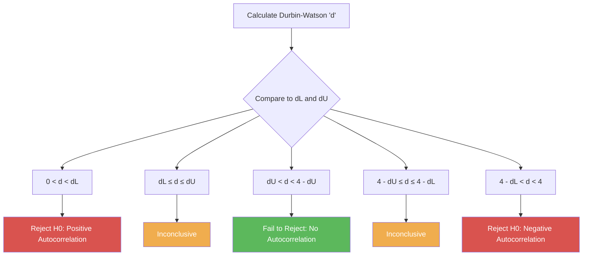

# Multiple Regression & Diagnostics of Classical Violations

> [!abstract] Curriculum & Syllabus Context
>
> - **Course:** ACC 303 Advanced Statistical Techniques
> - **Module:** Module 6: Multiple Regression & Diagnostics of Classical Violations
> - **Target Reading:** Gujarati & Porter (5e) Ch. 7, 8, 10, 11, 12; Lind, Marchal & Wathen (18e) Ch. 14 & 18.6
> - **Syllabus Focus:** Three-variable & k-variable multiple regression specification, matrix notation, partial regression coefficients, OLS derivation & normal equations, R^2 vs. adjusted R^2, individual t-tests, global F-test, testing linear restrictions (Restricted Least Squares), Chow test for structural stability, dummy variables and the dummy variable trap, Multicollinearity (VIF/Tolerance, detection & remediation), Heteroscedasticity (Park, Glejser, Goldfeld-Quandt, White, WLS/robust errors), and Autocorrelation (AR(1), Durbin-Watson d test, Durbin's h, Breusch-Godfrey, Cochrane-Orcutt, Newey-West errors).

---

### SECTION 1: Three-Variable & K-Variable Multiple Linear Regression Model (Estimation)

#### 1.1 Model Specification & Matrix Notation
In economic and financial analysis, single independent variables are rarely sufficient to explain complex real-world phenomena. Multiple regression analysis extends the two-variable framework by expressing a single dependent variable $Y$ as a linear function of $k-1$ explanatory variables $X_2, X_3, \dots, X_k$ plus a stochastic disturbance term $u$.

> [!quote] Formula & Derivation: Multiple Regression PRF
>
> For a three-variable model, the Population Regression Function (PRF) is written as:
> $$Y_i = \beta_1 + \beta_2 X_{2i} + \beta_3 X_{3i} + u_i \quad (i = 1, 2, \dots, n) \tag{1.1}$$
> 
> Taking the conditional expectation on both sides yields:
> $$E(Y_i | X_{2i}, X_{3i}) = \beta_1 + \beta_2 X_{2i} + \beta_3 X_{3i} \tag{1.2}$$

> [!quote] Formula & Derivation: Matrix Notation for $k$-Variable Model
>
> In matrix notation, the general $k$-variable model for $n$ observations is represented as:
> $$\mathbf{y} = \mathbf{X} \boldsymbol{\beta} + \mathbf{u} \tag{1.3}$$
> where:
> $$\mathbf{y} = \begin{bmatrix} Y_1 \\ Y_2 \\ \dots \\ Y_n \end{bmatrix}_{n \times 1}, \quad \mathbf{X} = \begin{bmatrix} 1 & X_{21} & X_{31} & \dots & X_{k1} \\ 1 & X_{22} & X_{32} & \dots & X_{k2} \\ \dots & \dots & \dots & \ddots & \dots \\ 1 & X_{2n} & X_{3n} & \dots & X_{kn} \end{bmatrix}_{n \times k}, \quad \boldsymbol{\beta} = \begin{bmatrix} \beta_1 \\ \beta_2 \\ \dots \\ \beta_k \end{bmatrix}_{k \times 1}, \quad \mathbf{u} = \begin{bmatrix} u_1 \\ u_2 \\ \dots \\ u_n \end{bmatrix}_{n \times 1} \tag{1.4}$$

---

#### 1.2 Conceptual Meaning of Partial Regression Coefficients
> [!info] Key Definition
>
> The coefficients $\beta_2$ and $\beta_3$ are designated as **partial regression coefficients** or **partial slope coefficients**. 
> * $\beta_2$ measures the net change in the conditional mean value of $Y$ per unit change in $X_2$, holding the effect of $X_3$ constant. Mathematically, $\beta_2 = \frac{\partial E(Y|X_2, X_3)}{\partial X_2}$.
> * $\beta_3$ measures the net change in the conditional mean value of $Y$ per unit change in $X_3$, holding the effect of $X_2$ constant. Mathematically, $\beta_3 = \frac{\partial E(Y|X_2, X_3)}{\partial X_3}$.
> * The intercept $\beta_1$ represents the mean response of $Y$ when both $X_2$ and $X_3$ are set to zero.

---

#### 1.3 Derivation of Ordinary Least Squares (OLS) Estimators
The Sample Regression Function (SRF) is expressed as:
$$Y_i = \hat{\beta}_1 + \hat{\beta}_2 X_{2i} + \hat{\beta}_3 X_{3i} + \hat{u}_i = \hat{Y}_i + \hat{u}_i \tag{1.5}$$

To estimate $\hat{\beta}_1, \hat{\beta}_2, \hat{\beta}_3$, ordinary least squares minimizes the Residual Sum of Squares (RSS):
$$\text{RSS} = \sum \hat{u}_i^2 = \sum (Y_i - \hat{\beta}_1 - \hat{\beta}_2 X_{2i} - \hat{\beta}_3 X_{3i})^2 \tag{1.6}$$

> [!quote] Formula & Derivation: OLS Normal Equations
>
> Differentiating RSS partially with respect to $\hat{\beta}_1, \hat{\beta}_2, \hat{\beta}_3$ and setting the partial derivatives to zero produces the OLS **normal equations**:
> $$\sum Y_i = n \hat{\beta}_1 + \hat{\beta}_2 \sum X_{2i} + \hat{\beta}_3 \sum X_{3i} \tag{1.7a}$$
> $$\sum Y_i X_{2i} = \hat{\beta}_1 \sum X_{2i} + \hat{\beta}_2 \sum X_{2i}^2 + \hat{\beta}_3 \sum X_{2i} X_{3i} \tag{1.7b}$$
> $$\sum Y_i X_{3i} = \hat{\beta}_1 \sum X_{3i} + \hat{\beta}_2 \sum X_{2i} X_{3i} + \hat{\beta}_3 \sum X_{3i}^2 \tag{1.7c}$$
> 
> Dividing equation (1.7a) by $n$ shows that the estimated regression surface passes through the sample means $(\bar{Y}, \bar{X}_2, \bar{X}_3)$:
> $$\hat{\beta}_1 = \bar{Y} - \hat{\beta}_2 \bar{X}_2 - \hat{\beta}_3 \bar{X}_3 \tag{1.8}$$
> 
> Expressing variables as mean deviations ($y_i = Y_i - \bar{Y}$, $x_{2i} = X_{2i} - \bar{X}_2$, $x_{3i} = X_{3i} - \bar{X}_3$), the system reduces to two simultaneous deviation equations:
> $$\sum y_i x_{2i} = \hat{\beta}_2 \sum x_{2i}^2 + \hat{\beta}_3 \sum x_{2i} x_{3i} \tag{1.9a}$$
> $$\sum y_i x_{3i} = \hat{\beta}_2 \sum x_{2i} x_{3i} + \hat{\beta}_3 \sum x_{3i}^2 \tag{1.9b}$$
> 
> Solving these linear equations simultaneously via Cramer's rule yields the explicit algebraic OLS estimators:
> $$\hat{\beta}_2 = \frac{(\sum y_i x_{2i})(\sum x_{3i}^2) - (\sum y_i x_{3i})(\sum x_{2i} x_{3i})}{(\sum x_{2i}^2)(\sum x_{3i}^2) - (\sum x_{2i} x_{3i})^2} \tag{1.10}$$
> $$\hat{\beta}_3 = \frac{(\sum y_i x_{3i})(\sum x_{2i}^2) - (\sum y_i x_{2i})(\sum x_{2i} x_{3i})}{(\sum x_{2i}^2)(\sum x_{3i}^2) - (\sum x_{2i} x_{3i})^2} \tag{1.11}$$
> 
> In matrix notation, the OLS estimator vector $\hat{\boldsymbol{\beta}}$ is derived by minimizing $\mathbf{\hat{u}'\hat{u}} = (\mathbf{y} - \mathbf{X}\hat{\boldsymbol{\beta}})'(\mathbf{y} - \mathbf{X}\hat{\boldsymbol{\beta}})$, giving the matrix normal equation:
> $$(\mathbf{X'X})\hat{\boldsymbol{\beta}} = \mathbf{X'y} \implies \hat{\boldsymbol{\beta}} = (\mathbf{X'X})^{-1}\mathbf{X'y} \tag{1.12}$$

---

#### 1.4 Variances, Covariances, and Unbiased Error Variance
> [!quote] Formula & Derivation: Variances and VIF
>
> Under the classical assumptions, the sampling variances and covariances of the partial slope estimates are given by:
> $$\text{Var}(\hat{\beta}_2) = \frac{\sigma^2}{\sum x_{2i}^2 (1 - r_{23}^2)} = \frac{\sigma^2}{\sum x_{2i}^2} \cdot \text{VIF}_2 \tag{1.13}$$
> $$\text{Var}(\hat{\beta}_3) = \frac{\sigma^2}{\sum x_{3i}^2 (1 - r_{23}^2)} = \frac{\sigma^2}{\sum x_{3i}^2} \cdot \text{VIF}_3 \tag{1.14}$$
> $$\text{Cov}(\hat{\beta}_2, \hat{\beta}_3) = \frac{-r_{23} \sigma^2}{(1 - r_{23}^2) \sqrt{\sum x_{2i}^2 \sum x_{3i}^2}} \tag{1.15}$$
> where $r_{23} = \frac{\sum x_{2i} x_{3i}}{\sqrt{\sum x_{2i}^2 \sum x_{3i}^2}}$ is the sample correlation coefficient between $X_2$ and $X_3$, and $\text{VIF}_j = \frac{1}{1 - r_{23}^2}$ is the Variance Inflation Factor.
> 
> In matrix notation, the variance-covariance matrix of $\hat{\boldsymbol{\beta}}$ is:
> $$\text{Var-Cov}(\hat{\boldsymbol{\beta}}) = \sigma^2 (\mathbf{X'X})^{-1} \tag{1.16}$$
> 
> Since the true error variance $\sigma^2$ is unobservable, its unbiased estimator $\hat{\sigma}^2$ (or Standard Error of Regression $se$) is calculated using the degrees of freedom $n - k$ (where $k = 3$ for a three-variable model):
> $$\hat{\sigma}^2 = \frac{\sum \hat{u}_i^2}{n - k} = \frac{\text{RSS}}{n - 3} = \frac{\sum y_i^2 - \hat{\beta}_2 \sum y_i x_{2i} - \hat{\beta}_3 \sum y_i x_{3i}}{n - 3} \tag{1.17}$$

---

#### 1.5 Goodness of Fit: $R^2$ vs. Adjusted $R^2$ ($\bar{R}^2$)
The total variation in $Y$ about its sample mean is partitioned into Explained Sum of Squares ($\text{ESS}$) and Residual Sum of Squares ($\text{RSS}$):
$$\text{TSS} = \text{ESS} + \text{RSS} \implies \sum y_i^2 = \sum \hat{y}_i^2 + \sum \hat{u}_i^2 \tag{1.18}$$

> [!quote] Formula & Derivation: Coefficient of Determination
>
> 1. **Multiple Coefficient of Determination ($R^2$)**: Measures the proportion of total variation in $Y$ jointly explained by all regressors:
> $$R^2 = \frac{\text{ESS}}{\text{TSS}} = \frac{\hat{\beta}_2 \sum y_i x_{2i} + \hat{\beta}_3 \sum y_i x_{3i}}{\sum y_i^2} = 1 - \frac{\text{RSS}}{\text{TSS}} \tag{1.19}$$
> 
> 2. **Adjusted $R^2$ ($\bar{R}^2$)**: Corrects $R^2$ for degrees of freedom lost as additional regressors are included:
> $$\bar{R}^2 = 1 - \frac{\text{RSS} / (n - k)}{\text{TSS} / (n - 1)} = 1 - \frac{\hat{\sigma}^2}{S_Y^2} = 1 - (1 - R^2) \frac{n - 1}{n - k} \tag{1.20}$$

> [!warning] Exam Pitfall / Exception
>
> ##### Properties & Rules for Comparing $R^2$ Values:
> * **Monotonic Non-Decreasing Property**: Adding a regressor never decreases $R^2$ because $\text{RSS}$ cannot increase.
> * **$\bar{R}^2$ Behavior**: $\bar{R}^2$ increases if and only if the absolute $t$-statistic of the added variable exceeds 1.0 ($|t| > 1$) or the incremental $F$-statistic exceeds 1.0 ($F > 1$).
> * **Comparison Rule**: To compare $R^2$ or $\bar{R}^2$ across competing models, both models **must** have the exact same dependent variable ($Y$) and the same sample size $n$. $R^2$ from a linear model ($Y$) cannot be directly compared to $R^2$ from a log-linear model ($\ln Y$).

---

#### 1.6 Cobb-Douglas Production Function & Polynomial Regression
1. **Cobb-Douglas Model**: A classic non-linear production function defined as $Y = \beta_1 L^{\beta_2} K^{\beta_3} e^u$.
   Log-transforming yields an intrinsically linear double-log specification:
   $$\ln Y_i = \beta_0 + \beta_2 \ln L_i + \beta_3 \ln K_i + u_i \quad (\text{where } \beta_0 = \ln \beta_1) \tag{1.21}$$
   * $\beta_2, \beta_3$ represent the constant partial output elasticities with respect to labor and capital.
   * $\beta_2 + \beta_3 = 1$ indicates Constant Returns to Scale (CRS); $> 1$ indicates Increasing Returns to Scale (IRS); $< 1$ indicates Decreasing Returns to Scale (DRS).

2. **Polynomial Regression**: Models non-linear relationships using powers of a single explanatory variable:
   $$Y_i = \beta_0 + \beta_1 X_i + \beta_2 X_i^2 + \beta_3 X_i^3 + u_i \tag{1.22}$$
   Though non-linear in variables, it is strictly linear in parameters and estimated via linear OLS.

---

### SECTION 2: Multiple Regression Inference & Hypothesis Testing

---

#### 2.1 Testing Individual Partial Coefficients ($t$-Test)
> [!quote] Formula & Derivation
>
> Under the Classical Normal Linear Regression Model (CNLRM) assumption $u_i \sim \text{NID}(0, \sigma^2)$, each estimated coefficient follows a normal distribution.
> To test $H_0: \beta_j = \beta_{j0}$ versus $H_1: \beta_j \neq \beta_{j0}$ (or directional alternatives):
> $$t = \frac{\hat{\beta}_j - \beta_{j0}}{se(\hat{\beta}_j)} \sim t_{n - k} \tag{2.1}$$
> where $se(\hat{\beta}_j) = \sqrt{\text{Var}(\hat{\beta}_j)}$. Decision rule: Reject $H_0$ at significance level $\alpha$ if $|t_{\text{calc}}| > t_{\alpha/2, n-k}$ or if $p\text{-value} < \alpha$.

---

#### 2.2 Global Test of Overall Significance ($F$-Test)
To test whether all partial slope coefficients are simultaneously zero:
$$H_0: \beta_2 = \beta_3 = \dots = \beta_k = 0 \quad \text{vs.} \quad H_1: \text{At least one } \beta_j \neq 0 \tag{2.2}$$

##### Analysis of Variance (ANOVA) Table for Multiple Regression:
$$ \begin{array}{lcccc}
\hline
\textbf{Source of Variation} & \textbf{Sum of Squares (SS)} & \textbf{df} & \textbf{Mean Square (MS)} & \textbf{Computed } F\textbf{-Statistic} \\
\hline
\textbf{Regression (ESS)} & \text{ESS} = \hat{\beta}_2 \sum y_i x_{2i} + \hat{\beta}_3 \sum y_i x_{3i} & k - 1 & \text{MSR} = \frac{\text{ESS}}{k - 1} & F = \frac{\text{MSR}}{\text{MSE}} = \frac{\text{ESS} / (k - 1)}{\text{RSS} / (n - k)} \\
\textbf{Residual (RSS)} & \text{RSS} = \sum \hat{u}_i^2 & n - k & \text{MSE} = \hat{\sigma}^2 = \frac{\text{RSS}}{n - k} & - \\
\hline
\textbf{Total (TSS)} & \text{TSS} = \sum y_i^2 & n - 1 & - & - \\
\hline \hline
\end{array} $$

> [!quote] Formula & Derivation: Global $F$-Test
>
> Using the relationship $\text{ESS}/\text{TSS} = R^2$, $F$ is expressed in terms of $R^2$ as:
> $$F = \frac{R^2 / (k - 1)}{(1 - R^2) / (n - k)} \sim F_{k - 1, n - k} \tag{2.3}$$
> If $F_{\text{calc}} > F_{\alpha, k-1, n-k}$ or $p\text{-value} < \alpha$, reject $H_0$, concluding that the regressors jointly exert a statistically significant influence on $Y$.

---

#### 2.3 Testing Linear Equality Restrictions & Restricted Least Squares (RLS)
> [!quote] Formula & Derivation
>
> Economic theory often imposes linear restrictions on parameters (e.g., constant returns to scale $\beta_2 + \beta_3 = 1$).
> 1. **Unrestricted Model**: $\ln Y_i = \beta_0 + \beta_2 \ln L_i + \beta_3 \ln K_i + u_i$ ($k = 3$ parameters, $RSS_{UR}$).
> 2. **Restricted Model**: Substituting $\beta_2 = 1 - \beta_3$ into the PRF yields:
>    $$\ln (Y_i / L_i) = \beta_0 + \beta_3 \ln (K_i / L_i) + u_i \quad (RSS_R) \tag{2.4}$$
> 
> To test the validity of $m$ linear restrictions (where $m = 1$ here):
> $$F = \frac{(\text{RSS}_R - \text{RSS}_{UR}) / m}{\text{RSS}_{UR} / (n - k)} = \frac{(R_{UR}^2 - R_R^2) / m}{(1 - R_{UR}^2) / (n - k)} \sim F_{m, n - k} \tag{2.5}$$
> If $F_{\text{calc}} > F_{\alpha, m, n-k}$, the restriction is rejected as statistically invalid.

---

#### 2.4 Testing Incremental / Marginal Contribution of Variables
> [!quote] Formula & Derivation
>
> To test whether adding a new subset of $m$ variables significantly improves model explanation:
> $$F = \frac{(\text{ESS}_{\text{new}} - \text{ESS}_{\text{old}}) / m}{\text{RSS}_{\text{new}} / (n - k_{\text{new}})} = \frac{(R_{\text{new}}^2 - R_{\text{old}}^2) / m}{(1 - R_{\text{new}}^2) / (n - k_{\text{new}})} \sim F_{m, n - k_{\text{new}}} \tag{2.6}$$

---

#### 2.5 Structural Stability Testing (Chow Test) & Dummy Variables
When analyzing time-series or cross-sectional groups, parameter values may shift due to structural breaks or policy regime changes.

> [!quote] Formula & Derivation: Chow $F$-Test
>
> ##### 1. The Chow $F$-Test Procedure:
> * Estimate Subperiod 1 ($n_1$ observations): $\text{RSS}_1$ with $df_1 = n_1 - k$.
> * Estimate Subperiod 2 ($n_2$ observations): $\text{RSS}_2$ with $df_2 = n_2 - k$.
> * Unrestricted RSS: $\text{RSS}_{UR} = \text{RSS}_1 + \text{RSS}_2$ with $df = n_1 + n_2 - 2k$.
> * Estimate Pooled Restricted Model ($n = n_1 + n_2$ observations): $\text{RSS}_R$ with $df = n_1 + n_2 - k$.
> * Test Statistic:
>   $$F = \frac{(\text{RSS}_R - \text{RSS}_{UR}) / k}{\text{RSS}_{UR} / (n_1 + n_2 - 2k)} \sim F_{k, n_1 + n_2 - 2k} \tag{2.7}$$

> [!warning] Exam Pitfall / Exception: Limitations of Chow Test
>
> * Requires error variance homoscedasticity across subperiods ($\sigma_1^2 = \sigma_2^2$), tested via $F = \hat{\sigma}_1^2 / \hat{\sigma}_2^2 \sim F_{n_1-k, n_2-k}$.
> * The break point must be known a priori.
> * Does **not** identify whether the structural break stems from intercept differences, slope differences, or both.

##### 2. The Dummy Variable Structural Break Approach:
To pinpoint exact structural differences, formulate a single interaction regression:
$$Y_t = \alpha_1 + \alpha_2 D_t + \beta_1 X_t + \beta_2 (D_t X_t) + u_t \tag{2.8}$$
where $D_t = 1$ for Subperiod 2 and $D_t = 0$ for Subperiod 1.
* $\alpha_2$ = **Differential Intercept**: tests for parallel intercept shift.
* $\beta_2$ = **Differential Slope (Slope Drifter)**: tests for slope angle change.
* Testing $\alpha_2 = \beta_2 = 0$ simultaneously via $F$-test replicates the Chow test in a single estimation step.

---

#### 2.6 Dummy / Qualitative Independent Variables
Qualitative attributes (e.g., gender, region, policy shifts) are introduced via binary indicator variables taking values 0 or 1.

> [!warning] Exam Pitfall / Exception: Dummy Variable Trap Rule
>
> If a qualitative variable has $m$ categories, include exactly **$m - 1$ dummy variables** when an intercept is included. Including $m$ dummies causes perfect multicollinearity ($\sum D_m = 1 = \text{Intercept column}$).

2. **Benchmark / Base Category**: The omitted category ($D = 0$) serves as the reference point. The intercept $\alpha_1$ measures the mean value of the benchmark category.
3. **ANOVA vs. ANCOVA Models**:
   * **ANOVA Models**: Contain exclusively qualitative regressors.
   * **ANCOVA Models**: Contain a mixture of continuous quantitative covariates and qualitative dummy regressors.
4. **Semilogarithmic Dummy Models (Halvorsen-Palmquist Correction)**:
   In $\ln Y_i = \beta_1 + \beta_2 D_i + u_i$, the exact percentage change in $Y$ for $D = 1$ vs. $D = 0$ is:
   $$\% \Delta Y = 100 \cdot (e^{\hat{\beta}_2} - 1) \tag{2.9}$$

---

### SECTION 3: OLS Violation 1 — Multicollinearity

---

#### 3.1 Nature of Multicollinearity
> [!info] Key Definition
>
> Multicollinearity denotes the existence of exact or near linear relationships among the explanatory variables in a multiple regression model.
> * **Perfect Multicollinearity**: $\lambda_1 X_1 + \lambda_2 X_2 + \dots + \lambda_k X_k = 0$ (where $\lambda_j \neq 0$). OLS coefficients become mathematically indeterminate ($0/0$) and standard errors become infinite.
> * **Imperfect Multicollinearity**: $\lambda_1 X_1 + \lambda_2 X_2 + \dots + \lambda_k X_k + v_i = 0$. OLS coefficients are determinate, but possess large variances and standard errors.

---

#### 3.2 Theoretical vs. Practical Consequences
> [!warning] Exam Pitfall / Exception: Consequences
>
> * **Theoretical Properties**: OLS estimators **remain BLUE** (Unbiased, Minimum Variance within the linear class). Multicollinearity does not violate any core OLS assumption.
> * **Practical Consequences**:
>   1. **Large Variances & Standard Errors**: Variances inflate rapidly as correlation $r_{23} \to 1$.
>   2. **Wider Confidence Intervals**: Leading to frequent acceptance of false zero null hypotheses (Type II error).
>   3. **Insignificant $t$-Ratios**: Individual $t$-statistics become small and statistically insignificant despite strong underlying relationships.
>   4. **High $R^2$ with Few Significant $t$-Ratios**: The "classic symptom" of multicollinearity.
>   5. **Extreme Sensitivity**: Estimates and standard errors fluctuate wildly with small data additions or deletions.

---

#### 3.3 Detection Methods
1. **High $R^2$ with Insignificant $t$-Statistics**: Overall $F$-statistic is highly significant, but individual $t$-tests fail to reject $\beta_j = 0$.
2. **High Pairwise Correlations ($r_{jk}$)**: Pairwise correlation $r_{23} > 0.80$ indicates collinearity. *(Sufficient but not necessary condition in $k > 2$ models)*.
3. **Auxiliary Regressions & Klein's Rule of Thumb**: Regress each $X_j$ on all remaining $k-2$ regressors, obtaining $R_j^2$. Klein's Rule: Multicollinearity is troublesome if auxiliary $R_j^2 > \text{Overall } R^2$.
4. **Variance Inflation Factor (VIF) & Tolerance (TOL)**:
   $$\text{VIF}_j = \frac{1}{1 - R_j^2}, \quad \text{TOL}_j = \frac{1}{\text{VIF}_j} = 1 - R_j^2 \tag{3.1}$$
   Rule of Thumb: $\text{VIF}_j > 10$ (or $\text{TOL}_j < 0.10$, corresponding to $R_j^2 > 0.90$) indicates severe multicollinearity.
5. **Eigenvalues & Condition Index (CI)**:
   $$\text{Condition Number } k = \frac{\lambda_{\max}}{\lambda_{\min}}, \quad \text{Condition Index (CI)} = \sqrt{\frac{\lambda_{\max}}{\lambda_{\min}}} \tag{3.2}$$
   Rule of Thumb: $\text{CI}$ between 10 and 30 indicates moderate collinearity; $\text{CI} > 30$ indicates severe multicollinearity.

---

#### 3.4 Remedial Measures
1. **Do Nothing**: Blanchard, Leamer, and Goldberger view multicollinearity as a data deficiency ("micronumerosity"). If prediction is the main goal, collinearity is unharmful as long as future data preserve the collinearity structure.
2. **A Priori Information**: Incorporate external theoretical constraints or prior empirical estimates.
3. **Pooling Cross-Sectional and Time-Series Data**: Use cross-sectional income elasticity to constrain time-series price elasticity estimation.
4. **Dropping a Variable**: Eliminates collinearity but introduces **specification bias** if the omitted variable belongs in the true model.
   Bias formula when omitting $X_3$: $E(\hat{\alpha}_2) = \beta_2 + \beta_3 b_{32}$.
5. **Data Transformations**:
   * **First-Difference Form**: $\Delta Y_t = \beta_2 \Delta X_{2t} + \beta_3 \Delta X_{3t} + v_t$.
   * **Ratio / Per-Capita Transformation**: Divide variables by population or size variable.
6. **Centering Polynomial Variables**: Express polynomial regressors as deviations from sample means $(X_i - \bar{X})^2$.

---

### SECTION 4: OLS Violation 2 — Heteroscedasticity

---

#### 4.1 Nature of Heteroscedasticity
> [!info] Key Definition
>
> Heteroscedasticity occurs when the conditional variance of the disturbance term $u_i$ is non-constant across observations:
> $$\text{Var}(u_i | X_i) = \sigma_i^2 \neq \sigma^2 \tag{4.1}$$
> Common in cross-sectional data where variance grows with scale (e.g., firm size, income level).

---

#### 4.2 Consequences of OLS under Heteroscedasticity
> [!warning] Exam Pitfall / Exception: Consequences
>
> 1. OLS estimators **remain linear and unbiased**, and consistent.
> 2. OLS estimators are **no longer efficient** (no longer BLUE).
> 3. The conventional OLS variance formula $\text{Var}(\hat{\beta}_2) = \frac{\sigma^2}{\sum x_{2i}^2}$ is biased, causing invalid $t$ and $F$ test statistics and incorrect confidence intervals.

---

#### 4.3 Detection Methods
1. **Graphical Analysis**: Plot squared OLS residuals $\hat{u}_i^2$ or absolute residuals $|\hat{u}_i|$ against fitted values $\hat{Y}_i$ or regressor $X_i$ to identify systematic variance patterns.
2. **Park Test**: Regress $\ln \hat{u}_i^2$ on $\ln X_i$:
   $$\ln \hat{u}_i^2 = \ln \sigma^2 + \beta \ln X_i + v_i \tag{4.2}$$
   If $\beta$ is statistically significant via $t$-test, heteroscedasticity is confirmed.
3. **Glejser Test**: Regress absolute residuals $|\hat{u}_i|$ on $X_i$ or its functional forms ($\sqrt{X_i}, 1/X_i$):
   $$|\hat{u}_i| = \alpha_0 + \alpha_1 X_i + v_i \tag{4.3}$$
   Statistical significance of $\alpha_1$ confirms heteroscedasticity.
4. **Goldfeld-Quandt Test**:
   * Sort data by regressor $X_i$; omit $c$ central observations ($c \approx n/6$ to $n/4$).
   * Estimate OLS on lower $n_1 = (n-c)/2$ observations ($\text{RSS}_1, df_1$) and upper $n_2 = (n-c)/2$ observations ($\text{RSS}_2, df_2$).
   * Calculate $F_{\text{calc}} = \frac{\text{RSS}_2 / df_2}{\text{RSS}_1 / df_1} \sim F_{df_2, df_1}$. Reject homoscedasticity if $F_{\text{calc}} > F_{\text{critical}}$.
5. **Breusch-Pagan-Godfrey (BPG) Test**:
   * Regress $\hat{u}_i^2$ on explanatory variables $X_2, X_3, \dots, X_k$:
     $$\hat{u}_i^2 = \alpha_1 + \alpha_2 X_{2i} + \dots + \alpha_k X_{ki} + v_i \tag{4.4}$$
   * Calculate test statistic $LM = n R_{\text{aux}}^2 \sim \chi_{k-1}^2$. If $LM > \chi_{\text{crit}}^2$, reject homoscedasticity.
6. **White's General Heteroscedasticity Test**:
   * Regress $\hat{u}_i^2$ on all regressors, their squares, and cross-products:
     $$\hat{u}_i^2 = \alpha_1 + \alpha_2 X_{2i} + \alpha_3 X_{3i} + \alpha_4 X_{2i}^2 + \alpha_5 X_{3i}^2 + \alpha_6 (X_{2i}X_{3i}) + v_i \tag{4.5}$$
   * Test statistic $LM = n R_{\text{aux}}^2 \sim \chi_{\text{df}}^2$ (where $\text{df}$ = number of auxiliary regressors excluding constant).

---

#### 4.4 Remedial Measures
> [!quote] Formula & Derivation: Heteroscedasticity Corrections
>
> 1. **Weighted Least Squares (WLS) / Generalized Least Squares (GLS)**:
>    When $\sigma_i^2$ is known or assumed proportional to a known structure, transform the model:
>    * **Case 1: $\sigma_i^2 = \sigma^2 X_i^2$**: Divide original equation by $X_i$.
>      $$\frac{Y_i}{X_i} = \beta_1 \left(\frac{1}{X_i}\right) + \beta_2 + \frac{u_i}{X_i} \tag{4.6}$$
>    * **Case 2: $\sigma_i^2 = \sigma^2 X_i$**: Divide original equation by $\sqrt{X_i}$.
>      $$\frac{Y_i}{\sqrt{X_i}} = \beta_1 \left(\frac{1}{\sqrt{X_i}}\right) + \beta_2 \sqrt{X_i} + \frac{u_i}{\sqrt{X_i}} \tag{4.7}$$
>    * **Case 3: $\sigma_i^2 = \sigma^2 [E(Y_i)]^2$**: Divide equation by estimated fitted values $\hat{Y}_i$.
> 2. **White's Heteroscedasticity-Consistent Standard Errors (HCSE)**:
>    In large samples, estimate OLS normally but use White's robust standard errors for hypothesis testing.

---

### SECTION 5: OLS Violation 3 — Autocorrelation

---

#### 5.1 Nature & $AR(1)$ Process
> [!info] Key Definition
>
> Autocorrelation represents correlation between error terms across time periods:
> $$\text{Cov}(u_t, u_s) \neq 0 \quad (t \neq s) \tag{5.1}$$
> The most common form is the **First-Order Autoregressive $AR(1)$ Scheme**:
> $$u_t = \rho u_{t-1} + \epsilon_t \quad (-1 < \rho < 1) \tag{5.2}$$
> where $\rho$ is the parameter of autocorrelation and $\epsilon_t \sim \text{NID}(0, \sigma_\epsilon^2)$ is white noise.

---

#### 5.2 Consequences of OLS under Autocorrelation
> [!warning] Exam Pitfall / Exception: Consequences
>
> 1. OLS estimators **remain linear and unbiased**, and consistent.
> 2. OLS estimators are **inefficient** (not BLUE).
> 3. The OLS residual variance $\hat{\sigma}^2 = \frac{\text{RSS}}{n-k}$ **underestimates** true $\sigma^2$, artificially inflating $R^2$ and understating standard errors.
> 4. Conventional $t$ and $F$ tests yield misleadingly over-optimistic conclusions.

---

#### 5.3 Detection Methods
1. **Graphical Method**: Plot OLS residuals $\hat{u}_t$ against time $t$ or lag residuals $\hat{u}_{t-1}$.
2. **Runs Test (Geary Test)**: Tests for non-randomness in residual sign sequences (+ and -).
3. **Durbin-Watson $d$ Statistic Test**:

> [!quote] Formula & Derivation: Autocorrelation Tests
>
> $$d = \frac{\sum_{t=2}^n (\hat{u}_t - \hat{u}_{t-1})^2}{\sum_{t=1}^n \hat{u}_t^2} \approx 2(1 - \hat{\rho}) \tag{5.3}$$
> * **Assumptions/Limitations**: Intercept term must be present, regressors nonstochastic, no lagged dependent variables ($Y_{t-1}$), no missing observations.
> 
> 4. **Durbin's $h$-Test** (for Autoregressive Models containing $Y_{t-1}$):
>    $$h = \hat{\rho} \sqrt{\frac{n}{1 - n \cdot \text{Var}(\hat{\gamma})}} \sim N(0, 1) \tag{5.4}$$
>    where $\hat{\gamma}$ is the estimated coefficient of $Y_{t-1}$ and $\text{Var}(\hat{\gamma})$ is its squared standard error. Reject $H_0$ if $|h| > 1.96$ at $\alpha = 0.05$.
> 
> 5. **Breusch-Godfrey (BG) / Lagrange Multiplier (LM) Test**:
>    * Handles higher-order $AR(p)$, moving averages, and lagged dependent variables.
>    * Regress OLS residuals $\hat{u}_t$ on original $X$'s and lagged residuals $\hat{u}_{t-1}, \dots, \hat{u}_{t-p}$:
>      $$\hat{u}_t = \alpha_1 + \alpha_2 X_{2t} + \dots + \hat{\rho}_1 \hat{u}_{t-1} + \dots + \hat{\rho}_p \hat{u}_{t-p} + \epsilon_t \tag{5.5}$$
>    * Test Statistic: $LM = (n - p) R_{\text{aux}}^2 \sim \chi_p^2$. Reject $H_0$ if $LM > \chi_{p, \alpha}^2$.

---

#### 5.4 Remedial Measures
> [!quote] Formula & Derivation: Autocorrelation Corrections
>
> 1. **GLS / Quasi-Differencing (when $\rho$ is known)**:
>    $$Y_t^* = Y_t - \rho Y_{t-1}, \quad X_{2t}^* = X_{2t} - \rho X_{2t-1} \tag{5.6}$$
>    Apply **Prais-Winsten Transformation** for first observation: $Y_1 \sqrt{1 - \rho^2}$ and $X_{21} \sqrt{1 - \rho^2}$.
> 2. **First-Difference Method (when $\rho \approx 1$ or $d$ is very small)**:
>    $$\Delta Y_t = \beta_2 \Delta X_{2t} + \beta_3 \Delta X_{3t} + \epsilon_t \tag{5.7}$$
> 3. **Estimating $\rho$ when unknown**:
>    * From Durbin-Watson statistic: $\hat{\rho} \approx 1 - \frac{d}{2}$.
>    * **Cochrane-Orcutt Iterative Procedure**: Iteratively estimate $\hat{u}_t = \rho \hat{u}_{t-1}$, transform variables, re-estimate OLS until $\rho$ converges.
>    * **Hildreth-Lu Search Procedure**: Scan $\rho$ from $-0.99$ to $+0.99$ at intervals of $0.01$ to minimize RSS.
> 4. **Newey-West HAC Standard Errors**: Robust standard errors correcting for both heteroscedasticity and autocorrelation in large samples.

---

### SECTION 6: Comprehensive Numerical Problem Walkthroughs with Solutions

---

> [!example] Numerical Problem 1: Three-Variable OLS Estimation & Significance Testing
>
> **Scenario**: An analyst estimates a company's sales volume ($Y$, in \$000) based on Advertising Expenditure ($X_2$, in \$000) and Price Discount ($X_3$, in \%). A sample of $n = 15$ sales territories yields the following mean-deviation sum of squares and cross-products:
> * $\sum y_i^2 = 240.0$, $\sum x_{2i}^2 = 100.0$, $\sum x_{3i}^2 = 64.0$
> * $\sum y_i x_{2i} = 120.0$, $\sum y_i x_{3i} = 48.0$, $\sum x_{2i} x_{3i} = 40.0$
> * Sample Means: $\bar{Y} = 50.0$, $\bar{X}_2 = 10.0$, $\bar{X}_3 = 5.0$
> 
> ##### Required:
> 1. Calculate OLS partial slope estimates $\hat{\beta}_2, \hat{\beta}_3$ and intercept $\hat{\beta}_1$.
> 2. Compute $\text{ESS}$, $\text{RSS}$, error variance $\hat{\sigma}^2$, $R^2$, and $\bar{R}^2$.
> 3. Compute $se(\hat{\beta}_2), se(\hat{\beta}_3)$ and conduct individual $t$-tests at $\alpha = 0.05$.
> 4. Construct the ANOVA table and perform the global $F$-test at $\alpha = 0.05$.
> 5. Calculate $\text{VIF}_2$ and $\text{VIF}_3$.
> 
> ##### Solution Walkthrough:
> **1. Partial Regression Coefficients**:
> $$\hat{\beta}_2 = \frac{(\sum y_i x_{2i})(\sum x_{3i}^2) - (\sum y_i x_{3i})(\sum x_{2i} x_{3i})}{(\sum x_{2i}^2)(\sum x_{3i}^2) - (\sum x_{2i} x_{3i})^2} = \frac{(120.0)(64.0) - (48.0)(40.0)}{(100.0)(64.0) - (40.0)^2} = \frac{7680 - 1920}{6400 - 1600} = \frac{5760}{4800} = 1.20$$
> 
> $$\hat{\beta}_3 = \frac{(\sum y_i x_{3i})(\sum x_{2i}^2) - (\sum y_i x_{2i})(\sum x_{2i} x_{3i})}{(\sum x_{2i}^2)(\sum x_{3i}^2) - (\sum x_{2i} x_{3i})^2} = \frac{(48.0)(100.0) - (120.0)(40.0)}{4800} = \frac{4800 - 4800}{4800} = 0.00$$
> 
> Intercept $\hat{\beta}_1$:
> $$\hat{\beta}_1 = \bar{Y} - \hat{\beta}_2 \bar{X}_2 - \hat{\beta}_3 \bar{X}_3 = 50.0 - (1.20)(10.0) - (0.00)(5.0) = 50.0 - 12.0 = 38.0$$
> 
> The estimated SRF is $\hat{Y}_i = 38.0 + 1.20 X_{2i} + 0.00 X_{3i}$.
> 
> **2. Sum of Squares, $R^2$, and $\bar{R}^2$**:
> * $\text{ESS} = \hat{\beta}_2 \sum y_i x_{2i} + \hat{\beta}_3 \sum y_i x_{3i} = (1.20)(120.0) + (0.00)(48.0) = 144.0$
> * $\text{RSS} = \text{TSS} - \text{ESS} = 240.0 - 144.0 = 96.0$
> * $\hat{\sigma}^2 = \frac{\text{RSS}}{n - k} = \frac{96.0}{15 - 3} = \frac{96.0}{12} = 8.0 \implies \hat{\sigma} = \sqrt{8.0} \approx 2.8284$
> * $R^2 = \frac{\text{ESS}}{\text{TSS}} = \frac{144.0}{240.0} = 0.60 \quad (60\% \text{ variance explained})$
> * $\bar{R}^2 = 1 - (1 - R^2)\frac{n - 1}{n - k} = 1 - (1 - 0.60)\frac{14}{12} = 1 - (0.40)(1.1667) = 1 - 0.4667 = 0.5333$
> 
> **3. Standard Errors and $t$-Tests**:
> * Pairwise correlation between $X_2$ and $X_3$: $r_{23} = \frac{40.0}{\sqrt{100.0 \times 64.0}} = \frac{40.0}{80.0} = 0.50 \implies r_{23}^2 = 0.25$
> * $\text{Var}(\hat{\beta}_2) = \frac{\hat{\sigma}^2}{\sum x_{2i}^2 (1 - r_{23}^2)} = \frac{8.0}{100.0 (1 - 0.25)} = \frac{8.0}{75.0} = 0.1067 \implies se(\hat{\beta}_2) = \sqrt{0.1067} = 0.3266$
> * $\text{Var}(\hat{\beta}_3) = \frac{\hat{\sigma}^2}{\sum x_{3i}^2 (1 - r_{23}^2)} = \frac{8.0}{64.0 (1 - 0.25)} = \frac{8.0}{48.0} = 0.1667 \implies se(\hat{\beta}_3) = \sqrt{0.1667} = 0.4082$
> 
> Hypothesis tests ($H_0: \beta_j = 0$ vs. $H_1: \beta_j \neq 0$, $df = 12$, critical $t_{0.025, 12} = 2.179$):
> * For $\beta_2$: $t_{\text{calc}} = \frac{1.20}{0.3266} = 3.674$. Since $|3.674| > 2.179$, **reject $H_0$**. Advertising significantly affects sales.
> * For $\beta_3$: $t_{\text{calc}} = \frac{0.00}{0.4082} = 0.000$. Since $|0.000| \le 2.179$, **fail to reject $H_0$**. Price discount is individually insignificant.
> 
> **4. ANOVA Table & Global $F$-Test**:
> | Source | SS | df | MS | $F_{\text{calc}}$ |
> | :--- | :--- | :--- | :--- | :--- |
> | **Regression** | 144.0 | 2 | 72.0 | $F = \frac{72.0}{8.0} = 9.00$ |
> | **Residual** | 96.0 | 12 | 8.0 | |
> | **Total** | 240.0 | 14 | | |
> 
> * Critical $F_{0.05, 2, 12} = 3.89$. Since $F_{\text{calc}} = 9.00 > 3.89$, **reject $H_0$**. The model as a whole is statistically significant.
> 
> **5. VIF Calculation**:
> $$\text{VIF}_2 = \text{VIF}_3 = \frac{1}{1 - r_{23}^2} = \frac{1}{1 - 0.25} = \frac{1}{0.75} = 1.333$$
> Since $\text{VIF} = 1.333 < 10$, there is no serious multicollinearity.

---

> [!example] Numerical Problem 2: Chow Test & Structural Stability Walkthrough
>
> **Scenario**: An econometrician tests for a structural break in a consumption function before and after a major economic policy reform ($k = 2$ parameters: Intercept and MPC):
> * **Full Sample** ($n = 30$): $\text{RSS}_R = 500.0$.
> * **Subperiod 1** ($n_1 = 15$): $\text{RSS}_1 = 120.0$.
> * **Subperiod 2** ($n_2 = 15$): $\text{RSS}_2 = 180.0$.
> 
> ##### Required:
> 1. Conduct the Chow $F$-test for structural stability at $\alpha = 0.05$.
> 2. Verify the assumption of homoscedasticity between the two subperiods.
> 
> ##### Solution Walkthrough:
> **1. Chow $F$-Test**:
> * Unrestricted RSS: $\text{RSS}_{UR} = \text{RSS}_1 + \text{RSS}_2 = 120.0 + 180.0 = 300.0$
> * Unrestricted $df = n_1 + n_2 - 2k = 15 + 15 - 2(2) = 26$
> * Numerator $df = k = 2$
> * Computed $F$-statistic:
>   $$F_{\text{calc}} = \frac{(\text{RSS}_R - \text{RSS}_{UR}) / k}{\text{RSS}_{UR} / (n_1 + n_2 - 2k)} = \frac{(500.0 - 300.0) / 2}{300.0 / 26} = \frac{100.0}{11.5385} = 8.667$$
> * Critical $F_{0.05, 2, 26} = 3.37$.
> * **Conclusion**: Since $F_{\text{calc}} = 8.667 > 3.37$, **reject $H_0$**. A statistically significant structural break occurred between the two subperiods.
> 
> **2. Homoscedasticity Check**:
> * Subperiod 1 variance estimate: $\hat{\sigma}_1^2 = \frac{\text{RSS}_1}{n_1 - k} = \frac{120.0}{13} = 9.2308$.
> * Subperiod 2 variance estimate: $\hat{\sigma}_2^2 = \frac{\text{RSS}_2}{n_2 - k} = \frac{180.0}{13} = 13.8462$.
> * $F_{\text{variance}} = \frac{\hat{\sigma}_2^2}{\hat{\sigma}_1^2} = \frac{13.8462}{9.2308} = 1.500$.
> * Critical $F_{0.025, 13, 13} = 3.12$. Since $1.500 < 3.12$, the equal variance assumption holds, validating the Chow test.

---

> [!example] Numerical Problem 3: OLS Violation Diagnostic & Remedial Walkthrough
>
> **Scenario**: An analyst fits a time-series investment model ($n = 20$, $k = 3$): $\hat{Y}_t = 15.0 + 0.80 X_{2t} + 0.35 X_{3t}$.
> * The Durbin-Watson statistic is $d = 0.80$.
> * Durbin-Watson critical bounds for $n = 20, k' = 2$ at $\alpha = 0.05$: $d_L = 1.10, d_U = 1.54$.
> 
> ##### Required:
> 1. Test for autocorrelation using the Durbin-Watson $d$ test.
> 2. Estimate the autocorrelation parameter $\hat{\rho}$.
> 3. Transform the model using the Cochrane-Orcutt / Quasi-differencing procedure.
> 
> ##### Solution Walkthrough:
> **1. Durbin-Watson Test**:
> * $d_{\text{calc}} = 0.80$. Since $d_{\text{calc}} < d_L$ ($0.80 < 1.10$), **reject $H_0$**. There is statistically significant **positive first-order autocorrelation** in the residuals.
> 
> **2. Estimation of $\hat{\rho}$**:
> $$\hat{\rho} \approx 1 - \frac{d}{2} = 1 - \frac{0.80}{2} = 1 - 0.40 = 0.60 \tag{6.1}$$
> 
> **3. Quasi-Differencing Transformation**:
> Using $\hat{\rho} = 0.60$, transform the time-series variables for $t = 2, 3, \dots, 20$:
> $$Y_t^* = Y_t - 0.60 Y_{t-1}$$
> $$X_{2t}^* = X_{2t} - 0.60 X_{2t-1}$$
> $$X_{3t}^* = X_{3t} - 0.60 X_{3t-1}$$
> The transformed intercept is $\beta_1^* = \beta_1 (1 - \rho) = 15.0 \times (1 - 0.60) = 6.0$.
> Applying OLS to the transformed model $Y_t^* = \beta_1^* + \beta_2 X_{2t}^* + \beta_3 X_{3t}^* + \epsilon_t$ eliminates first-order autocorrelation, yielding BLUE estimates and valid standard errors.
