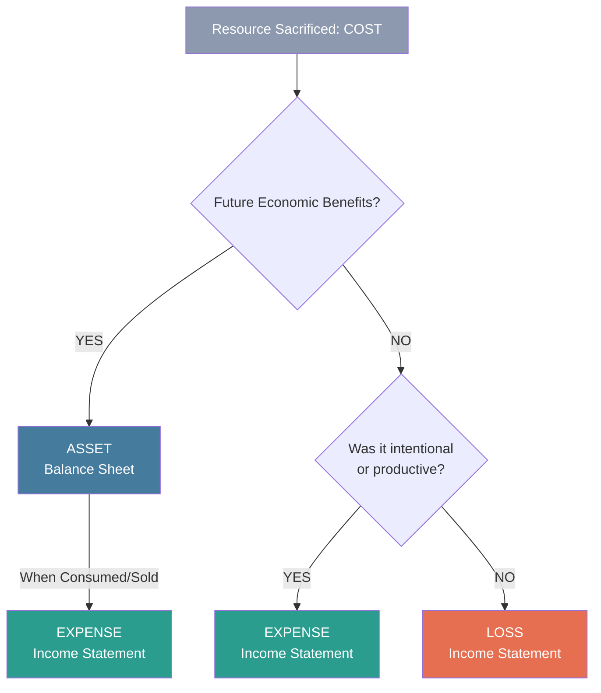
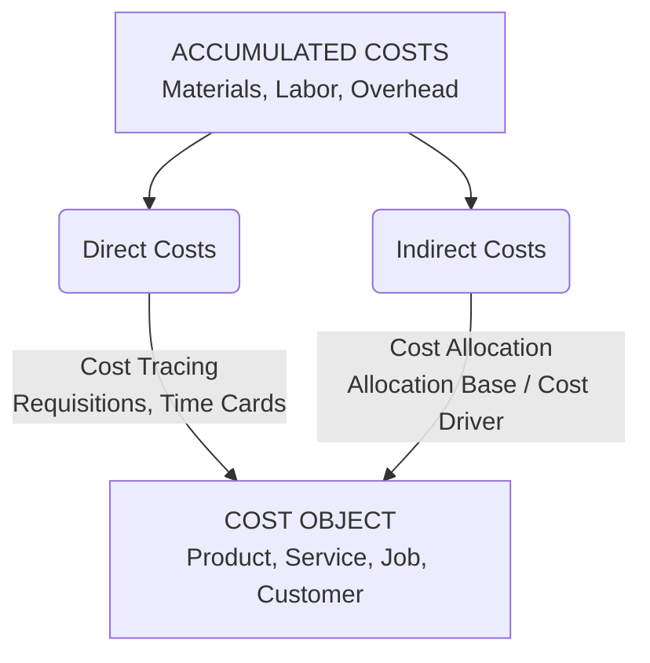
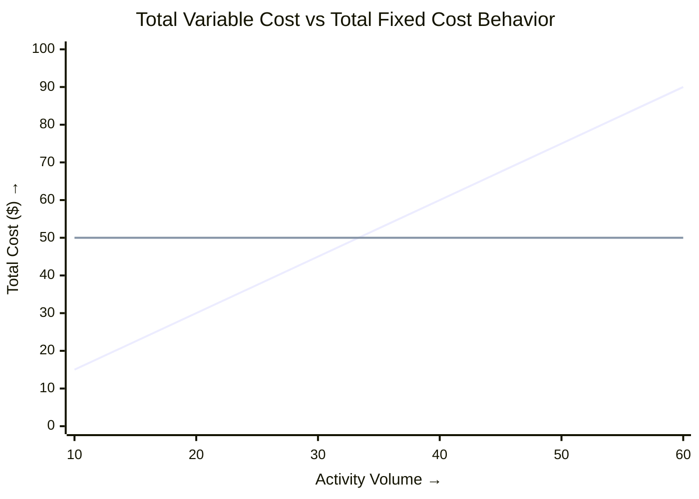
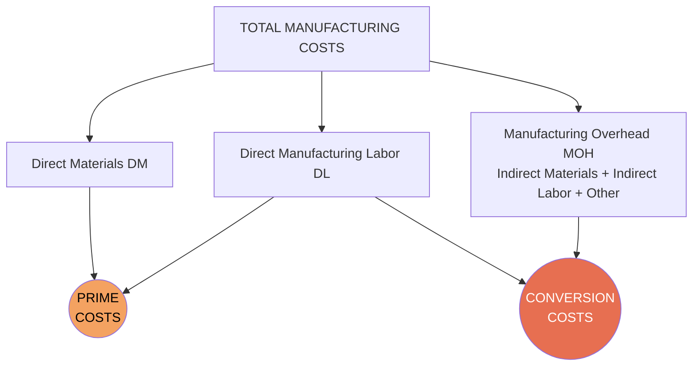
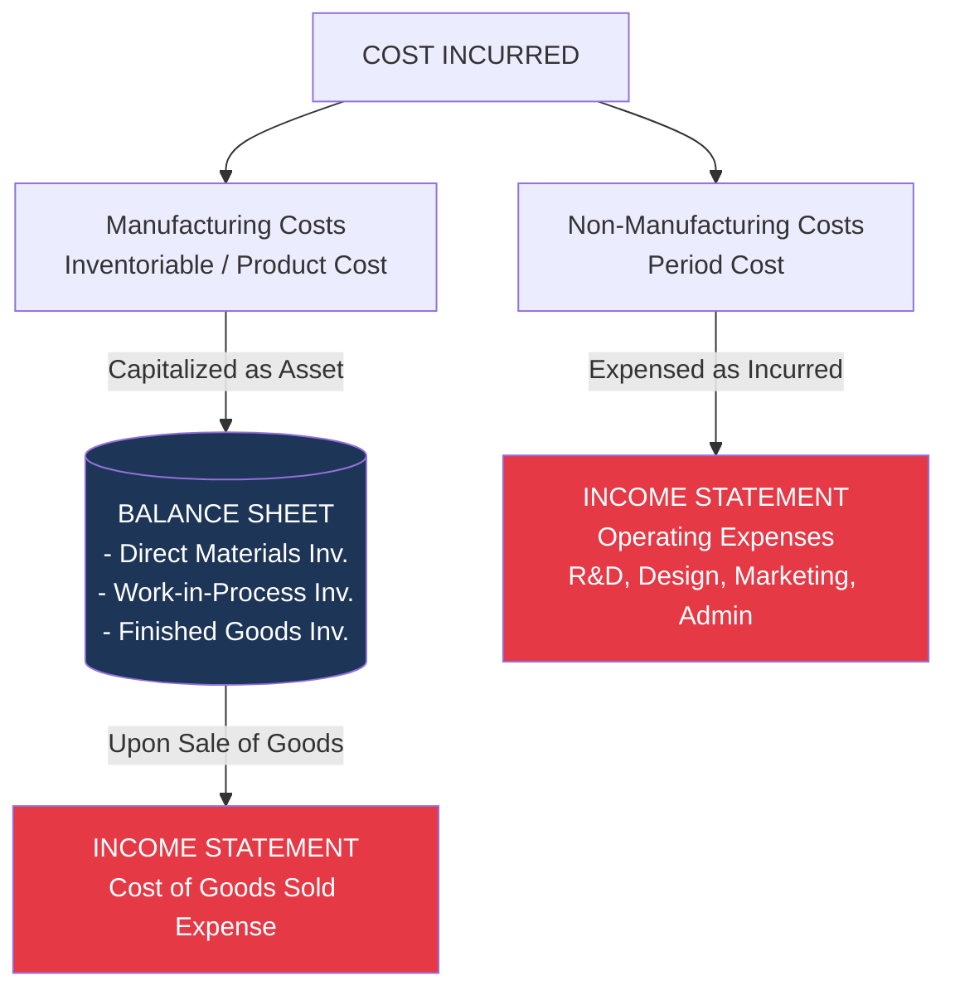
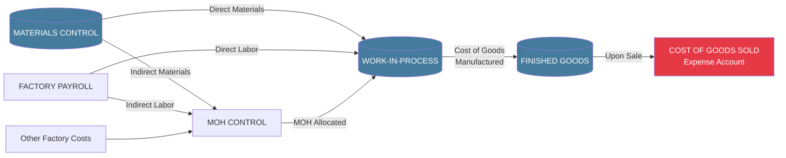

# Cost Classifications, Flows, and Cost Sheets

> [!abstract] Curriculum & Syllabus Context
>
> - **Course:** ACC 304 Cost Accounting I
> - **Step:** Step 2: Cost Classifications, Flows, and Cost Sheets
> - **Target Reading:** Datar & Rajan, *Horngren's Cost Accounting*, 17th/18th Edition — **Chapter 2: An Introduction to Cost Terms and Purposes**
> - **Syllabus Focus:** Dichotomy of cost, asset, expense, and loss; direct vs. indirect costs; cost behavior (variable, fixed, mixed); cost drivers and relevant range; prime costs vs. conversion costs; inventoriable vs. period costs; BCAS 1 rules; flow of manufacturing costs through WIP and Finished Goods; and preparation of COGM, COGS, and Income Statements.

---

## 1. Fundamental Cost Terminology & Conceptual Foundations
### 1.1 Conceptual Dichotomy: Cost, Expense, Loss, and Asset
In cost and management accounting, precise distinctions between monetary measurements are essential for financial reporting, valuation, and managerial control.

> [!info] Key Definition
>
> * **Cost**: A resource sacrificed or forgone to achieve a specific objective, usually measured as the monetary amount that must be paid to acquire goods or services. A cost can be an **actual cost** (historical cost incurred in the past) or a **budgeted cost** (predicted/forecasted future cost).
> * **Asset**: An unexpired cost representing a resource that possesses future economic benefits to the entity. Unexpired manufacturing costs are capitalized on the Balance Sheet as inventory assets (Direct Materials, Work-in-Process, Finished Goods) until the related revenue is realized.
> * **Expense**: An expired cost consumed in the process of generating revenue during a specific accounting period. Expired costs are matched against current period revenues in the Income Statement under the **matching principle**.
> * **Loss**: An expired cost that provides no economic benefit or revenue generation. Examples include abnormal spoilage, uninsured flood/fire damage, or losses on the disposal of equipment. Unlike expenses, losses do not result from deliberate operations designed to generate revenue.

---
### 1.2 Manufacturing vs. Non-Manufacturing Concerns
Organizations differ fundamentally in their operational processes, inventory structures, and cost flows based on their business sector.

| Dimension | Manufacturing Concerns | Merchandising Concerns | Service Concerns |
| :--- | :--- | :--- | :--- |
| **Core Activity** | Purchase raw materials/components and transform them into finished products using labor and overhead. | Purchase tangible finished goods and resell them without altering their basic physical form. | Provide intangible services or tailored expertise; do not hold tangible goods for resale. |
| **Inventory Classifications** | **Three Accounts**: 1. **Direct Materials Inventory** 2. **Work-in-Process (WIP) Inventory** 3. **Finished Goods Inventory** | **One Account**: 1. **Merchandise Inventory** | **No Tangible Inventory** (may track unbilled work-in-progress for labor hours). |
| **Cost Allocation Complexity** | High: Tracing direct inputs and allocating indirect manufacturing overhead across WIP and Finished Goods. | Low: Cost of merchandise purchased plus freight-in, handling, and insurance. | N/A (All operating costs are period expenses as incurred). |

---
### 1.3 Cost Objects, Accumulation, and Assignment
To measure costs accurately, accounting systems utilize a two-stage process:

> [!info] Key Definition
>
> 1. **Cost Object**: Anything for which a separate measurement of costs is desired. Examples include products (e.g., a custom paper-making machine), services (e.g., an audit engagement), activities (e.g., setting up a machine), departments, or individual customers.
> 2. **Cost Accumulation**: The collection of cost data in an organized way through an accounting system (e.g., classifying purchases into raw materials, factory rent, or direct labor).
> 3. **Cost Assignment**: The general term that encompasses both tracing direct costs and allocating indirect costs to a cost object.

> [!info] Key Definition
>
> * **Cost Tracing**: The process of assigning **direct costs** that can be traced to a specific cost object in an economically feasible (cost-effective) way.
> * **Cost Allocation**: The process of assigning **indirect costs** that cannot be traced to a specific cost object in an economically feasible way, using a systematic cost-allocation base (cost driver).

---
## 2. Comprehensive Cost Classifications & Structural Behavior
Costs are categorized along multiple dimensions depending on the management decision context.
### 2.1 Direct vs. Indirect Costs
* **Direct Costs**: Costs related to a particular cost object that can easily, unambiguously, and cost-effectively be traced to it.
  * *Examples*: Direct materials (steel, tires for a car), direct manufacturing labor (wages of assembly line workers).
* **Indirect Costs**: Costs related to a particular cost object that cannot easily and cost-effectively be traced to it. They must be allocated.
  * *Examples*: Plant manager's salary, factory depreciation, plant insurance, lubricants.
#### Factors Affecting Direct/Indirect Classification:
1. **Materiality of the Cost**: The smaller the dollar amount of a cost item (immaterial), the less economically feasible it is to trace it directly (e.g., paper clips, glue, thread). These are classified as indirect costs.
2. **Available Information-Gathering Technology**: Improvements such as bar-coding and RFID tags enable economically feasible direct tracing of small items previously classified as indirect.
3. **Design of Operations**: If a facility or machine is dedicated exclusively to producing one single product, almost all costs of that facility become direct costs of that product.
4. **Scope of the Cost Object**: A cost can be direct for one cost object but indirect for another. For example, the assembly department supervisor's salary is a **direct cost** of the Assembly Department, but an **indirect cost** of a specific product unit assembled in that department.

---
### 2.2 Cost-Behavior Patterns: Variable, Fixed, and Mixed Costs
Cost behavior describes how a cost changes in total and per unit relative to changes in the total level of activity or volume of a cost driver.

> [!quote] Formula & Derivation
>
> #### 1. Variable Costs
> * **In Total**: Changes in direct proportion to changes in the total level of activity or output. Zero activity results in zero variable cost.
> * **Per Unit**: Remains constant per unit over the relevant range.
> * **Mathematical Representation**:
>   $$ \text{Total Variable Cost} = b \cdot X $$
>   where $b$ is the variable cost per unit (slope coefficient), and $X$ is the activity volume.
> #### 2. Fixed Costs
> * **In Total**: Remains completely unchanged in total for a given time period despite wide fluctuations in activity volume.
> * **Per Unit**: Decreases inversely as activity volume increases (fixed costs are spread over more units).
> * **Mathematical Representation**:
>   $$ \text{Total Fixed Cost} = a $$
>   where $a$ is the total fixed cost (y-intercept).
> #### 3. Mixed (Semi-Variable) Costs
> Costs that contain both a fixed component (base cost of capacity) and a variable component (cost of usage).
> * **Linear Cost Function Equation**:
>   $$ y = a + bX $$
>   where:
>   * $y$ = Estimated Total Cost (dependent variable)
>   * $a$ = Total Fixed Cost component / Intercept
>   * $b$ = Variable Cost per unit of activity / Slope coefficient
>   * $X$ = Activity level of the cost driver / Independent variable

> [!info] Key Definition
>
> * **Cost Driver**: A variable (such as machine-hours, labor-hours, or units produced) that causally affects the level of costs over a given time span. A cause-and-effect relationship must exist between the driver and the cost.
> * **Relevant Range**: The band or range of normal activity volume or time period in which the specific relationship between activity level and cost behavior holds true. Outside the relevant range, fixed costs may step up/down and variable cost rates may change.

---
### 2.3 Functional Classifications: Prime Costs vs. Conversion Costs
Manufacturing costs are aggregated into two primary functional combinations:

1. **Prime Costs**: All direct manufacturing costs.
   $$ \text{Prime Costs} = \text{Direct Materials Used} + \text{Direct Manufacturing Labor Costs} $$
   *Note*: As information technology improves, more cost categories (such as metered machine power or dedicated equipment depreciation) can be traced directly, expanding prime costs.
2. **Conversion Costs**: All manufacturing costs incurred to convert direct materials into finished goods.
   $$ \text{Conversion Costs} = \text{Direct Manufacturing Labor Costs} + \text{Manufacturing Overhead Costs} $$

---
### 2.4 Inventoriable (Product) Costs vs. Period Costs
The timing of expense recognition distinguishes inventoriable costs from period costs.

#### 1. Inventoriable Costs (Product Costs)
* **Definition**: All costs of a product that are considered assets on the balance sheet when incurred, and become expensed as **Cost of Goods Sold (COGS)** only when the product is sold.
* **Manufacturing Companies**: Include all manufacturing costs—Direct Materials, Direct Manufacturing Labor, and Manufacturing Overhead (variable and fixed).
* **Merchandising Companies**: Include the purchase cost of merchandise plus freight-in, customs duties, and handling charges.
* **Service Companies**: Have no inventory of tangible goods; thus, no inventoriable costs.
#### 2. Period Costs
* **Definition**: All costs in the Income Statement other than Cost of Goods Sold. They are recognized as expenses in the accounting period in which they are incurred because they are expected to benefit future periods less directly.
* **Value-Chain Categories**: R&D, Design, Marketing, Advertising, Distribution, Customer Service, and General Administrative costs.

> [!warning] Exam Pitfall / Exception
>
> **The Inventory Buildup Trap (Absorption Costing Distortion):**
> Under absorption costing required by GAAP, fixed manufacturing overhead is allocated to units produced and capitalized into inventory. If management produces significantly more units than sold during a period, a large portion of fixed manufacturing overhead is deferred on the Balance Sheet inside ending Finished Goods inventory rather than expensed on the Income Statement. This artificially inflates current period gross margin and operating income, creating an illusion of profitability without any actual increase in sales.

---
## 3. Bangladesh Cost Accounting Standard 1 (BCAS 1): Cost Concepts and Classifications
To govern cost determination, cost auditing, and financial reporting within Bangladesh, the **Institute of Cost and Management Accountants of Bangladesh (ICMAB)** promulgated **BCAS 1: Cost Concepts and Classifications**.
### 3.1 Objective and Scope of BCAS 1
* **Objective**: Standardize the principles and methodologies of cost classification, measurement, and assignment to ensure consistency, comparability, and transparency in cost statements prepared by manufacturing and service entities in Bangladesh.
* **Scope**: Applies to all cost statements, cost audit reports, and financial filings prepared under mandatory statutory cost audit rules in Bangladesh.
### 3.2 Key Principles & Rules under BCAS 1:
1. **Materiality & Traceability Principle**: BCAS 1 mandates that direct costs must be traced directly to cost centers or cost objects based on physical measurement or exclusive assignment. Immaterial direct items must be categorized as indirect overheads to preserve accounting efficiency.
2. **Normal Capacity Base for Fixed Overhead**: Fixed indirect manufacturing costs must be absorbed into product costs based on **normal capacity** (or practical capacity), NOT actual production volume.
   * *Treatment of Unabsorbed Overhead*: Under-absorbed fixed overhead resulting from idle capacity or abnormal downtime cannot be capitalized into inventory; it must be written off directly to the Profit & Loss statement as an abnormal cost item.
3. **Exclusion of Abnormal Costs**: BCAS 1 strictly excludes abnormal losses, material wastage above standard allowances, strikes/lockout idle time costs, and penalty payments from product costing. These items must be presented separately as period losses.
4. **Classification Matrix**: Mandates a multi-dimensional classification of every cost item by:
   * **Nature of Expense** (Material, Labor, Overhead)
   * **Traceability to Cost Object** (Direct vs. Indirect)
   * **Cost Behavior** (Fixed, Variable, Semi-variable)
   * **Functional Area** (Production, Quality Control, Selling & Distribution, Administration)

---
## 4. Flow of Manufacturing Costs & Financial Statements
### 4.1 Physical and Ledger Flow of Inventoriable Costs
Costs flow sequentially through inventory asset accounts on the Balance Sheet before expensing into the Income Statement:

1. **Materials Purchases**: Debited to `Materials Control` asset account.
2. **Direct Materials Issued**: Debited to `Work-in-Process Control` and credited to `Materials Control`.
3. **Indirect Materials Issued**: Debited to `Manufacturing Overhead Control` and credited to `Materials Control`.
4. **Direct Labor Incurred**: Debited to `Work-in-Process Control` and credited to `Wages Payable Control` or `Cash`.
5. **Indirect Labor Incurred**: Debited to `Manufacturing Overhead Control` and credited to `Wages Payable Control`.
6. **Manufacturing Overhead Incurred**: Actual factory overhead costs (depreciation, utilities, plant insurance) are debited to `Manufacturing Overhead Control`.
7. **Manufacturing Overhead Allocated**: Allocated to WIP using predetermined rates ($\text{Rate} \times \text{Actual Base}$), debited to `Work-in-Process Control` and credited to `Manufacturing Overhead Allocated`.
8. **Completion of Production**: Cost of Goods Manufactured (COGM) is transferred by debiting `Finished Goods Control` and crediting `Work-in-Process Control`.
9. **Sale of Products**: Cost of Goods Sold (COGS) is debited and `Finished Goods Control` is credited.

---
### 4.2 Mathematical Formulas & Statements
> [!quote] Formula & Derivation
>
> #### 1. Direct Materials Used Equation
> $$ \text{Beginning Direct Materials Inventory} + \text{Purchases of Direct Materials} + \text{Freight-In} - \text{Purchase Returns \& Discounts} = \text{Direct Materials Available for Use} $$
> $$ \text{Direct Materials Available for Use} - \text{Ending Direct Materials Inventory} = \text{Direct Materials Used} $$
> #### 2. Total Manufacturing Costs Incurred in Period
> $$ \text{Total Manufacturing Costs Incurred} = \text{Direct Materials Used} + \text{Direct Manufacturing Labor} + \text{Manufacturing Overhead Costs} $$
> #### 3. Cost of Goods Manufactured (COGM)
> $$ \text{Beginning Work-in-Process Inventory} + \text{Total Manufacturing Costs Incurred} = \text{Total Manufacturing Costs to Account For} $$
> $$ \text{Total Manufacturing Costs to Account For} - \text{Ending Work-in-Process Inventory} = \text{Cost of Goods Manufactured (COGM)} $$
> #### 4. Unadjusted Cost of Goods Sold (COGS)
> $$ \text{Beginning Finished Goods Inventory} + \text{Cost of Goods Manufactured (COGM)} = \text{Cost of Goods Available for Sale} $$
> $$ \text{Cost of Goods Available for Sale} - \text{Ending Finished Goods Inventory} = \text{Cost of Goods Sold (Unadjusted)} $$

---
## 5. Comprehensive Numerical Problem Walkthroughs
> [!example] Numerical Problem
>
> ### Problem 1: Master Manufacturing Statement Synthesis
> *(Synthesized from Class Practice & Text Comprehensive Problems)*
> **Context**: Ron Howard took over as controller of Johnson-Howard Manufacturing. The following financial information was assembled for March 2021:
> * Direct Materials Inventory, 3/1/2021: $\text{TK } 12,500$
> * Direct Materials Purchased: $\text{TK } 120,000$
> * Freight-in on Direct Materials: $\text{TK } 5,000$
> * Purchase Returns and Allowances: $\text{TK } 3,000$
> * Direct Manufacturing Labor: $\text{TK } 85,000$
> * Indirect Manufacturing Labor: $\text{TK } 40,000$
> * Factory Plant Utilities & Power: $\text{TK } 25,000$
> * Factory Depreciation (Equipment & Building): $\text{TK } 35,000$
> * Plant Repairs & Maintenance: $\text{TK } 15,000$
> * Indirect Materials & Lubricants Used: $\text{TK } 10,000$
> * Work-in-Process Inventory, 3/1/2021: $\text{TK } 35,000$
> * Finished Goods Inventory, 3/1/2021: $\text{TK } 160,000$
> * Ending Direct Materials Inventory (3/31/2021): $\text{TK } 42,500$
> * Ending Work-in-Process Inventory (3/31/2021): $\text{TK } 95,000$
> * Ending Finished Goods Inventory (3/31/2021): $\text{TK } 105,000$
> * Sales Revenues: $\text{TK } 750,000$
> * Marketing & Advertising Costs: $\text{TK } 60,000$
> * Customer Service Costs: $\text{TK } 25,000$
> * General Administrative Expenses: $\text{TK } 50,000$
> **Required**:
> 1. Prepare a detailed Schedule of Cost of Goods Manufactured for March 2021.
> 2. Prepare a detailed Schedule of Cost of Goods Sold for March 2021.
> 3. Prepare the Income Statement for March 2021.
> 4. Calculate Prime Costs and Conversion Costs.

#### Solution:
##### Step 1: Computation of Direct Materials Used
$$
\begin{aligned}
\text{Beginning Direct Materials Inventory (3/1/2021)} &= \text{TK } 12,500 \\
\text{Add: Direct Materials Purchases} &= \text{TK } 120,000 \\
\text{Add: Freight-In} &= \text{TK } 5,000 \\
\text{Less: Purchase Returns and Allowances} &= (\text{TK } 3,000) \\
\hline
\text{Net Direct Materials Purchased} &= \text{TK } 122,000 \\
\text{Direct Materials Available for Use} &= \text{TK } 134,500 \\
\text{Less: Ending Direct Materials Inventory (3/31/2021)} &= (\text{TK } 42,500) \\
\hline
\mathbf{\text{Direct Materials Used}} &= \mathbf{\text{TK } 92,000}
\end{aligned}
$$

---
##### Step 2: Schedule of Cost of Goods Manufactured (COGM)

$$ \begin{array}{lrr}
\hline
\textbf{JOHNSON-HOWARD MANUFACTURING} & & \\
\textbf{Schedule of Cost of Goods Manufactured} & & \\
\textbf{For the Month Ended March 31, 2021} & & \textbf{Amount (TK)} \\
\hline
\textbf{Direct Costs:} & & \\
\quad \text{Direct Materials Used} & \text{TK } 92,000 & \\
\quad \text{Direct Manufacturing Labor} & 85,000 & \\
\hline
\quad \text{Total Direct Costs} & & \text{TK } 177,000 \\
\textbf{Indirect Manufacturing Overhead Costs:} & & \\
\quad \text{Indirect Manufacturing Labor} & \text{TK } 40,000 & \\
\quad \text{Factory Plant Utilities \& Power} & 25,000 & \\
\quad \text{Factory Depreciation (Equipment \& Building)} & 35,000 & \\
\quad \text{Plant Repairs \& Maintenance} & 15,000 & \\
\quad \text{Indirect Materials \& Lubricants} & 10,000 & \\
\hline
\quad \text{Total Manufacturing Overhead Costs} & & 125,000 \\
\hline
\textbf{Total Manufacturing Costs Incurred in Period} & & \text{TK } 302,000 \\
\text{Add: Beginning Work-in-Process Inventory (3/1/2021)} & & 35,000 \\
\hline
\textbf{Total Manufacturing Costs to Account For} & & \text{TK } 337,000 \\
\text{Less: Ending Work-in-Process Inventory (3/31/2021)} & & (95,000) \\
\hline \hline
\textbf{COST OF GOODS MANUFACTURED (COGM)} & & \mathbf{\text{TK } 242,000} \\
\hline
\end{array} $$

---
##### Step 3: Schedule of Cost of Goods Sold (COGS)

$$ \begin{array}{lr}
\hline
\textbf{JOHNSON-HOWARD MANUFACTURING} & \\
\textbf{Schedule of Cost of Goods Sold} & \\
\textbf{For the Month Ended March 31, 2021} & \textbf{Amount (TK)} \\
\hline
\text{Beginning Finished Goods Inventory (3/1/2021)} & \text{TK } 160,000 \\
\text{Add: Cost of Goods Manufactured (COGM)} & 242,000 \\
\hline
\text{Cost of Goods Available for Sale} & \text{TK } 402,000 \\
\text{Less: Ending Finished Goods Inventory (3/31/2021)} & (105,000) \\
\hline \hline
\textbf{COST OF GOODS SOLD (COGS)} & \mathbf{\text{TK } 297,000} \\
\hline
\end{array} $$

---
##### Step 4: Income Statement

$$ \begin{array}{lrr}
\hline
\textbf{JOHNSON-HOWARD MANUFACTURING} & & \\
\textbf{Income Statement} & & \\
\textbf{For the Month Ended March 31, 2021} & & \textbf{Amount (TK)} \\
\hline
\text{Sales Revenue} & & \text{TK } 750,000 \\
\text{Less: Cost of Goods Sold (COGS)} & & (297,000) \\
\hline
\textbf{GROSS MARGIN (Gross Profit)} & & \text{TK } 453,000 \\
\textbf{Operating Expenses (Period Costs):} & & \\
\quad \text{Marketing \& Advertising Costs} & \text{TK } 60,000 & \\
\quad \text{Customer Service Costs} & 25,000 & \\
\quad \text{General Administrative Expenses} & 50,000 & \\
\hline
\quad \text{Total Operating Expenses} & & (135,000) \\
\hline \hline
\textbf{OPERATING INCOME} & & \mathbf{\text{TK } 318,000} \\
\hline
\end{array} $$

---
##### Step 5: Calculation of Prime Costs and Conversion Costs
$$
\begin{aligned}
\text{Prime Costs} &= \text{Direct Materials Used} + \text{Direct Manufacturing Labor} \\
&= \text{TK } 92,000 + \text{TK } 85,000 = \mathbf{\text{TK } 177,000}
\end{aligned}
$$

$$
\begin{aligned}
\text{Conversion Costs} &= \text{Direct Manufacturing Labor} + \text{Manufacturing Overhead Costs} \\
&= \text{TK } 85,000 + \text{TK } 125,000 = \mathbf{\text{TK } 210,000}
\end{aligned}
$$

---

> [!example] Numerical Problem
>
> ### Problem 2: Unit Cost Behavior & Relevant Range Trap
> *(Based on Tennessee Products Class Example)*
> **Context**: Tennessee Products manufactures speaker systems. In Year 1, total manufacturing costs were $\$40,000,000$ to produce $500,000$ units. The total cost consists of $\$10,000,000$ in fixed costs and $\$30,000,000$ in variable costs.
> **Required**:
> 1. Calculate unit variable cost, unit fixed cost, and total unit cost at $500,000$ units.
> 2. Predict total manufacturing cost and total unit cost if production in Year 2 drops to $200,000$ units (assuming activity remains within the relevant range).
> 3. Demonstrate the error if the plant manager mistakenly uses the Year 1 total unit cost to forecast Year 2 total costs at $200,000$ units.

#### Solution:
##### Requirement 1: Unit Costs at 500,000 Units
$$ \text{Variable Cost per Unit} = \frac{\$30,000,000}{500,000 \text{ units}} = \mathbf{\$60.00 \text{ per unit}} $$

$$ \text{Fixed Cost per Unit} = \frac{\$10,000,000}{500,000 \text{ units}} = \mathbf{\$20.00 \text{ per unit}} $$

$$ \text{Total Unit Cost at 500,000 units} = \$60.00 + \$20.00 = \mathbf{\$80.00 \text{ per unit}} $$

---
##### Requirement 2: Correct Cost Prediction at 200,000 Units
* Total Variable Costs = $200,000 \text{ units} \times \$60.00 = \$12,000,000$
* Total Fixed Costs = $\$10,000,000$ (remains constant in total within relevant range)
* **Correct Total Manufacturing Cost** = $\$12,000,000 + \$10,000,000 = \mathbf{\$22,000,000}$

$$ \text{Correct Total Unit Cost at 200,000 units} = \frac{\$22,000,000}{200,000 \text{ units}} = \mathbf{\$110.00 \text{ per unit}} $$

---
##### Requirement 3: Managerial Error Analysis
If the manager mistakenly unitizes fixed costs and uses the historical $\$80.00$ unit cost:

$$ \text{Erroneous Total Cost Prediction} = 200,000 \text{ units} \times \$80.00 = \mathbf{\$16,000,000} $$

$$ \text{Underestimation Error} = \$22,000,000 - \$16,000,000 = \mathbf{\$6,000,000 \text{ underestimation}} $$

> [!warning] Exam Pitfall / Exception
>
> **Core Takeaway**: Never unitize fixed costs for decision-making or cost forecasting. Always analyze variable costs in terms of unit rates and fixed costs in terms of total lump sums. Assuming total unit cost is purely variable leads to disastrous underestimation of costs when volumes drop!
