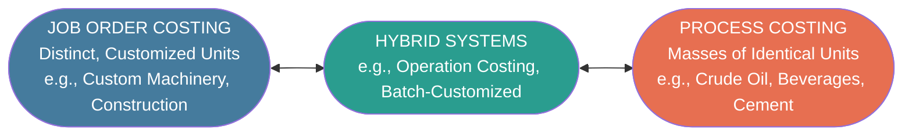
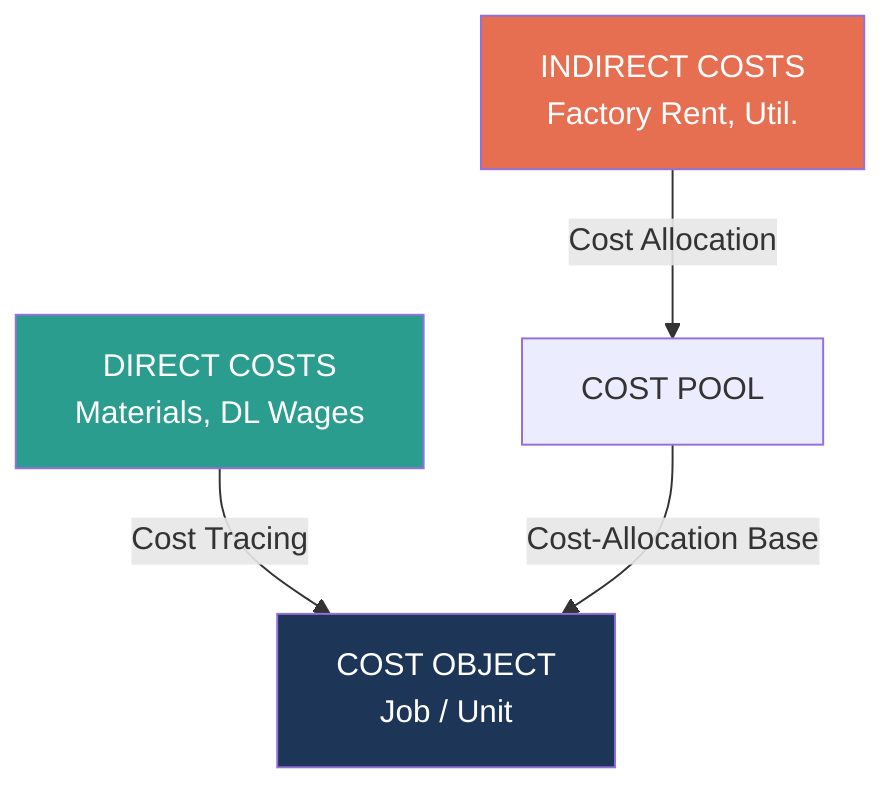
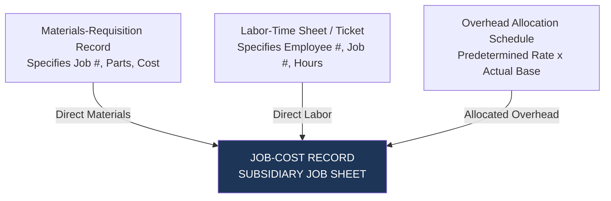
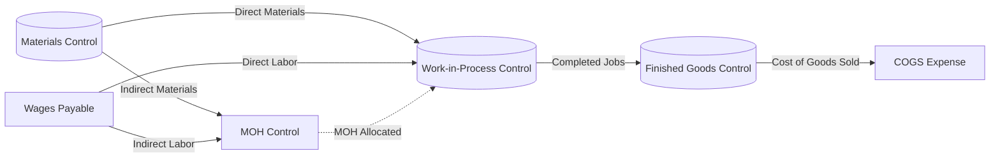
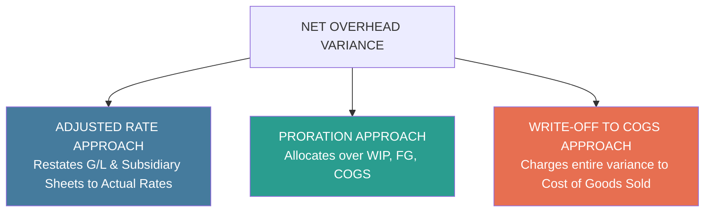

# Product Costing Systems: Job Order Costing

> [!abstract] Curriculum & Syllabus Context
>
> - **Course:** ACC 304 Cost Accounting I
> - **Step:** Step 3: Product Costing Systems (Job Costing)
> - **Target Reading:** Datar & Rajan, *Horngren's Cost Accounting*, 17th/18th Edition — **Chapter 4: Job Costing**
> - **Syllabus Focus:** Job costing vs. process costing vs. operation costing; five building blocks of costing; actual costing vs. normal costing; predetermined overhead rates (POHR); seven-step approach to normal costing; general ledger journal entries and T-account cost flows; and year-end disposal of under/overallocated overhead (proration, write-off, adjusted allocation rate).

---

### Section 1: Foundations of Product Costing & Costing System Typologies
Product costing is the systematic process of accumulating, classifying, and assigning direct and indirect manufacturing costs to specific cost objects—most commonly products, services, or customized batches. Management accountants utilize two primary polar costing systems to determine product costs, positioned at opposite ends of a production continuum.

> [!info] Key Definition
>
> #### 1. Job-Costing Systems
> In a **job-costing system** (or job-order costing system), the cost object is a distinct, identifiable unit or a batch of unique products or services called a **job**. Each job typically consumes different quantities and combinations of direct materials, direct labor, and manufacturing overhead resources. Consequently, costs are accumulated separately for each individual job.
> * **Key Characteristics:**
>   * High product variety and custom specifications.
>   * Low to medium production volume per job.
>   * Direct costs are traced directly to specific jobs via source documents.
>   * Indirect costs are allocated to jobs using predetermined overhead rates and cost-allocation bases.

> [!info] Key Definition
>
> #### 2. Process-Costing Systems
> In a **process-costing system**, the cost object consists of masses of identical or continuous, homogeneous units of a product or service. Because individual units cannot be meaningfully differentiated from one another, process-costing systems compute product costs by accumulating costs across entire manufacturing departments or operational processes for a given period and calculating an **average cost per unit**.

> [!quote] Formula & Derivation
>
> $$ \text{Unit Cost under Process Costing} = \frac{\text{Total Manufacturing Costs Incurred in Period}}{\text{Total Physical (or Equivalent) Units Produced in Period}} $$

> [!info] Key Definition
>
> #### 3. Hybrid and Operation-Costing Systems
> In modern industrial practice, many production environments fall between these two extremes. A **hybrid-costing system** blends characteristics of both job costing and process costing. A prominent example is **operation costing**, used when batches of standardized goods pass through a common sequence of operations, but individual batches utilize unique or customized direct materials (e.g., clothing apparel, footwear, semiconductor assembly). In operation costing, direct materials are charged to specific jobs using job-costing principles, while conversion costs (direct labor and overhead) are averaged across units passing through each operation using process-costing principles.

#### Sectoral Examples Matrix

| Sector | Job Order Costing Examples | Process Costing Examples |
| :--- | :--- | :--- |
| **Service Sector** | Audit engagements (PwC), Legal litigation (Hale & Dorr), Advertising campaigns (Ogilvy & Mather), Custom software development. | Standardized check clearing (Bank of America), Postal delivery of standard mail, Standard physical therapy sessions. |
| **Merchandising Sector** | Specialized promotional campaigns (Walmart), Custom mail-order fulfillment (L.L. Bean). | Grain distribution (Archer Daniels Midland), Lumber wholesale trading (Weyerhaeuser). |
| **Manufacturing Sector** | Commercial aircraft assembly (Boeing), Naval shipbuilding (Litton Industries), Custom paper-making machinery (Robinson Co.), Specialized cabinetry. | Petroleum refining (Shell Oil), Beverage bottling (PepsiCo), Cereal production (Kellogg’s), Chemical manufacturing. |

---
### Section 2: Building-Block Concepts of Costing Systems
To design, evaluate, or execute any product costing system, five fundamental building blocks must be established:

> [!info] Key Definition
>
> #### 1. Cost Object
> A **cost object** is anything for which a separate measurement of costs is desired. In job costing, the primary cost object is a specific job, contract, work order, or customer order (e.g., Job WPP 298 for Western Pulp & Paper).
> #### 2. Direct Costs of a Cost Object
> **Direct costs** are costs that are related to a particular cost object and can be traced to that cost object in an economically feasible (cost-effective) way.
> * **Direct Materials Costs**: Acquisition costs of all raw materials that physically become part of the cost object and can be traced directly via source documents (e.g., metal brackets, specialized steel plates).
> * **Direct Manufacturing Labor Costs**: Wages, salaries, and payroll fringe benefits paid to workers who directly convert raw materials into finished jobs, traceable via labor time sheets (e.g., machinists, assembly line operators).
> #### 3. Indirect Costs of a Cost Object
> **Indirect costs** are costs related to a particular cost object that cannot be traced to it in an economically feasible way. Instead, indirect costs must be **allocated** to the cost object using a systematic cost-allocation method. In manufacturing, indirect costs are collectively termed **Manufacturing Overhead (MOH)** or **Factory Overhead**. Examples include factory depreciation, plant supervisor salaries, indirect materials (lubricants, fasteners), plant utilities, and factory maintenance.
> #### 4. Cost Pool
> A **cost pool** is a grouping of individual indirect cost items. Cost pools can range from broad, plant-wide aggregations (e.g., total factory overhead) to narrow, homogeneous activity-based or departmental pools (e.g., Machining Department Overhead, Assembly Department Overhead). Homogeneous cost pools group costs that share the same cost driver.
> #### 5. Cost-Allocation Base
> A **cost-allocation base** (also called a **cost-application base** when applied to products or jobs) is a systematic metric (financial or non-financial) used to link an indirect cost or group of indirect costs (a cost pool) to cost objects. The ideal cost-allocation base is a **cost driver**—an activity metric that maintains a clear cause-and-effect relationship with the incurrence of indirect costs. Common allocation bases include:
> * Direct manufacturing labor-hours (DLH)
> * Direct manufacturing labor costs (\$)
> * Machine-hours (MH)
> * Direct materials cost (\$)

---
### Section 3: Costing Systems Frameworks — Actual Costing, Normal Costing, and Variations
Costing systems differ fundamentally based on whether **actual rates** or **predetermined/budgeted rates** are used to assign direct and indirect costs to jobs.

| Cost Category | Actual Costing System | Normal Costing System |
| :--- | :--- | :--- |
| **Direct Costs (DM & DL)** | Actual Direct-Cost Rate $\times$ Actual Quantity of Inputs | Actual Direct-Cost Rate $\times$ Actual Quantity of Inputs |
| **Indirect Costs (Overhead)** | Actual Indirect-Cost Rate $\times$ Actual Quantity of Base | **Budgeted Indirect-Cost Rate** $\times$ Actual Quantity of Base |

> [!warning] Exam Pitfall / Exception
>
> #### 1. Actual Costing Systems
> An **actual costing system** traces direct costs to a cost object by using the actual direct-cost rates multiplied by the actual quantities of direct-cost inputs used, and allocates indirect costs based on the **actual annual indirect-cost rate** multiplied by the actual quantities of the cost-allocation base used.
> $$ \text{Actual Indirect-Cost Rate} = \frac{\text{Actual Annual Indirect Costs}}{\text{Actual Annual Quantity of Cost-Allocation Base}} $$
> *The Timeliness Challenge of Actual Costing:*
> Actual costing systems are rarely used in corporate practice because actual annual indirect costs and actual annual allocation base quantities cannot be known until the fiscal year ends. Managers cannot wait until year-end to determine job costs; they require immediate, ongoing cost data during the year to establish competitive prices, monitor performance, and prepare interim financial statements. Calculating actual indirect-cost rates on a short-term basis (e.g., weekly or monthly) creates erratic cost fluctuations due to numerator variations (seasonal spending) and denominator variations (fluctuating volume).

> [!info] Key Definition
>
> #### 2. Normal Costing Systems
> A **normal costing system** traces direct costs to a cost object using actual direct-cost rates multiplied by actual direct-input quantities, but allocates indirect costs using a **predetermined or budgeted indirect-cost rate** multiplied by the actual quantities of the cost-allocation base used.
> $$ \text{Budgeted Indirect-Cost Rate } (PDR) = \frac{\text{Budgeted Annual Indirect Costs}}{\text{Budgeted Annual Quantity of Cost-Allocation Base}} $$
> $$ \text{Allocated Manufacturing Overhead} = \text{Budgeted Indirect-Cost Rate} \times \text{Actual Quantity of Allocation Base Used} $$
> *Key Operational Advantages of Normal Costing:*
> * **Timeliness**: Job costs can be calculated immediately upon job completion.
> * **Smoothing**: Spreads annual overhead fluctuations evenly over all jobs produced during the year, neutralizing short-term volume and spending anomalies.

> [!info] Key Definition
>
> #### 3. Variations from Normal Costing (Extended Normal Costing)
> In professional service firms (e.g., legal practices, accounting firms, engineering consultancies), direct labor represents the largest cost component. However, actual direct labor rates per hour often cannot be determined during the year due to year-end bonuses, incentive commissions, or varying billable hours over fixed salaried contracts. In these settings, firms utilize an **extended normal costing variation** where **budgeted rates** are applied to *both* direct costs and indirect costs:
> $$ \text{Budgeted Direct-Labor Rate} = \frac{\text{Budgeted Total Direct Professional Labor Costs}}{\text{Budgeted Total Direct Professional Labor-Hours}} $$
> $$ \text{Budgeted Indirect-Cost Rate} = \frac{\text{Budgeted Total Indirect Support Costs}}{\text{Budgeted Total Cost-Allocation Base}} $$

---
### Section 4: The Seven-Step Approach to Normal Costing & Source Documents
#### Primary Source Documents in Job Costing
Job-costing systems depend on a rigorous network of source documents to capture, verify, and authorize cost flows:

1. **Job-Cost Record (Job-Cost Sheet)**: The central subsidiary ledger document that records and accumulates all direct materials, direct manufacturing labor, and allocated manufacturing overhead assigned to a specific job from start to completion.
2. **Materials-Requisition Record**: A formal authorization document issued by manufacturing engineers or foremen to release direct materials from the storeroom to a specific job number, recording part description, quantity, unit cost, and total cost. (Indirect materials requisitions are charged to Manufacturing Overhead Control).
3. **Labor-Time Sheet / Labor-Time Ticket**: An original record tracking employee work hours spent on specific jobs versus non-job tasks (e.g., machine maintenance, idle time, plant cleaning). Direct labor hours are debited to individual job sheets; indirect labor hours are debited to Manufacturing Overhead Control.
#### The Seven-Step Approach to Normal Costing (Horngren Framework)
To assign direct and indirect costs to an individual job under normal costing, accountants follow a standardized seven-step sequence:
1. **Step 1: Identify the Job That Is the Chosen Cost Object.**
   * *Example:* Job WPP 298 (manufacture of a specialized paper-making machine).
2. **Step 2: Identify the Direct Costs of the Job.**
   * Trace actual direct materials used via Materials-Requisition Records.
   * Trace actual direct manufacturing labor via Labor-Time Sheets.
3. **Step 3: Select the Cost-Allocation Base(s) to Use for Allocating Indirect Costs.**
   * Identify the driver(s) that cause indirect manufacturing overhead costs (e.g., Direct Manufacturing Labor-Hours).
4. **Step 4: Identify the Indirect Costs Associated with Each Cost-Allocation Base.**
   * Group budgeted manufacturing overhead costs into one or more cost pools.
5. **Step 5: Compute the Rate per Unit of Each Cost-Allocation Base.**
   $$ \text{Budgeted Overhead Rate} = \frac{\text{Budgeted Total Overhead Costs in Pool}}{\text{Budgeted Total Quantity of Allocation Base}} $$
6. **Step 6: Compute the Indirect Costs Allocated to the Job.**
   $$ \text{Allocated Overhead} = \text{Budgeted Overhead Rate} \times \text{Actual Quantity of Allocation Base Used by the Job} $$
7. **Step 7: Compute Total Job Cost.**
   $$ \text{Total Manufacturing Cost of Job} = \text{Direct Materials} + \text{Direct Labor} + \text{Allocated Overhead} $$
#### Job Profitability Metrics
Once total job manufacturing cost is established, financial profitability is evaluated:

$$ \text{Gross Margin of Job} = \text{Job Revenue (Billed Price)} - \text{Total Manufacturing Cost of Job} $$

$$ \text{Gross Margin Percentage} = \frac{\text{Gross Margin of Job}}{\text{Job Revenue}} \times 100\% $$

---
### Section 5: Accounting Cost Flows, General Ledger, and Subsidiary Ledgers
A normal manufacturing job-costing system integrates general ledger control accounts with underlying subsidiary ledgers to track inventoriable costs through production stages.

#### Summary of Standard General Ledger Journal Entries
> [!quote] Formula & Derivation
>
> **1. Purchase of Direct and Indirect Materials on Credit:**
> $$ \begin{array}{llrr}
> \text{Materials Control} & \text{XX} & \\
> \quad \text{Accounts Payable Control} & & \text{XX} \\
> \end{array} $$
> **2. Issuance of Direct and Indirect Materials to Production:**
> $$ \begin{array}{llrr}
> \text{Work-in-Process Control (Direct)} & \text{XX} & \\
> \text{Manufacturing Overhead Control (Indirect)} & \text{XX} & \\
> \quad \text{Materials Control} & & \text{XX} \\
> \end{array} $$
> **3. Incurrence of Manufacturing Payroll:**
> $$ \begin{array}{llrr}
> \text{Work-in-Process Control (Direct labor)} & \text{XX} & \\
> \text{Manufacturing Overhead Control (Indirect labor)} & \text{XX} & \\
> \quad \text{Wages Payable / Cash Control} & & \text{XX} \\
> \end{array} $$
> **4. Incurrence of Other Factory Manufacturing Overhead Costs:**
> $$ \begin{array}{llrr}
> \text{Manufacturing Overhead Control} & \text{XX} & \\
> \quad \text{Cash Control / Accumulated Depr. / Prepaid Insurance} & & \text{XX} \\
> \end{array} $$
> **5. Allocation of Manufacturing Overhead to Work-in-Process:**
> $$ \begin{array}{llrr}
> \text{Work-in-Process Control} & \text{XX} & \\
> \quad \text{Manufacturing Overhead Allocated} & & \text{XX} \\
> \end{array} $$
> **6. Completion of Jobs and Transfer to Finished Goods:**
> $$ \begin{array}{llrr}
> \text{Finished Goods Control} & \text{XX} & \\
> \quad \text{Work-in-Process Control} & & \text{XX} \\
> \end{array} $$
> **7. Sale of Completed Jobs on Credit:**
> $$ \begin{array}{llrr}
> \text{Accounts Receivable Control} & \text{XX} & \\
> \quad \text{Revenues} & & \text{XX} \\
> \text{Cost of Goods Sold} & \text{XX} & \\
> \quad \text{Finished Goods Control} & & \text{XX} \\
> \end{array} $$

#### Control Accounts vs. Subsidiary Ledgers
* **Work-in-Process Control**: General ledger control account. Its ending balance equals the sum of all unfinished Job-Cost Sheets in the WIP subsidiary ledger.
* **Finished Goods Control**: General ledger control account. Its ending balance equals the sum of all completed but unsold Job-Cost Sheets in the Finished Goods subsidiary ledger.
* **Materials Control**: General ledger control account. Its ending balance equals the sum of all individual item quantities and costs in the Materials Subsidiary Ledger.
* **Manufacturing Overhead Control vs. Allocated**: Actual overhead costs incurred are debited to *Manufacturing Overhead Control*. Overhead allocated to jobs is credited to *Manufacturing Overhead Allocated*.

---
### Section 6: End-of-Accounting-Year Overhead Variance & Disposal Methods
Under normal costing, the total manufacturing overhead allocated across all jobs during a period almost never equals the actual manufacturing overhead costs incurred.

$$ \text{Net Overhead Variance} = \text{Actual Overhead Incurred} - \text{Manufacturing Overhead Allocated} $$
* **Underallocated (Underapplied / Underabsorbed) Overhead**: Arises when Actual Overhead Incurred > Overhead Allocated (Net Debit Balance in MOH accounts).
* **Overallocated (Overapplied / Overabsorbed) Overhead**: Arises when Actual Overhead Incurred < Overhead Allocated (Net Credit Balance in MOH accounts).
#### Root Causes of Overhead Variances
1. **Numerator Reason (Cost Pool Variance)**: Actual overhead spending (prices and quantities of indirect inputs like plant power or supervision) differed from the annual budgeted overhead costs.
2. **Denominator Reason (Volume Variance)**: Actual quantity of the cost-allocation base utilized during the year differed from the budgeted annual quantity of the allocation base.

#### Three Year-End Disposal Methods
##### 1. Adjusted Allocation-Rate Approach
This method restates all overhead entries in both the **general ledger** and **subsidiary ledgers** using actual overhead rates calculated at fiscal year-end.
* *Mechanics*:
  $$ \text{Actual Overhead Rate} = \frac{\text{Total Actual Annual MOH}}{\text{Total Actual Annual Base Quantity}} $$
  $$ \text{Adjustment Factor} = \frac{\text{Actual Overhead Rate} - \text{Budgeted Overhead Rate}}{\text{Budgeted Overhead Rate}} $$
* Every job-cost sheet in the subsidiary ledger and the ending balances of WIP, Finished Goods, and COGS in the general ledger are adjusted up or down by the adjustment factor.
* *Advantage*: Yields exact actual costing for financial reporting while preserving interim decision timeliness.
##### 2. Proration Approach
Proration spreads the underallocated or overallocated overhead among ending Work-in-Process Control, Finished Goods Control, and Cost of Goods Sold accounts. (Direct Raw Materials inventory is excluded because no overhead was ever allocated to unissued raw materials).
* **Method A: Proration Based on Overhead Allocated in Ending Balances (Conceptually Preferred)**
  Prorates the net variance in exact proportion to the amount of current-year allocated manufacturing overhead contained in the pre-proration ending balance of each account.

$$ \text{Proration Share for Account } i = \left( \frac{\text{MOH Allocated in Account } i\text{'s Ending Balance}}{\text{Total MOH Allocated across WIP, FG, and COGS}} \right) \times \text{Net Overhead Variance} $$
* **Method B: Proration Based on Ending Account Balances (Expedient Approximation)**
  Prorates the net variance in proportion to the total unadjusted ending balances of WIP, FG, and COGS.

$$ \text{Proration Share for Account } i = \left( \frac{\text{Ending Balance of Account } i}{\text{Total Ending Balances of WIP, FG, and COGS}} \right) \times \text{Net Overhead Variance} $$
* *General Ledger Closing Journal Entry for Proration (Underallocated Example):*
  $$ \begin{array}{llrr}
  \text{Work-in-Process Control} & \text{XX} & \\
  \text{Finished Goods Control} & \text{XX} & \\
  \text{Cost of Goods Sold} & \text{XX} & \\
  \text{Manufacturing Overhead Allocated} & \text{Allocated Amt} & \\
  \quad \text{Manufacturing Overhead Control} & & \text{Actual Amt} \\
  \end{array} $$
##### 3. Write-Off to Cost of Goods Sold Approach
The entire underallocated or overallocated manufacturing overhead balance is closed directly to Cost of Goods Sold.
* *General Ledger Journal Entry (Underallocated Overhead Example):*
  $$ \begin{array}{llrr}
  \text{Cost of Goods Sold} & \text{Variance Amt} & \\
  \text{Manufacturing Overhead Allocated} & \text{Allocated Amt} & \\
  \quad \text{Manufacturing Overhead Control} & & \text{Actual Amt} \\
  \end{array} $$
#### Strategic Decision Matrix for Overhead Variance Disposal

| Criterion / Scenario | Preferred Disposal Method | Rationale |
| :--- | :--- | :--- |
| **Immaterial Variance Amount** | Write-Off to COGS | Lowest administrative cost; negligible distortion of financial statements. |
| **Material Variance + High Inventories** | Proration (Method A) | Ensures balance sheet assets (WIP/FG) and income statement expenses (COGS) conform to GAAP actual cost rules. |
| **Need for Accurate Individual Job Profitability** | Adjusted Allocation-Rate | Only method that adjusts individual job-cost sheets in subsidiary ledgers for future bidding analytics. |
| **Operational Inefficiency / Idle Capacity** | Write-Off to COGS | Inefficiencies should be expensed immediately as period losses rather than capitalized into inventory assets. |

---
### Section 7: Comprehensive Mathematical & Accounting Numerical Walkthroughs
> [!example] Numerical Problem
>
> #### Comprehensive Walkthrough 1: Reconstructing T-Accounts & Overhead Variance Disposal
> **Problem Statement:**
> Endeavor Printing, Inc. uses a normal job-costing system with two direct cost categories (Direct Materials, Direct Manufacturing Labor) and one indirect cost pool (Manufacturing Overhead, allocated based on Direct Manufacturing Labor Costs).
> The following T-account balances and operating data pertain to January 2020:
> * **Initial T-Account Balances (Jan 1, 2020):**
>   * Materials Control = $\$30,000$
>   * Work-in-Process Control = $\$6,000$
>   * Finished Goods Control = $\$40,000$
>   * Wages Payable Control (Beginning Credit) = $\$10,000$
> * **Annual Budgeted Figures for 2020:**
>   * Budgeted Manufacturing Overhead = $\$1,200,000$
>   * Budgeted Direct Manufacturing Labor Costs = $\$800,000$
> * **January Operating Transactions & Conditions:**
>   a. Unfinished Job No. 419 on Jan 31 contains: Direct Materials = $\$16,000$; Direct Labor = $\$4,000$ ($250$ DLH).
>   b. Total Direct Materials issued to production during January = $\$180,000$.
>   c. Cost of Goods Manufactured (transferred to FG) in January = $\$360,000$.
>   d. Ending Materials Inventory on Jan 31 = $\$40,000$.
>   e. Ending Finished Goods Inventory on Jan 31 = $\$30,000$.
>   f. All workers earn a uniform hourly wage. Total direct labor-hours in January = $5,000$ hours. Other indirect labor = $\$20,000$.
>   g. Gross plant payroll paid in cash in January = $\$104,000$.
>   h. Actual Manufacturing Overhead incurred and posted in January = $\$114,000$.
> **Required:**
> 1. Compute the Predetermined Overhead Rate for 2020.
> 2. Compute Total Direct Manufacturing Labor Costs incurred in January.
> 3. Compute Manufacturing Overhead Allocated in January.
> 4. Calculate Purchases of Direct Materials during January.
> 5. Calculate Cost of Goods Sold before variance adjustment.
> 6. Calculate Ending Work-in-Process Inventory on January 31.
> 7. Compute Net Overhead Variance and demonstrate all three disposal methods.

**Step-by-Step Solution:**
##### Step 1: Predetermined Manufacturing Overhead Rate
$$ \text{Budgeted MOH Rate} = \frac{\text{Budgeted MOH Costs}}{\text{Budgeted Direct Labor Costs}} = \frac{\$1,200,000}{\$800,000} = 1.50 \text{ or } 150\% \text{ of Direct Labor Cost} $$
##### Step 2: Direct Manufacturing Labor Wage Rate and January Direct Labor Cost
From Job No. 419:

$$ \text{Direct Labor Hourly Wage Rate} = \frac{\$4,000 \text{ DL Cost}}{250 \text{ DLH}} = \$16.00 \text{ per DLH} $$

$$ \text{Total Direct Labor Cost for January} = 5,000 \text{ total DLH} \times \$16.00/\text{DLH} = \$80,000 $$
##### Step 3: Manufacturing Overhead Allocated in January
$$ \text{Allocated MOH} = 150\% \times \text{Actual Direct Labor Cost} = 1.50 \times \$80,000 = \$120,000 $$
##### Step 4: Purchases of Direct Materials in January
Using the Materials Control T-account equation:

$$ \text{Beginning Materials} + \text{Purchases} - \text{Direct Materials Issued} = \text{Ending Materials} $$

$$ \$30,000 + \text{Purchases} - \$180,000 = \$40,000 $$

$$ \text{Purchases} = \$40,000 + \$180,000 - \$30,000 = \$190,000 $$
##### Step 5: Ending Work-in-Process Inventory (Jan 31)
Job No. 419 is the sole unfinished job in WIP on Jan 31. Its total cost comprises:
* Direct Materials = $\$16,000$
* Direct Labor = $\$4,000$
* Allocated Overhead ($150\% \times \$4,000$) = $\$6,000$

$$ \text{Ending WIP Inventory (Jan 31)} = \$16,000 + \$4,000 + \$6,000 = \$26,000 $$
##### Step 6: Cost of Goods Sold (Unadjusted)
Using the Finished Goods Control T-account equation:

$$ \text{Beginning FG} + \text{Cost of Goods Manufactured} - \text{Cost of Goods Sold} = \text{Ending FG} $$

$$ \$40,000 + \$360,000 - \text{COGS} = \$30,000 $$

$$ \text{COGS (Unadjusted)} = \$400,000 - \$30,000 = \$370,000 $$
##### Step 7: Net Overhead Variance and Disposal Analysis
$$ \text{Net Overhead Variance} = \text{Actual MOH} - \text{Allocated MOH} = \$114,000 - \$120,000 = -\$6,000 \quad (\mathbf{\$6,000 \text{ Overallocated}}) $$
* **Disposal Option A: Write-Off to Cost of Goods Sold**
  Since overhead is overallocated by $\$6,000$, actual costs were lower than allocated. Writing off to COGS reduces COGS expense.

  $$ \text{Adjusted COGS} = \$370,000 - \$6,000 = \$364,000 $$

  $$ \begin{array}{llrr}
  \text{Manufacturing Overhead Allocated} & 120,000 & \\
  \quad \text{Manufacturing Overhead Control} & & 114,000 \\
  \quad \text{Cost of Goods Sold} & & 6,000 \\
  \end{array} $$
* **Disposal Option B: Proration Based on Overhead Allocated in Ending Balances**
  Assume the $\$120,000$ allocated overhead is present in ending balances as follows:
  * WIP Control Allocated MOH = $\$6,000$ ($5\%$)
  * FG Control Allocated MOH = $\$12,000$ ($10\%$)
  * COGS Allocated MOH = $\$102,000$ ($85\%$)

  *Proration Calculations:*
  $$ \text{WIP Reduction} = 5\% \times \$6,000 = \$300 \implies \text{Adjusted WIP} = \$26,000 - \$300 = \$25,700 $$
  $$ \text{FG Reduction} = 10\% \times \$6,000 = \$600 \implies \text{Adjusted FG} = \$30,000 - \$600 = \$29,400 $$
  $$ \text{COGS Reduction} = 85\% \times \$6,000 = \$5,100 \implies \text{Adjusted COGS} = \$370,000 - \$5,100 = \$364,900 $$

  $$ \begin{array}{llrr}
  \text{Manufacturing Overhead Allocated} & 120,000 & \\
  \quad \text{Manufacturing Overhead Control} & & 114,000 \\
  \quad \text{Work-in-Process Control} & & 300 \\
  \quad \text{Finished Goods Control} & & 600 \\
  \quad \text{Cost of Goods Sold} & & 5,100 \\
  \end{array} $$

---

> [!example] Numerical Problem
>
> #### Comprehensive Walkthrough 2: Multi-Departmental Job Costing
> **Problem Statement:**
> Lynn Company operates two manufacturing departments—Machining (capital-intensive) and Assembly (labor-intensive)—at its Minneapolis plant.
> The annual budget for 2020 specifies:
> | Budget Item | Machining Department | Assembly Department | Total Plant |
> | :--- | :--- | :--- | :--- |
> | **Manufacturing Overhead Costs** | $\$1,800,000$ | $\$3,600,000$ | $\$5,400,000$ |
> | **Direct Manufacturing Labor Costs** | $\$1,400,000$ | $\$2,000,000$ | $\$3,400,000$ |
> | **Direct Manufacturing Labor-Hours** | $100,000$ DLH | $200,000$ DLH | $300,000$ DLH |
> | **Machine-Hours** | $50,000$ MH | $200,000$ MH | $250,000$ MH |
> Departmental Allocation Bases:
> * **Machining**: Allocated based on actual **Machine-Hours (MH)**.
> * **Assembly**: Allocated based on actual **Direct Manufacturing Labor Costs (\$)**.
> During February, Job 494 incurred the following:
> | Direct Cost / Activity | Machining Department | Assembly Department |
> | :--- | :--- | :--- |
> | **Direct Materials Used** | $\$45,000$ | $\$70,000$ |
> | **Direct Manufacturing Labor Costs** | $\$14,000$ | $\$15,000$ |
> | **Direct Manufacturing Labor-Hours** | $1,000$ DLH | $1,500$ DLH |
> | **Machine-Hours Used** | $2,000$ MH | $1,000$ MH |
> **Required:**
> 1. Compute the predetermined overhead rate for each department.
> 2. Calculate total manufacturing overhead allocated to Job 494.
> 3. Compute the total manufacturing cost of Job 494.

**Step-by-Step Solution:**
##### Step 1: Predetermined Departmental Overhead Rates
$$ \text{Machining Department Budgeted MOH Rate} = \frac{\$1,800,000 \text{ Budgeted MOH}}{50,000 \text{ Budgeted MH}} = \$36.00 \text{ per Machine-Hour} $$

$$ \text{Assembly Department Budgeted MOH Rate} = \frac{\$3,600,000 \text{ Budgeted MOH}}{\$2,000,000 \text{ Budgeted DL Cost}} = 1.80 \text{ or } 180\% \text{ of Direct Labor Cost} $$
##### Step 2: Manufacturing Overhead Allocated to Job 494
* **Machining Overhead Allocated**:
  $$ \text{Allocated MOH}_{\text{Machining}} = \$36.00/\text{MH} \times 2,000 \text{ Actual MH} = \$72,000 $$
* **Assembly Overhead Allocated**:
  $$ \text{Allocated MOH}_{\text{Assembly}} = 180\% \times \$15,000 \text{ Actual Assembly DL Cost} = \$27,000 $$

$$ \text{Total Overhead Allocated to Job 494} = \$72,000 + \$27,000 = \$99,000 $$
##### Step 3: Total Manufacturing Cost of Job 494
$$ \begin{array}{lrr}
\text{Direct Materials (\$45,000 + \$70,000)} & \$115,000 \\
\text{Direct Manufacturing Labor (\$14,000 + \$15,000)} & 29,000 \\
\text{Allocated Manufacturing Overhead (Machining + Assembly)} & 99,000 \\
\hline
\mathbf{\text{Total Manufacturing Cost of Job 494}} & \mathbf{\$243,000}
\end{array} $$
