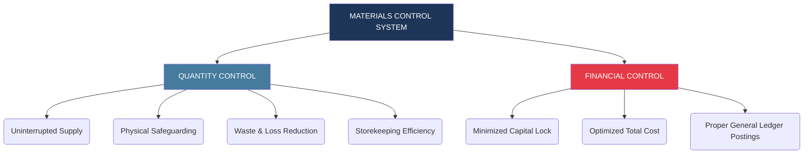
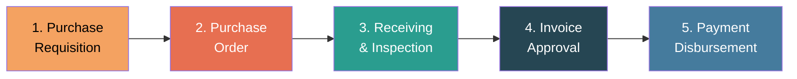
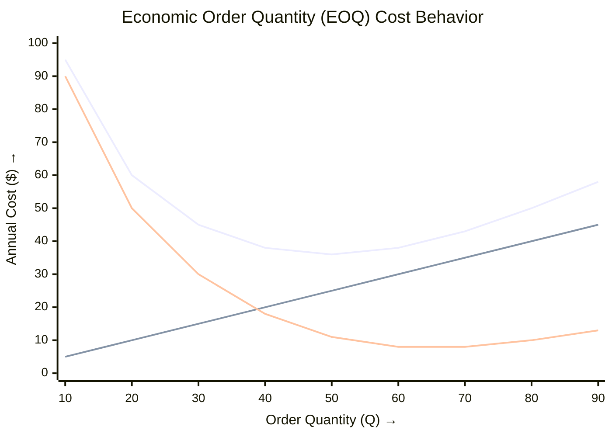
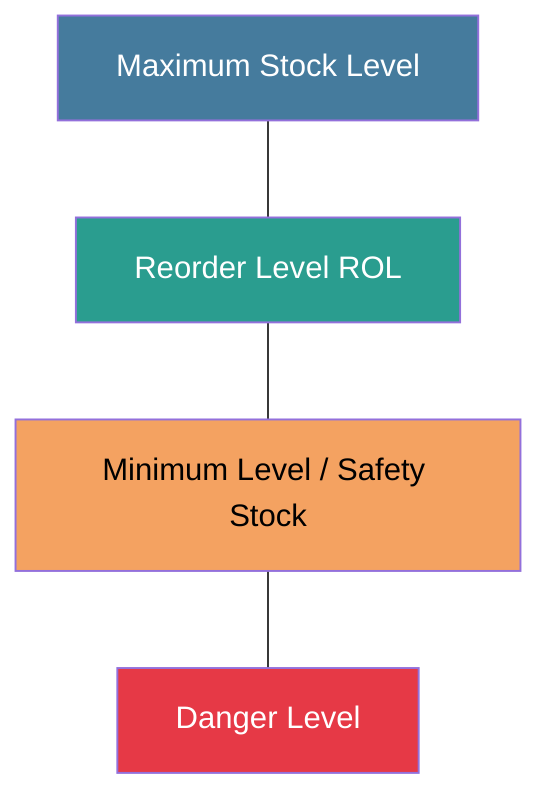
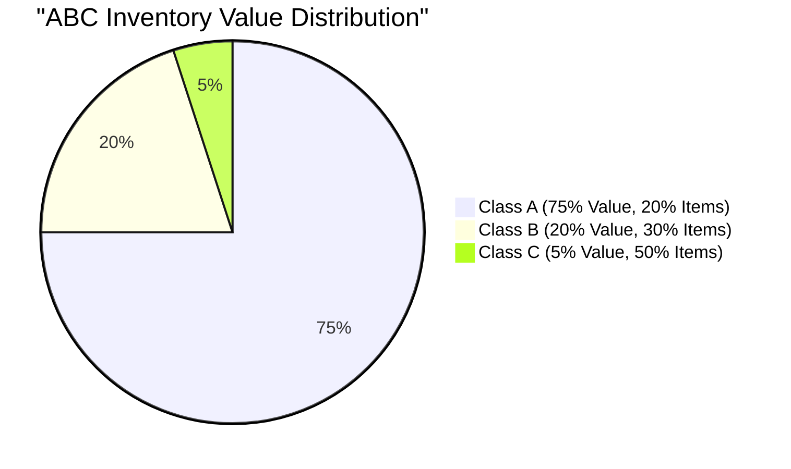
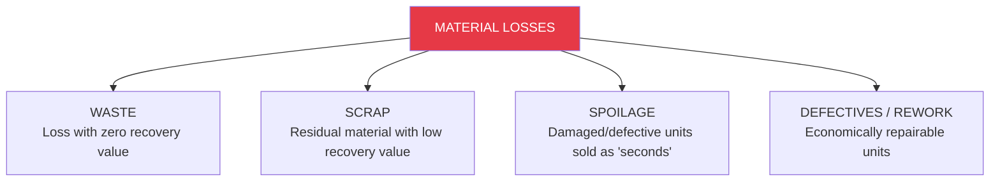
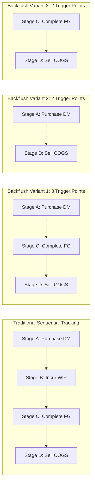
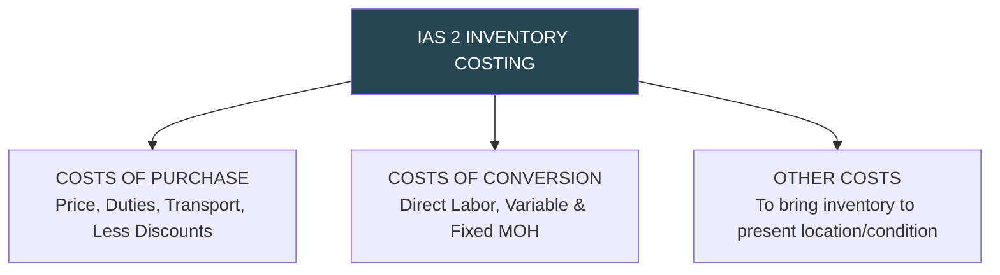

# Material Planning, Control, and Inventory Management

> [!abstract] Curriculum & Syllabus Context
>
> - **Course:** ACC 304 Cost Accounting I
> - **Step:** Step 4: Material Control and Modern Inventory Management
> - **Target Reading:** Datar & Rajan, *Horngren's Cost Accounting*, 17th/18th Edition — **Chapter 21: Inventory Management, JIT, and Simplified Costing Methods** (with Chapter 4)
> - **Syllabus Focus:** Quantity vs. financial materials control; purchasing procedures and 3-way matching; bin cards vs. stores ledger cards; mathematical derivation of EOQ and sensitivity analysis; stock levels (ROL, minimum, maximum, danger, average); ABC inventory analysis; accounting for waste, scrap, spoilage, and defectives; JIT pull systems; simplified backflush costing variants; and IAS 2 valuation rules.

---

### Section 1: Foundational Framework of Materials Control & Purchasing Procedures
#### 1. Definition and Scope of Materials Control
In manufacturing enterprises, **materials** refer to raw materials, sub-assemblies, fabricated components, and factory supplies that are converted into finished output. Because material costs constitute the largest single component of total manufacturing cost (often 50% to 70% of total prime cost), maintaining systematic accounting and rigorous physical control over materials is essential for operational efficiency and profitability.

> [!info] Key Definition
>
> **Materials Control** encompasses a systematic control framework at two complementary levels:
> 1. **Quantity Control:** Spearheaded by production, engineering, and storekeeping departments, ensuring that materials of desired technical specifications and quality are available when needed for uninterrupted production, while physically safeguarding stock against theft, fire, damage, and waste.
> 2. **Financial Control:** Spearheaded by the finance and accounting functions, aiming to minimize working capital locked up in inventory, optimize ordering and holding expenditures, and ensure all material transactions are authorized, properly priced, and accurately recorded in the general and subsidiary ledgers.

---
#### 2. Objectives of Materials Control
A robust system of materials control achieves nine primary objectives:
1. **Availability:** Ensuring materials of specified quality are continuously available to prevent production delays or machine downtime.
2. **Economic Purchasing:** Ordering materials only when genuine demand exists, in economic quantities (EOQ), and at optimal market terms.
3. **Minimum Investment:** Keeping capital investment in stock at the lowest level consistent with operational requirements, avoiding over-stocking.
4. **Favorable Pricing:** Securing materials at competitive market prices via systematic vendor selection and price negotiation.
5. **Physical Protection:** Protecting inventory against loss from fire, pilferage, improper handling, and environmental deterioration.
6. **Efficient Handling:** Designing storage layouts to minimize handling time, internal transport costs, and space bottlenecks.
7. **Voucher Authorization:** Approving supplier payments only after verifying that goods were physically received, inspected, and accepted.
8. **Authorized Issuance:** Issuing materials from storerooms strictly against authorized requisition notes and recording usage accurately.
9. **Custodial Accountability:** Maintaining continuous individual accountability for all inventory items across all storage and production centers.

---
#### 3. Organizational Purchasing and Receiving Flow
The procurement and receiving cycle follows a five-step control flow:

1. **Purchase Requisition:** A formal request initiated by the storekeeper (for regular stock items reaching the reorder point) or departmental heads/production control (for special/project items) instructing the Purchasing Department to procure specified materials. It documents the item description, part code, quantity required, required delivery date, and authorizing signatures.
2. **Purchase Order (PO):** A legally binding purchase contract issued by the Purchasing Department to the selected vendor. It specifies item quantities, unit prices, quality grades, delivery schedules, freight terms (FOB/CIF), discount terms, and delivery instructions. Copies are distributed to the vendor, storekeeper, receiving department, requisitioning unit, and accounting department.
3. **Receiving & Inspection (Goods Received Note - GRN):** Upon delivery, the Receiving Department unloads, unpacks, counts, and inspects incoming goods. An **Inspection Report** and a **Goods Received Note (GRN) / Materials Receiving Report** are compiled, documenting quantities accepted and rejected, physical condition, and discrepancies relative to the PO.
4. **Approval of Invoices:** The Accounts Payable section performs a "three-way match" comparing the Purchase Order, GRN, and Vendor Invoice. Adjustments are made for trade/quantity discounts, freight-in charges, and debit notes issued for rejected goods.
5. **Payment Disbursement:** Once approved, a payment voucher and remittance advice are generated to disburse funds to the supplier within agreed credit terms, taking advantage of applicable cash discounts.

---
#### 4. Storekeeping and Document Control
Efficient storekeeping maintains the physical link between bulk procurement and controlled consumption.
##### Bin Cards vs. Stores Ledger Cards
A crucial operational and internal check distinction exists between a **Bin Card** and a **Stores Ledger Card**:

| Feature | Bin Card | Stores Ledger Card |
| :--- | :--- | :--- |
| **Location** | Attached to or hung over the physical storage bin/shelf inside the storeroom. | Maintained in the Cost Accounting / Finance Department. |
| **Maintained By** | Storekeeper / Warehousing staff. | Cost Accountant / Ledger Clerk. |
| **Information Recorded** | **Quantitative data only** (Receipts, Issues, and Physical Balance in units). | **Quantitative and Monetary data** (Units, Unit Cost Rates, and Total Dollar Values). |
| **Posting Frequency** | Recorded **contemporaneously** upon every physical transaction. | Recorded after source documents (GRN, Requisitions) reach the cost office. |
| **Control Purpose** | Physical stock tracking, perpetual count verification, and reorder alerts. | Financial accounting, inventory valuation, and cost of goods sold determination. |

---
##### Key Source Documents in Material Costing
> [!info] Key Definition
>
> - **Materials Requisition Note:** A formal written order issued by an authorized departmental head/foreman instructing the storekeeper to issue specified materials for a specific job or cost center. Serves as the source document for debiting Work-in-Process (or Overhead Control) and crediting Materials Control.
> - **Bill of Materials (BOM):** A comprehensive, master specification list of all direct/indirect materials, sub-components, and quantities required to complete a standard job or batch. Functions as a single, consolidated material requisition note for standard manufacturing runs.
> - **Material Return Note (Stores Return Note):** Prepared when excess, unused, or defective materials previously requisitioned are returned from the production floor back to the storeroom. Credits the issuing job/department and debits Materials Control.
> - **Material Transfer Note:** Prepared when materials issued to one job or department are directly transferred to another job/department on the shop floor without physically passing back through the storeroom. Reallocates material costs directly between subsidiary job-cost records.
> - **Reject / Dispatch Note:** Issued when rejected, damaged, or out-of-specification materials are returned to the external supplier. Supports debit notes crediting Accounts Payable and reducing Materials Control.

---
### Section 2: Mathematical Derivations & Inventory Control Models
#### 1. Economic Order Quantity (EOQ) Model
##### Conceptual Foundation
The **Economic Order Quantity (EOQ)** determines the optimal order size $Q^*$ that minimizes the total annual relevant inventory costs—specifically, the sum of **Annual Ordering Costs** and **Annual Holding (Carrying) Costs**.

> [!quote] Formula & Derivation
>
> ##### Mathematical Derivation of the Classic EOQ Formula
> Let:
> - $D$ = Total annual demand for materials (in physical units).
> - $O$ (or $P$) = Fixed cost of placing and processing a single purchase order.
> - $C$ (or $S$ or $I \times P$) = Annual holding/carrying cost per unit of inventory per year.
> - $Q$ = Order quantity per order (the decision variable).
> - $P_{unit}$ = Unit acquisition price of material.
> **Step 1: Formulate the Component Cost Functions**
> 1. **Annual Purchase Cost ($PC$):**
>    $$ PC = D \times P_{unit} $$
>    *(Note: Under constant unit purchase price, $PC$ is a sunk/irrelevant baseline cost with respect to $Q$).*
> 2. **Annual Ordering Cost ($TC_o$):**
>    $$ \text{Number of Orders per Year} = \frac{D}{Q} $$
>    $$ TC_o(Q) = \left( \frac{D}{Q} \right) \times O $$
> 3. **Annual Carrying/Holding Cost ($TC_h$):**
>    $$ \text{Average Inventory Level} = \frac{Q}{2} \quad \text{(assuming constant consumption and zero safety stock)} $$
>    $$ TC_h(Q) = \left( \frac{Q}{2} \right) \times C $$
> **Step 2: Formulate Total Relevant Cost ($TRC$) Equation**
> $$ TRC(Q) = TC_o(Q) + TC_h(Q) = \frac{D \cdot O}{Q} + \frac{Q \cdot C}{2} $$
> **Step 3: Differentiate $TRC(Q)$ with Respect to $Q$ and Set to Zero**
> To find the global minimum, compute the first derivative of $TRC(Q)$ with respect to $Q$:
> $$ \frac{d(TRC)}{dQ} = \frac{d}{dQ} \left( D \cdot O \cdot Q^{-1} + \frac{C}{2} \cdot Q \right) $$
> $$ \frac{d(TRC)}{dQ} = -1 \cdot D \cdot O \cdot Q^{-2} + \frac{C}{2} = -\frac{D \cdot O}{Q^2} + \frac{C}{2} $$
> Set the first derivative equal to zero:
> $$ -\frac{D \cdot O}{Q^2} + \frac{C}{2} = 0 $$
> $$ \frac{C}{2} = \frac{D \cdot O}{Q^2} $$
> **Step 4: Solve for $Q$**
> $$ Q^2 \cdot C = 2 \cdot D \cdot O $$
> $$ Q^2 = \frac{2 \cdot D \cdot O}{C} $$
> $$ Q^* = \text{EOQ} = \sqrt{\frac{2 \cdot D \cdot O}{C}} $$

##### Key Equilibrium Principle at $EOQ$
At $Q = \text{EOQ}$, **Annual Ordering Costs strictly equal Annual Carrying Costs**:

$$ \text{Ordering Cost at EOQ} = \frac{D}{Q^*} \times O = \frac{D}{\sqrt{\frac{2DO}{C}}} \times O = \sqrt{\frac{D \cdot O \cdot C}{2}} $$

$$ \text{Carrying Cost at EOQ} = \frac{Q^*}{2} \times C = \frac{\sqrt{\frac{2DO}{C}}}{2} \times C = \sqrt{\frac{D \cdot O \cdot C}{2}} $$

$$ \text{Total Relevant Annual Inventory Cost (TRC)} = \sqrt{2 \cdot D \cdot O \cdot C} $$

---

> [!warning] Exam Pitfall / Exception
>
> ##### Assumptions of the Classic EOQ Model
> 1. Annual demand ($D$) is known with certainty, constant, and uniformly distributed over time.
> 2. Purchase order lead time ($L$) is fixed and known with certainty.
> 3. Unit acquisition cost ($P_{unit}$) is constant across all order sizes (no quantity discounts).
> 4. Carrying cost per unit ($C$) and ordering cost per order ($O$) are constant and linear.
> 5. Stockouts are strictly prohibited, and receipt of orders is instantaneous upon reaching zero working stock.

##### Sensitivity Analysis & Cost of Prediction Errors in EOQ
Due to the square-root function in the EOQ mathematical structure, the total cost curve is relatively flat around $Q^*$. As a result, moderate estimation errors in $O$ or $C$ produce smaller percentage errors in total inventory costs.

If a predicted ordering cost $O_{pred}$ is used instead of actual $O_{actual}$, the resulting order size $Q_{pred} = \sqrt{\frac{2D O_{pred}}{C}}$ causes a prediction error cost calculated as:

$$ \text{Cost of Prediction Error} = TRC(Q_{pred} \mid O_{actual}) - TRC(Q^* \mid O_{actual}) $$

---
#### 2. Stock Level Control Formulas
To prevent both out-of-stock conditions (disrupting production) and over-stocking (locking up excess capital), cost systems establish specific quantitative inventory thresholds.

> [!quote] Formula & Derivation
>
> 1. **Reorder Level (ROL) / Reorder Point (ROP):**
>    The physical inventory level that automatically triggers the issuance of a new purchase order.
>    - *Primary Formula (based on Maximum Consumption & Lead Time):*
>      $$ ROL = \text{Maximum Daily/Weekly Usage} \times \text{Maximum Lead Time (Reorder Period)} $$
>    - *Alternative Formula (based on Safety Stock & Average Lead Time):*
>      $$ ROL = \text{Safety Stock} + (\text{Average Daily/Weekly Usage} \times \text{Average Lead Time}) $$
> 2. **Minimum Stock Level (Safety Stock):**
>    The minimum buffer inventory maintained at all times as an emergency reserve against supply delays or demand surges.
>    $$ \text{Minimum Stock Level} = ROL - (\text{Average Usage Rate} \times \text{Average Reorder Period}) $$
> 3. **Maximum Stock Level:**
>    The upper boundary above which physical stock should not be permitted to rise, preventing over-capitalization and excessive storage costs.
>    $$ \text{Maximum Stock Level} = ROL + EOQ - (\text{Minimum Usage Rate} \times \text{Minimum Reorder Period}) $$
> 4. **Absolute Maximum Inventory:**
>    $$ \text{Absolute Maximum Inventory} = \text{Safety Stock} + EOQ $$
> 5. **Normal Maximum Inventory:**
>    $$ \text{Normal Maximum Inventory} = ROL + EOQ - (\text{Minimum Usage Rate} \times \text{Average Lead Time}) $$
> 6. **Danger Level:**
>    A critical emergency threshold below the safety stock level where normal production issues are restricted, and urgent expediting steps are taken.
>    $$ \text{Danger Level} = \text{Average Usage Rate} \times \text{Lead Time for Emergency Purchases} $$
> 7. **Average Stock Level:**
>    The expected operational inventory on hand over time.
>    $$ \text{Average Stock Level} = \text{Minimum Stock Level} + \frac{EOQ}{2} $$
>    $$ \text{Or: } \text{Average Stock Level} = \frac{\text{Minimum Stock Level} + \text{Maximum Stock Level}}{2} $$

---
### Section 3: Material Control Techniques & Inventory Valuation
#### 1. Selective Inventory Control: ABC Analysis (Pareto Analysis)
**ABC Analysis** applies Pareto’s 80/20 Law to inventory management, categorizing inventory items based on their annual monetary usage value ($D \times P_{unit}$) rather than physical quantities.

| Category | % of Total Inventory Items | % of Total Annual Monetary Value | Management & Control Strategy |
| :--- | :--- | :--- | :--- |
| **Class A** | **15% – 20%** | **70% – 80%** | **Tightest Control:** Continuous review, minimal safety stocks, frequent reordering, detailed central ledger tracking, and strict executive oversight. |
| **Class B** | **30%** | **15% – 20%** | **Moderate Control:** Periodic review, standard safety stocks, automated EOQ reordering, and routine storekeeper tracking. |
| **Class C** | **50%** | **5% – 10%** | **Simple Control:** Visual/Two-Bin checks, large order batches, high safety stock buffers to eliminate stockouts, and minimal clerical tracking. |

---
#### 2. Inventory Tracking Systems: Perpetual vs. Periodic
Manufacturing enterprises employ one of two primary inventory accounting regimes:
1. **Perpetual Inventory System:**
   Continuous, real-time recording of every material receipt, issue, and balance on hand in stores ledgers and bin cards. Accompanied by a program of **continuous stocktaking** (cycle counting) throughout the year.
   - *Advantages:* Instant inventory balance visibility, facilitates interim financial statements without factory shutdown, detects shrinkage/theft immediately.
2. **Periodic Inventory System:**
   Physical inventory is counted and valued at specific period-end dates (e.g., year-end). Purchases are debited to a Purchases account, and Cost of Goods Sold is derived as a residual:

   $$ \text{Cost of Goods Sold} = \text{Beginning Inventory} + \text{Purchases} - \text{Ending Inventory (Physical Count)} $$
   - *Disadvantage:* Assumes all uncounted inventory was used in production, masking unrecorded losses, shrinkage, spoilage, and theft.

---
#### 3. Inventory Turnover Ratios
Inventory turnover measures the speed and efficiency with which inventory is consumed and replenished:

$$ \text{Inventory Turnover Ratio} = \frac{\text{Cost of Materials Consumed During Period}}{\text{Cost of Average Stock Held During Period}} $$

$$ \text{Average Stock Held} = \frac{\text{Opening Stock} + \text{Closing Stock}}{2} $$

$$ \text{Inventory Turnover in Days} = \frac{365 \text{ Days}}{\text{Inventory Turnover Ratio}} $$
- **High Turnover Ratio:** Indicates fast-moving material, efficient utilization, and low capital tie-up.
- **Low Turnover Ratio:** Signals slow-moving or obsolete stock, over-capitalization, and risk of material deterioration.

---
#### 4. Accounting for Material Losses and Waste
In processing raw materials, various physical losses occur, requiring distinct cost accounting treatments:

> [!info] Key Definition
>
> 1. **Waste (or Wastage):**
>    Material lost in storage, handling, or processing that has **no physical or recovery value** (e.g., gases, smoke, evaporation).
>    - *Normal Waste:* Unavoidable; absorbed by good output units (inflates unit cost of good output).
>    - *Abnormal Waste:* Avoidable/controllable; valued as a loss and charged directly to Costing Profit and Loss Account.
> 2. **Scrap:**
>    Residual material resulting from manufacturing operations (e.g., metal turnings, fabric trimmings) possessing a minor commercial recovery value.
>    - *Immaterial Scrap Revenue:* Credited to Other Income or credited to Factory Overhead Control.
>    - *Material Scrap Attributable to Specific Job:* Credited directly to the specific Job Work-in-Process account.
>    - *Material Scrap Common to All Jobs:* Credited to Manufacturing Overhead Control (reducing the predetermined overhead rate).
> 3. **Spoilage:**
>    Units damaged or defective that do not meet quality specifications and cannot be economically repaired; sold as "seconds" or discarded.
>    - *Normal Spoilage (Job-Specific):* Net cost ($\text{Original Cost} - \text{Disposal Value}$) charged directly to the specific job.
>    - *Normal Spoilage (Common to All Jobs):* Net cost charged to Manufacturing Overhead Control.
>    - *Abnormal Spoilage:* Net loss credited out of WIP and debited to **Loss from Abnormal Spoilage** (expensed in period).
> 4. **Defectives / Rework:**
>    Defective units that can be economically reconditioned or repaired through additional labor and materials to meet standard quality specs.
>    - *Normal Rework (Job-Specific):* Additional rework labor/materials debited to the specific Job WIP account.
>    - *Normal Rework (Common):* Debited to Manufacturing Overhead Control.
>    - *Abnormal Rework:* Debited to **Loss from Abnormal Rework** account.

---
### Section 4: Modern Inventory Systems: JIT, MRP, & Backflush Costing
#### 1. Materials Requirements Planning (MRP) Systems
An **MRP system** is a computer-based **"push-through"** inventory control system. It calculates production schedules and material requisitions based on:
1. **Demand forecasts** for finished goods.
2. A detailed **Bill of Materials (BOM)**.
3. Current inventory levels on hand and purchasing/manufacturing lead times.

Output is "pushed" through successive workstations according to a master production schedule, maintaining WIP buffers at each stage.

---
#### 2. Just-In-Time (JIT) Purchasing and Production
**JIT** is a **"demand-pull"** philosophy where materials are purchased and units are produced only as needed to satisfy customer orders.

- **Core Objectives ("The 5 Zeros"):** Zero inventory, zero defects, zero breakdowns, zero delay/lead time, and zero non-value-added waste.
- **Key Operational Features:**
  1. **Manufacturing Cells:** Grouping machines into multi-skilled product cells to streamline physical flow and eliminate internal transit time.
  2. **Kanban Systems:** Physical cards or signals authorizing production and material movement between cells.
  3. **Drastic Setup Time Reduction:** Enables micro-batch sizes and low EOQs.
  4. **High-Quality Vendor Partnerships:** Single-sourcing with pre-inspected, frequent JIT deliveries.

---
#### 3. Simplified Backflush Costing Systems
**Backflush Costing** is a streamlined inventory costing system used in JIT environments. It eliminates detailed, sequential tracking of Work-in-Process inventory through journal entries. Instead, costs are "flushed" backward through the accounting system upon reaching predetermined **Trigger Points**.
##### Trigger Points
A **Trigger Point** is a stage in the purchase-to-sales cycle at which journal entries are formally posted in the general ledger:
- **Stage A:** Purchase of Direct Materials.
- **Stage B:** Production resulting in Work-in-Process.
- **Stage C:** Completion of good finished units.
- **Stage D:** Sale of finished goods.
##### Comparison of Backflush Costing Variants

---
##### Detailed General Ledger Accounting Entries for Backflush Costing (Variant 1: 3 Trigger Points - Stages A, C, D)
1. **Purchase Direct Materials (Trigger Point 1 - Stage A):**
   $$ \text{Dr. Materials and In-Process Inventory Control} \quad \text{\$XX} $$
   $$ \text{Cr. Accounts Payable Control} \quad \text{\$XX} $$
   *(Combines raw materials and WIP into a single inventory account).*
2. **Incur Actual Conversion Costs (Stage A):**
   $$ \text{Dr. Conversion Costs Control} \quad \text{\$XX} $$
   $$ \text{Cr. Wages Payable / Accumulated Depreciation / Various} \quad \text{\$XX} $$
3. **Complete Good Finished Units (Trigger Point 2 - Stage C):**
   $$ \text{Dr. Finished Goods Control} \quad \text{\$XX \quad (Standard DM + Standard Allocated Conversion)} $$
   $$ \text{Cr. Materials and In-Process Inventory Control} \quad \text{\$XX \quad (Standard DM Cost)} $$
   $$ \text{Cr. Conversion Costs Allocated} \quad \text{\$XX \quad (Standard Conversion Cost)} $$
   *(Flushes standard costs out of Materials/In-Process Inventory into Finished Goods).*
4. **Sell Finished Goods (Trigger Point 3 - Stage D):**
   $$ \text{Dr. Cost of Goods Sold} \quad \text{\$XX} $$
   $$ \text{Cr. Finished Goods Control} \quad \text{\$XX} $$
5. **Dispose of Under/Overallocated Conversion Costs at Month-End:**
   $$ \text{Dr. Conversion Costs Allocated} \quad \text{\$XX \quad (Standard Allocated)} $$
   $$ \text{Dr./Cr. Cost of Goods Sold} \quad \text{\$Variance \quad (Under/Overallocation)} $$
   $$ \text{Cr. Conversion Costs Control} \quad \text{\$XX \quad (Actual Incurred)} $$
   *(Under JIT, immaterial variances are closed directly to COGS).*

---
### Section 5: International Accounting Standard 2 (IAS 2: Inventories)
#### 1. Objective and Scope
The primary objective of **IAS 2** is to prescribe the accounting treatment for inventories under IFRS, focusing on the determination of inventory cost and its subsequent recognition as an asset and expense.

---
#### 2. Definition of Inventories
Under IAS 2 (Paragraph 6), **inventories** are defined as assets:
a) Held for sale in the ordinary course of business (Finished Goods / Merchandise).
b) In the process of production for such sale (Work-in-Progress).
c) In the form of materials or supplies to be consumed in the production process or rendering of services (Raw Materials and Stores).

---
#### 3. Core Measurement Rule: Lower of Cost and Net Realizable Value (NRV)
Inventories **shall be measured at the lower of cost and net realizable value**.
##### Net Realizable Value (NRV) Equation
**Net Realizable Value** is the estimated selling price in the ordinary course of business, less the estimated costs of completion and the estimated costs necessary to make the sale:

$$ \text{NRV} = \text{Estimated Selling Price} - \text{Estimated Costs of Completion} - \text{Estimated Selling Costs} $$
- Inventories are written down to NRV on an **item-by-item basis** (or by groups of similar items).
- If raw materials decline in price, but the finished product in which they are incorporated is expected to be sold at or above cost, the raw materials are **not written down**.

---
#### 4. Components of Inventory Cost
Under IAS 2 (Paragraph 10), the cost of inventory comprises:

$$ \text{Cost of Inventory} = \text{Costs of Purchase} + \text{Costs of Conversion} + \text{Other Costs} $$

##### Allocation of Fixed Production Overheads
Fixed production overheads must be allocated to inventory based on the **normal capacity** of the production facilities.
- **Unallocated overheads** (arising from abnormally low production or idle plant) are recognized as an **expense** in the period incurred.

---
#### 5. Explicitly Excluded Costs
The following costs must be **expensed in the period incurred** and never capitalized into inventory:
1. Abnormal amounts of wasted materials, labor, or other production costs.
2. Storage costs, unless necessary in the production process before a further production stage.
3. Administrative overheads that do not contribute to bringing inventories to their present location and condition.
4. Selling and distribution costs.

---

> [!warning] Exam Pitfall / Exception
>
> #### 6. Permitted Cost Formulas & The Prohibition of LIFO
> IAS 2 allows only two primary cost formulas for interchangeable items:
> 1. **First-In, First-Out (FIFO):** Assumes earliest items purchased are consumed first.
> 2. **Weighted Average Cost:** Calculated on a periodic basis or as each shipment arrives.
> 3. **Specific Identification:** Mandated for items that are not ordinarily interchangeable or segregated for specific projects.
> **CRITICAL IFRS MANDATE:** **LIFO (Last-In, First-Out) is strictly PROHIBITED under IAS 2** due to its distortion of balance sheet values and lack of economic representation of physical flow.

---
### Section 6: Complete Numerical Walkthroughs & Solutions
> [!example] Numerical Problem
>
> #### Detailed Walkthrough 1: Keep-Kool Company (EOQ Calculation)
> ##### Problem Statement
> Keep-Kool Company has an annual demand of 12,000 units of product CU29 at TK 50 per unit. The firm expects a 12% ROI on its average inventory investment. In addition, rent, insurance, and property tax per unit is TK 2. The relevant cost involved in handling each purchase order is TK 120. General delivery time (lead time) is half of a month (0.5 months).
> ##### Required
> 1. Calculate the Economic Order Quantity (EOQ) for CU29.
> 2. Calculate total annual ordering and carrying costs for CU29.
> 3. Calculate the reorder point for CU29.

##### Step-by-Step Solution
**Step 1: Identify Given Parameters**
- Annual Demand ($D$) = $12,000$ units.
- Order Processing Cost ($O$) = $TK\ 120$ per order.
- Unit Purchase Price ($P_{unit}$) = $TK\ 50$ per unit.
- Lead Time ($L$) = $0.5$ months.

**Step 2: Calculate Unit Carrying Cost ($C$)**
Carrying cost per unit per year consists of:
- Opportunity cost of investment = $12\% \times TK\ 50 = TK\ 6.00$.
- Direct storage, rent, insurance, tax = $TK\ 2.00$.
$$ C = 2.00 + (50 \times 12\%) = 2.00 + 6.00 = TK\ 8.00 \text{ per unit/year} $$

**Step 3: Calculate EOQ (Requirement i)**
$$ EOQ = \sqrt{\frac{2 \cdot D \cdot O}{C}} = \sqrt{\frac{2 \times 12,000 \times 120}{8}} = \sqrt{\frac{2,880,000}{8}} = \sqrt{360,000} = 600 \text{ units} $$

**Step 4: Calculate Total Ordering and Carrying Costs (Requirement ii)**
- Number of orders per year = $\frac{D}{EOQ} = \frac{12,000}{600} = 20 \text{ orders}$.
- Annual Ordering Cost = $20 \times 120 = TK\ 2,400$.
- Annual Carrying Cost = $\frac{EOQ}{2} \times C = \frac{600}{2} \times 8 = 300 \times 8 = TK\ 2,400$.
$$ \text{Total Annual Relevant Cost} = TK\ 2,400 + TK\ 2,400 = TK\ 4,800 $$

**Step 5: Calculate Reorder Point (Requirement iii)**
- Average Monthly Usage = $\frac{12,000 \text{ units}}{12 \text{ months}} = 1,000 \text{ units/month}$.
- Safety Stock = $0$ (since lead time and demand are known with certainty).
$$ \text{Reorder Point} = \text{Safety Stock} + (\text{Average Monthly Usage} \times \text{Lead Time}) $$
$$ \text{Reorder Point} = 0 + (1,000 \times 0.5) = 500 \text{ units} $$

---

> [!example] Numerical Problem
>
> #### Detailed Walkthrough 2: Comprehensive Multi-Level Inventory Control Problem
> ##### Problem Statement
> A company provided the following operational data:
> - Average daily usage = $100$ units.
> - Maximum daily usage = $140$ units.
> - Minimum daily usage = $70$ units.
> - Reorder period (lead time) = $5$ days.
> - Order processing cost ($O$) = $TK\ 180$ per order.
> - Carrying cost ($C$) = $TK\ 4.50$ per unit/year.
> - Working days per year = $45$ days (so Annual Demand $D = 100 \text{ units/day} \times 45 \text{ days} = 4,500 \text{ units}$).
> ##### Required
> Calculate: (a) EOQ, (b) Safety Stock, (c) Reorder Level, (d) Normal Maximum Inventory, (e) Absolute Maximum Inventory, and (f) Average Inventory.

##### Step-by-Step Solution
**a) Economic Order Quantity (EOQ):**
$$ EOQ = \sqrt{\frac{2 \times D \times O}{C}} = \sqrt{\frac{2 \times 4,500 \times 180}{4.5}} = \sqrt{\frac{1,620,000}{4.5}} = \sqrt{360,000} = 600 \text{ units} $$

**b) Safety Stock:**
$$ \text{Safety Stock} = (\text{Maximum Usage} - \text{Average Usage}) \times \text{Lead Time} $$
$$ \text{Safety Stock} = (140 - 100) \times 5 = 40 \times 5 = 200 \text{ units} $$

**c) Reorder Level (ROL):**
$$ ROL = \text{Maximum Usage} \times \text{Maximum Lead Time} $$
$$ ROL = 140 \times 5 = 700 \text{ units} $$
*(Alternative check: $\text{Safety Stock} + (\text{Average Usage} \times \text{Lead Time}) = 200 + (100 \times 5) = 700 \text{ units}$).*

**d) Normal Maximum Inventory:**
$$ \text{Normal Maximum} = ROL + EOQ - (\text{Minimum Usage} \times \text{Lead Time}) $$
$$ \text{Normal Maximum} = 700 + 600 - (70 \times 5) = 1,300 - 350 = 950 \text{ units} $$

**e) Absolute Maximum Inventory:**
$$ \text{Absolute Maximum} = \text{Safety Stock} + EOQ = 200 + 600 = 800 \text{ units} $$

**f) Average Inventory:**
$$ \text{Average Inventory} = \text{Safety Stock} + \frac{EOQ}{2} = 200 + \frac{600}{2} = 200 + 300 = 500 \text{ units} $$

---

> [!example] Numerical Problem
>
> #### Detailed Walkthrough 3: Quantity Discount Decision Analysis
> ##### Problem Statement
> Annual requirement ($D$) = $10,000$ units. Inventory carrying cost per unit per year = $20\%$ of price. Order processing cost ($O$) = $Rs.\ 40$ per order. Base price quoted = $Rs.\ 4$ per unit.
> The supplier offers a **5% quantity discount** if order size is **1,500 units or more**. Evaluate whether to accept the discount offer.

##### Step-by-Step Solution
**Step 1: Calculate Standard EOQ without Discount**
- $C = 20\% \times Rs.\ 4.00 = Rs.\ 0.80$ per unit/year.
$$ EOQ = \sqrt{\frac{2 \times 10,000 \times 40}{0.80}} = \sqrt{1,000,000} = 1,000 \text{ units} $$

Total annual relevant cost at $Q = 1,000$ units:
- Purchase Cost = $10,000 \times Rs.\ 4.00 = Rs.\ 40,000$
- Ordering Cost = $\left(\frac{10,000}{1,000}\right) \times Rs.\ 40 = 10 \times 40 = Rs.\ 400$
- Carrying Cost = $\left(\frac{1,000}{2}\right) \times Rs.\ 0.80 = 500 \times 0.80 = Rs.\ 400$
$$ \text{Total Cost at EOQ} = 40,000 + 400 + 400 = Rs.\ 40,800 $$

**Step 2: Calculate Total Cost at Discount Lot Size ($Q = 1,500$ units)**
- Discounted Purchase Price = $Rs.\ 4.00 \times (1 - 0.05) = Rs.\ 3.80$ per unit.
- Total Purchase Cost = $10,000 \times Rs.\ 3.80 = Rs.\ 38,000$.
- Discounted Carrying Cost per unit $C_{disc} = 20\% \times Rs.\ 3.80 = Rs.\ 0.76$ per unit/year.
- Number of Orders = $\frac{10,000}{1,500} = 6.67$ orders per year.
- Annual Ordering Cost = $6.67 \times Rs.\ 40 = Rs.\ 266.67$ (or $Rs.\ 240$ for 6 full orders).
- Annual Carrying Cost = $\left(\frac{1,500}{2}\right) \times Rs.\ 0.76 = 750 \times 0.76 = Rs.\ 570$.
$$ \text{Total Cost at Discount} = 38,000 + 240 + 570 = Rs.\ 38,810 $$

**Step 3: Comparative Decision Analysis**
$$ \text{Net Financial Benefit of Discount} = \text{Total Cost at EOQ} - \text{Total Cost at Discount} $$
$$ \text{Net Benefit} = Rs.\ 40,800 - Rs.\ 38,810 = Rs.\ 1,990 \quad (\text{or } Rs.\ 1,190 \text{ incremental savings on inventory costs}) $$

**Decision:** **Accept the quantity discount offer** and order in lot sizes of 1,500 units, as it yields an annual net cost reduction of $Rs.\ 1,990$.

---

> [!example] Numerical Problem
>
> #### Detailed Walkthrough 4: Backflush Costing Accounting Entries
> ##### Problem Statement
> Silicon Valley Computer (SVC) operates a JIT cell for manufacturing PC keyboards. Standard costs per unit: Direct Materials = $\$19.00$, Conversion Costs = $\$12.00$ (Total Standard Cost = $\$31.00$ per unit).
> Transactions for April:
> 1. Direct materials purchased on credit: $\$1,950,000$.
> 2. Actual conversion costs incurred: $\$1,260,000$.
> 3. Good finished units completed: $100,000$ units.
> 4. Finished units sold: $99,000$ units at $\$50$ selling price.

##### General Ledger Journal Entries (Backflush Variant 1 - 3 Trigger Points)
1. **Record Direct Materials Purchased (Stage A):**
   $$ \text{Dr. Materials and In-Process Inventory Control} \quad \$1,950,000 $$
   $$ \text{Cr. Accounts Payable Control} \quad \$1,950,000 $$
2. **Record Conversion Costs Incurred (Stage A):**
   $$ \text{Dr. Conversion Costs Control} \quad \$1,260,000 $$
   $$ \text{Cr. Wages Payable / Various Accounts} \quad \$1,260,000 $$
3. **Record Cost of Good Finished Units Completed (Stage C):**
   $$ \text{Units Completed} = 100,000 \text{ units} $$
   $$ \text{Standard Direct Materials} = 100,000 \times \$19.00 = \$1,900,000 $$
   $$ \text{Standard Allocated Conversion} = 100,000 \times \$12.00 = \$1,200,000 $$
   $$ \text{Dr. Finished Goods Control} \quad \$3,100,000 $$
   $$ \text{Cr. Materials and In-Process Inventory Control} \quad \$1,900,000 $$
   $$ \text{Cr. Conversion Costs Allocated} \quad \$1,200,000 $$
4. **Record Cost of Goods Sold (Stage D):**
   $$ \text{Units Sold} = 99,000 \text{ units} $$
   $$ \text{Standard Cost of Goods Sold} = 99,000 \times \$31.00 = \$3,069,000 $$
   $$ \text{Dr. Cost of Goods Sold} \quad \$3,069,000 $$
   $$ \text{Cr. Finished Goods Control} \quad \$3,069,000 $$
5. **Close Conversion Cost Variances to Cost of Goods Sold at Month-End:**
   $$ \text{Actual Conversion Incurred} = \$1,260,000 $$
   $$ \text{Standard Conversion Allocated} = \$1,200,000 $$
   $$ \text{Underallocated Conversion Cost} = \$1,260,000 - \$1,200,000 = \$60,000 \text{ (Unfavorable)} $$
   $$ \text{Dr. Conversion Costs Allocated} \quad \$1,200,000 $$
   $$ \text{Dr. Cost of Goods Sold} \quad \$60,000 $$
   $$ \text{Cr. Conversion Costs Control} \quad \$1,260,000 $$
##### Ending Inventory Balances on April 30
- **Materials and In-Process Inventory Control Balance:**
  $$ \$1,950,000 - \$1,900,000 = \$50,000 \quad \text{(Direct materials on hand)} $$
- **Finished Goods Control Balance:**
  $$ \$3,100,000 - \$3,069,000 = \$31,000 \quad \text{(1,000 completed units at } \$31.00\text{/unit)} $$
- **Adjusted Cost of Goods Sold:**
  $$ \$3,069,000 + \$60,000 = \$3,129,000 $$
