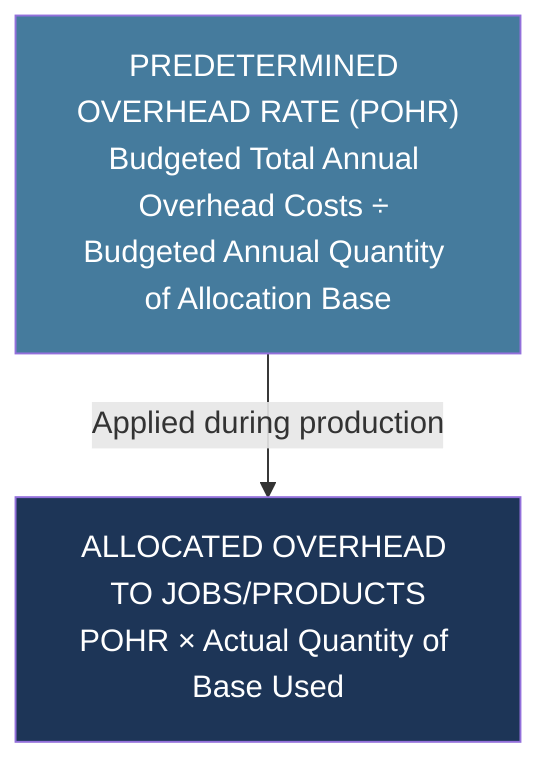
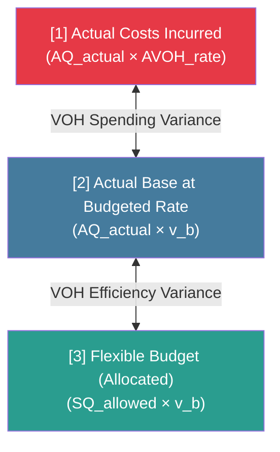
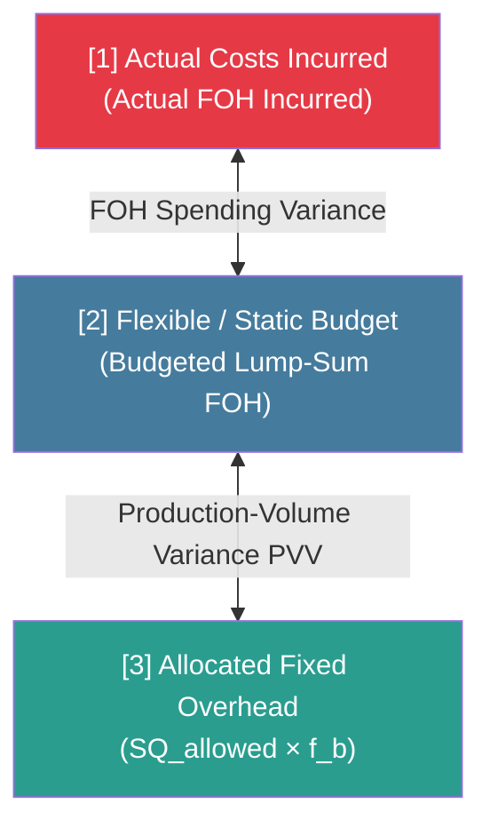
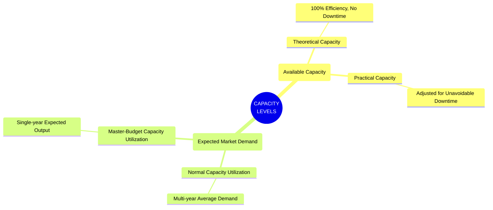
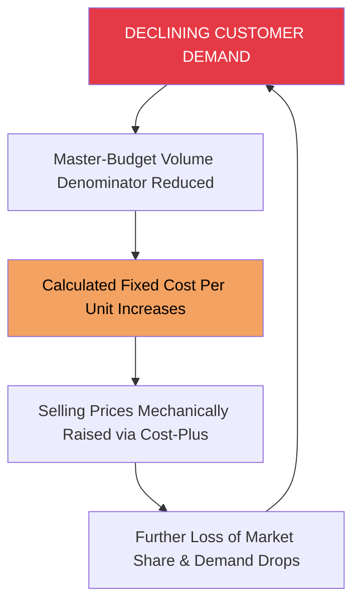

# Manufacturing Overhead and Capacity Control

> [!abstract] Curriculum & Syllabus Context
>
> - **Course:** ACC 304 Cost Accounting I
> - **Step:** Step 5: Manufacturing Overhead and Capacity Control
> - **Target Reading:** Datar & Rajan, *Horngren's Cost Accounting*, 17th/18th Edition — **Chapters 8 & 9** (Flexible Budgets, Variances, and Capacity Analysis)
> - **Syllabus Focus:** Classification of overhead and BCAS 4; predetermined overhead rates; variable overhead 2-way variance analysis (spending and efficiency); fixed overhead variance analysis (spending and production-volume); 4-variance, 3-variance, and 2-variance consolidated frameworks; variable costing vs. absorption costing income statements and reconciliation; four capacity levels (theoretical, practical, normal, master-budget); downward demand spiral; and spoilage/rework accounting in job costing.

---

## 1. Foundations of Manufacturing Overhead (MOH) & BCAS 4
### 1.1 Conceptual Nature and Classification of Overhead Costs
Manufacturing Overhead (MOH)—also designated as Factory Overhead, Indirect Manufacturing Costs, or Factory Burden—encompasses all manufacturing costs that cannot be traced directly to a specific cost object (product, job, or batch) in an economically feasible manner. Unlike direct materials and direct manufacturing labor, overhead costs are indirect in nature and must be assigned to cost objects via systematic allocation methods.

Overhead costs are categorized according to their cost behavior relative to changes in the level of production activity or cost driver within a defined relevant range:

> [!info] Key Definition
>
> **1. Variable Manufacturing Overhead ($\text{VOH}$):**
> * **Definition:** Indirect manufacturing costs that change in total in direct proportion to changes in the overall volume of production or activity base, but remain constant per unit of activity.
> * **Examples:** Factory utility power (electricity for machinery), indirect materials (lubricants, coolants, small drill bits, solvents), and variable machine maintenance.
> * **Mathematical Behavior:** Total VOH = $v \cdot X$, where $v$ is the variable overhead rate per unit of activity $X$.
> **2. Fixed Manufacturing Overhead ($\text{FOH}$):**
> * **Definition:** Indirect manufacturing costs that remain constant in total amount over a given time period despite wide fluctuations in the production volume within the relevant range. On a per-unit basis, FOH varies inversely with output volume.
> * **Examples:** Factory building depreciation (straight-line), plant supervisor salaries, factory lease/rent, property taxes on plant assets, and plant fire insurance.
> * **Mathematical Behavior:** Total FOH = $F$ (constant), while FOH per unit = $\frac{F}{X}$.
> **3. Semi-Variable / Mixed Manufacturing Overhead:**
> * **Definition:** Costs containing both a fixed baseline component (incurred regardless of activity) and a variable component that fluctuates with activity volume.
> * **Examples:** Factory maintenance costs (base retainer fee plus hourly rate per machine hour) or utility bills with a fixed demand charge plus a usage rate.
> * **Mathematical Behavior:** Total Mixed Cost = $F + v \cdot X$.

---
### 1.2 Actual vs. Normal Costing and Predetermined Overhead Rates (POHR)
Because actual indirect costs are incurred unevenly throughout the fiscal year and output volumes fluctuate month-to-month due to seasonal or operational factors, calculating actual overhead rates on a monthly basis causes extreme, misleading fluctuations in unit costs. To smooth these fluctuations and provide timely cost information for pricing, cost control, and financial reporting, organizations implement **Normal Costing**.

Under **Normal Costing**:
* **Direct Costs** ($DM$ and $DL$) are traced to products using **actual direct-cost rates** multiplied by **actual quantities** of direct inputs.
* **Indirect Costs** ($\text{MOH}$) are allocated to products using **budgeted (predetermined) indirect-cost rates** multiplied by **actual quantities** of the cost-allocation base used.

> [!quote] Formula & Derivation
>
> #### Mathematical Formulation of POHR:
> $$ \text{POHR} = \frac{\text{Budgeted Total Annual Indirect (Overhead) Costs}}{\text{Budgeted Total Annual Quantity of Cost-Allocation Base}} = \frac{\text{Budgeted Annual VOH} + \text{Budgeted Annual FOH}}{\text{Budgeted Annual Allocation Base Quantity ($X_b$)}} $$
> For a dual-rate or split overhead pool system, predetermined rates are calculated separately for variable and fixed components:
> $$ \text{POHR}_{\text{VOH}} = \frac{\text{Budgeted Annual VOH}}{\text{Budgeted Annual Base Quantity ($X_b$)}} = v_b $$
> $$ \text{POHR}_{\text{FOH}} = \frac{\text{Budgeted Annual FOH}}{\text{Denominator Level Capacity ($X_d$)}} = f_b $$
> $$ \text{Total POHR} = \text{POHR}_{\text{VOH}} + \text{POHR}_{\text{FOH}} = v_b + f_b $$

---
### 1.3 Plant-Wide vs. Departmental Overhead Rates
1. **Plant-Wide Overhead Rate:**
   * Uses a single cost pool for the entire manufacturing facility and a single allocation base (e.g., total direct labor-hours or total machine-hours) to allocate overhead across all products.
   * **Limitation:** Leads to severe cost distortions (cross-subsidization) when different production departments consume overhead resources in varying proportions, or when products pass through departments in non-uniform ratios.
2. **Departmental Overhead Rates:**
   * Establishes separate overhead cost pools and distinct allocation bases for each operating department (e.g., Machining Department allocated via machine-hours; Assembly Department allocated via direct labor-hours).
   * **Advantage:** Captures the cause-and-effect relationship between departmental resource consumption and product movement more accurately, providing superior guidance for pricing, product-mix, and cost control.

---
### 1.4 Regulatory Framework: BCAS 4 (Indirect Costs)
> [!warning] Exam Pitfall / Exception
>
> Under **Bangladesh Cost Accounting Standard 4 (BCAS 4: Indirect Costs)**, national cost accounting principles govern the classification, measurement, accumulation, and allocation of indirect costs:
> * **Identification & Classification:** BCAS 4 requires indirect costs to be grouped into homogenous cost pools based on functional responsibility (production, administration, distribution) and behavior (variable vs. fixed).
> * **Cause-and-Effect Allocation:** Requires indirect production costs to be allocated to cost objects based on direct cause-and-effect relationships or benefits-received criteria. Arbitrary allocation bases are prohibited when measurable cost drivers exist.
> * **Normal Capacity Base:** Fixed indirect production costs must be absorbed into product costs based on **normal capacity** or **practical capacity** of the manufacturing facility. Unabsorbed fixed overhead resulting from idle capacity must be disclosed as an expense in the period incurred rather than capitalized into inventory assets.

---
## 2. Variable Overhead (VOH) Planning & Variance Analysis
### 2.1 Planning and Control of Variable Overhead
Effective management of variable overhead requires focus on value-adding activities—those that customers perceive as enhancing the utility of the product—and the elimination of non-value-adding activities. Variable overhead planning involves two key dimensions:
1. **Planning Essential Activities:** Scheduling preventive equipment maintenance, optimizing energy consumption through smart metering, and streamlining indirect labor functions.
2. **Managing Cost Drivers:** Controlling the consumption efficiency of the allocation base (e.g., machine-hours or labor-hours) because total variable overhead varies directly with the volume of the cost driver.

---
### 2.2 Derivation of the Standard Variable Overhead Rate
The standard or budgeted variable overhead allocation rate ($v_b$) is established prior to the start of the fiscal period through a four-step procedure:
1. **Select Budget Period:** Typically an annual period (12 months) to eliminate seasonal cost and volume distortions.
2. **Select Cost-Allocation Base:** Identify the primary cost driver that causally drives variable indirect costs (e.g., machine-hours, $MH$).
3. **Estimate Total Variable Overhead Pool:** Budget total variable overhead costs associated with the chosen allocation base.
4. **Compute Unit Rate:** Divide budgeted total VOH by the budgeted total quantity of the allocation base:

> [!quote] Formula & Derivation
>
> $$ v_b = \text{POHR}_{\text{VOH}} = \frac{\text{Budgeted Annual Variable Overhead Costs}}{\text{Budgeted Annual Quantity of Cost-Allocation Base ($X_b$)}} $$

---
### 2.3 The Variable Overhead Variance Framework
At the end of the accounting period, the **Total Variable Overhead Flexible-Budget Variance** represents the difference between the actual variable overhead costs incurred and the variable overhead costs allocated to actual production under the flexible budget.

$$ \text{Total VOH Flexible-Budget Variance} = \text{Actual VOH Incurred} - \text{Flexible-Budget VOH} $$

Where:
$$ \text{Flexible-Budget VOH} = \text{Actual Output Units ($Y_a$)} \times \text{Standard Base Allowed per Unit ($AQ_{s}$)} \times \text{Budgeted Rate ($v_b$)} = SQ_{\text{allowed}} \times v_b $$

> [!quote] Formula & Derivation
>
> #### 1. Variable Overhead Spending Variance:
> Measures the difference between the actual variable overhead cost per unit of allocation base and the budgeted variable overhead rate, multiplied by the actual quantity of allocation base used.
> $$ \text{VOH Spending Variance} = \text{AQ}_{\text{actual}} \times (\text{AVOH}_{\text{rate}} - v_b) = (\text{AQ}_{\text{actual}} \times \text{AVOH}_{\text{rate}}) - (\text{AQ}_{\text{actual}} \times v_b) $$
> * **Causes of Spending Variances:** Changes in market prices for indirect materials/utilities, unexpected surges in energy rates, waste/inefficiency in lubricant or supply consumption per machine hour, or improper maintenance causing higher power consumption.
> #### 2. Variable Overhead Efficiency Variance:
> Measures the financial impact of utilizing more or less of the cost-allocation base (e.g., machine-hours) than the standard amount allowed for the actual output produced.
> $$ \text{VOH Efficiency Variance} = v_b \times (\text{AQ}_{\text{actual}} - \text{SQ}_{\text{allowed}}) $$
> Where:
> $$ \text{SQ}_{\text{allowed}} = \text{Actual Output Units Produced ($Y_a$)} \times \text{Standard Allocation Base per Unit ($AQ_s$)} $$
> * **Causes of Efficiency Variances:** Inefficient machine operators, low-quality direct materials causing machine jams, poor machine maintenance causing slower line speeds, or faulty production scheduling.
> * **Key Insight:** The VOH efficiency variance reflects *efficiency or inefficiency in the usage of the allocation base* (e.g., machine-hours), NOT efficiency in the usage of overhead resources themselves.

---
## 3. Fixed Overhead (FOH) Planning, Variances & Capacity Control
### 3.1 Planning and Strategic Nature of Fixed Overhead
Fixed overhead costs represent commitments to physical capacity, structural technology, and organizational infrastructure made prior to the start of the period. Unlike variable overhead, total fixed overhead cannot be adjusted quickly in response to short-term changes in production volume.
* **Strategic Capacity Decisions:** Choosing an excessive capacity level results in idle facilities and high unit fixed costs; choosing insufficient capacity leads to unfulfilled demand, lost customer goodwill, and lost revenues.
* **Lump-Sum Planning:** For planning and management control, fixed overhead must be analyzed as a total lump-sum amount ($F$), rather than as a per-unit cost. Unitizing fixed overhead creates the false impression that fixed costs behave like variable costs.

---
### 3.2 Derivation of the Budgeted Fixed Overhead Rate
To calculate the predetermined fixed overhead allocation rate ($f_b$), management must select a **Denominator-Level Capacity** ($X_d$):

> [!quote] Formula & Derivation
>
> $$ f_b = \text{POHR}_{\text{FOH}} = \frac{\text{Budgeted Total Annual Fixed Overhead Costs}}{\text{Denominator Level Quantity of Allocation Base ($X_d$)}} $$
> The budgeted fixed overhead cost per output unit ($F_{\text{unit}}$) is then:
> $$ F_{\text{unit}} = \text{Standard Allocation Base per Unit ($AQ_s$)} \times f_b = \frac{\text{Budgeted Annual FOH}}{\text{Denominator Output Units ($Y_d$)}} $$

---
### 3.3 The Fixed Overhead Variance Framework
In standard costing systems, fixed overhead is assigned to inventory as an inventoriable cost using the predetermined rate ($f_b$) multiplied by standard input allowed for actual output ($SQ_{\text{allowed}}$).

$$ \text{Allocated FOH} = \text{Actual Output Units ($Y_a$)} \times F_{\text{unit}} = SQ_{\text{allowed}} \times f_b $$

> [!quote] Formula & Derivation
>
> #### 1. Fixed Overhead Spending (Flexible-Budget) Variance:
> Measures the difference between actual fixed overhead costs incurred and the budgeted lump-sum fixed overhead costs:
> $$ \text{FOH Spending Variance} = \text{Actual FOH Incurred} - \text{Budgeted Lump-Sum FOH} $$
> * **Note:** Because total fixed costs do not vary with output volume within the relevant range, the flexible-budget amount for fixed overhead is identical to the static-budget amount. Thus, the FOH Flexible-Budget Variance and FOH Spending Variance are mathematically identical. There is **no FOH efficiency variance** because fixed costs are unaffected by the degree of efficiency in using the allocation base during a given period.
> #### 2. Production-Volume Variance (PVV) / Denominator-Level Variance:
> Measures the difference between the budgeted lump-sum fixed overhead and the fixed overhead allocated to actual output produced. This variance arises solely under **Absorption Costing** because fixed overhead is unitized for product costing.
> $$ \text{PVV} = \text{Budgeted Lump-Sum FOH} - \text{Allocated FOH} $$
> $$ \text{PVV} = \text{Budgeted FOH} - (Y_a \times F_{\text{unit}}) $$
> $$ \text{PVV} = (Y_d - Y_a) \times F_{\text{unit}} $$
> $$ \text{PVV} = (X_d - SQ_{\text{allowed}}) \times f_b $$
> Where:
> * $Y_d$ = Denominator level output units.
> * $Y_a$ = Actual output units produced.
> * $X_d$ = Denominator level quantity of allocation base.
> * $SQ_{\text{allowed}}$ = Standard allocation base quantity allowed for actual output.
> * **Favorable PVV ($Y_a > Y_d$):** Occurs when actual production exceeds the denominator capacity level, resulting in an overallocation of fixed overhead.
> * **Unfavorable PVV ($Y_a < Y_d$):** Occurs when actual production falls short of the denominator capacity level, indicating that acquired plant capacity was underutilized.

---
### 3.4 Summary of Integrated 4-Variance Analysis Matrix

| Variance Level | Overhead Component        | Formula / Calculation                                                 | Interpretation                                                   |
| :------------- | :------------------------ | :-------------------------------------------------------------------- | :--------------------------------------------------------------- |
| **Level 3**    | **VOH Spending**          | $\text{AQ}_{\text{actual}} \times (\text{AVOH}_{\text{rate}} - v_b)$  | Price/usage changes in variable overhead items.                  |
| **Level 3**    | **VOH Efficiency**        | $v_b \times (\text{AQ}_{\text{actual}} - \text{SQ}_{\text{allowed}})$ | Efficiency/inefficiency in consuming the allocation base.        |
| **Level 3**    | **FOH Spending**          | $\text{Actual FOH Incurred} - \text{Budgeted FOH}$                    | Unanticipated changes in lump-sum fixed overhead costs.          |
| **Level 3**    | **FOH Production-Volume** | $\text{Budgeted FOH} - \text{Allocated FOH}$                          | Financial measure of capacity utilization vs. denominator level. |

#### Consolidated Frameworks:
* **3-Variance Analysis:** Combines VOH Spending and FOH Spending into a single *Total Overhead Spending Variance*, plus VOH Efficiency Variance and FOH Production-Volume Variance.
* **2-Variance Analysis:** Combines VOH Spending, VOH Efficiency, and FOH Spending into a single *Total Flexible-Budget Variance*, plus FOH Production-Volume Variance.
* **1-Variance Analysis:** *Total Under/Overallocated Overhead* = Total Actual MOH Incurred - Total Allocated MOH.

---
## 4. Inventory Costing Methods: Variable Costing vs. Absorption Costing
### 4.1 Theoretical Comparison: Variable, Absorption, and Throughput Costing
The primary distinction among inventory costing methods lies in the treatment of **Fixed Manufacturing Overhead ($\text{FOH}$)** and non-manufacturing costs.

| Cost Category | Variable Costing | Absorption Costing | Throughput Costing (Super-Variable) |
| :--- | :--- | :--- | :--- |
| **Direct Materials ($DM$)** | Inventoriable Asset | Inventoriable Asset | Inventoriable Asset |
| **Direct Labor ($DL$)** | Inventoriable Asset | Inventoriable Asset | Period Expense |
| **Variable MOH ($VOH$)** | Inventoriable Asset | Inventoriable Asset | Period Expense |
| **Fixed MOH ($FOH$)** | **Period Expense** (Charged immediately) | **Inventoriable Asset** (Capitalized into product) | Period Expense |
| **Variable Non-Manufacturing** | Period Expense | Period Expense | Period Expense |
| **Fixed Non-Manufacturing** | Period Expense | Period Expense | Period Expense |

---
### 4.2 Income Statement Formats and Structures
> [!quote] Formula & Derivation
>
> #### 1. Variable Costing Income Statement (Contribution Margin Format):
> $$
> \begin{aligned}
> &\text{Revenues} \\
> \text{Less:} &\text{ Variable Cost of Goods Sold ($\text{Beginning FG} + \text{Variable Cost of Goods Mfg} - \text{Ending FG}$)} \\
> \text{Less:} &\text{ Variable Operating/Non-Manufacturing Costs (Marketing, Distribution)} \\
> \hline
> = &\mathbf{\text{Contribution Margin}} \\
> \text{Less:} &\text{ Fixed Manufacturing Overhead ($\text{Total Lump-Sum Incurred}$)} \\
> \text{Less:} &\text{ Fixed Operating/Non-Manufacturing Costs} \\
> \hline
> = &\mathbf{\text{Operating Income}}
> \end{aligned}
> $$
> #### 2. Absorption Costing Income Statement (Gross Margin Format):
> $$
> \begin{aligned}
> &\text{Revenues} \\
> \text{Less:} &\text{ Cost of Goods Sold ($\text{Beg. FG} + \text{COGM} - \text{End. FG} \pm \text{Production-Volume / Overhead Variances}$)} \\
> \hline
> = &\mathbf{\text{Gross Margin (Gross Profit)}} \\
> \text{Less:} &\text{ Operating Costs (Variable \& Fixed Non-Manufacturing Costs)} \\
> \hline
> = &\mathbf{\text{Operating Income}}
> \end{aligned}
> $$

---
### 4.3 Mathematical Reconciliation of Operating Income
The difference in reported operating income between Variable Costing and Absorption Costing is strictly a function of the change in the physical inventory quantity multiplied by the unitized fixed manufacturing overhead rate:

$$ \text{Operating Income}_{\text{Absorption}} - \text{Operating Income}_{\text{Variable}} = \text{FOH}_{\text{Ending Inventory}} - \text{FOH}_{\text{Beginning Inventory}} $$

$$ \Delta \text{Operating Income} = (\text{Ending Inventory Units} - \text{Beginning Inventory Units}) \times F_{\text{unit}} $$

Where $F_{\text{unit}}$ is the budgeted fixed manufacturing cost per unit allocated under absorption costing.

> [!warning] Exam Pitfall / Exception
>
> #### INVENTORY MOVEMENT RULES & OPERATING INCOME
> 1. **Production = Sales** (Ending Inventory = Beginning Inventory):
>    $\text{Operating Income (Absorption)} = \text{Operating Income (Variable)}$
> 2. **Production > Sales** (Inventory Increases, Ending > Beginning):
>    $\text{Operating Income (Absorption)} > \text{Operating Income (Variable)}$
>    * *Reason:* A portion of current period FOH is capitalized in ending inventory under Absorption, deferring the expense.
> 3. **Production < Sales** (Inventory Decreases, Ending < Beginning):
>    $\text{Operating Income (Absorption)} < \text{Operating Income (Variable)}$
>    * *Reason:* Previously deferred FOH from beginning inventory is released into COGS under Absorption.

---
### 4.4 Behavioral Implications & Dysfunctional Inventory Buildup
Absorption costing creates a structural incentive for plant managers to artificially inflate reported operating income by producing in excess of market demand:
* **Mechanics of Manipulation:** When a plant overproduces, fixed manufacturing overhead is spread over a larger number of units. This lowers the unitized fixed overhead cost charged to COGS and defers fixed overhead costs into ending inventory assets on the Balance Sheet.
* **Dysfunctional Consequences:**
  * Building up unsellable inventory ties up working capital and increases holding costs, storage fees, obsolescence, and insurance.
  * Managers may "cherry-pick" production runs of jobs that absorb high amounts of fixed overhead rather than jobs requested by customers, leading to missed customer delivery dates.
* **Mitigating Countermeasures:**
  1. Evaluate plant managers using **Variable Costing** for internal reporting.
  2. Implement strict physical inventory holding limits / caps.
  3. Include a carrying charge for inventory in manager performance evaluations.
  4. Incorporate non-financial measures (e.g., ratio of ending inventory to sales, turnover rates) alongside financial metrics.

---
## 5. Capacity Analysis & Denominator-Level Selection
### 5.1 The Four Denominator-Level Capacity Concepts
Choosing the denominator capacity level ($X_d$ or $Y_d$) is a critical strategic decision in absorption costing because it directly determines the budgeted fixed overhead cost per unit ($F_{\text{unit}}$).

> [!info] Key Definition
>
> #### 1. Theoretical Capacity:
> * **Definition:** The absolute maximum production volume achievable assuming full technical efficiency $100\%$ of the time, operating $24$ hours a day, $365$ days a year, with zero interruptions, machine breakdowns, maintenance, or operator fatigue.
> * **Nature:** An unattainable, ideal benchmark.
> #### 2. Practical Capacity:
> * **Definition:** The maximum production volume achievable after reducing theoretical capacity for unavoidable operational interruptions, such as scheduled preventive maintenance, setups, holidays, and worker breaks.
> * **Nature:** Measures physical capacity **supplied**.
> #### 3. Normal Capacity Utilization:
> * **Definition:** The level of capacity utilization that satisfies average customer demand over a multi-year time horizon (typically 2 to 3 years) that encompasses seasonal, cyclical, and trend factors.
> * **Nature:** Measures capacity **demanded** over a long-term horizon.
> #### 4. Master-Budget Capacity Utilization:
> * **Definition:** The specific level of capacity utilization expected for the current single budget period (typically 1 fiscal year).
> * **Nature:** Measures capacity **demanded** in the short-term.

---
### 5.2 Comparative Impact on Unit Costs and Production-Volume Variances
Assuming total budgeted annual fixed manufacturing overhead = $\$1,080,000$:

| Capacity Concept | Budgeted Output Volume ($Y_d$) | Budgeted FOH per Unit ($F_{\text{unit}} = \frac{\$1,080,000}{Y_d}$) | Variable Cost per Unit | Total Unit Cost | PVV if Actual Output ($Y_a$) = 8,000 units |
| :--- | :--- | :--- | :--- | :--- | :--- |
| **Theoretical** | 18,000 units | $\$60.00$ | $\$200.00$ | $\$260.00$ | $\$600,000 \text{ U}$ |
| **Practical** | 12,000 units | $\$90.00$ | $\$200.00$ | $\$290.00$ | $\$360,000 \text{ U}$ |
| **Normal Utilization** | 10,000 units | $\$108.00$ | $\$200.00$ | $\$308.00$ | $\$216,000 \text{ U}$ |
| **Master-Budget** | 8,000 units | $\$135.00$ | $\$200.00$ | $\$335.00$ | $\$0$ |

---
### 5.3 Practical Capacity as the Benchmark & The Downward Demand Spiral
#### The Downward Demand Spiral:
Occurs when master-budget capacity utilization is used to calculate unit fixed costs during periods of declining demand. As expected volume drops, fixed overhead is spread over fewer units, driving up unit costs. In response, managers mechanically raise selling prices (cost-plus pricing), causing further customer defection, additional volume drops, and a continuous upward spiral of unit costs leading to competitive collapse.

#### Practical Capacity as the Benchmark Solution:
Using **Practical Capacity** prevents the downward demand spiral:
1. **Stable Unit Cost:** Reflects the cost of supplying capacity ($\$90$ per unit), regardless of short-term demand fluctuations.
2. **Explicit Unused Capacity Cost:** Isolates unutilized capacity as a separate line item ($\text{Unused Capacity Cost} = (12,000 - 8,000) \times \$90 = \$360,000$), alerting management to downsize, reassign resources, or price competitively to fill excess space.
3. **Customer Fairness:** Customers are charged only for the capacity required to produce their goods, not for the burden of idle facilities.

---
## 6. Spoilage, Rework, and Scrap Accounting
### 6.1 Fundamental Definitions
Production operations frequently generate units that fail to meet technical quality specifications.
1. **Spoilage:** Units of output—whether partially or fully completed—that do not meet the standards required by customers and are discarded or sold for reduced salvage/disposal value.
2. **Rework:** Defective units of output that do not meet standards but are subsequently repaired, re-machined, or re-processed to turn them into saleable good units.
3. **Scrap:** Residual material resulting from manufacturing operations (e.g., metal turnings, lumber trimmings, cloth offcuts) that has low or negligible sales value relative to the primary product.

---
### 6.2 Normal vs. Abnormal Spoilage
> [!info] Key Definition
>
> **1. Normal Spoilage:**
> * **Nature:** Spoilage inherent in a particular production process that arises even under efficient operating conditions. Unavoidable in the short run.
> * **Accounting Treatment:** Capitalized as an inventoriable product cost.
>   * *Job-Specific Spoilage:* Charged directly to the specific job that caused the spoilage.
>   * *Common-to-All Jobs Spoilage:* Charged to Manufacturing Overhead Control and spread across all jobs via predetermined overhead rates.
> **2. Abnormal Spoilage:**
> * **Nature:** Spoilage that is not inherent in normal operations and would not arise under efficient operating conditions. Controllable by plant personnel.
> * **Accounting Treatment:** Treated as controllable and avoidable losses. The net cost of abnormal spoilage is charged directly to a separate loss account (**Loss from Abnormal Spoilage**) and written off as a period expense in the current period.

---
### 6.3 Accounting Mechanics for Spoilage, Rework, and Scrap in Job Costing
#### A. Spoilage Accounting Entries (Job Costing)
1. **Normal Spoilage Specific to a Job:**
   * Disposal Value of Spoiled Units recorded in Materials Control; remaining unrecovered cost stays in WIP for that specific job.
   $$
   \begin{aligned}
   &\text{Dr. Materials Control (Disposal/Salvage Value of Spoiled Units)} \\
   &\quad \text{Cr. Work-in-Process Control (Job \#X)}
   \end{aligned}
   $$
2. **Normal Spoilage Common to All Jobs:**
   * Disposal Value recorded in Materials Control; net unrecovered cost charged to Manufacturing Overhead Control.
   $$
   \begin{aligned}
   &\text{Dr. Materials Control (Disposal/Salvage Value)} \\
   &\text{Dr. Manufacturing Overhead Control (Net Cost of Normal Spoilage)} \\
   &\quad \text{Cr. Work-in-Process Control (Job \#X - Total Cost of Spoiled Units)}
   \end{aligned}
   $$
3. **Abnormal Spoilage:**
   * Disposal Value recorded in Materials Control; net unrecovered loss charged to Loss from Abnormal Spoilage.
   $$
   \begin{aligned}
   &\text{Dr. Materials Control (Disposal/Salvage Value)} \\
   &\text{Dr. Loss from Abnormal Spoilage (Period Expense)} \\
   &\quad \text{Cr. Work-in-Process Control (Job \#X - Total Cost of Spoiled Units)}
   \end{aligned}
   $$

---
#### B. Rework Accounting Entries (Job Costing)
1. **Normal Rework Specific to a Job:**
   * Rework costs ($DM, DL, \text{Allocated MOH}$) charged directly to the specific Job.
   $$
   \begin{aligned}
   &\text{Dr. Work-in-Process Control (Job \#X)} \\
   &\quad \text{Cr. Materials Control} \\
   &\quad \text{Cr. Wages Payable Control} \\
   &\quad \text{Cr. Manufacturing Overhead Allocated}
   \end{aligned}
   $$
2. **Normal Rework Common to All Jobs:**
   * Rework costs charged to Manufacturing Overhead Control.
   $$
   \begin{aligned}
   &\text{Dr. Manufacturing Overhead Control (Rework Costs)} \\
   &\quad \text{Cr. Materials Control} \\
   &\quad \text{Cr. Wages Payable Control} \\
   &\quad \text{Cr. Manufacturing Overhead Allocated}
   \end{aligned}
   $$
3. **Abnormal Rework:**
   * Rework costs charged to Loss from Abnormal Rework.
   $$
   \begin{aligned}
   &\text{Dr. Loss from Abnormal Rework (Period Expense)} \\
   &\quad \text{Cr. Materials Control} \\
   &\quad \text{Cr. Wages Payable Control} \\
   &\quad \text{Cr. Manufacturing Overhead Allocated}
   \end{aligned}
   $$

---
#### C. Scrap Accounting Entries
1. **Recognized at Time of Sale (Immaterial Value):**
   * *Specific to Job:*
     $$
     \begin{aligned}
     &\text{Dr. Cash / Accounts Receivable} \\
     &\quad \text{Cr. Work-in-Process Control (Job \#X)}
     \end{aligned}
     $$
   * *Common to All Jobs:*
     $$
     \begin{aligned}
     &\text{Dr. Cash / Accounts Receivable} \\
     &\quad \text{Cr. Manufacturing Overhead Control}
     \end{aligned}
     $$
2. **Recognized at Time of Production (Material Value):**
   * Inventory value established at estimated net realizable value upon production.
   $$
   \begin{aligned}
   &\text{Dr. Materials Control (Scrap Inventory at NRV)} \\
   &\quad \text{Cr. Work-in-Process Control (Specific Job) OR Mfg. Overhead Control (Common)}
   \end{aligned}
   $$

---
## 7. Comprehensive Step-by-Step Numerical Walkthroughs
> [!example] Numerical Problem
>
> ### 7.1 Problem 1: Integrated 4-Variance Overhead Analysis & Closing Entries
> #### Problem Statement:
> Standard Dynamics Ltd. manufactures precision auto components. For 2020, the company budgeted the following annual parameters:
> * Denominator Output Capacity ($Y_d$): $12,000\text{ units}$
> * Standard Allocation Base per Unit ($AQ_s$): $2.5\text{ Machine-Hours (MH) per unit}$
> * Denominator Machine-Hours ($X_d$): $12,000 \times 2.5 = 30,000\text{ MH}$
> * Budgeted Variable Overhead ($\text{VOH}$): $\$150,000$
> * Budgeted Fixed Overhead ($\text{FOH}$): $\$360,000$
> During 2020, Standard Dynamics recorded the following actual results:
> * Actual Output Produced ($Y_a$): $10,000\text{ units}$
> * Actual Machine-Hours Used ($\text{AQ}_{\text{actual}}$): $26,000\text{ MH}$
> * Actual Variable Overhead Incurred: $\$135,200$
> * Actual Fixed Overhead Incurred: $\$372,000$
> #### Required:
> 1. Compute predetermined VOH and FOH allocation rates per MH and per output unit.
> 2. Calculate the complete 4-Variance Overhead Analysis (VOH Spending, VOH Efficiency, FOH Spending, FOH Production-Volume).
> 3. Compute total under/overallocated overhead and prepare year-end journal entries to dispose of variances using the Write-Off to COGS method.

#### Step-by-Step Solution:
##### Step 1: Compute Predetermined Allocation Rates
$$ \text{POHR}_{\text{VOH}} (v_b) = \frac{\$150,000}{30,000\text{ MH}} = \$5.00\text{ per MH} $$

$$ \text{POHR}_{\text{FOH}} (f_b) = \frac{\$360,000}{30,000\text{ MH}} = \$12.00\text{ per MH} $$

$$ \text{Total POHR} = \$5.00 + \$12.00 = \$17.00\text{ per MH} $$
* Fixed Overhead per Output Unit ($F_{\text{unit}}$):
$$ F_{\text{unit}} = 2.5\text{ MH} \times \$12.00 = \$30.00\text{ per unit} $$
* Standard Machine-Hours Allowed for Actual Production ($\text{SQ}_{\text{allowed}}$):
$$ \text{SQ}_{\text{allowed}} = 10,000\text{ units} \times 2.5\text{ MH/unit} = 25,000\text{ MH} $$

---
##### Step 2: Variable Overhead Variance Analysis
1. **VOH Spending Variance:**
   $$ \text{VOH Spending Variance} = \text{Actual VOH Incurred} - (\text{AQ}_{\text{actual}} \times v_b) $$
   $$ \text{VOH Spending Variance} = \$135,200 - (26,000\text{ MH} \times \$5.00) = \$135,200 - \$130,000 = \mathbf{\$5,200\text{ Unfavorable (U)}} $$
2. **VOH Efficiency Variance:**
   $$ \text{VOH Efficiency Variance} = v_b \times (\text{AQ}_{\text{actual}} - \text{SQ}_{\text{allowed}}) $$
   $$ \text{VOH Efficiency Variance} = \$5.00 \times (26,000\text{ MH} - 25,000\text{ MH}) = \$5.00 \times 1,000\text{ MH} = \mathbf{\$5,000\text{ Unfavorable (U)}} $$
3. **Total VOH Flexible-Budget Variance:**
   $$ \text{Total VOH Variance} = \$5,200\text{ U} + \$5,000\text{ U} = \mathbf{\$10,200\text{ Unfavorable (U)}} $$

---
##### Step 3: Fixed Overhead Variance Analysis
1. **FOH Spending (Flexible-Budget) Variance:**
   $$ \text{FOH Spending Variance} = \text{Actual FOH Incurred} - \text{Budgeted FOH} $$
   $$ \text{FOH Spending Variance} = \$372,000 - \$360,000 = \mathbf{\$12,000\text{ Unfavorable (U)}} $$
2. **Fixed Overhead Allocated:**
   $$ \text{Allocated FOH} = \text{SQ}_{\text{allowed}} \times f_b = 25,000\text{ MH} \times \$12.00 = \$300,000 $$
   $$ \text{OR: Allocated FOH} = 10,000\text{ actual units} \times \$30.00/\text{unit} = \$300,000 $$
3. **FOH Production-Volume Variance (PVV):**
   $$ \text{PVV} = \text{Budgeted FOH} - \text{Allocated FOH} = \$360,000 - \$300,000 = \mathbf{\$60,000\text{ Unfavorable (U)}} $$
   $$ \text{Verification via Units:} (12,000\text{ denominator units} - 10,000\text{ actual units}) \times \$30.00/\text{unit} = \mathbf{\$60,000\text{ U}} $$
4. **Total FOH Variance:**
   $$ \text{Total FOH Variance} = \$12,000\text{ U} + \$60,000\text{ U} = \mathbf{\$72,000\text{ Unfavorable (U)}} $$

---
##### Step 4: Total Under/Overallocated Overhead Summary
* Total Actual Manufacturing Overhead Incurred = $\$135,200 (\text{VOH}) + \$372,000 (\text{FOH}) = \$507,200$
* Total Allocated Manufacturing Overhead = $(25,000\text{ MH} \times \$5.00) + (25,000\text{ MH} \times \$12.00) = \$125,000 + \$300,000 = \$425,000$
* **Total Underallocated Manufacturing Overhead:**
  $$ \text{Underallocated MOH} = \text{Actual MOH} - \text{Allocated MOH} = \$507,200 - \$425,000 = \mathbf{\$82,200\text{ Unfavorable}} $$
* **Check against sum of 4 variances:**
  $$ \$5,200\text{ (VOH Spend)} + \$5,000\text{ (VOH Eff)} + \$12,000\text{ (FOH Spend)} + \$60,000\text{ (PVV)} = \mathbf{\$82,200\text{ U}} $$

---
##### Step 5: Year-End Closing Journal Entries (Write-Off to COGS)

$$ \begin{array}{llrr}
\hline
\textbf{Date} & \textbf{Account Titles and Explanation} & \textbf{Debit (\$)} & \textbf{Credit (\$)} \\
\hline
\text{Dec 31} & \text{Manufacturing Overhead Allocated} & 425,000 & \\
& \text{VOH Spending Variance} & 5,200 & \\
& \text{VOH Efficiency Variance} & 5,000 & \\
& \text{FOH Spending Variance} & 12,000 & \\
& \text{FOH Production-Volume Variance} & 60,000 & \\
& \quad \text{Cost of Goods Sold (Underallocated Overhead)} & & 82,200 \\
& \quad \text{Manufacturing Overhead Control} & & 507,200 \\
& \text{\small(To close overhead accounts, record 4 variances, and write off to COGS)} & & \\
\hline \hline
\end{array} $$

---

> [!example] Numerical Problem
>
> ### 7.2 Problem 2: Variable vs. Absorption Costing Reconciliation Walkthrough
> #### Problem Statement:
> Apex Manufacturing produces a single industrial product. Year 1 and Year 2 data are presented below:
> * Selling Price: $\$100\text{ per unit}$
> * Variable Manufacturing Cost per Unit: $\$30\text{ per unit}$ ($DM = \$15, DL = \$10, VOH = \$5$)
> * Fixed Manufacturing Overhead ($\text{FOH}$): $\$200,000\text{ per year}$
> * Variable Marketing/Operating Cost per Unit: $\$10\text{ per unit sold}$
> * Fixed Marketing/Operating Costs: $\$80,000\text{ per year}$
> * Denominator Capacity Level ($Y_d$): $10,000\text{ units per year}$
> * Budgeted FOH Rate per Unit ($F_{\text{unit}}$): $\frac{\$200,000}{10,000\text{ units}} = \$20.00\text{ per unit}$
> **Operational Volumes:**
> * **Year 1:** Beginning Inventory = $0\text{ units}$; Production = $10,000\text{ units}$; Sales = $8,000\text{ units}$; Ending Inventory = $2,000\text{ units}$.
> * **Year 2:** Beginning Inventory = $2,000\text{ units}$; Production = $7,000\text{ units}$; Sales = $9,000\text{ units}$; Ending Inventory = $0\text{ units}$.
> #### Required:
> 1. Prepare Income Statements for Year 1 and Year 2 under Variable Costing and Absorption Costing.
> 2. Mathematically reconcile the operating income differences for both years.

#### Step-by-Step Solution:
##### Year 1 Operating Income Calculations:
1. **Variable Costing (Year 1):**
   * Revenues ($8,000 \times \$100$): $\$800,000$
   * Variable Cost of Goods Sold ($8,000 \times \$30$): $(\$240,000)$
   * Variable Operating Costs ($8,000 \times \$10$): $(\$80,000)$
   * **Contribution Margin:** $\$800,000 - \$240,000 - \$80,000 = \mathbf{\$480,000}$
   * Less Fixed Manufacturing Overhead: $(\$200,000)$
   * Less Fixed Operating Costs: $(\$80,000)$
   * **Variable Costing Operating Income:** $\$480,000 - \$200,000 - \$80,000 = \mathbf{\$200,000}$
2. **Absorption Costing (Year 1):**
   * Unit Product Cost = $\$30\text{ (Var)} + \$20\text{ (Fixed FOH)} = \$50\text{ per unit}$
   * Revenues ($8,000 \times \$100$): $\$800,000$
   * Cost of Goods Sold before Variances ($8,000 \times \$50$): $(\$400,000)$
   * Production Volume Variance: Actual Production ($10,000$) = Denominator ($10,000$), so $\text{PVV} = \$0$.
   * Adjusted Cost of Goods Sold: $(\$400,000)$
   * **Gross Margin:** $\$800,000 - \$400,000 = \mathbf{\$400,000}$
   * Less Variable Operating Costs ($8,000 \times \$10$): $(\$80,000)$
   * Less Fixed Operating Costs: $(\$80,000)$
   * **Absorption Costing Operating Income:** $\$400,000 - \$80,000 - \$80,000 = \mathbf{\$240,000}$
* **Year 1 Income Reconciliation:**
  $$ \text{Absorption Income} - \text{Variable Income} = \$240,000 - \$200,000 = \mathbf{\$40,000} $$
  $$ \text{Proof via Inventory Change} = (\text{Ending Units} - \text{Beginning Units}) \times F_{\text{unit}} = (2,000 - 0) \times \$20.00 = \mathbf{\$40,000} $$

---
##### Year 2 Operating Income Calculations:
1. **Variable Costing (Year 2):**
   * Revenues ($9,000 \times \$100$): $\$900,000$
   * Variable Cost of Goods Sold ($9,000 \times \$30$): $(\$270,000)$
   * Variable Operating Costs ($9,000 \times \$10$): $(\$90,000)$
   * **Contribution Margin:** $\$900,000 - \$270,000 - \$90,000 = \mathbf{\$540,000}$
   * Less Fixed Manufacturing Overhead: $(\$200,000)$
   * Less Fixed Operating Costs: $(\$80,000)$
   * **Variable Costing Operating Income:** $\$540,000 - \$200,000 - \$80,000 = \mathbf{\$260,000}$
2. **Absorption Costing (Year 2):**
   * Unit Product Cost = $\$50\text{ per unit}$
   * Cost of Goods Sold before Variances ($9,000 \times \$50$): $(\$450,000)$
   * Production-Volume Variance:
     $$ \text{PVV} = (Y_d - Y_a) \times F_{\text{unit}} = (10,000 - 7,000) \times \$20.00 = \mathbf{\$60,000\text{ Unfavorable (U)}} $$
   * Cost of Goods Sold adjusted for PVV: $\$450,000 + \$60,000 = (\$510,000)$
   * **Gross Margin:** $\$900,000 - \$510,000 = \mathbf{\$390,000}$
   * Less Variable Operating Costs ($9,000 \times \$10$): $(\$90,000)$
   * Less Fixed Operating Costs: $(\$80,000)$
   * **Absorption Costing Operating Income:** $\$390,000 - \$90,000 - \$80,000 = \mathbf{\$220,000}$
* **Year 2 Income Reconciliation:**
  $$ \text{Absorption Income} - \text{Variable Income} = \$220,000 - \$260,000 = \mathbf{-\$40,000} $$
  $$ \text{Proof via Inventory Change} = (\text{Ending Units} - \text{Beginning Units}) \times F_{\text{unit}} = (0 - 2,000) \times \$20.00 = \mathbf{-\$40,000} $$

---

> [!example] Numerical Problem
>
> ### 7.3 Problem 3: Spoilage & Rework Accounting Walkthrough
> #### Problem Statement:
> Precision Craft Ltd. manufactures custom architectural doors under Job Order Costing. During the month, Job \#501 (comprising 100 doors) incurred total manufacturing costs of $\$100,000$ ($\$1,000\text{ per door}$, consisting of $\$500\text{ DM}$, $\$300\text{ DL}$, and $\$200\text{ Allocated MOH}$).
> During quality inspection, the following events occurred:
> 1. **Event A (Spoilage):** 5 doors were found severely warped and spoiled.
>    * Disposal value of spoiled doors = $\$200\text{ per door}$.
>    * *Case A1:* Spoilage is considered **Normal and Specific** to Job \#501.
>    * *Case A2:* Spoilage is considered **Normal and Common to All Jobs**.
>    * *Case A3:* Spoilage is considered **Abnormal**.
> 2. **Event B (Rework):** 4 doors had minor surface scratches and required rework.
>    * Rework costs incurred: $\$400\text{ DM}$, $\$600\text{ DL}$, and $\$400\text{ Allocated MOH}$ (Total Rework = $\$1,400$).
>    * *Case B1:* Rework is **Normal and Specific** to Job \#501.
>    * *Case B2:* Rework is **Normal and Common to All Jobs**.
>    * *Case B3:* Rework is **Abnormal**.
> #### Required:
> Prepare all general ledger journal entries for Cases A1–A3 and Cases B1–B3, and compute the final unit cost of the good doors under each case.

#### Step-by-Step Solution:
##### Part A: Spoilage Journal Entries & Unit Cost Determination
* Total cost of 5 spoiled doors = $5 \times \$1,000 = \$5,000$. Total salvage value = $5 \times \$200 = \$1,000$. Net cost of spoilage = $\$4,000$.
1. **Case A1: Normal Spoilage Specific to Job \#501**

$$ \begin{array}{llrr}
\hline
\textbf{Account Titles and Explanation} & & \textbf{Debit (\$)} & \textbf{Credit (\$)} \\
\hline
\text{Materials Control (Disposal Value: } 5 \times \$200) & & 1,000 & \\
\quad \text{Work-in-Process Control (Job \#501)} & & & 1,000 \\
\hline \hline
\end{array} $$

* **Job \#501 Cost Impact:** Remaining Work-in-Process balance = $\$100,000 - \$1,000 = \$99,000$.
   * **Good Units Produced:** $100 - 5 = 95\text{ doors}$.
   * **Unit Cost of Good Doors:** $\frac{\$99,000}{95\text{ doors}} = \mathbf{\$1,042.11\text{ per door}}$.
2. **Case A2: Normal Spoilage Common to All Jobs**

$$ \begin{array}{llrr}
\hline
\textbf{Account Titles and Explanation} & & \textbf{Debit (\$)} & \textbf{Credit (\$)} \\
\hline
\text{Materials Control (Disposal Value: } 5 \times \$200) & & 1,000 & \\
\text{Manufacturing Overhead Control (Net Cost)} & & 4,000 & \\
\quad \text{Work-in-Process Control (Job \#501)} & & & 5,000 \\
\hline \hline
\end{array} $$

* **Job \#501 Cost Impact:** Remaining Work-in-Process balance = $\$100,000 - \$5,000 = \$95,000$.
   * **Unit Cost of Good Doors:** $\frac{\$95,000}{95\text{ doors}} = \mathbf{\$1,000.00\text{ per door}}$ (The $\$4,000$ net cost is spread across all plant jobs via POHR).
3. **Case A3: Abnormal Spoilage**

$$ \begin{array}{llrr}
\hline
\textbf{Account Titles and Explanation} & & \textbf{Debit (\$)} & \textbf{Credit (\$)} \\
\hline
\text{Materials Control (Disposal Value: } 5 \times \$200) & & 1,000 & \\
\text{Loss from Abnormal Spoilage (Period Loss)} & & 4,000 & \\
\quad \text{Work-in-Process Control (Job \#501)} & & & 5,000 \\
\hline \hline
\end{array} $$

* **Job \#501 Cost Impact:** Remaining Work-in-Process balance = $\$100,000 - \$5,000 = \$95,000$.
   * **Unit Cost of Good Doors:** $\frac{\$95,000}{95\text{ doors}} = \mathbf{\$1,000.00\text{ per door}}$ (The $\$4,000$ loss is expensed immediately on the Income Statement).

---
##### Part B: Rework Journal Entries & Unit Cost Determination
1. **Case B1: Normal Rework Specific to Job \#501**

$$ \begin{array}{llrr}
\hline
\textbf{Account Titles and Explanation} & & \textbf{Debit (\$)} & \textbf{Credit (\$)} \\
\hline
\text{Work-in-Process Control (Job \#501)} & & 1,400 & \\
\quad \text{Materials Control} & & & 400 \\
\quad \text{Wages Payable Control} & & & 600 \\
\quad \text{Manufacturing Overhead Allocated} & & & 400 \\
\hline \hline
\end{array} $$

* **Job \#501 Cost Impact:** Updated Work-in-Process balance = $\$100,000 + \$1,400 = \$101,400$.
   * **Unit Cost of 100 Good Doors:** $\frac{\$101,400}{100\text{ doors}} = \mathbf{\$1,014.00\text{ per door}}$.
2. **Case B2: Normal Rework Common to All Jobs**

$$ \begin{array}{llrr}
\hline
\textbf{Account Titles and Explanation} & & \textbf{Debit (\$)} & \textbf{Credit (\$)} \\
\hline
\text{Manufacturing Overhead Control (Rework Costs)} & & 1,400 & \\
\quad \text{Materials Control} & & & 400 \\
\quad \text{Wages Payable Control} & & & 600 \\
\quad \text{Manufacturing Overhead Allocated} & & & 400 \\
\hline \hline
\end{array} $$

* **Job \#501 Cost Impact:** Work-in-Process balance remains $\$100,000$.
   * **Unit Cost of 100 Good Doors:** $\frac{\$100,000}{100\text{ doors}} = \mathbf{\$1,000.00\text{ per door}}$.
3. **Case B3: Abnormal Rework**

$$ \begin{array}{llrr}
\hline
\textbf{Account Titles and Explanation} & & \textbf{Debit (\$)} & \textbf{Credit (\$)} \\
\hline
\text{Loss from Abnormal Rework (Period Loss)} & & 1,400 & \\
\quad \text{Materials Control} & & & 400 \\
\quad \text{Wages Payable Control} & & & 600 \\
\quad \text{Manufacturing Overhead Allocated} & & & 400 \\
\hline \hline
\end{array} $$

* **Job \#501 Cost Impact:** Work-in-Process balance remains $\$100,000$.
   * **Unit Cost of 100 Good Doors:** $\frac{\$100,000}{100\text{ doors}} = \mathbf{\$1,000.00\text{ per door}}$ (The $\$1,400$ is written off as an avoidable period loss).