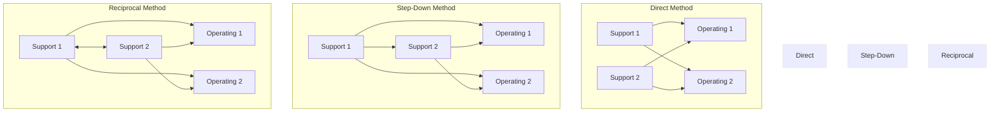

# Allocation of Support-Department Costs, Common Costs, and Revenues

> [!abstract] Curriculum & Syllabus Context
>
> - **Course:** ACC 304 Cost Accounting I
> - **Step:** Step 6: Allocation of Support Department Overheads
> - **Target Reading:** Datar & Rajan, *Horngren's Cost Accounting*, 17th/18th Edition — **Chapter 16: Allocation of Support-Department Costs, Common Costs, and Revenues**
> - **Syllabus Focus:** Operating vs. support departments; primary vs. secondary allocation; BCAS 5 & BCAS 6 standards; single-rate vs. dual-rate allocation methods (budgeted vs. actual rates/usage); direct method, step-down (sequential) method, and reciprocal method (simultaneous equations and repeated iterations); common cost allocation (stand-alone, incremental, Shapley value); and bundled revenue allocation.

---

### 1. Foundations of Support Department Cost Allocation & Primary/Secondary Allocation
In manufacturing and service organizations, departments are broadly categorized into two structural categories based on their role in the value-creation process:

> [!info] Key Definition
>
> 1. **Operating (Production) Departments:** Departments that directly add value to a product or service during its manufacturing or transformation phase. Examples include **Machining**, **Assembly**, **Sub-Assembly**, **Finishing**, and **Surgical Operating Rooms**.
> 2. **Support (Service) Departments:** Departments that provide essential auxiliary services to assist operating departments and other support departments. They do not work directly on final products or services. Examples include **Plant Administration**, **Materials Management**, **Engineering & Production Control**, **Maintenance**, **Information Technology (IT)**, **Human Resources (HR)**, and **Factory Cafeteria**.

---
#### Primary Allocation vs. Secondary Allocation
The allocation of manufacturing overhead (MOH) occurs in two distinct accounting stages:

> [!info] Key Definition
>
> * **Primary Allocation:** Overhead costs incurred across the enterprise are accumulated and initially assigned/traced to individual departments—both operating and support departments—based on primary drivers (e.g., floor space for factory rent/depreciation, headcount for HR/canteen, metered kilowatt-hours for power).
> * **Secondary Allocation:** The total accumulated overhead costs of support departments are reallocated to operating departments. Because support departments exist to serve production, their costs must be absorbed by operating departments before they can ultimately be applied to final cost objects (jobs, batches, or products) using departmental predetermined overhead rates.

> [!quote] Formula & Derivation
>
> $$ \text{Total Operating Dept Overhead} = \text{Direct Departmental Overhead} + \text{Allocated Support Department Overhead} $$
> $$ \text{Departmental Overhead Rate} = \frac{\text{Total Operating Dept Overhead}}{\text{Budgeted Base of Operating Dept (e.g., Machine Hours)}} $$

---
#### Guidelines & Criteria for Cost Allocation
Management accountants rely on four primary criteria to guide the selection of allocation bases and cost pools:
1. **Cause and Effect:** Variables that physically drive resource consumption are chosen as allocation bases (e.g., machine-hours for maintenance, power usage in kWh). This is the most credible and conceptually sound criterion.
2. **Benefits Received:** Costs are allocated in proportion to the output or benefit derived by user departments (e.g., corporate advertising allocated based on division revenue).
3. **Fairness or Equity:** Used extensively in government and cost-plus contracts to establish a "reasonable" price acceptable to contracting parties.
4. **Ability to Bear:** Costs are allocated in proportion to a subunit's profitability or revenue level. This criterion is economically flawed because it subsidizes inefficient/unprofitable units at the expense of profitable ones.

---
#### National Accounting Standards Framework: BCAS 5 & BCAS 6
> [!warning] Exam Pitfall / Exception
>
> **Under Bangladesh Cost Accounting Standards (BCAS):**
> * **BCAS 5 (Indirect Cost Rate):** Mandates standard criteria for grouping indirect costs into homogeneous cost pools and setting predetermined indirect cost rates based on normal or practical capacity rather than short-run actual volume, preventing unit cost volatility.
> * **BCAS 6 (Support Department Cost):** Regulates the identification, accumulation, and systematic secondary allocation of support department costs. It mandates that support department overheads be allocated based on causal relationships (cause-and-effect) and requires explicit recognition of inter-support department services where material.

---
### 2. Single-Rate vs. Dual-Rate Allocation Methods
When allocating support department costs to operating divisions, managers must decide whether to pool fixed and variable costs together or separate them.

---
#### Single-Rate Allocation Method
The **Single-Rate Method** pools all support department costs (variable and fixed) into a single cost pool and allocates them using a single rate per unit of an allocation base.

> [!quote] Formula & Derivation
>
> **Combined Allocation Rate Formula:**
> $$ \text{Single-Rate} = \frac{\text{Total Budgeted Variable Costs} + \text{Total Budgeted Fixed Costs}}{\text{Total Budgeted Quantity of Allocation Base}} $$
> $$ \text{Allocated Cost to User Dept} = \text{Single-Rate} \times \text{Actual Usage of Base by User Dept} $$

* **Advantage:** Less costly to implement; requires less detailed accounting data.
* **Disadvantage (Economic Distortion):** Fixed costs appear as variable costs to operating department managers. If an outside vendor offers a service at a price higher than the support department's variable cost but lower than the combined single rate, an operating manager might outsource the service. This creates a suboptimal decision for the firm as a whole because the internal fixed costs remain unchanged in the short run.

---
#### Dual-Rate Allocation Method
The **Dual-Rate Method** partitions support department costs into two separate pools: a **Variable-Cost Pool** and a **Fixed-Cost Pool**. Each pool uses a different allocation base and rate structure.

> [!quote] Formula & Derivation
>
> * **Variable Cost Allocation:** Allocated based on the **budgeted variable rate** multiplied by **actual usage** by the operating department.
> $$ \text{Variable Allocation Rate} = \frac{\text{Budgeted Variable Costs}}{\text{Budgeted Usage (or Capacity)}} $$
> $$ \text{Allocated Variable Cost} = \text{Variable Allocation Rate} \times \text{Actual Usage} $$
> * **Fixed Cost Allocation:** Allocated as a predetermined lump-sum based on the **budgeted fixed rate** multiplied by **budgeted long-run usage** (or practical capacity).
> $$ \text{Fixed Allocation Rate} = \frac{\text{Budgeted Fixed Costs}}{\text{Budgeted Long-Run Usage (or Practical Capacity)}} $$
> $$ \text{Allocated Fixed Cost} = \text{Fixed Allocation Rate} \times \text{Budgeted Usage (or Capacity Allocation Share)} $$

* **Advantage:** Guides managers toward goal-congruent short-run and long-run decisions. Operating managers see variable costs as variable and fixed costs as fixed lump-sum commitments, preventing artificial outsourcing signals.
* **Disadvantage:** Requires separating fixed and variable costs; managers may have an incentive to underestimate budgeted long-run usage to lower their allocated share of fixed costs.

---
#### Allocation Bases: Budgeted vs. Actual Rates and Usage

| Base Configuration | Operating Department Impact & Incentives |
| :--- | :--- |
| **Budgeted Rate vs. Actual Rate** | Using **budgeted rates** insulates user departments from cost variances/inefficiencies in the support department. The support department absorbs its own efficiency variances. Using **actual rates** creates uncertainty for user departments. |
| **Budgeted Usage vs. Actual Usage for Fixed Costs** | Allocating fixed costs on **actual usage** causes one department's cost share to fluctuate based on the activity level of *other* departments (interdependence risk). Allocating on **budgeted usage** or **practical capacity** provides cost predictability and highlights unused capacity. |

---
### 3. Allocation of Multiple Support Departments (Secondary Allocation)
When multiple support departments serve operating departments *and each other* (reciprocal or interdepartmental support), secondary allocation must account for these mutual service flows.

---

> [!info] Key Definition
>
> #### 1. Direct Method
> Allocates each support department's budgeted costs **directly to operating departments only**. Inter-support department services are completely ignored.
> * **Advantage:** Simple and easy to calculate.
> * **Disadvantage:** Mathematically imprecise; ignores inter-service support.

> [!quote] Formula & Derivation
>
> $$ \text{Allocation Share to } O_1 = \frac{\text{Usage of } S_1 \text{ by } O_1}{\text{Usage of } S_1 \text{ by } O_1 + \text{Usage of } S_1 \text{ by } O_2} $$

---

> [!info] Key Definition
>
> #### 2. Step-Down (Sequential) Method
> Allocates support department costs in a **sequential step-down chain**. Once a support department's costs are allocated, no subsequent support department's costs are allocated back to it.
> * **Sequencing Rule:** Allocate first the support department that provides the **greatest percentage/amount of services to other support departments**.
> * **Advantage:** Partially recognizes mutual interdepartmental services.
> * **Disadvantage:** Unidirectional; does not fully reflect two-way reciprocal relationships.

---

> [!info] Key Definition
>
> #### 3. Reciprocal Method
> Fully incorporates all mutual interdepartmental relationships using simultaneous linear equations or repeated iterations.
> * **Complete Reciprocated Cost Significance:** The complete reciprocated cost reflects the true total economic resource usage of a support department. This figure is critical for outsourcing decisions: a company should compare external vendor bids against the complete reciprocated cost per unit of service, not just the direct unallocated departmental cost.

> [!quote] Formula & Derivation
>
> **Linear Equation Formulation:**
> For support departments $S_1$ and $S_2$:
> $$ S_1 = \text{Own Budgeted Costs} + (\% \text{ of } S_2 \text{ used by } S_1) \times S_2 $$
> $$ S_2 = \text{Own Budgeted Costs} + (\% \text{ of } S_1 \text{ used by } S_2) \times S_1 $$
> Where $S_1$ and $S_2$ represent the **Complete Reciprocated Costs** (or **Artificial Costs**) of each department.

---
### 4. Common Cost Allocation & Bundled Revenue Allocation
#### Common Cost Allocation
A **Common Cost** occurs when a single facility, resource, or activity is shared by two or more independent users.

> [!quote] Formula & Derivation
>
> 1. **Stand-Alone Cost-Allocation Method:** Uses information from each user as a standalone entity to establish proportional allocation weights.
> $$ \text{Weight}_A = \frac{\text{Stand-Alone Cost}_A}{\text{Stand-Alone Cost}_A + \text{Stand-Alone Cost}_B} $$
> $$ \text{Allocated Cost}_A = \text{Weight}_A \times \text{Total Common Cost} $$
> 2. **Incremental Cost-Allocation Method:** Ranks users sequentially. The primary user is allocated costs up to its standalone cost. The first incremental user is allocated the additional cost created by its addition, and so forth.
> 3. **Shapley Value Method:** A game-theoretic solution that averages the incremental costs allocated to each user across all possible arrival sequences.

---
#### Bundled Revenue Allocation
A **Bundled Product** consists of two or more distinct products/services sold together for a single package price.

> [!quote] Formula & Derivation
>
> 1. **Stand-Alone Revenue Allocation Method:** Allocates package revenue using individual standalone prices, unit costs, or physical units as weights:
> $$ \text{Allocated Revenue}_A = \left( \frac{\text{Standalone Price}_A}{\text{Standalone Price}_A + \text{Standalone Price}_B} \right) \times \text{Bundled Price} $$
> 2. **Incremental Revenue Allocation Method:** Ranks products in the bundle as primary, first-incremental, etc. The primary product receives 100% of its standalone price; remaining revenue is assigned sequentially.
> 3. **Shapley Value Method:** Calculates the average revenue allocated to each product across all ranking permutations.

---
### 5. Comprehensive Numerical Walkthroughs

---

> [!example] Numerical Problem
>
> #### Problem 1: Single-Rate vs. Dual-Rate Support Department Allocation
> **Scenario (Robinson Company Context):**
> Robinson Company operates a Materials Management Support Department ($S_1$) serving two operating departments: Machining ($O_1$) and Assembly ($O_2$).
> * **Practical Capacity:** $4,000$ hours.
> * **Budgeted Fixed Costs:** $\$144,000$ (in the relevant range of $3,000$ to $4,000$ hours).
> * **Budgeted Variable Rate:** $\$30$ per materials-handling hour.
> * **Budgeted Usage:** Machining = $800$ hours; Assembly = $2,800$ hours; Total Budgeted = $3,600$ hours.
> * **Actual Usage:** Machining = $1,200$ hours; Assembly = $2,400$ hours; Total Actual = $3,600$ hours.
> **Requirements:** Calculate allocations under Single-Rate (Budgeted Usage), Dual-Rate (Budgeted Usage), and Dual-Rate (Practical Capacity).

##### Part A: Single-Rate Method (Based on Budgeted Usage Demand Base)
1. **Calculate Combined Budgeted Rate:**
   $$ \text{Budgeted Total Cost} = \$144,000 + (3,600 \text{ hrs} \times \$30/\text{hr}) = \$144,000 + \$108,000 = \$252,000 $$
   $$ \text{Single Rate} = \frac{\$252,000}{3,600 \text{ budgeted hours}} = \$70 \text{ per hour} $$
2. **Allocate to Operating Departments (Based on Actual Hours):**
   * **Machining ($O_1$):** $1,200 \text{ actual hrs} \times \$70/\text{hr} = \$84,000$
   * **Assembly ($O_2$):** $2,400 \text{ actual hrs} \times \$70/\text{hr} = \$168,000$
   * **Total Allocated:** $\$84,000 + \$168,000 = \$252,000$.

---
##### Part B: Dual-Rate Method (Budgeted Rate & Budgeted Fixed Usage)
1. **Determine Rates:**
   * Variable Rate = $\$30$ per actual hour.
   * Fixed Rate = $\frac{\$144,000}{3,600 \text{ budgeted hrs}} = \$40$ per budgeted hour.
2. **Calculate Allocation:**
   * **Machining ($O_1$):**
     * Fixed Costs Allocated = $800 \text{ budgeted hrs} \times \$40/\text{hr} = \$32,000$
     * Variable Costs Allocated = $1,200 \text{ actual hrs} \times \$30/\text{hr} = \$36,000$
     * **Total Machining Allocation:** $\$32,000 + \$36,000 = \$68,000$
   * **Assembly ($O_2$):**
     * Fixed Costs Allocated = $2,800 \text{ budgeted hrs} \times \$40/\text{hr} = \$112,000$
     * Variable Costs Allocated = $2,400 \text{ actual hrs} \times \$30/\text{hr} = \$72,000$
     * **Total Assembly Allocation:** $\$112,000 + \$72,000 = \$184,000$
   * **Total Dual-Rate Allocated:** $\$68,000 + \$184,000 = \$252,000$.

---
##### Part C: Practical Capacity Base Allocation ($4,000$ Hours)
1. **Determine Capacity Rates:**
   * Fixed Capacity Rate = $\frac{\$144,000}{4,000 \text{ hrs}} = \$36$ per hour.
   * Variable Rate = $\$30$ per hour.
   * Single Capacity Rate = $\$36 + \$30 = \$66$ per hour.
2. **Dual-Rate Allocation under Practical Capacity:**
   * **Machining ($O_1$):**
     * Fixed: $800 \text{ budgeted hrs} \times \$36 = \$28,800$
     * Variable: $1,200 \text{ actual hrs} \times \$30 = \$36,000$
     * **Total Machining:** $\$28,800 + \$36,000 = \$64,800$.
   * **Assembly ($O_2$):**
     * Fixed: $2,800 \text{ budgeted hrs} \times \$36 = \$100,800$
     * Variable: $2,400 \text{ actual hrs} \times \$30 = \$72,000$
     * **Total Assembly:** $\$100,800 + \$72,000 = \$172,800$.
   * **Unallocated Cost of Unused Capacity:**
     $$ \text{Unused Hours} = 4,000 - (800 + 2,800) = 400 \text{ hours} $$
     $$ \text{Unused Capacity Cost} = 400 \text{ hrs} \times \$36/\text{hr} = \$14,400 \quad \text{(Expensed to Period Income Statement)} $$
   * **Total Department Reconciliation:** $\$64,800 + \$172,800 + \$14,400 = \$252,000$.

---

> [!example] Numerical Problem
>
> #### Problem 2: Secondary Allocation of Multiple Support Departments
> **Scenario (Robinson Company Overview):**
> Robinson Company has two support departments and two operating departments:
> * **Support Departments:**
>   * $S_1$: Engineering & Production Control (Budgeted Overhead = $\$300,000$)
>   * $S_2$: Materials Management (Budgeted Overhead = $\$264,000$)
> * **Operating Departments:**
>   * $O_1$: Machining Department (Direct Overhead = $\$329,000$; Budgeted Base = $10,000$ machine-hours)
>   * $O_2$: Assembly Department (Direct Overhead = $\$227,000$; Budgeted Base = $20,000$ direct labor-hours)
> * **Total Plant Overhead:** $\$1,120,000$.
> **Interdepartmental Service Matrix:**
> | Supplying Department | $S_1$ (Engineering) | $S_2$ (Materials) | $O_1$ (Machining) | $O_2$ (Assembly) | Total |
> | :--- | :---: | :---: | :---: | :---: | :---: |
> | **$S_1$ (Engineering Salaries Base)** | — | $\$36,000$ ($30\%$) | $\$60,000$ ($50\%$) | $\$24,000$ ($20\%$) | $\$120,000$ ($100\%$) |
> | **$S_2$ (Material-Handling Hours Base)** | $400$ hrs ($10\%$) | — | $800$ hrs ($20\%$) | $2,800$ hrs ($70\%$) | $4,000$ hrs ($100\%$) |

---
##### Part A: Direct Method Allocation
Under the direct method, inter-support department services are ignored. Proportions are computed using operating department usage only:
* **Engineering ($S_1$) Allocation Base:** Machining ($\$60,000$) + Assembly ($\$24,000$) = $\$84,000$.
  * Machining Share = $\frac{60,000}{84,000} = \frac{5}{7}$
  * Assembly Share = $\frac{24,000}{84,000} = \frac{2}{7}$.
* **Materials ($S_2$) Allocation Base:** Machining ($800$ hrs) + Assembly ($2,800$ hrs) = $3,600$ hrs.
  * Machining Share = $\frac{800}{3,600} = \frac{2}{9}$
  * Assembly Share = $\frac{2,800}{3,600} = \frac{7}{9}$.

**Calculations:**
1. **Allocate $S_1$ ($\$300,000$):**
   * To Machining ($O_1$): $\$300,000 \times \frac{5}{7} = \$214,286$
   * To Assembly ($O_2$): $\$300,000 \times \frac{2}{7} = \$85,714$.
2. **Allocate $S_2$ ($\$264,000$):**
   * To Machining ($O_1$): $\$264,000 \times \frac{2}{9} = \$58,667$
   * To Assembly ($O_2$): $\$264,000 \times \frac{7}{9} = \$205,333$.

**Summary Table (Direct Method):**

| Department | $S_1$ (Engg) | $S_2$ (Mat) | $O_1$ (Machining) | $O_2$ (Assembly) | Total |
| :--- | :---: | :---: | :---: | :---: | :---: |
| Direct Overhead | $\$300,000$ | $\$264,000$ | $\$329,000$ | $\$227,000$ | $\$1,120,000$ |
| Allocate $S_1$ | $(\$300,000)$ | — | $\$214,286$ | $\$85,714$ | $\$0$ |
| Allocate $S_2$ | — | $(\$264,000)$ | $\$58,667$ | $\$205,333$ | $\$0$ |
| **Total Final Overhead** | **$\$0$** | **$\$0$** | **$\$601,953$** | **$\$518,047$** | **$\$1,120,000$** |

**Predetermined Overhead Rates (Direct Method):**
* **Machining Rate:** $\frac{\$601,953}{10,000 \text{ MH}} = \$60.20 \text{ per machine-hour}$
* **Assembly Rate:** $\frac{\$518,047}{20,000 \text{ DLH}} = \$25.90 \text{ per direct labor-hour}$.

---
##### Part B: Step-Down (Sequential) Method
Sequence: Allocate $S_1$ (Engineering) first because it provides $30\%$ of its service to $S_2$, whereas $S_2$ provides only $10\%$ to $S_1$.
1. **Step 1: Allocate $S_1$ ($\$300,000$) across $S_2, O_1, O_2$ (Base = $\$120,000$):**
   * Share to $S_2$ (Materials): $30\% \times \$300,000 = \$90,000$
   * Share to $O_1$ (Machining): $50\% \times \$300,000 = \$150,000$
   * Share to $O_2$ (Assembly): $20\% \times \$300,000 = \$60,000$.
2. **Step 2: Re-accumulate $S_2$ Total Costs:**
   $$ \text{New } S_2 \text{ Total} = \$264,000 + \$90,000 = \$354,000 $$
3. **Step 3: Allocate New $S_2$ Total ($\$354,000$) to Operating Departments Only ($O_1, O_2$):**
   * Allocation Base = Machining ($800$ hrs) + Assembly ($2,800$ hrs) = $3,600$ hrs.
   * Share to $O_1$ (Machining): $\$354,000 \times \frac{800}{3,600} = \$78,667$
   * Share to $O_2$ (Assembly): $\$354,000 \times \frac{2,800}{3,600} = \$275,333$.

**Summary Table (Step-Down Method):**

| Department | $S_1$ (Engg) | $S_2$ (Mat) | $O_1$ (Machining) | $O_2$ (Assembly) | Total |
| :--- | :---: | :---: | :---: | :---: | :---: |
| Direct Overhead | $\$300,000$ | $\$264,000$ | $\$329,000$ | $\$227,000$ | $\$1,120,000$ |
| Allocate $S_1$ | $(\$300,000)$ | $\$90,000$ | $\$150,000$ | $\$60,000$ | $\$0$ |
| Subtotal | $\$0$ | $\$354,000$ | — | — | — |
| Allocate $S_2$ | — | $(\$354,000)$ | $\$78,667$ | $\$275,333$ | $\$0$ |
| **Total Final Overhead** | **$\$0$** | **$\$0$** | **$\$557,667$** | **$\$562,333$** | **$\$1,120,000$** |

**Predetermined Overhead Rates (Step-Down Method):**
* **Machining Rate:** $\frac{\$557,667}{10,000 \text{ MH}} = \$55.77 \text{ per machine-hour}$
* **Assembly Rate:** $\frac{\$562,333}{20,000 \text{ DLH}} = \$28.12 \text{ per direct labor-hour}$.

---
##### Part C: Reciprocal Method (Linear Equations)
1. **Formulate Simultaneous Linear Equations:**
   $$ S_1 = 300,000 + 0.10 S_2 \quad \text{--- (Equation 1)} $$
   $$ S_2 = 264,000 + 0.30 S_1 \quad \text{--- (Equation 2)} $$
2. **Solve for Complete Reciprocated Costs ($S_1$ and $S_2$):**
   Substitute Equation 1 into Equation 2:
   $$ S_2 = 264,000 + 0.30(300,000 + 0.10 S_2) $$
   $$ S_2 = 264,000 + 90,000 + 0.03 S_2 $$
   $$ 0.97 S_2 = 354,000 \implies S_2 = \frac{354,000}{0.97} = \$364,948.45 \approx \$364,949 $$

   Substitute $S_2$ back into Equation 1:
   $$ S_1 = 300,000 + 0.10(364,948.45) = 300,000 + 36,494.85 = \$336,494.85 \approx \$336,495 $$
3. **Allocate Complete Reciprocated Costs to All Departments:**
   * **Allocate $S_1$ ($\$336,495$):**
     * To $S_2$ (Materials): $30\% \times \$336,495 = \$100,949$
     * To $O_1$ (Machining): $50\% \times \$336,495 = \$168,247$
     * To $O_2$ (Assembly): $20\% \times \$336,495 = \$67,299$.
   * **Allocate $S_2$ ($\$364,949$):**
     * To $S_1$ (Engineering): $10\% \times \$364,949 = \$36,495$
     * To $O_1$ (Machining): $20\% \times \$364,949 = \$72,990$
     * To $O_2$ (Assembly): $70\% \times \$364,949 = \$255,464$.

**Summary Table (Reciprocal Method):**

| Department | $S_1$ (Engg) | $S_2$ (Mat) | $O_1$ (Machining) | $O_2$ (Assembly) | Total |
| :--- | :---: | :---: | :---: | :---: | :---: |
| Direct Overhead | $\$300,000$ | $\$264,000$ | $\$329,000$ | $\$227,000$ | $\$1,120,000$ |
| Allocate $S_1$ ($\$336,495$) | $(\$336,495)$ | $\$100,949$ | $\$168,247$ | $\$67,299$ | $\$0$ |
| Allocate $S_2$ ($\$364,949$) | $\$36,495$ | $(\$364,949)$ | $\$72,990$ | $\$255,464$ | $\$0$ |
| **Total Final Overhead** | **$\$0$** | **$\$0$** | **$\$549,763$** | **$\$570,237$** | **$\$1,120,000$** |

**Predetermined Overhead Rates (Reciprocal Method):**
* **Machining Rate:** $\frac{\$549,763}{10,000 \text{ MH}} = \$54.98 \approx \$57.02 \text{ per machine-hour}$
* **Assembly Rate:** $\frac{\$570,237}{20,000 \text{ DLH}} = \$28.51 \approx \$27.49 \text{ per direct labor-hour}$.

---
##### Part D: Reciprocal Method via Repeated Iterations
$$
\begin{aligned}
\text{Initial Budgeted Costs:} \quad & S_1 = \$300,000, \quad S_2 = \$264,000 \\[6pt]
\mathbf{\text{Iteration 1:}} \quad & \text{Allocate } S_1 \text{ (\$300,000): } \to S_2 = \$90,000, \quad O_1 = \$150,000, \quad O_2 = \$60,000 \\
& \text{New } S_2 \text{ balance} = \$264,000 + \$90,000 = \$354,000 \\
& \text{Allocate } S_2 \text{ (\$354,000): } \to S_1 = \$35,400, \quad O_1 = \$70,800, \quad O_2 = \$247,800 \\[6pt]
\mathbf{\text{Iteration 2:}} \quad & \text{Allocate } S_1 \text{ (\$35,400): } \to S_2 = \$10,620, \quad O_1 = \$17,700, \quad O_2 = \$7,080 \\
& \text{Allocate } S_2 \text{ (\$10,620): } \to S_1 = \$1,062, \quad O_1 = \$2,124, \quad O_2 = \$7,434 \\[6pt]
\mathbf{\text{Iteration 3:}} \quad & \text{Allocate } S_1 \text{ (\$1,062): } \to S_2 = \$319, \quad O_1 = \$531, \quad O_2 = \$212 \\
& \text{Allocate } S_2 \text{ (\$319): } \to S_1 = \$32, \quad O_1 = \$63, \quad O_2 = \$224 \\[6pt]
\mathbf{\text{Iteration 4:}} \quad & \text{Allocate } S_1 \text{ (\$32): } \to S_2 = \$10, \quad O_1 = \$16, \quad O_2 = \$10 \\
& \text{Allocate } S_2 \text{ (\$10): } \to S_1 = \$1, \quad O_1 = \$2, \quad O_2 = \$7 \\[6pt]
\mathbf{\text{Iteration 5:}} \quad & \text{Allocate } S_1 \text{ (\$1): } \to O_1 = \$1, \quad O_2 = \$0 \quad \text{(Final Convergence)}
\end{aligned}
$$

**Cumulative Allocated Totals:**
* Total $S_1$ allocated across iterations $= \$300,000 + \$35,400 + \$1,062 + \$32 + \$1 = \$336,495$.
* Total $S_2$ allocated across iterations $= \$354,000 + \$10,620 + \$319 + \$10 = \$364,949$.
* **Final Machining ($O_1$) Total:** $\$329,000 + \$150,000 + \$70,800 + \$17,700 + \$2,124 + \$531 + \$63 + \$16 + \$2 + \$1 = \$549,763$.
* **Final Assembly ($O_2$) Total:** $\$227,000 + \$60,000 + \$247,800 + \$7,080 + \$7,434 + \$212 + \$224 + \$10 + \$7 = \$570,237$.

---
##### Part E: Job Cost Application for Job WPP 298
Job WPP 298 requires:
* Direct Materials = $\$4,606$
* Direct Manufacturing Labor = $\$1,579$
* Actual Activity Base Used: Machining = $40$ Machine-Hours; Assembly = $55$ Direct Labor-Hours.

$$ \begin{array}{lr}
\hline
\textbf{Job WPP 298 Cost Accumulation (Reciprocal Method Rates)} & \textbf{Cost (\$)} \\
\hline
\text{Direct Materials} & \$4,606 \\
\text{Direct Manufacturing Labor} & 1,579 \\
\textbf{Manufacturing Overhead Allocated:} & \\
\quad \text{Machining Dept } (40\text{ MH} \times \$57.02/\text{MH}) & 2,281 \\
\quad \text{Assembly Dept } (55\text{ DLH} \times \$27.49/\text{DLH}) & 1,512 \\
\hline \hline
\textbf{Total Manufacturing Cost of Job WPP 298} & \mathbf{\$9,978} \\
\hline
\end{array} $$

---
### Comparative Method Matrix

| Dimension | Direct Method | Step-Down Method | Reciprocal Method |
| :--- | :--- | :--- | :--- |
| **Inter-Service Recognition** | None ($0\%$) | Partial (One-direction) | Full ($100\%$ Two-way) |
| **Computational Complexity** | Lowest | Moderate | Highest (Linear Algebra / Iterations) |
| **Outsourcing Decision Accuracy** | Poor (distorts cost) | Incomplete | Excellent (reflects complete reciprocated cost) |
| **Regulatory Compliance** | Allowed in basic reporting | Preferred by Medicare / US Federal Grants | Conceptually preferred under GAAP / BCAS 6 |
