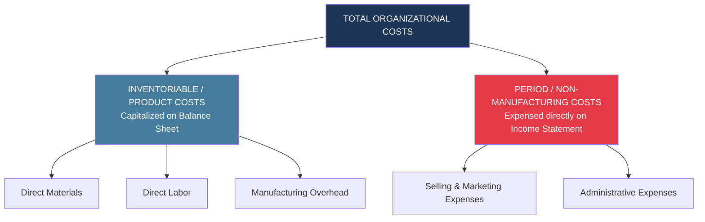
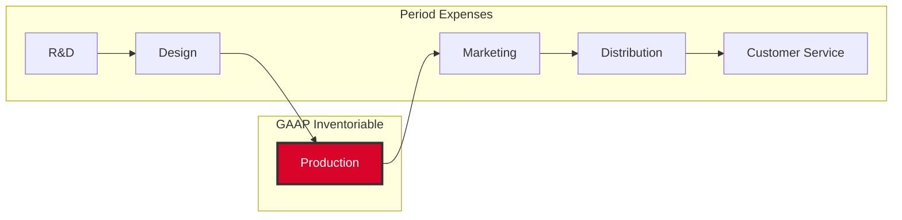
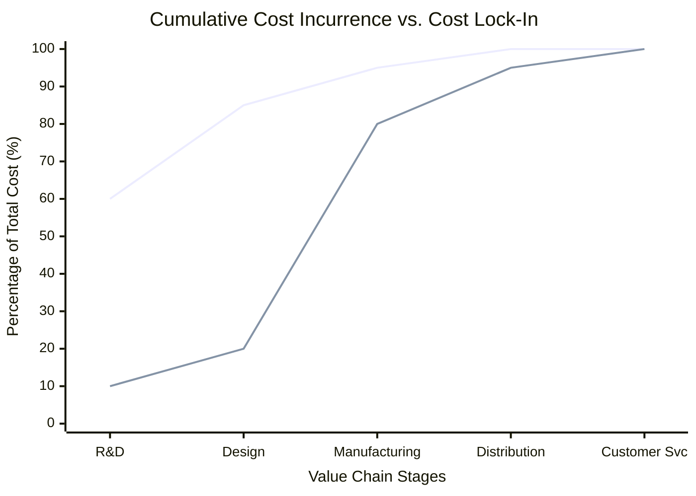
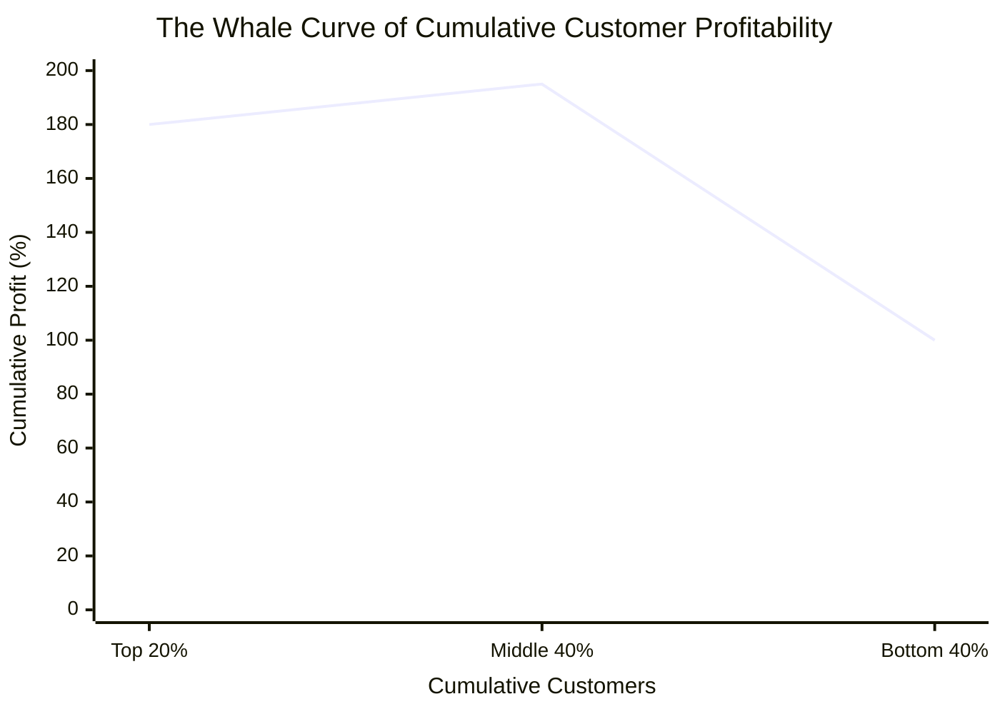
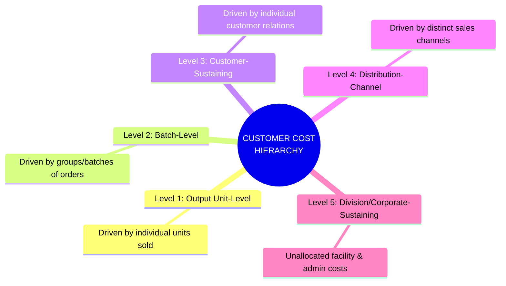

# Non-Manufacturing Overheads: Selling and Administrative

> [!abstract] Curriculum & Syllabus Context
>
> - **Course:** ACC 304 Cost Accounting I
> - **Step:** Step 7: Non-Manufacturing Overheads (Selling and Administrative)
> - **Target Reading:** Datar & Rajan, *Horngren's Cost Accounting*, 17th/18th Edition — **Chapters 14 & 15** (Pricing Decisions, Cost Management, and Customer Profitability)
> - **Syllabus Focus:** Inventoriable vs. non-manufacturing period costs under IAS 2; full product costs across the six value-chain functions; target costing and value engineering; cost incurrence vs. locked-in (designed-in) costs; customer profitability analysis and the Whale Curve; five-level customer cost hierarchy; cost-hierarchy-based operating income statements vs. fully allocated statements; and four criteria for overhead allocation.

---

### Syllabus Mapping & Learning Scope
- **Syllabus Topic:** Topic 8 (Selling and Administrative Overhead)
- **Primary Source Coverage:** Horngren Chapters 2, 14, & 15; Sadia Islam Taspia Lecture Slides; Course Handouts.
- **Core Focus & Learning Objectives:**
  1. Understand the nature, classification, and financial statement treatment of non-manufacturing (period) costs under GAAP/IFRS (IAS 2).
  2. Analyze full product costs across the complete value chain for long-run pricing and product-mix decisions (Horngren Chapter 14).
  3. Master value engineering, target costing, and the distinction between cost incurrence and locked-in (designed-in) costs.
  4. Perform customer-profitability analysis using a five-level customer-cost hierarchy (Horngren Chapter 15).
  5. Contrast cost-hierarchy-based operating income statements with fully allocated customer profitability statements to avoid arbitrary overhead distortions.
  6. Solve comprehensive numerical problems covering full value-chain product costing, target pricing, customer profitability, and cost-hierarchy reporting.

---
## 1. Nature and Classification of Non-Manufacturing (Period) Costs
### 1.1 Conceptual Foundations & GAAP/IFRS Accounting Treatment
In cost accounting, costs are broadly divided into **inventoriable (product) costs** and **period (non-manufacturing) costs**:

> [!info] Key Definition
>
> - **Inventoriable (Product) Costs:** All costs incurred in acquiring or manufacturing products. For manufacturing firms, these consist of direct materials, direct manufacturing labor, and manufacturing overhead (MOH). Under GAAP and International Accounting Standard 2 (**IAS 2: Inventories**), inventoriable costs are capitalized as assets on the Balance Sheet (in Work-in-Process and Finished Goods inventories) and are expensed on the Income Statement as **Cost of Goods Sold (COGS)** *only when the units are sold*.
> - **Period (Non-Manufacturing) Costs:** All costs in the Income Statement other than COGS. These costs are expensed in the accounting period in which they are incurred because they are presumed to benefit the current period rather than future inventory assets.

Non-manufacturing overheads encompass all business function costs outside the manufacturing line, primarily grouped into **Selling (Marketing & Distribution) Expenses** and **Administrative Expenses**:

$$ \text{Total Non-Manufacturing Overhead} = \text{Selling Costs} + \text{Administrative Costs} $$

---
### 1.2 Categorization of Non-Manufacturing Overheads
#### A. Selling and Marketing Costs
Selling costs include all expenses necessary to secure customer orders and deliver the finished product or service to the customer:
1. **Order-Getting Costs:** Expenses incurred in seeking and securing demand (e.g., advertising campaigns, sales representative salaries, commissions, marketing travel, trade show displays, sample distributions).
2. **Order-Filling (Distribution) Costs:** Expenses incurred in storing, packaging, shipping, and delivering completed goods to buyers (e.g., finished goods warehouse rent, shipping freight-out, outbound logistics, delivery truck depreciation, fuel).
3. **After-Sales Service Costs:** Expenses associated with maintaining customer satisfaction post-sale (e.g., customer service hotlines, warranty repairs, replacement parts, return handling).
#### B. Administrative Costs
Administrative costs include all executive, organizational, legal, financial, human resources, and clerical expenses that support the organization as a whole rather than a specific operational function:
- Executive compensation (CEO, CFO, Board of Directors salaries)
- Corporate headquarters lease, utilities, and building depreciation
- Legal fees, external audit fees, and corporate governance compliance
- Human Resources (HR), Information Technology (IT) infrastructure, and general accounting staff payroll

---
### 1.3 Behavior and Mathematical Structure of Operating Expenses
> [!quote] Formula & Derivation
>
> Like manufacturing overhead, non-manufacturing costs exhibit variable, fixed, and mixed behavior within a relevant range:
> $$ \text{Total Non-Manufacturing Costs } (Y) = F_{\text{non-mfg}} + (V_{\text{non-mfg}} \times X) $$
> Where:
> - $F_{\text{non-mfg}} = \text{Fixed non-manufacturing costs (e.g., corporate lease, fixed executive salaries, base software licenses)}$
> - $V_{\text{non-mfg}} = \text{Variable non-manufacturing cost per driver unit (e.g., sales commission percentage, freight cost per cubic foot)}$
> - $X = \text{Cost driver activity level (e.g., total revenues, units sold, cubic feet shipped, sales orders)}$

#### Comparison of Cost Behavior Patterns:

| Cost Category | Behavior in Total (within Relevant Range) | Behavior Per Unit (within Relevant Range) | Primary Cost Driver |
| :--- | :--- | :--- | :--- |
| **Variable Selling Cost** | Changes in direct proportion to activity | Constant per unit sold | Units sold, Sales revenue ($) |
| **Fixed Selling Cost** | Constant in total regardless of output | Decreases as unit volume increases | Long-run capacity decisions |
| **Variable Admin Cost** | Changes with transactional activity | Constant per transaction/order | Number of invoices, orders processed |
| **Fixed Admin Cost** | Constant in total across relevant range | Decreases as organizational scale grows | Overall corporate scale |

---
### 1.4 Financial Statement Presentation: Marginal vs. Absorption Formats
In financial accounting, period costs are deducted below **Gross Margin**. In managerial accounting (Contribution Margin format), variable period costs are grouped with variable manufacturing costs to compute **Contribution Margin**, while fixed period costs are grouped with fixed manufacturing costs:

> [!quote] Formula & Derivation
>
> #### Comparison of Financial Statement Layouts:
> $$
> \begin{aligned}
> \text{Financial Accounting (Absorption / GAAP):} \quad &\text{Revenues} - \text{COGS (Variable + Fixed Mfg)} = \mathbf{\text{Gross Margin}} \\
> &\mathbf{\text{Gross Margin}} - \text{Operating Expenses (Selling + Admin)} = \mathbf{\text{Operating Income}} \\
> \\
> \text{Managerial Accounting (Variable / CVP):} \quad &\text{Revenues} - \text{Variable Costs (Mfg + Selling + Admin)} = \mathbf{\text{Contribution Margin}} \\
> &\mathbf{\text{Contribution Margin}} - \text{Fixed Costs (Mfg + Selling + Admin)} = \mathbf{\text{Operating Income}}
> \end{aligned}
> $$

---
## 2. Value-Chain Cost Allocation & Long-Run Full Product Costing (Horngren Ch 14)
### 2.1 The Value Chain Framework
While financial reporting restricts product costs strictly to manufacturing costs incurred within the factory fence, strategic decision-making (such as pricing, product design, and customer profitability) requires evaluating costs across all six primary business functions of the **Value Chain**:

1. **Research and Development (R&D):** Generating and experimenting with ideas related to new products, services, or processes.
2. **Design of Products and Processes:** Detailed planning, engineering, and testing of products and manufacturing/service processes.
3. **Production:** Procuring, storing, assembling, and processing raw materials into finished outputs (the only stage included in GAAP inventoriable costs).
4. **Marketing:** Promoting, advertising, and selling products or services to customers.
5. **Distribution:** Processing orders and physically delivering products or services to customers (logistics).
6. **Customer Service:** Providing post-sales support, warranty repairs, and assistance to customers.

---
### 2.2 Product Costs for Different Purposes
The definition of a "product cost" is not uniform; it depends entirely on the purpose for which the cost measurement is required:

| Financial Statements (GAAP/IFRS) | Government Contracts (Cost-Plus) | Pricing & Product-Mix (Strategic Mgmt) |
| :--- | :--- | :--- |
| • Production (Mfg) Costs Only (DM + DL + MOH) | • Production Costs • Design Costs • Approved R&D Portion *(Excludes Marketing & Sales)* | • R&D Costs • Design Costs • Production Costs • Marketing Costs • Distribution Costs • Customer Service Costs |

$$ \text{Full Product Cost} = \text{Cost}_{\text{R\&D}} + \text{Cost}_{\text{Design}} + \text{Cost}_{\text{Production}} + \text{Cost}_{\text{Marketing}} + \text{Cost}_{\text{Distribution}} + \text{Cost}_{\text{Customer Service}} $$

> [!warning] Exam Pitfall / Exception
>
> **Strategic Pricing Trap:** In the long run, an enterprise must set selling prices that cover the **full product cost** across the entire value chain plus an adequate return on investment (ROI). If a firm prices products based solely on manufacturing costs, it risks underpricing items that consume heavy R&D, design, or distribution resources.

---
### 2.3 Value Engineering, Target Costing, and Cost Lock-In
#### A. Value-Added vs. Non-Value-Added Costs
To optimize full product costs, management accountants perform **value engineering**:

> [!info] Key Definition
>
> - **Value-Added Cost:** A cost that, if eliminated, would reduce the actual or perceived usefulness or utility customers gain from using the product or service (e.g., high-grade materials, precision machining, essential performance features).
> - **Non-Value-Added Cost:** A cost that, if eliminated, would not reduce the utility or value experienced by the customer (e.g., storage/warehousing costs, idle machine time, rework labor, inspection delays, scrap).

#### B. Cost Incurrence vs. Locked-In (Designed-In) Costs
A crucial insight in value engineering is the temporal disconnect between **cost incurrence** and **cost lock-in**:
- **Cost Incurrence:** Occurs when a resource is physically consumed or spent (e.g., paying for raw materials during assembly).
- **Locked-In (Designed-In) Costs:** Costs that have not yet been incurred, but will be incurred in the future based on decisions that have already been made in the design and engineering phase.

> [!warning] Exam Pitfall / Exception
>
> Over **80% of a product's full life-cycle cost** is locked in during the R&D and Design phases. Once a product is designed with a specific number of parts, material types, and structural specifications, manufacturing managers can only make minor operational savings. Value engineering must therefore occur *during product design*.

#### C. Target Costing Mechanics
Target costing is a market-driven approach to long-run pricing and cost management:

> [!quote] Formula & Derivation
>
> 1. **Determine Target Price:** Based on customer research and competitor pricing in the marketplace.
> 2. **Determine Target Operating Income Per Unit:** Based on the firm's required Rate of Return on Investment ($\text{Target ROI}$).
>    $$ \text{Target Operating Income Per Unit} = \frac{\text{Target ROI} \times \text{Total Invested Capital}}{\text{Projected Unit Volume}} $$
> 3. **Calculate Target Cost Per Unit:**
>    $$ \text{Target Cost Per Unit} = \text{Target Selling Price} - \text{Target Operating Income Per Unit} $$
> 4. **Value Engineering Gap Analysis:**
>    $$ \text{Cost Reduction Target} = \text{Current Estimated Full Product Cost} - \text{Target Cost Per Unit} $$
>    If the current estimated full cost exceeds the target cost, the cross-functional team must apply value engineering to close the gap before committing to production.

---
## 3. Customer-Level Cost Hierarchy & Customer Profitability Analysis (Horngren Ch 15)
### 3.1 Customer Profitability & The "Whale Curve"
In competitive markets, companies often find that revenue size does not correlate directly with customer profitability. Two customers generating $\$1,000,000$ in gross revenue can yield vastly different operating profits due to:
1. **Price Discounts:** Off-list price reductions granted by eager salespeople.
2. **Demands on Customer-Support Resources (Cost-to-Serve):** Differences in order frequencies, batch sizes, delivery urgency, customized packaging, and post-sale technical support.

> [!info] Key Definition
>
> **The Whale Curve of Cumulative Customer Profitability:**
> - **Top 20% of Customers:** Generate between **150% and 200%** of total operating income.
> - **Middle 60% of Customers:** Approximately break even.
> - **Bottom 20% of Customers:** Destroy **50% to 100%** of total operating income through heavy price discounting and excessive cost-to-serve demands.

---
### 3.2 The Five-Level Customer Cost Hierarchy
To accurately trace non-manufacturing indirect costs to customers, Activity-Based Costing (ABC) categorizes customer-related expenses into a **five-level hierarchy**:

#### Detailed Breakdown of the 5 Levels:
1. **Customer Output Unit-Level Costs:** Costs of activities performed to sell each individual unit of product to a customer.
   - *Cost Drivers:* Units sold, physical weight, cubic feet delivered.
2. **Customer Batch-Level Costs:** Costs of activities related to a group or batch of units sold to a customer.
   - *Cost Drivers:* Number of purchase orders, number of deliveries, number of rush shipments.
3. **Customer-Sustaining Costs:** Costs of activities undertaken to support and retain individual customers, regardless of the number of units or batches purchased.
   - *Cost Drivers:* Number of sales visits, number of customer service calls, display stands provided.
4. **Distribution-Channel Costs:** Costs of activities related to a particular distribution channel rather than to specific customers or batches.
   - *Cost Drivers:* Number of distribution channels (e.g., Wholesale, Retail, E-Commerce, Direct Sales).
5. **Division-Sustaining & Corporate-Sustaining Costs:** Costs of organizational activities that cannot be traced to individual customers or distribution channels in a cause-and-effect manner.
   - *Cost Drivers:* General organizational existence.

---
### 3.3 Four Criteria for Guiding Overhead Allocation Decisions
When assigning indirect non-manufacturing costs down to departments, channels, or customers, management accountants select allocation bases guided by four primary criteria:

| Allocation Criterion | Description & Applicability | Managerial Quality / Preference |
| :--- | :--- | :--- |
| **1. Cause and Effect** | Variables are identified that directly cause resources to be consumed. (Primary criterion in ABC). | **Superior / Most Credible:** Establishes true economic traceability. |
| **2. Benefits Received** | Costs are allocated to beneficiaries in proportion to the benefits gained from the resource. | **High:** Used when cause-and-effect cannot be precisely metered (e.g., brand advertising). |
| **3. Fairness or Equity** | Costs are allocated based on a mutually agreed-upon "fair" ratio or government contract rule. | **Moderate:** Frequently used in cost-plus government contract settlements. |
| **4. Ability to Bear** | Costs are allocated in proportion to the cost object's profitability or revenue size. | **Weak / Least Preferred:** Penalizes high-performing divisions/customers by overloading overhead. |

---
## 4. Reporting Frameworks: Cost-Hierarchy vs. Fully Allocated Income Statements
A central debate in non-manufacturing cost accounting is whether *all* corporate and division-sustaining costs should be allocated down to individual customers.
### 4.1 Framework 1: Cost-Hierarchy-Based Operating Income Statement
This approach **allocates only those costs that have a direct cause-and-effect or benefits-received relationship** at the specific level of the hierarchy. Sustaining costs at higher levels are subtracted as lump-sum amounts at their respective levels without being arbitrarily forced down to lower levels.

> [!quote] Formula & Derivation
>
> #### Structural Layout of Cost-Hierarchy Statement:
> $$
> \begin{aligned}
> &\text{Customer Revenues (Net of Price Discounts)} \\
> - \quad &\text{Cost of Goods Sold (COGS)} \\
> \hline
> = \quad &\mathbf{\text{Gross Margin}} \\
> - \quad &\text{Customer-Level Costs (Unit-Level + Batch-Level + Customer-Sustaining)} \\
> \hline
> = \quad &\mathbf{\text{Customer-Level Operating Income}} \quad \text{(Summed across all customers in a channel)} \\
> - \quad &\text{Distribution-Channel Costs (Channel-Sustaining Costs)} \\
> \hline
> = \quad &\mathbf{\text{Distribution-Channel Operating Income}} \quad \text{(Summed across all channels)} \\
> - \quad &\text{Division-Sustaining Costs (R\&D, Design, Division Admin)} \\
> \hline
> = \quad &\mathbf{\text{Division Operating Income}} \\
> - \quad &\text{Corporate-Sustaining Costs (Corporate HQ Rent, Exec Salaries)} \\
> \hline
> = \quad &\mathbf{\text{Total Corporate Operating Income}}
> \end{aligned}
> $$

> [!warning] Exam Pitfall / Exception
>
> **Strategic Rationale:** Prevents **suboptimal decisions**. If corporate HQ rent ($\$1,000,000$) is arbitrarily allocated to Customer C based on revenue, Customer C may show a net loss. If management drops Customer C, the corporate HQ rent *does not disappear*; it simply gets reallocated to Customers A and B, making them appear less profitable and lowering overall company profit!

---
### 4.2 Framework 2: Fully Allocated Customer Profitability Statement
This approach **allocates 100% of corporate and division costs** down to individual customers using multi-stage allocation keys (e.g., allocating corporate admin based on division costs, and division admin based on customer revenue or ability-to-bear income).
- **Purpose & Strategic Rationale:** Used for **long-run pricing and complete customer valuation**. Ensures that management evaluates whether a customer’s revenue covers not only direct serving costs but also contributes its "fair share" to corporate overhead.

---
## 5. Comprehensive Numerical Walkthroughs & Solutions

---

> [!example] Numerical Problem
>
> ### Walkthrough Problem 1: Full Value-Chain Product Costing, Target Costing, and Life-Cycle Pricing
> *Adapted from Horngren Chapter 14 (Astel Computers / Provalue Example)*
> #### Scenario Setup:
> Apex Tech Corporation manufactures high-performance tablet devices. In 2025, Apex is preparing to launch a new tablet model, the **"Apex Tab-V"**. Projected annual production and sales volume is **100,000 units**. Apex has no beginning or ending inventories.
> The management team requires a comprehensive value-chain cost analysis to establish a long-run selling price and perform target costing.
> #### Value-Chain Activity Data & Cost Drivers for Apex Tab-V:
> 1. **Direct Manufacturing Costs:**
>    - Direct Materials: $1 \text{ component kit per unit}$ @ $\$250 \text{ per kit} = \$250 \text{ per unit}$
>    - Direct Manufacturing Labor: $2 \text{ DML-hours per unit}$ @ $\$25 \text{ per DML-hour} = \$50 \text{ per unit}$
>    - Direct Machining Equipment Lease (Dedicated): $200,000 \text{ machine-hours}$ allocated @ $\$15 \text{ per machine-hour} = \$3,000,000 \text{ total} (\$30 \text{ per unit})$
> 2. **Manufacturing Overhead Cost Pools (ABC):**
>    - **Ordering & Receiving:** 400 total component orders @ $\$120 \text{ per order} = \$48,000 \text{ total}$
>    - **Testing & Quality Inspection:** $200,000 \text{ testing-hours}$ @ $\$3 \text{ per testing-hour} = \$600,000 \text{ total}$
>    - **Rework Costs:** Defect rate is $5\%$ of output ($5,000 \text{ defective units}$). Each defective unit requires $3 \text{ rework-hours}$ @ $\$30 \text{ per rework-hour} = \$90 \text{ per defective unit} \times 5,000 = \$450,000 \text{ total}$
> 3. **Non-Manufacturing Value-Chain Cost Pools:**
>    - **Research & Development (R&D):** Fixed cost = $\$1,200,000$
>    - **Design of Products & Processes:** Fixed cost = $\$800,000$
>    - **Marketing & Advertising:** Variable commission of $\$10 \text{ per unit sold} + \text{Fixed advertising} \text{ of } \$1,500,000 = \$2,500,000 \text{ total}$
>    - **Distribution Logistics:** $20,000 \text{ cubic feet shipped}$ @ $\$45 \text{ per cubic foot} = \$900,000 \text{ total}$
>    - **Customer Service:** $100,000 \text{ units supported}$ @ $\$6 \text{ per unit} = \$600,000 \text{ total}$
> #### Required:
> 4. Calculate the **Total Manufacturing Cost** and **Manufacturing Cost Per Unit** for the Apex Tab-V.
> 5. Calculate the **Full Product Cost** across the entire value chain and the **Full Cost Per Unit**.
> 6. If Apex desires a **$20\%$ markup on the Full Product Cost**, calculate the prospective long-run target selling price per unit.
> 7. **Target Costing Application:** Suppose market research indicates competitors are selling similar tablets for **$420 per unit**. To meet market competition, Apex sets a **Target Price of $420 per unit**. If Apex requires a **target operating income margin of $15\%$ of selling price**, calculate:
>    - Target Operating Income Per Unit
>    - Target Cost Per Unit
>    - The required **Cost Reduction Target (Gap)** that value engineering must eliminate.

#### Step-by-Step Solution:
##### Requirement 1: Manufacturing Cost Analysis (Inventoriable Cost under GAAP)
$$
\begin{aligned}
\text{Direct Materials} &= 100,000 \text{ units} \times \$250 = \$25,000,000 \\
\text{Direct Manufacturing Labor} &= 100,000 \text{ units} \times (2 \text{ hrs} \times \$25) = \$5,000,000 \\
\text{Direct Machining Lease} &= 200,000 \text{ machine-hrs} \times \$15 = \$3,000,000 \\
\hline
\mathbf{\text{Total Direct Manufacturing Costs}} &= \mathbf{\$33,000,000} \quad (\$330.00 \text{ per unit}) \\
\\
\text{MOH: Ordering \& Receiving} &= 400 \text{ orders} \times \$120 = \$48,000 \\
\text{MOH: Testing \& Inspection} &= 200,000 \text{ hrs} \times \$3 = \$600,000 \\
\text{MOH: Rework Costs} &= 5,000 \text{ defective units} \times (3 \text{ hrs} \times \$30) = \$450,000 \\
\hline
\mathbf{\text{Total Manufacturing Overhead Costs}} &= \mathbf{\$1,098,000} \quad (\$10.98 \text{ per unit}) \\
\\
\mathbf{\text{Total Manufacturing Cost}} &= \$33,000,000 + \$1,098,000 = \mathbf{\$34,098,000} \\
\mathbf{\text{Manufacturing Cost Per Unit}} &= \frac{\$34,098,000}{100,000 \text{ units}} = \mathbf{\$340.98 \text{ per unit}}
\end{aligned}
$$

---
##### Requirement 2: Full Value-Chain Product Cost Analysis
$$
\begin{aligned}
\text{Total Manufacturing Costs (Production)} &= \$34,098,000 \\
\text{Research \& Development (R\&D)} &= \$1,200,000 \\
\text{Design of Products \& Processes} &= \$800,000 \\
\text{Marketing \& Advertising} &= (100,000 \times \$10) + \$1,500,000 = \$2,500,000 \\
\text{Distribution Logistics} &= 20,000 \text{ cu. ft.} \times \$45 = \$900,000 \\
\text{Customer Service} &= 100,000 \text{ units} \times \$6 = \$600,000 \\
\hline
\mathbf{\text{Full Product Cost (Total Value Chain)}} &= \mathbf{\$40,098,000} \\
\mathbf{\text{Full Cost Per Unit}} &= \frac{\$40,098,000}{100,000 \text{ units}} = \mathbf{\$400.98 \text{ per unit}}
\end{aligned}
$$

---
##### Requirement 3: Prospective Cost-Plus Target Selling Price
$$ \text{Markup Component} = 20\% \times \$400.98 = \$80.196 \text{ per unit} $$

$$ \mathbf{\text{Target Selling Price}} = \$400.98 + \$80.20 = \mathbf{\$481.18 \text{ per unit}} $$

---
##### Requirement 4: Target Costing & Gap Analysis
1. **Target Operating Income Per Unit:**
$$ \text{Target Operating Income} = 15\% \times \$420.00 = \mathbf{\$63.00 \text{ per unit}} $$
2. **Target Cost Per Unit:**
$$ \text{Target Cost Per Unit} = \text{Target Selling Price} - \text{Target Operating Income} $$
$$ \text{Target Cost Per Unit} = \$420.00 - \$63.00 = \mathbf{\$357.00 \text{ per unit}} $$
3. **Cost Reduction Target (Gap):**
$$ \text{Cost Gap} = \text{Current Full Cost Per Unit} - \text{Target Cost Per Unit} $$
$$ \mathbf{\text{Cost Gap}} = \$400.98 - \$357.00 = \mathbf{\$43.98 \text{ per unit}} \quad (\text{or } \$4,398,000 \text{ in total}) $$

*Management Action:* Value engineering must redesign the product to reduce parts complexity, eliminate non-value-added testing/rework, or negotiate lower component kit prices to cut $\$43.98$ per unit before commercial production begins.

---

> [!example] Numerical Problem
>
> ### Walkthrough Problem 2: Five-Level Customer Cost Hierarchy & Profitability Analysis
> *Adapted from Horngren Chapter 15 (Provalue Wholesale Customer Analysis)*
> #### Scenario Setup:
> Delta Logistics Distributors supplies commercial office equipment to three major corporate client accounts: **Alpha Corp**, **Beta Corp**, and **Gamma Corp**.
> Delta's accounting department tracks non-manufacturing operating expenses using an Activity-Based Costing (ABC) customer cost hierarchy.
> #### Summary Activity & Cost Driver Information for the Period:
> - **Cost of Goods Sold (COGS):** $70\%$ of invoice revenue at list price across all products.
> - **Activity Cost Pool Rates:**
>   1. **Order Processing (Batch-level):** $\$500 \text{ per purchase order}$
>   2. **Customer Sales Visits (Customer-sustaining):** $\$2,000 \text{ per visit}$
>   3. **Regular Freight Shipping (Batch-level):** $\$800 \text{ per regular delivery}$
>   4. **Rush Delivery Surcharges (Batch-level):** $\$3,000 \text{ per rush delivery}$
>   5. **Product Unit Handling (Output unit-level):** $\$5 \text{ per unit sold}$
>   6. **Customer Technical Support (Customer-sustaining):** $\$100 \text{ per support-hour}$
> #### Customer-Specific Operating Data:
> | Operating Parameter | Alpha Corp | Beta Corp | Gamma Corp | Total |
> | :--- | :--- | :--- | :--- | :--- |
> | **Gross Revenues at List Price** | $\$2,000,000$ | $\$1,500,000$ | $\$1,000,000$ | $\$4,500,000$ |
> | **Off-List Price Discount Granted** | $\$200,000 \ (10\%)$ | $\$50,000 \ (3.33\%)$ | $\$250,000 \ (25\%)$ | $\$500,000$ |
> | **Units Purchased** | $10,000 \text{ units}$ | $7,500 \text{ units}$ | $5,000 \text{ units}$ | $22,500 \text{ units}$ |
> | **Number of Purchase Orders** | $40 \text{ orders}$ | $15 \text{ orders}$ | $100 \text{ orders}$ | $155 \text{ orders}$ |
> | **Number of Customer Visits** | $10 \text{ visits}$ | $8 \text{ visits}$ | $25 \text{ visits}$ | $43 \text{ visits}$ |
> | **Regular Deliveries** | $20 \text{ shipments}$ | $10 \text{ shipments}$ | $50 \text{ shipments}$ | $80 \text{ shipments}$ |
> | **Rush Deliveries** | $2 \text{ shipments}$ | $0 \text{ shipments}$ | $12 \text{ shipments}$ | $14 \text{ shipments}$ |
> | **Technical Support Hours** | $50 \text{ hours}$ | $20 \text{ hours}$ | $200 \text{ hours}$ | $270 \text{ hours}$ |
> #### Additional Higher-Level Sustaining Costs:
> - **Wholesale Channel-Sustaining Costs:** $\$150,000$
> - **Division-Sustaining Corporate Administrative Costs:** $\$300,000$
> #### Required:
> 1. Compute the **Net Revenue**, **COGS**, and **Gross Margin** for each customer.
> 2. Calculate the itemized **Customer-Level ABC Costs** for each customer and determine their **Customer-Level Operating Income** and **Operating Margin Percentage**.
> 3. Prepare a **Cost-Hierarchy-Based Operating Income Statement** for Delta Logistics Distributors.
> 4. Conduct a **Whale Curve Analysis** and provide strategic recommendations for managing Gamma Corp.

#### Step-by-Step Solution:
##### Requirement 1 & 2: Itemized Customer Profitability Analysis
$$
\begin{aligned}
\text{Net Revenue}_{\text{Alpha}} &= \$2,000,000 - \$200,000 = \mathbf{\$1,800,000} \\
\text{Net Revenue}_{\text{Beta}} &= \$1,500,000 - \$50,000 = \mathbf{\$1,450,000} \\
\text{Net Revenue}_{\text{Gamma}} &= \$1,000,000 - \$250,000 = \mathbf{\$750,000} \\
\mathbf{\text{Total Net Revenue}} &= \mathbf{\$4,000,000} \\
\\
\text{COGS}_{\text{Alpha}} &= 70\% \times \$2,000,000 = \mathbf{\$1,400,000} \\
\text{COGS}_{\text{Beta}} &= 70\% \times \$1,500,000 = \mathbf{\$1,050,000} \\
\text{COGS}_{\text{Gamma}} &= 70\% \times \$1,000,000 = \mathbf{\$700,000} \\
\mathbf{\text{Total COGS}} &= \mathbf{\$3,150,000}
\end{aligned}
$$
#### Customer Activity Cost Computations:
##### A. Alpha Corp:
- Order Processing: $40 \text{ orders} \times \$500 = \$20,000$
- Customer Visits: $10 \text{ visits} \times \$2,000 = \$20,000$
- Product Handling: $10,000 \text{ units} \times \$5 = \$50,000$
- Regular Deliveries: $20 \text{ shipments} \times \$800 = \$16,000$
- Rush Deliveries: $2 \text{ shipments} \times \$3,000 = \$6,000$
- Technical Support: $50 \text{ hrs} \times \$100 = \$5,000$
- **Total Customer-Level Costs (Alpha):** $\$20,000 + \$20,000 + \$50,000 + \$16,000 + \$6,000 + \$5,000 = \mathbf{\$117,000}$

$$ \text{Customer-Level Operating Income (Alpha)} = \$1,800,000 - \$1,400,000 - \$117,000 = \mathbf{\$283,000} $$
$$ \text{Operating Margin \% (Alpha)} = \frac{\$283,000}{\$1,800,000} = \mathbf{15.72\%} $$

---
##### B. Beta Corp:
- Order Processing: $15 \text{ orders} \times \$500 = \$7,500$
- Customer Visits: $8 \text{ visits} \times \$2,000 = \$16,000$
- Product Handling: $7,500 \text{ units} \times \$5 = \$37,500$
- Regular Deliveries: $10 \text{ shipments} \times \$800 = \$8,000$
- Rush Deliveries: $0 \text{ shipments} \times \$3,000 = \$0$
- Technical Support: $20 \text{ hrs} \times \$100 = \$2,000$
- **Total Customer-Level Costs (Beta):** $\$7,500 + \$16,000 + \$37,500 + \$8,000 + \$0 + \$2,000 = \mathbf{\$71,000}$

$$ \text{Customer-Level Operating Income (Beta)} = \$1,450,000 - \$1,050,000 - \$71,000 = \mathbf{\$329,000} $$
$$ \text{Operating Margin \% (Beta)} = \frac{\$329,000}{\$1,450,000} = \mathbf{22.69\%} $$

---
##### C. Gamma Corp:
- Order Processing: $100 \text{ orders} \times \$500 = \$50,000$
- Customer Visits: $25 \text{ visits} \times \$2,000 = \$50,000$
- Product Handling: $5,000 \text{ units} \times \$5 = \$25,000$
- Regular Deliveries: $50 \text{ shipments} \times \$800 = \$40,000$
- Rush Deliveries: $12 \text{ shipments} \times \$3,000 = \$36,000$
- Technical Support: $200 \text{ hrs} \times \$100 = \$20,000$
- **Total Customer-Level Costs (Gamma):** $\$50,000 + \$50,000 + \$25,000 + \$40,000 + \$36,000 + \$20,000 = \mathbf{\$221,000}$

$$ \text{Customer-Level Operating Income (Gamma)} = \$750,000 - \$700,000 - \$221,000 = \mathbf{-\$171,000} \quad (\text{Operating Loss}) $$
$$ \text{Operating Margin \% (Gamma)} = \frac{-\$171,000}{\$750,000} = \mathbf{-22.80\%} $$

---
##### Summary Statement of Customer Profitability:

| Particulars | Alpha Corp | Beta Corp | Gamma Corp | Total Company |
| :--- | :--- | :--- | :--- | :--- |
| **Gross Revenues at List Price** | $\$2,000,000$ | $\$1,500,000$ | $\$1,000,000$ | $\$4,500,000$ |
| Less: Price Discounts | $(200,000)$ | $(50,000)$ | $(250,000)$ | $(500,000)$ |
| **Net Revenues** | **$\$1,800,000$** | **$\$1,450,000$** | **$\$750,000$** | **$\$4,000,000$** |
| Less: Cost of Goods Sold | $(1,400,000)$ | $(1,050,000)$ | $(700,000)$ | $(3,150,000)$ |
| **Gross Margin** | **$\$400,000$** | **$\$400,000$** | **$\$50,000$** | **$\$850,000$** |
| **Customer-Level Costs:** | | | | |
| Order Processing | $(20,000)$ | $(7,500)$ | $(50,000)$ | $(77,500)$ |
| Customer Visits | $(20,000)$ | $(16,000)$ | $(50,000)$ | $(86,000)$ |
| Product Handling | $(50,000)$ | $(37,500)$ | $(25,000)$ | $(112,500)$ |
| Regular Deliveries | $(16,000)$ | $(8,000)$ | $(40,000)$ | $(64,000)$ |
| Rush Deliveries | $(6,000)$ | $0$ | $(36,000)$ | $(42,000)$ |
| Technical Support | $(5,000)$ | $(2,000)$ | $(20,000)$ | $(27,000)$ |
| **Total Customer-Level Costs** | **$(\$117,000)$** | **$(\$71,000)$** | **$(\$221,000)$** | **$(\$409,000)$** |
| **Customer-Level Operating Income** | **$\$283,000$** | **$\$329,000$** | **$(\$171,000)$** | **$\$441,000$** |
| **Operating Margin %** | **15.72%** | **22.69%** | **-22.80%** | **11.03%** |

---
##### Requirement 3: Cost-Hierarchy-Based Operating Income Statement
$$
\begin{aligned}
\text{Total Customer-Level Operating Income} &= \$441,000 \\
\text{Less: Wholesale Distribution-Channel Costs} &= -\$150,000 \\
\hline
\mathbf{\text{Wholesale Channel Operating Income}} &= \mathbf{\$291,000} \\
\text{Less: Division-Sustaining Corporate Admin Costs} &= -\$300,000 \\
\hline
\mathbf{\text{Total Corporate Net Operating Income (Loss)}} &= \mathbf{-\$9,000}
\end{aligned}
$$

---
##### Requirement 4: Whale Curve & Managerial Recommendations
1. **Whale Curve Analysis:**
   - **Beta Corp** is the most profitable customer ($\$329,000$), followed closely by **Alpha Corp** ($\$283,000$).
   - Combined customer-level profit of Alpha and Beta = $\$283,000 + \$329,000 = \mathbf{\$612,000}$ ($138.8\%$ of total customer-level income).
   - **Gamma Corp** destroys $\mathbf{\$171,000}$ of value, dropping customer-level income from $\$612,000$ down to $\$441,000$.
2. **Strategic Action Plan for Gamma Corp:**
   - **Restrict Price Discounting:** Gamma receives a massive $25\%$ off-list discount despite making small, erratic purchases. Discipline discount rules (e.g., maximum $5\%$ discount unless batch order size exceeds $2,000$ units).
   - **Enforce Minimum Order Sizes:** Gamma places $100$ small purchase orders ($50$ units per order). Imposing a minimum order size of $500$ units will reduce order processing costs from $\$50,000$ to $\$5,000$.
   - **Charge for Rush Deliveries & Tech Support:** Gamma requested $12$ rush deliveries and $200$ tech support hours. Surcharge Gamma directly for rush shipping ($\$3,000/\text{shipment}$) and bill tech support at $\$150/\text{hr}$.
   - **Do NOT Drop Automatically:** Dropping Gamma immediately will lose $\$50,000$ in gross margin. First, attempt to restructure Gamma's purchasing behavior using fee surcharges and discount discipline.

---
## 6. Summary of Key Non-Manufacturing Overhead Formulas
> [!quote] Formula & Derivation
>
> $$
> \begin{aligned}
> \text{Full Product Cost} &= \text{Cost}_{\text{R\&D}} + \text{Cost}_{\text{Design}} + \text{Cost}_{\text{Production}} + \text{Cost}_{\text{Marketing}} + \text{Cost}_{\text{Distribution}} + \text{Cost}_{\text{Customer Service}} \\
> \text{Target Cost Per Unit} &= \text{Target Selling Price} - \text{Target Operating Income Per Unit} \\
> \text{Cost Reduction Target (Gap)} &= \text{Current Estimated Full Cost} - \text{Target Cost Per Unit} \\
> \text{Customer Net Revenue} &= \text{Gross List Revenue} - \text{Price Discounts Granted} \\
> \text{Customer Gross Margin} &= \text{Customer Net Revenue} - \text{COGS} \\
> \text{Customer Operating Income} &= \text{Customer Gross Margin} - \text{Total Customer-Level ABC Costs} \\
> \text{Total Customer ABC Costs} &= \sum (\text{Actual Activity Usage} \times \text{Activity Cost Rate})
> \end{aligned}
> $$
