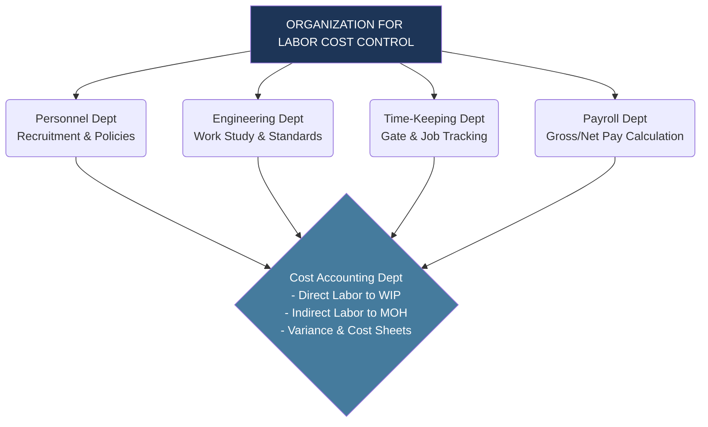
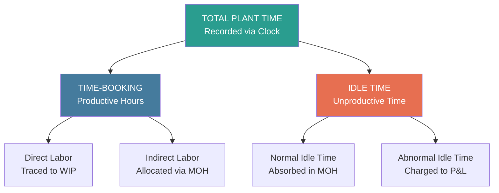
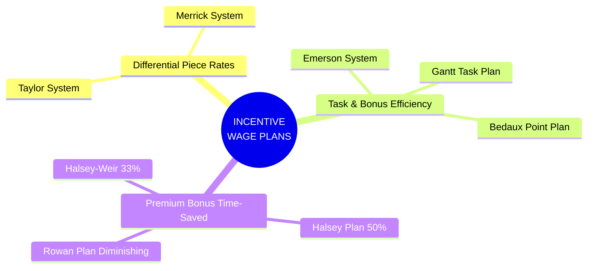
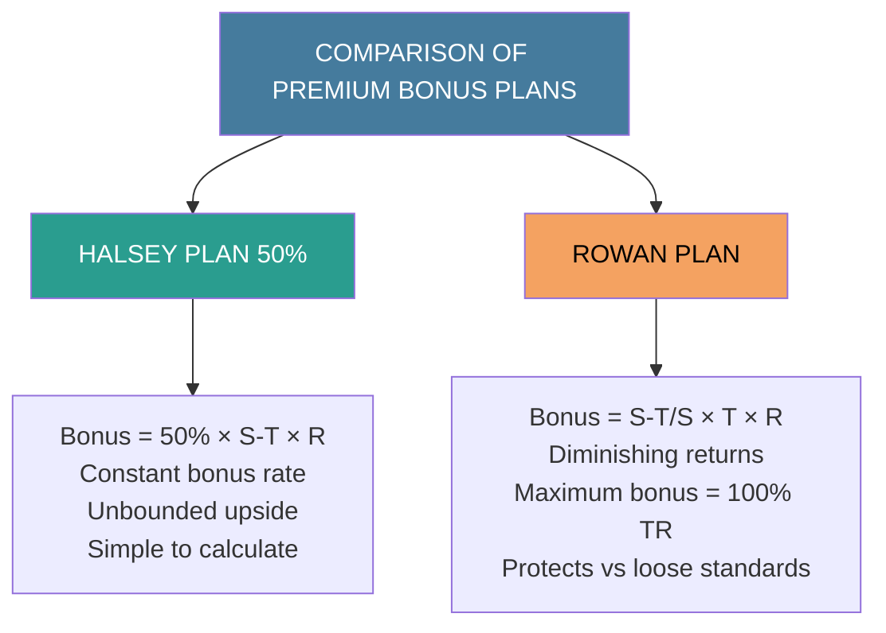
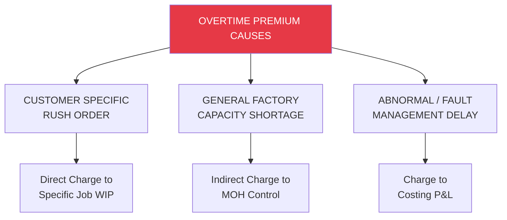
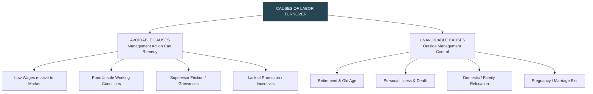
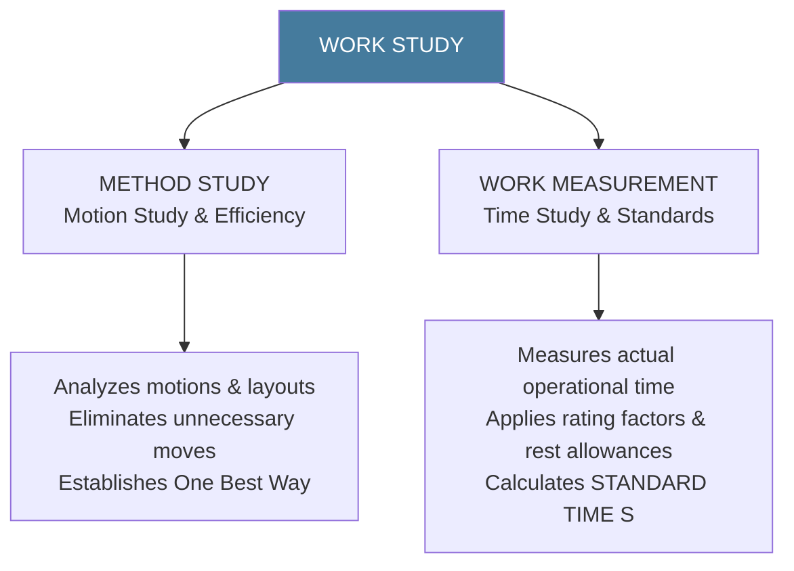

# Labor Costing, Incentive Systems, and Control

> [!abstract] Curriculum & Syllabus Context
>
> - **Course:** ACC 304 Cost Accounting I
> - **Step:** Step 8: Costing and Control of Labor (Curriculum Gap Bridging)
> - **Target Reading:** Datar & Rajan, *Horngren's Cost Accounting*, 17th/18th Edition — **Chapter 4 & Labor Control Literature**
> - **Syllabus Focus:** Direct vs. indirect labor; organizational structure of labor control; time-keeping vs. time-booking systems; payroll accounting and general ledger cost flows; straight time and piece-rate systems; incentive wage plans (Taylor, Merrick, Gantt, Emerson, Bedaux, Halsey 50%, Rowan); overtime and overtime premium accounting; normal vs. abnormal idle time; labor turnover measurement and profit foregone; work study (method study & work measurement); and learning curve theory (cumulative average-time model).

---

## 1. Introduction & Objectives of Labor Cost Control
Labor cost represents one of the most substantial and volatile elements of total cost in manufacturing and service organizations. Unlike raw materials, which are physical commodities, labor represents human effort—both physical and mental—applied to convert raw materials into finished output or to perform services. Consequently, the control of labor costs involves not only quantitative financial management but also human resource organization, time engineering, behavioral motivation, and regulatory compliance.

---
### Direct vs. Indirect Labor
Labor costs are broadly classified into two categories based on their traceability to specific cost objects (products, jobs, or processes):

> [!info] Key Definition
>
> #### 1. Direct Labor
> **Direct labor** consists of the wages and directly attributable compensation paid to workers who are directly engaged in converting raw materials into finished output or who perform specific, identifiable operations on a distinct job or cost object.
> *   **Traceability:** Direct labor can be easily, unambiguously, and economically traced to a specific unit of product, job order, or process.
> *   **Examples:** Assembly line workers at an automotive plant, machine operators in a textile mill, carpenters building custom furniture, cabinet makers, and seamstresses in garment manufacturing.
> *   **Accounting Treatment:** Direct labor costs are treated as **inventoriable product costs** and are debited directly to the `Work-in-Process Control` account.
> #### 2. Indirect Labor
> **Indirect labor** refers to the compensation paid to employees who support the overall manufacturing process or operational environment but do not directly alter the form, shape, or nature of the direct materials.
> *   **Traceability:** Indirect labor cannot be traced directly or economically to a specific job or product unit; instead, it benefits multiple jobs, departments, or the entire operating facility.
> *   **Examples:** Factory supervisors, foremen, plant security personnel, storekeepers, time-keepers, quality control inspectors, janitors, and maintenance engineers.
> *   **Accounting Treatment:** Indirect labor costs are accumulated within indirect manufacturing cost pools and debited to the `Manufacturing Overhead Control` account. They are subsequently allocated to `Work-in-Process Control` using a predetermined overhead allocation rate.

---
### Objectives of Labor Accounting and Control
An effective system of labor cost accounting and control must satisfy three fundamental objectives:
1.  **Product and Service Cost Determination:** Accurately measuring, accumulating, and assigning direct labor costs to individual jobs, processes, or service units, while properly accumulating indirect labor as factory overhead, to establish true product costs for inventory valuation and financial reporting.
2.  **Planning and Cost Control:** Providing management with timely performance reports comparing actual labor hours and costs against standard labor allowances or budgets. This enables the analysis of variances (labor rate, efficiency, mix, and yield) to take prompt corrective action.
3.  **Managerial Decision-Making:** Supplying accurate labor cost data, wage structures, and capacity utilization figures for short-run and long-run strategic decisions—such as product pricing, make-or-buy decisions, expansion or contraction of shifts, process automation, and labor contract negotiations.

---
### Organizational Structure for Labor Control
Controlling labor costs requires coordinated efforts across five distinct departments within an enterprise:

1.  **Personnel (Human Resources) Department:** Responsible for recruiting, vetting, hiring, placing, and discharging personnel; formulating corporate wage policies; maintaining master employee record cards; and managing industrial relations to minimize disputes and absenteeism.
2.  **Engineering Department:** Responsible for designing production methods, specifying operation sequences, conducting work study (time and motion studies), establishing standard performance times, maintaining safe plant working conditions, and setting machine layout specifications.
3.  **Time-Keeping Department:** Responsible for maintaining accurate attendance records (time-keeping) as well as precise records of the exact time spent by each worker on individual jobs or indirect tasks (time-booking).
4.  **Payroll Department:** Responsible for calculating gross earnings based on time cards or job tickets, computing statutory and voluntary payroll deductions (such as Provident Fund, Tax, and Social Security), preparing net pay sheets, issuing paychecks/electronic transfers, and maintaining individual employee earnings records.
5.  **Cost Accounting Department:** Responsible for accumulating and classifying all labor-related expenditures, posting direct labor charges to individual job-cost records or process accounts, debiting indirect labor to departmental overhead control accounts, reconciling payroll records with time-booking summaries, and analyzing labor variances.

---
## 2. Time-Keeping and Time-Booking Systems
Accurate labor costing depends on two distinct systems: recording the worker's presence at the plant (**Time-Keeping**) and tracking the actual utilization of that time across tasks (**Time-Booking**).

---
### Time-Keeping vs. Time-Booking

| Feature | Time-Keeping | Time-Booking |
| :--- | :--- | :--- |
| **Primary Objective** | To record the exact time of arrival and departure of employees to determine total hours present for attendance and basic gross pay calculations. | To record how the employee's time was actually spent during the working day across various jobs, operations, or idle periods. |
| **Purpose in Costing** | Establishes the gross payroll liability and verifies total clock hours paid. | Facilitates cost assignment—distinguishing direct labor (debited to WIP) from indirect labor/idle time (debited to MOH or P&L). |
| **Key Documents** | Clock Cards, Gate Passes, Attendance Registers, Electronic Biometric Logs. | Job Tickets, Labor-Time Sheets, Daily/Weekly Production Reports, Routing Sheets. |
| **Responsible Dept.** | Time-Keeping / Gate Control Department. | Production Supervisors / Floor Time-Keepers. |

---
### Methods of Time-Keeping
1.  **Manual Attendance Registers:** Workers manually sign in and out in an attendance book. *Drawback:* Prone to manual errors, buddy-signing, and severe queues in large facilities.
2.  **Disc or Token Method:** Each worker is assigned a numbered metal disc. Upon arrival, the worker collects their disc from a master board and drops it into a collection box, which is locked at shift start. *Drawback:* Open to fraudulent substitution unless strictly supervised.
3.  **Clock Cards (Mechanical Time Recorders):** Employees insert a weekly card into a mechanical clock that prints the exact arrival and departure timestamps.
4.  **Biometric and Electronic Smart Card Systems:** Modern automated systems utilizing magnetic swipe cards, RFID badges, or biometric scanners (fingerprint, facial recognition). The software automatically logs timestamps directly into the electronic payroll database, eliminating clerical errors and buddy punching.

---
### Methods of Time-Booking
1.  **Job Tickets / Job Cards:** A separate card is issued for each job assigned to a worker. The time-keeper or worker punches the "Time Started" and "Time Completed" on the ticket. The net time is multiplied by the labor rate to trace direct labor directly to the job-cost sheet.
2.  **Labor Cost Cards / Routing Sheets:** Used for complex jobs that pass sequentially through multiple departments or workers. A single card accompanies the job, and each operator logs their employee ID, start time, stop time, and operation code.
3.  **Daily Time Sheets:** Issued to workers daily (especially maintenance technicians, field engineers, or jobbing staff) to record the exact start and stop times spent on various jobs, as well as idle time periods.
4.  **Weekly Time Sheets:** Used in environments where tasks are relatively continuous or in professional service firms (e.g., auditing, consulting, legal practices), where staff log hours billed to specific clients or engagement codes.

---
### Payroll Accounting & General Ledger Cost Flows
Payroll accounting bridges time-keeping (gross compensation) and cost accounting (allocation of labor costs to cost objects).

> [!quote] Formula & Derivation
>
> #### Step 1: Accumulation of Gross Payroll Liability
> When total earnings (basic pay, dearness allowance, overtime, incentives) are calculated for the pay period, gross payroll is recognized alongside statutory and voluntary deductions:
> $$ \text{Gross Payroll} = \text{Basic Wages} + \text{Dearness Allowance (DA)} + \text{Overtime Pay} + \text{Incentives/Bonuses} $$
> $$ \text{Net Pay Payable} = \text{Gross Payroll} - \left( \text{Employees' Provident Fund} + \text{Income Tax/PAYE Withholding} + \text{Employee Insurance/ESI} \right) $$
> *   **Journal Entry 1 (Recording Payroll Liability):**
>     *   **Debit:** `Payroll Control Account` (or `Factory Payroll`) $\quad \text{--- [Gross Amount]}$
>     *   **Credit:** `Provident Fund Payable` $\quad \text{--- [Employee Share]}$
>     *   **Credit:** `Employee State Insurance (ESI) Payable` $\quad \text{--- [Employee Share]}$
>     *   **Credit:** `Income Tax Withholding Payable` $\quad \text{--- [Employee Portion]}$
>     *   **Credit:** `Wages Payable Control (or Net Cash Payable)` $\quad \text{--- [Net Pay]}$
> *   **Journal Entry 2 (Disbursement of Net Wages):**
>     *   **Debit:** `Wages Payable Control`
>     *   **Credit:** `Cash / Bank Control`
> *   **Journal Entry 3 (Employer's Statutory Contributions):**
>     *   **Debit:** `Manufacturing Overhead Control` (or `Payroll Fringe Expense`)
>     *   **Credit:** `Provident Fund Payable` $\quad \text{--- [Employer Share]}$
>     *   **Credit:** `ESI Payable` $\quad \text{--- [Employer Share]}$
> #### Step 2: Distribution and Allocation of Payroll Costs
> At the end of the cost period, the `Payroll Control Account` is cleared by assigning accumulated payroll costs to production and overhead accounts based on time-booking summaries:
> *   **Journal Entry 4 (Allocation of Labor Costs):**
>     *   **Debit:** `Work-in-Process Control` $\quad \text{--- [Direct Labor Traced to Jobs]}$
>     *   **Debit:** `Manufacturing Overhead Control` $\quad \text{--- [Indirect Labor + Normal Idle Time + Employer Fringes]}$
>     *   **Debit:** `Costing Profit and Loss Account` $\quad \text{--- [Abnormal Idle Time Loss]}$
>     *   **Credit:** `Payroll Control Account` $\quad \text{--- [Total Gross Payroll Cleared]}$

---
## 3. Wage Systems and Incentive Wage Plans
A wage system establishes the structural rule for compensating labor. An effective wage system must align organizational cost minimization with employee motivation.

---
### Basic Wage Systems
> [!quote] Formula & Derivation
>
> #### 1. Straight Time-Rate System
> Under the **straight time-rate system**, workers are compensated on the basis of time spent at the facility (per hour, day, week, or month), regardless of the volume of output produced.
> $$ \text{Total Earnings } (E) = T \times R $$
> Where:
> *   $T =$ Actual time worked (hours)
> *   $R =$ Hourly wage rate

*   **Applicability:** Recommended where quality is paramount (e.g., precision instrument making), speed of work is machine-paced or automated, output is difficult to measure individually, or work is highly varied/artistic.
*   **Advantages:** Simple to operate, provides income security to workers, minimizes rush-induced raw material wastage and tool breakage.
*   **Disadvantages:** Offers no incentive for superior performance; efficient and inefficient workers receive identical compensation, leading to morale degradation and requiring strict supervision.

> [!quote] Formula & Derivation
>
> #### 2. Straight Piece-Rate System
> Under the **straight piece-rate system**, a worker is paid a fixed rate for each unit produced or operation completed, irrespective of the time spent.
> $$ \text{Total Earnings } (E) = N \times R_p $$
> Where:
> *   $N =$ Number of acceptable units produced
> *   $R_p =$ Piece rate per unit $= \text{Standard Time per Unit } (S_u) \times \text{Hourly Rate } (R)$

*   **Applicability:** Ideal where production is highly repetitive, standardized, unit output is easily measurable, and output volume depends directly on the worker's effort.
*   **Advantages:** Strong direct incentive to increase output; reduces fixed manufacturing overhead per unit as fixed costs are spread over higher volumes; distinguishes efficient from inefficient workers.
*   **Disadvantages:** Risk of quality deterioration; excessive wear and tear on machinery; income instability during breakdowns or supply delays (unless a minimum time wage is guaranteed).

---
### Incentive Wage Plans
Incentive plans combine features of time-rate and piece-rate systems to reward efficiency while offering income security.

---
#### 1. Differential Piece-Rate Systems
##### A. Taylor's Differential Piece-Rate System
Developed by Frederick W. Taylor, this system uses two piece rates: a harsh low piece rate for sub-standard performance and a high piece rate for standard or above-standard performance. It offers no guaranteed minimum day wage.
*   **Efficiency Benchmark:** Based on time and motion studies (e.g., High Task).
*   **Rate Structure:**
    *   Output **Below Standard** ($< 100\%$): Paid **$80\%$** of the normal piece rate (or low rate).
    *   Output **At or Above Standard** ($\ge 100\%$): Paid **$120\%$** of the normal piece rate (or high rate).
*   **Key Mechanism:** The sudden jump at $100\%$ efficiency creates a powerful incentive to reach the benchmark, while heavily penalizing inefficient workers.
##### B. Merrick's Differential Piece-Rate System (Multiple Piece-Rate)
Merrick modified Taylor's system to reduce its harshness toward beginners and less experienced workers by introducing three tier rates and guaranteeing a gentler step progression. It also does not guarantee a minimum day rate.
*   **Rate Structure:**
    *   Efficiency **up to $83\%$**: Normal Piece Rate ($100\%$ of base piece rate).
    *   Efficiency **between $83\%$ and $100\%$**: $110\%$ of Normal Piece Rate.
    *   Efficiency **Above $100\%$**: $120\%$ of Normal Piece Rate.

---
#### 2. Task, Efficiency, and Point Bonus Systems
##### A. Gantt Task and Bonus Plan
Combines a guaranteed time rate with a differential piece-rate bonus, ensuring security for lower-skilled workers while heavily rewarding high output.
*   **Structure:**
    *   Output **Below Standard** ($< 100\%$ efficiency): Guaranteed hourly time wages ($T \times R$).
    *   Output **At Standard** ($= 100\%$ efficiency): Time wages plus a **$20\%$ bonus** on the time rate ($1.20 \times T \times R$).
    *   Output **Above Standard** ($> 100\%$ efficiency): A high piece rate calculated on the worker's *total output* (usually $120\%$ of standard piece rate earnings).

> [!quote] Formula & Derivation
>
> ##### B. Emerson's Efficiency System
> Guarantees a minimum daily wage and pays a sliding-scale bonus starting at an efficiency threshold of $66 \frac{2}{3}\%$.
> *   **Structure:**
>     *   Efficiency **$< 66 \frac{2}{3}\%$**: Guaranteed time wages ($T \times R$), zero bonus.
>     *   Efficiency **$66 \frac{2}{3}\%$ to $100\%$**: Guaranteed time wages plus a small bonus on a sliding scale (rising from $0.01\%$ up to $20\%$ at $100\%$ efficiency).
>     *   Efficiency **$> 100\%$**: Guaranteed time wages + $20\%$ bonus + an additional $1\%$ bonus for every $1\%$ increase in efficiency above $100\%$.
>     *   *Total Earnings Formula at $E\% > 100\%$:*
>         $$ E = T \times R \times \left[ 1.00 + 0.20 + (E\% - 1.00) \right] = T \times R \times \left( 0.20 + E\% \right) $$
> ##### C. Bedaux Point Plan
> Measures work in terms of **Bedaux Points** or **Bs**. A "B" represents the amount of work that a normal worker can complete in one minute, including necessary rest allowances for fatigue.
> *   **Standard Hour:** $1 \text{ Hour} = 60 \text{ Bs}$.
> *   **Earnings Structure:**
>     *   A worker is guaranteed a basic time rate for actual hours worked.
>     *   If total Bs earned exceed standard Bs for the time taken (i.e., $B_{\text{earned}} > 60 \times T$), a bonus is paid on the saved points ($B_{\text{saved}} = B_{\text{earned}} - 60 \times T$).
>     *   *Classic Bedaux Sharing:* Worker receives **$75\%$** of the saved point value; remaining **$25\%$** is distributed to foremen, supervisors, and indirect workers. Modern applications often pay $100\%$ to the worker.
> $$ \text{Bonus} = \frac{B_{\text{saved}}}{60} \times R \times 0.75 $$
> $$ \text{Total Earnings } (E) = (T \times R) + \left( \frac{B_{\text{earned}} - 60T}{60} \times R \times 0.75 \right) $$

---
#### 3. Premium Bonus Plans (Time-Saved Sharing)
When standard time ($S$) is set for a job and a worker completes it in actual time ($T < S$), the time saved is:

$$ \text{Time Saved } (TS) = S - T $$

Premium bonus plans share the monetary value of this saved time between the employee and the employer.

> [!quote] Formula & Derivation
>
> ##### A. Halsey Premium Plan
> Originated by F.A. Halsey. The worker receives guaranteed hourly time wages for actual time worked plus a fixed percentage (traditionally **$50\%$**) of the time saved.
> *   **Bonus Formula:**
>     $$ \text{Bonus} = 50\% \times (S - T) \times R = 0.50 \times (S - T) \times R $$
> *   **Total Earnings ($E$):**
>     $$ E = (T \times R) + 0.50 \times (S - T) \times R $$
> *   **Effective Hourly Wage Rate ($R_{\text{eff}}$):**
>     $$ R_{\text{eff}} = \frac{E}{T} = R \left[ 1 + 0.50 \left( \frac{S - T}{T} \right) \right] $$
> ##### B. Halsey-Weir Premium Plan
> Identical to the Halsey Plan, except that the worker's share of time saved is **$33 \frac{1}{3}\%$** ($\frac{1}{3}$), while the employer retains **$66 \frac{2}{3}\%$** ($\frac{2}{3}$).
> *   **Total Earnings ($E$):**
>     $$ E = (T \times R) + \frac{1}{3} (S - T) \times R $$
> ##### C. Rowan Premium Plan
> Introduced by James Rowan. The bonus is calculated as a proportion of the time taken, determined by the ratio of time saved to standard time allowed.
> *   **Bonus Formula:**
>     $$ \text{Bonus} = \left( \frac{\text{Time Saved}}{\text{Standard Time}} \right) \times \text{Time Taken} \times \text{Rate} = \left( \frac{S - T}{S} \right) \times T \times R $$
> *   **Total Earnings ($E$):**
>     $$ E = (T \times R) + \left[ \left( \frac{S - T}{S} \right) \times T \times R \right] = T \times R \times \left( 1 + \frac{S - T}{S} \right) = T \times R \times \left( 2 - \frac{T}{S} \right) $$

> [!warning] Exam Pitfall / Exception
>
> **Key Behavior & Comparison with Halsey:**
> 1.  **Protects Management Against Loose Standards:** Under Rowan, the bonus increases as time taken decreases, but reaches a maximum when time saved is $50\%$ of standard time. Beyond $50\%$ time saved, the absolute bonus amount *declines*, making it impossible for earnings to exceed double the normal time rate regardless of speed.
> 2.  **At $50\%$ Time Saved ($T = 0.50S$):** Both Halsey ($50\%$) and Rowan yield the **exact same total earnings and bonus**.
> 3.  **For Minor Time Savings ($T > 0.50S$):** The Rowan plan yields **higher** total earnings than the Halsey plan.
> 4.  **For Major Time Savings ($T < 0.50S$):** The Halsey plan yields **higher** total earnings than the Rowan plan (as Halsey has no ceiling).

---
#### 4. Group Bonus Schemes
When individual worker output cannot be isolated (e.g., conveyor assembly lines, chemical processing, maintenance crews), incentive plans are structured for the team:
1.  **Priestman’s System:** A standard physical output is set for the whole factory/plant for a period. If actual output exceeds the benchmark, all workers receive a percentage increase in their time wages equal to the percentage excess output.
2.  **Towne Gain-Sharing System:** A standard labor cost is established for a department. Half of any savings achieved by reducing actual labor costs below standard is distributed among workers and supervisors in designated ratios.
3.  **Budgeted Expenditure / Cost Efficiency Bonus:** Bonus is awarded to operational teams for achieving savings in overall departmental overhead or raw material consumption ratios compared to flexible budget targets.

---
### Comparative Mathematical Matrix of Wage Systems

| Plan | Guaranteed Day Wage? | Bonus Formula | Total Earnings ($E$) Formula | Unit Labor Cost Trend as Production Increases |
| :--- | :--- | :--- | :--- | :--- |
| **Straight Time Rate** | Yes | None | $T \times R$ | Increases if speed drops; constant per hour. |
| **Straight Piece Rate** | No | None | $N \times R_p$ | Constant per unit ($R_p$). |
| **Taylor Differential** | No | None (Built into piece rates) | Below Std: $N \times (0.80 R_p)$ Above Std: $N \times (1.20 R_p)$ | Drops sharply at $100\%$ efficiency step. |
| **Merrick Differential** | No | None (Built into piece rates) | $<83\%$: $N \times R_p$ $83\%-100\%$: $N \times 1.10 R_p$ $>100\%$: $N \times 1.20 R_p$ | Step reductions in unit labor cost at $83\%$ and $100\%$. |
| **Gantt Task Plan** | Yes | $20\%$ of time rate at standard | $<100\%$: $T \times R$ $=100\%$: $1.20(T \times R)$ $>100\%$: $N \times R_{\text{high}}$ | High initial unit cost below std, drops substantially at/above std. |
| **Emerson Efficiency** | Yes | Sliding scale ($66 \frac{2}{3}\% - 100\%$), then $+1\%$ per $1\%$ eff. | $T \times R \times (0.20 + \text{Efficiency}\%)$ | Decreases continuously as output increases. |
| **Halsey Plan (50%)** | Yes | $0.50 (S - T) \times R$ | $T R + 0.50(S - T)R$ | Decreases continuously per unit as time saved increases. |
| **Rowan Plan** | Yes | $\left(\frac{S - T}{S}\right) T \times R$ | $T R + \left(\frac{S - T}{S}\right) T R$ | Decreases per unit; protects against loose standards. |

---
## 4. Accounting for Special Labor-Related Items
Labor accounting involves handling complex payroll items such as overtime, idle time, and statutory fringe benefits.

---
### Overtime and Overtime Premium
Overtime is work performed beyond normal shift hours (e.g., beyond 8 hours a day or 48 hours a week under factory legislation). Overtime pay consists of two components:
1.  **Regular Wage Component:** Paid at the standard hourly wage rate for total hours worked.
2.  **Overtime Premium:** The additional payment made above the regular rate (e.g., $50\%$, $100\%$, or double rate).

$$ \text{Total Overtime Pay} = (\text{OT Hours} \times \text{Regular Rate}) + (\text{OT Hours} \times \text{Overtime Premium Rate}) $$
#### Treatment of Overtime Premium in Cost Accounts
The accounting treatment of the overtime premium depends strictly on the underlying **cause** of the overtime:

1.  **Customer-Specific Rush Order:** If overtime is worked at the explicit request of a customer to expedite a specific job order, the overtime premium is treated as a **direct labor cost** and charged directly to that specific job's `Work-in-Process Control`.
2.  **General Production Pressure / Capacity Bottleneck:** If overtime is routinely worked due to general seasonal demand surges or plant capacity constraints, the overtime premium cannot be fairly assigned to any single job. It is treated as an **indirect labor cost** and charged to `Manufacturing Overhead Control` (or recovered across all jobs via an inflated average labor rate).
3.  **Management Delays or Inefficiencies:** If overtime is required due to abnormal delays, machine breakdowns, material shortages, or managerial inefficiency, the overtime premium is treated as an **abnormal loss** and debited directly to the `Costing Profit and Loss Account`.

---
### Idle Time
Idle time is the difference between the hours for which an employee is paid (clock time) and the hours actually spent on productive jobs or cost objects (booked time).

> [!info] Key Definition
>
> #### 1. Normal Idle Time
> Normal idle time is unavoidable, inherent in operational setup, and structurally expected during a shift.
> *   **Examples:** Time taken to walk from the factory gate to the workstation, operational tool setup time, essential rest pauses, tea breaks, and personal time allowances.
> *   **Accounting Treatment:** Treated as part of manufacturing overhead cost and debited to `Manufacturing Overhead Control`. Alternatively, it is accounted for by calculating an **inflated hourly labor rate**:
> $$ \text{Inflated Hourly Rate} = \frac{\text{Total Gross Time Wages Paid}}{\text{Total Productive Hours Expected } (\text{Gross Hours} - \text{Normal Idle Hours})} $$
> #### 2. Abnormal Idle Time
> Abnormal idle time is unproductive time caused by controllable operational failures, management lapses, or external disruptions.
> *   **Examples:** Machine breakdowns due to poor maintenance, power outages, delays in receiving raw material requisitions from stores, strike disruptions, or lack of work orders.
> *   **Accounting Treatment:** Cannot be inventoried into product costs. The cost of abnormal idle hours ($T_{\text{abnormal}} \times \text{Regular Rate}$) is debited directly to the `Costing Profit and Loss Account`.

---
### Other Special Payroll Cost Items
1.  **Fringe Benefits:** Statutory and voluntary employee benefits—including employer contributions to Provident Fund, ESI, gratuity funds, pensions, health insurance, and paid vacations.
    *   *Treatment:* Directly charged to `Work-in-Process Control` as direct labor via a supplemental wage rate if explicitly traceable to direct workers, or accumulated as part of `Manufacturing Overhead Control`.
2.  **Shift Premium:** Extra compensation paid to workers operating evening, night, or graveyard shifts.
    *   *Treatment:* Charged to `Manufacturing Overhead Control` if shift rotation is part of normal operations, or directly to a specific job if night work was exclusively ordered for that customer.
3.  **Apprentices / Learners Wages:** Compensation paid to trainees acquiring skills.
    *   *Treatment:* Since apprentices take longer and produce more scrap, their wages are debited to `Manufacturing Overhead Control` rather than treated as direct labor.
4.  **Attendance Bonus:** A incentive paid to workers who maintain full attendance without unexcused absences.
    *   *Treatment:* Debited to `Manufacturing Overhead Control` or absorbed via an inflated labor rate.
5.  **Casual Workers & Out-Workers:** Casual workers hired for temporary bottlenecks are charged to `Work-in-Process Control` (if direct) or `MOH Control` (if general factory labor). Out-workers performing sub-assembly outside factory premises are tracked via specific piece-rate sub-contracts.

---
## 5. Labor Turnover & Measurement Control
**Labor turnover** refers to the rate at which employees leave an organization and are replaced by new hires over a given accounting period. High labor turnover impairs productivity, increases training costs, and raises unit product costs.

---
### Causes of Labor Turnover

---
### Methods of Measuring Labor Turnover
Labor turnover is measured using three alternative formulas for a given period:

> [!quote] Formula & Derivation
>
> #### 1. Separation Method
> Focuses strictly on employees who leave the enterprise (whether voluntarily, via dismissal, or retirement).
> $$ \text{Labor Turnover Rate (Separation)} = \frac{S}{A} \times 100 $$
> Where:
> *   $S =$ Total number of separations / leavers during the period
> *   $A =$ Average number of workers on payroll during the period $= \frac{\text{Beginning Workers} + \text{Ending Workers}}{2}$
> #### 2. Replacement Method
> Focuses solely on the number of new workers recruited to **replace** leavers. It excludes new workers hired specifically for expansion plans (accessions).
> $$ \text{Labor Turnover Rate (Replacement)} = \frac{R_{\text{repl}}}{A} \times 100 $$
> Where $R_{\text{repl}} =$ Number of replacement workers hired during the period.
> #### 3. Flux Method
> Measures overall workforce movement by combining separations and recruitment activity.
> $$ \text{Labor Turnover Rate (Flux)} = \frac{S + M}{A} \times 100 \quad \text{or} \quad \frac{S + R_{\text{repl}}}{A} \times 100 $$
> Where:
> *   $M =$ Total accessions / additions (Replacements + Expansion New Hires).
> *   *Equivalent Annual Turnover Rate:*
>     $$ \text{Equivalent Annual Rate} = \frac{\text{Turnover Rate for Period}}{\text{Number of Days in Period}} \times 365 $$

---
### Costs of Labor Turnover
The monetary impact of labor turnover comprises two cost categories:
1.  **Preventive Costs:** Expenditures incurred by management to keep workers satisfied, maintain high morale, and prevent leavers.
    *   *Components:* Costs of medical facilities, employee welfare schemes, pensions, competitive incentive plans, safe working environments, and grievance handling.
2.  **Replacement Costs:** Expenditures and lost profits incurred when leavers are replaced.
    *   *Components:* Advertising for job vacancies, interviewing, administrative costs of HR, training costs for new recruits, tool breakage/machine damage caused by inexperienced recruits, high initial scrap/spoilage, and **profit foregone** on lost sales volume due to production delays.

$$ \text{Total Profit Foregone} = \left( \text{Potentially Productive Hours Lost} \times \text{Contribution Margin per Hour} \right) + \text{Replacement Costs} $$

---
## 6. Work Study, Job Evaluation, & Merit Rating
Labor control requires scientific standard setting and equitable job classification through work study and rating techniques.

---
### Work Study: Method Study vs. Work Measurement
Work study is the systematic analysis of work methods to ensure the most effective utilization of human, material, and capital resources.

#### 1. Method Study (Motion Study)
*   **Definition:** The systematic recording and critical examination of existing and proposed ways of doing work to eliminate wasteful, repetitive, or redundant physical motions.
*   **Tools:** Process flow charts, therbligs analysis, operation micro-motion diagrams.
*   **Objective:** To establish the "one best way" of performing an operation, reducing operator fatigue and optimizing machinery placement.
#### 2. Work Measurement (Time Study)
*   **Definition:** The application of techniques to establish the time required for a qualified worker to carry out a specified job at a defined level of performance.
*   **Process for Deriving Standard Time ($S$):**
    1.  **Observed Time ($T_{\text{obs}}$):** Measured using a stopwatch across multiple cycles.
    2.  **Basic Time (Normal Time):** $T_{\text{normal}} = T_{\text{obs}} \times \text{Rating Factor}$ (where rating factor evaluates worker pace relative to standard pace).
    3.  **Standard Time ($S$):** $S = T_{\text{normal}} + \text{Allowances}$ (adding percentage allowances for fatigue, personal needs, machine setup, and unavoidable delays).

---
### Job Evaluation vs. Merit Rating

| Feature | Job Evaluation | Merit Rating |
| :--- | :--- | :--- |
| **Primary Focus** | Evaluates the **Job** (rates the work position). | Evaluates the **Individual** (rates the employee's performance). |
| **Core Objective** | To determine the relative worth/value of different jobs within an organization to establish an equitable wage and salary structure. | To evaluate an employee's personal efficiency, skill, conduct, and suitability for promotion, bonuses, or merit increments. |
| **Key Methods** | Point Ranking Method, Ranking Method, Factor Comparison Method, Job Grading/Classification. | Rating Scales, Checklists, 360-degree feedback, Performance Appraisals. |
| **Timing** | Performed when a job role is created, modified, or restructured. | Performed periodically (e.g., annually or semi-annually). |

---
## 7. Learning Curve Theory & Labor Cost Dynamics
In labor-intensive assembly operations, complex manufacturing environments, or new product launches, labor hours per unit decrease predictably as workers gain experience and master task motions. This mathematical relationship is modeled by **Learning Curve Theory**.

---
### The Cumulative Average-Time Learning Model
> [!quote] Formula & Derivation
>
> The classic model (Wright's Model) states that every time the cumulative production quantity of a product **doubles**, the cumulative average time required per unit declines by a constant percentage (the **learning curve rate**, $L$).
> $$ \bar{Y}_X = a \cdot X^b $$
> Where:
> *   $\bar{Y}_X =$ Cumulative average time (or cumulative average labor cost) per unit for $X$ units
> *   $a =$ Labor hours required to produce the **first** unit ($X = 1$)
> *   $X =$ Cumulative number of output units produced
> *   $b =$ Index of learning (learning exponent) $= \frac{\ln(L)}{\ln(2)}$
> *   $L =$ Learning curve rate in decimal form (e.g., $80\% = 0.80$, $85\% = 0.85$)
> #### Calculation of Learning Exponent ($b$):
> *   For an **$80\%$ Learning Curve**:
>     $$ b = \frac{\ln(0.80)}{\ln(2)} = \frac{-0.2231435}{0.693147} \approx -0.321928 $$
> *   For an **$85\%$ Learning Curve**:
>     $$ b = \frac{\ln(0.85)}{\ln(2)} = \frac{-0.162519}{0.693147} \approx -0.234465 $$
> *   For a **$90\%$ Learning Curve**:
>     $$ b = \frac{\ln(0.90)}{\ln(2)} = \frac{-0.105361}{0.693147} \approx -0.152004 $$
> #### Total Hours and Marginal Hours Calculations:
> *   **Total Cumulative Labor Hours ($Y_{\text{total}}$) for $X$ units:**
>     $$ Y_{\text{total}}(X) = X \cdot \bar{Y}_X = a \cdot X^{1+b} $$
> *   **Marginal Labor Hours for the $N$-th Unit specifically:**
>     $$ \text{Hours for Unit } N = Y_{\text{total}}(N) - Y_{\text{total}}(N - 1) $$
> *   **Labor Hours for an Additional Batch (from unit $X_1 + 1$ to $X_2$):**
>     $$ \Delta \text{Hours} = Y_{\text{total}}(X_2) - Y_{\text{total}}(X_1) $$

---
### Doubling Table Mechanics (Illustration)
If the first unit ($X = 1$) takes $a = 100$ labor hours under an $80\%$ learning curve:

| Doubling Step | Cumulative Units ($X$) | Cumulative Average Hours per Unit ($\bar{Y}_X$) | Total Cumulative Hours ($Y_{\text{total}} = X \cdot \bar{Y}_X$) | Incremental Hours for the Batch |
| :---: | :---: | :---: | :---: | :---: |
| Initial Unit | $1$ | $100.00$ | $100.00$ | $100.00$ |
| 1st Doubling | $2$ | $100 \times 0.80 = 80.00$ | $2 \times 80.00 = 160.00$ | $60.00$ (Unit 2) |
| 2nd Doubling | $4$ | $80 \times 0.80 = 64.00$ | $4 \times 64.00 = 256.00$ | $96.00$ (Units 3–4) |
| 3rd Doubling | $8$ | $64 \times 0.80 = 51.20$ | $8 \times 51.20 = 409.60$ | $153.60$ (Units 5–8) |
| 4th Doubling | $16$ | $51.20 \times 0.80 = 40.96$ | $16 \times 40.96 = 655.36$ | $245.76$ (Units 9–16) |

---
### Managerial Applications of Learning Curve Theory
1.  **Setting Standard Costs and Budgets:** Prevents setting static labor standards based on initial unit production, which would severely overbudget labor costs for future production batches.
2.  **Target Pricing and Special Order Bidding:** Enables competitive bidding on large government, aerospace, or manufacturing contracts by projecting declining labor hours across batch volumes rather than applying initial unit rates.
3.  **Capacity and Workforce Planning:** Assists management in scheduling shifts, estimating plant capacity, and forecasting labor hiring requirements over time.

---
## 8. Comprehensive Step-by-Step Numerical Walkthroughs

---

> [!example] Numerical Problem
>
> ### Comprehensive Problem 1: Multi-Plan Incentive Wage Scheme Comparison
> #### Problem Statement:
> In a precision engineering factory, the standard time allowed ($S$) to complete a specialized job order is **$40\text{ hours}$**. The guaranteed basic time wage rate ($R$) is **$\text{Tk } 50\text{ per hour}$**.
> Four workers—**A, B, C, and D**—completed the job order during a single pay period, recording the following actual times:
> *   Worker **A** completed the job in **$48\text{ hours}$**.
> *   Worker **B** completed the job in **$40\text{ hours}$**.
> *   Worker **C** completed the job in **$32\text{ hours}$**.
> *   Worker **D** completed the job in **$24\text{ hours}$**.
> #### Requirements:
> Calculate the total earnings, effective hourly earnings rate, and unit labor cost for each worker under the following wage systems:
> 1.  Straight Time Rate.
> 2.  Straight Piece Rate (based on standard time allowed).
> 3.  Halsey Premium Plan ($50\%$ sharing).
> 4.  Rowan Premium Plan.
> 5.  Emerson Efficiency System.

#### Step-by-Step Solution:
##### Preliminary Calculations:
1.  **Standard Piece Rate ($R_p$):**
    $$ R_p = S \times R = 40\text{ hours} \times \text{Tk } 50/\text{hour} = \text{Tk } 2,000 \text{ per job} $$
2.  **Efficiency Rates ($\text{Efficiency } \% = \frac{S}{T} \times 100$):**
    *   **Worker A:** $\frac{40}{48} \times 100 = 83.33\%$
    *   **Worker B:** $\frac{40}{40} \times 100 = 100.00\%$
    *   **Worker C:** $\frac{40}{32} \times 100 = 125.00\%$
    *   **Worker D:** $\frac{40}{24} \times 100 = 166.67\%$

---
##### 1. Straight Time Rate System ($E = T \times R$)
*   **Worker A:** $48 \times 50 = \mathbf{\text{Tk } 2,400}$ $\quad (R_{\text{eff}} = \text{Tk } 50.00/\text{hr})$
*   **Worker B:** $40 \times 50 = \mathbf{\text{Tk } 2,000}$ $\quad (R_{\text{eff}} = \text{Tk } 50.00/\text{hr})$
*   **Worker C:** $32 \times 50 = \mathbf{\text{Tk } 1,600}$ $\quad (R_{\text{eff}} = \text{Tk } 50.00/\text{hr})$
*   **Worker D:** $24 \times 50 = \mathbf{\text{Tk } 1,200}$ $\quad (R_{\text{eff}} = \text{Tk } 50.00/\text{hr})$

---
##### 2. Straight Piece Rate System ($E = R_p = \text{Tk } 2,000$)
*   **Worker A:** Earnings $= \mathbf{\text{Tk } 2,000}$ $\quad \left( R_{\text{eff}} = \frac{2000}{48} = \text{Tk } 41.67/\text{hr} \right)$
*   **Worker B:** Earnings $= \mathbf{\text{Tk } 2,000}$ $\quad \left( R_{\text{eff}} = \frac{2000}{40} = \text{Tk } 50.00/\text{hr} \right)$
*   **Worker C:** Earnings $= \mathbf{\text{Tk } 2,000}$ $\quad \left( R_{\text{eff}} = \frac{2000}{32} = \text{Tk } 62.50/\text{hr} \right)$
*   **Worker D:** Earnings $= \mathbf{\text{Tk } 2,000}$ $\quad \left( R_{\text{eff}} = \frac{2000}{24} = \text{Tk } 83.33/\text{hr} \right)$

---
##### 3. Halsey Premium Plan ($50\%$ Sharing)
$$ \text{Bonus} = 0.50 \times (S - T) \times R \quad (\text{if } S > T) $$
*   **Worker A ($T = 48 > S = 40$):** Time Saved $= 0$. Bonus $= 0$.
    $$ \text{Earnings} = 48 \times 50 = \mathbf{\text{Tk } 2,400} \quad (R_{\text{eff}} = \text{Tk } 50.00/\text{hr}) $$
*   **Worker B ($T = 40 = S = 40$):** Time Saved $= 0$. Bonus $= 0$.
    $$ \text{Earnings} = 40 \times 50 = \mathbf{\text{Tk } 2,000} \quad (R_{\text{eff}} = \text{Tk } 50.00/\text{hr}) $$
*   **Worker C ($T = 32, S = 40$):** Time Saved $= 8\text{ hrs}$.
    $$ \text{Bonus} = 0.50 \times (40 - 32) \times 50 = 0.50 \times 8 \times 50 = \text{Tk } 200 $$
    $$ \text{Earnings} = (32 \times 50) + 200 = \mathbf{\text{Tk } 1,800} \quad \left( R_{\text{eff}} = \frac{1800}{32} = \text{Tk } 56.25/\text{hr} \right) $$
*   **Worker D ($T = 24, S = 40$):** Time Saved $= 16\text{ hrs}$.
    $$ \text{Bonus} = 0.50 \times (40 - 24) \times 50 = 0.50 \times 16 \times 50 = \text{Tk } 400 $$
    $$ \text{Earnings} = (24 \times 50) + 400 = \mathbf{\text{Tk } 1,600} \quad \left( R_{\text{eff}} = \frac{1600}{24} = \text{Tk } 66.67/\text{hr} \right) $$

---
##### 4. Rowan Premium Plan
$$ \text{Bonus} = \left( \frac{S - T}{S} \right) \times T \times R \quad (\text{if } S > T) $$
*   **Worker A ($T = 48 > S$):** Bonus $= 0$.
    $$ \text{Earnings} = 48 \times 50 = \mathbf{\text{Tk } 2,400} \quad (R_{\text{eff}} = \text{Tk } 50.00/\text{hr}) $$
*   **Worker B ($T = 40 = S$):** Bonus $= 0$.
    $$ \text{Earnings} = 40 \times 50 = \mathbf{\text{Tk } 2,000} \quad (R_{\text{eff}} = \text{Tk } 50.00/\text{hr}) $$
*   **Worker C ($T = 32, S = 40$):** Time Saved $= 8\text{ hrs}$.
    $$ \text{Bonus} = \left( \frac{40 - 32}{40} \right) \times 32 \times 50 = 0.20 \times 1,600 = \text{Tk } 320 $$
    $$ \text{Earnings} = (32 \times 50) + 320 = \mathbf{\text{Tk } 1,920} \quad \left( R_{\text{eff}} = \frac{1920}{32} = \text{Tk } 60.00/\text{hr} \right) $$
*   **Worker D ($T = 24, S = 40$):** Time Saved $= 16\text{ hrs}$.
    $$ \text{Bonus} = \left( \frac{40 - 24}{40} \right) \times 24 \times 50 = 0.40 \times 1,200 = \text{Tk } 480 $$
    $$ \text{Earnings} = (24 \times 50) + 480 = \mathbf{\text{Tk } 1,680} \quad \left( R_{\text{eff}} = \frac{1680}{24} = \text{Tk } 70.00/\text{hr} \right) $$

---
##### 5. Emerson Efficiency System
*   **Worker A ($\text{Efficiency} = 83.33\%$):**
    *   Falls between $66 \frac{2}{3}\%$ and $100\%$. Bonus at $83.33\%$ efficiency is approximately $5\%$ of time wages.
    *   $\text{Base Wage} = 48 \times 50 = \text{Tk } 2,400$.
    *   $\text{Bonus} \approx 5\% \times 2,400 = \text{Tk } 120$.
    *   $$ \text{Total Earnings} = \mathbf{\text{Tk } 2,520} \quad \left( R_{\text{eff}} = \text{Tk } 52.50/\text{hr} \right) $$
*   **Worker B ($\text{Efficiency} = 100.00\%$):**
    *   At $100\%$ efficiency, bonus is $20\%$ of time wages.
    *   $\text{Base Wage} = 40 \times 50 = \text{Tk } 2,000$.
    *   $\text{Bonus} = 20\% \times 2,000 = \text{Tk } 400$.
    *   $$ \text{Total Earnings} = \mathbf{\text{Tk } 2,400} \quad \left( R_{\text{eff}} = \text{Tk } 60.00/\text{hr} \right) $$
*   **Worker C ($\text{Efficiency} = 125.00\%$):**
    *   Efficiency is $25\%$ above $100\%$. Bonus percentage $= 20\% + 25\% = 45\%$.
    *   $\text{Base Wage} = 32 \times 50 = \text{Tk } 1,600$.
    *   $\text{Bonus} = 45\% \times 1,600 = \text{Tk } 720$.
    *   $$ \text{Total Earnings} = \mathbf{\text{Tk } 2,320} \quad \left( R_{\text{eff}} = \text{Tk } 72.50/\text{hr} \right) $$
*   **Worker D ($\text{Efficiency} = 166.67\%$):**
    *   Efficiency is $66.67\%$ above $100\%$. Bonus percentage $= 20\% + 66.67\% = 86.67\%$.
    *   $\text{Base Wage} = 24 \times 50 = \text{Tk } 1,200$.
    *   $\text{Bonus} = 86.67\% \times 1,200 = \text{Tk } 1,040$.
    *   $$ \text{Total Earnings} = \mathbf{\text{Tk } 2,240} \quad \left( R_{\text{eff}} = \text{Tk } 93.33/\text{hr} \right) $$

---
##### Summary Comparison Matrix for Problem 1:

| Metric / Scheme | Worker A ($48\text{ hrs}$) | Worker B ($40\text{ hrs}$) | Worker C ($32\text{ hrs}$) | Worker D ($24\text{ hrs}$) |
| :--- | :---: | :---: | :---: | :---: |
| **Efficiency %** | **$83.33\%$** | **$100.00\%$** | **$125.00\%$** | **$166.67\%$** |
| **Straight Time ($E$)** | Tk 2,400 | Tk 2,000 | Tk 1,600 | Tk 1,200 |
| *Effective Rate ($R_{\text{eff}}$)* | *Tk 50.00* | *Tk 50.00* | *Tk 50.00* | *Tk 50.00* |
| **Straight Piece Rate ($E$)** | Tk 2,000 | Tk 2,000 | Tk 2,000 | Tk 2,000 |
| *Effective Rate ($R_{\text{eff}}$)* | *Tk 41.67* | *Tk 50.00* | *Tk 62.50* | *Tk 83.33* |
| **Halsey 50% ($E$)** | Tk 2,400 | Tk 2,000 | Tk 1,800 | Tk 1,600 |
| *Effective Rate ($R_{\text{eff}}$)* | *Tk 50.00* | *Tk 50.00* | *Tk 56.25* | *Tk 66.67* |
| **Rowan Plan ($E$)** | Tk 2,400 | Tk 2,000 | Tk 1,920 | Tk 1,680 |
| *Effective Rate ($R_{\text{eff}}$)* | *Tk 50.00* | *Tk 50.00* | *Tk 60.00* | *Tk 70.00* |
| **Emerson System ($E$)** | Tk 2,520 | Tk 2,400 | Tk 2,320 | Tk 2,240 |
| *Effective Rate ($R_{\text{eff}}$)* | *Tk 52.50* | *Tk 60.00* | *Tk 72.50* | *Tk 93.33* |

---

> [!example] Numerical Problem
>
> ### Comprehensive Problem 2: Labor Turnover and Profit Foregone Analysis
> #### Problem Statement:
> The management of **Apex Manufacturing Ltd.** wants to determine the total financial loss and profit foregone due to high labor turnover during the fiscal year 2024–2025. The company's condensed operating records reveal the following:
> *   **Annual Sales Turnover:** $\text{Tk } 12,000,000$
> *   **Profit-Volume (P/V) Ratio:** $25\%$
> *   **Actual Direct Labor Hours Worked:** $400,000\text{ hours}$
> *   **Potential Productive Hours Lost Due to Delay in HR Hiring:** $80,000\text{ hours}$
> *   **Unproductive Training Hours Included in Actual Hours:** $20,000\text{ hours}$ (for training new hires)
> *   **Direct Costs Incurred Due to Labor Turnover:**
>     *   Settlement costs for leavers: $\text{Tk } 45,000$
>     *   Recruitment expenses: $\text{Tk } 30,000$
>     *   Selection and background check costs: $\text{Tk } 20,000$
>     *   Training and orientation expenses: $\text{Tk } 35,000$
> Workforce data for the year:
> *   Workers on payroll at April 1, 2024: $1,900$
> *   Workers on payroll at March 31, 2025: $2,100$
> *   Workers who left voluntarily: $120$
> *   Workers discharged/dismissed: $40$
> *   Total new workers hired during the year: $360$ (of which $140$ were hired as replacements for leavers, and the remaining $220$ were hired for factory expansion).
> #### Requirements:
> 1.  Calculate the Labor Turnover Rate under the **Separation Method**, **Replacement Method**, and **Flux Method**.
> 2.  Calculate the **Actual Productive Labor Hours** and **Sales Value per Productive Hour**.
> 3.  Calculate the total **Profit Foregone** by Apex Manufacturing Ltd. as a result of labor turnover.

#### Step-by-Step Solution:
##### Part 1: Labor Turnover Rates
*   **Average Workforce ($A$):**
    $$ A = \frac{1,900 + 2,100}{2} = 2,000 \text{ workers} $$
*   **Total Separations ($S$):**
    $$ S = \text{Voluntary Left} + \text{Discharged} = 120 + 40 = 160 \text{ leavers} $$
*   **Replacements ($R_{\text{repl}}$):** $140\text{ workers}$
*   **Total Accessions ($M$):** $360\text{ workers}$
1.  **Separation Method:**
    $$ \text{LT}_{\text{Sep}} = \frac{S}{A} \times 100 = \frac{160}{2,000} \times 100 = \mathbf{8.00\%} $$
2.  **Replacement Method:**
    $$ \text{LT}_{\text{Repl}} = \frac{R_{\text{repl}}}{A} \times 100 = \frac{140}{2,000} \times 100 = \mathbf{7.00\%} $$
3.  **Flux Method (Separations + Accessions):**
    $$ \text{LT}_{\text{Flux}} = \frac{S + M}{A} \times 100 = \frac{160 + 360}{2,000} \times 100 = \frac{520}{2,000} \times 100 = \mathbf{26.00\%} $$

---
##### Part 2: Productive Hours & Sales Rate
1.  **Actual Productive Labor Hours:**
    $$ \text{Actual Hours Worked} = 400,000 \text{ hrs} $$
    $$ \text{Less: Unproductive Training Hours} = 20,000 \text{ hrs} $$
    $$ \text{Actual Productive Hours} = 400,000 - 20,000 = \mathbf{380,000 \text{ hours}} $$
2.  **Sales Revenue Generated per Productive Hour:**
    $$ \text{Sales per Productive Hour} = \frac{\text{Total Actual Sales}}{\text{Actual Productive Hours}} = \frac{\text{Tk } 12,000,000}{380,000 \text{ hrs}} = \mathbf{\text{Tk } 31.57895 \text{ per hour}} $$
3.  **Total Productive Labor Hours Lost Due to Turnover:**
    $$ \text{Hours Lost in HR Hiring Delays} = 80,000 \text{ hrs} $$
    $$ \text{Unproductive Training Hours Lost} = 20,000 \text{ hrs} $$
    $$ \text{Total Hours Lost} = 80,000 + 20,000 = \mathbf{100,000 \text{ hours}} $$

---
##### Part 3: Statement of Profit Foregone
1.  **Sales Revenue Foregone:**
    $$ \text{Sales Foregone} = 100,000 \text{ hours lost} \times \text{Tk } 31.57895/\text{hour} = \text{Tk } 3,157,895 $$
2.  **Contribution Margin Foregone ($\text{P/V Ratio} = 25\%$):**
    $$ \text{Contribution Foregone} = \text{Tk } 3,157,895 \times 0.25 = \mathbf{\text{Tk } 789,474} $$
3.  **Statement of Total Profit Foregone:**

| Particulars | Computation | Amount (Tk) |
| :--- | :--- | :---: |
| **Contribution Margin Foregone on Lost Production** | $100,000\text{ hrs} \times \text{Tk } 31.57895 \times 25\%$ | $789,474$ |
| **Direct Turnover Replacement Costs:** | | |
| Settlement Costs for Leavers | Actual Direct Incurrence | $45,000$ |
| Recruitment Expenses | Actual Direct Incurrence | $30,000$ |
| Selection & Vetting Costs | Actual Direct Incurrence | $20,000$ |
| Training & Orientation Expenses | Actual Direct Incurrence | $35,000$ |
| **Total Direct Turnover Costs** | | **$130,000$** |
| **TOTAL PROFIT FOREGONE / FINANCIAL LOSS** | **Contribution Foregone + Direct Turnover Costs** | **$\mathbf{919,474}$** |

---

> [!example] Numerical Problem
>
> ### Comprehensive Problem 3: Learning Curve Model & Cost Estimation
> #### Problem Statement:
> **Chittagong Avionics Ltd.** has developed a complex navigational radar assembly for defense aircraft. The contract requires manufacturing an initial batch of **$8\text{ radar units}$**.
> Engineering studies confirm that the assembly process is labor-intensive and subject to an **$85\%\text{ cumulative average-time learning curve}$**.
> *   Direct materials cost per radar unit: **$\text{Tk } 150,000$**
> *   Direct labor hours required for the **first unit** ($a$): **$1,000\text{ hours}$**
> *   Direct labor hourly wage rate ($R$): **$\text{Tk } 200\text{ per hour}$**
> *   Variable manufacturing overhead rate: **$\text{Tk } 100\text{ per direct labor hour}$**
> *   Fixed manufacturing overhead allocated: **$\text{Tk } 50\text{ per direct labor hour}$** (based on practical capacity)
> #### Requirements:
> 1.  Calculate the cumulative average labor hours per unit and total labor hours required for $1, 2, 4, \text{ and } 8\text{ units}$ using doubling mechanics.
> 2.  Calculate the total assembly cost for the entire **$8\text{-unit order}$**.
> 3.  Calculate the estimated cost for producing an **additional follow-up order of $8\text{ units}$** (units 9 through 16).

#### Step-by-Step Solution:
##### Part 1: Learning Curve Doubling Calculations ($L = 85\%$)
*   $a = 1,000\text{ hours}$

| Cumulative Units ($X$) | Cumulative Average Hours per Unit ($\bar{Y}_X$) | Total Cumulative Labor Hours ($Y_{\text{total}} = X \cdot \bar{Y}_X$) |
| :---: | :---: | :---: |
| **$1$** | $1,000.00$ | $1,000.00$ |
| **$2$** | $1,000 \times 0.85 = \mathbf{850.00}$ | $2 \times 850.00 = \mathbf{1,700.00}$ |
| **$4$** | $850 \times 0.85 = \mathbf{722.50}$ | $4 \times 722.50 = \mathbf{2,890.00}$ |
| **$8$** | $722.50 \times 0.85 = \mathbf{614.125}$ | $8 \times 614.125 = \mathbf{4,913.00}$ |

---
##### Part 2: Total Cost for the First 8 Units Order
Total Direct Labor Hours for 8 Units $= \mathbf{4,913.00\text{ hours}}$.
1.  **Direct Materials Cost:**
    $$ \text{DM Cost} = 8 \text{ units} \times \text{Tk } 150,000 = \text{Tk } 1,200,000 $$
2.  **Direct Labor Cost:**
    $$ \text{DL Cost} = 4,913 \text{ hours} \times \text{Tk } 200/\text{hour} = \text{Tk } 982,600 $$
3.  **Variable Manufacturing Overhead:**
    $$ \text{VOH} = 4,913 \text{ hours} \times \text{Tk } 100/\text{hour} = \text{Tk } 491,300 $$
4.  **Fixed Manufacturing Overhead Allocated:**
    $$ \text{FOH} = 4,913 \text{ hours} \times \text{Tk } 50/\text{hour} = \text{Tk } 245,650 $$

$$ \mathbf{\text{Total Cost of 8-Unit Order}} = 1,200,000 + 982,600 + 491,300 + 245,650 = \mathbf{\text{Tk } 2,919,550} $$

$$ \text{Average Manufacturing Cost per Unit (First 8 Units)} = \frac{2,919,550}{8} = \mathbf{\text{Tk } 364,943.75} $$

---
##### Part 3: Cost for Additional Follow-Up Order of 8 Units (Units 9 to 16)
1.  **Calculate Total Labor Hours for Cumulative 16 Units:**
    *   $X = 16$ (4th doubling step):
        $$ \bar{Y}_{16} = 614.125 \times 0.85 = \mathbf{522.00625 \text{ hours/unit}} $$
        $$ Y_{\text{total}}(16) = 16 \times 522.00625 = \mathbf{8,352.10 \text{ total hours}} $$
2.  **Calculate Incremental Direct Labor Hours for Units 9 to 16:**
    $$ \Delta \text{Hours (Units 9--16)} = Y_{\text{total}}(16) - Y_{\text{total}}(8) = 8,352.10 - 4,913.00 = \mathbf{3,439.10 \text{ hours}} $$
3.  **Cost Schedule for Second 8-Unit Order (Units 9 to 16):**

| Cost Element | Computation | Total Cost (Tk) |
| :--- | :--- | :---: |
| **Direct Materials** | $8 \text{ units} \times \text{Tk } 150,000$ | $1,200,000.00$ |
| **Direct Labor** | $3,439.10 \text{ hours} \times \text{Tk } 200/\text{hr}$ | $687,820.00$ |
| **Variable Manufacturing Overhead** | $3,439.10 \text{ hours} \times \text{Tk } 100/\text{hr}$ | $343,910.00$ |
| **Fixed Manufacturing Overhead** | $3,439.10 \text{ hours} \times \text{Tk } 50/\text{hr}$ | $171,955.00$ |
| **TOTAL COST OF 2ND ORDER (UNITS 9--16)** | | **$\mathbf{2,403,685.00}$** |

$$ \text{Average Manufacturing Cost per Unit (Units 9--16)} = \frac{2,403,685}{8} = \mathbf{\text{Tk } 300,460.63} $$
*   **Key Insight:** Due to learning curve effects, the average cost per unit dropped from **$\text{Tk } 364,943.75$** on the first batch to **$\text{Tk } 300,460.63$** on the second batch—a cost reduction of **$17.67\%$** per unit.