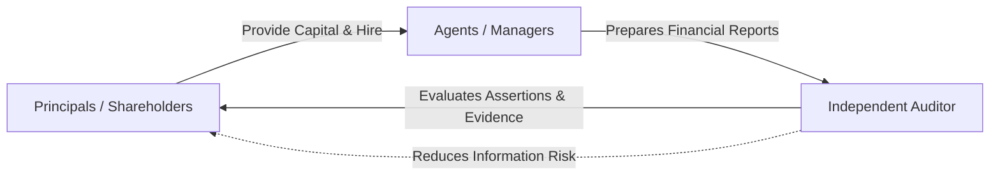
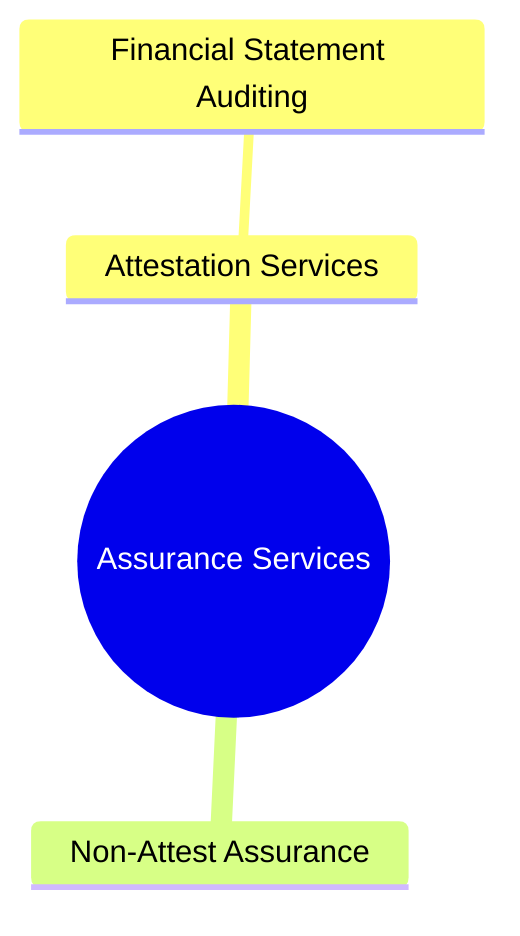

# Conceptual Foundations of Assurance & Auditing

> [!abstract] Curriculum & Syllabus Context
>
> - **Course:** ACC 305 Auditing and Assurance
> - **Module:** Module 1: Conceptual Foundations of Assurance & Auditing
> - **Target Reading:** Messier (11e) Ch. 1; ICAB Certificate Manual Ch. 1; ICAB Professional Manual Ch. 1; ISA 200
> - **Syllabus Focus:** Nature, definition, and objectives of an assurance engagement; 5 elements of assurance; financial statement audit objectives under ISA 200; demand for auditing, agency theory, information asymmetry, and cost of capital model; house inspector analogy; assurance vs. attestation vs. audit; reasonable vs. limited vs. no assurance; inherent limitations of an audit; expectations gap; GAAS principles; and professional skepticism.

---

### 1. Nature, Definition, Objectives, and Scope of an Audit
#### 1.1 Formal Definition of an Assurance Engagement
> [!info] Key Definition
>
> An **assurance engagement** is defined under ISAE 3000 and the IAASB International Framework for Assurance Engagements as an engagement in which a practitioner aims to obtain sufficient appropriate evidence in order to express a conclusion designed to enhance the degree of confidence of the intended users (other than the responsible party) about the outcome of the evaluation or measurement of a subject matter against criteria.

#### 1.2 The Five Key Elements of an Assurance Engagement
Every assurance engagement must exhibit the following five fundamental elements:
1. **A Three-Party Relationship**:
   - **The Practitioner**: The qualified accounting professional (e.g., CPA or Chartered Accountant) who performs the engagement and provides the assurance report.
   - **The Responsible Party**: The party (e.g., company management or the board of directors) responsible for preparing the subject matter or subject matter information.
   - **The Intended Users**: The individuals or groups (e.g., shareholders, investors, lenders, regulators) for whom the practitioner prepares the assurance report.
2. **An Appropriate Underlying Subject Matter**:
   - The specific phenomenon being evaluated or measured. This can take various forms:
     - *Financial performance or condition* (e.g., historical or prospective financial statements).
     - *Non-financial performance or conditions* (e.g., Key Performance Indicators, sustainability metrics, environmental impacts).
     - *Systems and processes* (e.g., internal control systems, IT security infrastructure).
     - *Behavior or compliance* (e.g., corporate governance compliance, legal and regulatory adherence).
3. **Suitable Criteria**:
   - The benchmarks, standards, or rules used to evaluate or measure the subject matter.
   - Examples include International Financial Reporting Standards (IFRS), US GAAP, the Companies Act 1994, or specific environmental reporting frameworks.
   - Suitable criteria must exhibit relevance, completeness, reliability, neutrality, and understandability.
4. **Sufficient Appropriate Evidence**:
   - > [!info] Key Definition
     > **Sufficiency** is the quantitative measure of evidence (sample size), determined by the assessed risk of material misstatement and the overall quality of evidence.
   - > [!info] Key Definition
     > **Appropriateness** is the qualitative measure of evidence, encompassing its **relevance** (logical connection to the assertion) and **reliability** (source, nature, and independence).
5. **A Written Assurance Report**:
   - A formal report issued by the practitioner expressing a conclusion that conveys the level of assurance obtained (reasonable or limited) to the intended users.
#### 1.3 Formal Definition and Overall Objectives of a Financial Statement Audit
> [!info] Key Definition
>
> As defined by the American Accounting Association (AAA) and codified in ISA 200 / AU-C 200, **financial statement auditing** is a systematic process of objectively obtaining and evaluating evidence regarding assertions about economic actions and events to ascertain the degree of correspondence between those assertions and established criteria, and communicating the results to interested users.

Under **ISA 200 (Overall Objectives of the Independent Auditor)**, the overall objectives of the auditor are:
1. To obtain **reasonable assurance** about whether the financial statements as a whole are free from material misstatement, whether due to fraud or error, thereby enabling the auditor to express an opinion on whether the financial statements are prepared, in all material respects, in accordance with an applicable financial reporting framework (e.g., IFRS or GAAP).
2. To report on the financial statements and communicate as required by International Standards on Auditing (ISAs), in accordance with the auditor's findings.

---
### 2. The Demand for Auditing and Assurance Services: Economic Rationale
#### 2.1 The Principal-Agent Relationship and Agency Theory
In modern corporate governance, the separation of ownership and control gives rise to the **principal-agent relationship**:
- **Principals (Absentee Owners / Stockholders)** provide investment capital but do not participate in the daily operations of the business.
- **Agents (Professional Managers)** are hired by principals to manage the corporation's resources and fulfill a stewardship function.

#### 2.2 Theoretical Conflicts: Information Asymmetry, Moral Hazard, and Information Risk
1. **Information Asymmetry**: Managers possess direct operational access and far superior knowledge regarding the company's true financial condition, operational efficiency, and future prospects compared to absentee shareholders.
2. **Conflict of Interest / Moral Hazard**: Managers may be motivated by self-interest (e.g., maximizing executive compensation, meeting earnings targets for bonuses, securing career advancement) to misrepresent or overstate financial results, conflicting with the shareholders' objective of long-term wealth maximization.
3. **Information Risk**: The risk that financial information prepared and distributed by management is materially false, misleading, incomplete, or inaccurate.
#### 2.3 Mathematical Model of Information Risk and the Cost of Capital
A business entity seeking external capital (debt or equity) incurs a total cost of capital. For debt financing, the interest rate $R$ charged by lenders can be decomposed into three distinct risk components:

> [!quote] Formula & Derivation
>
> $$R = R_f + R_b + R_i$$

Where:
- $R_f$ = **Risk-free interest rate** (the return on risk-free securities such as short-term government treasury bills).
- $R_b$ = **Business / Credit risk premium** (the risk that the borrower will default due to economic downturns, industry conditions, or poor management decisions).
- $R_i$ = **Information risk premium** (the risk that the financial statements used to evaluate the borrower's creditworthiness contain material misstatements).

When an independent audit is performed, information risk ($R_i$) is significantly reduced toward zero ($R_i \to 0$), thereby directly reducing the total required rate of return or cost of capital $R$:

> [!quote] Formula & Derivation
>
> $$\lim_{R_i \to 0} R = R_f + R_b$$

By reducing the cost of capital, auditing adds tangible economic value to both the audited entity and capital markets.
#### 2.4 The House Inspector Analogy
To intuitively grasp the economic role of an auditor, Messier et al. present the **House Inspector Analogy**:
- **Scenario**: A prospective home buyer (principal) wants to buy a house from a seller (agent).
- **Conflict & Information Asymmetry**: The seller knows about hidden structural defects (leaky roof, faulty wiring) but has an incentive to hide them to get a higher selling price.
- **Solution**: The buyer hires an independent, competent, and objective house inspector (auditor) to verify the seller's claims (assertions).
- **Core Desirable Characteristics of the Inspector/Auditor**:
  1. **Competence**: Possesses the technical expertise, training, and experience to evaluate the subject matter.
  2. **Objectivity**: Free from bias, conflicts of interest, or influence from the seller.
  3. **Integrity / Honesty**: Conducts the evaluation diligently and reports all findings truthfully.

---
### 3. Relationships Among Auditing, Attestation, and Assurance Services
#### 3.1 Conceptual Hierarchy
Assurance services, attestation services, and financial statement auditing form a nested conceptual hierarchy, where each inner circle represents a specialized subset of the broader outer category:

#### 3.2 Detailed Comparison Matrix

| Attribute | Financial Statement Audit | Attestation Engagement | Non-Attest Assurance Service |
| :--- | :--- | :--- | :--- |
| **Primary Scope** | Historical Financial Statements | Specific written assertions or subject matter | Broad financial and non-financial data/systems |
| **Established Criteria** | Applicable Financial Reporting Framework (IFRS / US GAAP) | Suitable criteria (e.g., contract terms, regulatory standards) | Broad criteria or user-defined benchmarks |
| **Nature of Output** | Formal Audit Report expressing an opinion on fair presentation | Attestation Report (Examination, Review, or AUP) | Written or oral advisory report on information quality |
| **Level of Assurance** | Reasonable Assurance (High) | Reasonable, Limited, or None (AUP) | Varies (often customized per user needs) |

#### 3.3 Levels of Assurance Comparison
1. **Reasonable Assurance (High, Positive Form of Conclusion)**:
   - Obtained in a statutory audit or examination.
   - **Form of Wording**: *"In our opinion, the financial statements present fairly, in all material respects..."*
   - Requires extensive testing (understanding entity, risk assessment, tests of controls, substantive procedures).
2. **Limited Assurance (Moderate/Meaningful, Negative Form of Conclusion)**:
   - Obtained in review engagements (e.g., ISRE 2400 / ISRE 2410).
   - **Form of Wording**: *"Based on our review, nothing has come to our attention that causes us to believe that these financial statements do not present fairly..."*
   - Procedures are primarily restricted to inquiry and analytical procedures.
3. **No Assurance (Agreed-Upon Procedures / Compilations)**:
   - **Agreed-Upon Procedures (ISRS 4400)**: Practitioner performs specific procedures agreed with the engaging party and reports factual findings without expressing an opinion or conclusion.
   - **Compilation Engagements (ISRS 4410)**: Practitioner assists management in preparing and presenting financial information without gathering evidence or offering assurance.

---
### 4. Inherent Limitations of an Audit & The Expectations Gap
#### 4.1 Inherent Limitations of an Audit
> [!warning] Exam Pitfall / Exception
>
> Under ISA 200, an auditor cannot provide **absolute assurance** (i.e., a 100% guarantee that financial statements are free from all misstatements) due to three major inherent limitations:

1. **Nature of Financial Reporting**: The preparation of financial statements involves significant management judgment, subjective accounting estimates, and choices among acceptable accounting methods (e.g., fair value determinations, provisions).
2. **Nature of Audit Procedures**:
   - Audit evidence is persuasive rather than conclusive.
   - Management or third parties may intentionally or unintentionally fail to provide complete information (fraud, collusion, forgery).
   - Auditors do not possess specific legal powers of search or execution.
3. **Timeliness and Balance Between Benefit and Cost**:
   - Users expect the audit report within a reasonable timeframe and at a reasonable cost.
   - It is economically unfeasible and practically impossible to test 100% of transactions; auditors must rely on audit sampling.
#### 4.2 The Expectations Gap
> [!info] Key Definition
>
> The **expectations gap** is the divergence between the public's/users' expectations of what an audit delivers and what an audit actually delivers under professional standards.

| Public Expectations | Audit Reality (ISA Framework) |
| :--- | :--- |
| **1. Auditor guarantees accuracy (100% precision).** | 1. Auditor provides reasonable assurance (materiality exists). |
| **2. Auditor tests all transactions.** | 2. Auditor tests samples. |
| **3. Auditor will detect ALL fraud.** | 3. Primary responsibility for fraud rests with management; auditor assesses material risk. |
| **4. Audit guarantees company's future solvency.** | 4. Audit is not a guarantee of future going concern. |

**Mechanisms to Bridge the Gap**:
- Clear, standardized wording in **Audit Engagement Letters** (ISA 210) defining management vs. auditor responsibilities.
- Expanded **Auditor's Reports** (ISA 700 / PCAOB AS 3101) detailing the scope of the audit, management's and auditor's responsibilities, and Key Audit Matters (KAMs) / Critical Audit Matters (CAMs).

---
### 5. Generally Accepted Auditing Standards (GAAS) & Professional Framework
#### 5.1 The Principles Underlying an Audit (AICPA / IAASB Alignment)
The traditional 10 GAAS (General, Fieldwork, Reporting standards) have been modernized into the **Principles Underlying an Audit Conducted in Accordance with GAAS** (aligned with ISA 200):
1. **Purpose and Premise of an Audit**:
   - **Purpose**: Provide financial statement users with an opinion on whether financial statements are presented fairly in all material respects in accordance with the reporting framework.
   - **Premise**: Management and those charged with governance acknowledge their responsibility for preparing the financial statements, maintaining internal control, and providing the auditor with unrestricted access to information and personnel.
2. **Responsibilities of the Auditor**:
   - Possess appropriate **competence and capabilities** to perform the audit.
   - Comply with relevant **ethical requirements** (including independence in mind and appearance).
   - Maintain **professional skepticism** and exercise **professional judgment** throughout planning and performance.
3. **Performance (Auditor Actions)**:
   - Obtain **reasonable assurance** about whether financial statements are free of material misstatement.
   - Plan work and properly supervise assistants.
   - Determine and apply appropriate **materiality levels**.
   - Identify and assess **risks of material misstatement (RMM)** based on an understanding of the entity, its environment, and internal control.
   - Obtain **sufficient appropriate audit evidence** in response to assessed risks.
4. **Reporting**:
   - Express a written opinion based on evaluation of audit evidence obtained, or state that an opinion cannot be expressed.
#### 5.2 Professional Skepticism and Professional Judgment
- > [!info] Key Definition
  > **Professional Skepticism**: An attitude that includes a questioning mind, being alert to conditions indicating possible misstatement due to error or fraud, and a critical assessment of audit evidence.
  - Requires critically evaluating evidence that contradicts management claims, questioning the reliability of documents, and not assuming management is unquestionably honest or dishonest.
- > [!info] Key Definition
  > **Professional Judgment**: The application of relevant training, knowledge, and experience in making informed decisions about appropriate courses of action during the audit engagement.
  - Essential in establishing materiality, evaluating risk, determining sample sizes, assessing management estimates, and forming audit conclusions.

---
### 6. Emerging Horizons: Sustainability Assurance & Audit Data Analytics (ADA)
#### 6.1 Sustainability and ESG Assurance
1. **Growing Global Demand**: Stakeholders demand independent verification of corporate Environmental, Social, and Governance (ESG) disclosures, carbon emissions, and climate-related financial risks.
2. **Regulatory & Framework Developments**:
   - **International Sustainability Standards Board (ISSB)**: Issued **IFRS S1** (General Requirements for Disclosure of Sustainability-related Financial Information) and **IFRS S2** (Climate-related Disclosures).
   - **Task Force on Climate-related Financial Disclosures (TCFD)**: Organizes disclosures around 4 pillars: Governance, Strategy, Risk Management, and Metrics & Targets.
   - **ISSA 5000 (General Requirements for Sustainability Assurance Engagements)**: The IAASB's overarching standard designed for both limited and reasonable sustainability assurance engagements.
#### 6.2 Audit Data Analytics (ADA) and Financial Technology
1. > [!info] Key Definition
   > **Audit Data Analytics (ADA)** is the science and art of discovering and analyzing patterns, deviations, inconsistencies, and extracting other useful information in data underlying or related to the subject matter of an audit through analysis, modeling, and visualization.
2. **Impact on Audit Methodology**:
   - Enables 100% population testing rather than relying solely on traditional sampling.
   - Enhances risk identification through automated anomaly detection, trend visualizations, and 3-way matching of transactions (Orders, Goods Receipts, Invoices).

---
### 7. Comprehensive Practical Walkthrough & Mathematical Illustration
> [!example] Numerical Problem
>
> #### Scenario: Cost of Capital & Sample Risk Assessment
> **Company XYZ** is seeking a $\$10,000,000$ bank loan. The bank evaluates the borrowing rate based on the risk breakdown formula:
> $$R = R_f + R_b + R_i$$
> - Risk-free rate ($R_f$) = $4.0\%$
> - Business risk premium ($R_b$) = $3.5\%$
> - Information risk premium without audit ($R_i$) = $3.0\%$
> **Calculations**:
> 1. **Borrowing Rate Without Audit**:
>    $$R_{\text{unaudited}} = 4.0\% + 3.5\% + 3.0\% = 10.5\%$$
>    $$\text{Annual Interest Expense} = \$10,000,000 \times 10.5\% = \$1,050,000$$
> 2. **Borrowing Rate With Independent Statutory Audit**:
>    By providing an audited financial statement with an unmodified opinion, $R_i$ drops to $0.2\%$:
>    $$R_{\text{audited}} = 4.0\% + 3.5\% + 0.2\% = 7.7\%$$
>    $$\text{Annual Interest Expense} = \$10,000,000 \times 7.7\% = \$770,000$$
> 3. **Net Annual Economic Savings**:
>    $$\text{Savings} = \$1,050,000 - \$770,000 = \$280,000 \text{ per year}$$
>    If the audit fee is $\$50,000$, the company achieves a net savings of $\$280,000 - \$50,000 = \$230,000$, illustrating the direct economic demand for auditing services.