# The Completion Phase & Wrap-Up Procedures

> [!abstract] Curriculum & Syllabus Context
>
> - **Course:** ACC 305 Auditing and Assurance
> - **Module:** Module 10: The Completion Phase & Wrap-Up
> - **Target Reading:** ISA 520; ISA 560; ISA 570 (Revised); ISA 580; ISA 450; ISA 501; Messier (11e) Ch. 17; ICAB Professional Ch. 12
> - **Syllabus Focus:** Completion phase architecture; working paper review hierarchy (senior, manager, partner, EQR); experienced auditor test; final analytical procedures under ISA 520; contingent liabilities under IAS 37 / ASC 450 (probability/estimation matrix); search for unrecorded contingencies; the legal letter (ISA 501 letter of audit inquiry) and scope limitations; review of commitments and onerous contracts; subsequent events under ISA 560 / IAS 10 (Type I recognized vs. Type II unrecognized, Period 1 active vs. Period 2 & 3 passive responsibilities, dual dating vs. re-dating); going concern evaluation under ISA 570 (Revised) (12-month horizon, four categories of indicators, evaluating management mitigation plans, audit report impact matrix); final evaluation of misstatements under ISA 450 (factual, judgmental, projected, qualitative triggers); and written representations wrap-up.

---

### Section 1: Overview & Architecture of the Completion Phase
The completion phase represents the final synthesis of the financial statement audit. Once field testing across individual business processes (revenue, purchasing, payroll, inventory, financing, and cash) is finished, the engagement team enters the completion phase to evaluate the cumulative evidence, address pervasive financial statement issues, and form the audit opinion.

According to **ISA 520**, **ISA 230**, **Messier 11e (Chapter 17)**, and the **ICAB Professional Level Manual (Chapter 12)**, the completion phase has two distinct but interconnected focuses:
1. **Evaluating the Financial Statements**: Assessing overall presentation, disclosures, compliance with applicable financial reporting frameworks (IFRS/IAS or national GAAP), and financial statement consistency.
2. **Evaluating the Audit Evidence Gathered**: Ensuring that sufficient appropriate audit evidence has been accumulated to reduce Audit Risk to an acceptably low level and support the proposed audit opinion.

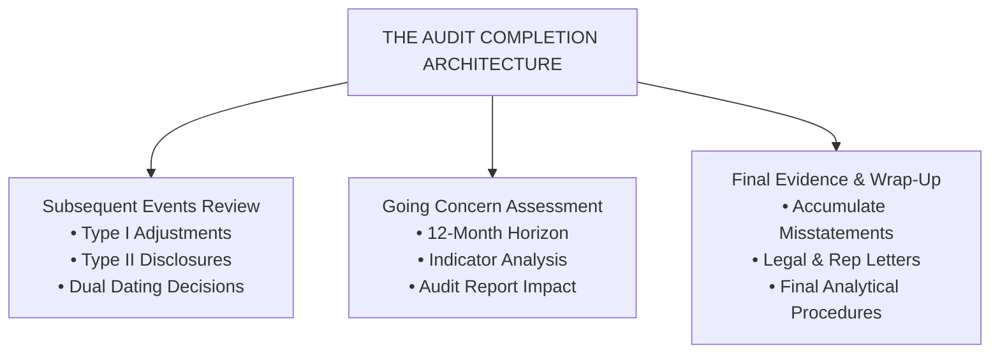

---
#### 1. The Working Paper Review Hierarchy
Quality management standards (**ISQM 1**, **ISQM 2**, **ISA 220 Revised**) dictate that all audit work must be subjected to a rigorous, multi-tiered review hierarchy prior to dating and issuing the auditor's report.

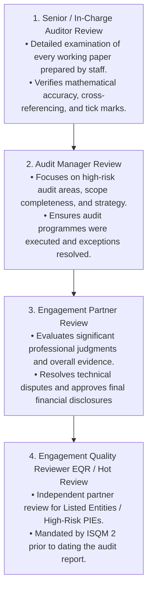

##### The "Experienced Auditor" Test (ISA 230.8)
> [!info] Key Definition
>
> Audit documentation must be compiled such that an experienced auditor, having no previous connection with the audit, can understand:
> 1. The nature, timing, and extent of procedures performed.
> 2. The results of the procedures and the audit evidence obtained.
> 3. Significant matters arising during the audit, the conclusions reached, and significant professional judgments made in reaching those conclusions.

---
#### 2. Final Analytical Procedures (ISA 520 & Messier Ch 17)
While analytical procedures are mandatory during audit planning (**ISA 315**) and optional as substantive procedures (**ISA 520**), **ISA 520.6** mandates the performance of analytical procedures near the very end of the audit.
##### A. Objective & Purpose
Final analytical procedures serve as an overall **"smell test"** or sanity check of the audited financial statements. Their primary goals are to:
- Assist the auditor in forming an overall conclusion as to whether the financial statements are consistent with the auditor's understanding of the entity and its environment.
- Highlight unexpected or unusual balances or relationships that were not identified during earlier audit testing.
- Evaluate whether the evidence gathered for high-risk or unusual items identified during planning was sufficient to explain the observed financial fluctuations.
##### B. Operational Methodology
Final analytical procedures involve recalculating key financial ratios and comparing audited current-year figures against:
1. Prior year audited financial statements.
2. Client-prepared budgets and forecasts.
3. Industry benchmarks and macroeconomic indicators.

> [!warning] Exam Pitfall / Exception
>
> If unexpected fluctuations or inconsistencies are discovered during final analytical procedures, the auditor **cannot** simply ask management for an explanation without corroboration. The auditor must:
> 1. Search the current audit working papers to see if existing evidence already explains the fluctuation.
> 2. If unexplained, perform additional substantive procedures or tests of details to obtain sufficient appropriate evidence before signing the audit report.

---
### Section 2: Review for Contingent Liabilities & Commitments
#### 1. Accounting and Auditing Framework for Contingent Liabilities
> [!info] Key Definition
>
> A **contingent liability** (or loss contingency) is defined under **IAS 37 (*Provisions, Contingent Liabilities and Contingent Assets*)** and **FASB ASC Topic 450 (*Contingencies*)** as an existing condition, situation, or set of circumstances involving uncertainty as to possible loss to an entity that will ultimately be resolved when one or more future events occur or fail to occur.

##### A. Classification and Treatment Matrix
The required accounting and financial reporting treatment depends on the probability of the future outcome and the ability to reasonably estimate the monetary loss:

| Probability of Future Outcome | Ability to Reasonably Estimate Monetary Loss | Financial Statement & Audit Treatment |
| :--- | :--- | :--- |
| **Probable** ($> 50\%$ likelihood / likely to occur) | **Can be Reasonably Estimated** | **Accrue Provision**: Record expense in Profit or Loss and recognize liability on Statement of Financial Position. Disclose details in notes. |
| **Probable** ($> 50\%$ likelihood / likely to occur) | **Cannot be Reasonably Estimated** | **Footnote Disclosure Mandatory**: Disclose nature of contingency and explain why estimate cannot be made. |
| **Reasonably Possible** ($10\% - 50\%$ likelihood) | Estimate Possible or Not Possible | **Footnote Disclosure Mandatory**: Describe nature and provide estimated range or state estimate cannot be made. |
| **Remote** ($< 10\%$ likelihood / highly unlikely) | Any Condition | **No Action Required**: Neither accrual nor disclosure required (exception: bank guarantees and legal indemnities require disclosure). |

---
#### 2. Audit Procedures to Identify Contingent Liabilities
Because contingent liabilities are frequently omitted from accounting ledgers, auditors execute specific procedures during the completion phase to uncover unrecorded loss contingencies:

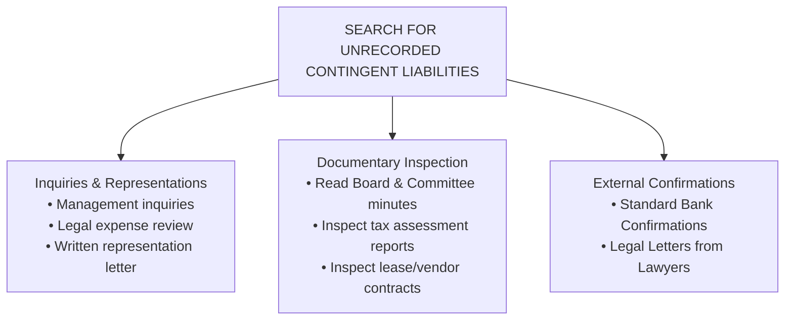

##### Specific Action Steps:
1. **Inquire of Management**: Interview executive management and in-house legal counsel regarding pending litigation, claims, tax assessments, and product warranty claims.
2. **Review Minutes of Meetings**: Inspect board of directors, audit committee, and shareholder meeting minutes for discussions of lawsuits, regulatory disputes, or contractual defaults.
3. **Examine Legal Expenses**: Analyze general ledger legal and professional fee accounts. Vouch invoices to identify law firms retained by the client and the nature of legal services billed.
4. **Inspect Regulatory & Tax Documents**: Review correspondence with tax authorities (e.g., NBR, IRS) and industry regulators for threatened penalties or back-tax assessments.
5. **Obtain Bank Confirmations**: Review standard bank confirmations for contingent liabilities, such as loan guarantees provided to subsidiaries or outstanding letters of credit.

---
#### 3. The Legal Letter (Letter of Audit Inquiry) — ISA 501 & Messier Ch 17
The primary audit procedure for corroborating management's representations regarding litigation, claims, and assessments is the **Legal Letter** (Audit Inquiry Letter to External Legal Counsel).

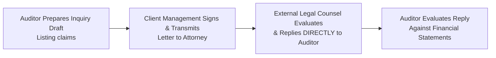

##### A. Contents of the Legal Letter
The letter is drafted by the auditor, printed on the **client's letterhead**, signed by a corporate officer (e.g., CEO or CFO), and sent by the auditor directly to all law firms retained during the year. It requests the attorney to communicate directly with the auditor regarding:
1. A list provided by management of all pending or threatened litigation, claims, and assessments.
2. An evaluation by the attorney of the likelihood of an unfavorable outcome for each listed claim.
3. An estimate by the attorney of the financial loss range or maximum exposure, if quantifiable.
4. A statement requesting counsel to identify any unlisted or unasserted claims where management has been advised that assertion is probable.
##### B. Handling Legal Counsel Refusal or Scope Limitations
> [!warning] Exam Pitfall / Exception
>
> If an attorney refuses to furnish the requested information or declines to respond to the audit inquiry:
> - It constitutes a **Scope Limitation** under **ISA 705 (Revised)**.
> - If the attorney's refusal prevents the auditor from obtaining sufficient appropriate audit evidence on a material contingent liability, the auditor **must** issue a **Qualified Opinion ("Except for")** or a **Disclaimer of Opinion**.

---
#### 4. Audit Review of Commitments
**Commitments** represent contractual agreements to execute future transactions under specified terms (e.g., long-term raw material purchase commitments, lease agreements, capital expenditure contracts, and foreign currency forward hedges).
- *Auditing Focus*: Auditors inspect commitments during completion to verify whether market price drops have created **onerous contracts** under **IAS 37**.
- *Accounting Treatment*: If a purchase commitment forces the entity to buy inventory at fixed prices above current market value, the auditor verifies that an **inventory valuation loss** and corresponding commitment liability are recognized in the current period.

---
### Section 3: Subsequent Events Review (ISA 560 & IAS 10 / ASC 855)
#### 1. Taxonomy of Subsequent Events
> [!info] Key Definition
>
> Subsequent events are events or transactions that occur between the date of the financial statements (balance sheet date) and the date of the auditor's report, as well as facts that become known to the auditor after the date of the auditor's report.

Under **IAS 10 (*Events After the Reporting Period*)** and **ISA 560 (*Subsequent Events*)**, subsequent events are classified into two distinct categories:

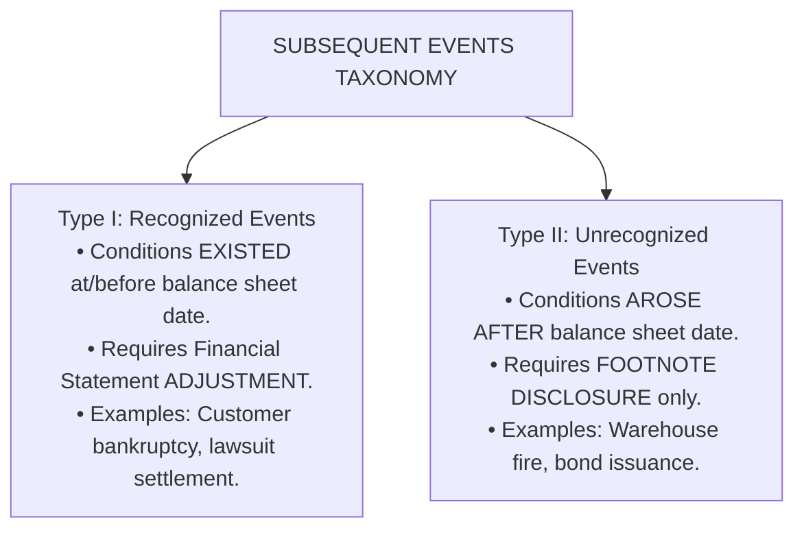

| Subsequent Event Category | Operational Definition & Criteria | Required Accounting & Reporting Action |
| :--- | :--- | :--- |
| **Type I Event (Recognized Event)** | Events that provide **additional evidence** regarding conditions that **existed at or before** the end of the reporting period. | **Adjust Financial Statements**: Recalculate and adjust line items in the financial statements (Statement of Financial Position and Statement of Profit or Loss) and update related disclosures. |
| **Type II Event (Unrecognized Event)** | Events that provide evidence regarding conditions that **arose entirely after** the end of the reporting period. | **Footnote Disclosure**: No numerical adjustment to financial statement line items. Must disclose nature of event and estimated financial effect in notes if material. |

##### Illustrative Examples Matrix:
1. **Type I Adjusting Examples**:
   - Settlement of a court case after the balance sheet date that confirms a pre-existing obligation.
   - Insolvency of a major trade receivable customer occurring post-year-end (confirms valuation impairment existing at year-end).
   - Sale of inventory post-year-end at prices below cost (provides evidence of lower-of-cost-and-NRV impairment at balance sheet date).
2. **Type II Non-Adjusting Examples**:
   - Destruction of a major manufacturing plant or warehouse by fire or flood after the balance sheet date.
   - Major corporate merger, acquisition, or divestiture executed post-year-end.
   - Issuance of significant long-term debentures or common stock post-year-end.
   - Decline in market value of investments occurring after the balance sheet date.

---
#### 2. Chronological Time Periods & Auditor Responsibilities
The auditor's responsibilities for identifying and responding to subsequent events depend on the specific time window in which the event occurs:

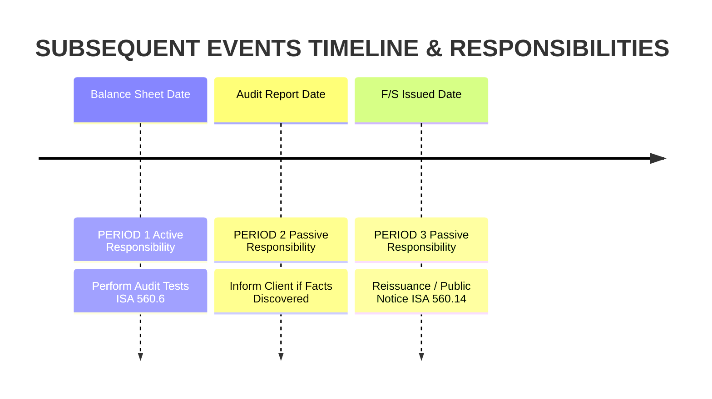

##### Period 1: Balance Sheet Date to Date of Auditor's Report
- **Auditor's Duty**: **Active Responsibility**. The auditor must design and execute specific audit procedures to identify all material subsequent events requiring adjustment or disclosure.
- **Mandatory Procedures (ISA 560.6-9)**:
  1. Obtain an understanding of management procedures established to ensure subsequent events are identified.
  2. Read minutes of shareholders, board of directors, and executive committee meetings held after year-end.
  3. Read the entity's latest interim financial statements and management accounts post-year-end.
  4. Inquire of management and legal counsel regarding ongoing claims, asset sales, or new debt commitments.
  5. Inspect post-year-end journals, cash disbursements, and cash receipts journals for unusual entries.
##### Period 2: Date of Auditor's Report to Date Financial Statements are Issued
- **Auditor's Duty**: **Passive Responsibility**. The auditor has no obligation to perform audit procedures regarding the financial statements during this period.
- **Action Required**: If a fact becomes known to the auditor that, had it been known at the report date, might have caused the auditor to amend the report:
  1. Discuss the matter immediately with management and those charged with governance.
  2. Determine if financial statements require amendment.
  3. If management amends the financial statements, perform necessary procedures on the amendment, re-date or dual-date the report, and issue a new auditor's report.
  4. If management **refuses** to amend the statements, notify management and governance that the report must not be issued, and take legal action to prevent reliance on the report.
##### Period 3: After Financial Statements Have Been Issued
- **Auditor's Duty**: **Passive Responsibility**.
- **Action Required**: If facts become known after issuance that existed at the report date and would have altered the opinion:
  1. Discuss with management/governance.
  2. If revised financial statements are issued, verify the revised disclosures, issue a new audit report containing an Emphasis of Matter paragraph, and ensure management notifies existing statement users.

---
#### 3. Dual Dating Mechanics vs. Re-Dating the Report
When a material Type II subsequent event occurs after the audit fieldwork is completed but before the audit report is issued, the auditor faces a choice between **Dual Dating** and **Re-Dating**.

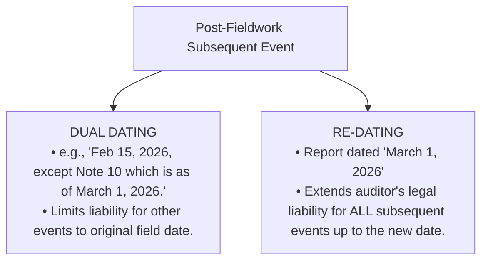

---
### Section 4: Evaluation of Going Concern (ISA 570 Revised & FASB ASU 2014-15)
#### 1. Core Principles & Dual Responsibilities
> [!info] Key Definition
>
> Under the **Going Concern Assumption**, an entity is viewed as continuing in business for the foreseeable future. Financial statements are prepared on a going concern basis unless management either intends to liquidate the entity or cease operations, or has no realistic alternative but to do so.

##### Dual Responsibilities Framework:
- **Management's Obligation**: Primary responsibility to perform a structured evaluation of the entity's ability to continue as a going concern for a period of at least 12 months from the reporting/issuance date.
- **Auditor's Obligation (ISA 570.6)**: Independent responsibility to obtain sufficient appropriate audit evidence regarding, and conclude on, the appropriateness of management's use of the going concern basis of accounting, and to evaluate whether a **material uncertainty** exists.

---
#### 2. Time Horizon Parameters
> [!warning] Exam Pitfall / Exception
>
> - **ISA 570 / ICAB Standard**: The period used by management and evaluated by the auditor must cover **at least 12 months** from the **date of approval / date of the financial statements** (or date of audit report). If management's assessment covers less than 12 months, the auditor **must** request management to extend its assessment period to 12 months.
> - *Refusal Impact*: If management refuses to extend its assessment, the auditor considers the implications for the audit report (constitutes a scope limitation).

---
#### 3. Four Categories of Going Concern Indicators (ISA 570.A3)

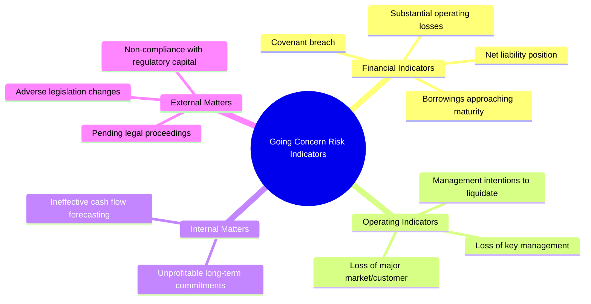

| Indicator Category | Specific Warning Signals & Conditions |
| :--- | :--- |
| **1. Financial Indicators** | • Net liability or net current liability position (negative working capital). • Fixed-term borrowings approaching maturity without realistic prospects of renewal. • Excessive reliance on short-term borrowings to fund long-term assets. • Inability to comply with loan covenant terms (covenant breach). • Substantial operating losses or significant cash outflow from operations. |
| **2. Operating Indicators** | • Management intentions to liquidate the entity or cease operations. • Loss of key management or executive team without replacement. • Loss of a major market, key customer(s), main franchise, or primary supplier. • Labor difficulties, severe strikes, or supply chain bottlenecks. |
| **3. Internal Matters** | • Unprofitable long-term commitments. • Need to significantly revise internal operations or restructure business units. • Ineffective internal controls over cash flow forecasting. |
| **4. External & Regulatory** | • Non-compliance with statutory capital or regulatory capital requirements. • Pending legal or regulatory proceedings that may result in uninsured claims that cannot be met. • Changes in legislation or government policy expected to adversely affect operations. |

---
#### 4. Evaluating Management's Mitigation Plans
When going concern doubts arise, the auditor evaluates management's plans for future action:

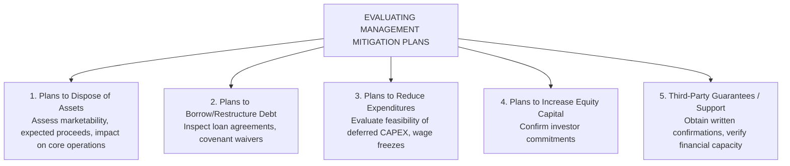

---
#### 5. Impact on Auditor's Report under ISA 570 (Revised)

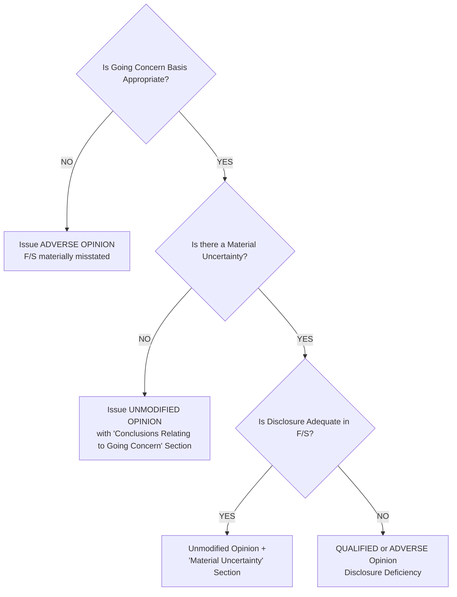

| Going Concern Scenario | Accounting Treatment | Audit Opinion Type | Audit Report Formatting Impact |
| :--- | :--- | :--- | :--- |
| **Going Concern Appropriate, No Material Uncertainty** | Standard Going Concern basis. | **Unmodified Opinion** | Include mandatory **"Conclusions Relating to Going Concern"** section describing auditor responsibilities. |
| **Going Concern Appropriate, Material Uncertainty Exists, DISCLOSURE IS ADEQUATE** | Full disclosure in notes detailing events and mitigation plans. | **Unmodified Opinion** | Include a separate section headed **"Material Uncertainty Related to Going Concern"** drawing attention to the note disclosure. Opinion is NOT modified. |
| **Going Concern Appropriate, Material Uncertainty Exists, DISCLOSURE IS INADEQUATE** | Incomplete or omitted note disclosure. | **Qualified ("Except for") or Adverse Opinion** | Modify opinion for GAAP departure under **ISA 705**. State in "Basis for Opinion" section that material uncertainty is inadequately disclosed. |
| **Going Concern Inappropriate (Entity to be Liquidated)** | Prepared on Going Concern basis. | **Adverse Opinion** | Express Adverse opinion stating financial statements do not give a true and fair view. |
| **Going Concern Inappropriate, but Prepared on Liquidation / Break-Up Basis** | Financial statements adjusted to realizable values with full note disclosure. | **Unmodified Opinion** | Add an **Emphasis of Matter** paragraph highlighting that accounts are prepared on a liquidation basis. |

---
### Section 5: Written Representations & Final Misstatement Evaluation
#### 1. Written Representations (ISA 580)
> [!info] Key Definition
>
> A **Written Representation** is a written statement by management provided to the auditor to confirm certain matters or to support other audit evidence.

##### A. Operational Rules under ISA 580
1. **Mandatory General Representations**: Management must explicitly confirm in writing that it has:
   - Fulfilled its responsibility for the preparation and fair presentation of financial statements in accordance with the applicable reporting framework.
   - Provided the auditor with all relevant information and unrestricted access.
   - Recorded and reflected all transactions in the financial statements.
2. **Evidential Limitation**: Written representations provide necessary audit evidence, but they **do not provide sufficient appropriate audit evidence on their own** regarding any of the matters with which they deal. They cannot substitute for other higher-quality evidence that should be available.
3. **Date and Period Covered**: The representation letter must be dated **as near as practicable to, but not after, the date of the auditor's report**. It must cover all financial statements and periods referred to in the report.
##### B. Handling Management Refusal to Provide Representations
> [!warning] Exam Pitfall / Exception
>
> If management refuses to provide the mandatory general representations:
> - The auditor **cannot** issue an unmodified opinion.
> - Under **ISA 580.19**, the auditor **shall disclaim an opinion** on the financial statements or **withdraw** from the engagement.

---
#### 2. Final Evaluation of Misstatements (ISA 450)
Under **ISA 450 (*Evaluation of Misstatements Identified During the Audit*)**, the auditor must accumulate all misstatements identified during the audit, other than those that are **clearly trivial**.
##### A. Classification of Misstatements:
1. **Factual Misstatements**: Misstatements about which there is no doubt (e.g., mathematical errors, incorrect price extension).
2. **Judgmental Misstatements**: Differences arising from management judgments concerning accounting estimates that the auditor considers unreasonable, or accounting policies considered inappropriate.
3. **Projected Misstatements**: The auditor's best estimate of misstatements in populations, involving the projection of misstatements identified in audit samples to the entire population.
##### B. Quantitative vs. Qualitative Materiality Evaluation
The auditor compares total accumulated uncorrected misstatements against **Performance Materiality ($PM$)** and **Overall Materiality ($OM$)**.

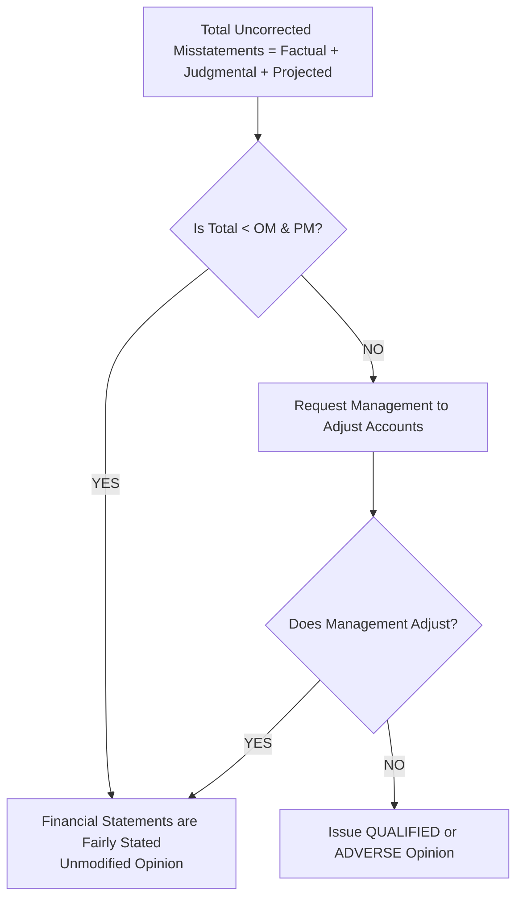

##### Qualitative Materiality Triggers:
An uncorrected misstatement that is quantitatively below $OM$ may still be deemed **material** if it:
- Converts a net loss into a net profit, or vice versa.
- Affects compliance with loan covenants or regulatory capital requirements.
- Increases management compensation by satisfying bonus thresholds.
- Masks a change in earnings trends or affects key performance ratios.

---
### Section 6: Step-by-Step Practical & Numerical Walkthroughs

---

> [!example] Numerical Problem & Case Study
>
> #### Comprehensive Problem 1: Integrated Subsequent Events Evaluation
> **Scenario Context**:
> You are completing the audit of Zenith Electronics Ltd for the year ended December 31, 2025. Audit fieldwork was completed on **February 20, 2026**, and the financial statements are scheduled for issuance on **March 5, 2026**. During the completion review between January 1 and February 20, 2026, the following three independent post-balance-sheet events were identified:
> 1. **Event A (Litigation Settlement)**: On January 18, 2026, a court ruled against Zenith in a patent infringement lawsuit brought by a competitor in 2024. Zenith was ordered to pay $\$800,000$ in damages immediately. As of December 31, 2025, Zenith had recognized a legal provision of $\$300,000$ based on legal advice at that time.
> 2. **Event B (Warehouse Fire)**: On February 5, 2026, a fire completely destroyed Zenith's central distribution warehouse. Inventory valued at $\$1,500,000$ was destroyed. Insurance coverage is expected to reimburse only $\$600,000$.
> 3. **Event C (Customer Bankruptcy)**: On February 12, 2026, Apex Retailers PLC, a major customer carrying a December 31, 2025 trade receivable balance of $\$450,000$, declared bankruptcy due to sudden fraud uncovered at Apex. Zenith's total Allowance for Doubtful Accounts at December 31, 2025, was $\$100,000$ for all customers combined.
> ##### Step 1: Classify Each Event (Type I vs. Type II)
> - **Event A (Lawsuit)**: **Type I Event (Recognized)**. The patent infringement lawsuit existed prior to December 31, 2025. The court ruling provides concrete evidence of the true liability existing at the balance sheet date.
> - **Event B (Warehouse Fire)**: **Type II Event (Unrecognized)**. The fire occurred on February 5, 2026. The condition (fire destruction) arose entirely after the balance sheet date.
> - **Event C (Customer Default)**: **Type I Event (Recognized)**. Although bankruptcy was declared in February, the customer's financial deterioration and outstanding debt existed at December 31, 2025.
> ##### Step 2: Formulate Required Adjustments & Disclosures
> - **Event A Adjustment**: Adjust legal provision upward by $\$500,000$ ($\$800,000 - \$300,000$).
>   $$\text{Dr. Legal Claim Expense (P\&L)} \quad \$500,000$$
>   $$\text{Cr. Provision for Litigation (Liabilities)} \quad \$500,000$$
> - **Event B Disclosure**: No numerical adjustment to December 31, 2025 balance sheet figures. Disclose in the 2025 footnote notes: "On February 5, 2026, a warehouse fire destroyed inventory valued at $\$1.5\text{M}$, resulting in an estimated uninsured net loss of $\$900,000$."
> - **Event C Adjustment**: Record specific bad debt write-off/allowance for Apex Retailers:
>   $$\text{Dr. Bad Debt Expense (P\&L)} \quad \$450,000$$
>   $$\text{Cr. Allowance for Doubtful Accounts} \quad \$450,000$$

---

> [!example] Numerical Problem & Case Study
>
> #### Comprehensive Problem 2: Quantitative Going Concern & Misstatement Analysis
> **Scenario Context**:
> You are auditing Apex Manufacturing Ltd for the year ended December 31, 2025.
> - Overall Materiality ($OM$) = $\$200,000$.
> - Performance Materiality ($PM$) = $\$100,000$ ($50\%$ of $OM$).
> - Clearly Trivial Threshold ($CTT$) = $\$10,000$.
> During fieldwork, the audit team accumulated the following uncorrected misstatements:
> 1. Unrecorded trade payables invoice for raw materials received Dec 28, 2025: $\$60,000$ (Factual).
> 2. Overstatement of inventory valuation due to incorrect overhead allocation: $\$50,000$ (Judgmental).
> 3. Projected overstatement of trade receivables based on MUS sample: $\$40,000$ (Projected).
> ##### Additional Financial Context:
> - Pre-adjustment Net Profit Before Tax = $\$300,000$.
> - Pre-adjustment Current Assets = $\$1,200,000$; Current Liabilities = $\$1,150,000$.
> - Apex has a strict bank loan covenant requiring a **Current Ratio $\ge 1.00$**.
> - Management refuses to adjust any of the three misstatements, arguing that each individual item is below $PM$ ($\$100,000$).
> ---
> ##### Step 1: Accumulate Total Misstatements & Compare to Materiality
> $$\text{Total Accumulated Misstatement} = \$60,000 \text{ (Payables)} + \$50,000 \text{ (Inventory)} + \$40,000 \text{ (Receivables)} = \$150,000$$
> - **Quantitative Evaluation against OM**: Total Misstatement ($\$150,000$) is less than Overall Materiality ($\$200,000$).
> - **Quantitative Evaluation against PM**: Total Misstatement ($\$150,000$) **exceeds** Performance Materiality ($\$100,000$).
> ---
> ##### Step 2: Qualitative Analysis & Loan Covenant Evaluation
> Calculate the impact of uncorrected misstatements on Current Assets, Current Liabilities, and the Current Ratio:
> 1. **Pre-Adjustment Current Ratio**:
>    $$\text{Current Ratio}_{\text{reported}} = \frac{\$1,200,000}{\$1,150,000} = 1.043 \quad (\text{Complies with } \ge 1.00 \text{ covenant})$$
> 2. **Adjusted Figures (reflecting uncorrected misstatements)**:
>    - Adjusted Current Assets = $\$1,200,000 - \$50,000 \text{ (Inventory)} - \$40,000 \text{ (Receivables)} = \$1,110,000$
>    - Adjusted Current Liabilities = $\$1,150,000 + \$60,000 \text{ (Unrecorded Payables)} = \$1,210,000$
> 3. **Adjusted Current Ratio**:
>    $$\text{Current Ratio}_{\text{adjusted}} = \frac{\$1,110,000}{\$1,210,000} = 0.917$$
> ---
> ##### Step 3: Synthesis of Audit Impact & Going Concern Evaluation
> 4. **Loan Covenant Breach**: The adjusted Current Ratio ($0.917$) **violates** the bank's minimum loan covenant of $1.00$.
> 5. **Qualitative Materiality Trigger**: Although $\$150,000$ is quantitatively below $OM$ ($\$200,000$), the misstatement is **qualitatively material** because it masks a debt covenant default.
> 6. **Going Concern Trigger**: The covenant default allows the bank to demand immediate loan recall ($\$2,000,000$ debt due in 2028). Because Apex lacks liquid cash to repay $\$2,000,000$ immediately, this creates a **Material Uncertainty Related to Going Concern**.
> ---
> ##### Step 4: Final Audit Conclusion & Required Report Modification
> - **Action**: The auditor informs management and those charged with governance that the misstatements are material due to qualitative covenant impacts.
> - **If Management Refuses to Adjust**:
>   1. The financial statements are materially misstated for omitting payables, overstating assets, and failing to disclose covenant default and loan reclassification to current liabilities.
>   2. The auditor must issue a **Qualified Opinion ("Except for")** or an **Adverse Opinion** under **ISA 705 (Revised)**.
>   3. The auditor must include a **"Material Uncertainty Related to Going Concern"** paragraph or describe the going concern implications in the "Basis for Qualified/Adverse Opinion" section under **ISA 570 (Revised)**.