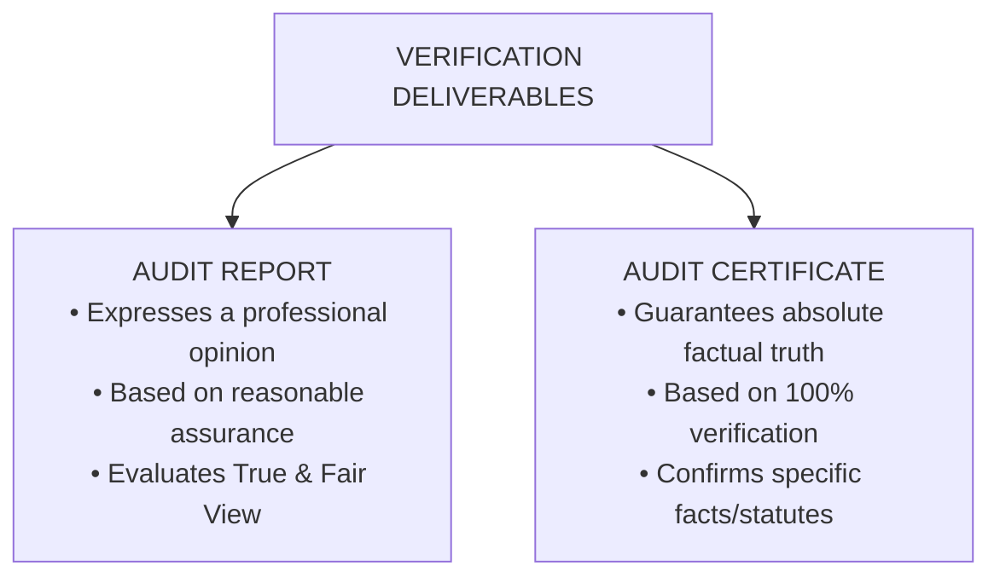
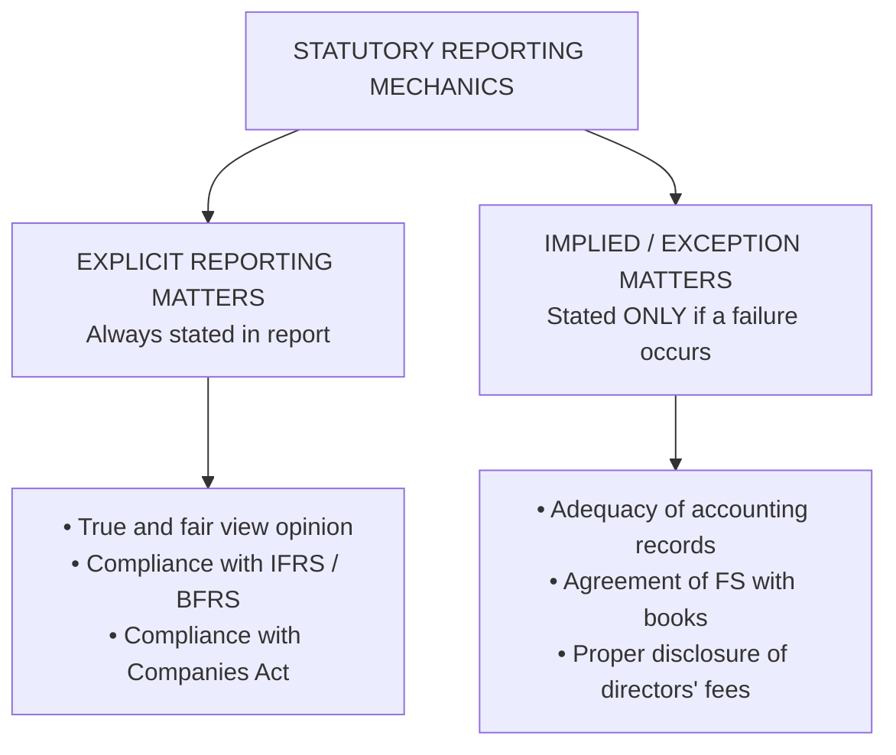
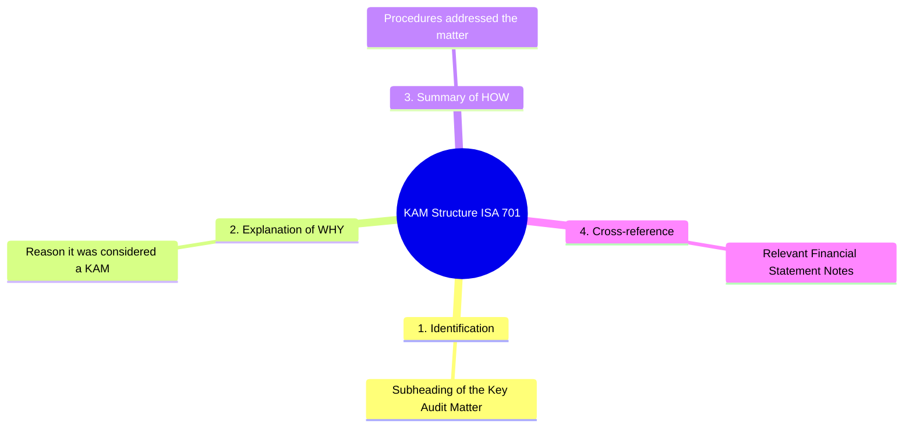
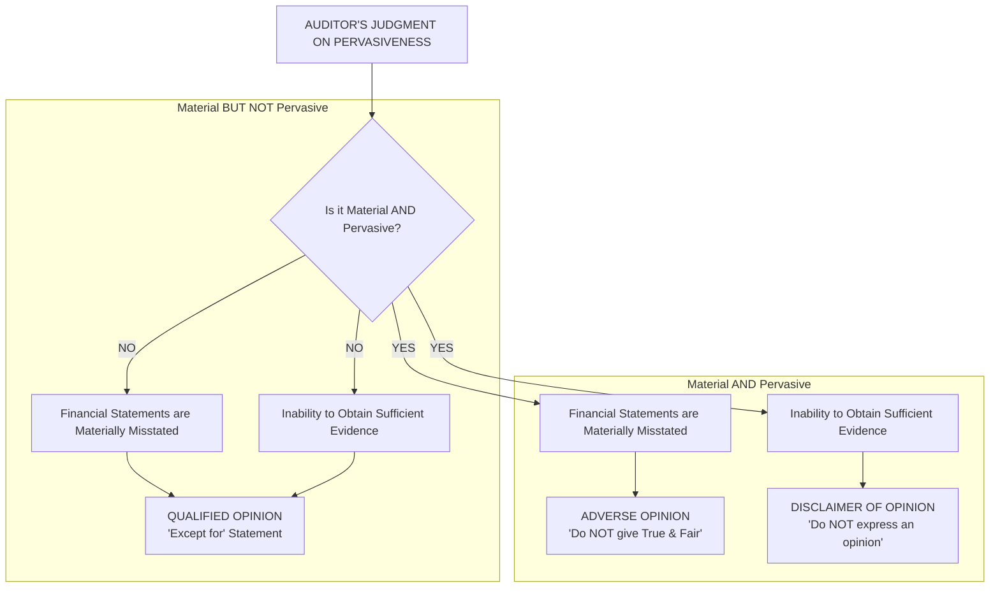
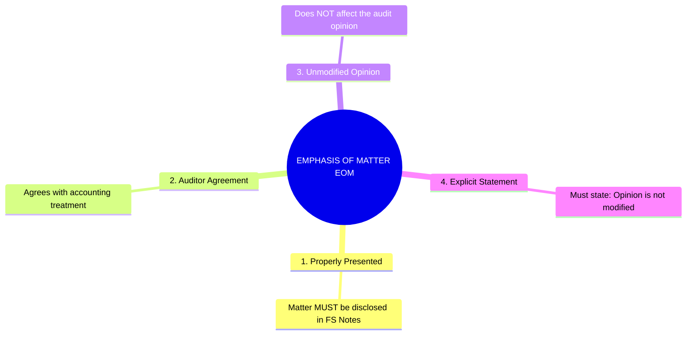
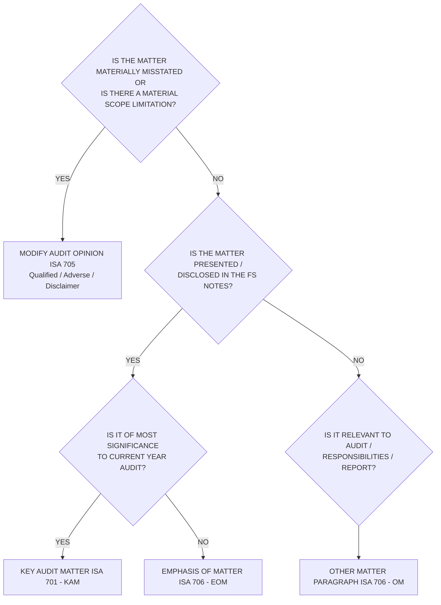

# Audit Reporting: Standards, Structure, & Opinions

> [!abstract] Curriculum & Syllabus Context
>
> - **Course:** ACC 305 Auditing and Assurance
> - **Module:** Module 11: Audit Reporting (The Ultimate Deliverable)
> - **Target Reading:** ISA 700 (Revised); ISA 701; ISA 705 (Revised); ISA 706 (Revised); ISA 720 (Revised); PCAOB AS 3101; Messier (11e) Ch. 18; ICAB Certificate Ch. 4 & 13; ICAB Professional Ch. 13
> - **Syllabus Focus:** Concept and purpose of the audit report vs. audit certificate; true and fair view definition; statutory reporting under Companies Act 1994 (Sections 212 & 213 explicit opinions and implied/exception reporting), FRA 2015, and BSEC CG Code; structure of an unmodified audit report under ISA 700 (Revised) (11 mandatory elements, opinion placed first); ISA 700 vs. PCAOB AS 3101 vs. ISA for LCE; Key Audit Matters (KAMs) under ISA 701 and Critical Audit Matters (CAMs) under AS 3101 (definition, selection decision funnel, mandatory 4-part structure, prohibitions); modified audit opinions under ISA 705 (Revised) (two triggers: material misstatement vs. scope limitation, concept and three dimensions of pervasiveness, opinion modification matrix for qualified, adverse, and disclaimer of opinion, reporting mechanics and KAM omission on disclaimer); Emphasis of Matter (EOM) vs. Other Matter (OM) paragraphs under ISA 706 (Revised); and auditor responsibilities regarding Other Information under ISA 720 (Revised).

---

### Section 1: Conceptual Foundations of Audit Reporting & Statutory Framework
The audit report represents the final, formal deliverable of an independent financial statement audit. It serves as the primary communication channel between the independent auditor and external stakeholders—including shareholders, creditors, financial analysts, regulators, and the general public. Under **ISA 700 (Revised)**, **Messier 11e (Chapter 18)**, **ICAB Certificate Level Manual (Chapters 4 & 13)**, and **ICAB Professional Level Manual (Chapter 13)**, the audit report conveys reasonable assurance regarding whether the financial statements present fairly, in all material respects, or give a true and fair view of the entity's financial position and performance.
#### 1. Concept & Nature of Audit Reports
An audit report is a formal expression of professional opinion based on sufficient appropriate audit evidence. It is vital to distinguish between an **Audit Report** and an **Audit Certificate**:

| Dimension | Audit Report | Audit Certificate |
| :--- | :--- | :--- |
| **Nature of Conclusion** | Expression of an **opinion** based on professional judgment and evaluation of evidence. | Absolute certification of factual accuracy or compliance with specific statutory criteria. |
| **Assurance Level** | **Reasonable Assurance** (high, but not absolute assurance). | **100% Certainty** (factual guarantee; no sampling or materiality thresholds). |
| **Scope & Application** | Full financial statement audits under ISAs / Companies Act. | Specific statutory filings, grant utilization certificates, tax compliance, or regulatory returns. |
| **Standard Wording** | "In our opinion, the accompanying financial statements give a true and fair view..." | "We hereby certify that the statements above are true, correct, and complete according to the books..." |

---
#### 2. The Core Concept of "True and Fair View"
The primary objective of a financial statement audit under the **Companies Act, 1994 (Section 212/213)** and **ISA 700** is to express an opinion on whether the financial statements give a **"True and Fair View"** (or *present fairly, in all material respects*). Although "true" and "fair" are not explicitly defined in statutory law, established auditing and legal precedents define them as follows:
1. **True**:
   - Information is factual, accurate, and supported by objective source documentation.
   - Financial figures are correctly extracted from accounting records and general ledgers without mathematical error or fabrication.
   - The financial statements comply with the accounting policies and relevant statutory frameworks (e.g., IFRS/BFRS, Companies Act 1994).
2. **Fair**:
   - Information is unbiased, neutral, and free from management manipulation or window-dressing.
   - Financial statements reflect the **commercial substance** of underlying transactions rather than merely their legal form (e.g., recognizing substance over form under IAS 8 / IFRS 16).
   - Disclosures are adequate, clear, and relevant, ensuring that financial information is not presented in a misleading or obscuring manner.

---
#### 3. Statutory Reporting Framework under Bangladeshi Law
##### A. The Companies Act, 1994 (Sections 212 & 213):
Under Bangladeshi corporate law, the external auditor has a mandatory statutory duty to report to the members (shareholders) of the company on the accounts examined.
1. **Explicit Statutory Opinions**: The auditor's report must explicitly state:
   - Whether the auditor has obtained all the information and explanations required for the audit.
   - Whether, in the auditor's opinion, the Balance Sheet (Statement of Financial Position) and Profit & Loss Account (Statement of Profit or Loss and Other Comprehensive Income) give a **true and fair view**.
   - Whether the financial statements have been prepared in accordance with applicable accounting standards (IFRS/IAS as adopted by ICAB/FRC) and comply with the Companies Act 1994.
2. > [!warning] Exam Pitfall / Exception
   > **Implied / Exception Reporting (Reporting by Exception)**:
   > Under **Section 213** of the Companies Act 1994 and **ISA 700**, the auditor does **not** explicitly state that routine administrative requirements have been met. Instead, the auditor reports **by exception only** if any of the following statutory conditions fail:
   > - Proper accounting records have **not** been kept by the company, or proper returns adequate for audit have **not** been received from branches not visited.
   > - The company's Balance Sheet and Profit & Loss Account are **not** in agreement with the books of account and returns.
   > - The auditor has **not** received all the information and explanations deemed necessary for the audit.
   > - Disclosures of directors' remuneration, loans, or emoluments specified by law are **not** properly made in the financial statements.

##### B. The Financial Reporting Act (FRA), 2015 & FRC Oversight:
- The **Financial Reporting Council (FRC)** of Bangladesh regulates Public Interest Entities (PIEs). Auditors of PIEs must comply with FRC-promulgated auditing and ethical standards.
- Audit reports for PIEs must adhere strictly to ISA standards and FRC guidelines, with heightened regulatory scrutiny over audit quality, Key Audit Matters (KAM), and going concern assessments.
##### C. BSEC Corporate Governance Code (2018):
- For publicly traded companies in Bangladesh, the **Bangladesh Securities and Exchange Commission (BSEC)** requires auditors to review and report on compliance with the Corporate Governance Code.
- The auditor must verify the Corporate Governance Statement issued by directors and report any material inconsistencies or non-compliance.

---
### Section 2: Structure & Basic Elements of an Unmodified Audit Report (ISA 700 Revised & PCAOB AS 3101)
An **unmodified auditor's report** (or *standard unqualified report*) is issued when the auditor concludes that the financial statements are prepared, in all material respects, in accordance with the applicable financial reporting framework (IFRS/GAAP) and are free from material misstatement.

---
#### 1. Mandatory Elements of an Unmodified Report under ISA 700 (Revised)
To promote global consistency and reader understanding, **ISA 700 (Revised)** establishes a standardized layout with mandatory headings. Under revised standards, the **Opinion Section** is placed **first**.

```mermaid
flowchart TD
  subgraph ISA 700 REVISED AUDIT REPORT LAYOUT
    A[1. Title: Independent Auditor's Report] --> B[2. Addressee: To the Shareholders]
    B --> C[3. OPINION SECTION<br>Explicit True & Fair View]
    C --> D[4. BASIS FOR OPINION<br>Ethical Compliance & Sufficient Evidence]
    D --> E[5. CONCLUSIONS RELATING TO GOING CONCERN]
    E --> F[6. KEY AUDIT MATTERS KAM<br>Mandatory for Listed / PIEs]
    F --> G[7. OTHER INFORMATION<br>Directors' Report]
    G --> H[8. RESPONSIBILITIES OF MANAGEMENT]
    H --> I[9. AUDITOR'S RESPONSIBILITIES]
    I --> J[10. REPORT ON OTHER LEGAL REQUIREMENTS]
    J --> K[11. Signature, Address, Date]
  end
```

##### Detailed Breakdown of Key Elements:
1. **Title**: Must explicitly include the word **"Independent"** (e.g., *"Independent Auditor's Report"*), affirming that the audit met all professional independence requirements.
2. **Addressee**: Addressed directly to the intended primary users in the tripartite relationship—typically the **Shareholders / Members** of the company (or Those Charged with Governance - TCWG).
3. **Opinion Section**:
   - Identifies the specific legal entity whose accounts were audited.
   - States explicitly that each primary financial statement (Statement of Financial Position, Statement of Profit or Loss and Other Comprehensive Income, Statement of Changes in Equity, Statement of Cash Flows, and Notes containing accounting policies) has been audited.
   - Refers to the date or period covered by each statement.
   - Expresses the formal positive opinion: *"In our opinion, the accompanying financial statements give a true and fair view of..."* or *"present fairly, in all material respects..."* in accordance with International Financial Reporting Standards (IFRS) and the Companies Act 1994.
4. **Basis for Opinion**:
   - States that the audit was conducted in accordance with **International Standards on Auditing (ISAs)**.
   - Refers to the section describing the auditor's responsibilities under ISAs.
   - Includes an explicit statement that the auditor is independent of the entity in accordance with relevant ethical requirements—specifically the **IESBA Code of Ethics** and the **ICAB Code of Ethics**.
   - Confirms that the audit evidence obtained is **sufficient and appropriate** to provide a basis for the opinion.
5. **Conclusions Relating to Going Concern (ISA 570 Revised)**:
   - Highlights management's responsibility for assessing going concern and the auditor's evaluation thereof.
   - Expresses a formal conclusion that management's use of the going concern basis is appropriate and that no material uncertainties exist.
6. **Key Audit Matters (KAMs) (ISA 701)**:
   - Mandatory for listed entities and PIEs. Explains matters of most significance during the audit (detailed in Section 3).
7. **Other Information (ISA 720 Revised)**:
   - Identifies non-financial or narrative information included in the Annual Report (e.g., Directors' Report, Chairman's Statement).
   - Confirms that the auditor's opinion does not cover Other Information and reports whether any material inconsistencies were identified.
8. **Responsibilities of Management and Those Charged with Governance (TCWG)**:
   - States management's responsibility for preparing financial statements under IFRS, maintaining internal controls to prevent/detect material misstatements (fraud/error), and assessing going concern viability.
9. **Auditor's Responsibilities for the Audit of Financial Statements**:
   - Defines **Reasonable Assurance** as a high level of assurance, but clarifies that it is **not a guarantee** that an audit will always detect a material misstatement.
   - Explains the concept of Materiality (misstatements that could influence economic decisions).
   - Details auditor duties: exercising professional skepticism/judgment, assessing RMM, understanding internal control (without expressing an opinion on ICFR efficacy unless required), evaluating accounting estimates, and communicating with TCWG.
10. **Report on Other Legal and Regulatory Requirements**:
    - Sub-section dealing with statutory reporting under the **Companies Act, 1994**, **FRA 2015**, and **BSEC CG Code**.
11. > [!warning] Exam Pitfall / Exception
    > **Sign-off, Address, and Date**:
    > - **Signature**: Signed by the Senior Statutory Auditor / Engagement Partner in their personal name and/or on behalf of the audit firm.
    > - **Auditor's Location/Address**: City/jurisdiction where the firm practices.
    > - **Date of the Report**: Crucial legal rule—the report must be dated **no earlier than the date on which the auditor has obtained sufficient appropriate audit evidence** (including board approval and signing of the draft financial statements by management).

---
#### 2. Comparative Matrix: ISA 700 (Revised) vs. PCAOB AS 3101 vs. ISA for LCE

| Feature / Dimension | ISA 700 (Revised) [International / ICAB] | PCAOB AS 3101 [US Public Companies] | ISA for LCE [Less Complex Entities] |
| :--- | :--- | :--- | :--- |
| **Target Entities** | All entities (Non-PIEs and Listed PIEs) globally. | US SEC Registered Public Companies. | Audits of small/less complex entities. |
| **Opinion Section Position** | **First** section of the report. | **First** section of the report. | **First** section of the report. |
| **In-Depth Specific Insights** | Includes **Key Audit Matters (KAMs)** for listed entities. | Includes **Critical Audit Matters (CAMs)** for public filers. | **No KAMs/CAMs** included. |
| **Tenure Disclosure** | Optional in report (tracked via firm records). | **Mandatory** statement disclosing year auditor began serving. | **No** tenure disclosure required. |
| **Internal Control Reporting** | Evaluates controls to design tests; no separate ICFR opinion unless engaged. | Often integrated report giving **separate opinion on ICFR** under SOX 404. | Evaluates controls via basic inquiries/walkthroughs. |

---
### Section 3: Communicating Key Audit Matters (ISA 701) & Critical Audit Matters (AS 3101)
The introduction of **ISA 701 (*Communicating Key Audit Matters in the Independent Auditor's Report*)** and **PCAOB AS 3101** represents the most significant evolution in audit reporting in over 70 years. It was designed to combat the "boilerplate" nature of traditional audit reports and reduce the **Information Gap** by providing entity-specific, qualitative insights into the audit process.

---
#### 1. Definition of Key Audit Matters (KAMs) & Critical Audit Matters (CAMs)
- > [!info] Key Definition
  > **Key Audit Matter (KAM - ISA 701.9)**: Those matters that, in the auditor's professional judgment, were of **most significance** in the audit of the financial statements of the current period. KAMs are selected from matters communicated with Those Charged with Governance (TCWG).
- > [!info] Key Definition
  > **Critical Audit Matter (CAM - AS 3101.11)**: Any matter arising from the audit that was communicated or required to be communicated to the audit committee that:
  > 1. Relates to accounts or disclosures that are material to the financial statements, and
  > 2. Involved especially challenging, subjective, or complex auditor judgment.

---
#### 2. The KAM Selection Decision Funnel
Auditors determine KAMs by applying a systematic 3-stage filtration process:

> [!quote] Formula & Derivation
>
> $$ \begin{aligned}
> \text{Stage 1: All Matters Communicated to TCWG (ISA 260)} &\implies \text{Full Audit Findings List} \\
> &\downarrow \\
> \text{Stage 2: Matters Requiring Significant Auditor Attention} &\implies \text{High Risk / High Estimate Uncertainty Areas} \\
> &\downarrow \\
> \text{Stage 3: Matters of MOST Significance in Current Audit} &\implies \mathbf{KEY\ AUDIT\ MATTERS\ (KAMs)}
> \end{aligned}$$

##### Core Selection Criteria (ISA 701.9):
1. **Areas of High Assessed Risk of Material Misstatement** or identified **Significant Risks** under ISA 315 (e.g., fraud in revenue recognition, complex valuation models).
2. **Significant Auditor Judgments** relating to areas in the financial statements that involved **significant management judgment**, including high-uncertainty accounting estimates (ISA 540) (e.g., goodwill impairment, pension liabilities, tax contingencies).
3. **The Effect of Significant Events or Transactions** occurring during the period (e.g., major restructuring, business combinations, legal disputes).

---
#### 3. Content & Structure of a KAM Disclosure in the Audit Report
For each identified KAM, the auditor must provide a tailored, non-boilerplate narrative containing four core elements:

##### Illustrative KAM Disclosure (Goodwill Impairment):
> **Key Audit Matter: Annual Impairment Testing of Goodwill ($15,000,000)**
> *Refer to Note 12 (Intangible Assets) to the Financial Statements.*
> **Why the matter was considered a KAM**: The Group carries goodwill of $15,000,000 as of December 31, 2025. Management performs an annual impairment assessment using a Value-in-Use (VIU) discounted cash flow model. This area was of most significance to our audit because the VIU model involves complex calculations and significant management estimates regarding future revenue growth rates, operating margins, and discount rates ($12.5\%$). Small changes in key assumptions generate material variances in the recoverable amount.
> **How our audit addressed the KAM**: Our audit procedures included:
> - Testing the design and operating effectiveness of internal controls over the budget and forecasting process.
> - Engaging an auditor's valuation expert (ISA 620) to independently evaluate the appropriateness of the discount rate and mathematical model.
> - Comparing historical management forecasts against actual operational performance to assess forecasting accuracy.
> - Performing sensitivity analyses on key assumptions (discount rate and terminal growth rates) to determine the buffer before impairment is triggered.
> - Evaluating the adequacy of disclosures in Note 12 in accordance with IAS 36.

---
#### 4. Express Constraints: What KAMs are NOT
> [!warning] Exam Pitfall / Exception
>
> ISA 701 explicitly prohibits using KAMs as a substitute for proper accounting or auditing treatments:
> 1. **KAMs are NOT a substitute for a Modified Audit Opinion (ISA 705)**: The auditor cannot issue an unmodified clean opinion with a KAM if a material misstatement or scope limitation exists that requires a Qualified or Adverse opinion.
> 2. **KAMs are NOT a substitute for Going Concern Material Uncertainty disclosures (ISA 570)**: Material uncertainties related to going concern must be reported in a dedicated Going Concern section, not buried as a KAM.
> 3. **KAMs are NOT separate audit opinions**: KAMs are communicated in the context of the audit of the financial statements as a whole; no separate piecemeal opinions are expressed on individual KAM elements.
> 4. **KAMs are NOT a substitute for missing management disclosures**: If management fails to disclose required information under IFRS, the auditor must modify the audit opinion under ISA 705, not issue a KAM.

---
### Section 4: Modified Audit Opinions (ISA 705 Revised)
When the auditor cannot issue an unmodified clean audit opinion, the audit report must be **modified**. **ISA 705 (Revised), *Modifications to the Opinion in the Independent Auditor's Report***, governs the types of modified opinions, the circumstances requiring modification, and the mandatory reporting mechanics.

---
#### 1. The Two Fundamental Triggers for Modification
An auditor modifies the audit opinion under two distinct circumstances:
1. **Financial Statements are Materially Misstated (Disagreement / Misstatement)**:
   - The auditor has obtained sufficient appropriate audit evidence and concludes that the financial statements as a whole contain misstatements that are material.
   - *Causes*: Inappropriate selection or application of accounting policies, accounting errors, or inadequate/misleading disclosures.
2. **Inability to Obtain Sufficient Appropriate Audit Evidence (Scope Limitation)**:
   - The auditor is unable to obtain sufficient appropriate evidence to conclude that the financial statements as a whole are free from material misstatement.
   - *Causes*: Circumstances beyond the control of the entity (e.g., accounting records destroyed by flood), circumstances relating to the nature or timing of audit work (e.g., appointed after year-end inventory count), or management-imposed scope limitations (e.g., management refuses permission to send external confirmations).

---
#### 2. The Concept & Dimensions of "Pervasiveness"
Once a material misstatement or scope limitation is identified, the choice between a **Qualified Opinion** and an **Adverse Opinion / Disclaimer of Opinion** hinges entirely on the **Pervasiveness** of the matter.

> [!info] Key Definition
>
> **Statutory & Standard Definition of Pervasive (ISA 705.5)**:
> *Pervasive* effects on the financial statements are those that, in the auditor's professional judgment:
> 1. Are **not confined** to specific elements, accounts, or items of the financial statements (e.g., widespread internal control failure affecting revenue, inventory, and cash);
> 2. If confined, represent or could represent a **substantial proportion** of the financial statements (e.g., inventory balance representing 75% of total assets is unverified); OR
> 3. In relation to disclosures, are **fundamental** to intended users' understanding of the financial statements (e.g., omission of going concern disclosures or complete failure to disclose related party transactions).

---
#### 3. The Audit Opinion Modification Matrix (ISA 705.A1)

| Nature of Condition | Material but NOT Pervasive | Material AND Pervasive |
| :--- | :--- | :--- |
| **Financial Statements are Materially Misstated** | **QUALIFIED OPINION**: *"In our opinion, except for the effects of the matter described in the Basis for Qualified Opinion section..."* | **ADVERSE OPINION**: *"In our opinion, because of the significance of the matter... the financial statements do not give a true and fair view..."* |
| **Inability to Obtain Evidence (Scope Limitation)** | **QUALIFIED OPINION**: *"In our opinion, except for the possible effects of the matter described in the Basis for Qualified Opinion section..."* | **DISCLAIMER OF OPINION**: *"We do not express an opinion... Because of the significance of the matter... we have not been able to obtain sufficient appropriate evidence..."* |

---
#### 4. Operational & Structural Mechanics of Modified Audit Reports
When modifying the audit opinion, ISA 705 mandates three structural changes to the audit report:
1. **Modify the Opinion Paragraph Heading**:
   - Change heading from "Opinion" to **"Qualified Opinion"**, **"Adverse Opinion"**, or **"Disclaimer of Opinion"**.
2. **Modify the Basis Section Heading & Position**:
   - Place the Basis section **immediately after the Opinion section**.
   - Change heading to **"Basis for Qualified Opinion"**, **"Basis for Adverse Opinion"**, or **"Basis for Disclaimer of Opinion"**.
   - Include a thorough description and quantitative breakdown of the matter giving rise to the modification (or explain why quantification is impracticable).
3. **Specific Adjustments for a Disclaimer of Opinion (ISA 705.28)**:
   - Amend the intro text: *"We were engaged to audit..."* instead of *"We have audited..."*
   - Omit reference to auditor's responsibilities and the statement that evidence obtained is sufficient and appropriate.
   - **Omit the Key Audit Matters (KAM) section** (ISA 701.A110), as communicating KAMs might suggest the financial statements are partially reliable, contradicting the overall disclaimer.

---
### Section 5: Emphasis of Matter & Other Matter Paragraphs (ISA 706 Revised)
Auditors use **Emphasis of Matter (EOM)** and **Other Matter (OM)** paragraphs under **ISA 706 (Revised)** to communicate additional context without modifying the audit opinion.

---
#### 1. Emphasis of Matter (EOM) Paragraphs (ISA 706.7)
- > [!info] Key Definition
  > **Definition**: A paragraph included in the auditor's report that refers to a matter **appropriately presented or disclosed** in the financial statements that, in the auditor's judgment, is of such importance that it is **fundamental to users' understanding** of the financial statements.
- **Key Principle**: An EOM paragraph **does NOT modify** the audit opinion. The opinion remains unmodified (clean).

##### Standard Triggers for an EOM Paragraph (ISA 706.A1):
1. **Uncertainty Relating to Exceptional Litigation / Regulatory Action**: Major pending lawsuit where disclosure is adequate but outcome is uncertain.
2. **Major Catastrophe / Natural Disaster**: Severe event (e.g., warehouse destroyed by fire or flood) significantly affecting financial position between balance sheet date and audit report date.
3. **Early Application of a New Accounting Standard**: Voluntary early adoption of a major standard (e.g., new IFRS) that materially impacts financial statements.
4. **Liquidation / Break-Up Basis of Accounting**: Financial statements prepared on a non-going-concern liquidation basis, where management has fully disclosed the basis in the notes and the auditor concurs.
##### Placement & Formatting Rules for EOM:
- Titled explicitly as **"Emphasis of Matter"** (or similar title).
- Placed in a separate section immediately after the Basis for Opinion section (or after KAMs).
- Must contain a **clear cross-reference** to the specific footnote in the financial statements.
- Must include the explicit statement: *"Our opinion is not modified in respect of this matter."*

---
#### 2. Other Matter (OM) Paragraphs (ISA 706.8)
- > [!info] Key Definition
  > **Definition**: A paragraph included in the auditor's report that refers to a matter **other than** those presented or disclosed in the financial statements that, in the auditor's judgment, is **relevant to users' understanding** of the audit, the auditor's responsibilities, or the auditor's report.
##### Standard Triggers for an OM Paragraph:
1. **Prior Period Audited by Predecessor Auditor**: State that prior year accounts were audited by another firm, the type of opinion issued, and report date.
2. **Prior Period Unaudited**: State that comparative prior period figures are unaudited (does not relieve auditor of testing opening balances under ISA 510).
3. **Reporting on Multiple Frameworks**: Issuing dual reports under IFRS and local statutory GAAP.
4. **Restriction on Report Distribution**: Alerting users that the report is intended solely for specific parties (e.g., bank loan covenant audit).

---
#### 3. EOM vs. KAM vs. Modified Opinion Decision Tree

---
### Section 6: Auditor Responsibilities Regarding Other Information (ISA 720 Revised)
In modern corporate reporting, audited financial statements are published within an overall **Annual Report** that contains additional narrative, financial, and non-financial data (e.g., Directors' Report, Chairman's Statement, Corporate Governance Report, ESG/Sustainability metrics). **ISA 720 (Revised)** defines the auditor's explicit responsibilities regarding this **Other Information**.

---
#### 1. Scope & Objective under ISA 720 (Revised)
- **Objective**: The auditor must read the Other Information to consider whether there is a **material inconsistency** between the Other Information and:
  1. The audited financial statements, or
  2. The auditor's knowledge obtained during the audit.
- **Scope Limit**: The auditor's opinion on the financial statements does **not** cover Other Information, and the auditor does not express an assurance conclusion on it.

---
#### 2. Material Inconsistencies vs. Material Misstatements of Fact
##### Scenario A: Inconsistency in Other Information (e.g., Directors' Report states revenue grew by 25%, but FS show revenue fell by 5%):
1. Discuss discrepancy with management.
2. If the Other Information is wrong and management **refuses to correct it**:
   - Communicate to TCWG.
   - Include an explicit statement in the **"Other Information"** section of the Audit Report describing the uncorrected material misstatement of Other Information.
   - Consider legal advice or withholding the audit report.
##### Scenario B: Inconsistency Traced to Financial Statement Error (e.g., Directors' Report is correct based on operational facts, but FS contain a material accounting error):
1. Request management to amend the financial statements.
2. If management **refuses to amend the financial statements**:
   - Modify the **Audit Opinion** under **ISA 705** (Qualified or Adverse Opinion), because the financial statements themselves are materially misstated.

---
### Section 7: Step-by-Step Scenario & Numerical Walkthroughs

---

> [!example] Numerical Problem & Case Study
>
> #### Comprehensive Problem 1: Multi-Issue Audit Opinion Evaluation & Decision Framework
> ##### Scenario Context:
> An audit team is concluding the statutory audit of **Apex Apparel Ltd** for the year ended December 31, 2025. The engagement partner is evaluating three unadjusted audit findings prior to issuing the audit report:
> Financial Metrics of Apex Apparel Ltd:
> - Total Revenue = $\$25,000,000$
> - Profit Before Tax (PBT) = $\$2,000,000$
> - Total Assets = $\$40,000,000$
> - Overall Materiality ($OM$) = $\$100,000$ (set at $5\%$ of PBT)
> - Performance Materiality ($PM$) = $\$60,000$ ($60\%$ of $OM$)
> Audit Findings Uncovered During Fieldwork:
> 1. **Finding 1 (Inventory Valuation Misstatement)**: Finished goods inventory includes obsolete stock valued at $\$250,000$. Net Realizable Value (NRV) testing under IAS 2 indicates the true value is $\$50,000$. Management refuses to write down inventory by $\$200,000$.
> 2. **Finding 2 (Scope Limitation on Overseas Receivables)**: Trade receivables include $\$3,500,000$ owed by a major overseas distributor in a country subject to severe foreign exchange controls. The audit team was unable to send direct circularization requests or perform alternative post-year-end cash collection testing. Management refused permission to contact the foreign bank.
> 3. **Finding 3 (Litigation Contingency)**: Apex Apparel Ltd is defendant in a patent infringement lawsuit claiming $\$1,500,000$ in damages. Legal counsel assesses the likelihood of loss as "Reasonably Possible". Management has fully disclosed the lawsuit and legal opinions in Note 28 to the financial statements.
> ---
> ##### Step-by-Step Evaluation & Calculations:
> ###### Analysis of Finding 1 (Inventory Valuation):
> - **Uncorrected Misstatement**: $\$250,000 - \$50,000 = \$200,000$.
> - **Materiality Threshold Comparison**:
>   $$\text{Misstatement } (\$200,000) > OM\ (\$100,000)$$
>   $$\text{Impact on Profit Before Tax} = \frac{\$200,000}{\$2,000,000} = 10.0\% \text{ of PBT}$$
> - **Pervasiveness Evaluation**: The misstatement is **material** ($10.0\%$ of PBT) but **confined** to a single account balance (Inventory) representing $0.5\%$ of Total Assets. It is **not pervasive**.
> - **Indicated Opinion if Isolated**: **Qualified Opinion ("Except for")** under ISA 705.
> ###### Analysis of Finding 2 (Scope Limitation on Receivables):
> - **Unexamined Account Balance**: $\$3,500,000$.
> - **Materiality Threshold Comparison**:
>   $$\text{Unverified Scope Amount } (\$3,500,000) \gg OM\ (\$100,000)$$
>   $$\text{Impact on Profit Before Tax} = \frac{\$3,500,000}{\$2,000,000} = 175.0\% \text{ of PBT}$$
>   $$\text{Impact on Total Assets} = \frac{\$3,500,000}{\$40,000,000} = 8.75\% \text{ of Total Assets}$$
> - **Pervasiveness Evaluation**: The scope limitation is **both material and pervasive**. The unverified balance exceeds total annual net profit by $175\%$, rendering the financial statements as a whole fundamentally unreliable.
> - **Indicated Opinion if Isolated**: **Disclaimer of Opinion** under ISA 705.
> ###### Analysis of Finding 3 (Litigation Contingency):
> - **Accounting Treatment**: Under **IAS 37**, reasonably possible contingencies must be disclosed in footnotes without accrual.
> - **Evaluation**: Management has fully disclosed Note 28. The accounting treatment is in full compliance with IFRS. No misstatement exists.
> - **Reporting Response**: Because the outcome of the $\$1,500,000$ lawsuit is an exceptional uncertainty, it warrants an **Emphasis of Matter (EOM)** paragraph under ISA 706 (if an opinion were being expressed).
> ---
> ##### Final Synthesis & Form of Audit Report:
> 1. **Dominant Condition**: When a pervasive scope limitation exists, it **overrides** all other misstatements, compelling the auditor to issue a **Disclaimer of Opinion**.
> 2. **Required Reporting Structure**:
>    - Issue a **Disclaimer of Opinion** due to the pervasive scope limitation on overseas receivables.
>    - **Describe ALL Known Misstatements**: ISA 705.28 requires that even when disclaiming an opinion, the auditor must describe any known material misstatements in the Basis section. Thus, the $\$200,000$ inventory overstatement must be fully quantified and detailed in the Basis for Disclaimer section.
>    - **Omit Key Audit Matters (KAM)**: Under ISA 705.28, no KAM section is included when disclaiming an opinion.
> ---
> ##### Drafted Extracts of the Modified Audit Report:
> > **INDEPENDENT AUDITOR'S REPORT**
> > *To the Shareholders of Apex Apparel Ltd*
> >
> > **DISCLAIMER OF OPINION**
> > We were engaged to audit the financial statements of Apex Apparel Ltd, which comprise the Statement of Financial Position as at December 31, 2025, and the Statement of Profit or Loss and Other Comprehensive Income, Statement of Changes in Equity, and Statement of Cash Flows for the year then ended, and notes to the financial statements, including material accounting policy information.
> >
> > We do not express an opinion on the accompanying financial statements of the Company. Because of the significance of the matters described in the *Basis for Disclaimer of Opinion* section of our report, we have not been able to obtain sufficient appropriate audit evidence to provide a basis for an audit opinion on these financial statements.
> >
> > **BASIS FOR DISCLAIMER OF OPINION**
> > 1. *Inability to Verify Overseas Trade Receivables (Scope Limitation)*: Included in trade receivables on the Statement of Financial Position is an amount of $\$3,500,000$ due from an overseas distributor. Due to foreign exchange restrictions and management's refusal to permit external confirmations or direct inquiries, we were unable to send direct circularization requests or perform alternative audit procedures regarding the existence, valuation, and collectibility of this balance. Consequently, we were unable to determine whether any adjustments were necessary in respect of trade receivables, net profit, or retained earnings.
> >
> > 2. *Overstatement of Inventory (Material Misstatement)*: The Company's inventory is carried on the Statement of Financial Position at $\$2,500,000$. Management has not written down obsolete finished goods inventory to its Net Realizable Value as required by IAS 2 (*Inventories*). Audit testing indicates that inventory is overstated by $\$200,000$. Had management recorded the required allowance, inventory and retained earnings would be reduced by $\$200,000$, income taxes payable would be reduced by $\$50,000$, and net profit for the year would be reduced by $\$150,000$.

---

> [!example] Numerical Problem & Case Study
>
> #### Comprehensive Problem 2: KAM Selection & Drafting for a Publicly Traded Listed Entity
> ##### Scenario Context:
> During the audit of **Bengal Telecommunications PLC** (a listed PIE in Bangladesh), the audit team communicated four significant issues to the Audit Committee:
> 1. **Revenue Cut-Off & Unbilled Revenue ($22\%$ of Total Revenue)**: Complex IT billing system involving millions of daily call detail records (CDRs) and automated unbilled revenue algorithms under IFRS 15.
> 2. **Property, Plant & Equipment Useful Life Review**: Routine annual review of network tower depreciation rates resulting in a minor $2\%$ change in depreciation expense.
> 3. **Tax Provision for Disputed Government Frequency Spectrum Fees ($12,000,000)**: Complex ongoing legal dispute with BTRC. High estimation uncertainty under IAS 37 requiring specialized legal and tax experts.
> 4. **Routine Bank Reconciliation Discrepancy ($5,000)**: Minor unposted bank charge identified and corrected by client.
> ##### Step 1: Filter Matters Through the ISA 701 Decision Funnel:
> - *Issue 4 ($5,000 Bank Charge)*: Immaterial, routine $\implies$ **Excluded**.
> - *Issue 2 (PPE Useful Life)*: Low estimation uncertainty, routine $\implies$ **Excluded**.
> - *Issue 1 (Revenue Cut-Off / IT Billing)*: High assessed RMM, complex IT Application Controls, automated algorithm $\implies$ **Selected as KAM 1**.
> - *Issue 3 (Spectrum Fee Tax Provision)*: High estimation uncertainty, significant auditor judgment, use of auditor's expert $\implies$ **Selected as KAM 2**.
> ---
> ##### Step 2: Draft the Key Audit Matters Section:
> > **KEY AUDIT MATTERS**
> > Key Audit Matters are those matters that, in our professional judgment, were of most significance in our audit of the financial statements of the current period. These matters were addressed in the context of our audit of the financial statements as a whole, and in forming our opinion thereon, and we do not provide a separate opinion on these matters.
> >
> > **1. Accuracy and Cut-off of Revenue Recognition under IFRS 15 ($120,000,000)**
> > *Refer to Note 4 (Revenue) to the Financial Statements.*
> > - *Why considered a KAM*: Bengal Telecommunications PLC processes high volumes of automated transactions using complex IT billing systems. Revenue recognition involves complex unbilled revenue algorithms at year-end. Small logic errors in IT rate tables or CDR processing could lead to material misstatements across period cut-off.
> > - *How addressed in audit*: We engaged our internal IT audit specialists to evaluate the design and operating effectiveness of General IT Controls (ITGCs) and automated application controls over the billing engine. We reperformed automated 3-way matches between call logs, rating databases, and general ledger postings on a sample basis using CAATs. We tested unbilled revenue calculations by comparing post-year-end actual billings against pre-year-end accrued estimates.
> >
> > **2. Provision for Disputed Regulatory Spectrum Fees ($12,000,000)**
> > *Refer to Note 31 (Provisions and Contingencies) to the Financial Statements.*
> > - *Why considered a KAM*: The company is in active litigation with regulatory authorities regarding spectrum license fee adjustments totaling $\$12,000,000$. Evaluating whether an obligation meets the recognition criteria of a provision or footnote disclosure under IAS 37 requires significant management judgment and legal interpretation.
> > - *How addressed in audit*: We evaluated management's legal assessment by obtaining direct independent legal confirmations from external legal counsel handling the dispute. We inspected court filings and regulatory correspondence. We engaged an auditor's legal specialist to evaluate the strength of regulatory precedents and assessed the adequacy of disclosures in Note 31.