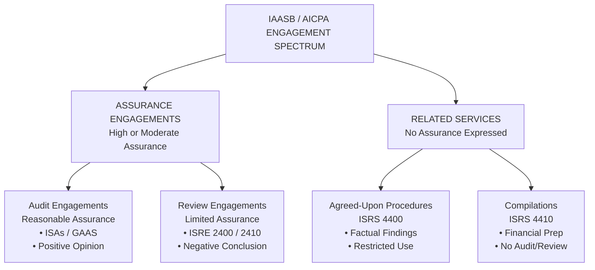
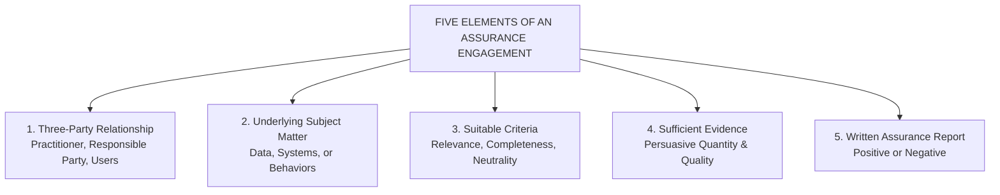
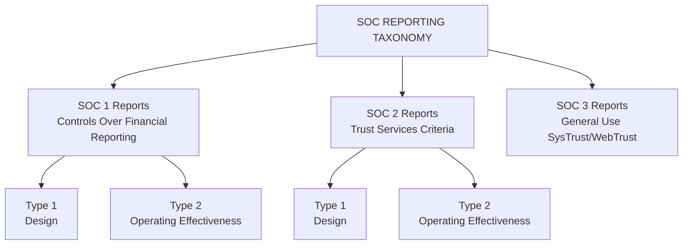
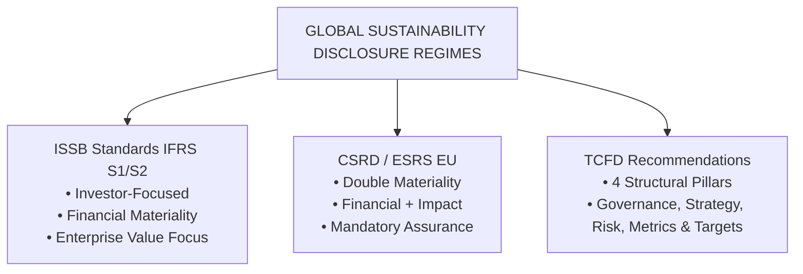
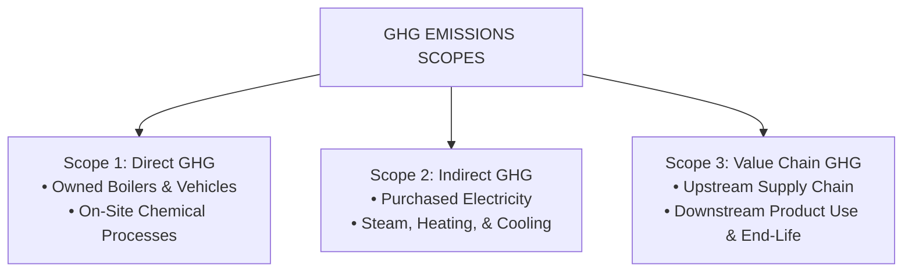
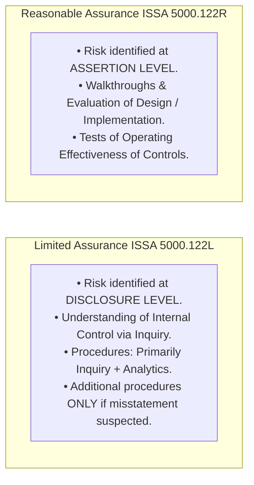

# Specialized Assurance, Sustainability, & Other Engagements

> [!abstract] Curriculum & Syllabus Context
>
> - **Course:** ACC 305 Auditing and Assurance
> - **Module:** Module 12: Specialized Areas, Sustainability, & Other Assurance
> - **Target Reading:** ISAE 3000 (Revised); ISRE 2400; ISRE 2410; ISAE 3400; ISAE 3402; ISRS 4400; ISRS 4410; ISSA 5000; Messier (11e) Ch. 21; ICAB Professional Ch. 14
> - **Syllabus Focus:** IAASB and AICPA engagement spectrum; assurance vs. related services; attestation vs. direct engagements; review engagements under ISRE 2400 / ISRE 2410 (limited assurance, inquiry and analytics, negative conclusion); general assurance framework under ISAE 3000 (Revised) (5 elements, suitable criteria characteristics); prospective financial information (PFI) under ISAE 3400 (forecast vs. projection, examination procedures, reporting); service organization control reports under ISAE 3402 / SOC (SOC 1 vs. SOC 2 vs. SOC 3, Type 1 design vs. Type 2 operating effectiveness, carve-out vs. inclusive method, Trust Services Criteria); Agreed-Upon Procedures under ISRS 4400 (Revised) (no assurance, factual findings, restricted use); Compilation engagements under ISRS 4410 (Revised); and Sustainability & ESG assurance (ISSB IFRS S1 & S2, CSRD double materiality, TCFD 4 pillars, GHG Protocol Scopes 1, 2, and 3, and ISSA 5000 general requirements).

---

### Section 1: Non-Audit Assurance & Attestation Frameworks (ISAE 3000, ISRE 2400, ISRE 2410)
Financial statement audits provide reasonable (high, but not absolute) assurance over historical financial information. However, market participants, regulators, and corporate boards frequently require independent verification for other financial and non-financial subject matters, or require a lower level of assurance at a lower cost. Non-audit assurance and attestation engagements fulfill these demands under distinct International Standards issued by the IAASB and AICPA.
#### 1. Taxonomy of Assurance, Attestation, and Related Services
The accountancy profession categorizes engagements along two primary dimensions: the level of assurance provided and the structural relationship between the practitioner, subject matter, and criteria.



| Engagement Type | Applicable Standards | Level of Assurance Obtained | Nature of Procedures Executed | Type of Conclusion / Report Issued |
| :--- | :--- | :--- | :--- | :--- |
| **1. Statutory Audit** | ISAs / GAAS | **Reasonable Assurance** (High) | Risk assessment, tests of controls, substantive tests of details, analytics. | **Positive Opinion**: *"In our opinion, the financial statements present fairly, in all material respects..."* |
| **2. Review Engagement** | ISRE 2400 / ISRE 2410 | **Limited Assurance** (Moderate / Meaningful) | Primarily **Inquiry** and **Analytical Procedures**; additional procedures only if misstatement suspected. | **Negative Conclusion**: *"Based on our review, nothing has come to our attention that causes us to believe..."* |
| **3. Other Assurance Engagements** | ISAE 3000 / ISSA 5000 | **Reasonable or Limited Assurance** | Tailored risk-based procedures based on the nature of non-historical subject matter. | **Positive Opinion** (Reasonable) or **Negative Conclusion** (Limited). |
| **4. Agreed-Upon Procedures (AUP)** | ISRS 4400 (Revised) | **No Assurance** | Specific procedures explicitly agreed upon with the engaging party/users. | **Factual Findings Report**: Details exact procedures performed and numerical/factual results. |
| **5. Compilation Engagement** | ISRS 4410 (Revised) | **No Assurance** | Applying accounting expertise to assist management in preparing financial information. | **Compilation Report**: States that accounting expertise was applied without auditing or verifying evidence. |

---
#### 2. Attestation Engagements vs. Direct Engagements
Under the **International Framework for Assurance Engagements** and **ISAE 3000 (Revised)**, assurance engagements are classified by structural format:
1. **Attestation Engagements**:
   - **Mechanism**: A party other than the practitioner (usually management / responsible party) measures or evaluates the underlying subject matter against suitable criteria and presents the resulting *subject matter information* (e.g., a formal report or statement).
   - **Practitioner Role**: The practitioner gathers evidence to express a conclusion on whether the *subject matter information* is free from material misstatement.
   - *Example*: Management prepares a Sustainability Report following GRI criteria; the practitioner evaluates management's report.
2. **Direct Engagements**:
   - **Mechanism**: The practitioner directly measures or evaluates the underlying subject matter against suitable criteria and applies assurance procedures to report the outcome directly.
   - **Practitioner Role**: The practitioner produces the subject matter information as part of or contemporaneously with the assurance report.
   - *Example*: A public sector audit office evaluates a municipal department's economy and efficiency (Value for Money audit) directly against benchmark criteria.

---
#### 3. Review Engagements (ISRE 2400 & ISRE 2410)
##### A. Scope & Regulatory Frameworks:
- **ISRE 2400 (Revised) (*Engagements to Review Historical Financial Statements*)**: Applies when an independent practitioner who is **not** the statutory auditor is engaged to perform a review of historical financial statements (e.g., small/medium entities exempt from audit or voluntary contract reviews).
- **ISRE 2410 (*Review of Interim Financial Information Performed by the Independent Auditor of the Entity*)**: Applies when the entity's **existing statutory auditor** reviews interim financial information (e.g., quarterly or semi-annual reports of listed companies). Because the auditor possesses cumulative knowledge of internal controls from the annual audit, ISRE 2410 leverages this prior understanding.
##### B. Core Operational Mechanics of a Review:
1. **Limited Assurance Premise**: The practitioner reduces engagement risk to an acceptable level that is *greater than for an audit*, obtaining a *meaningful* level of assurance that enhances user confidence.
2. **Procedure Limitations**: A review consists **primarily of Inquiry and Analytical Procedures**. The practitioner is **not required** to evaluate internal control design/implementation, perform tests of controls, or conduct substantive tests of details (vouching, physical inspection, external circularization) unless inquiries or analytics indicate that the financial statements may be materially misstated.
3. > [!warning] Exam Pitfall / Exception
   > **Inability to Obtain Evidence**: If a scope limitation prevents obtaining limited assurance, the practitioner must express a **Qualified Conclusion** (material but not pervasive) or **Disclaimer of Conclusion** (material and pervasive) under ISRE 2400.76–85.

---
#### 4. General Assurance Framework: ISAE 3000 (Revised)
**ISAE 3000 (Revised) (*Assurance Engagements Other than Audits or Reviews of Historical Financial Information*)** serves as the master standard for all non-historical financial assurance engagements (e.g., internal control reports, privacy compliance, environmental data).
##### The Five Essential Elements of an Assurance Engagement (ISAE 3000.12):



1. **Three-Party Relationship**:
   - **Practitioner**: The independent professional providing assurance.
   - **Responsible Party**: The party responsible for the underlying subject matter.
   - **Intended Users**: The individuals or groups for whom the report is prepared.
2. **Appropriate Underlying Subject Matter**: Identifiable, capable of consistent evaluation, and amenable to evidence gathering.
3. **Suitable Criteria**: Benchmarks used to evaluate the subject matter. Must exhibit five required characteristics:
   - **Relevance**: Contributes to decision-making by intended users.
   - **Completeness**: Omits no relevant factors that could mislead users.
   - **Reliability**: Allows reasonably consistent evaluation when used in similar circumstances.
   - **Neutrality**: Free from bias or selective presentation.
   - **Understandability**: Clear, explicit, and not open to widely varying interpretations.
4. **Sufficient Appropriate Evidence**: Cumulative evidence obtained through risk-driven procedures.
5. **Written Assurance Report**: Formal written conclusion expressing reasonable or limited assurance.

---
### Section 2: Prospective Financial Information & Service Organization Reports (ISAE 3400, ISAE 3402, Messier Ch 21)

---
#### 1. Examination of Prospective Financial Information (ISAE 3400 / Messier Ch 21)
> [!info] Key Definition
>
> Prospective Financial Information (PFI) consists of financial information based on assumptions about events that may occur in the future and possible actions by an entity.

##### A. Classification of Prospective Financial Information:

| Feature / Dimension | Financial Forecast | Financial Projection |
| :--- | :--- | :--- |
| **Underlying Assumptions** | Based on management's **best-estimate assumptions** of events expected to happen and expected courses of action. | Based on **hypothetical assumptions** ("what-if" scenarios) about future events and management actions that are not necessarily expected to occur. |
| **Intended Distribution** | Suitable for **General Distribution** (e.g., prospectus, annual report) or **Limited Use**. | Restricted strictly to **Limited Distribution** (e.g., specific bank loan application, venture capital negotiation). |
| **Warning / Disclaimer** | Requires explicit statement that actual results are likely to differ from forecast since anticipated events frequently do not occur as expected. | Requires explicit caveat stating that projection is prepared for a specific hypothetical purpose and should not be used for other purposes. |

##### B. Examination Procedures under ISAE 3400:
When examining PFI, the practitioner gathers evidence regarding:
1. Whether management's best-estimate/hypothetical assumptions are **not unreasonable**.
2. Whether PFI is **properly prepared** on the basis of the stated assumptions.
3. Whether PFI is **properly presented** and all material assumptions are adequately disclosed (highlighting key sensitivity variables).
4. Whether PFI is prepared on a basis consistent with historical financial statements, using appropriate accounting policies.

*Level of Assurance*: Because future events cannot be verified as facts, the practitioner **does not express an opinion on whether the results in the PFI will be achieved**. The report provides **negative assurance** on the reasonableness of assumptions and a **positive opinion** on whether the PFI is properly compiled from those assumptions.

> [!quote] Formula & Derivation
>
> $$\text{Report Formulation: } \text{"Nothing has come to our attention causing us to believe assumptions are unreasonable... In our opinion, the forecast is properly prepared on the basis of assumptions."}$$

---
#### 2. Assurance Reports on Controls at a Service Organization (ISAE 3402 / SOC Reports)
When entities outsource core business or IT processes (e.g., payroll processing, cloud hosting, asset management) to third-party **service organizations**, user entity auditors require evidence regarding internal controls operating at the service organization under **ISA 402** and **ISAE 3402**.
##### A. Taxonomy of Service Organization Control (SOC) Reports:



##### B. Type 1 vs. Type 2 Reports under ISAE 3402 / AT-C 320:

| Report Type | Scope of Coverage | Period / Timing | User Auditor Utility (ISA 402) |
| :--- | :--- | :--- | :--- |
| **Type 1 Report** | Reports on the **description and design suitability** of controls at the service organization. | As of a **specific point in time** (e.g., December 31, 2025). | Assists user auditor in gaining an **understanding of internal control** (ISA 315). **Cannot** be used as evidence to reduce Control Risk (CR). |
| **Type 2 Report** | Reports on the **description, design suitability, AND operating effectiveness** of controls. | Covers a **specified period** (minimum 6 consecutive months, typically 12 months). | Provides direct evidence of **operating effectiveness** of controls (ISA 330). Allows user auditor to adopt a **Reliance Strategy** ($CR < 1.0$). |

##### C. Subservice Organization Methods:
When a service organization utilizes a secondary third-party vendor (*subservice organization*):
1. **Carve-Out Method**: The service organization's description includes the nature of outsourced services, but **excludes** the subservice organization's control objectives and controls from the scope of the engagement. The report focuses only on user-entity monitoring controls over the subservice vendor.
2. **Inclusive Method**: The subservice organization's control objectives, controls, and tests are **fully included** within the service organization's description and practitioner testing scope.
##### D. AICPA Trust Services Criteria (SOC 2 & SOC 3 / Messier Ch 21):
SOC 2 and SOC 3 engagements evaluate non-financial IT controls against the five **Trust Services Categories**:
1. **Security**: System is protected against unauthorized physical and logical access.
2. **Availability**: System is available for operation and use as committed or agreed.
3. **Processing Integrity**: System processing is complete, valid, accurate, timely, and authorized.
4. **Confidentiality**: Information designated as confidential is protected as committed.
5. **Privacy**: Personal information is collected, used, retained, disclosed, and disposed of in conformity with commitments and criteria.

---
### Section 3: Related Services Engagements (ISRS 4400 & ISRS 4410)
Related services engagements are non-assurance services governed by the IAASB's International Standards on Related Services (ISRS).
#### 1. Agreed-Upon Procedures Engagements (ISRS 4400 Revised)
##### A. Definition & Purpose:
An Agreed-Upon Procedures (AUP) engagement is one in which a practitioner is engaged to carry out procedures of an audit nature to which the practitioner and the engaging party (and third-party intended users) have agreed, and to report on **factual findings**.
##### B. Operational Rules & Constraints:
- **No Assurance Expressed**: The practitioner does **not** evaluate evidence to express an opinion or limited assurance conclusion. Users draw their own conclusions from the factual findings.
- **Restricted Use**: The report is restricted strictly to the specified parties who agreed to the procedures, as others unaware of the reasons for the procedures might misinterpret the results.
- **Ethical Independence**: Under ISRS 4400 (Revised), the practitioner must comply with relevant ethical requirements. If the practitioner is not required to be independent by law/contract, or is not independent, an explicit statement disclosing non-independence must be included in the AUP report.
- > [!warning] Exam Pitfall / Exception
  > **Prohibited Terminology**: AUP reports must avoid subjective or ambiguous terms like *"test," "verify," "check," "audit,"* or *"insufficient/sufficient."* Instead, precise factual terms must be used: *"recalculated," "traced," "compared," "confirmed."*

---
#### 2. Compilation Engagements (ISRS 4410 Revised)
##### A. Definition & Purpose:
A compilation engagement is one in which a practitioner applies accounting and financial reporting expertise to assist management in the preparation and presentation of financial information in accordance with an applicable financial reporting framework, without obtaining or expressing any assurance on that information.
##### B. Operational Rules & Constraints:
- **No Verification**: The practitioner is not required to verify the accuracy or completeness of information provided by management, nor to gather evidence to express an audit opinion or review conclusion.
- **Responsibility Boundary**: Management retains sole responsibility for the financial statements and the underlying accounting records.
- > [!warning] Exam Pitfall / Exception
  > **Duty to Act on Known Misstatements**: If the practitioner becomes aware that the records/documents provided are incomplete, inaccurate, or misleading, the practitioner must request management to provide additional/corrected information. If management refuses, the practitioner must **withdraw from the engagement**.
- **Compilation Report**: Accompanies the compiled financial statements, explicitly stating that no audit or review was performed and no assurance is expressed.

---
### Section 4: Sustainability & ESG Assurance (ISSA 5000, ISSB IFRS S1/S2, CSRD, TCFD)
Global capital markets increasingly demand reliable, verified disclosures regarding Environmental, Social, and Governance (ESG) performance. To prevent "greenwashing" and standardize corporate reporting, international standard setters have established comprehensive disclosure and assurance regimes.

---
#### 1. Emerging Global Sustainability Disclosure Frameworks



1. **International Sustainability Standards Board (ISSB)**:
   - Established by the IFRS Foundation to create a global baseline of sustainability disclosures.
   - **IFRS S1 (*General Requirements for Disclosure of Sustainability-related Financial Information*)**: Mandates disclosure of material risks/opportunities affecting enterprise value.
   - **IFRS S2 (*Climate-related Disclosures*)**: Specifies detailed disclosures regarding physical climate risks (extreme weather, sea-level rise) and transition climate risks (regulatory shifts, carbon taxes, stranded assets).
2. **Task Force on Climate-related Financial Disclosures (TCFD)**:
   - Framework structured around **Four Core Pillars**:
     1. *Governance*: Board oversight and management role in climate risks.
     2. *Strategy*: Actual and potential impacts of climate risks on business model and financial planning (utilizing *Climate Scenario Analysis*).
     3. *Risk Management*: Processes for identifying, assessing, and managing climate risks.
     4. *Metrics & Targets*: Metrics used to measure performance (including Scope 1, 2, 3 GHG emissions) against net-zero targets.
3. **Corporate Sustainability Reporting Directive (CSRD) & Double Materiality**:
   - EU framework mandating sustainability reporting and mandatory assurance.
   - Embeds **Double Materiality**:
     > [!quote] Formula & Derivation
     > $$\text{Double Materiality} = \text{Financial Materiality (Outside-In)} + \text{Impact Materiality (Inside-Out)}$$
     - *Financial Materiality*: How ESG/climate matters affect the company's financial position, cash flows, and enterprise value.
     - *Impact Materiality*: How the company's activities impact society, human rights, and the natural environment.

---
#### 2. Greenhouse Gas (GHG) Emissions Accounting Framework
Under **ISSA 5000** and **ISAE 3410**, Greenhouse Gas statements classify emissions into three distinct operational scopes:

> [!quote] Formula & Derivation
>
> $$\text{Total Corporate Carbon Footprint} = \text{Scope 1 Emissions} + \text{Scope 2 Emissions} + \text{Scope 3 Emissions}$$



- **Scope 1 (Direct GHG Emissions)**: Direct emissions from operations owned or controlled by the reporting entity (e.g., fuel burned in company fleet, natural gas burned in factory boilers, chemical process emissions).
- **Scope 2 (Indirect GHG Emissions from Purchased Energy)**: Indirect emissions generated from the consumption of purchased electricity, steam, heating, or cooling utilized by the entity.
- **Scope 3 (Other Indirect Value-Chain Emissions)**: All other indirect emissions across the entity's broader value chain—upstream (purchased goods/services, employee commuting, freight) and downstream (use of sold products, end-of-life disposal, investments). Scope 3 exhibits the highest degree of measurement uncertainty.

---
#### 3. International Standard on Sustainability Assurance 5000 (ISSA 5000)
**ISSA 5000 (*General Requirements for Sustainability Assurance Engagements*)** is the comprehensive, standalone overarching standard issued by the IAASB, effective for periods beginning on or after **December 15, 2026** (with early adoption permitted, superseding legacy ISAE 3410).
##### A. Scope and Scalability of ISSA 5000:
- **Universal Application**: Applies to all sustainability information (environmental, labor, biodiversity, human rights, governance), regardless of presentation (standalone report, annual report commentary, regulatory filing) or underlying framework (ISSB, GRI, CSRD/ESRS, TCFD, custom criteria).
- **Attestation Engagements**: Addresses both **Reasonable Assurance** and **Limited Assurance** attestation engagements.
- **Multidisciplinary Competence**: Mandates that the engagement leader and team collectively possess both **Assurance Skills and Techniques** and **Sustainability Competence** (understanding measurement models, conversion factors, scientific estimation uncertainty).
##### B. Key Operational Requirements under ISSA 5000:
1. **Preconditions & Suitable Criteria Evaluation (ISSA 5000.75–84)**:
   - The practitioner must evaluate whether the reporting boundary (activities, operations, value-chain coverage) is appropriate and not misleading.
   - Criteria must exhibit Relevance, Completeness, Reliability, Neutrality, and Understandability. If criteria permit relief provisions for Scope 3 estimation gaps, proper uncertainty disclosures must be present.
2. **Reporting Boundary & Value Chain Considerations (ISSA 5000.40–41)**:
   - Unlike financial reporting boundaries (which follow legal consolidation), sustainability reporting boundaries frequently extend into **upstream and downstream value chains**.
   - Where evidence resides at third-party value chain entities outside the firm's control, the practitioner must evaluate management's estimation process or obtain direct confirmation/another practitioner's assurance report.
3. **Risk Assessment Differential (Limited vs. Reasonable Assurance)**:



4. **Structure of the ISSA 5000 Assurance Report**:
   - Title indicating Independent Sustainability Assurance Report.
   - Clear identification of disclosures subject to assurance and their level of assurance (handling combined reasonable/limited engagements).
   - Inherent Limitations paragraph explicitly highlighting measurement uncertainties inherent in Scope 3 emissions or forward-looking scenario models.
   - Summary of Work Performed (written in an informative, objective manner for limited assurance).
   - Positive Opinion (Reasonable) or Negative Conclusion (Limited).

---
### Section 5: Step-by-Step Practical & Numerical Walkthroughs

---

> [!example] Numerical Problem & Case Study
>
> #### Comprehensive Scenario 1: Review vs. Audit Decision & Report Wording (ISRE 2400)
> ##### Scenario Context:
> Apex Logistics Ltd, an unlisted logistics provider, seeks a $\$5,000,000$ credit facility from a commercial bank. The bank agrees to accept either an audited financial statement or a reviewed financial statement under **ISRE 2400 (Revised)**. Management chooses a review to minimize cost and time.
> - Financial Statement Revenue ($N$) = $\$30,000,000$.
> - Overall Materiality ($OM$) = $\$300,000$ ($1\%$ of revenue).
> - During the review, analytical procedures reveal that Gross Profit Margin dropped from $25\%$ in 2024 to $18\%$ in 2025, while Freight Costs increased by $45\%$ without a corresponding increase in fuel prices.
> ##### Step 1: Practitioner's Initial Operational Response under ISRE 2400
> 1. A standard review relies primarily on inquiry and analytical procedures.
> 2. However, under **ISRE 2400.57**, if the practitioner becomes aware of a matter that causes them to believe the financial statements may be materially misstated (the unexpected $7\%$ gross margin drop and unexplainable $45\%$ freight cost spike), the practitioner **cannot stop at inquiry**.
> 3. **Mandatory Action**: The practitioner must design and perform **additional procedures** (e.g., examining a sample of post-year-end freight invoices, reconciling carrier contracts) to determine whether a material misstatement exists.
> ##### Step 2: Evaluating Review Findings
> The additional procedures reveal an unrecorded freight expense liability of $\$450,000$ incurred in December 2025 but recorded in January 2026.
> - Misstatement Amount = $\$450,000$.
> - Comparison: Misstatement ($\$450,000$) > Materiality ($\$300,000$).
> - Management agrees to adjust the books for $\$350,000$, leaving an uncorrected misstatement of $\$100,000$.
> - Revised Uncorrected Misstatement ($\$100,000$) < Materiality ($\$300,000$).
> ##### Step 3: Drafting the Unmodified ISRE 2400 Conclusion Report
> Because the remaining uncorrected misstatement is immaterial, the practitioner issues an unmodified review report.
> $$\text{Extract of ISRE 2400 Review Conclusion:}$$
> > *"Based on our review, nothing has come to our attention that causes us to believe that the accompanying financial statements do not give a true and fair view of the financial position of Apex Logistics Ltd as at December 31, 2025, and of its financial performance and cash flows for the year then ended in accordance with International Financial Reporting Standards (IFRS)."*

---

> [!example] Numerical Problem & Case Study
>
> #### Comprehensive Scenario 2: Service Organization SOC 2 Type 2 Evaluation (ISAE 3402)
> ##### Scenario Context:
> PayGlobal Ltd provides cloud payroll processing for 400 corporate clients. PayGlobal engages an independent service auditor to issue an **ISAE 3402 / SOC 2 Type 2 Report** covering the period January 1, 2025 to December 31, 2025.
> The report evaluates controls under the **Processing Integrity** and **Security** Trust Services Criteria.
> ##### Step 1: Identifying Control Exceptions in the Type 2 Report
> The service auditor's Type 2 report includes the following test results:
> - **Control Objective PI-1**: Automated 3-way matching of employee hours, hourly pay rates, and tax withholding tables.
>   - *Sample Size Tested*: $250$ automated payroll runs.
>   - *Deviations Noted*: $0$ deviations.
>   - *Conclusion*: Control operated effectively throughout the period.
> - **Control Objective SEC-3**: Termination of IT system access for departed PayGlobal system administrators within 24 hours of resignation.
>   - *Sample Size Tested*: $40$ terminated administrators.
>   - *Deviations Noted*: $4$ instances where system access remained active for 5 to 12 days post-termination.
>   - *Conclusion*: Control did **not** operate effectively throughout the period.
> ##### Step 2: Impact Analysis for the User Entity Auditor
> User Entity Auditor (auditing a client using PayGlobal) evaluates the ISAE 3402 Type 2 report under **ISA 402**:
> 1. **For Payroll Processing Integrity (PI-1)**:
>    - The user auditor can place reliance on PayGlobal's automated payroll calculation controls.
>    - Control Risk for payroll calculation is assessed as **Low** ($CR = 0.20$), allowing the user auditor to reduce substantive tests of details over payroll expense.
> 2. **For IT System Access (SEC-3)**:
>    - Control failure at PayGlobal creates a **Self-Review / Management Override Risk** (unauthorized access by departed admins could lead to unauthorized master file rate changes).
>    - **User Auditor Response**:
>      - Evaluate whether the user entity has **Complementary User Entity Controls (CUECs)**—e.g., monthly user entity manager review and approval of the master employee rate file.
>      - If the user entity performs effective monthly rate reviews, the CUEC mitigates the service organization deficiency.
>      - If the user entity has no CUEC, the user auditor **cannot rely** on PayGlobal's IT access controls, must increase Control Risk to Maximum ($CR = 1.0$) for payroll authorization assertions, and must execute expanded substantive testing (vouching payroll rate changes directly to authorized HR personnel files).

---

> [!example] Numerical Problem & Case Study
>
> #### Comprehensive Scenario 3: ISSA 5000 GHG Emissions Assurance Walkthrough
> ##### Scenario Context:
> Titan Steel PLC engages an independent practitioner under **ISSA 5000** to perform a **Limited Assurance Engagement** on its annual Greenhouse Gas (GHG) Emissions Statement for the year ended December 31, 2025.
> ##### Step 1: Quantitative Emissions Data & Uncertainty Summary
> | Emission Category | Activity Source & Quantification Methodology | Reported Metric (tCO2e) | Stated Uncertainty Range |
> | :--- | :--- | :--- | :--- |
> | **Scope 1 (Direct)** | Natural gas combustion in steel blast furnaces (Direct meter readings $\times$ DEFRA emission factors). | $450,000 \text{ tCO2e}$ | $\pm 2.0\%$ (Low Uncertainty) |
> | **Scope 2 (Indirect)** | Purchased grid electricity ($120,000 \text{ MWh}$ from national grid $\times$ location-based grid factor). | $150,000 \text{ tCO2e}$ | $\pm 3.0\%$ (Low Uncertainty) |
> | **Scope 3 (Value Chain)** | Category 1: Purchased raw iron ore mining & maritime freight (Estimated using supplier secondary spend data). | $850,000 \text{ tCO2e}$ | $\pm 25.0\%$ (High Measurement Uncertainty) |
> | **Total Reported GHG** | **Combined Scope 1, 2, and 3 Disclosures** | **$1,450,000 \text{ tCO2e}$** | **Material Overall Impact** |
> ##### Step 2: Application of ISSA 5000 Risk Assessment & Evidence Evaluation
> 1. **Scope 1 & 2 Testing**:
>    - The practitioner performs analytical procedures comparing MWh and natural gas cubic meters against production volume, and recalculates emissions using published grid conversion factors.
>    - *Result*: No material misstatements identified.
> 2. **Scope 3 Measurement Uncertainty & Criteria Evaluation**:
>    - Scope 3 emissions ($\$850,000 \text{ tCO2e}$) represent $58.6\%$ of total reported carbon footprint.
>    - Under **ISSA 5000.190(g) & A558**, because Scope 3 relies heavily on secondary supplier spend estimates and industry averages, there is **high inherent measurement uncertainty**.
>    - **Practitioner Criteria Check**: The practitioner verifies that Note 4 of Titan Steel's GHG Statement explicitly describes the estimation methodology, data sources, and the $\pm 25\%$ uncertainty range.
>    - *Finding*: Because Note 4 provides complete and transparent disclosure of the measurement limitations, the criteria are **suitable**, and the disclosure is not misleading.
> ##### Step 3: Drafting the ISSA 5000 Limited Assurance Report Extract
> ```
> ====================================================================================================
> INDEPENDENT PRACTITIONER'S LIMITED ASSURANCE REPORT ON TITAN STEEL PLC'S GHG STATEMENT
> To the Board of Directors of Titan Steel PLC:
> Limited Assurance Conclusion
> We have conducted a limited assurance engagement on the accompanying Greenhouse Gas (GHG)
> Statement of Titan Steel PLC for the year ended December 31, 2025, comprising Scope 1, Scope 2,
> and Scope 3 emissions disclosures set out on pages 12-15 of the Sustainability Report.
> Based on the procedures we have performed and the evidence we have obtained, nothing has come to our
> attention that causes us to believe that the GHG Statement of Titan Steel PLC for the year ended
> December 31, 2025, is not prepared, in all material respects, in accordance with the Applicable
> Criteria (WBCSD/WRI GHG Protocol Corporate Value Chain Standard).
> Basis for Conclusion
> We conducted our limited assurance engagement in accordance with International Standard on
> Sustainability Assurance (ISSA) 5000, General Requirements for Sustainability Assurance Engagements.
> The procedures in a limited assurance engagement vary in nature and timing from, and are less in
> extent than for, a reasonable assurance engagement. Consequently, the level of assurance obtained
> in a limited assurance engagement is substantially lower than the assurance that would have been
> obtained had a reasonable assurance engagement been performed.
> Inherent Limitations in Preparing Sustainability Information
> We draw attention to Note 4 of the GHG Statement, which describes the inherent measurement
> uncertainties associated with quantifying Scope 3 Category 1 Value Chain emissions. As disclosed
> in Note 4, Scope 3 quantifications rely on industry-average emission factors and third-party supplier
> estimations, resulting in higher measurement uncertainty than Scope 1 and Scope 2 emissions.
> Our conclusion is not modified in respect of this matter.
> Summary of Work Performed
> Our limited assurance procedures included:
>  3. Inquiries of management and sustainability personnel regarding emissions reporting processes;
>  4. Analytical procedures over Scope 1 and Scope 2 energy data against prior-year production runs;
>  5. Recalculation of Scope 1 and Scope 2 emissions using published DEFRA/IEA grid factors;
>  6. Evaluating the mathematical logic and reasonableness of supplier spend models for Scope 3.
> PRACTITIONER SIGNATURE: Audit & Assurance Partners LLP
> DATE: March 15, 2026
> LOCATION: Dhaka, Bangladesh
> ====================================================================================================
> ```