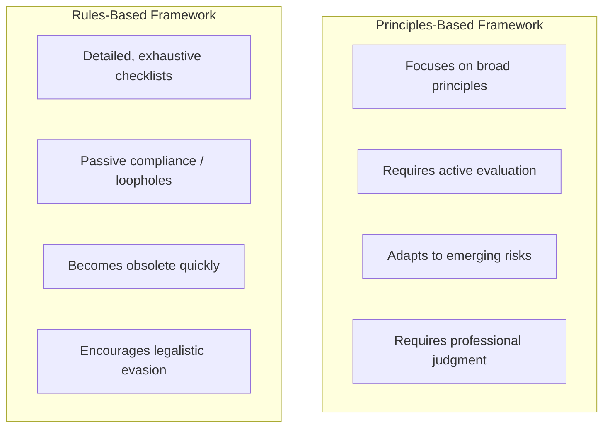
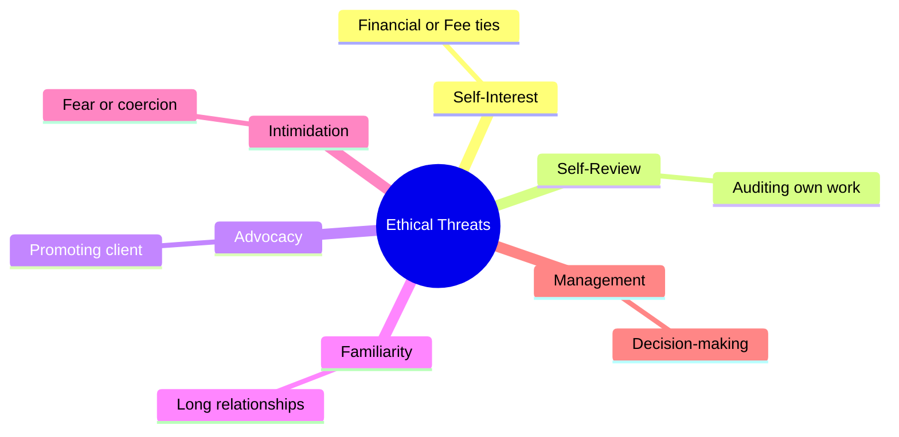
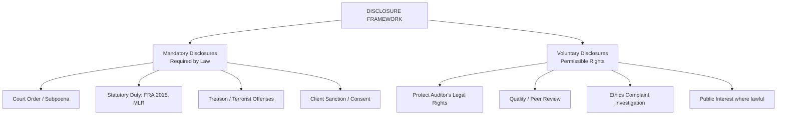
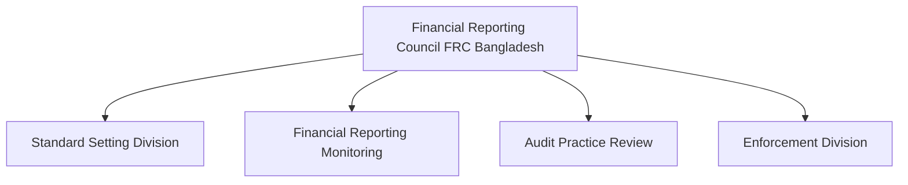
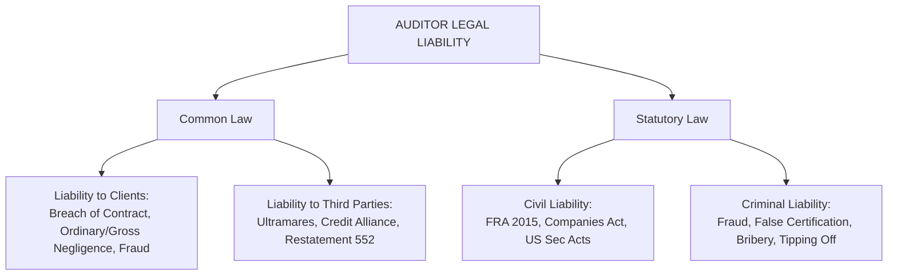
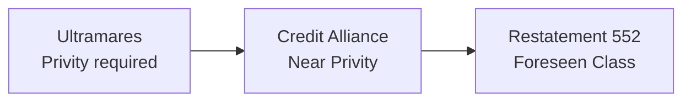

# Professional Ethics, Independence, & Auditor Responsibilities

> [!abstract] Curriculum & Syllabus Context
>
> - **Course:** ACC 305 Auditing and Assurance
> - **Module:** Module 2: Professional Ethics, Independence, & Responsibilities
> - **Target Reading:** IESBA Code; ICAB Certificate Manual Ch. 14–16; ICAB Professional Manual Ch. 2 & 4; Messier (11e) Ch. 19 & 20
> - **Syllabus Focus:** Ethical theories (utilitarianism, rights-based, justice); five fundamental principles (integrity, objectivity, competence/due care, confidentiality, professional behavior); principles vs. rules; six categories of threats and safeguards; fee dependence (15% rule); partner rotation; prohibited non-audit services; cooling-off periods; independence in mind vs. appearance; confidentiality exceptions and NOCLAR; Companies Act 1994 (Sections 210-213) appointment, qualifications, rights, and duties; FRA 2015 and FRC Bangladesh; and auditor legal liability (Common law, Ultramares, Credit Alliance, Restatement 552, Hand rule negligence formula).

---

### Section 1: Fundamental Principles of Professional Ethics & Codes of Conduct
Professional ethics form the bedrock of the auditing and assurance profession. Because financial statement users—including shareholders, creditors, regulators, and the general public—rely on the independent auditor's report to make critical economic decisions, public trust in the accountancy profession is paramount.
#### 1. Theoretical Frameworks of Ethics
Understanding ethical behavior in auditing requires examining three primary ethical theories that underpin professional codes of conduct:
1. > [!info] Key Definition
   > **Utilitarianism (Consequentialist Theory)**: An action is deemed ethically right if it produces the greatest net benefit (or least net harm) for the greatest number of affected stakeholders.
   - **Application in Auditing**: The auditor must weigh the consequences of audit decisions across all stakeholders (shareholders, public, management). For instance, refusing to issue a clean opinion on misstated financial statements protects thousands of investors from capital loss, outweighing the short-term negative impact on management or client relationship.
   - **Rule Utilitarianism**: Emphasizes that strict adherence to general ethical rules (such as auditor independence) maximizes long-term social welfare, even if violating a rule appears beneficial in an isolated instance.
2. > [!info] Key Definition
   > **Rights-Based Approach (Deontological / Kantian Ethics)**: Actions are intrinsically right or wrong, regardless of consequences. Individuals have fundamental moral rights, and others have a corresponding duty to respect those rights.
   - **Application in Auditing**: Investors and creditors have a fundamental right to truthful, non-misleading financial information. The auditor has a categorical duty to uphold the "moral point of view"—putting the public's right to honest disclosure ahead of personal or commercial self-interest.
3. > [!info] Key Definition
   > **Justice-Based Approach (Rawlsian Justice)**: Focuses on fairness, equity, and the impartial distribution of benefits and burdens.
   - **Application in Auditing**: Evaluates whether audit actions result in an equitable allocation of information symmetry. The auditor ensures that powerful corporate insiders do not exploit information asymmetry to the detriment of less-informed external stakeholders.

---
#### 2. The Five Fundamental Principles
The **IESBA International Code of Ethics for Professional Accountants**, the **ICAB Code of Ethics**, and the **AICPA Code of Professional Conduct** establish five core principles that govern all professional accountants:

| Fundamental Principle | Comprehensive Definition & Operational Scope |
| :--- | :--- |
| **1. Integrity** | To be straightforward, honest, and candid in all professional and business relationships. Implies fair dealing, truthfulness, and moral courage. A professional accountant shall not knowingly be associated with reports, returns, or communications containing materially false or misleading statements, statements furnished recklessly, or omitted/obscured required information. |
| **2. Objectivity** | To exercise professional or business judgment without being compromised by bias, conflict of interest, or the undue influence of or reliance on individuals, organizations, technology, or other factors. Requires a state of mind that evaluates evidence impartially based strictly on facts. |
| **3. Professional Competence & Due Care** | To attain and maintain professional knowledge and skill at a level required to ensure that a client or employer receives competent professional service based on current technical standards, professional standards, and relevant legislation. Requires acting diligently in accordance with applicable standards and ensuring proper supervision/training of engagement staff. |
| **4. Confidentiality** | To respect the confidentiality of information acquired as a result of professional and business relationships. Information acquired shall not be disclosed to third parties without proper and specific authority unless there is a legal or professional right or duty to disclose, nor used for personal advantage or the advantage of third parties ("insider dealing"). |
| **5. Professional Behavior** | To comply with relevant laws and regulations, act in the public interest in all professional activities, and avoid any conduct that the professional accountant knows or should know might discredit the profession (e.g., exaggerated claims, disparaging references to other practitioners). |

---
#### 3. Rules-Based vs. Principles-Based Ethical Frameworks
The professional accounting bodies adopt a **principles-based conceptual framework** rather than a rigid rules-based regime.



* **Advantages of a Principles-Based Framework**:
  1. **Flexibility & Future-Proofing**: Accommodates rapidly evolving business models, complex financial instruments, and novel transaction structures without waiting for new legislation.
  2. **Active Intellectual Engagement**: Requires practitioners to actively evaluate the spirit and substance of ethical threats rather than mechanically ticking off prohibited items on a checklist.
  3. **Prevention of Evasion**: Prevents auditors and clients from structuring transactions to technically circumvent specific prohibitions ("bright-line rules") while violating the overarching ethical intent.

---
### Section 2: Framework of Ethical Threats & Safeguards
The conceptual framework requires the auditor to:
1. **Identify** threats to compliance with the fundamental principles.
2. **Evaluate** the significance of the identified threats (determining whether they are at an "acceptable level").
3. **Apply Safeguards** to eliminate threats or reduce them to an acceptable level. If adequate safeguards cannot be applied, the engagement must be declined, terminated, or the threatening relationship eliminated.

---
#### 1. The Six Categories of Ethical Threats
Threats to independence and objectivity fall into six distinct categories:



1. **Self-Interest Threat**:
   - *Definition*: Occurs when a financial or other interest inappropriately influences the professional accountant's judgment or behavior.
   - *Examples*: Direct or material indirect financial interests in an audit client; excessive fee dependence on a single client; loans to/from a client; fear of losing a client; contingent fee arrangements.
2. **Self-Review Threat**:
   - *Definition*: Occurs when a professional accountant needs to evaluate the results of a previous judgment made or service performed by the accountant (or another individual within the firm) on which the audit team will rely when forming an audit opinion.
   - *Examples*: Auditing financial statements prepared by the firm; performing valuation services that form part of the financial statement balances; designing IT accounting systems and subsequently auditing their output.
3. **Advocacy Threat**:
   - *Definition*: Occurs when a professional accountant promotes a client's position to the point that the accountant's objectivity is compromised.
   - *Examples*: Acting as an advocate or legal representative for an audit client in litigation or tax disputes; promoting or dealing in an audit client's shares/securities.
4. **Familiarity Threat**:
   - *Definition*: Occurs when, due to a long or close relationship with a client, a professional accountant becomes too sympathetic to the client's interests or too accepting of their work.
   - *Examples*: Senior engagement personnel serving on the audit for an extended number of years; close family or personal relationships between engagement team members and client directors/officers; accepting lavish gifts or hospitality.
5. **Intimidation Threat**:
   - *Definition*: Occurs when a professional accountant is deterred from acting objectively because of actual or perceived pressures, including attempts to exercise undue influence over the accountant.
   - *Examples*: Threat of dismissal or replacement over an accounting disagreement; pressure to reduce audit scope/fees unreasonably; aggressive client management threatening litigation or reporting to authorities.
6. > [!warning] Exam Pitfall / Exception
   > **Management Threat** (FRC / ICAB Frameworks):
   > - *Definition*: Occurs when the audit firm or an engagement team member assumes management responsibilities for the audit client (e.g., making management decisions, directing employees, authorizing transactions).
   > - **Rule: Absolutely prohibited—safeguards cannot reduce this threat to an acceptable level.**

---
#### 2. Quantitative Thresholds, Rules, & Prohibitions
To ensure consistency, professional standards (ICAB, IESBA, FRC, SEC, SOX) establish explicit quantitative thresholds and hard prohibitions for specific threats:
##### A. Economic Dependence & Fee Concentration Thresholds
When the total fees generated from an audit client represent a large proportion of the total fees of the firm, the financial dependency creates a severe self-interest and intimidation threat.
* **ICAB / IESBA Code Threshold**:
  - For **Non-Public Interest Entities (non-PIEs)**: If recurring fees from an audit client exceed **15%** of the firm's total fee income for **two consecutive years**, the firm must:
    1. Disclose the fact to Those Charged with Governance (TCWG).
    2. Conduct a **pre-issuance review** (Engagement Quality Review - EQR) by an independent professional accountant before issuing the second year's audit opinion, OR a **post-issuance review** of the second year's audit.
  - For **Public Interest Entities (PIEs / Listed Companies)**: If recurring fees exceed **15%** for two consecutive years, a pre-issuance review by an independent external reviewer is mandatory. If fees continue to exceed 15% for 5 consecutive years, the firm must determine whether to decline or cease acting as auditor.
* **FRC Ethical Standard (Stricter UK/Regional Benchmark)**:
  - If total fees from a single client/group regularly exceed **10%** of total firm income (**5% for listed/PIE companies**), the engagement partner must disclose this to the Ethics Partner and TCWG and implement immediate safeguards or resign.
* **Non-Audit Service Fee Cap (EU / FRC Rules)**:
  - Total fees for non-audit services provided to a PIE client are capped at a maximum of **70%** of the average audit fees paid in the last three consecutive financial years.

> [!quote] Formula & Derivation
>
> $$\text{Non-Audit Fee Cap} = 0.70 \times \left( \frac{\text{Audit Fee}_{t-1} + \text{Audit Fee}_{t-2} + \text{Audit Fee}_{t-3}}{3} \right)$$

##### B. Mandatory Audit Partner Rotation Rules
Long association creates severe familiarity and self-interest threats.

| Jurisdiction / Standard | Entity Type | Lead Audit Partner / EQR Rotation | Cooling-Off Period (Time-Out) |
| :--- | :--- | :--- | :--- |
| **ICAB / IESBA Code** | Public Interest Entity (PIE) | Maximum **7 years** continuous service | **5 years** (Lead Partner / EQR) |
| **FRC Ethical Standard** | Public Interest Entity (PIE) | Maximum **5 years** continuous service (extensible to 7 with audit committee approval) | **5 years** |
| **US SOX / SEC Rules** | Public Companies | Maximum **5 years** continuous service | **5 years** (Lead and Concurring/EQR Partners) |
| **Non-PIE Entities** | Private Companies | Review after **10 years** of continuous service | Alternative safeguards / EQR required if not rotated |

##### C. Prohibited Non-Audit Services for Audit Clients
> [!warning] Exam Pitfall / Exception
>
> Under **SOX Section 201**, **SEC rules**, and **FRC/ICAB Standards**, auditors are strictly prohibited from providing the following non-audit services to their public company / PIE audit clients:
> 1. Bookkeeping and financial statement preparation services.
> 2. Financial information systems design and implementation (ITGC/Application design).
> 3. Appraisal or valuation services, fairness opinions, or contribution-in-kind reports.
> 4. Actuarial services.
> 5. Internal audit outsourcing services.
> 6. Management functions or human resources services (e.g., executive recruiting, searching for candidates).
> 7. Broker-dealer, investment adviser, or investment banking services.
> 8. Legal services and expert witness/advocacy services in litigation.

##### D. Employment with Audit Clients ("Cooling-Off Period")
* **SOX Section 206 / SEC / FRC Rules**: A CPA firm is not independent if a lead partner, EQR partner, or core engagement team member accepts employment in a **financial reporting oversight role** (e.g., CEO, CFO, Controller, Chief Accounting Officer) at an audit client unless a **one-year cooling-off period** has elapsed between the date the audit procedures for the prior period commenced/concluded and the employment start date.

---
### Section 3: Independence in Fact and Appearance
#### 1. Dual Dimensions of Independence
Independence underpins objectivity and is defined in two mandatory dimensions:

> [!quote] Formula & Derivation
>
> $$\text{Total Auditor Independence} = \text{Independence of Mind (In Fact)} \;\cap\; \text{Independence in Appearance}$$

```mermaid
flowchart TD
  A[AUDITOR INDEPENDENCE] --> B[Independence of Mind<br>(In Fact)]
  A --> C[Independence in Appearance]
  
  B --- B1[State of mind that permits expressing a conclusion without being affected by influences that compromise professional judgment.]
  C --- C1[Avoidance of facts/circumstances so significant that a reasonable, informed 3rd party would conclude objectivity was impaired.]
```

1. **Independence of Mind (In Fact)**:
   - The internal mental state that permits the expression of an unbiased audit conclusion without being affected by influences that compromise professional judgment, thereby allowing the auditor to act with integrity, objectivity, and professional skepticism.
2. **Independence in Appearance**:
   - The avoidance of facts and circumstances that are so significant that a **reasonable and informed third party**—having knowledge of all relevant information, including applied safeguards—would conclude that a firm's or an audit team member's integrity, objectivity, or professional skepticism had been compromised.
#### 2. Scope of Application: "Covered Members" (AICPA Framework)
The independence rules apply to specific individuals designated as **Covered Members**:
* **Covered Members** include:
  1. An individual on the attest engagement team.
  2. An individual in a position to influence the attest engagement (e.g., chain of command, quality reviewers).
  3. A partner or manager who provides more than 10 hours of nonattest services to the client in a fiscal year.
  4. A partner in the office in which the lead attest engagement partner primarily practices.
  5. The firm, including the firm's employee benefit plans.
  6. An entity whose operating, financial, or accounting policies can be controlled by any of the above.
#### 3. Financial Relationships & Investments
> [!warning] Exam Pitfall / Exception
>
> * **Direct Financial Interest**: Holding equity, debt, or options directly in an audit client.
>   - **Rule**: **Strictly Prohibited** for covered members, regardless of materiality. Even owning $1 worth of stock in an audit client impairs independence.
> * **Indirect Financial Interest**: Holding an interest in an entity through a collective investment vehicle (e.g., mutual fund, trust).
>   - **Rule**: Prohibited only if the indirect financial interest is **material** to the covered member's net worth or if the covered member controls the intermediary's investment decisions.
>   - *Diversified Mutual Fund Rule*: Owning $\le 5\%$ of the outstanding shares of a diversified mutual fund is deemed an immaterial indirect financial interest and does NOT impair independence.

---
### Section 4: Confidentiality & Permissible Disclosures
#### 1. The Fundamental Principle of Confidentiality
A professional accountant must respect the confidentiality of information acquired during professional engagements. The duty of confidentiality continues even after the termination of the client-auditor relationship or employment.
* **Prohibition**: An accountant shall not use confidential client information for personal advantage, insider trading, or the advantage of a third party.
#### 2. Exceptions: Permissible & Mandatory Disclosures
Confidentiality is not absolute. Information may or must be disclosed under specific statutory or professional circumstances:



1. **Mandatory Disclosures (Required by Law or Statute)**:
   - **Court Orders & Valid Subpoenas**: Disclosure mandated by judicial authority.
   - **Statutory Reporting Obligations**:
     - *Money Laundering Regulations*: Duty to report suspected proceeds of crime to the nominated officer / Money Laundering Reporting Officer (MLRO). Note: The auditor must avoid **"Tipping Off"** the client, which is a severe criminal offense.
     - *Treason & Terrorist Offenses*: Absolute statutory obligation to inform enforcement authorities.
     - *Non-Compliance with Laws and Regulations (NOCLAR)*: Under ISA 250 and IESBA NOCLAR provisions, duty to report instances of illegal acts to regulatory/enforcement bodies if management or TCWG fail to act.
2. **Voluntary / Permissible Disclosures (Without Client Consent)**:
   - **Defense of Legal Interests**: Disclosing relevant documents to defend the audit firm in litigation or disciplinary proceedings brought by the client or third parties.
   - **Quality Assurance & Peer Reviews**: Disclosing files to ICAB, FRC, or PCAOB practice assurance inspectors.
   - **Professional Standard Compliance**: Reporting NOCLAR to next higher corporate authority or external regulators in the public interest.

---
### Section 5: Statutory Responsibilities & Rights under Companies Act 1994 & FRA 2015 (Bangladesh)
The legal and regulatory framework governing statutory financial statement audits in Bangladesh is established primarily by the **Companies Act, 1994** and the **Financial Reporting Act (FRA), 2015**.
#### 1. Framework under Companies Act, 1994 (Bangladesh)
##### A. Appointment of Auditors
1. **First Auditors (Section 210(10))**:
   - Appointed by the Board of Directors within **3 months** of the date of incorporation of the company.
   - If directors fail, the company in a general meeting may appoint the first auditor.
   - Holds office until the conclusion of the first Annual General Meeting (AGM).
2. **Subsequent Auditors (Section 210(1))**:
   - Appointed by shareholders at each AGM by an **ordinary resolution**.
   - Holds office from the conclusion of that AGM until the conclusion of the next AGM.
3. **Casual Vacancy (Section 210(7))**:
   - Directors may fill any casual vacancy (e.g., due to death or disqualification).
   - If vacancy is caused by resignation, it can only be filled by shareholders in a general meeting.
##### B. Qualifications & Statutory Disqualifications
* **Qualification**: Must be a "Chartered Accountant" within the meaning of the Bangladesh Chartered Accountants Order, 1973 (member of ICAB holding a practicing certificate).
* > [!warning] Exam Pitfall / Exception
  > **Statutory Disqualifications (Section 212)**:
  > The following persons cannot be appointed as statutory auditors of a company:
  > 1. An officer or employee of the company.
  > 2. A person who is a partner, or who is in the employment, of an officer or employee of the company.
  > 3. A body corporate.
  > 4. A person who is indebted to the company for an amount exceeding BDT 1,000, or who has given a guarantee/security for such debt.
  > 5. A person disqualified for appointment as auditor of the company's subsidiary or holding company.
##### C. Statutory Rights & Powers of the Auditor (Section 213)
1. **Right of Unrestricted Access**: Right of access at all times to the books, accounts, and vouchers of the company, whether kept at the registered office or elsewhere.
2. **Right to Information**: Right to require from officers/directors such information and explanations as the auditor thinks necessary for the performance of audit duties.
3. **Right to Attend General Meetings**: Right to receive all notices and communications relating to any general meeting and to attend and speak at any general meeting on any part of the business which concerns them as auditors.
4. **Right to Legal/Technical Advice**: Right to seek expert advice at the company's expense where necessary.
##### D. Statutory Duties of the Auditor (Section 213)
The primary statutory duty is to make a report to the members (shareholders) on the accounts examined and financial statements. The auditor must explicitly state:
1. Whether they have obtained all information and explanations required.
2. Whether, in their opinion, the Balance Sheet and Profit and Loss Account give a **true and fair view** of the state of affairs and profit/loss.
3. Whether proper books of account have been kept as required by law.
4. Whether the company's Balance Sheet and Profit & Loss Account are in agreement with the books of account and returns.
##### E. Removal & Resignation of Auditors
* **Removal (Section 210(9))**: An auditor may be removed before the expiration of their term only by shareholders in a general meeting after obtaining prior special notice.
* **Resignation**: On resignation, the auditor must submit written notice and a formal **Statement of Circumstances** to the company and Registrar of Joint Stock Companies and Firms (RJSC), detailing whether there are any circumstances connected with the resignation that should be brought to the notice of members/creditors.

---
#### 2. Framework under Financial Reporting Act (FRA), 2015 (Bangladesh)
The **Financial Reporting Act 2015** created an independent statutory oversight body—the **Financial Reporting Council (FRC)** Bangladesh—to regulate financial reporting and auditing of **Public Interest Entities (PIEs)**.



##### A. Definition of Public Interest Entities (PIEs)
PIEs under FRA 2015 include listed companies, banks, non-bank financial institutions (NBFIs), insurance companies, state-owned enterprises, and private companies meeting statutory revenue/asset/employee thresholds.
##### B. Key Mandates & Regulatory Powers of FRC:
1. **Auditor Registration**: Auditors cannot audit a PIE unless registered directly with the FRC.
2. **Adoption of Standards**: FRC sets/adopts Financial Reporting Standards (BFRS/IFRS) and Auditing Standards (BSA/ISA).
3. **Audit Practice Review Division**: Conducts independent quality inspections and practice reviews of PIE audit files (independent of ICAB's Quality Assurance Board).
4. **Enforcement & Sanctions**: Holds powers to cancel auditor registration, impose administrative fines, and initiate criminal prosecution for audit negligence or collusion in fraudulent reporting.

---
### Section 6: Auditor's Legal Liabilities & Case Law Precedents
Auditors face potential legal liability under both **Common Law** (judge-made precedent) and **Statutory Law** (enacted legislation).



---
#### 1. Common Law Liability to Clients
The relationship between client and auditor is grounded in contract (established via the **Audit Engagement Letter**).
1. **Breach of Contract**:
   - Failure to perform agreed-upon duties (e.g., missing contractual audit completion deadlines, failing to deliver agreed audit reports).
2. **Ordinary Negligence**:
   - Failure to exercise **due professional care**—acting without the skill, care, and diligence expected of a reasonably competent auditor under similar circumstances.
   - *Client Proof Requirements*:
     1. Auditor owed a duty of care.
     2. Auditor breached that duty (failure to follow GAAS/ISAs).
     3. Client suffered actual financial loss/damage.
     4. Direct causal connection exists between auditor negligence and client loss.

---
#### 2. Common Law Liability to Third Parties: Evolution of Precedents
When third parties (investors, lenders) suffer loss relying on audited financial statements, liability for **ordinary negligence** depends on the judicial test applied in that jurisdiction:



1. **Privity Standard (*Ultramares Corp. v. Touche*, 1931 - Cardozo, J.)**:
   - *Rule*: Auditors are NOT liable for ordinary negligence to third parties lacking **privity of contract** (direct contractual relationship).
   - *Rationale*: To prevent exposing auditors to "a liability in an indeterminate amount for an indeterminate time to an indeterminate class."
   - *Exception*: Auditors are liable to ANY third party for **gross negligence or fraud** (*constructive fraud*).
2. **Near-Privity Standard (*Credit Alliance Corp. v. Arthur Andersen & Co.*, 1985)**:
   - *Rule*: Extended ordinary negligence liability to third parties meeting a **3-part test**:
     1. Auditor was aware the financial statements were to be used for a particular purpose.
     2. A known relying party was intended to rely on the statements for that purpose.
     3. Linking conduct existed between auditor and relying party (direct communication/meeting).
3. **Foreseen Users Standard (*Restatement (Second) of Torts § 552*)**:
   - *Rule*: Auditor is liable for ordinary negligence to a **limited, foreseen class of users** for whose guidance the auditor knows the client intends to supply the information (e.g., an unnamed bank from which client is seeking a loan).
4. **Reasonably Foreseeable Users Standard (*Rosenblum v. Adler*, 1983)**:
   - *Rule*: Auditor liable to ANY third party whose reliance on the financial statements was reasonably foreseeable (largely rejected/abandoned today as overly broad).

---
#### 3. Mathematical Models & Economic Theories of Negligence
##### A. The Hand Rule (Learned Hand Formula for Negligence)
In economic analysis of law, an auditor is deemed legally negligent if the burden of taking precautions ($B$) is less than the probability of loss ($P$) multiplied by the gravity/magnitude of the loss ($L$):

> [!quote] Formula & Derivation
>
> $$\text{Hand Rule Condition for Negligence}: B < P \times L$$

* **Variables**:
  - $B$: Burden of precaution = Additional cost of performing supplementary audit procedures (e.g., extended inventory counts or confirmations).
  - $P$: Probability of undetected material misstatement occurring and causing loss.
  - $L$: Magnitude of financial damage/loss suffered by stakeholders if misstatement occurs.
* **Audit Decision Rule**: If $B < P \times L$, failing to perform the audit procedure constitutes legal breach of due care (negligence).
##### B. Expected Auditor Liability Model
> [!quote] Formula & Derivation
>
> $$\text{Expected Audit Liability} = P(\text{MM}) \times P(\text{Litigation} \mid \text{MM}) \times P(\text{Loss} \mid \text{Litigation}) \times D$$

Where:
- $P(\text{MM})$: Probability that financial statements contain an undetected material misstatement.
- $P(\text{Litigation} \mid \text{MM})$: Probability that plaintiffs sue given a material misstatement.
- $P(\text{Loss} \mid \text{Litigation})$: Probability that courts rule against the auditor.
- $D$: Total monetary damages awarded.
##### C. Joint and Several Liability vs. Proportionate Liability
* **Joint and Several Liability ("Deep Pockets Theory")**:
  - Each negligent defendant is individually liable to the plaintiff for **100% of the damages**, regardless of their relative percentage of fault. If a fraudulent client management is insolvent, the audit firm must pay the entire loss.
* **Proportionate Liability (PSLRA 1995)**:
  - Defendants are liable strictly for the percentage of damages corresponding to their **proportional fault**, UNLESS the auditor knowingly engaged in intentional fraud (scienter), in which case joint and several liability applies.

---
### Section 7: Comprehensive Scenario Walkthrough & Practical Problem
> [!example] Numerical Problem & Case Study
>
> #### Scenario Description
> **Firm**: *Rahman & Associates, Chartered Accountants (ICAB Member Firm)*
> **Client**: *Apex Synthetics Ltd. (a Listed Public Interest Entity in Bangladesh)*
> **Context & Facts**:
> 1. *Fee Dependency*: Total annual fees billed to Apex Synthetics represent **18%** of Rahman & Associates' total firm fee income for the past **two consecutive years**.
> 2. *Nonaudit Services*: Apex Synthetics requests Rahman & Associates to perform a valuation of its specialized manufacturing plant (representing 30% of total assets) to record an asset revaluation surplus, and also asks them to design an IT inventory tracking module.
> 3. *Audit Circumstance*: During the current year's audit, the engagement senior identified a potential inventory overstatement of **BDT 25 Million** due to obsolete raw materials. The cost of performing additional inventory verification procedures (testing net realizable value - NRV) is estimated at **BDT 200,000**.
> 4. *Probability Assessment*: The engagement team estimates that if the additional NRV procedures are skipped, the probability of an undetected material misstatement ($P$) is **15%**. The potential damage/loss ($L$) to lenders if the inventory is overstated is **BDT 25 Million**.
> 5. *Client Pressure*: The CFO of Apex Synthetics threatens to switch auditors next year if the BDT 25 Million inventory write-down is insisted upon.
> ---
> #### Requirement 1: Ethical & Independence Analysis
> ##### 1. Fee Dependence Analysis:
> * **Identification**: The 18% fee concentration exceeds the **15% ICAB/IESBA threshold** for two consecutive years.
> * **Threat**: Severe **Self-Interest** and **Intimidation** threats.
> * **Mandatory Safeguard / Action**:
>   - The firm must disclose the fee dependency to TCWG at Apex Synthetics.
>   - Prior to issuing the audit opinion for the second year, the firm MUST undergo an **Engagement Quality Review (EQR)** (pre-issuance review) performed by an independent Chartered Accountant (outside the engagement team).
>   - Under FRC Bangladesh regulations for PIEs, if fee dependency continues to exceed 15%, the firm must reduce non-audit work or resign as auditor.
> ##### 2. Valuation & IT Nonaudit Services:
> * **Identification**: Valuation of plant (30% of assets) and IT system design for inventory.
> * **Threat**: Severe **Self-Review** and **Management** threats.
> * **Mandatory Action**:
>   - Valuation of a material financial statement asset (30% of total assets) involves significant subjective judgment that directly affects financial statement balances audited by the firm.
>   - **Prohibition**: Rahman & Associates MUST decline both the valuation and IT design engagements. Under IESBA Code, SEC rules, and FRC rules, providing valuation services for material items to a PIE audit client is strictly prohibited as no safeguards can reduce self-review threats to an acceptable level.
> ---
> #### Requirement 2: Hand Rule Negligence Evaluation
> Let's evaluate whether skipping the NRV inventory audit procedure constitutes legal negligence under the Learned Hand Formula ($B < P \times L$):
> ##### Given Parameters:
> * Cost of precaution / additional audit procedure ($B$) = BDT $200,000$
> * Probability of undetected material misstatement ($P$) = $15\% = 0.15$
> * Magnitude of loss/damage ($L$) = BDT $25,000,000$
> ##### Calculation:
> $$\text{Expected Loss } (P \times L) = 0.15 \times 25,000,000 = \text{BDT } 3,750,000$$
> $$\text{Burden of Precaution } (B) = \text{BDT } 200,000$$
> ##### Evaluation:
> $$B \text{ (BDT 200,000)} < P \times L \text{ (BDT 3,750,000)}$$
> Since $B < P \times L$, the cost of taking precautions (BDT 200,000) is drastically lower than the expected loss (BDT 3,750,000).
> * **Conclusion**: If Rahman & Associates yields to CFO pressure and skips the NRV procedure, the firm fails to exercise due professional care. In the event of litigation following a financial collapse, courts will find the firm **grossly negligent** under both Common Law and statutory duties under the Financial Reporting Act 2015 / Companies Act 1994.
> ---
> #### Requirement 3: Statutory Compliance under Companies Act 1994 & FRA 2015
> 1. **Duty to Report True & Fair View**: Rahman & Associates cannot issue an unqualified opinion if management refuses the BDT 25 Million inventory adjustment. The firm must issue a **Qualified Opinion** (or **Adverse Opinion** if material and pervasive).
> 2. **Right to Information**: Under Section 213 of Companies Act 1994, the auditor has the statutory right to demand full documentation regarding inventory NRV.
> 3. **Reporting to FRC Bangladesh**: Under FRA 2015, if management attempts to coerce or intimidate the auditor into issuing a false report, the auditor must report the NOCLAR / governance failure to the Financial Reporting Council.