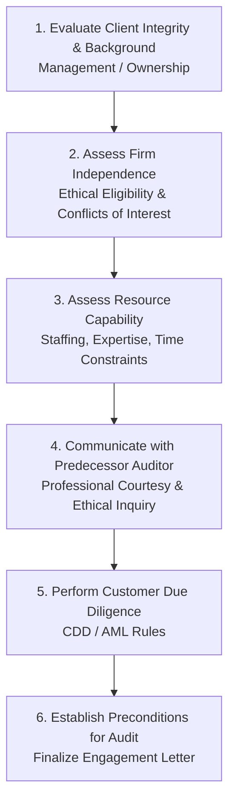
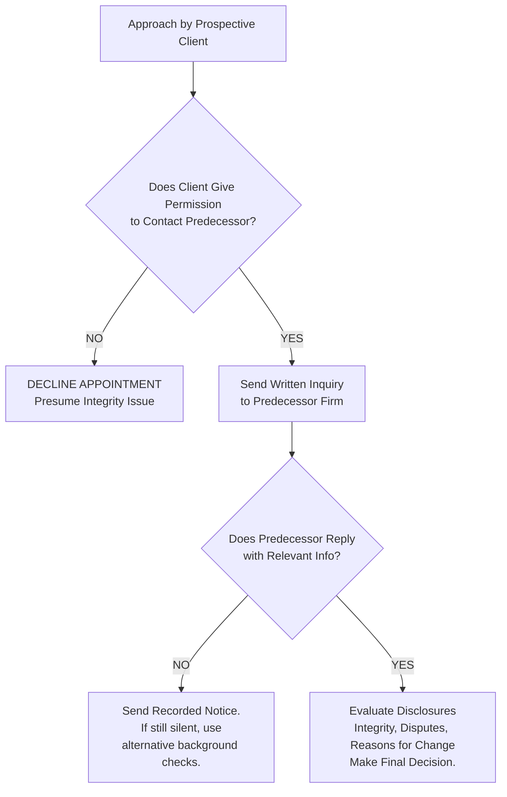
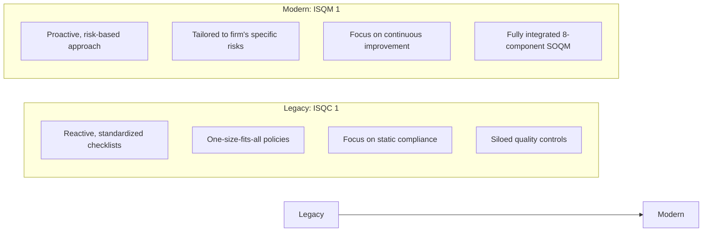
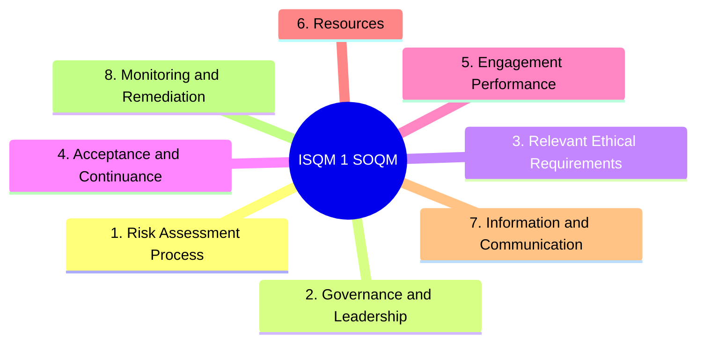
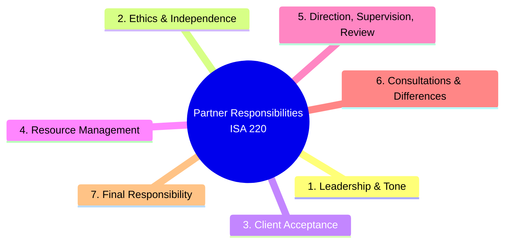

# Client Acceptance, Quality Management, & Preconditions

> [!abstract] Curriculum & Syllabus Context
>
> - **Course:** ACC 305 Auditing and Assurance
> - **Module:** Module 3: Client Acceptance, Quality Management, & Preconditions
> - **Target Reading:** ISA 210; ISQM 1 & 2; ISA 220 (Revised); Messier (11e) Ch. 3 & 19; ICAB Certificate Ch. 2; ICAB Professional Ch. 5 & 6
> - **Syllabus Focus:** Acceptance and continuance evaluation framework; predecessor auditor communication protocol under ISA 210/IESBA; client due diligence (CDD) and AML rules; mandatory preconditions for an audit (financial reporting framework and management premise); scope limitations prior to acceptance; audit engagement letter mandatory contents; recurring audits; changes in terms of engagement; firm-level quality management under ISQM 1 (8 components of SOQM); annual SOQM evaluation; engagement quality reviews under ISQM 2 (eligibility, cooling-off, timing); and engagement partner responsibilities under ISA 220 (Revised).

---

### Section 1: Prospective Client Acceptance & Continuance Framework
Client acceptance and continuance represents the critical first phase of the auditing process. Before an audit firm agrees to act for a new client or continue an existing engagement, it must evaluate whether accepting the assignment complies with professional standards, ethical requirements, and the firm's strategic risk appetite.

#### 1. Rationale for Acceptance Procedures
Acceptance procedures are placed **prior to audit planning** in the audit lifecycle because accepting an unsuitable client poses severe legal, reputational, and financial risks to the audit firm:
- **Management Dishonesty Risk**: If management lacks integrity, the risk of material misstatement due to fraud or deliberate misrepresentation rises exponentially, rendering standard substantive procedures ineffective.
- **Resource & Competence Risk**: Accepting an engagement without the necessary technical expertise (e.g., specialized industry knowledge such as banking, insurance, or complex derivatives) or without adequate staff hours leads to audit failure and professional negligence.
- **Independence & Conflict Risk**: Accepting an engagement that violates ethical independence rules (e.g., financial interests, self-review, or commercial conflicts with existing clients) invalidates the audit opinion and invites regulatory sanctions.

---
#### 2. Predecessor Auditor Communication Protocol (ISA 210 & IESBA Code)
When invited to accept an audit engagement previously conducted by another audit firm, the proposed successor auditor must carry out formal communication with the predecessor auditor.
##### Step-by-Step Communication Procedure:
1. **Obtain Client Permission**: The proposed auditor must request written authorization from the prospective client permitting the proposed auditor to communicate with the predecessor auditor and permitting the predecessor auditor to discuss the client's affairs freely.
2. > [!warning] Exam Pitfall / Exception
   > **If Client Refuses Permission**:
   > - The prospective client is legally entitled to refuse permission.
   > - However, a client's refusal to grant permission raises **grave doubts regarding management's integrity and motivations**.
   > - **Operational Rule**: The proposed auditor should **normally decline the appointment** unless compelling mitigating circumstances are documented.
3. **Written Inquiry to Predecessor Auditor**:
   - Upon receiving client permission, the proposed auditor writes to the predecessor auditor inquiring whether there are any professional or ethical reasons why the proposed auditor should not accept the appointment.
4. **Required Disclosure Matters by Predecessor Auditor**:
   - Upon receiving client permission to disclose, the predecessor auditor should promptly reply in writing, detailing:
     - Any facts or circumstances bearing on **management integrity**.
     - Any **disagreements with management** over accounting principles, auditing procedures, or financial statement disclosures.
     - Communications sent to those charged with governance regarding **fraud, illegal acts, or significant internal control deficiencies**.
     - The predecessor's understanding of the **actual reasons for the change of auditors**.
5. **Handling Silence or Non-Response from Predecessor Auditor**:
   - If the predecessor auditor fails to respond within a reasonable timeframe, the proposed auditor sends a follow-up letter by **recorded delivery**, stating an intention to accept the engagement if no reply is received within a specified period (e.g., 14 days).
   - If no reply is received after the deadline, the proposed auditor is entitled to assume that "silence implies no adverse comment." However, the proposed auditor must still take other reasonable steps (such as background checks and third-party inquiries) to satisfy themselves regarding acceptance risks.

---
#### 3. Client Due Diligence (CDD) & Anti-Money Laundering (AML) Compliance
Under national Anti-Money Laundering (AML) regulations and professional rules, audit firms must establish the true identity of all clients and their beneficial owners before accepting an engagement.
- **Customer Due Diligence (CDD) Requirements**:
  - **Corporate Entities**: Inspect official public records, including the **Certificate of Incorporation**, Memorandum and Articles of Association, official register of shareholders and directors, and latest Annual Returns filed with the Registrar of Joint Stock Companies (RJSC) / Registrar of Companies.
  - **Key Controllers & Individual Owners**: Verify identity using government-issued photo identification (passports, national ID cards) and proof of residential address (utility bills).
  - **Beneficial Ownership Threshold**: Identify any individual who ultimate controls or owns **more than 25%** of voting rights or capital.
- **Document Retention Rule**: Client identification records, CDD documentation, and a complete audit trail of transactions must be retained for a **minimum of 5 years after the cessation** of the client relationship.
- > [!warning] Exam Pitfall / Exception
  > **Tipping-Off Prohibition**: If an audit firm suspects that a prospective or existing client is involved in money laundering, disclosing this suspicion to the client constitutes the criminal offense of "tipping off." Communications with predecessor auditors must be handled with extreme care so as not to breach anti-money laundering non-disclosure mandates.

---
#### 4. Risk Profile Assessment & Commercial Viability
When evaluating a prospective client, the firm categorizes the client into a risk tier:

| Risk Category | Key Client Characteristics | Audit Firm Acceptance Action / Safeguards |
| :--- | :--- | :--- |
| **Low Risk** | • Long-term profitability & strong liquidity • Competent, honest, and stable management • Strong internal control environment • Conservative, prudent accounting policies • Few unusual or related-party transactions | • Standard engagement acceptance. • Routine staffing allocation and standard review procedures. |
| **High Risk** | • Poor financial performance / going concern doubts • Highly dominant chief executive or lack of CFO • Material weaknesses in internal controls • Aggressive or questionable accounting treatments • Complex, unexplained related-party transactions | • Require approval by Firm Risk Management Partner. • Assign experienced industry specialists. • Mandate pre-issuance Engagement Quality Review (EQR). • Set higher audit fees reflecting increased audit risk. |

---
### Section 2: Preconditions for an Audit & Terms of Engagement (ISA 210)
ISA 210 (*Agreeing the Terms of Audit Engagements*) establishes the statutory and professional framework governing the preconditions for accepting an audit and the formal contract between the auditor and client.
#### 1. The Preconditions for an Audit
> [!info] Key Definition
>
> Before accepting an audit engagement, the auditor is required by ISA 210 to establish whether the **preconditions for an audit** are present.

##### The Two Mandatory Preconditions:
1. **Acceptability of the Financial Reporting Framework**:
   - The auditor must determine whether the financial reporting framework adopted by management (e.g., IFRS, BFRS, or local GAAP) is acceptable considering the nature of the entity (commercial, non-profit, public sector), the purpose of the financial statements, and relevant statutory requirements.
2. **Obtaining Management's Explicit Agreement (The Premise of an Audit)**:
   - The auditor must obtain the agreement of management and, where appropriate, those charged with governance (TCWG) that they acknowledge and understand their fundamental responsibilities for:
     - **a. Preparation of Financial Statements**: Preparing and fairly presenting the financial statements in accordance with the applicable financial reporting framework.
     - **b. Internal Control**: Designing, implementing, and maintaining such internal control as management determines is necessary to enable the preparation of financial statements free from material misstatement, whether due to fraud or error.
     - **c. Provision of Access & Information**: Providing the auditor with:
       - Unrestricted access to all information relevant to the preparation of the financial statements (books, records, documentation).
       - Any additional information or explanations requested by the auditor.
       - Unrestricted access to personnel within the entity from whom the auditor deems it necessary to obtain audit evidence.

> [!warning] Exam Pitfall / Exception
>
> **Rule on Refusal when Preconditions Are Absent**:
> If the preconditions for an audit are not present, the auditor **shall not accept** the proposed audit engagement unless required to do so by law or regulation.

---
#### 2. Scope Limitations Prior to Acceptance
> [!warning] Exam Pitfall / Exception
>
> If management or those charged with governance impose a restriction or limitation on the scope of the auditor's work in the terms of a proposed engagement such that the auditor believes the limitation will result in the auditor **disclaiming an opinion** on the financial statements, the auditor **shall not accept** such a limited engagement as an audit engagement, unless required by statute.

---
#### 3. The Audit Engagement Letter
The agreed terms of the audit engagement must be recorded in writing in the form of an **Audit Engagement Letter** or other suitable contractual agreement.
##### Primary Purposes of the Engagement Letter:
- To clarify the extent of the respective responsibilities of management and the auditor.
- To minimize the possibility of misunderstandings regarding the scope, objectives, and limitations of the audit.
- To confirm the auditor's acceptance of the appointment and establish the contract for legal enforceability.
##### Mandatory Contents of an Engagement Letter (ISA 210.10):
1. **Objective and Scope of the Audit**: Clear statement that the objective is to express an opinion on the financial statements in accordance with ISAs/GAAS.
2. **Auditor's Responsibilities**: Conducting the audit in compliance with ethical and professional auditing standards.
3. **Management's Responsibilities**: Explicit reiteration of management's duty regarding financial statement preparation, internal controls, and unrestricted access to records.
4. **Applicable Financial Reporting Framework**: Identification of the framework used (e.g., IFRS/BFRS).
5. **Expected Form and Content of Audit Reports**: Reference to the expected structure of the auditor's report, including a statement that circumstances may arise where the report differs from its expected form.
6. **Inherent Limitations Warning**: Explicit notice that due to the test nature and inherent limitations of an audit, together with the inherent limitations of internal control, an unavoidable risk exists that some material misstatements may remain undiscovered.
##### Tailored / Practical Contents (Variable Items):
- Basis of fee calculation and billing arrangements.
- Arrangements regarding the involvement of other auditors, component auditors, or external experts.
- Arrangements regarding the involvement of internal auditors and client staff.
- Arrangements to be made with predecessor auditors (initial audits).
- Any statutory or contractual limitations on the auditor's liability (where permitted by law).
- Requirement for management to provide written representations (ISA 580).

---
#### 4. Recurring Audits & Changes in Engagement Terms
##### Recurring Audits:
On recurring audits, the auditor does not need to issue a new engagement letter every year. However, the auditor must evaluate whether circumstances require the terms to be revised.
- **Triggers for Re-issuing an Engagement Letter**:
  - Indications that the client misunderstands the objective or scope of the audit.
  - Revised or special terms of engagement.
  - Recent change in senior management, board of directors, or ownership.
  - Significant change in the size or nature of the client's business.
  - Changes in legal, statutory, or regulatory requirements.
  - Change in the applicable financial reporting framework.
##### Requests to Change the Terms of Engagement (Audit to Lower Assurance):
> [!warning] Exam Pitfall / Exception
>
> If, prior to completing the audit, management requests the auditor to change the engagement to one that conveys a lower level of assurance (e.g., changing from a statutory audit to a review or agreed-upon procedures engagement):
> - The auditor must evaluate whether there is **reasonable justification** for the change (e.g., a genuine change in client circumstances or a misunderstanding regarding the nature of an audit).
> - **Unreasonable Justification**: If management requests a change because the auditor is unable to obtain sufficient appropriate audit evidence or because management wants to avoid a qualified or modified audit opinion, the justification is **unreasonable**.
> - **Action if Unreasonable**: The auditor must refuse the request. If management refuses to allow the auditor to continue the original audit engagement, the auditor shall:
>   - **Withdraw** from the engagement where legally permissible.
>   - Determine whether there is a contractual, legal, or professional obligation to report the circumstances to those charged with governance, owners, or regulators.

---
### Section 3: Firm-Level Quality Management (ISQM 1 & ISQM 2)
The International Auditing and Assurance Standards Board (IAASB) transitioned from the legacy quality control framework (**ISQC 1**) to a modern, risk-based quality management framework comprising **ISQM 1** (*Quality Management for Firms*) and **ISQM 2** (*Engagement Quality Reviews*).

#### 1. System of Quality Management (SOQM)
> [!info] Key Definition
>
> Under ISQM 1, every firm that performs audits, reviews, or other assurance engagements must design, implement, and operate a **System of Quality Management (SOQM)**.

##### Dual Objectives of the SOQM (ISQM 1.14):
1. The firm and its personnel fulfill their responsibilities in accordance with professional standards and applicable legal and regulatory requirements, and conduct engagements in accordance with such standards.
2. Engagement reports issued by the firm or engagement partners are appropriate in the circumstances.

---
#### 2. The Eight Components of ISQM 1
ISQM 1 structures the firm-level quality management system around eight interconnected components:

| ISQM 1 Component | Comprehensive Operational Scope & Key Requirements |
| :--- | :--- |
| **1. Firm's Risk Assessment Process** | The firm applies a tailored risk-based process: establishes quality objectives, identifies and assesses quality risks, and designs/implements specific responses to manage those risks. |
| **2. Governance and Leadership** | Establishes the "tone at the top." Requires leadership (managing partner/board) to accept ultimate accountability for quality. Commercial and financial priorities (profit targets, fee volume) must **never override audit quality**. Partner remuneration must reward audit quality, not just commercial sales. |
| **3. Relevant Ethical Requirements** | Ensures the firm and its personnel understand and fulfill ethical obligations under IESBA/local codes. Includes annual written independence declarations from all partners and staff. |
| **4. Acceptance & Continuance** | Establishes policies that engagements are accepted only when the client exhibits integrity, and the firm has the technical capability, resources, and time to perform the audit. |
| **5. Engagement Performance** | Governs how engagements are conducted: promotes consistent quality through proper Direction, Supervision, and Review (DSR); formal consultation policies on complex/contentious matters; resolution of internal differences of opinion; assembly of final audit files within **60 days** of the report date; and document retention for at least **5 to 7 years**. |
| **6. Resources** | Mandates timely provision of four categories of resources: • **Human**: Qualified, competent staff given sufficient time. • **Technological**: IT audit tools, software, data analytics routines. • **Intellectual**: Audit methodologies, checklists, technical manuals. • **Service Providers**: Vetted external IT/expert providers. |
| **7. Information & Communication** | Establishes reliable information systems and an open culture that encourages personnel to communicate quality concerns without fear of reprisal. |
| **8. Monitoring & Remediation** | Performs ongoing and periodic evaluations of the SOQM, including **cold reviews** (post-issuance file reviews) selecting at least one completed engagement per partner on a cyclical basis. Requires **root cause analysis** of identified deficiencies to implement timely remedial action. |

---
#### 3. Annual Evaluation of the SOQM
The individual with ultimate responsibility for the SOQM (Managing Partner/CEO) must evaluate the SOQM at least annually and reach one of three conclusions:
1. **Unmodified Conclusion**: The SOQM provides reasonable assurance that the quality objectives are being achieved.
2. **Modified Conclusion**: The SOQM provides reasonable assurance *except for* specific, identified deficiencies that are severe but not pervasive.
3. **Adverse Conclusion**: The SOQM does not provide reasonable assurance because deficiencies are pervasive.

---
#### 4. Engagement Quality Reviews (ISQM 2)
> [!info] Key Definition
>
> An **Engagement Quality Review (EQR)** is an objective evaluation of the significant judgments made by the engagement team and the conclusions reached thereon, performed by an independent **Engagement Quality Reviewer** *before* the audit report is issued (commonly known as a **Hot Review**).

##### Mandate for EQR (ISQM 2):
- **Mandatory Engagements**:
  1. Audits of financial statements of **listed entities** / **Public Interest Entities (PIEs)**.
  2. Audits or engagements for which an EQR is required by law or regulation.
  3. Engagements identified by the firm's risk assessment as high-risk or complex requiring an EQR as a quality response.
##### Eligibility & Independence of the EQR Reviewer:
- Must **not** be a member of the current engagement team.
- Must possess the necessary technical competence, authority, and time.
- **Cooling-Off Period**: A minimum **2-year cooling-off period** is required before an engagement partner can act as the EQR reviewer for the same client.
##### EQR Procedures & Responsibilities:
- Review selected audit documentation relating to significant judgments, significant risks, and Key Audit Matters (KAMs).
- Discuss significant matters and judgments with the engagement partner.
- Review the financial statements and proposed audit report.
- Evaluate the engagement team's assessment of independence and consultations on contentious matters.
- > [!warning] Exam Pitfall / Exception
  > **Crucial Rule**: The engagement partner **shall not date or sign** the auditor's report until the EQR reviewer completes the EQR.

---
### Section 4: Engagement-Level Quality Management (ISA 220 Revised)
While ISQM 1 and ISQM 2 operate at the firm level, **ISA 220 (Revised)** (*Quality Management for an Audit of Financial Statements*) governs quality management at the individual engagement level.
#### 1. Engagement Partner Responsibilities
The **Audit Engagement Partner** holds ultimate operational responsibility for managing and achieving quality on the audit engagement.

#### 2. Key Operational Requirements under ISA 220 (Revised)
- **Continuous Partner Involvement**: Partners cannot delegate ultimate oversight; they must be actively involved in risk assessment, planning, direction, supervision, and review.
- **Direction, Supervision, and Review (DSR)**:
  - Direction involves instructing team members on their objectives, ethical duties, and risk areas.
  - Supervision involves tracking audit progress, coaching junior staff, and addressing emerging issues.
  - Review involves examining working papers at appropriate times, focusing on critical audit areas, significant judgments, accounting estimates, uncorrected misstatements, and draft reports.
- > [!warning] Exam Pitfall / Exception
  > **Handling Differences of Opinion**: If a difference of opinion arises within the audit team or between the partner and the EQR reviewer/consultant, the firm's formal dispute resolution procedures must be followed. **The audit opinion cannot be issued until the difference is resolved.**

---
### Section 5: Practical Numerical & Procedural Scenario Walkthrough
To demonstrate the application of client acceptance, fee modeling, and quality management rules, consider the following comprehensive case study.

> [!example] Numerical Problem & Case Study
>
> #### Scenario Description
> **Auditor**: Apex & Co., Chartered Accountants
> **Prospective Client**: Titan Logistics Ltd. (a rapidly growing freight and supply chain company seeking its first statutory audit to secure a $10M bank loan)
> ##### Key Scenario Facts:
> 1. **Predecessor Auditor Situation**: Titan was previously audited by Beta & Co. When Apex & Co. requested written permission from Titan's management to contact Beta & Co., Titan's CEO refused, stating that Beta & Co. was "over-charging and argumentative over minor revenue adjustments."
> 2. **Fee & Resource Budget Model**:
>    - Apex & Co.'s standard hourly billing rates: Partner = $\$250$/hr, Manager = $\$150$/hr, Senior = $\$100$/hr, Assistant = $\$50$/hr.
>    - Initial risk assessment indicates Titan requires: Partner = 20 hrs, Manager = 60 hrs, Senior = 150 hrs, Assistant = 300 hrs.
>    - Titan's CEO offers a fixed, non-negotiable fee of $\$20,000$ for the audit.
> 3. **Non-Audit Service Request**: Titan asks Apex & Co. to design and implement its new automated inventory and revenue IT system concurrently with the audit.
> ---
> #### Comprehensive Evaluation & Solutions
> ##### Step 1: Evaluation of Predecessor Communication Refusal
> - **Analysis**: Management's refusal to grant permission to contact Beta & Co. is a major red flag under ISA 210 and the ICAB/IESBA Codes. It suggests management may be attempting to conceal disagreements over accounting policies, fraud, or fee disputes.
> - **Mandatory Action**: Apex & Co. must explain the professional necessity of communication to management. If management persists in its refusal, Apex & Co. **must decline the appointment**.
> ---
> ##### Step 2: Quantitative Fee & Resource Budget Analysis
> Let us model the total cost of capital hours required to perform a quality audit under ISA 220 (Revised) and ISQM 1:
> > [!quote] Formula & Derivation
> > $$\text{Required Audit Budget} = \sum (\text{Hours}_i \times \text{Billing Rate}_i)$$
> >
> > $$\text{Partner Cost} = 20 \text{ hrs} \times \$250/\text{hr} = \$5,000$$
> > $$\text{Manager Cost} = 60 \text{ hrs} \times \$150/\text{hr} = \$9,000$$
> > $$\text{Senior Cost} = 150 \text{ hrs} \times \$100/\text{hr} = \$15,000$$
> > $$\text{Assistant Cost} = 300 \text{ hrs} \times \$50/\text{hr} = \$15,000$$
> >
> > $$\text{Total Required Audit Fee} = \$5,000 + \$9,000 + \$15,000 + \$15,000 = \$44,000$$
> Now, calculate the **Fee Deficit Margin (%)**:
> > [!quote] Formula & Derivation
> > $$\text{Fee Deficit Margin} = \frac{\text{Proposed Fee} - \text{Required Fee}}{\text{Required Fee}} \times 100\%$$
> >
> > $$\text{Fee Deficit Margin} = \frac{\$20,000 - \$44,000}{\$44,000} \times 100\% = \frac{-\$24,000}{\$44,000} \times 100\% = -54.55\%$$
> ##### Quality Risk Impact:
> - Accepting a fee that is **$54.55\%$ below the standard resource requirement** creates a severe **Self-Interest Threat** and a quality failure risk under ISQM 1 / ISA 220.
> - Accepting a "lowballed" fee of $\$20,000$ would force the engagement partner to cut audit hours, skip necessary substantive procedures, or under-staff the engagement, directly violating ISQM 1 Component 2 (Commercial considerations must not impair quality) and Component 6 (Sufficient human resources).
> ---
> ##### Step 3: Evaluation of IT System Implementation Request
> - **Analysis**: Designing and implementing a financial information technology system (FITS) that generates data for the financial statements creates an unmanageable **Self-Review Threat** and **Management Responsibility Threat** under the IESBA Code and FRC Ethical Standard.
> - **Mandatory Action**: Apex & Co. cannot provide FITS implementation services to an audit client where the IT system generates significant accounting entries.
> ##### Final Acceptance Decision:
> Apex & Co. **must decline the audit engagement** due to management's restriction on predecessor communication, an unviable audit fee that impairs audit quality, and prohibited non-audit service conflicts.