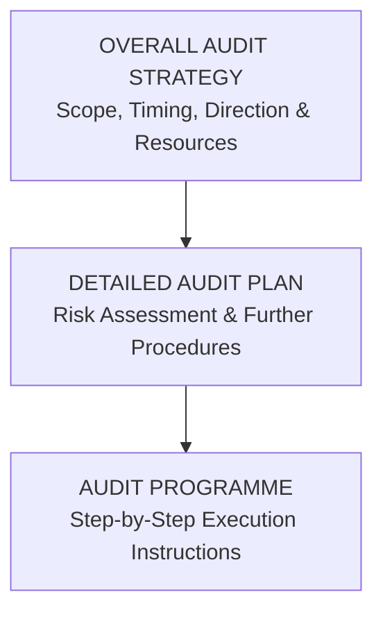
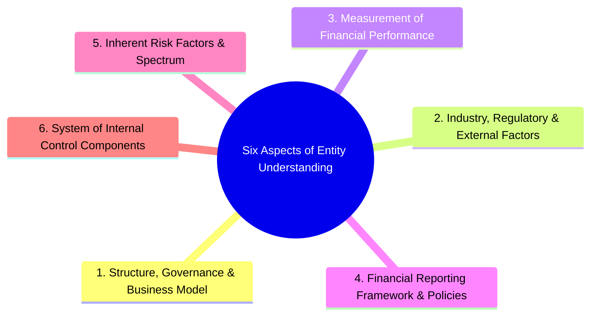
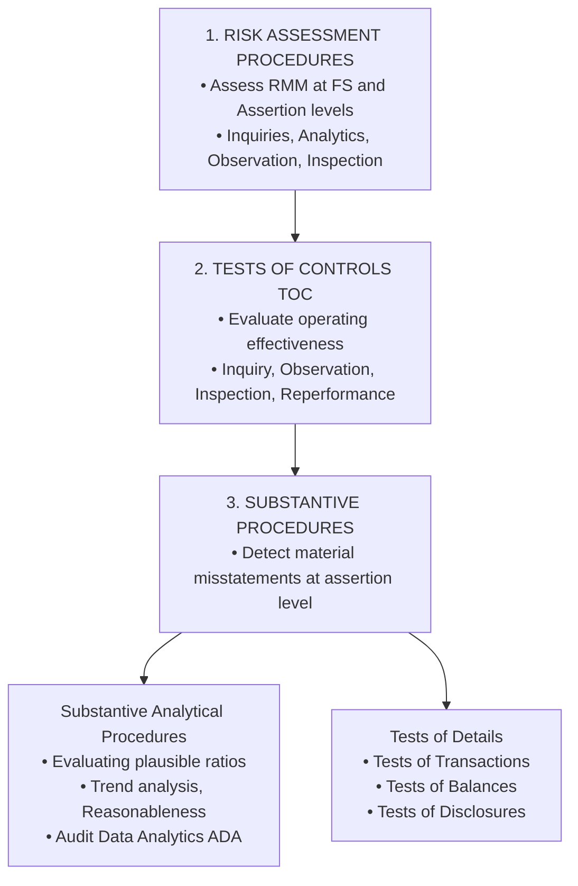
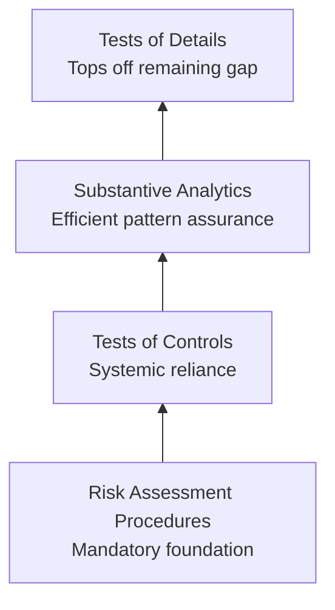

# Understanding the Entity & Audit Planning Strategy

> [!abstract] Curriculum & Syllabus Context
>
> - **Course:** ACC 305 Auditing and Assurance
> - **Module:** Module 4: Understanding the Entity & Audit Planning Strategy
> - **Target Reading:** ISA 300; ISA 315 (Revised 2020); ISA 520; Messier (11e) Ch. 3; ICAB Certificate Ch. 3; ICAB Professional Ch. 7 & 8
> - **Syllabus Focus:** Objectives and benefits of audit planning under ISA 300; preliminary engagement activities; overall audit strategy (scope, timing, direction, resources) vs. detailed audit plan (audit programme); six required aspects of understanding the entity under ISA 315 (Revised 2020); inherent risk factors and spectrum of inherent risk; risk assessment procedures; audit testing taxonomy (risk assessment, tests of controls, substantive procedures); audit testing hierarchy and assurance bucket analogy; planning analytical procedures (ratios, trends, ADA integration); and tailored audit programme design.

---

### Section 1: Concept, Objectives, & Framework of Audit Planning (ISA 300)
Audit planning is not an isolated or discrete phase of an audit; rather, it is a continuous, iterative process that often begins shortly after (or in connection with) the completion of the previous audit and continues until the completion of the current audit engagement.
#### 1. Purpose and Objectives of Audit Planning
The primary objective of audit planning under **ISA 300 (*Planning an Audit of Financial Statements*)** and **Messier Chapter 3** is to enable the auditor to conduct the audit in an effective and efficient manner, ensuring that audit risk is reduced to an acceptably low level.

Proper planning achieves several vital objectives:
1. **Devoting Appropriate Attention to Important Areas**: Identifies high-risk areas (e.g., complex accounting estimates, non-routine transactions) so audit resources are concentrated where material misstatements are most likely to occur.
2. **Timely Identification and Resolution of Potential Problems**: Enables the auditor to spot technical or accounting difficulties early (e.g., valuation of unlisted financial assets) and consult internal/external specialists before fieldwork deadlines.
3. **Proper Organization and Management of the Engagement**: Ensures that the engagement is conducted efficiently, avoiding redundant procedures and minimizing client disruption.
4. **Appropriate Selection and Assignment of Engagement Personnel**: Matches staff experience and technical capabilities to the specific risk profile of the client (e.g., assigning IT auditors to clients with complex ERP systems).
5. **Facilitation of Direction, Supervision, and Review**: Establishes a clear framework for senior audit team members (managers and partners) to direct junior staff, supervise ongoing fieldwork, and review audit working papers as work progresses.
6. **Coordination of Work Done by Others**: Facilitates seamless integration of work performed by component auditors, management/auditor experts, and internal audit personnel.

---
#### 2. Linkage to Preliminary Engagement Activities
Before detailed planning commences, the auditor must execute preliminary engagement activities (governed by **ISA 210** and **ISQM 1**):
- **Ethical and Independence Re-evaluation**: Confirming that the engagement team and firm comply with ethical requirements, including rotational rules and financial independence.
- **Agreement of Engagement Terms**: Ensuring that the Audit Engagement Letter is signed and management acknowledges its premise of responsibility.
- **Evaluating Client Continuance**: Re-assessing management integrity and firm resource availability based on prior-year audit experiences.

---
### Section 2: Overall Audit Strategy vs. Detailed Audit Plan (Audit Programme)
Audit planning documentation is structured at two distinct levels: the high-level **Overall Audit Strategy** and the operational **Detailed Audit Plan (Audit Programme)**.



#### 1. The Overall Audit Strategy
The **Overall Audit Strategy** sets the scope, timing, and direction of the audit and guides the development of the more detailed audit plan. The engagement partner and key team members are directly involved in establishing the strategy.

| Key Strategy Element | Comprehensive Operational Scope |
| :--- | :--- |
| **1. Characteristics of the Engagement (Scope)** | • Applicable Financial Reporting Framework (e.g., IFRS / BFRS).<br>• Statutory reporting requirements (e.g., Companies Act 1994, BSEC rules).<br>• Number and geographic dispersion of locations/branches requiring component audits.<br>• Extent of IT environment integration and automated processing.<br>• Use of service organizations (ISA 402) and availability of internal audit work (ISA 610). |
| **2. Reporting Objectives, Timetable, & Communications** | • Entity’s timetable for interim and final financial reporting.<br>• Key dates for meetings with Management and Those Charged with Governance (TCWG).<br>• Expected nature and timing of audit reports, management letters, and Key Audit Matters (KAM).<br>• Team discussion (brainstorming) meeting schedules and supervisory review intervals. |
| **3. Significant Factors, Audit Focus, & Preliminary Knowledge** | • Setting preliminary materiality ($\text{Overall Materiality}$ and $\text{Performance Materiality}$).<br>• High-risk areas identified in preliminary risk assessments (e.g., revenue recognition, going concern).<br>• Results of previous audits and evaluation of internal control design.<br>• Significant business developments, industry trends, and regulatory changes. |
| **4. Nature, Timing, & Extent of Resources** | • Allocation of appropriate staff to high-risk areas (e.g., senior staff for complex estimates).<br>• Engagement budget, allocated hours per audit area, and deadline milestones.<br>• Timing of audit visits (Interim visit for control testing vs. Final visit for substantive testing).<br>• Involvement of specialists (e.g., actuaries, IT specialists, legal experts). |

---
#### 2. The Detailed Audit Plan & Audit Programme
> [!info] Key Definition
>
> The **Audit Plan** is a detailed, operational document that translates the overall audit strategy into specific audit procedures. It includes:
> - **Planned Risk Assessment Procedures**: Procedures under ISA 315 to identify risks of material misstatement.
> - **Planned Further Audit Procedures at Assertion Level**: Specific tests of controls and substantive procedures designed under ISA 330.
> - **Other Planned Procedures**: Mandatory procedures required by ISAs (e.g., direct confirmation of receivables under ISA 505, subsequent event reviews under ISA 560).

An **Audit Programme** represents the set of explicit, step-by-step instructions given to audit assistants. It specifies the precise **Nature, Timing, and Extent (NTE)** of tests required for each financial statement account or transaction cycle.

> [!warning] Exam Pitfall / Exception
>
> *Warning on Standardized Audit Packs*: Many audit firms utilize standardized "audit packs" or checklists. While useful for consistency, auditors must never apply them mechanically. Auditing standards require standardized programmes to be tailored to reflect the unique risk profile, internal control environment, and business operations of the client.

---
### Section 3: Understanding the Entity and Its Environment (ISA 315 Revised 2020)
Under **ISA 315 (Revised 2020) — *Identifying and Assessing the Risks of Material Misstatement***, obtaining a comprehensive understanding of the entity and its environment is the indispensable foundation for a risk-based audit. Risk assessment is not a separate audit stage; it provides the frame of reference for setting materiality, designing audit tests, and evaluating audit evidence.
#### 1. The Six Required Aspects of Understanding



1. **Organizational Structure, Ownership, Governance, & Business Model**:
   - *Structure & Ownership*: Family-owned vs. listed public interest entity, complex group structures, subsidiaries, joint ventures.
   - *Business Model*: How the entity generates revenue, its primary operations, supply chain dependencies, distribution channels, and the extent to which the business model integrates information technology.
   - *Governance*: Board composition, active oversight by the audit committee, and executive compensation structures.
2. **Industry, Regulatory, & Other External Factors**:
   - *Industry Conditions*: Competitive environment, market demand, technological developments, cyclical/seasonal activity.
   - *Regulatory Framework*: Industry-specific laws, tax regulations, environmental standards, and statutory oversight (e.g., Financial Reporting Council Bangladesh, BSEC rules).
   - *Macroeconomic & Climate Factors*: Inflation, interest rates, exchange rate volatility, supply chain disruptions, and climate-related physical/transition risks.
3. **Measurement and Review of Financial Performance**:
   - *Internal Performance Measures*: Key Performance Indicators (KPIs), variance analysis against budgets, divisional segment margins, and executive bonus targets.
   - *External Performance Measures*: Analyst expectations, credit rating agency reports, and debt covenant ratios.
   - *Audit Relevance*: Inordinate pressure to meet internal KPIs or external analyst targets creates strong incentives for management bias and fraudulent financial reporting.
4. **Applicable Financial Reporting Framework & Accounting Policies**:
   - Evaluation of whether selected accounting policies are appropriate, consistent with IFRS/BFRS, and aligned with industry standards.
   - Critical scrutiny of accounting for complex, unusual, or emerging transactions (e.g., revenue recognition under IFRS 15, leases under IFRS 16, financial instruments under IFRS 9).
5. **Inherent Risk Factors & The Spectrum of Inherent Risk**:
   - **Inherent Risk Factors**: Characteristics of events or conditions that affect susceptibility to misstatement of an assertion before considering controls. These include:
     - **Complexity**: Complicated mathematical models, multi-layered supply chains, or intricate regulatory regimes.
     - **Subjectivity**: Accounting estimates requiring management assumptions (e.g., fair value measurements, impairment testing).
     - **Change**: Rapid technological shifts, business acquisitions, or new accounting standards.
     - **Uncertainty**: Significant estimation uncertainty where outcomes depend on future events.
     - **Susceptibility to Bias / Fraud**: Earnings management pressures, management override opportunities, or asset misappropriation risks.
   - **Spectrum of Inherent Risk**: Inherent risk lies on a continuum ranging from lower to higher risk. The combination of likelihood and magnitude of misstatement determines an inherent risk’s exact position on the spectrum.
6. **Components of the Entity's System of Internal Control**:
   - Obtaining an understanding of the 5 interrelated components: (1) Control Environment, (2) Entity's Risk Assessment Process, (3) Process to Monitor Internal Control, (4) Information System and Communication, and (5) Control Activities.

---
#### 2. Risk Assessment Procedures to Obtain Understanding
The auditor must perform a combination of the following risk assessment procedures (inquiry alone is insufficient):
- **Inquiries of Management and Others**: Inquiring of executive management, internal audit, in-house legal counsel, marketing personnel, and IT staff.
- **Analytical Procedures**: Evaluating high-level financial and non-financial data to spot unexpected trends or ratios.
- **Observation and Inspection**: Observing entity operations, inspecting policy manuals, board minutes, credit files, and touring plant/warehouse facilities.
- **Engagement Team Brainstorming Meeting**: Mandatory discussion among key team members (led by the engagement partner) regarding the susceptibility of the financial statements to material misstatements due to error or fraud (ISA 240 / ISA 315).

---
### Section 4: Types of Audit Tests & The Audit Testing Hierarchy
Auditors perform three fundamental categories of audit procedures during an engagement.
#### 1. Comprehensive Taxonomy of Audit Tests



1. **Risk Assessment Procedures**:
   - Conducted during the planning stage to assess Inherent Risk ($IR$) and Control Risk ($CR$).
   - Do not directly provide substantive evidence to express an audit opinion on account balances.
2. **Tests of Controls (TOC)**:
   - Designed to evaluate the **operating effectiveness** of internal controls in preventing, or detecting and correcting, material misstatements at the assertion level.
   - Mandatory when: (a) the auditor’s risk assessment assumes that controls operate effectively (Reliance Strategy), or (b) substantive procedures alone cannot provide sufficient appropriate evidence (e.g., highly automated e-commerce environments).
3. **Substantive Procedures**:
   - Designed to detect material misstatements at the assertion level. Always mandatory for all material classes of transactions, account balances, and disclosures, regardless of the assessed level of control risk.
   - **Substantive Analytical Procedures (SAP)**: Plausible relationships between financial and non-financial data (e.g., calculating interest expense by multiplying average loan balance by weighted-average interest rate).
   - **Tests of Details (TOD)**: Direct empirical testing of individual transactions, ending balances, and disclosures (e.g., physically inspecting inventory, confirming bank balances via direct confirmation letters).
   - **Dual-Purpose Tests**: Audit procedures that concurrently test the operating effectiveness of a control and detect substantive monetary misstatements in the same transaction (e.g., inspecting a sample of vendor invoices for manager authorization initials while simultaneously re-performing the mathematical calculation to verify invoice accuracy).

---
#### 2. The Audit Testing Hierarchy & "Assurance Bucket" Analogy
The **Audit Testing Hierarchy** establishes a logical, cost-effective sequence for gathering audit evidence.



**Logical Flow of the Assurance Bucket**:
1. Every assertion for a material account requires a filled "bucket" of evidence to provide Reasonable Assurance.
2. The auditor fills the base of the bucket with **Risk Assessment Procedures**.
3. Next, if controls are well-designed and implemented, the auditor conducts **Tests of Controls**. Successful control reliance fills a substantial portion of the bucket at a low cost per transaction.
4. The auditor then performs **Substantive Analytical Procedures**, leveraging predictable relationships to further fill the bucket.
5. Finally, the auditor "tops off" the remaining required assurance using **Tests of Details**.

If Control Risk is assessed at maximum (Substantive Strategy), no reliance is placed on controls, and the entire bucket must be filled using substantive analytical procedures and extensive tests of details.

---
### Section 5: Analytical Procedures at Planning & Audit Data Analytics (ADA)
> [!info] Key Definition
>
> Analytical procedures are defined under **ISA 520 (*Analytical Procedures*)** as the evaluation of financial information through analysis of plausible relationships among both financial and non-financial data, including the investigation of identified fluctuations or inconsistent relationships.

#### 1. Three Mandatory / Optional Stages of Analytical Procedures

| Audit Stage | Regulatory Status | Primary Purpose / Objective |
| :--- | :--- | :--- |
| **1. Planning / Risk Assessment** | **Mandatory** (ISA 315) | To understand the entity, identify unexpected fluctuations/trends, and highlight high-risk areas requiring audit focus. |
| **2. Substantive Testing** | **Optional** (ISA 520) | To obtain substantive audit evidence supporting specific financial statement assertions (used when efficient). |
| **3. Final Overall Review** | **Mandatory** (ISA 520) | To assist the auditor when forming an overall conclusion as to whether the financial statements are consistent with the auditor's understanding of the entity. |

---
#### 2. Planning Analytical Procedures: Methods & Data Sources
During planning, analytical procedures rely on high-level, aggregated data:
- **Trend Analysis**: Comparing current draft figures against prior periods (e.g., year-over-year revenue growth).
- **Ratio Analysis**: Calculating key financial ratios and comparing them against prior periods, budgets, or external industry benchmarks:
  - *Short-Term Liquidity Ratios*:
    > [!quote] Formula & Derivation
    > $$\text{Current Ratio} = \frac{\text{Current Assets}}{\text{Current Liabilities}}$$
    > $$\text{Quick Ratio} = \frac{\text{Cash} + \text{Marketable Securities} + \text{Receivables}}{\text{Current Liabilities}}$$
  - *Activity / Operating Ratios*:
    > [!quote] Formula & Derivation
    > $$\text{Receivable Days} = \frac{\text{Trade Receivables}}{\text{Revenue}} \times 365$$
    > $$\text{Inventory Turnover} = \frac{\text{Cost of Goods Sold}}{\text{Average Inventory}}$$
  - *Profitability Ratios*:
    > [!quote] Formula & Derivation
    > $$\text{Gross Profit Margin \%} = \frac{\text{Gross Profit}}{\text{Revenue}} \times 100\%$$
- **Sources of Data**: Interim financial reports, management budgets/forecasts, VAT/sales tax returns, bank statements, industry trade statistics.

---
#### 3. Integration of Audit Data Analytics (ADA)
Modern auditing leverages **Audit Data Analytics (ADA)**—the science and art of discovering and analyzing patterns, identifying anomalies, and extracting useful information from data underlying or supporting the subject matter of an audit through analysis, modeling, and visualization.

In Planning, ADA enhances risk assessment by:
- Analyzing 100% of general ledger journal entries to detect unusual posting times, unauthorized user IDs, or rounded-amount entries.
- Utilizing data visualization dashboards (e.g., heat maps of monthly revenue across 50 retail locations) to instantly flag outlier branches.
- Matching 3-way purchase records (Purchase Order $\rightarrow$ Goods Received Note $\rightarrow$ Vendor Invoice) across entire transaction populations.

> [!warning] Exam Pitfall / Exception
>
> *Limitations of Planning Analytics*: Because planning analytics utilize highly aggregated data, they provide only a broad initial indication of potential misstatement. They do not provide conclusive substantive evidence and must be corroborated by further detailed testing.

---
### Section 6: Comprehensive Practical & Numerical Scenario Walkthrough
> [!example] Numerical Problem & Case Study
>
> #### Scenario Context
> You are the audit manager planning the statutory audit of **Apex Apparel Ltd.**, a garments manufacturer in Bangladesh, for the year ended June 30, 2026. The draft financial statements reveal the following figures:
> - **Draft Revenue (2026)**: BDT 800,000,000 (2025: BDT 700,000,000)
> - **Draft Cost of Goods Sold (2026)**: BDT 620,000,000 (2025: BDT 511,000,000)
> - **Draft Gross Profit (2026)**: BDT 180,000,000 (2025: BDT 189,000,000)
> - **Trade Receivables (2026)**: BDT 160,000,000 (2025: BDT 115,000,000)
> - **Closing Inventory (2026)**: BDT 155,000,000 (2025: BDT 102,000,000)
> - **Overall Planning Materiality**: Established at BDT 8,000,000 (1% of Revenue).
> During initial inquiry under ISA 315, management indicates that despite an increase in production volume, competitive export pricing forced price reductions, while raw material fabric prices rose.
> ---
> #### Step 1: Perform Planning Analytical Procedures (Ratios & Trends)
> 1. **Revenue Growth Rate**:
>    $$\text{Revenue Growth \%} = \frac{800,000,000 - 700,000,000}{700,000,000} \times 100\% = +14.29\%$$
> 2. **Gross Profit Margin Percentage**:
>    $$\text{GP \% (2025)} = \frac{189,000,000}{700,000,000} \times 100\% = 27.00\%$$
>    $$\text{GP \% (2026)} = \frac{180,000,000}{800,000,000} \times 100\% = 22.50\%$$
>    *Variance*: A severe contraction of $4.50\%$ in Gross Margin.
> 3. **Trade Receivable Collection Period (Receivable Days)**:
>    $$\text{Receivable Days (2025)} = \frac{115,000,000}{700,000,000} \times 365 = 59.93 \text{ days}$$
>    $$\text{Receivable Days (2026)} = \frac{160,000,000}{800,000,000} \times 365 = 73.00 \text{ days}$$
>    *Variance*: An increase of $13.07\text{ days}$ in collection time.
> 4. **Inventory Holding Period (Inventory Days)**:
>    $$\text{Inventory Days (2025)} = \frac{102,000,000}{511,000,000} \times 365 = 72.86 \text{ days}$$
>    $$\text{Inventory Days (2026)} = \frac{155,000,000}{620,000,000} \times 365 = 91.25 \text{ days}$$
>    *Variance*: An increase of $18.39\text{ days}$ in inventory holding time.
> ---
> #### Step 2: Risk Assessment & Audit Strategy Formulation
> Based on the quantitative analytical indicators and ISA 315 understanding, the auditor identifies the following key risk areas:
> | Identified Risk Area | Underlying Audit Risk & Assertion Impact | Overall Audit Strategy & Audit Programme Response |
> | :--- | :--- | :--- |
> | **1. Inventory Valuation & Obsolescence** | **High Inherent Risk**: Inventory days jumped from 72.9 to 91.3 days. Holding BDT 155m in inventory amidst declining margins suggests overstocked or slow-moving garment lines.<br>*Assertion*: **Valuation and Allocation**. | • **Strategy**: Substantive Strategy on valuation.<br>• **Programme**: Attend physical year-end count; perform test counts; inspect aged inventory schedules; test Net Realizable Value (NRV) by comparing cost to post-year-end selling prices less completion/selling costs under IAS 2. |
> | **2. Trade Receivables Recoverability** | **High Inherent Risk**: Receivable collection lengthened by 13 days, and total receivables expanded by 39.1% while sales grew 14.3%. Indicates potential customer default or uncollectible balances.<br>*Assertion*: **Valuation & Accuracy**. | • **Strategy**: Combined / Substantive approach.<br>• **Programme**: Perform direct external confirmation (ISA 500/505); perform ADA aging analysis; evaluate historical bad debt patterns; test subsequent cash receipts after year-end. |
> | **3. Revenue Cut-off & Accuracy** | **Moderate-to-High Risk**: Pressure to meet sales targets amidst margin decline increases risk of recording next period’s shipments in current period.<br>*Assertion*: **Cut-off & Occurrence**. | • **Strategy**: Focused Substantive Testing.<br>• **Programme**: Perform detailed sales cut-off tests 10 days before and after June 30, 2026; agree shipping documents (Goods Export Bills) with sales invoices and general ledger postings. |
> ---
> #### Step 3: Tailored Audit Programme Extract (Inventory Valuation)
> ```
> Client: Apex Apparel Ltd.                      Period Ended: June 30, 2026
> Audit Area: Inventory Valuation & Cut-off      Prepared By: Audit Senior
> --------------------------------------------------------------------------------
> Proc #  Detailed Audit Procedure Description             Assertion   Ref/Staff
> --------------------------------------------------------------------------------
> 5.      Obtain final inventory compilation listing.      Completeness /  [Workpaper
>         Foot the listing mathematically and reconcile    Accuracy        INV-1]
>         total to the general ledger balance.
> 6.      Select a sample of slow-moving and aged          Valuation &     [Workpaper
>         inventory items from the perpetual records.      Allocation      INV-2]
>         Compare unit cost to post-year-end sales
>         invoices to verify if NRV < Cost.
> 7.      Evaluate management's allowance for inventory    Valuation &     [Workpaper
>         obsolescence calculation against historical      Allocation      INV-3]
>         scrap rates and garment style lifecycles.
> 8.      For a sample of raw material fabric purchases    Cut-off /       [Workpaper
>         received 5 days before and after year-end,      Completeness    INV-4]
>         verify receiving reports against purchase invoices
>         and general ledger posting dates.
> --------------------------------------------------------------------------------
