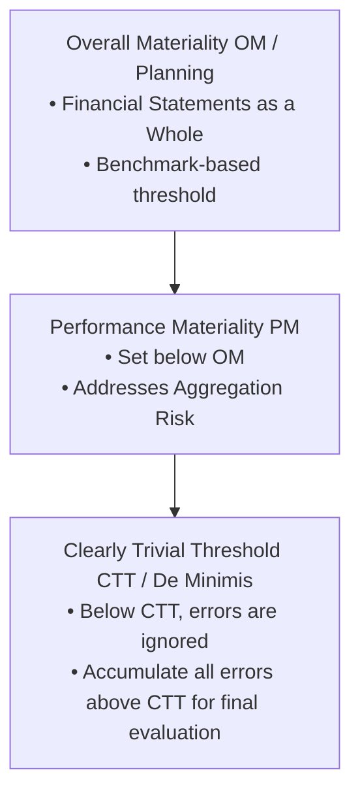
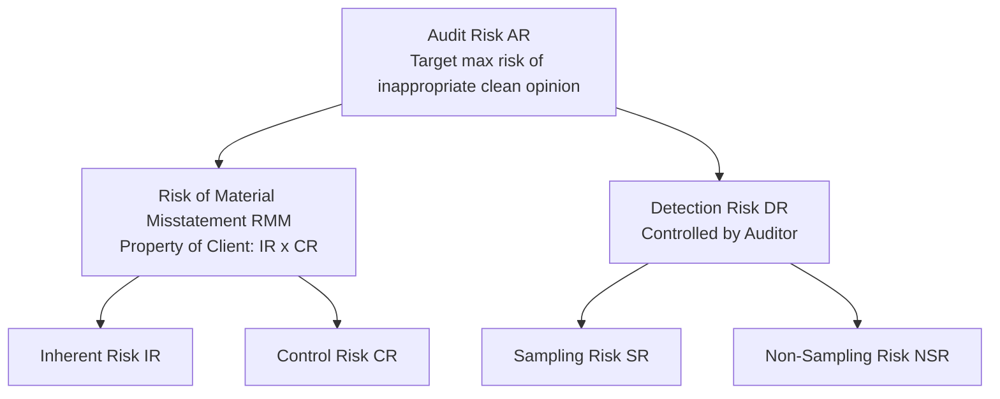
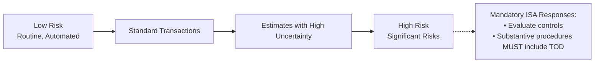
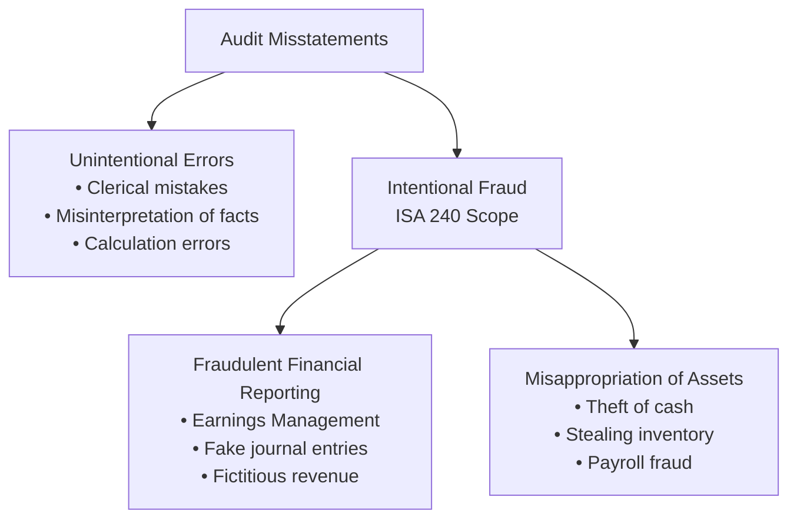
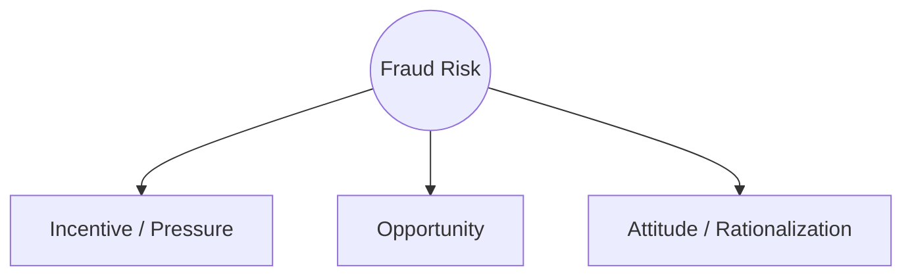

# Core Risk-Based Tools: Materiality & Risk Assessment

> [!abstract] Curriculum & Syllabus Context
>
> - **Course:** ACC 305 Auditing and Assurance
> - **Module:** Module 5: Core Risk-Based Tools: Materiality & Risk Assessment
> - **Target Reading:** ISA 320; ISA 450; ISA 315; ISA 240; Messier (11e) Ch. 3 & 4; ICAB Certificate Ch. 3; ICAB Professional Ch. 9
> - **Syllabus Focus:** Concepts of materiality; overall materiality (OM) benchmark selection; performance materiality (PM) and aggregation risk; clearly trivial threshold (CTT); qualitative materiality triggers; revising materiality during the audit; mathematical formulation of the Audit Risk Model (AR = IR x CR x DR); inverse relationship between RMM and DR; spectrum of inherent risk and mandatory responses to significant risks; fraud vs. error; the fraud triangle (incentive, opportunity, rationalization); presumed fraud risks in revenue and management override; and mandatory journal entry and estimate testing under ISA 240.

---

### Section 1: Concept & Framework of Materiality (ISA 320)
Materiality is a foundational concept in financial statement auditing. Financial statements are not expected to be 100% free from minor, inconsequential errors; rather, the auditor provides reasonable assurance that the financial statements as a whole are free from **material misstatements**.

#### 1. Definitions & Conceptual Foundations
1. > [!info] Key Definition
   > **Materiality (Overall / Planning Materiality - OM)**: Under IASB / ISA 320, information is material if its omission, misstatement, or obscuring could reasonably be expected to influence the economic decisions that primary users make on the basis of the financial statements. From an auditor's perspective, it is the maximum aggregate amount of misstatement that can exist without causing the statements to be materially misleading.
2. > [!info] Key Definition
   > **Performance Materiality (PM / Tolerable Misstatement)**: Defined in ISA 320.9 as the amount or amounts set by the auditor at less than materiality for the financial statements as a whole to reduce to an appropriately low level the probability that the aggregate of uncorrected and undetected misstatements exceeds overall materiality.
   - **Tolerable Misstatement**: In terminology, tolerable misstatement is the application of performance materiality to a specific account balance, class of transactions, or disclosure.
   - **Aggregation Risk**: The risk that multiple individually immaterial misstatements across various accounts may accumulate to exceed overall financial statement materiality.
3. > [!info] Key Definition
   > **Clearly Trivial Threshold (CTT / De Minimis)**: Defined in ISA 450.A2 as misstatements that are of a wholly different (smaller) order of magnitude than materiality, and that are clearly inconsequential, whether taken individually or in the aggregate. Misstatements below CTT do not need to be accumulated.

---
#### 2. Quantitative Benchmarks & Selection Rules
Determining overall materiality requires the exercise of professional judgment in selecting an appropriate **benchmark** and applying an appropriate **percentage**.

| Financial Statement Benchmark | Common Percentage Range | Primary Applicability & Context |
| :--- | :--- | :--- |
| **Profit Before Tax (PBT)** | $3\% - 10\%$ (Standard: $5\%$) | Commercial, profit-oriented entities with stable earnings. |
| **Total Revenue** | $0.5\% - 2\%$ (Standard: $1\%$) | High-volume, low-margin entities; entities breaking even. |
| **Total Assets** | $0.5\% - 2\%$ (Standard: $1\%$) | Asset-intensive entities (e.g., real estate, holding companies). |
| **Gross Profit** | $1\% - 4\%$ | Entities with volatile net income or fluctuating tax rates. |
| **Net Asset Value (NAV) / Equity** | $1\% - 5\%$ | Asset management funds, investment trusts, non-profit entities. |

##### Factors Influencing Benchmark Selection:
1. **Elements of the Financial Statements**: Assets, liabilities, equity, revenue, expenses.
2. **User Focus**: Areas where primary users (shareholders, lenders, regulators) concentrate attention (e.g., pre-tax profit for listed equities; total assets or debt covenants for debt-financed entities).
3. **Entity Life Cycle & Environment**: Emerging start-ups (revenue base) vs. mature industrial firms (PBT base).
4. **Volatility**: If pre-tax income is highly volatile year-over-year, the auditor may use a **normalized benchmark** (e.g., a 3-year or 5-year average pre-tax income) or switch to total revenue/assets.

---
#### 3. Qualitative Aspects of Materiality
Quantitative size alone does not determine materiality. A quantitatively small misstatement may be **material by nature or circumstance**:
1. **Impact on Trends & Benchmarks**:
   - Turns a net loss into a net profit, or vice versa.
   - Enables the entity to meet or exceed market analysts' consensus earnings forecasts.
2. **Contractual & Regulatory Compliance**:
   - Causes a breach of debt covenants (e.g., current ratio or interest coverage ratio limits).
   - Triggers regulatory intervention or loss of operating license.
3. **Management Compensation & Fraud**:
   - Increases management bonuses or executive incentive payouts.
   - Involves intentional misstatements, illegal acts, or fraud by senior management.
4. **Statutory & Related Party Disclosures**:
   - Related party transactions and directors' remuneration are considered material by nature regardless of dollar magnitude under local laws (e.g., Companies Act 1994).

---
#### 4. Revising Materiality During the Audit
> [!warning] Exam Pitfall / Exception
>
> Materiality is not a static figure set strictly at planning. Under **ISA 320.12**, the auditor **must revise overall materiality and performance materiality** if:
> - Draft financial statements are revised during fieldwork (e.g., significant audit adjustments or client changes to year-end trial balances).
> - Unexpected changes occur in the entity's business environment or operations (e.g., major divestiture or loss of a principal customer).
> - If revised materiality is **lower** than initially set, the auditor must re-evaluate performance materiality and determine whether the nature, timing, and extent of planned further audit procedures remain appropriate.

---
### Section 2: The Audit Risk Model & Risk Assessment Framework (ISA 200, ISA 315)
The **Audit Risk Model (ARM)** provides the conceptual and mathematical framework for risk-based auditing, directing audit resources toward areas with the highest susceptibility to material misstatement.

---
#### 1. Mathematical Formulation of the Audit Risk Model
Audit Risk ($AR$) is defined as the risk that the auditor expresses an inappropriate audit opinion when the financial statements are materially misstated.

> [!quote] Formula & Derivation
>
> $$\text{Audit Risk } (AR) = \text{Risk of Material Misstatement } (RMM) \times \text{Detection Risk } (DR)$$

Since Risk of Material Misstatement ($RMM$) consists of **Inherent Risk ($IR$)** and **Control Risk ($CR$)**:

> [!quote] Formula & Derivation
>
> $$AR = IR \times CR \times DR$$

##### Component Definitions:
1. > [!info] Key Definition
   > **Inherent Risk (IR)**: The susceptibility of an assertion about a class of transaction, account balance, or disclosure to a misstatement that could be material, individually or when aggregated, before consideration of any related controls.
2. > [!info] Key Definition
   > **Control Risk (CR)**: The risk that a misstatement that could occur in an assertion will not be prevented, or detected and corrected, on a timely basis by the entity's system of internal control.
3. > [!info] Key Definition
   > **Detection Risk (DR)**: The risk that the procedures performed by the auditor to reduce audit risk to an acceptably low level will not detect a misstatement that exists and that could be material.
   > - **Sampling Risk ($SR$)**: Risk that the auditor's conclusion based on a sample differs from the conclusion if the entire population were tested.
   > - **Non-Sampling Risk ($NSR$)**: Risk of auditor error (e.g., selecting inappropriate audit procedures, misinterpreting evidence, failing to recognize misstatements).

---
#### 2. Solving for Detection Risk & Interrelationships
The auditor determines acceptable $AR$ (typically set at $5\%$ for reasonable assurance) and assesses $IR$ and $CR$ based on risk assessment procedures. The auditor then solves for the required **Detection Risk ($DR$)**:

> [!quote] Formula & Derivation
>
> $$DR = \frac{AR}{RMM} = \frac{AR}{IR \times CR}$$

##### Relationship Principles:
- **Inverse Relationship**: As $RMM$ ($IR \times CR$) **increases**, the acceptable level of $DR$ **decreases**.
- **Impact on Audit Procedures**: A lower acceptable $DR$ requires the auditor to obtain more persuasive audit evidence by:
  1. Expanding the **extent** of testing (larger sample sizes).
  2. Adjusting the **timing** (performing procedures at or near year-end rather than interim).
  3. Modifying the **nature** of procedures (using direct external confirmations or tests of details rather than analytical procedures).

| Assessed Inherent Risk (IR) | Assessed Control Risk (CR) | Combined RMM | Acceptable Detection Risk (DR) | Substantive Audit Effort Required |
| :--- | :--- | :--- | :--- | :--- |
| **High** | **High** | **High** | **Low** | High / Extensive (Tests of Details) |
| **High** | **Low** | **Medium** | **Medium** | Moderate (Mix of TOC and Substantive) |
| **Low** | **High** | **Medium** | **Medium** | Moderate Substantive Testing |
| **Low** | **Low** | **Low** | **High** | Lower / Limited Substantive Testing |

---
#### 3. Spectrum of Inherent Risk & Significant Risks (ISA 315 Revised 2020)
ISA 315 (Revised 2020) establishes that inherent risk lies on a **Spectrum of Inherent Risk**, driven by the combination of **likelihood** and **magnitude** of potential misstatements.
##### Inherent Risk Factors:
1. **Complexity**: Complex mathematical models, intricate revenue recognition structures (IFRS 15), complex derivatives.
2. **Subjectivity**: Significant accounting estimates involving management bias or unobservable inputs (e.g., fair value level 3 measurements under IFRS 13).
3. **Change**: Economic volatility, industry restructurings, regulatory shifts, technological obsolescence.
4. **Uncertainty**: Future cash flow forecasting uncertainties affecting impairment tests or going concern.
5. **Susceptibility to Management Bias / Fraud**: Bonus targets, debt covenant pressure, related party structures.
##### Significant Risks:
> [!info] Key Definition
>
> A **Significant Risk** is an identified risk of material misstatement for which the assessment of inherent risk is close to the **upper end of the spectrum of inherent risk**.

> [!warning] Exam Pitfall / Exception
>
> **Mandatory Responses to Significant Risks (ISA 315 & ISA 330)**:
> - The auditor **must evaluate the design and implementation (D&I)** of the entity's internal controls relevant to the significant risk.
> - If responding with substantive procedures alone, those procedures **must include Tests of Details (TOD)**; reliance solely on substantive analytical procedures is prohibited.

---
#### 4. Theoretical & Practical Limitations of the Audit Risk Model
While the Audit Risk Model is mathematically precise in theory, it has inherent practical limitations:
1. **Subjectivity of Inputs**: Assessing $IR$ and $CR$ in exact percentages is difficult; auditors often use qualitative categories (High, Medium, Low) rather than precise probabilities.
2. **Interdependence of $IR$ and $CR$**: In practice, inherent risk and control risk are not completely independent. Strong controls are built specifically to counter high inherent risks.
3. **Model Assumption Limitations**: ARM assumes $DR$ can be driven down indefinitely by increasing sample sizes, ignoring systemic non-sampling errors or pervasive management fraud.

---
### Section 3: Fraud Risk Assessment & Auditor Responsibilities (ISA 240)
Fraud is a primary source of material misstatement that requires specialized risk assessment procedures under **ISA 240** (*The Auditor's Responsibilities Relating to Fraud in an Audit of Financial Statements*).

---
#### 1. Fraud vs. Error & Types of Audit Fraud
- **Distinguishing Factor**: The primary distinction between fraud and error is **intent**. An error is an unintentional misstatement; fraud is an intentional act involving deception.

1. **Fraudulent Financial Reporting ("Management Fraud")**:
   - Intentional manipulation, falsification, or alteration of accounting records.
   - Misrepresentation or intentional omission of events, transactions, or disclosures.
   - Intentional misapplication of accounting principles relating to measurement, recognition, or presentation.
2. **Misappropriation of Assets ("Employee Fraud")**:
   - Embezzlement of receipts (stealing cash collections before recording).
   - Stealing physical assets or intellectual property.
   - Causing an entity to pay for goods/services not received (fictitious vendor schemes).

---
#### 2. The Fraud Triangle
ISA 240 structures fraud risk evaluation around three conditions present when fraud occurs:

1. **Incentive / Pressure**:
   - Management under pressure to meet aggressive earnings targets or analyst expectations.
   - Threatened financial stability due to rapid industry changes or declining margins.
   - Personal financial pressure on executives whose compensation is tied to stock price or profit targets.
2. **Opportunity**:
   - Significant related-party transactions outside the normal course of business.
   - Complex or subjective accounting estimates (e.g., revenue cutoff, valuation models).
   - Ineffective governance or weak internal controls (lack of segregation of duties, absence of audit committee oversight).
   - Dominance of management by a single person or small group without compensating controls.
3. **Attitude / Rationalization**:
   - Management's disregard for ethical standards or internal controls.
   - Rationalization that "everyone does it" or that the fraud is "only temporary" until next quarter.
   - Strained relationship between management and current/predecessor auditors.

---
#### 3. Mandatory Audit Procedures for Fraud Risks
ISA 240 mandates specific procedures that the auditor **must** perform on every financial statement audit:
##### A. Engagement Team Brainstorming Session
- **Mandatory Discussion**: The engagement partner and key team members must discuss the susceptibility of the financial statements to material misstatement due to fraud.
- **Key Focus**: Exchange ideas on how and where fraud could be committed, how management could override controls, and reinforce an attitude of **professional skepticism** (setting aside beliefs regarding management's honesty).
##### B. Presumed Fraud Risks
> [!warning] Exam Pitfall / Exception
>
> ISA 240 establishes two explicit presumptions:
> 1. **Presumption of Fraud in Revenue Recognition**: The auditor must presume there are risks of fraud in revenue recognition (e.g., premature revenue recognition, fictitious sales).
>    - *Rebuttal*: Can only be rebutted if revenue transactions are extraordinarily simple (e.g., single-tenant rental property with straightforward cash receipts). The rebuttal rationale must be documented.
> 2. **Risk of Management Override of Controls**: Present in all entities due to management's unique ability to manipulate accounting records.
>    - *Mandatory Audit Procedures for Override*:
>      1. Test the appropriateness of **journal entries** recorded in the general ledger and period-end adjustments.
>      2. Review **accounting estimates** for management bias (including retrospective review of prior year estimates).
>      3. Evaluate the business rationale for **significant unusual transactions**.

##### C. Auditor Communications
- **To Management & Governance**: If fraud or suspected fraud is identified, report on a timely basis to the appropriate level of management and Those Charged With Governance (TCWG / Audit Committee).
- **To Regulatory Authorities**: Evaluate legal and ethical responsibilities regarding external reporting (e.g., reporting money laundering or statutory reporting under FRA 2015).

---
### Section 4: Comprehensive Numerical & Problem Walkthrough

---

> [!example] Numerical Problem & Case Study
>
> #### Scenario Overview
> You are the senior auditor for **Apex Industrial Ltd**, a manufacturer. Draft financial data for the year ended 31 December 2025 reveals:
> - **Revenue**: $\$48,000,000$
> - **Profit Before Tax (PBT)**: $\$3,200,000$
> - **Total Assets**: $\$28,000,000$
> During preliminary planning, the engagement partner set the following parameters:
> - **Overall Materiality (OM)** benchmark: $5\%$ of Profit Before Tax ($PBT$).
> - **Performance Materiality (PM)**: $60\%$ of Overall Materiality ($OM$).
> - **Clearly Trivial Threshold (CTT)**: $4\%$ of Overall Materiality ($OM$).
> - **Target Audit Risk (AR)**: $5\%$ ($0.05$).
> During risk assessment of the **Inventory Valuation** assertion, the audit team assessed:
> - **Inherent Risk (IR)** = $80\%$ ($0.80$) due to complex standard costing and potential product obsolescence.
> - **Control Risk (CR)** = $50\%$ ($0.50$) based on initial evaluation of inventory internal controls.
> During testing, the audit team identified two uncorrected misstatements:
> 1. **Misstatement 1**: Overstatement of trade receivables by $\$110,000$ due to cutoff errors.
> 2. **Misstatement 2**: Understatement of accrued expenses by $\$45,000$.
> ---
> #### Step-by-Step Mathematical Solutions
> ##### Step 1: Compute Quantitative Materiality Thresholds
> 3. **Overall Materiality (OM)**:
>    $$OM = 5\% \times \text{PBT} = 0.05 \times \$3,200,000 = \$160,000$$
> 4. **Performance Materiality (PM)**:
>    $$PM = 60\% \times OM = 0.60 \times \$160,000 = \$96,000$$
> 5. **Clearly Trivial Threshold (CTT)**:
>    $$CTT = 4\% \times OM = 0.04 \times \$160,000 = \$6,400$$
> ---
> ##### Step 2: Apply the Audit Risk Model
> 6. **Calculate Risk of Material Misstatement (RMM)**:
>    $$RMM = IR \times CR = 0.80 \times 0.50 = 0.40 \quad (40\%)$$
> 7. **Solve for Required Detection Risk (DR)**:
>    $$DR = \frac{AR}{RMM} = \frac{0.05}{0.40} = 0.125 \quad (12.5\%)$$
> 8. **Audit Strategy Implication**:
>    - Because $DR = 12.5\%$ is relatively low, the auditor must perform extensive substantive procedures (large sample sizes, year-end physical inventory counts, and detailed testing of cost records) to ensure that the probability of undetected misstatement does not exceed $12.5\%$.
> ---
> ##### Step 3: Evaluate Uncorrected Audit Misstatements
> Evaluate the two uncorrected misstatements against materiality thresholds:
> $$\text{Total Uncorrected Misstatements} = \text{Receivables Overstatement } (\$110,000) + \text{Accrued Expenses Understatement } (\$45,000) = \$155,000$$
> ##### Evaluation & Conclusion:
> 9. **Individual Assessment against PM ($96,000$)**:
>    - Misstatement 1 ($\$110,000$) exceeds Performance Materiality ($PM = \$96,000$). This indicates an unacceptably high risk that it could individually distort the accounts or contribute to an overall material misstatement.
> 10. **Aggregate Assessment against OM ($160,000$)**:
>    - Aggregate uncorrected misstatement = $\$155,000$. While quantitatively just below Overall Materiality ($OM = \$160,000$), it consumes $96.875\%$ of $OM$.
>    - Adding an allowance for undetected errors ($OM - \text{Known Errors} = \$160,000 - \$155,000 = \$5,000$), the margin for undetected misstatement is far too small.
> 11. **Auditor's Action**:
>    - The auditor must request management to adjust Misstatement 1 ($\$110,000$).
>    - If management refuses to correct Misstatement 1, the auditor must issue a **Qualified Audit Opinion** under **ISA 705 (Revised)** due to a material departure from the financial reporting framework.