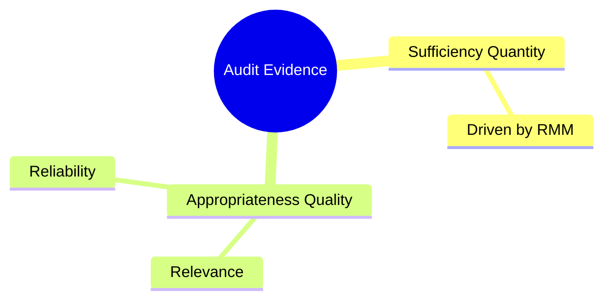
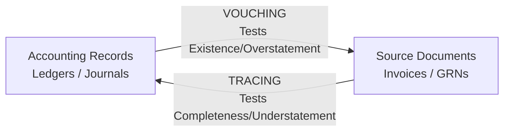
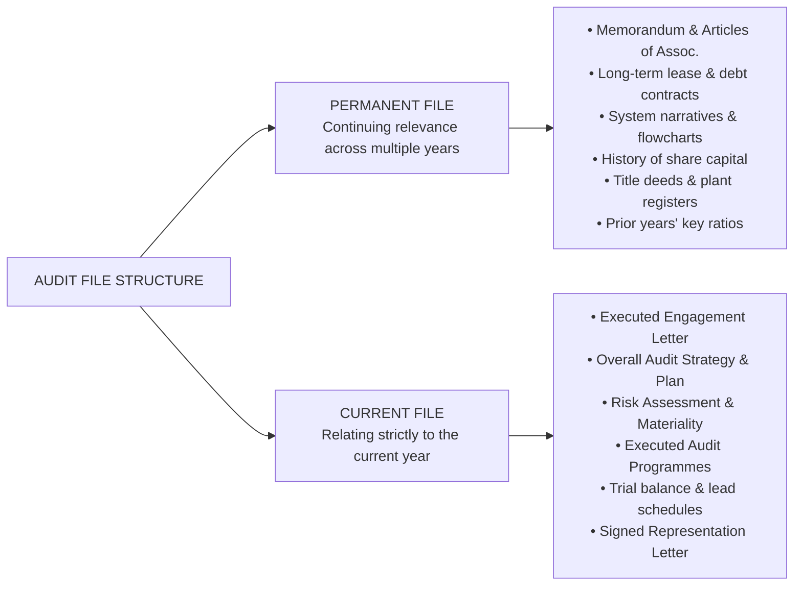
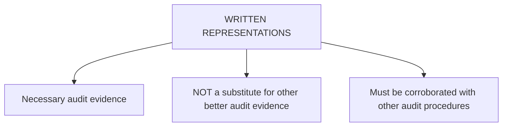
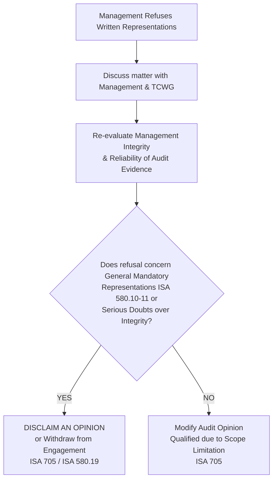

# Audit Evidence, Assertions, & Documentation Foundations

> [!abstract] Curriculum & Syllabus Context
>
> - **Course:** ACC 305 Auditing and Assurance
> - **Module:** Module 6: Audit Evidence, Assertions, & Documentation Foundations
> - **Target Reading:** ISA 500; ISA 230; ISA 580; Messier (11e) Ch. 5; ICAB Certificate Ch. 4, 10–12
> - **Syllabus Focus:** Nature, sufficiency, and appropriateness of audit evidence; relevance vs. reliability; hierarchy of evidence reliability; nine primary audit procedures; directional testing (vouching for existence/overstatement vs. tracing for completeness/understatement); management assertions framework for classes of transactions and account balances; audit documentation functions under ISA 230; the experienced auditor test; permanent file vs. current file; working paper standardized elements; working paper ownership, 60-day assembly, and 5-7 year retention; written representations under ISA 580 (mandatory general and specific representations, evidential limitations, dating, and refusal consequences).

---

### Section 1: Nature, Sufficiency, & Reliability of Audit Evidence (ISA 500)
Audit evidence comprises all information used by the independent auditor in arriving at the conclusions on which the audit opinion is based. Audit evidence is cumulative in nature and is primarily obtained from audit procedures performed during the course of the audit. It includes both the information contained within the underlying accounting records and corroborating information gathered from external and internal sources.
#### 1. Core Dimensions of Evidence: Sufficiency and Appropriateness
Under **ISA 500 (*Audit Evidence*)**, the auditor is required to design and perform audit procedures to obtain **sufficient appropriate audit evidence** to be able to draw reasonable conclusions on which to base the auditor's opinion.

1. **Sufficiency (Quantity)**:
   - Sufficiency is the quantitative measure of audit evidence.
   - The quantity of evidence required is directly affected by the auditor's assessment of the **Risk of Material Misstatement ($RMM$)**: as assessed risk increases, the required quantity of evidence increases ($RMM \uparrow \implies \text{Evidence Quantity} \uparrow$).
   - The quantity required is inversely affected by the quality/appropriateness of the evidence: higher quality evidence reduces the quantity required ($\text{Quality} \uparrow \implies \text{Evidence Quantity} \downarrow$). However, obtaining a large volume of low-quality evidence cannot compensate for its lack of appropriateness.
2. **Appropriateness (Quality)**:
   - Appropriateness is the qualitative measure of audit evidence, encompassing both **Relevance** and **Reliability**.
   - **Relevance**: Refers to the logical connection between the audit procedure performed and the specific management assertion being tested. For instance:
     - Testing recorded accounts receivable by confirming balances with debtors is relevant to the **Existence** assertion, but irrelevant to the **Valuation** assertion (since an existing debtor may still default).
     - Inspecting physical inventory counts provides relevant evidence regarding **Existence**, but does not prove **Rights and Obligations** (inventory could be held on consignment).
   - **Reliability**: Refers to the trust, authenticity, and diagnostic accuracy of the evidence. Reliability is heavily influenced by the source, nature, and individual circumstances under which evidence is obtained.

---
#### 2. General Principles / Hierarchy of Evidence Reliability
Audit standards establish a hierarchy governing the relative reliability of audit evidence:

| Principle / Rule | Rule Explanation & Operational Context | Practical Audit Example |
| :--- | :--- | :--- |
| **1. Independent External Source** | Evidence obtained from independent sources outside the client entity is more reliable than evidence generated internally. | Direct bank confirmations or supplier statements are far more reliable than internal sales orders or client-prepared schedules. |
| **2. Effective Internal Control** | Internal evidence is more reliable when the entity's related internal controls (IT and manual) operate effectively. | Internal inventory dispatch notes generated by an automated warehouse system with strong access controls are more reliable than manual notes from an uncontrolled store. |
| **3. Direct Auditor Knowledge** | Evidence obtained directly by the auditor (through direct observation, physical inspection, or recalculation) is more reliable than evidence obtained indirectly or by inference. | Physical observation of equipment by the auditor provides stronger existence evidence than reading management's fixed asset register. |
| **4. Documentary Form** | Evidence in documentary form (paper, electronic, or other media) is more reliable than oral representations. | A written, executed commercial contract is superior to management's verbal explanation of contract terms. |
| **5. Original Documents** | Original documents provide greater reliability than photocopies, facsimiles, or digitized scans (which are susceptible to alteration or forgery). | Inspecting the original title deed of property vs. inspecting a photocopied excerpt. |

---
#### 3. Audit Procedures for Obtaining Audit Evidence
Auditors execute nine primary types of audit procedures (individually or in combination) as Risk Assessment Procedures, Tests of Controls (TOC), or Substantive Procedures (Substantive Tests of Details and Substantive Analytical Procedures):
1. **Inspection of Records or Documents**:
   - Examining internal or external records in paper or electronic form.
   - Offers varying reliability depending on document origin and internal controls.
2. **Inspection of Tangible Assets**:
   - Physical examination of assets (e.g., cash count, inventory count, fixed asset verification).
   - Provides highly reliable evidence regarding **Existence**, but limited evidence regarding **Rights and Obligations** or **Valuation**.
3. **Observation**:
   - Looking at a process or procedure being performed by client personnel (e.g., observing inventory counting or post-opening procedures).
   - *Limitation*: Limited to the precise point in time at which observation occurs, and client staff may alter behavior while being observed ("Hawthorne effect").
4. **Inquiry**:
   - Seeking financial or non-financial information from knowledgeable persons inside or outside the entity.
   - Used extensively, but inquiry alone is **insufficient** to support a conclusion at the assertion level; it must be corroborated with other audit procedures.
5. **External Confirmation**:
   - A direct written response obtained by the auditor from a third party (confirming party) in paper or electronic form (e.g., ISA 505 bank confirmations, receivables confirmations, legal confirmations).
6. **Recalculation**:
   - Checking the mathematical accuracy of documents or records (e.g., footing sales journals, recalculating depreciation schedules or interest accruals).
7. **Reperformance**:
   - Independent execution by the auditor of procedures or controls originally performed as part of the entity's internal control (e.g., reperforming the aging of accounts receivable).
8. **Analytical Procedures**:
   - Evaluations of financial information made through analysis of plausible relationships among financial and non-financial data (e.g., gross margin comparisons, regression models, ratio trends).
9. **Scanning**:
   - Reviewing accounting records to identify significant, unusual, or abnormal items (e.g., uncharacteristic manual journal entries at year-end).

---
#### 4. Directional Testing: Vouching vs. Tracing
> [!info] Key Definition
>
> Directional testing is a fundamental audit technique used to target specific directional misstatements: **Overstatement** (Existence/Occurrence) versus **Understatement** (Completeness).

* **Vouching (Testing for Overstatement / Existence / Occurrence)**:
  - **Procedure**: Selecting an entry from the accounting journals/ledgers and moving **backward** to inspect the underlying source documents (e.g., selecting a sales entry in the general ledger and inspecting the shipping document and customer order).
  - **Objective**: Ensures that recorded transactions actually occurred and pertain to the entity, verifying there are no fictitious entries or inflated balances.
* **Tracing (Testing for Understatement / Completeness)**:
  - **Procedure**: Selecting a primary source document and moving **forward** to verify its proper inclusion in the accounting journals/ledgers (e.g., selecting a goods received note [GRN] and tracing it forward into the purchase journal and accounts payable ledger).
  - **Objective**: Ensures that all transactions that occurred have been fully recorded, verifying there are no omitted or concealed entries.

---
### Section 2: Management Assertions Framework
Financial statement assertions are representations by management, explicit or otherwise, embodied in the financial statements, used by the auditor to consider the different types of potential misstatements that may occur.

Auditors organize assertions into two main operational categories:
1. **Assertions about Classes of Transactions and Events (and related disclosures) for the period under audit**.
2. **Assertions about Account Balances (and related disclosures) at the period end**.

---
#### 1. Assertions About Classes of Transactions and Events (Period Under Audit)

| Assertion | Precise Standard Definition | Common Risk / Misstatement Type | Illustrative Audit Procedure |
| :--- | :--- | :--- | :--- |
| **Occurrence** | Transactions and events that have been recorded or disclosed have occurred and pertain to the entity. | Recording fictitious sales or revenue before goods are shipped. | Vouch recorded sales entries in the sales journal to shipping documents and customer purchase orders. |
| **Completeness** | All transactions and events that should have been recorded have been recorded, and all related disclosures have been included. | Omitting purchase invoices or utility expenses incurred near year-end. | Trace a sample of dispatch notes or goods received notes (GRNs) to the sales or purchase journals. |
| **Accuracy** | Amounts and other data relating to recorded transactions have been recorded appropriately. | Applying incorrect unit prices, wrong discount rates, or mathematical extension errors. | Recompute invoice extensions ($Q \times P$) and agree prices to authorized price lists. |
| **Cut-off** | Transactions and events have been recorded in the correct accounting period. | Recording January sales in December (early recognition) or delaying expense entries. | Compare dates on shipping documents/GRNs immediately before and after year-end with sales/purchase ledger dates. |
| **Classification** | Transactions and events have been recorded in the proper accounts. | Capitalizing routine repair expenses as fixed assets or misclassifying administrative costs. | Inspect purchase invoices for proper general ledger account code allocation. |
| **Presentation** | Transactions are appropriately aggregated or disaggregated and clearly described, and related disclosures are understandable. | Obscuring extraordinary or non-recurring revenue within normal operating revenue. | Review draft financial statements against applicable financial reporting framework (IFRS/IAS) checklists. |

---
#### 2. Assertions About Account Balances at Period End

| Assertion | Precise Standard Definition | Common Risk / Misstatement Type | Illustrative Audit Procedure |
| :--- | :--- | :--- | :--- |
| **Existence** | Assets, liabilities, and equity interests exist at the reporting date. | Recording non-existent inventory, phantom receivables, or fictitious bank balances. | Obtain direct external bank confirmations; observe physical inventory counting. |
| **Rights & Obligations** | The entity holds or controls the rights to assets, and liabilities are the obligations of the entity. | Including inventory held on consignment or pledged assets without proper disclosure. | Inspect property title deeds, vehicle registration documents, and loan agreement covenants. |
| **Completeness** | All assets, liabilities, and equity interests that should have been recorded have been recorded. | Understating accounts payable, unrecorded lease obligations, or omitted provisions. | Perform a search for unrecorded liabilities by inspecting post-year-end cash disbursements and invoices. |
| **Accuracy, Valuation, & Allocation** | Assets, liabilities, and equity interests are included at appropriate amounts, and valuation/allocation adjustments are appropriately recorded. | Overvaluing obsolete inventory above Net Realizable Value ($\text{NRV}$) or failing to record allowance for expected credit losses. | Test inventory lower-of-cost-and-NRV rules; evaluate receivables aging and historical loss rates. |
| **Classification** | Assets, liabilities, and equity interests have been recorded in the proper accounts. | Misclassifying long-term debt as a current liability or vice versa. | Review debt maturity schedules to verify proper split between current and non-current liabilities. |
| **Presentation** | Assets, liabilities, and equity interests are appropriately aggregated/disaggregated and clearly described with understandable disclosures. | Inadequate footnote disclosure of pledged collateral, debt covenants, or contingent liabilities. | Evaluate financial statement disclosures against IFRS/IAS disclosure standards. |

---
### Section 3: Audit Documentation & Working Papers (ISA 230)
Under **ISA 230 (*Audit Documentation*)**, audit documentation (frequently termed *working papers* or the *audit file*) represents the written record of audit procedures performed, relevant audit evidence obtained, and conclusions reached by the auditor.
#### 1. Functions and Objectives of Audit Documentation
Audit documentation serves two primary objectives and several secondary functions:
1. **Primary Objectives**:
   - Provides evidence of the auditor's basis for a conclusion about the achievement of the overall objectives of the auditor.
   - Provides evidence that the audit was planned and performed in accordance with International Standards on Auditing (ISAs) and applicable legal and regulatory requirements.
2. **Secondary Functions**:
   - Assists the engagement team to plan and perform the audit.
   - Assists members of the engagement team responsible for supervision to direct, supervise, and review audit work (**ISA 220 / ISQM 1**).
   - Enables the engagement team to be accountable for its work.
   - Retains a record of matters of continuing significance to future audits.
   - Enables the conduct of firm quality management reviews and external inspections (e.g., FRC or regulator inspections).
   - Serves as crucial documentary defense evidence in the event of third-party litigation or legal negligence claims.

---
#### 2. The "Experienced Auditor" Test (ISA 230.8)
> [!info] Key Definition
>
> ISA 230 establishes a strict benchmark for the sufficiency of audit documentation:
> *"The auditor shall prepare audit documentation that is sufficient to enable an **experienced auditor**, having no previous connection with the audit, to understand:*
> 1. *The nature, timing, and extent of the audit procedures performed to comply with the ISAs and applicable legal and regulatory requirements;*
> 2. *The results of the audit procedures performed, and the audit evidence obtained; and*
> 3. *Significant matters arising during the audit, the conclusions reached thereon, and significant professional judgments made in reaching those conclusions."*

An "experienced auditor" refers to an individual (internal or external) who has practical audit experience and a reasonable understanding of audit processes, ISAs, legal requirements, and the business environment in which the entity operates.

---
#### 3. Working Paper File Structure: Permanent File vs. Current File
Auditors organize working papers into two distinct logical files:

---
#### 4. Mandatory Elements of Standardized Working Papers
Every individual working paper must contain specific standardized formatting elements to ensure audit trail clarity and accountability:
1. **Header Block**: Client name, Financial year-end date, Subject/title of the working paper (e.g., "Bank Reconciliation Substantive Test").
2. **Reference / Index Code**: Unique alphanumeric index (e.g., `A-1`, `C-3`, `E.2.1`) for cross-referencing.
3. **Sign-Off & Dates**:
   - **Preparer**: Name/initials of the staff member who performed the work and the completion date.
   - **Reviewer**: Name/initials of the supervisor/partner who reviewed the work and the review date (**ISA 230.9**).
4. **Objective of the Work**: Clear statement of the specific assertion or audit risk being tested.
5. **Source of Information**: Identification of source records (e.g., "Extracted from General Ledger Account 4001 as at 31 Dec 2025").
6. **Sample Selection & Characteristics**: Description of sample size, sampling method, and unique identifying characteristics of items tested (e.g., check numbers, invoice numbers).
7. **Audit Procedures & Work Done**: Narrative of exact testing steps executed.
8. **Tick Marks & Legend**: Standardized symbols indicating performed verification steps (e.g., $\checkmark$ = Footed/Calculated; $\text{V}$ = Vouched to invoice; $\text{C}$ = Confirmed with third party).
9. **Analysis of Exceptions / Misstatements**: Detailed evaluation of any identified errors or deviations.
10. **Audit Conclusion**: Explicit statement regarding whether the tested account or assertion is fairly stated or requires adjustment.

---
#### 5. Custody, Ownership, Assembly, and Retention Mandates
> [!warning] Exam Pitfall / Exception
>
> * **Ownership**: Audit working papers are the exclusive property of the independent audit firm, not the client.
> * **Confidentiality**: The auditor must maintain strict confidentiality regarding working paper contents, disclosing them to third parties only with explicit client permission or under statutory/legal compulsion.
> * **Assembly Period**:
>   - The auditor must assemble the final audit file on a timely basis after the audit report date.
>   - Under **ISQM 1** and **ISA 230**, the assembly period ordinarily is **no longer than 60 days** after the date of the auditor's report.
>   - After assembly, the auditor must not delete or discard any audit documentation before the end of its retention period.
> * **Retention Period**:
>   - The retention period for audit documentation is typically **no shorter than 5 to 7 years** from the date of the auditor's report (or group auditor's report), depending on national professional or legal requirements.

---
### Section 4: Written Representations (ISA 580)
Under **ISA 580 (*Written Representations*)**, a written representation is a written statement by management provided to the auditor to confirm certain matters or to support other audit evidence.

#### 1. Nature & Evidential Limits of Written Representations
- Written representations are necessary audit evidence. However, they **do not provide sufficient appropriate audit evidence on their own** regarding any of the matters with which they deal.
- They cannot be used as a substitute for other audit evidence that the auditor reasonably expects to be available.
- If management representations are contradicted by other audit evidence, the auditor must perform additional procedures to resolve the inconsistency and re-evaluate the reliability of management representations generally.

---
#### 2. Mandatory General Representations (ISA 580.10–11)
The auditor **must request** management (and, where appropriate, those charged with governance) to provide written representations confirming that:
1. **Financial Statement Preparation**: Management has fulfilled its responsibility for the preparation of the financial statements in accordance with the applicable financial reporting framework (IFRS/IAS), as set out in the terms of the audit engagement letter.
2. **Information and Access Provided**: Management has provided the auditor with all relevant information and unrestricted access as agreed in the audit engagement terms.
3. **Completeness of Transactions**: All transactions have been recorded and are reflected in the financial statements.

---
#### 3. Specific Written Representations Required by Other ISAs
In addition to general representations, specific ISAs require mandatory written representations on targeted areas:

| ISA Standard | Required Specific Written Representation |
| :--- | :--- |
| **ISA 240 (Fraud)** | Management acknowledges its responsibility for internal controls to prevent/detect fraud; has disclosed its risk assessment of fraud; and has disclosed all known or suspected fraud involving management or key employees. |
| **ISA 250 (Laws & Regs)** | Management has disclosed all known or suspected instances of non-compliance with laws and regulations whose effects should be considered when preparing financial statements. |
| **ISA 450 (Misstatements)** | Management states whether it believes the effects of uncorrected audit misstatements are immaterial, individually and in aggregate, to the financial statements as a whole (a summary of uncorrected misstatements is attached to the letter). |
| **ISA 501 (Litigation & Claims)**| Management states that all known actual or possible litigation and claims have been disclosed to the auditor and properly accounted for/disclosed. |
| **ISA 540 (Estimates)** | Management confirms that the methods, significant assumptions, and data used in making accounting estimates (including fair value estimates) are appropriate. |
| **ISA 550 (Related Parties)** | Management has disclosed the identity of all related parties and related party relationships/transactions of which it is aware, and properly accounted for/disclosed them. |
| **ISA 560 (Subsequent Events)** | Management confirms that all events occurring subsequent to the date of the financial statements requiring adjustment or disclosure have been adjusted or disclosed. |
| **ISA 570 (Going Concern)** | Management confirms the feasibility of its plans for future action and that all relevant going concern uncertainties have been disclosed. |

---
#### 4. Operational Requirements: Addressee, Signing, & Dating
- **Addressee**: The written representation letter is addressed specifically to the **external auditor**.
- **Signatories**: Signed by management personnel with appropriate responsibility for the financial statements and knowledge of the matters concerned—typically the **Chief Executive Officer (CEO)** and **Chief Financial Officer (CFO)**.
- **Date**: The representation letter must be dated **as near as practicable to, but not after, the date of the auditor's report** on the financial statements. This ensures the representations cover all events up to the audit report date (including subsequent events).

---
#### 5. Management Refusal to Provide Written Representations
If management refuses to provide one or more requested written representations:

1. The auditor shall discuss the matter with management and Those Charged With Governance (TCWG).
2. The auditor shall re-evaluate the integrity of management and evaluate the effect this may have on the reliability of representations (oral or written) and audit evidence in general.
3. > [!warning] Exam Pitfall / Exception
   > **Mandatory Disclaimer / Scope Limitation**:
   > - If management refuses to provide the general mandatory written representations regarding its responsibility for preparing financial statements and providing access/information (**ISA 580.10–11**), or if the auditor concludes that there is sufficient doubt about management integrity, the auditor **shall disclaim an opinion** on the financial statements or withdraw from the engagement where permitted by law (**ISA 580.19 / ISA 705**).

---
### Section 5: Step-by-Step Scenario Walkthrough & Applied Practice
> [!example] Numerical Problem & Case Study
>
> #### Practical Scenario
> You are the audit senior on the audit of **Apex Manufacturing Ltd** for the year ended 31 December 2025. During fieldwork, you perform tests on the following three operational areas:
> 1. **Area A: Inventory Cut-Off & Completeness**
>    - The client's inventory listing includes $\$450,000$ of raw materials received on 30 December 2025. The corresponding purchase invoice was received on 4 January 2026 and was recorded in the purchases journal on 5 January 2026 as a 2026 expense. No accrual was recorded at 31 December 2025.
> 2. **Area B: Machinery Valuation & Directional Testing**
>    - Management purchased specialized equipment costing $\$200,000$ on 15 June 2025. To test this, you sampled the physical machinery on the factory floor and traced serial numbers back to the fixed asset register. You also vouched entries from the fixed asset register back to purchase invoices.
> 3. **Area C: Management Representation Letter**
>    - Management provided an oral representation that an ongoing patent infringement lawsuit filed by a competitor ($\$1,000,000$ claim) is without merit. Management refused to include this claim in the written representation letter or allow you to send a legal confirmation to the client's external legal counsel, arguing that "written disclosure will damage out-of-court negotiations."
> ---
> #### Step-by-Step Problem Resolution & Analysis
> ##### 1. Resolution of Area A (Cut-Off & Completeness Evaluation)
> * **Assertion Analysis**:
>   - Raw materials received on 30 December 2025 were correctly included in inventory at year-end (**Existence** satisfied).
>   - However, the liability was omitted from 2025 accounts payable and purchase expense was omitted from 2025 (**Completeness** and **Cut-Off** violated).
> * **Accounting & Audit Adjustment**:
>   - The unrecorded liability violates the cut-off assertion for purchases and completeness assertion for accounts payable.
>   - **Proposed Audit Adjustment Entry**:
>     $$\text{Dr. Raw Material Purchases / Accounts Payable Accrual} \quad \$450,000$$
>     $$\text{Cr. Accounts Payable / Unrecorded Liabilities} \qquad \qquad \quad \$450,000$$
> * **Audit Procedure Evaluation**:
>   - To detect this type of cut-off error across the audit, the auditor must perform a **Search for Unrecorded Liabilities** by selecting goods received notes (GRNs) issued immediately before year-end ($26\text{–}31 \text{ Dec 2025}$) and tracing them to accounts payable vouchers and purchase ledgers (**Tracing = Completeness**).
> ---
> ##### 2. Resolution of Area B (Directional Testing & Assertion Mapping)
> * **Procedure 1**: Selecting physical machinery on the factory floor and tracing serial numbers to the fixed asset register.
>   - **Direction**: Physical Asset $\longrightarrow$ Accounting Record.
>   - **Tested Assertion**: **Completeness** (verifies that all physical assets on hand are recorded in the ledger; detects unrecorded assets).
> * **Procedure 2**: Selecting entries from the fixed asset register and vouching them to purchase invoices and title documents.
>   - **Direction**: Accounting Record $\longrightarrow$ Source Document.
>   - **Tested Assertion**: **Occurrence / Existence & Rights and Obligations** (verifies that recorded assets actually exist, were acquired during the period, and belong to Apex Manufacturing Ltd; detects fictitious or improperly capitalized items).
> ---
> ##### 3. Resolution of Area C (Written Representations & Scope Limitation)
> * **Evaluation of Management Refusal**:
>   - Management's oral statement that the $\$1,000,000$ patent lawsuit is "without merit" is **insufficient audit evidence** under **ISA 500** and **ISA 580**.
>   - Management's refusal to permit direct communication with external legal counsel violates **ISA 501 (*Specific Considerations - Litigation and Claims*)**.
>   - Management's refusal to include the litigation in the written representation letter violates **ISA 580** and **ISA 501**.
> * **Impact on Audit Opinion (ISA 705 / ISA 580)**:
>   - This refusal constitutes a severe **management-imposed limitation on the scope of the audit**.
>   - Because a $\$1,000,000$ patent claim is material and potentially pervasive to the financial statements (if an adverse judgment threatens financial viability), the auditor cannot obtain sufficient appropriate audit evidence.
>   - **Action Required**:
>     1. Communicate the matter immediately to Those Charged With Governance (TCWG).
>     2. Inform TCWG that the scope limitation will force the auditor to issue a **Modified Audit Opinion**—specifically a **Qualified Opinion** ("Except for") or a **Disclaimer of Opinion** depending on pervasiveness (**ISA 705**).
>     3. If the auditor suspects pervasive lack of management integrity underlying the refusal, the auditor must **disclaim an opinion** or **withdraw from the engagement**.