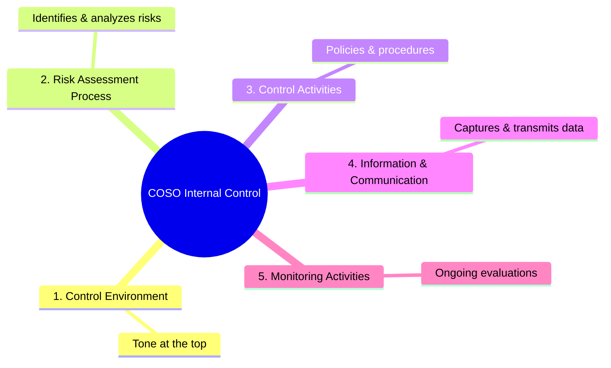
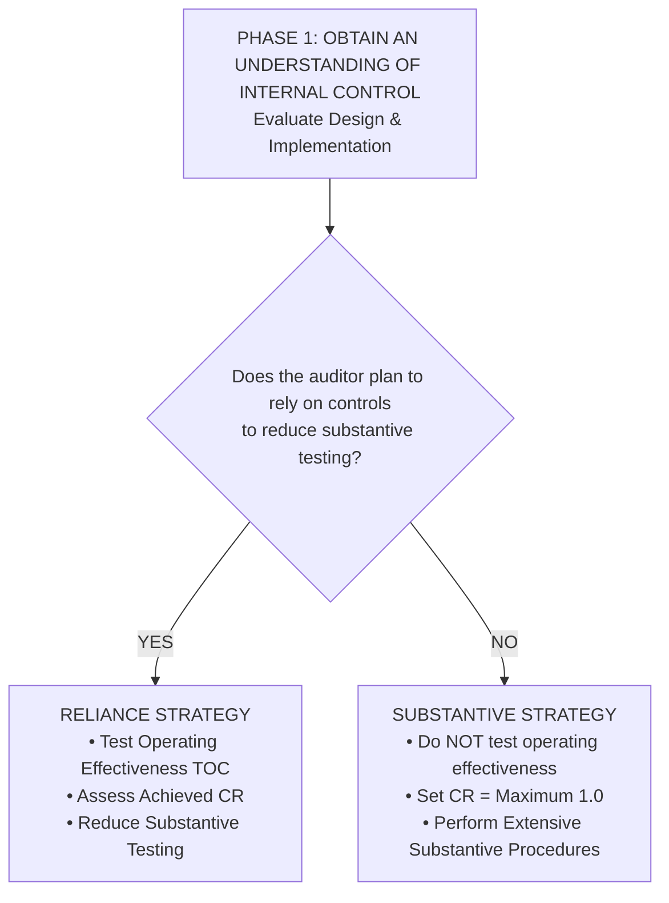
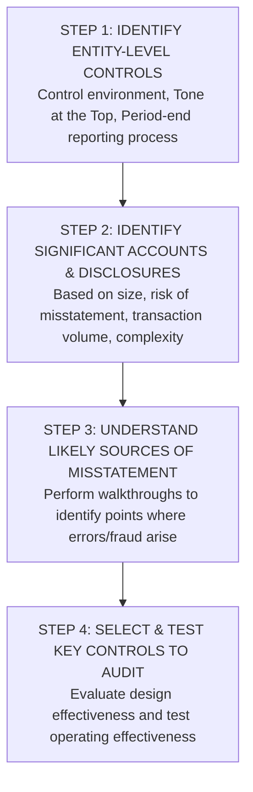
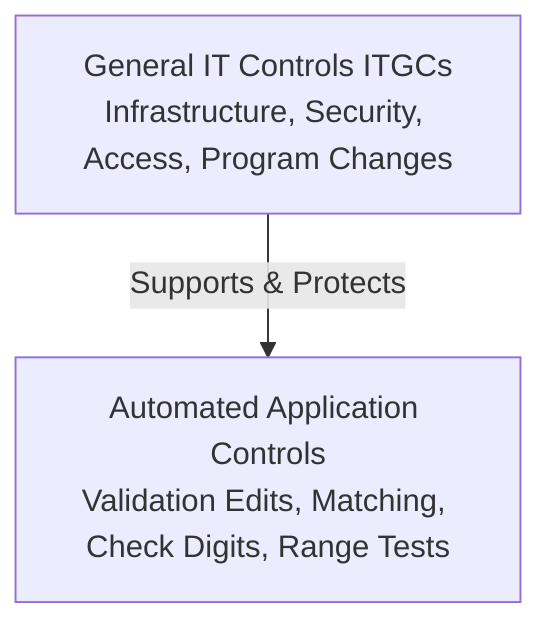
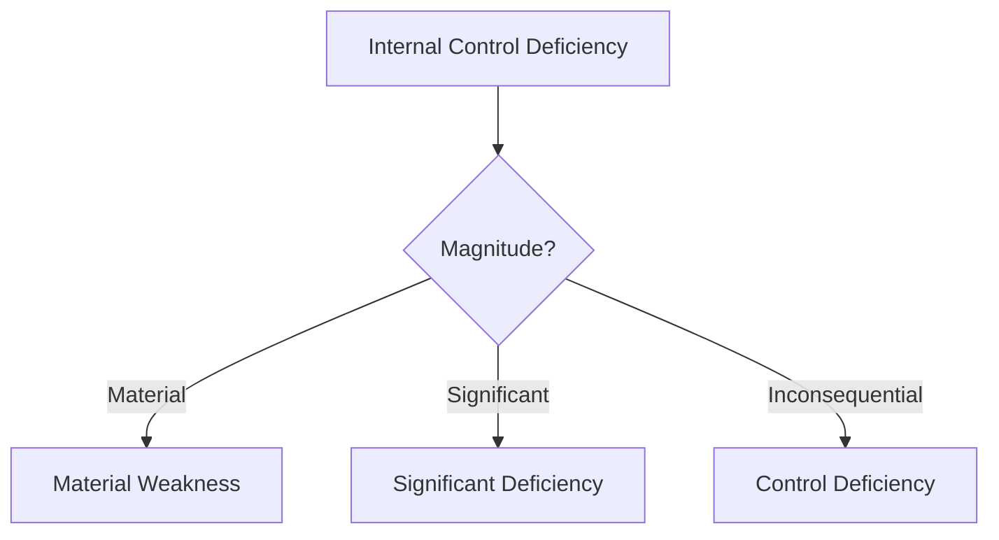
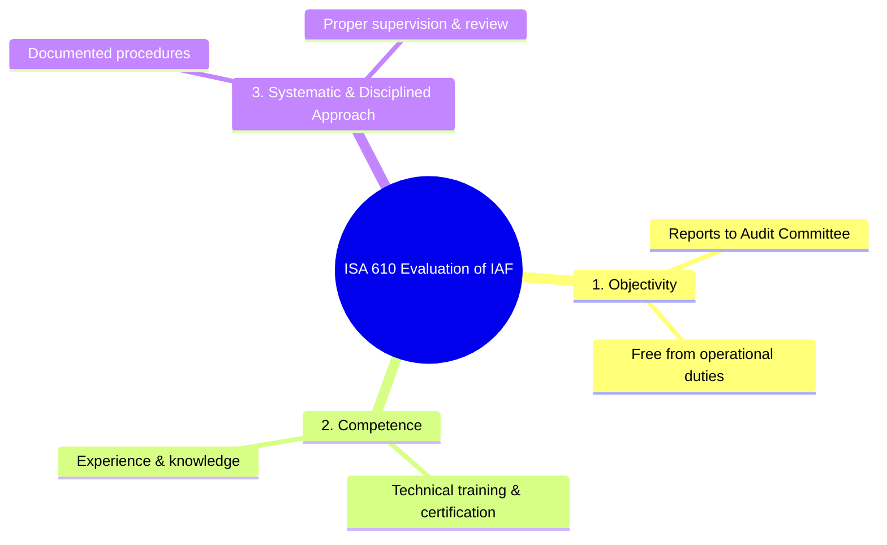

# Understanding & Testing Internal Control

> [!abstract] Curriculum & Syllabus Context
>
> - **Course:** ACC 305 Auditing and Assurance
> - **Module:** Module 7: Understanding & Testing Internal Control
> - **Target Reading:** ISA 315; ISA 330; ISA 265; ISA 610; AS 2201; Messier (11e) Ch. 6 & 7; ICAB Certificate Ch. 5 & 9; ICAB Professional Ch. 3 & 10
> - **Syllabus Focus:** Definition and three core objectives of internal control; COSO framework (5 components and 17 principles); preventative, detective, and corrective controls; segregation of duties (CAR: custody, authorization, recording); inherent limitations of internal control; SME control considerations and compensating controls; substantive strategy (CR=1.0) vs. reliance strategy (CR<1.0); tests of controls (inquiry, observation, inspection, reperformance); walkthrough procedures; auditing ICFR (AS 2201 top-down approach); General IT Controls (ITGCs) vs. Application Controls; automated control benchmarking; internal control deficiency taxonomy (control deficiency, significant deficiency, material weakness); ISA 265 communication protocols; and evaluating the internal audit function under ISA 610.

---

### Section 1: Concept, Framework, and Objectives of Internal Control
#### 1. Definition and Core Objectives of Internal Control
Internal control is a foundational concept in auditing, financial reporting, and corporate governance. Under **ISA 315 (Revised)** and the **COSO Internal Control — Integrated Framework (2013)**, internal control is defined as:

> [!info] Key Definition
>
> **System of Internal Control**: The process designed, implemented, and maintained by Those Charged with Governance (TCWG), management, and other personnel to provide **reasonable assurance** regarding the achievement of an entity's objectives with respect to:
> 1. **Reliability, Timeliness, and Transparency of Financial Reporting**;
> 2. **Effectiveness and Efficiency of Operations** (including the safeguarding of assets against unauthorized acquisition, use, or disposition); and
> 3. **Compliance with Applicable Laws and Regulations**.

While management is responsible for establishing controls across all three operational pillars, the external auditor's primary concern centers on controls that directly impact the **reliability of external financial reporting** and the prevention or detection of material misstatements in the financial statements.

---
#### 2. The COSO Internal Control Framework & 17 Principles
The COSO Framework structures internal control into **five interrelated components** comprising **17 fundamental principles**. For an entity's internal control system to be deemed effective, all five components and relevant principles must be present, functioning, and operating together in an integrated manner.

##### Detailed Breakdown of the 5 Components & 17 Principles:

| Component | Principles & Operational Scope |
| :--- | :--- |
| **1. Control Environment** | **Principle 1**: Demonstrates commitment to integrity and ethical values ("Tone at the Top"). **Principle 2**: Board of Directors / Audit Committee demonstrates independence from management and exercises oversight of internal control. **Principle 3**: Management establishes organizational structures, reporting lines, and appropriate authorities/responsibilities. **Principle 4**: Demonstrates commitment to attract, develop, and retain competent individuals. **Principle 5**: Holds individuals accountable for their internal control responsibilities. |
| **2. Risk Assessment** | **Principle 6**: Specifies objectives with sufficient clarity to enable identification and assessment of risks. **Principle 7**: Identifies risks across the entity and analyzes risks as a basis for determining how they should be managed. **Principle 8**: Considers the potential for fraud in assessing risks to objectives (Fraud Triangle analysis). **Principle 9**: Identifies and assesses changes (economic, regulatory, corporate) that could significantly impact internal control. |
| **3. Control Activities** | **Principle 10**: Selects and develops control activities that contribute to the mitigation of risks to acceptable levels. **Principle 11**: Selects and develops general IT controls (ITGCs) over technology to support achievement of objectives. **Principle 12**: Deploys control activities through policies that establish expectations and procedures that put policies into action. |
| **4. Information & Communication** | **Principle 13**: Obtains or generates and uses relevant, quality information to support the functioning of internal control. **Principle 14**: Internally communicates information, including objectives and responsibilities, necessary to support internal control. **Principle 15**: Communicates with external parties regarding matters affecting internal control functioning. |
| **5. Monitoring Activities** | **Principle 16**: Selects, develops, and performs ongoing and/or separate evaluations (e.g., Internal Audit) to ascertain whether components are present and functioning. **Principle 17**: Evaluates and communicates internal control deficiencies in a timely manner to responsible parties, including senior management and TCWG. |

---
#### 3. Classification of Control Activities
Control activities represent the specific policies and procedures implemented to mitigate financial reporting risks. They are classified by function and operational timing:
1. **Preventative Controls**: Designed to prevent an error or fraud from occurring in the first instance (e.g., mandatory dual authorization for bank transfers above $\$10,000$, physical locks on raw material warehouses, user access restrictions).
2. **Detective Controls**: Designed to discover errors or fraud after they have occurred, allowing timely correction (e.g., monthly bank reconciliations, inventory count variance reviews, exception reports for unapplied cash).
3. **Corrective Controls**: Mechanisms triggered by detective controls to remedy identified misstatements (e.g., adjusting journal entry approval workflows, system error resolution logs).
##### Core Taxonomy of Control Activities (CAR Framework):
* **Custody of Assets**: Physical or logical holding of company assets (e.g., cash, inventory, check signature plates).
* **Authorization of Transactions**: Explicit approval granted by designated personnel within authorized financial limits (e.g., purchase order sign-off by department head).
* **Recording of Transactions**: Entry of financial transactions into books of original entry or general ledger (e.g., posting accounts payable invoices).
* **Segregation of Duties (SOD)**: To prevent fraud and undetected errors, the functions of **Custody (C)**, **Authorization (A)**, and **Recording (R)** must be assigned to completely independent individuals. A single employee should never control all three dimensions of a transaction cycle.

---
### Section 2: Inherent Limitations of Internal Control & Entity Size Considerations
#### 1. Inherent Limitations of Internal Control
> [!warning] Exam Pitfall / Exception
>
> Even a perfectly designed internal control system cannot provide **absolute assurance** that financial reporting objectives will be met. Internal control can only provide **reasonable assurance** due to five fundamental inherent limitations:
> 1. **Human Error and Faulty Judgment**: Internal controls rely on human execution. Employees may make simple mistakes, misinterpret instructions, suffer from fatigue or distraction, or exercise flawed judgment when executing complex manual controls (e.g., miscalculating an inventory valuation write-down).
> 2. **Management Override of Controls**: Senior management possesses the positional authority to bypass or override established internal control procedures for personal gain, fraudulent financial reporting, or tax avoidance (ISA 240 / ISA 315).
> 3. **Collusion Among Employees or Third Parties**: Controls dependent on segregation of duties can be completely bypassed when two or more individuals conspire to commit and conceal fraud.
> 4. **Non-Routine or Unusual Transactions**: Standard internal control systems are designed to process high-volume, routine business transactions. Unusual or complex transactions fall outside standard workflows and are highly susceptible to control failures.
> 5. **Cost-Benefit Constraints (Reasonable Assurance)**: The economic cost of implementing and operating a control must not exceed the expected financial benefit derived from mitigating the underlying risk.

---
#### 2. Internal Control Considerations in Small and Medium Entities (SMEs)
Smaller entities face unique structural challenges in establishing effective internal control systems, primarily due to **resource constraints and limited staff capacity**:
* **Lack of Segregation of Duties**: Small finance departments (often consisting of 2 to 3 clerks) make it practically impossible to separate asset custody, transaction authorization, and accounting recording across all business cycles.
* **Dominance of Owner-Manager**: In an SME, the owner-manager is deeply involved in day-to-day operations. While this active involvement can compensate for weak formal controls through direct oversight, it simultaneously creates a severe risk of **management override**.
##### Mitigating & Compensating Controls in SMEs:
To achieve an adequate control environment despite limited staff, SMEs rely on compensating controls:
- **Direct Owner-Manager Oversight**: The owner-manager personally reviews and signs all outgoing checks/EFTs, inspects bank reconciliations, approves all new employee hires, and scrutinizes monthly budget variance reports.
- **Independent External Reviews**: Engaging external CPAs to perform monthly or quarterly compiled/reviewed reconciliations and ledger scrutiny.
- **Mandatory Vacation Policies**: Requiring key financial personnel to take consecutive block leave during which another staff member or external practitioner executes their duties.

---
### Section 3: Audit Strategy — Substantive Strategy vs. Reliance Strategy
#### 1. Two-Phase Audit Strategy Decision Framework
Under **ISA 315 (Revised)** and **ISA 330**, the auditor's evaluation of internal control follows a systematic two-phase decision process:

---
#### 2. Substantive Strategy (Control Risk = Maximum)
An auditor adopts a **Substantive Strategy** when they decide not to rely on the operating effectiveness of internal controls. Under this strategy, Control Risk ($CR$) is set at the **Maximum ($1.0$ or $100\%$)**.
##### Triggers for Adopting a Substantive Strategy:
1. The entity's internal controls are assessed as **badly designed or not implemented**.
2. Performing Tests of Controls (TOC) is deemed **inefficient** (e.g., small population of transactions, or the audit effort required to test controls exceeds the effort saved in substantive testing).
3. Controls do not pertain to the specific assertion under evaluation.
##### Audit Execution under Substantive Strategy:
Because $CR = 1.0$, the acceptable Detection Risk ($DR$) is calculated at its **lowest possible level** via the Audit Risk Model:

> [!quote] Formula & Derivation
>
> $$DR = \frac{AR}{IR \times CR} = \frac{AR}{IR \times 1.0}$$

This forces the auditor to perform **extensive substantive procedures** (substantive tests of details and substantive analytical procedures) at or near the period-end, using larger sample sizes and highly persuasive external evidence to fill the "Assurance Bucket."

---
#### 3. Reliance Strategy (Control Risk < Maximum)
An auditor adopts a **Reliance Strategy** when they intend to rely on the operating effectiveness of internal controls to reduce the nature, timing, or extent of substantive testing.
##### Requirements for a Reliance Strategy:
1. Risk assessment procedures confirm that internal controls are **properly designed** and **implemented**.
2. The auditor performs **Tests of Controls (TOC)** to obtain sufficient appropriate audit evidence that the controls operated effectively throughout the entire period under audit.
##### Tests of Controls (TOC) Hierarchy:
The auditor evaluates operating effectiveness (consistency, timing, and execution by authorized personnel) using four primary procedures:
1. **Inquiry**: Questioning personnel who perform or supervise the control. *(Inquiry alone is NEVER sufficient to support control operating effectiveness).*
2. **Observation**: Watching personnel apply the control in real-time (e.g., observing post-opening cash handling).
3. **Inspection of Documentation**: Examining evidence of control execution (e.g., initialed voucher packages, approved purchase requisitions, bank reconciliation review signatures).
4. **Reperformance**: Independently executing the control procedure originally performed by client personnel (e.g., reperforming a automated three-way invoice matching routine).
##### Walkthrough Procedures:
A **walkthrough** involves tracing a small sample of transactions (1 to 2 transactions) from initiation through the entire accounting system until recorded in the financial statements. Walkthroughs combine inquiry, observation, and inspection to **confirm the auditor's understanding of system design and implementation** (it is a risk assessment procedure, not a test of operating effectiveness).

---
#### 4. The Audit Risk Model & Impact on Substantive Testing
The relationship between Control Risk ($CR$), Detection Risk ($DR$), and substantive testing is mathematically governed by the **Audit Risk Model**:

> [!quote] Formula & Derivation
>
> $$AR = IR \times CR \times DR$$
> $$\text{Acceptable } DR = \frac{AR}{IR \times CR}$$

* **Inverse Relationship Between $CR$ and $DR$**: As the achieved $CR$ decreases (supported by successful Tests of Controls), the acceptable Detection Risk ($DR$) **increases**.
* **Impact on Substantive Procedures ($N, T, E$)**:
  - **Nature**: Shift from high-persuasiveness external confirmations/inspecting original documents to internal analytical procedures or internal documentation.
  - **Timing**: Shift substantive procedures from year-end ($31\text{ Dec}$) to an **interim date** ($30\text{ Sept}$), performing roll-forward testing for the remaining period.
  - **Extent**: Substantially reduce sample sizes for substantive tests of details.

> [!warning] Exam Pitfall / Exception
>
> **Mandatory Rule (ISA 330.18)**: Irrespective of the assessed risk of material misstatement or reliance on controls, the auditor **must always perform some substantive procedures** for each material class of transactions, account balance, and disclosure. Sole reliance on controls without substantive procedures is strictly prohibited.

---
### Section 4: Auditing ICFR, IT Controls, & Audit Data Analytics
#### 1. Auditing Internal Control over Financial Reporting (ICFR)
Under **SOX Section 404** / **AS 2201** (for public interest entities) and **ICAB Professional Level Briefing Papers**, auditors are required to perform an **Integrated Audit**—auditing both the financial statements and the operating effectiveness of Internal Control over Financial Reporting (ICFR).
##### The Top-Down, Risk-Based Approach (AS 2201):

---
#### 2. IT Controls Taxonomy: General IT Controls (ITGCs) vs. Application Controls
Modern accounting systems rely heavily on Information Technology. Controls in an IT environment are categorized into **ITGCs** and **Application Controls**:

##### Comparison of ITGCs and Application Controls:

| Control Category | Definition & Operational Scope | Specific Examples |
| :--- | :--- | :--- |
| **General IT Controls (ITGCs)** | Pervasive controls over the IT environment that support the continued, proper, and secure functioning of application controls and data integrity. | • **Access Security**: Passwords, multi-factor authentication, firewalls, user role provisioning/deprovisioning. • **Program Change Management**: Segregation of development and production environments, formal testing/approval of code changes. • **System Acquisition & Development**: Authorizing new ERP software purchases and data migration testing. • **Data Center & IT Operations**: Off-site automated backups, disaster recovery plans, virus protection. |
| **Information Processing / Application Controls** | Fully automated or IT-dependent manual controls applied to specific accounting software applications (e.g., Sales, Payroll, Purchases). | • **Input Edit Checks**: Range tests (e.g., maximum hourly wage $\$100$), limit tests, character checks. • **Validity / Existence Checks**: Customer account code verification against master file. • **Check Digits**: Mathematical algorithm embedded in account numbers to catch transposition errors. • **Batch & Hash Totals**: Reconciling total monetary values or sum of employee IDs before and after processing. • **Automated 3-Way Match**: System automatically matches Purchase Order, Goods Received Note (GRN), and Vendor Invoice before posting payable. |

---
#### 3. Audit Data Analytics (ADA) & CAATs in Control Testing
The integration of **Computer-Assisted Audit Techniques (CAATs)** and **Audit Data Analytics (ADA)** transforms control testing from manual sampling to full-population evaluation:
* **Automated Control Benchmarking**: Because automated application controls operate with complete consistency (unless the computer program is modified), if the auditor tests the operating effectiveness of an automated application control once AND verifies that ITGCs (specifically Program Change Management) were effective throughout the year, the auditor does not need to repeat extensive sample testing of that application control.
* **100% Data Population Analysis**: ADA software (e.g., Tableau, IDEA) allows auditors to run continuous data interrogation routines across $100\%$ of journal entries to verify whether automated approval limits were bypassed, check for unauthorized weekend postings, or identify duplicate payments.

---
### Section 5: Communicating Deficiencies in Internal Control
#### 1. Severity Taxonomy of Internal Control Deficiencies
Under **ISA 265** and **AS 2201 / AU-C 265**, control deficiencies discovered during the audit are evaluated and categorized into three distinct severity levels based on **Likelihood** and **Magnitude**:

##### Definitions & Severity Thresholds:

| Severity Level | Legal & Professional Definition | Communication Mandate |
| :--- | :--- | :--- |
| **1. Control Deficiency** | Exists when the design or operation of a control does not allow management or employees, in the normal course of performing their assigned functions, to prevent, or detect and correct, misstatements on a timely basis. | Communicated to **Management** (orally or in writing). Does NOT require communication to TCWG unless deemed important. |
| **2. Significant Deficiency** | A deficiency, or combination of deficiencies, in internal control that is less severe than a material weakness, yet **important enough to merit attention by Those Charged with Governance (TCWG)**. | **Mandatory Written Communication** to **TCWG** and **Management** on a timely basis. |
| **3. Material Weakness** | A deficiency, or combination of deficiencies, in internal control such that there is a **reasonable possibility** that a **material misstatement** of the financial statements will not be prevented, or detected and corrected, on a timely basis. | **Mandatory Written Communication** to **TCWG** and **Management**. In an integrated audit (SOX 404/AS 2201), forces an **Adverse Opinion on ICFR**. |

---
#### 2. Indicators of Material Weaknesses (ISA 265 / AS 2201)
> [!warning] Exam Pitfall / Exception
>
> The presence of any of the following indicators strong signals the existence of a **Material Weakness**:
> 1. Identification of **fraud (whether material or immaterial)** committed by senior management.
> 2. **Restatement of previously issued financial statements** to correct a material misstatement due to error or fraud.
> 3. Identification by the external auditor of a **material misstatement in the current period's financial statements** that was NOT detected by the entity's internal controls.
> 4. **Ineffective oversight** of the entity's external financial reporting and internal control by the Audit Committee / TCWG.

---
#### 3. ISA 265 Communication Protocols
When communicating internal control deficiencies in writing to TCWG, ISA 265 requires the auditor to include:
1. A detailed description of the identified **Significant Deficiencies** and **Material Weaknesses** and an explanation of their **potential financial effects**.
2. Sufficient background context informing TCWG that:
   - The purpose of the audit was to express an opinion on the financial statements.
   - The audit included consideration of internal control solely to design audit procedures appropriate in the circumstances, **not for the purpose of expressing an opinion on the efficiency of internal control** (unless conducting a SOX 404 ICFR audit).
   - The matters being reported are strictly limited to those deficiencies identified during the audit that merit reporting.

---
### Section 6: The Internal Audit Function (IAF) & Using Its Work
#### 1. Definition, Scope, and Role of Internal Audit
The **Internal Audit Function (IAF)** is defined by the Institute of Internal Auditors (IIA) and **ISA 610 (Revised)** as:

> [!info] Key Definition
>
> **Internal Audit Function**: An appraisal or assurance activity established or provided as a service to the entity. Its functions include examining, evaluating, and monitoring the adequacy and effectiveness of internal control, risk management, and governance processes.

##### Comparison: Internal Audit vs. External Audit:

| Dimension | Internal Audit (IAF) | External Audit |
| :--- | :--- | :--- |
| **Primary Objective** | To evaluate and improve operational efficiency, risk management, internal controls, and compliance to add organizational value. | To express an independent opinion on whether the financial statements give a true and fair view in accordance with IFRS/GAAP. |
| **Reporting Responsibility** | Reports internally to the **Board of Directors / Audit Committee** (functionally) and Management (administratively). | Reports externally to the **Shareholders** / external financial statement users. |
| **Independence / Status** | Employees of the entity (or outsourced service providers). Subject to management influence unless safeguarded. | Completely independent external practitioner appointed by shareholders. |
| **Scope of Work** | Broad: All operational, financial, IT, compliance, and strategic processes across the entity. | Focused: Financial records, internal controls over financial reporting, and financial disclosures. |

---
#### 2. Evaluating the IAF for External Audit Reliance (ISA 610 Criteria)
Before an external auditor can use the work of the IAF or receive direct assistance from internal auditors, the external auditor MUST perform a rigorous evaluation of the IAF across **three mandatory criteria**:

> [!warning] Exam Pitfall / Exception
>
> **Prohibited Areas for Using IAF Work**:
> The external auditor shall **NOT** use the work of the IAF or obtain direct assistance for procedures that involve:
> 1. Significant professional judgments (e.g., determining overall materiality, assessing inherent and control risks).
> 2. High risks of material misstatement (e.g., complex accounting estimates, revenue recognition valuation, going concern evaluations).
> 3. Decisions regarding the nature, timing, and extent of external audit procedures.

---
### Section 7: Complete Numerical & Operational Scenario Walkthrough
> [!example] Numerical Problem & Case Study
>
> #### Scenario Background:
> You are the audit manager planning the audit of **Apex Manufacturing Ltd.** for the year ended 31 December 2025. Apex is a medium-sized industrial equipment producer. The engagement team is evaluating the internal control system, the audit risk model parameters, three identified internal control deficiencies, and the potential reliance on Apex's internal audit function.
> ---
> #### Part A: Quantitative Audit Risk Model & Strategy Evaluation
> The audit partner has set the target **Overall Audit Risk ($AR$)** at **$5\%$ ($0.05$)**. Based on preliminary planning analytical procedures and industry complexity, **Inherent Risk ($IR$)** for the Inventory Valuation assertion is assessed at **$80\%$ ($0.80$)**.
> The engagement team is evaluating two alternative audit strategies for Inventory Valuation:
> * **Strategy 1 (Substantive Strategy)**: Do not test controls due to complex custom inventory software. Set Control Risk ($CR$) at Maximum ($1.0$).
> * **Strategy 2 (Reliance Strategy)**: Perform Tests of Controls (TOC) on automated inventory pricing and physical count controls. If TOC demonstrates operating effectiveness, Control Risk ($CR$) can be assessed at **$25\%$ ($0.25$)**.
> ##### Required:
> 1. Calculate the acceptable **Detection Risk ($DR$)** under Strategy 1.
> 2. Calculate the acceptable **Detection Risk ($DR$)** under Strategy 2.
> 3. Calculate the percentage increase in acceptable Detection Risk allowed by adopting Strategy 2, and explain the practical impact on substantive testing sample sizes.
> ##### Solution & Mathematical Derivation:
> **1. Strategy 1 (Substantive Strategy) Detection Risk**:
> $$AR = IR \times CR_1 \times DR_1$$
> $$0.05 = 0.80 \times 1.0 \times DR_1$$
> $$DR_1 = \frac{0.05}{0.80 \times 1.0} = \frac{0.05}{0.80} = 0.0625 \text{ or } \mathbf{6.25\%}$$
> **2. Strategy 2 (Reliance Strategy) Detection Risk**:
> $$AR = IR \times CR_2 \times DR_2$$
> $$0.05 = 0.80 \times 0.25 \times DR_2$$
> $$DR_2 = \frac{0.05}{0.20} = 0.2500 \text{ or } \mathbf{25.00\%}$$
> **3. Percentage Increase in Acceptable Detection Risk & Audit Workload Impact**:
> $$\text{Percentage Increase in } DR = \frac{DR_2 - DR_1}{DR_1} \times 100\% = \frac{0.2500 - 0.0625}{0.0625} \times 100\% = \frac{0.1875}{0.0625} \times 100\% = \mathbf{300.00\%}$$
> * **Practical Interpretation**: Adopting a successful Reliance Strategy increases acceptable Detection Risk by **$300\%$** (from $6.25\%$ to $25.00\%$). Because acceptable detection risk is significantly higher, the auditor can drastically **reduce the extent of substantive tests of details** (e.g., smaller sample sizes for physical inventory price testing, shifting substantive testing from year-end to interim), resulting in a far more efficient audit while maintaining overall audit risk at $5\%$.
> ---
> #### Part B: Control Deficiency Severity Classification Matrix
> During audit fieldwork, the engagement team identifies three distinct internal control deficiencies at Apex Manufacturing Ltd. Materiality for the financial statements as a whole is set at **$\$250,000$**, and Performance Materiality is set at **$\$150,000$**.
> ##### Deficiencies Identified:
> 1. **Deficiency A**: The senior accounts payable clerk has full admin access to the vendor master file and can add new vendors without secondary approval. During the year, no fictitious vendors were created, but total unapproved vendor additions totaled $\$1,800,000$.
> 2. **Deficiency B**: Monthly bank reconciliations for the main operating account (annual cash flow $\$45,000,000$) were not reviewed by the Finance Director for 4 consecutive months. Unreconciled differences of $\$12,000$ existed at year-end.
> 3. **Deficiency C**: IT access revocation for terminated employees is delayed by up to 30 days. A terminated payroll assistant accessed the payroll system 10 days after termination and issued an unauthorized bonus payment of $\$8,500$ to themselves. The payment was discovered by the HR manager during monthly budget variance review.
> ##### Required Evaluation & Classification (ISA 265 / AS 2201 Framework):
> | Deficiency | Likelihood Assessment | Magnitude Evaluation | Compensating Controls / Root Cause | ISA 265 Classification & Action Required |
> | :--- | :--- | :--- | :--- | :--- |
> | **Deficiency A** (AP Vendor Master File Admin Access) | **Reasonably Possible**: Lack of SOD allows single individual to create fictitious vendors and post invoices. | **Material**: Vendor master file exposes the entire purchasing process ($\$1.8\text{M}$ added). Potential misstatement exceeds $\$250,000$ materiality. | **No effective compensating control** exists at the input stage. | **MATERIAL WEAKNESS**. • Mandatory written report to TCWG & Management. • Forces Adverse Opinion on ICFR in an integrated audit. • Perform extended substantive testing for unrecorded/fictitious vendors. |
> | **Deficiency B** (Unreviewed Bank Reconciliations) | **Reasonably Possible**: Key detective control unperformed for 4 months on a $\$45\text{M}$ cash flow account. | **Not Material, but Significant**: Actual unreconciled difference is $\$12,000$, but potential misstatement exposure is significant ($\$150,000-\text{\$250,000}$). | Monthly budget variance reviews and year-end external bank confirmation. | **SIGNIFICANT DEFICIENCY**. • Mandatory written communication to TCWG and Management. • Does not force adverse ICFR opinion if no material misstatement crystallizes, but requires attention. |
> | **Deficiency C** (Delayed IT Access Revocation) | **Low / Isolated**: Single instance involving an immaterial amount ($\$8,500$). | **Inconsequential**: $\$8,500$ is far below performance materiality ($\$150,000$). | **Effective Detective Control**: HR Manager's monthly budget variance review promptly detected the $\$8,500$ unauthorized payment and recovered funds. | **CONTROL DEFICIENCY**. • Communicate to Management in internal control management letter. • Does NOT require formal written report to TCWG. |
> ---
> #### Part C: Internal Audit Function (IAF) Reliance Evaluation
> Apex Manufacturing has an internal audit department consisting of 3 full-time internal auditors led by a Chief Audit Executive (CAE). The CAE reports administratively to the CFO and functionally to the Audit Committee. All 3 internal auditors hold the Certified Internal Auditor (CIA) designation.
> The external audit team wishes to use the IAF in two areas:
> 4. **Area 1**: Observing and test-counting physical inventory at 4 regional distribution warehouses.
> 5. **Area 2**: Evaluating the appropriateness of management's $10$-year environmental rehabilitation liability estimate ($\$4,200,000$).
> ##### Required:
> Evaluate whether the external auditor can rely on the IAF for Area 1 and Area 2 under **ISA 610**.
> ##### Solution & ISA 610 Evaluation:
> * **Evaluation of IAF General Eligibility**:
>   - **Objectivity**: SATISFACTORY. Functional reporting line to the Audit Committee provides independence from operational management.
>   - **Competence**: SATISFACTORY. Staff hold professional CIA certifications and possess technical auditing skills.
>   - **Systematic Approach**: SATISFACTORY. IAF uses formal audit charters, risk-based planning, and documented working paper systems.
> * **Area 1 Reliance (Physical Inventory Test Counts)**: **PERMITTED**.
>   - *Rationale*: Observing physical inventory counts involves routine, objective auditing procedures with low subjective judgment. The external auditor can evaluate the IAF's work plan, reperform a sample of test counts, and rely on the IAF's physical presence across regional warehouses.
> * **Area 2 Reliance (Environmental Rehabilitation Liability Estimate)**: **PROHIBITED**.
>   - *Rationale*: Environmental liabilities ($\$4.2\text{M}$) involve extreme estimation uncertainty, complex discount rate assumptions, highly subjective engineering judgments, and represent a **significant risk of material misstatement**. Under ISA 610, the external auditor **cannot use IAF work for areas involving high professional judgment or significant risk**. The external audit team must independently audit this estimate, using an external auditor's expert if necessary (ISA 620).