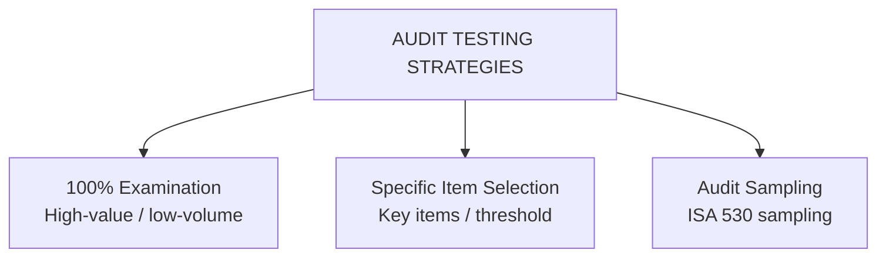
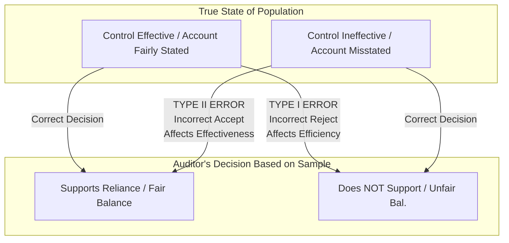
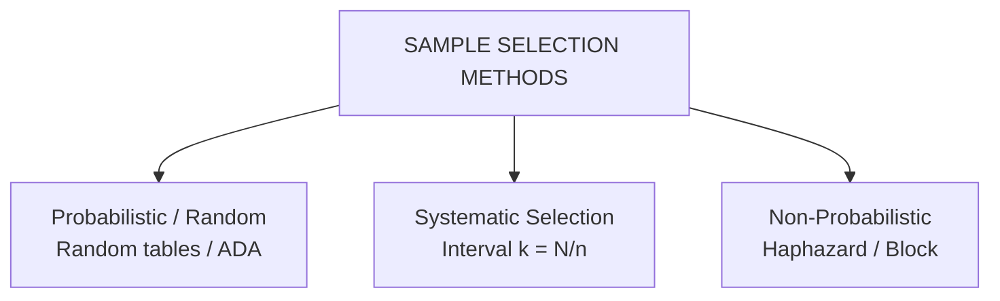
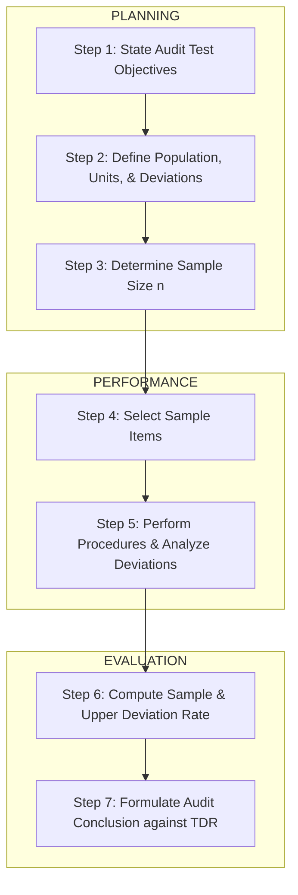
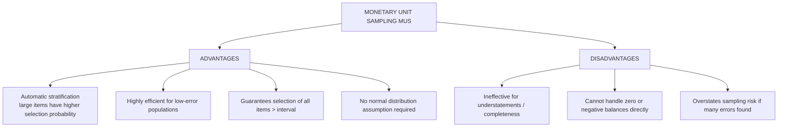

# Audit Sampling: Statistical & Non-Statistical Applications

> [!abstract] Curriculum & Syllabus Context
>
> - **Course:** ACC 305 Auditing and Assurance
> - **Module:** Module 8: Audit Sampling (The Mathematical Enabler)
> - **Target Reading:** ISA 530; Messier (11e) Ch. 8 & 9; ICAB Certificate Ch. 11
> - **Syllabus Focus:** Definition of audit sampling and representative sample; 100% testing vs. specific items vs. audit sampling; sampling risk vs. non-sampling risk; Type I error (risk of underreliance/incorrect rejection, efficiency) vs. Type II error (risk of overreliance/incorrect acceptance, effectiveness); confidence level, tolerable deviation rate (TDR), tolerable misstatement (TM), expected deviation rate (EDR), expected misstatement (EM), precision; statistical vs. non-statistical sampling; sample selection methods (random, systematic, haphazard, block, MUS); Finite Population Correction (FPC); attribute sampling 7-step process for tests of controls (SDR, CUDR, decision rules); Monetary Unit Sampling (MUS/PPS) mechanics (sampling interval, logical unit, tainting factor, basic precision, incremental allowance, upper misstatement limit); and Classical Variables Sampling (mean-per-unit, difference, ratio estimation).

---

### Section 1: Conceptual Foundations & Terminology of Audit Sampling
Audit sampling is an indispensable mathematical and methodological tool in modern financial statement auditing. Because examining 100% of an entity's transactions is economically unfeasible and physically impossible for mid-to-large enterprises, auditors rely on sampling to gather sufficient appropriate audit evidence under **ISA 530 (*Audit Sampling*)**, **Messier 11e (Chapters 8 & 9)**, and the **ICAB Certificate Level Manual (Chapter 11)**.
#### 1. Statutory & Standard Definition of Audit Sampling
> [!info] Key Definition
>
> According to **ISA 530.4**, audit sampling is defined as:
> *"The application of audit procedures to less than 100% of items within a population of audit relevance such that all sampling units have a chance of selection in order to provide the auditor with a reasonable basis on which to draw conclusions about the entire population."*

The foundational premise of audit sampling is the creation of a **representative sample**. A sample is representative if the characteristics and error/deviation rates of the selected items mirror those of the entire population.

---
#### 2. Sampling vs. Non-Sampling Testing Approaches
Not all audit testing procedures involve audit sampling. Auditors choose between three primary testing strategies based on risk, population volume, and system architecture:

| Testing Strategy | Operational Definition & Scope | Applicability & Criteria |
| :--- | :--- | :--- |
| **1. 100% Examination (100% Testing)** | Subjecting every single item in a population to audit procedures. Removes sampling risk entirely. | Appropriate when population consists of a small number of high-value items, when inherent/control risk is extremely high, or when automated tools (Audit Data Analytics - ADA) perform 100% processing checks. |
| **2. Selecting Specific Items** | Selecting items based on specific risk or monetary characteristics (e.g., all items $> \$50,000$, all manual journal entries at year-end, or all zero-balance accounts). | Results **cannot** be projected mathematically to the remaining unexamined population. Used to cover a high percentage of dollar value quickly. |
| **3. Audit Sampling (ISA 530)** | Applying procedures to $< 100\%$ of a population where every sampling unit has a non-zero probability of selection. | Required when drawing mathematical inferences about an entire homogeneous population is necessary for both controls and substantive testing. |

---
#### 3. Dual Risks in Auditing: Sampling Risk vs. Non-Sampling Risk
Total Audit Risk is subject to two distinct sources of potential error:
1. > [!info] Key Definition
   > **Sampling Risk**: The risk that the auditor's conclusion based on a sample may differ from the conclusion that would be reached if the entire population were subjected to the exact same audit procedure. Sampling risk is a direct mathematical consequence of testing less than 100% of the population.
2. > [!info] Key Definition
   > **Non-Sampling Risk**: The risk that the auditor reaches an erroneous conclusion for any reason **not** related to sampling risk. Sources of non-sampling risk include:
   > - Use of inappropriate or ineffective audit procedures.
   > - Misinterpretation of audit evidence or failure to recognize a control deviation or monetary misstatement.
   > - Human errors, fatigue, or inadequate supervision of engagement team members.
   > - *Control Mechanism*: Non-sampling risk cannot be measured mathematically; it is mitigated exclusively through proper audit planning, training, direction, supervision, and firm-level quality management (**ISQM 1** / **ISA 220**).

---
#### 4. Taxonomy of Decision Errors (Type I vs. Type II Errors)
In both tests of controls and substantive tests of details, sampling risk leads to two distinct categories of mathematical decision errors:

##### Detailed Error Mechanics:
1. **Type I Error (Risk of Incorrect Rejection / Risk of Underreliance)**:
   - **Tests of Controls**: The risk that sample evidence indicates a control is *not* operating effectively when, in reality, the control *is* operating effectively.
   - **Substantive Testing**: The risk that sample evidence indicates an account balance is materially misstated when, in reality, it *is not* misstated.
   - **Operational Consequence**: Impacts **Audit Efficiency**. The auditor unnecessarily expands testing, increases sample sizes, or performs unneeded substantive procedures, incurring excess audit costs but ultimately arriving at the correct opinion.
2. > [!warning] Exam Pitfall / Exception
   > **Type II Error (Risk of Incorrect Acceptance / Risk of Overreliance)**:
   > - **Tests of Controls**: The risk that sample evidence indicates a control *is* operating effectively when, in reality, it *is not* operating effectively.
   > - **Substantive Testing**: The risk that sample evidence indicates an account balance *is not* materially misstated when, in reality, it *is* materially misstated.
   > - **Operational Consequence**: Impacts **Audit Effectiveness**. The auditor improperly reduces substantive testing, fails to detect material misstatements, and issues an inappropriate unmodified audit opinion, exposing the firm to severe legal liability and regulatory sanctions.
   > - *Design Mandate*: Auditors design audit samples specifically to bound and control **Type II Risk** to an acceptably low level.

---
#### 5. Core Mathematical Parameters of Audit Sampling
Every audit sampling application relies on three fundamental input parameters:
1. **Desired Confidence Level ($1 - \beta$)**: The mathematical probability that the sample results accurately represent the true population parameters. The complement ($\beta$) is the risk of incorrect acceptance (Type II risk). Higher confidence levels require larger sample sizes.
2. **Tolerable Error ($TDR$ or $TM$)**:
   - **Tolerable Deviation Rate ($TDR$)**: The maximum rate of control deviations the auditor is willing to accept for tests of controls without altering the planned assessed level of control risk.
   - **Tolerable Misstatement ($TM$)**: The monetary amount set by the auditor (derived from Performance Materiality) that the auditor seeks to ensure is not exceeded by actual population misstatement.
3. **Expected Error ($EDR$ or $EM$)**:
   - **Expected Deviation Rate ($EDR$)**: The rate of control deviations the auditor expects to find in the population before testing begins.
   - **Expected Misstatement ($EM$)**: The monetary misstatement the auditor expects to exist in the population prior to sampling.
4. **Allowance for Sampling Risk (Precision - $ASR$)**: The mathematical buffer between expected error and tolerable error:
   > [!quote] Formula & Derivation
   > $$\text{Precision } (ASR) = \text{Tolerable Error} - \text{Expected Error}$$
   > *Rule*: As Precision narrows ($TDR - EDR \to 0$ or $TM - EM \to 0$), required sample size ($n$) approaches infinity.

---
#### 6. Summary Matrix of Evidence Types & Sampling Applicability

| Audit Evidence Procedure (ISA 500) | Audit Sampling Applicable? | Theoretical Rationale |
| :--- | :---: | :--- |
| **Inspection of Tangible Assets** | **YES** | Used to count or inspect sample quantities of physical inventory or fixed assets. |
| **Inspection of Records / Documents** | **YES** | Used for vouching/tracing sample documentation for occurrence, completeness, and cutoff. |
| **Reperformance** | **YES** | Used to reperform a sample of internal control activities or automated calculations. |
| **Confirmation** | **YES** | Used to send circularization requests to a sample of trade receivables or payables. |
| **Recalculation** | **YES / NO** | Applicable when recalculating sample schedules; N/A when recalculating automated 100% files via software. |
| **Analytical Procedures** | **NO** | Evaluates aggregated trends/ratios across entire populations; does not select discrete sample units. |
| **Scanning** | **NO** | Visual or automated search for unusual items in general ledgers; targets specific key items. |
| **Inquiry** | **NO** | Qualitative discussions with management or staff; cannot be sampled mathematically. |
| **Observation** | **NO** | Watching a process at a single point in time (e.g., observing post-opening or inventory count). |

---
### Section 2: Statistical vs. Non-Statistical Sampling Frameworks
Auditors select between **statistical sampling** and **non-statistical sampling** methodologies. Both approaches are fully permitted under **ISA 530**, provided they are properly designed to yield sufficient appropriate audit evidence.

---
#### 1. Comparison of Statistical and Non-Statistical Sampling

| Feature / Dimension | Statistical Sampling | Non-Statistical Sampling |
| :--- | :--- | :--- |
| **Selection Method** | Must use **random** or **probabilistic** selection mechanisms (e.g., random number generators, systematic with random start). | May use **haphazard**, **judgmental**, or **block** selection methods. |
| **Evaluation Method** | Uses **probability theory** and mathematical distributions (Binomial, Poisson, Normal) to evaluate results. | Uses **professional judgment** to evaluate sample results against expected thresholds. |
| **Sampling Risk Measurement** | **Quantifies** sampling risk explicitly (e.g., 95% confidence level, 5% sampling risk). | **Cannot** quantify sampling risk mathematically; relies on qualitative risk assessments. |
| **Sample Size Determination** | Determined via mathematical formulas or standardized statistical tables based on $TDR$, $EDR$, $TM$, $EM$, and $\beta$. | Determined via auditor judgment or firm guidance templates (which are typically calibrated to statistical theory). |
| **Key Advantage** | Objective, defensible in court, measures precision, prevents over/under-auditing. | Flexible, easier to implement, lower administrative and training overhead. |

---
#### 2. Detailed Taxonomy of Sample Selection Methods

1. **Random-Number Selection**:
   - Every item in the population has an equal and known probability of selection.
   - Executed using computerized random-number generators (e.g., IDEA, Tableau, Python, MS Excel) or random-number tables.
   - Requires an unrestricted random sampling framework without replacement.
2. **Systematic Selection**:
   - The population ($N$) is divided by the desired sample size ($n$) to determine the **sampling interval** ($k$):
     > [!quote] Formula & Derivation
     > $$k = \frac{N}{n}$$
   - A random starting point ($R$) is selected within the first interval $[1, k]$.
   - Subsequent sample items are selected systematically at $R, R+k, R+2k, R+3k, \dots$
   - *Risk Constraint*: The auditor must verify that the population is not structured or ordered in a pattern that matches the sampling interval $k$ (e.g., every 10th item being a Friday payroll entry), which would introduce severe sampling bias.
3. **Haphazard Selection**:
   - The auditor selects sample items without any conscious bias, conscious pattern, or deliberate avoidance of difficult-to-locate items.
   - *Constraint*: Haphazard selection is **not** statistical because the probability of selecting any given unit cannot be measured. It must **never** be evaluated using statistical tables.
4. **Block / Sequence Selection**:
   - Involves selecting all items in a contiguous sequence or time block (e.g., all purchase invoices issued between May 1 and May 15).
   - *Constraint*: Generally prohibited for drawing population-wide conclusions because contiguous blocks rarely represent the full operational period.
5. **Monetary Unit Sampling (MUS) / Probability-Proportional-to-Size (PPS)**:
   - A specialized statistical selection method where individual monetary units ($\$1$ increments) serve as the sampling population. Individual logical units (invoices/accounts) containing those dollars are selected in proportion to their monetary size.

---
#### 3. Mathematical Adjustment for Small Populations (Finite Population Correction)
Attribute and variables sampling models assume very large or infinite populations ($N > 1,000$). When auditing small populations ($N < 1,000$), standard sample size formulas overstate the required sample size.

To prevent over-auditing, the auditor applies the **Finite Population Correction (FPC)** factor:

> [!quote] Formula & Derivation
>
> $$\text{Factor} = \sqrt{\frac{N - n}{N - 1}} \approx \sqrt{1 - \frac{n}{N}}$$

Alternatively, the adjusted sample size ($n_{\text{adj}}$) is computed as:

> [!quote] Formula & Derivation
>
> $$n_{\text{adj}} = \frac{n}{1 + \frac{n}{N}}$$

Where:
- $n$ = Unadjusted sample size derived from standard statistical tables or formulas.
- $N$ = Total population size.
- $n_{\text{adj}}$ = Adjusted sample size for the finite small population.
##### Demonstration of FPC Adjustment:
If unadjusted sample size $n = 90$ for a population $N = 300$:
$$n_{\text{adj}} = \frac{90}{1 + \frac{90}{300}} = \frac{90}{1 + 0.30} = \frac{90}{1.30} = 69.23 \approx 70 \text{ items}$$

---
### Section 3: Attribute Sampling for Tests of Controls
Attribute sampling is a statistical sampling methodology used to estimate the proportion of a population that possesses a specific attribute or control deviation. In auditing, it is used during **Tests of Controls (TOC)** to evaluate the operating effectiveness of internal controls.

---
#### 1. The 7-Stage Process of Attribute Sampling
The execution of attribute sampling follows a strict 7-step sequence across Planning, Performance, and Evaluation:

##### Detailed Step Breakdown:
- **Step 1: State Test Objectives**: e.g., Evaluate whether sales invoices are properly authorized for credit approval prior to shipment.
- **Step 2: Define Characteristics**:
  - *Population*: All sales transactions recorded in the sales journal for the year ($N = 50,000$).
  - *Sampling Unit*: An individual customer sales order / sales invoice package.
  - *Deviation Condition*: Absence of credit manager signature or electronic approval stamp on the sales order prior to shipment date.
- **Step 3: Determine Sample Size ($n$)**: Derived from desired confidence level ($1 - \beta$), Tolerable Deviation Rate ($TDR$), and Expected Population Deviation Rate ($EDR$).
- **Step 4: Select Sample**: Apply random number selection or systematic selection.
- **Step 5: Execute Procedures & Analyze Deviations**: Inspect documents. Examine the qualitative cause of any observed deviations (e.g., systematic system bypass vs. isolated human oversight, potential fraud vs. error).
- **Step 6: Compute Deviation Rates**:
  - **Sample Deviation Rate ($SDR$)**:
    > [!quote] Formula & Derivation
    > $$SDR = \frac{d}{n}$$
    > Where $d$ = number of deviations observed in sample size $n$.
  - **Computed Upper Deviation Rate ($CUDR$)**:
    > [!quote] Formula & Derivation
    > $$CUDR = SDR + ASR$$
    > Where $ASR$ = Allowance for Sampling Risk (retrieved from Poisson/Binomial statistical evaluation tables at the specified confidence level).
- **Step 7: Formulate Audit Conclusion**: Compare $CUDR$ to $TDR$.

---
#### 2. Decision Rules & Strategic Impact for Tests of Controls
> [!quote] Formula & Derivation
>
> $$\text{Decision Condition 1: } CUDR \le TDR$$

- **Conclusion**: Sample evidence supports the operating effectiveness of the control.
- **Strategic Impact**: The auditor accepts the planned Control Risk ($CR < 1.0$), adopts a **Reliance Strategy**, and reduces the nature, timing, and extent of substantive tests of details.

> [!quote] Formula & Derivation
>
> $$\text{Decision Condition 2: } CUDR > TDR$$

- **Conclusion**: Sample evidence indicates the control is **not** operating effectively at the desired confidence level.
- **Strategic Impact**:
  1. Test alternative compensating controls (if available).
  2. Increase assessed Control Risk to maximum ($CR = 1.0$).
  3. Switch to a **Substantive Strategy** by lowering acceptable Detection Risk ($DR$) and expanding substantive tests of details.

---
#### 3. Handling Special Operational Scenarios in Controls Testing

| Operational Scenario | Required Auditor Action / Treatment |
| :--- | :--- |
| **1. Properly Voided Documents** | If an item selected in the sample is legitimately voided in the ordinary course of business, it does **not** count as a deviation. The auditor replaces it with a new randomly selected item. |
| **2. Unused / Inapplicable Documents** | If an item is not applicable to the control being tested (e.g., utility bill selected in a sample testing goods receiving reports), replace it with a substitute random item. |
| **3. Inability to Locate / Examine Item** | If the client cannot produce the selected document or supporting evidence, the item must be treated as a **control deviation**. |
| **4. Early High-Deviation Stopping** | If the number of deviations observed early in the sample exceeds the maximum allowable deviations for $CUDR \le TDR$, the auditor stops testing immediately, rejects control reliance, and expands substantive procedures. |

---
### Section 4: Substantive Sampling for Account Balances
When conducting substantive tests of details to determine if an account balance is materially misstated, auditors utilize two primary statistical sampling techniques: **Monetary Unit Sampling (MUS)** and **Classical Variables Sampling (CVS)**.

---
#### 1. Monetary Unit Sampling (MUS) / Probability-Proportional-to-Size (PPS)
##### A. Definition & Core Mechanics:
Monetary Unit Sampling (MUS) is an attribute-sampling-based technique modified to reach monetary conclusions. In MUS, the individual **single monetary unit ($\$1$)** is defined as the sampling unit.
##### B. Logical Unit vs. Sampling Unit:
- **Sampling Unit**: Each individual $\$1$ in the population book value.
- **Logical Unit**: The physical document or account balance (e.g., customer invoice, trade receivable balance) that contains the specific selected $\$1$.
##### C. Advantages & Disadvantages of MUS:

##### D. MUS Sample Size & Sampling Interval Formulas:
The **Sampling Interval ($k$)** is calculated as:
> [!quote] Formula & Derivation
>
> $$k = \frac{\text{Population Book Value } (N)}{\text{Sample Size } (n)} \quad \text{or} \quad k = \frac{\text{Tolerable Misstatement } (TM)}{\text{Confidence Factor } (CF)}$$

The required sample size ($n$) is:
> [!quote] Formula & Derivation
>
> $$n = \frac{N \times CF}{TM - (EM \times \text{Expansion Factor})}$$

##### E. Tainting Factor & Misstatement Evaluation Metrics:
For each misstated logical unit whose book value ($BV_i$) is less than the sampling interval ($k$):

> [!quote] Formula & Derivation
>
> $$\text{Tainting Factor } (t_i) = \frac{BV_i - AV_i}{BV_i}$$
> Where $AV_i$ = Audit Value of the item.

The **Projected Misstatement ($PM$)** for item $i$ is:
> [!quote] Formula & Derivation
>
> $$PM_i = t_i \times k$$

For logical units where $BV_i \ge k$, the actual dollar misstatement is added directly to $PM$ without multiplying by a tainting factor, and no incremental sampling risk is added (because $100\%$ of the item's dollars were examined).
##### F. Upper Misstatement Limit ($UML$) Formulation:
The total $UML$ is structured as:

> [!quote] Formula & Derivation
>
> $$UML = \text{Basic Precision } (BP) + \text{Incremental Allowance for Sampling Risk } (IASR) + \text{Projected Misstatements } (PM) + \text{Factual Misstatements in Large Items}$$

1. **Basic Precision ($BP$)**:
   $$BP = k \times \text{Misstatement Factor for 0 Errors } (CF_0)$$
2. **Incremental Allowance for Sampling Risk ($IASR$)**:
   $$IASR = \sum_{i=1}^{d} \left[ (t_i \times k \times \Delta CF_i) - (t_i \times k) \right]$$
   Where $\Delta CF_i$ represents the incremental change in the confidence factor ranking tainting factors from largest to smallest.
##### G. MUS Decision Rule:
- If $UML \le TM$: Account balance is fairly stated at the desired confidence level.
- If $UML > TM$: Account balance is materially misstated. The auditor requests management to adjust the account, expands testing, or modifies the audit report.

---
#### 2. Classical Variables Sampling (CVS)
Classical Variables Sampling relies on normal distribution theory to estimate the true monetary balance or misstatement of a population based on sample mean and standard deviation metrics.
##### A. Major CVS Approaches:
1. **Mean-per-Unit (MPU) Estimation**: Projects the average audited value of sample items to all items in the population.
   $$\text{Estimated Total Audited Value} = N \times \bar{x}_{AV}$$
2. **Difference Estimation**: Measures the average audit difference per item in the sample and projects it across $N$.
   $$\bar{d} = \frac{\sum (BV_i - AV_i)}{n}$$
   $$\text{Projected Population Misstatement } (PM) = N \times \bar{d}$$
3. **Ratio Estimation**: Applies the ratio of sample audited value to sample book value across the population.
   $$\text{Ratio } (R) = \frac{\sum AV_i}{\sum BV_i} \implies \text{Estimated Total Value} = N \times R \times \bar{x}_{BV}$$
##### B. Difference Estimation Sample Size Formula:
> [!quote] Formula & Derivation
>
> $$n = \left( \frac{N \times z_{\alpha/2} \times SD_d}{TM - EM} \right)^2$$
> Where:
> - $N$ = Population size in physical units.
> - $z_{\alpha/2}$ = Standard normal coefficient for desired confidence level (e.g., $1.96$ for $95\%$).
> - $SD_d$ = Estimated standard deviation of sample differences:
>   $$SD_d = \sqrt{\frac{\sum (d_i - \bar{d})^2}{n - 1}}$$
> - $TM$ = Tolerable Misstatement.
> - $EM$ = Expected Misstatement.

##### C. Precision & Confidence Bounds in CVS:
> [!quote] Formula & Derivation
>
> $$\text{Precision } (Precision) = N \times z_{\alpha/2} \times \frac{SD_d}{\sqrt{n}} \times \sqrt{1 - \frac{n}{N}}$$
> $$\text{Confidence Interval} = PM \pm Precision$$

If the confidence interval $[PM - Precision, PM + Precision]$ falls within $[-TM, +TM]$, the account balance is accepted as fairly stated.

---
### Section 5: Step-by-Step Numerical Problem Walkthroughs

---

> [!example] Numerical Problem & Case Study
>
> #### Comprehensive Problem 1: Attribute Sampling for Tests of Controls
> ##### Scenario Context:
> An auditor is conducting tests of controls over the sales invoice authorization process at Apex Pharmaceuticals Ltd.
> - Population Size ($N$) = $10,000$ sales invoice packages.
> - Desired Confidence Level = $95\%$ ($\beta = 0.05$).
> - Tolerable Deviation Rate ($TDR$) = $6.0\%$.
> - Expected Population Deviation Rate ($EDR$) = $1.5\%$.
> ##### Step 1: Sample Size Determination
> Using standard Attribute Sampling Tables for a $95\%$ Confidence Level (ISA 530 / Messier 11e Ch 8 Table 8-5):
> - At $TDR = 6.0\%$ and $EDR = 1.5\%$, the required initial sample size is **$n = 103$ items**.
> - *(Applying Finite Population Correction if $N=10,000$, adjustment is negligible since $N > 1,000$)*.
> ##### Step 2: Performance & Sample Results
> The auditor selects $103$ sales invoice packages using systematic random selection ($k = 10,000 / 103 \approx 97$). Upon performing audit procedures, the auditor observes **$3$ control deviations** (missing authorization signatures).
> ##### Step 3: Mathematical Computations
> 1. **Sample Deviation Rate ($SDR$)**:
>    $$SDR = \frac{d}{n} = \frac{3}{103} = 0.02913 \implies 2.91\%$$
> 2. **Computed Upper Deviation Rate ($CUDR$)**:
>    From Statistical Evaluation Tables (95% Confidence Level, $n = 100$, $d = 3$ deviations):
>    $$\text{Table Value for } n=100, d=3 \implies CUDR = 7.6\%$$
> 3. **Allowance for Sampling Risk ($ASR$)**:
>    $$ASR = CUDR - SDR = 7.6\% - 2.91\% = 4.69\%$$
> ##### Step 4: Audit Decision & Synthesis
> - **Comparison**: $CUDR (7.6\%) > TDR (6.0\%)$.
> - **Conclusion**: The sample evidence does **not** support the operating effectiveness of the control at the $95\%$ confidence level.
> - **Audit Action**:
>   1. The auditor rejects the planned Control Risk assessment of $CR = 0.30$.
>   2. Control Risk is revised upward to $CR = 1.0$ (Maximum).
>   3. The auditor switches from a Reliance Strategy to a Substantive Strategy, lowering acceptable Detection Risk ($DR$) and expanding substantive tests of details over revenue occurrence and receivables valuation.

---

> [!example] Numerical Problem & Case Study
>
> #### Comprehensive Problem 2: Monetary Unit Sampling (MUS) for Accounts Receivable
> ##### Scenario Context:
> An auditor is performing substantive tests of details on the trade receivables balance of Bengal Distribution Ltd as of December 31, 2025.
> - Population Book Value ($N$) = $\$2,500,000$.
> - Population Physical Units = $1,250$ customer accounts.
> - Overall Materiality = $\$100,000$.
> - Performance Materiality / Tolerable Misstatement ($TM$) = $\$50,000$.
> - Expected Misstatement ($EM$) = $\$10,000$.
> - Desired Confidence Level = $95\%$ (Risk of Incorrect Acceptance $\beta = 0.05$).
> ---
> ##### Step 1: Compute Sampling Interval ($k$) & Sample Size ($n$)
> From Statistical MUS Tables for 95% Confidence:
> - Confidence Factor for 0 Errors ($CF_0$) = $3.00$.
> - Expansion Factor for Expected Misstatement = $1.60$.
> $$\text{Sampling Interval } (k) = \frac{TM}{CF_0} = \frac{\$50,000}{3.00} = \$16,666.67 \approx \$16,667$$
> $$\text{Sample Size } (n) = \frac{N}{k} = \frac{\$2,500,000}{\$16,667} = 150 \text{ sampling units}$$
> ---
> ##### Step 2: Sample Testing & Misstatement Identification
> The auditor selects 150 monetary units using systematic probability-proportional-to-size (PPS) selection with $k = \$16,667$. Audit testing reveals the following **3 misstatements**:
> | Customer Account | Book Value ($BV_i$) | Audit Value ($AV_i$) | Dollar Misstatement | Tainting Factor ($t_i$) |
> | :--- | :---: | :---: | :---: | :---: |
> | **Account 1: Delta Corp** | $\$5,000$ | $\$3,750$ | $\$1,250$ | $t_1 = \frac{5,000 - 3,750}{5,000} = 0.25$ |
> | **Account 2: Omega Ltd** | $\$10,000$ | $\$5,000$ | $\$5,000$ | $t_2 = \frac{10,000 - 5,000}{10,000} = 0.50$ |
> | **Account 3: Titan PLC** | $\$25,000$ ($\ge k$) | $\$20,000$ | $\$5,000$ | **Factual Misstatement** ($BV \ge k$) |
> ---
> ##### Step 3: Calculation of Projected Misstatement ($PM$)
> 1. **Items with $BV_i < k$**:
>    - Account 1 (Delta Corp): $PM_1 = t_1 \times k = 0.25 \times \$16,667 = \$4,166.75$
>    - Account 2 (Omega Ltd): $PM_2 = t_2 \times k = 0.50 \times \$16,667 = \$8,333.50$
> 2. **Items with $BV_i \ge k$**:
>    - Account 3 (Titan PLC): Factual Misstatement = $\$5,000.00$ (No expansion/tainting).
> $$\text{Total Projected Misstatement } (PM) = \$4,166.75 + \$8,333.50 + \$5,000.00 = \$17,500.25$$
> ---
> ##### Step 4: Calculation of Allowance for Sampling Risk & Upper Misstatement Limit ($UML$)
> 3. **Basic Precision ($BP$)**:
>    $$BP = k \times CF_0 = \$16,667 \times 3.00 = \$50,001.00$$
> 4. **Incremental Allowance for Sampling Risk ($IASR$)**:
>    Rank tainting factors for items $BV < k$ in descending order:
>    - Rank 1: $t_2 = 0.50$ (Omega Ltd)
>    - Rank 2: $t_1 = 0.25$ (Delta Corp)
>    Retrieve 95% Confidence Factors ($CF$):
>    - $CF_0 = 3.00$
>    - $CF_1 = 4.75 \implies \Delta CF_1 = 1.75$
>    - $CF_2 = 6.30 \implies \Delta CF_2 = 1.55$
>    $$\text{Incremental Risk for Rank 1 } (t_2 = 0.50) = 0.50 \times \$16,667 \times (1.75 - 1) = 0.50 \times \$16,667 \times 0.75 = \$4,166.75$$
>    $$\text{Incremental Risk for Rank 2 } (t_1 = 0.25) = 0.25 \times \$16,667 \times (1.55 - 1) = 0.25 \times \$16,667 \times 0.55 = \$1,145.86$$
>    $$\text{Total IASR} = \$4,166.75 + \$1,145.86 = \$5,312.61$$
> 5. **Total Upper Misstatement Limit ($UML$) Assembly**:
>    $$UML = BP + PM_{\text{sample}} + IASR + \text{Factual Misstatements}_{\ge k}$$
>    $$UML = \$50,001.00 + (\$4,166.75 + \$8,333.50) + \$5,312.61 + \$5,000.00$$
>    $$UML = \$50,001.00 + \$12,500.25 + \$5,312.61 + \$5,000.00 = \$72,813.86$$
> ---
> ##### Step 5: Audit Evaluation & Final Decision Rule
> - **Comparison**:
>   - Total Projected Misstatement ($PM$) = $\$17,500.25$
>   - Upper Misstatement Limit ($UML$) = $\$72,813.86$
>   - Tolerable Misstatement ($TM$) = $\$50,000.00$
> - **Evaluation**: $UML (\$72,813.86) > TM (\$50,000.00)$.
> - **Audit Conclusion**: At the $95\%$ confidence level, the auditor **cannot** accept the trade receivables balance as fairly stated. There is an unacceptably high risk that the true population misstatement exceeds Tolerable Misstatement.
> ##### Required Auditor Action Options:
> 1. **Request Management Adjustment**: Request management to correct the known factual misstatements totaling $\$11,250$ ($\$1,250 + \$5,000 + \$5,000$). If management adjusts the books by at least $\$22,813.86$, the revised $UML$ will drop below $TM$ ($\$50,000$).
> 2. **Expand Sample Testing**: Increase sample size in specific strata to reduce the allowance for sampling risk.
> 3. **Perform Alternative Substantive Procedures**: Expand substantive tests of details on specific high-risk sub-populations (e.g., specific product lines or customer categories).
> 4. **Modify Audit Opinion**: If management refuses to adjust the accounts and alternative procedures do not reduce $UML \le TM$, issue a **Qualified ("Except for")** or **Adverse Audit Opinion** under **ISA 705 (Revised)**.