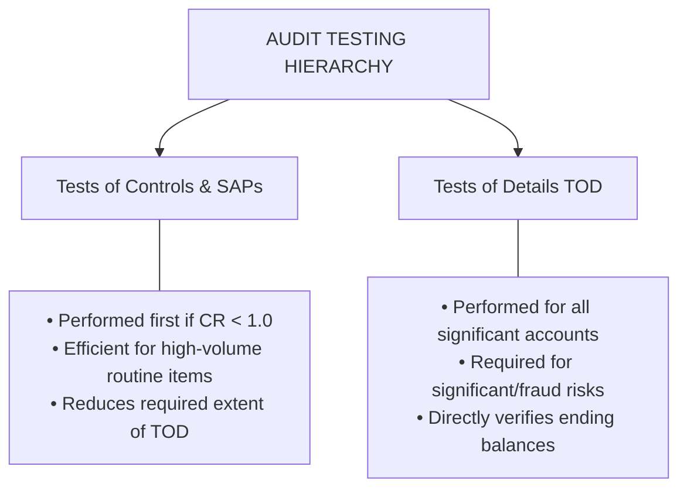
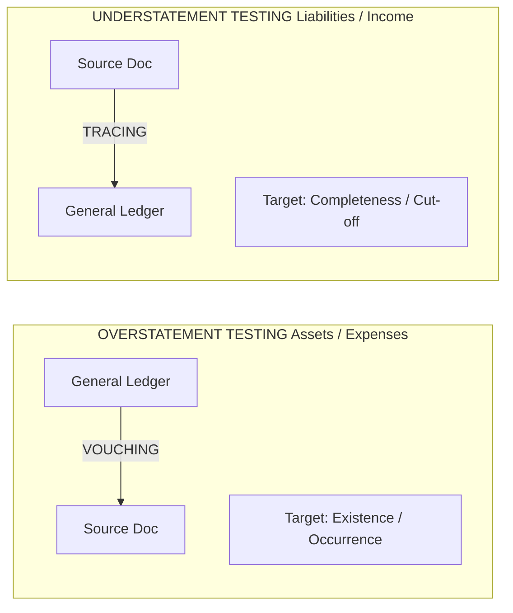
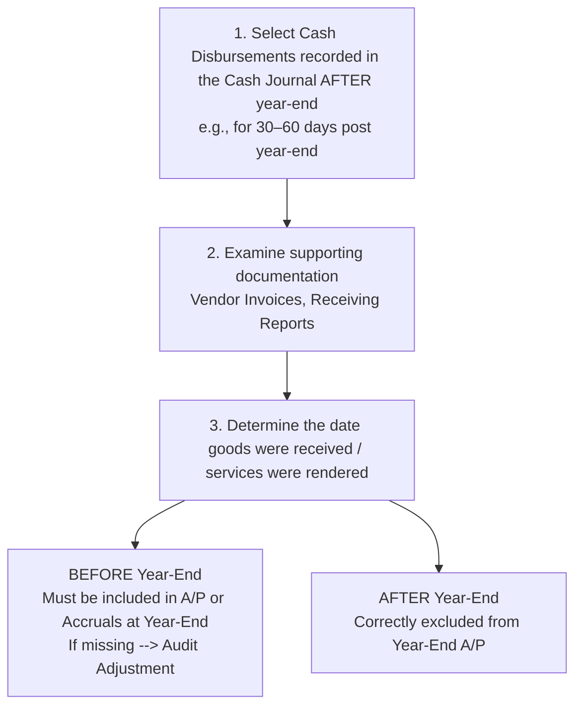
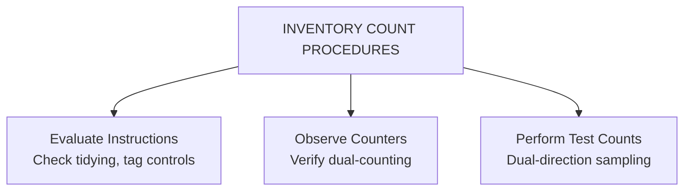

# Auditing Business Processes & Substantive Execution

> [!abstract] Curriculum & Syllabus Context
>
> - **Course:** ACC 305 Auditing and Assurance
> - **Module:** Module 9: Auditing Business Processes & Substantive Execution
> - **Target Reading:** ISA 330; ISA 500; ISA 505; ISA 520; ISA 501; Messier (11e) Ch. 10–16; ICAB Certificate Ch. 6–8, 13; ICAB Professional Ch. 11
> - **Syllabus Focus:** Audit testing hierarchy; directional testing for balance sheet and P&L accounts; external confirmations under ISA 505 (positive, negative, blank, non-response, exceptions); substantive analytical procedures 4-step framework; auditing the revenue cycle (segregation of duties, circularization of receivables, aged trial balance, sales cut-off); auditing the purchasing cycle (segregation of duties, search for unrecorded liabilities, supplier statement reconciliations); auditing payroll (ghost employees, analytical reasonableness, accruals); auditing inventory (ISA 501 physical count observation, floor-to-sheet vs. sheet-to-floor test counts, cut-off data, IAS 2 lower of cost and NRV testing); auditing PPE (additions vouching, repairs & maintenance completeness check, depreciation reperformance); auditing long-term debt and covenants; and auditing cash (bank reconciliation verification, cutoff bank statement, interbank transfer schedule to detect kiting).

---

### Section 1: Overview & Methodological Framework of Substantive Testing
Substantive execution represents the culmination of the audit process. Having evaluated the entity's internal controls, established materiality, and designed sampling plans, the auditor performs substantive procedures to detect material misstatements at the assertion level in accordance with **ISA 330 (*The Auditor's Responses to Assessed Risks*)**, **ISA 500 (*Audit Evidence*)**, **Messier 11e (Chapters 10–16)**, **ICAB Certificate Level Manual (Chapters 6, 7, 8, 13)**, and **ICAB Professional Level Manual (Chapter 11)**.
#### 1. The Audit Testing Hierarchy & Substantive Strategy
Substantive procedures consist of two main categories:
1. **Substantive Analytical Procedures (SAP)**: Evaluations of financial information through analysis of plausible relationships among financial and non-financial data (**ISA 520**).
2. **Tests of Details (TOD)**: Direct procedures designed to gather evidence substantiating individual transaction entries, account balances, and disclosures.

> [!warning] Exam Pitfall / Exception
>
> **Rule under ISA 330.18**: Irrespective of the assessed risks of material misstatement, the auditor **must** design and perform substantive procedures for each material class of transactions, account balance, and disclosure.

---
#### 2. Directional Testing Mechanics: Overstatement vs. Understatement
To efficiently audit double-entry accounting systems, auditors apply directional testing based on account characteristics:

| Audit Direction | Primary Assertions Tested | Directional Flow | Primary Risk / Target |
| :--- | :--- | :--- | :--- |
| **Vouching** | Existence, Occurrence, Rights & Obligations | From General Ledger / Financial Statements **down to** Source Documents (Invoices, Shipping Notes, Contracts). | Overstatement (Fictitious revenues, capitalized expenses, inflated assets). |
| **Tracing** | Completeness, Cut-off | From Source Documents (Receiving Reports, Shipping Notes) **up to** General Ledger / Financial Statements. | Understatement (Unrecorded liabilities, omitted sales, suppressed expenses). |

---
#### 3. Standard Framework 1: External Confirmations (ISA 505)
**ISA 505 (*External Confirmations*)** governs direct written responses obtained by the auditor from a third party (confirming party) in paper, electronic, or other media.
##### A. Types of Confirmation Requests:
1. **Positive Confirmation Request**: Requests the confirming party to respond directly to the auditor indicating whether they agree or disagree with the information, or providing the requested information.
   - *Risk*: A confirming party may sign and return the confirmation without verifying the information. To mitigate this, a **blank confirmation request** (asking the third party to fill in the balance) is used, though it yields lower response rates.
2. > [!warning] Exam Pitfall / Exception
   > **Negative Confirmation Request**: Requests the confirming party to respond directly to the auditor **only** if they disagree with the information provided.
   > - *Strict Limitations*: Negative confirmations provide less persuasive audit evidence and shall **not** be used as the sole substantive procedure unless ALL four of the following conditions are met (**ISA 505.15**):
   >   1. Assessed risk of material misstatement (RMM) is low, and effective controls have been tested.
   >   2. The population consists of a large number of small, homogeneous account balances.
   >   3. A very low exception rate is expected.
   >   4. The auditor is not aware of circumstances that would cause recipients to disregard the requests.
##### B. Handling Non-Responses & Exceptions:
- **Non-Response**: If a positive confirmation is not returned, the auditor **must** perform alternative audit procedures (e.g., examining subsequent cash receipts, shipping documentation, or supplier invoices).
- **Exceptions**: Discrepancies between client records and confirmation replies must be investigated to determine whether they represent misstatements, timing differences, or customer disputes.

---
#### 4. Standard Framework 2: Substantive Analytical Procedures (ISA 520)
When designing substantive analytical procedures under **ISA 520**, the auditor applies a 4-step decision model:

> [!quote] Formula & Derivation
>
> $$\text{Tolerable Difference } (TD) \le \text{Performance Materiality } (PM)$$

1. **Determine Suitability**: Assess the predictability of relationships (e.g., interest expense relative to debt balances is highly predictable; operating expenses are moderately predictable).
2. **Evaluate Data Reliability**: Assess the source, comparability, and controls over data preparation (internal vs. external sources).
3. **Develop a Precise Expectation**: Formulate a quantitative point estimate or range (e.g., $\text{Expected Revenue} = \text{Occupancy Rate} \times \text{Number of Rooms} \times \text{Average Room Rate}$).
4. **Investigate Significant Differences**: If the difference between recorded book value and expected value exceeds tolerable difference ($TD$), the auditor must inquire of management, obtain corroborative evidence, and perform additional procedures.

---
### Section 2: Auditing the Revenue & Collection Process
The revenue process encompasses the sale of goods/services, cash receipts, and sales returns/allowances (**Messier Ch 10**, **ICAB Cert Ch 6 & 13**).
#### 1. Core Functions & Segregation of Duties (SOD)

- **Key SOD Prohibitions**:
  - Credit approval must be independent of sales order entry (prevents sales to bad credit risks).
  - Shipping must be independent of billing (prevents unbilled shipments or unauthorized dispatches).
  - Cash receipts handling must be independent of accounts receivable recordkeeping (prevents **lapping**—concealing cash shortages by delaying customer credit postings).

---
#### 2. Substantive Audit Procedures Matrix for Accounts Receivable & Revenue

| Assertion | Specific Audit Risk | Key Substantive Procedure (ISA 500 / 505) |
| :--- | :--- | :--- |
| **Existence** | Fictitious revenue / accounts receivable at year-end. | **Confirm Accounts Receivable** (ISA 505) directly with customers; vouch sample of customer balances to sales invoices and shipping documents (bills of lading). |
| **Rights & Obligations** | Receivables factored, assigned, or pledged as collateral without disclosure. | Inquire of management, inspect bank confirmation letters, and review board minutes for debt covenants or factoring arrangements. |
| **Completeness** | Sales transactions shipped but omitted from revenue journal. | **Trace** a sample of shipping documents (bills of lading/dispatch notes) generated before year-end up to sales invoices and the sales journal. |
| **Accuracy, Valuation & Allocation** | Inadequate allowance for uncollectible accounts; incorrect pricing. | Obtain and test the **Aged Trial Balance (ATB)**; re-foot the ATB; examine subsequent cash collections after year-end; discuss overdue accounts with credit manager; test IFRS 9 / local allowance model. |
| **Cut-off** | Revenue recorded in wrong accounting period (early or late). | Perform **sales cut-off tests**: compare shipping dates on dispatches 5 days before/after year-end with sales invoice dates and sales journal entry dates. |
| **Classification & Presentation** | Trade receivables mixed with officer loans or non-current amounts. | Review accounts receivable sub-ledger for credit balances (reclassify as accounts payable), officer/related-party loans, and ensure proper disaggregation in footnotes. |

---
### Section 3: Auditing the Purchasing & Payment Process
The purchasing process encompasses purchasing raw materials/services, receiving goods, processing vendor invoices, and executing cash disbursements (**Messier Ch 11**, **ICAB Cert Ch 7 & 13**).
#### 1. Core Functions & Segregation of Duties

- **Key SOD Prohibitions**:
  - Purchasing function must be independent of receiving and accounts payable.
  - Cash disbursement (signing checks / approving EFTs) must be strictly independent of voucher preparation and accounts payable posting.

---
#### 2. Search for Unrecorded Liabilities (Mandatory Audit Procedure)
Because management has an economic incentive to understate liabilities and expenses, the primary audit risk for accounts payable is **understatement (Completeness)**. The auditor conducts a formal **Search for Unrecorded Liabilities** near the end of fieldwork:

##### Additional Completeness Audit Steps:
- Examine unmatched Goods Received Notes (GRNs) and unbilled vendor invoices existing at year-end.
- Reconcile supplier monthly statements directly with accounts payable ledger balances (particularly for major suppliers with low or nil balances).

---
### Section 4: Auditing the Human Resource & Payroll Process
The payroll process involves employee hiring, timekeeping, payroll calculations, check/EFT disbursements, and tax reporting (**Messier Ch 12**, **ICAB Cert Ch 8 & 13**).
#### 1. Audit Risks & Segregation of Duties
- **Primary Risks**: Payments to fictitious ("ghost") employees, unauthorized pay rates, and improper classification of direct/indirect labor costs.
- **Key Controls**: Human Resources authorizes hiring/firing and pay rates independently of payroll calculation; supervisors approve time cards/swipe logs independently of payment distribution.

---
#### 2. Substantive Audit Procedures for Payroll

| Assertion | Specific Audit Risk | Key Substantive Procedure |
| :--- | :--- | :--- |
| **Occurrence** | Payments made to ghost or terminated employees. | Vouch a sample of payroll entries from the payroll register to authorized personnel files, approved timesheets, and bank payment confirmations. |
| **Completeness** | Accrued payroll / tax liabilities omitted at year-end. | Recompute year-end payroll accruals (e.g., unpaid days between last pay date and year-end) and verify payment of post-year-end tax returns (withholdings, provident fund). |
| **Accuracy** | Gross pay, tax withholdings, or net pay calculated incorrectly. | Recompute gross-to-net calculations for a sample of employees; perform **Substantive Analytical Procedure**:  $$\text{Expected Payroll} = \text{Prior Year Base} \times (1 + \Delta \text{Headcount}) \times (1 + \Delta \text{Pay Rate})$$ |
| **Classification** | Direct labor misclassified as indirect overhead or operating expense. | Test payroll coding against cost accounting job cost sheets and departmental budget classifications. |

---
### Section 5: Auditing the Inventory Management Process
Inventory is frequently the most complex balance sheet account due to physical dispersion, valuation judgments, and susceptibility to theft/obsolescence (**Messier Ch 13**, **ICAB Cert Ch 13**).
#### 1. Physical Inventory Count Observation (ISA 501 / Messier Ch 13)
Under **ISA 501 (*Audit Evidence—Specific Considerations for Selected Items*)**, if inventory is material, the auditor **shall** obtain sufficient appropriate audit evidence regarding its existence and condition by attending physical inventory counting, unless impracticable.
##### Audit Procedures During Count Attendance:

1. **Dual-Directional Test Counts**:
   - **Floor-to-Sheet (Completeness)**: Select physical items from the warehouse floor and count them $\to$ trace to client count sheets to ensure all physical goods are recorded.
   - **Sheet-to-Floor (Existence)**: Select recorded items from client count sheets $\to$ locate physical items on warehouse floor to ensure recorded inventory exists.
2. **Tag Control & Cut-off Data**:
   - Record the last pre-numbered Goods Received Note (GRN) and Goods Dispatch Note (GDN) numbers issued prior to count initiation.
   - Identify damaged, obsolete, or slow-moving inventory items on the floor for valuation testing.

---
#### 2. Valuation Testing: Lower of Cost and Net Realizable Value (NRV)
According to **IAS 2 (*Inventories*)**, inventory must be measured at the lower of cost and net realizable value ($NRV$).

> [!quote] Formula & Derivation
>
> $$\text{Net Realizable Value } (NRV) = \text{Estimated Selling Price} - \text{Estimated Costs of Completion} - \text{Estimated Selling Costs}$$

- **Audit Procedure**: Select a sample of inventory items from the final inventory summary schedule:
  1. Vouch unit costs to recent vendor purchase invoices (FIFO/Weighted Average basis).
  2. Compare unit cost against post-year-end sales invoices for the same product line.
  3. If $\text{Unit Sales Price} - \text{Selling Costs} < \text{Unit Cost}$, verify that the inventory item is written down to $NRV$.

---
### Section 6: Auditing Financing & Investing Processes
Financing and investing processes involve non-current assets, long-term liabilities, equity, and treasury/cash balances (**Messier Ch 14, 15, 16**, **ICAB Cert Ch 13**).
#### 1. Property, Plant, & Equipment (PPE) & Intangible Assets (Messier Ch 14)
- **Substantive Additions & Disposals Audit**:
  - Obtain PPE Lead Schedule; foot and reconcile opening balances to prior year working papers and ending balances to general ledger.
  - Vouch major additions to purchase invoices, contracts, title deeds, and board authorization.
  - Inspect major physical additions on site (Existence).
  - Test **Repairs & Maintenance Expense** accounts to detect capital expenditure incorrectly expensed (Completeness of PPE).
  - Vouch disposals: verify removal of cost and accumulated depreciation, and recalculate Gain/Loss on Disposal ($\text{Proceeds} - \text{Net Book Value}$).
- **Depreciation & Impairment**: Recompute annual depreciation expense based on accounting policy; inspect intangible assets for indicators of impairment (**IAS 36**).

---
#### 2. Long-Term Debt & Equity (Messier Ch 15)
- **Long-Term Debt**:
  - Confirm outstanding principal, interest rates, and maturity dates directly with lenders/trustees.
  - Recompute accrued interest payable and interest expense.
  - Review debt agreements for **covenant compliance** (e.g., debt-to-equity ratio restrictions); if covenants are breached, verify reclassification of long-term debt to current liabilities under **IAS 1**.
- **Stockholders' Equity**:
  - Confirm share capital with independent registrar or inspect stock certificate book.
  - Vouch dividend declarations to board minutes and recompute dividend payouts.

---
#### 3. Auditing Cash & Bank Balances (Messier Ch 16 / ICAB Cert Ch 13)
Cash is the most liquid asset and carries high inherent fraud risk.
##### A. Bank Reconciliation Audit Procedures:
The auditor obtains the client's year-end Bank Reconciliation and performs the following:

> [!quote] Formula & Derivation
>
> $$\text{Balance per Bank Statement} + \text{Deposits in Transit} - \text{Outstanding Checks} = \text{Balance per General Ledger}$$

1. **Confirm Bank Balance**: Send direct **Standard Bank Confirmations** to all banks where the client holds accounts (verifying balances, loans, and guarantees).
2. **Obtain Cut-off Bank Statement**: Request a bank statement covering 10–14 business days after year-end directly from the bank.
3. **Verify Reconciling Items**:
   - **Deposits in Transit**: Trace to post-year-end bank statement (should clear within 1–3 days).
   - **Outstanding Checks**: Trace to post-year-end bank statement (verify check dates preceded year-end and cleared appropriately).
##### B. Detection of Kiting:
> [!info] Key Definition
>
> **Kiting** is an illegal scheme where cash is artificially inflated by transferring money between bank accounts and recording the transfer as a deposit in the receiving bank before year-end, while delaying the recording of the disbursement in the drawing bank.

- *Audit Tool*: **Interbank Transfer Schedule**—verifies that disbursement and receipt dates are recorded in the exact same accounting period.

---
### Section 7: Comprehensive Step-by-Step Numerical Walkthroughs

---

> [!example] Numerical Problem & Case Study
>
> #### Walkthrough 1: Search for Unrecorded Liabilities & Purchase Cut-Off
> An auditor is conducting the search for unrecorded liabilities at Zenith Trading Ltd for the year ended December 31, 2025. Overall Materiality = $\$100,000$; Performance Materiality ($TM$) = $\$50,000$.
> The auditor examines cash disbursements recorded in January 2026 and unmatched invoice files:
> | Item # | Payment / Invoice Date | Vendor | Invoice Amount | Receiving Report Date (GRN) | Description / Period Covered |
> | :---: | :---: | :--- | :---: | :---: | :--- |
> | **1** | Jan 8, 2026 | Apex Steel | $\$35,000$ | Dec 28, 2025 | Raw Steel received Dec 28, 2025. |
> | **2** | Jan 12, 2026 | PowerGrid Co | $\$18,000$ | N/A | Electricity usage for Dec 2025. |
> | **3** | Jan 15, 2026 | Delta Freight | $\$12,000$ | Jan 4, 2026 | Freight for goods shipped Jan 3, 2026. |
> | **4** | Jan 20, 2026 | Titan Machinery | $\$45,000$ | Dec 30, 2025 | Equipment spare parts received Dec 30, 2025. |
> ##### Audit Evaluation & Calculations:
> - **Item 1**: Goods received Dec 28, 2025 (before year-end). Unrecorded liability at Dec 31, 2025. Amount = $\$35,000$.
> - **Item 2**: Electricity consumed in Dec 2025 (before year-end). Unrecorded accrual at Dec 31, 2025. Amount = $\$18,000$.
> - **Item 3**: Freight for Jan 2026 shipment (after year-end). Properly excluded from 2025 liabilities. Amount = $\$0$.
> - **Item 4**: Goods received Dec 30, 2025 (before year-end). Unrecorded liability at Dec 31, 2025. Amount = $\$45,000$.
> ##### Cumulative Misstatement Summary:
> $$\text{Total Unrecorded Liabilities} = \$35,000 + \$18,000 + \$45,000 = \$98,000$$
> ##### Audit Synthesis & Action:
> - Since $\$98,000 > TM (\$50,000)$, the unrecorded liabilities are **material**.
> - The auditor proposes the following adjusting journal entry at December 31, 2025:
>   $$ \begin{array}{llrr}
>   \text{Dr. Inventory / Spare Parts} & \$80,000 & \\
>   \text{Dr. Utilities Expense} & \$18,000 & \\
>   \quad \text{Cr. Accounts Payable / Accrued Expenses} & & \$98,000
>   \end{array}$$
> - If management accepts and posts the adjustment, unrecorded misstatement drops to $\$0$, bringing the balance within acceptable risk limits.

---

> [!example] Numerical Problem & Case Study
>
> #### Walkthrough 2: Bank Reconciliation Audit & Kiting Analysis
> Auditing the bank reconciliation of Orient Express Ltd as of December 31, 2025:
> - Balance per Bank Statement (Confirmed) = $\$450,000$.
> - Balance per General Ledger = $\$385,000$.
> - Reconciling Items identified by client:
>   1. Deposits in transit = $\$65,000$.
>   2. Outstanding checks = $\$140,000$.
>   3. Bank service charges not recorded in GL = $\$2,000$.
>   4. Direct customer bank collection not recorded in GL = $\$8,000$.
> ##### Step 1: Mathematical Verification of Bank Reconciliation
> $$\text{Adjusted Bank Balance} = \text{Bank Confirmed Balance} + \text{Deposits in Transit} - \text{Outstanding Checks}$$
> $$\text{Adjusted Bank Balance} = \$450,000 + \$65,000 - \$140,000 = \$375,000$$
> $$\text{Adjusted Book Balance} = \text{GL Balance} + \text{Direct Collections} - \text{Bank Charges}$$
> $$\text{Adjusted Book Balance} = \$385,000 + \$8,000 - \$2,000 = \$391,000$$
> ##### Step 2: Investigation of Variance & Audit Adjustments
> - Discrepancy between Adjusted Bank ($\$375,000$) and Adjusted Book ($\$391,000$) = $\$16,000$.
> - Upon inspecting the cutoff bank statement, the auditor discovers that Check #4092 for $\$16,000$ issued on Dec 29, 2025, was **omitted** from the client's outstanding check list.
> - **Revised Adjusted Bank Balance**:
>   $$\text{Corrected Adjusted Bank} = \$375,000 - \$16,000 = \$359,000$$
> - *Note*: Wait, let's re-verify the book adjustment:
>   Adjusted Book was $\$391,000$. If Check #4092 was already recorded in GL disbursements, corrected adjusted bank is $\$375,000 - \$16,000 = \$359,000$. If GL balance was $\$385,000 - \$16,000 = \$369,000$, adjusting for collections ($\$8,000$) and charges ($\$2,000$) yields $\$375,000$.
> - **Required GL Adjusting Entries**:
>   $$ \begin{array}{llrr}
>   \text{Dr. Bank Service Charges Expense} & \$2,000 & \\
>   \text{Cr. Cash at Bank} & & \$2,000 \\
>   \text{Dr. Cash at Bank} & \$8,000 & \\
>   \quad \text{Cr. Trade Receivables} & & \$8,000
>   \end{array}$$
> - **Final Audit Conclusion**: Following adjusting entries and adding Check #4092 to the outstanding check list, the reconciled cash balance is substantiated at **$\$375,000$**.