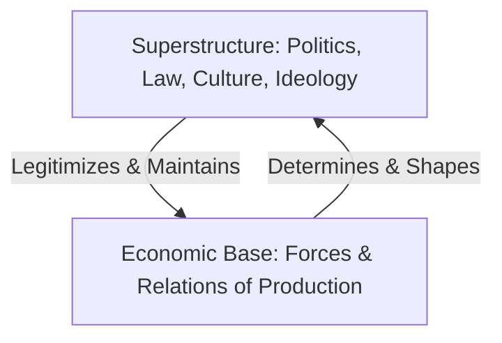

### (a)

#### The Marxian View of Class Relations and Historical Materialistic Interpretation

The Marxian interpretation of society is built upon the foundation of **Historical Materialism**, a methodological approach that asserts that the economic structure of society—specifically the mode of production—forms the real foundation or "base" upon which legal, political, and ideological "superstructures" are built. According to Karl Marx, the driving force of human history is not the evolution of ideas or spirituality, but the changes in material conditions and how humans produce their means of life.

The system is conceptualized through two distinct layers:

1. **The Base:** Comprises the **forces of production** (tools, technology, raw materials, human labor) and the **relations of production** (the social and property relationships governing ownership of assets).
2. **The Superstructure:** Comprises the political systems, laws, religion, culture, and ideologies that serve to legitimize the power of the ruling class.

Within the capitalist mode of production, the relations of production give rise to an inherently antagonistic class structure consisting of two primary classes:

- **The Bourgeoisie (Capitalists):** Owners of the means of production who do not work themselves but purchase the labor power of others to generate wealth.
- **The Proletariat (Wage Laborers):** The working class who do not own any means of production and, therefore, must sell their labor power to the capitalists in exchange for wages to survive.

Marx views these class relations as dialectical and exploitative. Because the bourgeoisie owns the factories and machinery, they hold structural power over workers. The relationship is characterized by continuous conflict (**class struggle**) because the economic interests of the two groups are diametrically opposed: capitalists aim to minimize wages and maximize the length of the working day to maximize profits, whereas workers seek higher wages, shorter hours, and safer working conditions. Marx concluded that this internal contradiction is the ultimate motor of historical progress, leading inevitably to the revolutionary overthrow of the capitalist structure.

### (b)

#### Surplus Value and Capital Accumulation Schemes

##### Definition of Surplus Value

In Marxist economic theory, **Surplus Value** ($s$) is the value created by workers in excess of the cost of their own labor power (which is paid to them as wages). Marx argues that the value of any commodity is determined by the socially necessary labor time required to produce it.

The capitalist pays the worker the value of their labor power—the wage—which corresponds to the variable capital ($v$). This wage covers the cost of necessities required for the worker to subsist and reproduce their labor capacity. However, during the working day, the worker produces more value than the value of their wage.

If a worker reproduces the value of their wage in 4 hours (necessary labor time), but is contracted to work for 8 hours, the value produced in the remaining 4 hours constitutes **surplus value** ($s$), which is appropriated entirely by the capitalist without compensation. The total value of a commodity ($W$) is expressed as:

$W = c + v + s$

Where:

- $c$ = Constant Capital (value of machinery, raw materials, and factories used up)
- $v$ = Variable Capital (wages paid to labor)
- $s$ = Surplus Value (unpaid surplus labor converted into profit)

##### Capital Accumulation: Simple vs. Expanded Reproduction

Marx explains the reproduction of capital through two distinct theoretical schemes:

> [!abstract] Simple Reproduction Scheme
> Simple reproduction refers to an economy that reproduces itself on an unchanged scale year after year. Here, the capitalist does not accumulate capital. Instead, the entire surplus value ($s$) extracted during the production cycle is consumed by the capitalist as revenue for personal luxury and consumption goods ($s_k$).
> The economic cycle repeats exactly with the same amount of constant ($c$) and variable ($v$) capital:
> $W = c + v + s \xrightarrow{\text{All } s \text{ Consumed}} \text{Next Cycle: } W = c + v + s$

> [!abstract] Expanded Reproduction Scheme
> Expanded reproduction constitutes the core mechanism of capital accumulation. Under pressure from competition, capitalists cannot afford to consume all surplus value. Instead, they divide surplus value into two parts: a portion for personal consumption ($s_k$) and a portion designated for accumulation ($s_a$).
> The accumulated portion ($s_a$) is reinvested into production by purchasing additional constant capital ($\Delta c$) and hiring more workers by expanding variable capital ($\Delta v$):
> $s = s_k + s_a = s_k + (\Delta c + \Delta v)$
> In the subsequent production cycle, the scale of production is expanded:
> $W' = (c + \Delta c) + (v + \Delta v) + s'$

##### Scheme Relationship (Two-Department Model)

To demonstrate how macroeconomic balance is maintained, Marx divides the total production of the economy into two main departments:

- **Department I:** Production of Means of Production (Capital goods, machinery, raw materials).
- **Department II:** Production of Articles of Consumption (Consumer goods, food, clothing).

For **Simple Reproduction**, the total demand for capital goods must equal the total supply of capital goods. Therefore, Department I's value must balance with Department II's replacement needs:

$I(v + s) = IIc$

For **Expanded Reproduction**, Department I must produce a surplus of capital goods that exceeds the replacement depreciation of both departments, meaning:

$I(v + s) > IIc$

When accumulation occurs, the exact equilibrium relationship between the departments shifts to include the newly accumulated portions of constant and variable capital:

$I(v + \Delta v + s_k) = II(c + \Delta c)$

This formula dictates that the value of consumption goods demanded by workers and capitalists in Department I must precisely equal the constant capital required for expansion in Department II.

### (c)

#### Downfall of Capitalism and Graphical Representation

Marx strongly asserted that capitalism contains internal structural contradictions (**the seeds of its own destruction**) that make its eventual collapse and transformation into socialism inevitable. The core mechanisms driving this downfall include:

1. **The Tendency of the Rate of Profit to Fall (TRPF):** Competition forces capitalists to continuously innovate and invest in labor-saving machinery to increase labor productivity. This increases the **Organic Composition of Capital** ($O = c/v$). However, because surplus value ($s$) can only be extracted from living human labor ($v$) and not from dead labor (machines, $c$), the substitution of labor with machinery causes the long-run rate of profit to fall.
2. **Immiseration of the Proletariat:** As machines replace workers, a large "industrial reserve army" of unemployed laborers is created, pushing wages down and worsening working-class poverty.
3. **Crises of Overproduction:** Capitalists continuously expand production capacity while simultaneously driving down worker wages. This creates an economic crisis where the masses lack the purchasing power (**underconsumption**) to buy the goods produced, leading to systemic recessions, bankruptcies, and the destruction of productive forces.

##### Graphical Representation of the Tendency of the Rate of Profit to Fall

The long-run decline in capitalist profitability and its path toward collapse can be graphically modeled. The rate of profit ($p$) is mathematically determined by dividing surplus value by total capital:

$p = \frac{s}{c+v} = \frac{s/v}{(c/v) + 1}$

Where $s/v$ is the rate of exploitation, and $c/v$ is the organic composition of capital. As $c/v$ approaches infinity due to automation, $p$ trends downward toward zero.

![[4th-semester/bcc-210/solutions/graphs/rate-of-profit.svg]]

The diagram illustrates that over time, as capital accumulation increases and technology displaces human labor, the rate of profit experiences a secular decline from $p_1$ to $p_3$. While capitalists introduce counter-tendencies (e.g., expanding foreign trade, intensifying exploitation), the system ultimately hits a structural boundary where production is no longer profitable, inducing massive cyclical crises that pave the way for a proletarian revolution.
