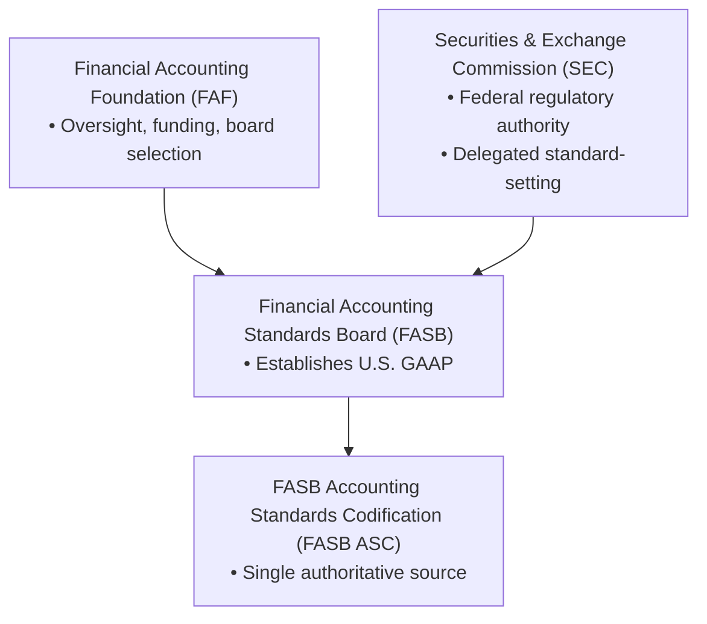
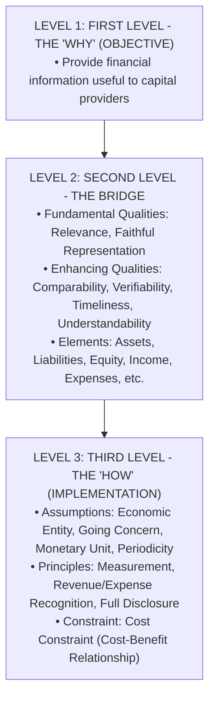
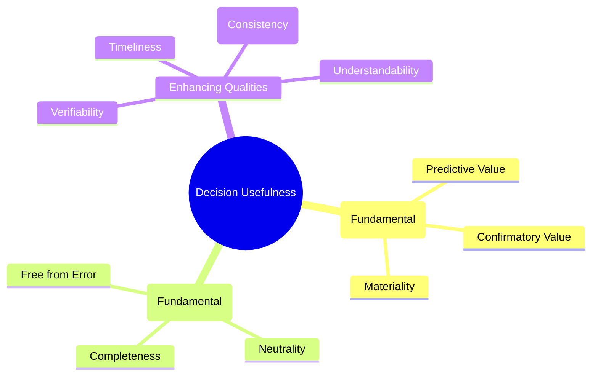
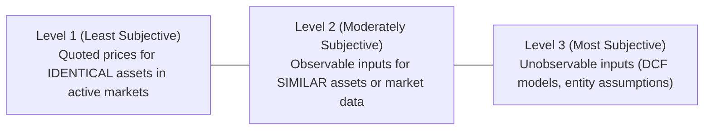

# The Core Framework

> [!abstract] Curriculum & Syllabus Context
>
> - **Course:** ACC 301 Intermediate Accounting
> - **Phase:** Phase 1: Conceptual & Procedural Foundations
> - **Target Reading:** Weygandt, Kieso, and Warfield, *Intermediate Accounting*, 18th Edition — **Chapter 1: The Environment and Conceptual Framework of Financial Reporting**
> - **Syllabus Focus:** Financial reporting environment, capital allocation, SEC and FASB due process, FASB ASC, objective of reporting, qualitative characteristics (relevance, faithful representation), elements of financial statements, basic assumptions, accounting principles, and the cost constraint.

---

### 1. The Financial Reporting Environment & Decision-Usefulness
#### 1.1 Objective of General-Purpose Financial Reporting
> [!info] Key Definition
>
> The foundational objective of general-purpose financial reporting is to **provide financial information about the reporting entity that is useful to present and potential equity investors, lenders, and other creditors in making decisions about providing resources to the entity**.

* **Capital Allocation Process**: Capital allocation is the mechanism by which financial resources are directed toward competing business entities and interests.
  * Efficient capital allocation promotes economic productivity, fosters innovation, and maintains liquid securities markets.
  * Unreliable or irrelevant accounting information leads to capital misallocation, raising the cost of capital and impairing overall economic health.
* **Primary User Group**: Present and potential capital providers (investors, lenders, and creditors).
* **Decision-Usefulness**: Financial statements must enable users to assess:
  1. The entity's ability to generate net cash inflows.
  2. Management's stewardship in protecting and enhancing entity resources.

---
#### 1.2 The Need for Accounting Standards $GAAP$
Without standardized rules, every corporation would adopt custom financial reporting conventions, rendering cross-company comparisons impossible.
* **Generally Accepted Accounting Principles $GAAP$**: A common set of accounting standards, protocols, and industry practices established by authoritative rulemaking bodies or universally adopted over time.
* **Comparability & Economic Impact**: Standardized reporting reduces information asymmetry. Empirical financial studies indicate that when accounting comparability is high, capital markets value $\$1.00$ of higher reported earnings per share $EPS$ at $\$6.76$, compared to only $\$4.04$ when comparability is low.

---
#### 1.3 Major Standard-Setting Organizations

##### 1. Securities and Exchange Commission $SEC$
* **Origin & Statutory Authority**: Established by the U.S. Congress under the **Securities Exchange Act of 1934** following the 1929 stock market crash.
* **Mandate**: Exercises federal regulatory oversight over approximately 12,000 publicly traded companies.
* **Public/Private Partnership**: The SEC possesses broad statutory authority to prescribe accounting standards for public companies but historically delegated the formulation of GAAP to private-sector standard-setting bodies (currently the FASB).
* **Enforcement Powers**:
  * *Deficiency Letter*: Issued when reporting irregularities or inadequate disclosures are identified.
  * *Stop Order*: Prevents a registrant from issuing or trading securities on public exchanges.
  * Criminal referrals to the U.S. Department of Justice for fraudulent reporting.
##### 2. Financial Accounting Standards Board $FASB$
* **Structure & Governance**: Established in 1973 as an independent private-sector board.
  * **Financial Accounting Foundation $FAF$**: Selects FASB members, secures funding, and exercises general oversight.
  * **Financial Accounting Standards Advisory Council $FASAC$**: Consults on major technical issues, project priorities, and task force selections.
  * **Private Company Council $PCC$**: Advises FASB on private company alternatives under the *Private Company Decision-Making Framework*.
* **Due Process System**: To ensure responsiveness and transparency, FASB follows a strict 5-step due process before issuing pronouncements:
  1. *Topic Identification*: Placed on FASB's technical agenda.
  2. *Research & Preliminary Views*: Staff conducts research; preliminary pros/cons published.
  3. *Public Hearing*: Formal public feedback gathered.
  4. *Exposure Draft*: Proposed standard released for public comment.
  5. *Accounting Standards Update $ASU$*: Evaluates feedback, modifies proposal, and issues final ASU (requires affirmative vote of 4 out of 7 Board members).
* **Pronouncements**:
  * *Accounting Standards Updates (ASUs)*: Amend the FASB Codification; establish authoritative GAAP.
  * *Statements of Financial Accounting Concepts $SFAC$*: Formulate the conceptual framework; **do not** establish authoritative GAAP.
##### 3. FASB Accounting Standards Codification (FASB ASC)
* **Purpose**: Single authoritative source of non-governmental U.S. GAAP (integrates and synthesizes all prior GAAP documents, eliminating levels of GAAP hierarchy).
* **Codification Research System $CRS$**: Online database structured topically.
* **Numerical Citation System**: $\text{Topic}-\text{Subtopic}-\text{Section}-\text{Paragraph}$
  * *Example*: $\text{FASB ASC } 310-10-35-47$ refers to **Receivables** (Topic 310), **Overall** (Subtopic 10), **Subsequent Measurement** (Section 35), **Paragraph 47**.
  * *SEC Content*: Designated with an "S" preceding the section number (e.g., $\text{S99}$).
##### 4. International & Historical Standard-Setters
* **American Institute of Certified Public Accountants $AICPA$**: National professional organization; previously issued accounting standards via the Committee on Accounting Procedure (CAP: Accounting Research Bulletins) and the Accounting Principles Board (APB: APB Opinions).
* **International Accounting Standards Board $IASB$**: Independent body issuing **International Financial Reporting Standards $IFRS$** used in over 120 jurisdictions.

---
#### 1.4 Financial Reporting Challenges & Governance
* **User Group Pressures (Politics in Standard-Setting)**: GAAP is a product of economic logic, empirical research, and intense political lobbying by user groups (corporations, audit firms, investment analysts, regulatory agencies).
* **The Expectations Gap**: The disparity between what the public thinks accountants and auditors should do versus what accountants believe they can realistically accomplish.
* **Sarbanes-Oxley Act $SOX$ of 2002**: Enacted following major corporate accounting scandals (Enron, WorldCom):
  1. Created the **Public Company Accounting Oversight Board $PCAOB$** to register, inspect, and discipline public audit firms.
  2. Mandates CEO and CFO personal certification of financial statements (under penalty of forfeiture of bonuses and criminal prosecution).
  3. Requires independent audit committees with financial expertise.
  4. Mandates Section 404 internal control documentation and auditor attestation.
* **Emerging Reporting Challenges**:
  * *Nonfinancial Measurements*: Customer satisfaction, backlog, carbon footprint / ESG metrics.
  * *Forward-Looking Information*: Shift toward predictive forecasts.
  * *Soft Assets*: Accounting for intellectual capital, brand equity, and technological know-how.
  * *Real-Time Timeliness*: Demand for continuous reporting versus quarterly 10-Q/annual 10-K filings.

---
### 2. The Conceptual Framework of Financial Reporting

---
#### 2.1 Level 1: Primary Objective
To provide financial information about the reporting entity that is useful to present and potential equity investors, lenders, and other creditors in making decisions about providing resources to the entity.

---
#### 2.2 Level 2: Qualitative Characteristics of Accounting Information
Qualitative characteristics establish the hierarchy that distinguishes more useful information from less useful information.

##### 1. Fundamental Quality — Relevance
Accounting information is relevant if it is capable of making a difference in a decision made by financial statement users.
* **Predictive Value**: Information serves as an input for users to form their own expectations about future financial performance or cash flows.
* **Confirmatory Value**: Information confirms or corrects prior expectations.
* **Materiality (Company-Specific Aspect of Relevance)**:
  * *Definition*: Information is material if omitting or misstating it could influence decisions that users make on the basis of reported financial information.
  * *Evaluation Standard*: Requires assessing both **quantitative magnitude** (size relative to net income/assets) and **qualitative factors** (e.g., whether an item changes a loss into a profit, affects compliance with loan covenants, or alters management compensation).
  * *Quantitative Rule of Thumb*: Items under $5\%$ of net income are frequently considered immaterial quantitatively, but qualitative factors can override this threshold.
##### 2. Fundamental Quality — Faithful Representation
Faithful representation means the reported numbers and descriptions match the underlying economic phenomena that really existed or occurred.
* **Completeness**: All information necessary for a user to understand the economic phenomenon is provided (no misleading omissions).
* **Neutrality**: Information is selected and presented without bias to favor one set of interested parties over another.
* **Free from Error**: Information is accurate in its description and process; does not imply absolute mathematical exactness, as accounting involves estimates.

> [!warning] Exam Pitfall / Exception
>
> **Exclusion of Conservatism/Prudence:** The FASB Conceptual Framework explicitly excludes conservatism (deliberate understatement of assets/income) because it introduces systematic bias, conflicting directly with neutrality.

##### 3. Enhancing Qualities
Enhancing qualitative characteristics complement fundamental qualities to distinguish more useful from less useful information.
* **Comparability**: Enables users to identify and explain real economic similarities and differences across different companies.
* **Consistency**: A specific application of comparability; a single company applies the same accounting treatment to similar economic events from period to period.
* **Verifiability**: Occurs when independent, knowledgeable measurers, using identical measurement methods, reach a high consensus of results.
* **Timeliness**: Having information available to decision-makers before it loses its capacity to influence decisions.
* **Understandability**: Quality of information that allows users with a reasonable knowledge of business and economic activities to comprehend its significance.

---
#### 2.3 Level 2: Elements of Financial Statements
SFAC No. 6 defines 10 interrelated elements categorized by timing:
##### Group A: Amounts of Resources & Claims to Resources at a Moment in Time (Balance Sheet / Articulation)
1. **Assets**: Probable future economic benefits obtained or controlled by a particular entity as a result of past transactions or events.
2. **Liabilities**: Probable future sacrifices of economic benefits arising from present obligations of a particular entity to transfer assets or provide services to other entities in the future as a result of past transactions or events.
3. **Equity (Net Assets)**: The residual interest in the assets of an entity that remains after deducting its liabilities $$\text{Equity} = \text{Assets} - \text{Liabilities}$$.
##### Group B: Transactions, Events, & Circumstances Affecting an Entity During a Period of Time (Income Statement / Equity Statement)
4. **Investments by Owners**: Increases in net assets resulting from transfers to the entity from other entities of something of value to obtain or increase ownership interests (equity).
5. **Distributions to Owners**: Decreases in net assets resulting from transferring assets, rendering services, or incurring liabilities by the enterprise to owners.
6. **Comprehensive Income**: The change in equity (net assets) of an entity during a period from transactions and other events and circumstances from nonowner sources. It includes all changes in equity except those resulting from investments by owners and distributions to owners:
> [!quote] Formula & Derivation
>
> $$ \text{Comprehensive Income} = \text{Net Income} + \text{Other Comprehensive Income (OCI)} $$

7. **Revenues**: Inflows or other enhancements of assets or settlements of liabilities (or both) during a period from delivering or producing goods, rendering services, or other activities that constitute the entity's **ongoing major or central operations**.
8. **Expenses**: Outflows or other using up of assets or incurrences of liabilities (or both) during a period from delivering or producing goods, rendering services, or carrying out other activities that constitute the entity's **ongoing major or central operations**.
9. **Gains**: Increases in equity (net assets) from **peripheral or incidental transactions** of an entity and from all other transactions affecting the entity during a period except those that result from revenues or investments by owners.
10. **Losses**: Decreases in equity (net assets) from **peripheral or incidental transactions** of an entity except those that result from expenses or distributions to owners.

---
### 3. Level 3: Recognition, Measurement, and Disclosure Concepts
#### 3.1 Basic Assumptions of Financial Accounting
1. **Economic Entity Assumption**: Economic activity can be identified with a particular unit of accountability. The financial records and activities of the business are kept strictly separate and distinct from its owners, managers, and other legal entities.
2. **Going Concern Assumption**: The business entity is assumed to have a long life and will continue in operation for the foreseeable future to fulfill its commitments.
   * *Theoretical Significance*: Justifies reporting plant assets at historical cost less accumulated depreciation rather than current liquidation values.
> [!warning] Exam Pitfall / Exception
>
> **Liquidation Exception:** If liquidation is imminent, financial statements must be prepared on a **liquidation basis of accounting** (assets measured at net realizable liquidation value) rather than historical cost.

3. **Monetary Unit Assumption**: Money is the common denominator of economic activity and provides an appropriate basis for accounting measurement and analysis.
   * *Unadjusted Dollar Assumption*: In the U.S., GAAP assumes the purchasing power of the monetary unit remains stable over time, ignoring price-level changes (inflation and deflation).
4. **Periodicity (Time Period) Assumption**: The economic activities of a company can be divided into artificial time periods (monthly, quarterly, annually).
   * *Trade-off*: Introduces a direct trade-off between **timeliness** (providing frequent short-term reports) and **accuracy/faithful representation** (requiring complex accruals, estimates, and deferrals).

---
#### 3.2 Basic Principles of Accounting
##### 1. Measurement Principle (Mixed-Attribute Measurement Model)
GAAP permits multiple measurement attributes depending on decision-usefulness.
* **Historical Cost Principle**: Assets and liabilities are accounted for and reported on the basis of acquisition price.
  * *Advantage*: Verifiable, objective benchmark grounded in arm's-length exchange transactions.
* **Fair Value Principle**: "The price that would be received to sell an asset or paid to transfer a liability in an orderly transaction between market participants at the measurement date".

##### 2. Revenue Recognition Principle
Requires that companies recognize revenue in the accounting period in which the **performance obligation is satisfied** (5-Step Model under FASB ASC 606):
1. Identify the contract with a customer.
2. Identify the separate performance obligations in the contract.
3. Determine the transaction price.
4. Allocate the transaction price to the separate performance obligations.
5. Recognize revenue when (or as) the entity satisfies a performance obligation.
##### 3. Expense Recognition Principle (Matching Principle)
Expenses are defined as outflows or using up of assets or incurrences of liabilities.
* **Core Rule**: "Let the expense follow the revenues". Expenses are recognized in the same period as the revenues that they help generate.

| Type of Cost | Relationship to Revenue | Accounting Treatment |
| :--- | :--- | :--- |
| **Product Costs** (Materials/Labor) | Direct cause-and-effect link | Capitalize as Inventory; Expense when sold $COGS$ |
| **Period Costs** (Salaries/Rent) | No direct relationship | Expense as incurred in the current period |
| **Allocated Costs** (Depreciation) | Benefit spans multiple periods | Systematic & rational expense over service life |

##### 4. Full Disclosure Principle
Recognizes that the nature and amount of information included in financial reports reflects a judgmental trade-off between:
1. Providing sufficient detail to disclose matters that make a difference to users.
2. Maintaining sufficient condensation to make the information understandable and cost-effective.
* **Disclosure Venues**:
  1. *Main Body of Financial Statements* (Balance Sheet, Income Statement, Cash Flows, Equity).
  2. *Notes to Financial Statements* (Amplify/explain figures, accounting policies, contingencies).
  3. *Supplementary Information* (High relevance, lower representation; e.g., oil & gas reserve evaluations).

---
#### 3.3 The Cost Constraint (Cost-Benefit Relationship)
In providing decision-useful information, the **costs of providing financial information must be weighed against the benefits derived from using it**. Rulemaking bodies conduct extensive cost-benefit analyses before mandating new disclosures or measurement standards.

---
### 4. Mathematical & Numerical Problem Walkthroughs
> [!example] Numerical Problem: Materiality Assessment — Quantitative vs. Qualitative
>
> **Problem Statement:**
> Analyze the relative materiality of an unusual gain of $\$20,000$ for Company A versus an unusual gain of $\$5,000$ for Company B given the following operating data:
> $$ \begin{array}{lrr}
> \text{Financial Line Item} & \text{Company A} & \text{Company B} \\
> \hline
> \text{Sales Revenue} & \$10,000,000 & \$100,000 \\
> \text{Operating Costs \& Expenses} & 9,000,000 & 90,000 \\
> \hline
> \textbf{Income from Operations} & \textbf{\$1,000,000} & \textbf{\$10,000} \\
> \hline \hline
> \text{Unusual Gain} & \$20,000 & \$5,000 \\
> \end{array} $$
> **Step-by-Step Derivation & Calculations:**
> 1. **Compute Operating Income**:
>    $$ \text{Income}_{\text{Co A}} = \$10,000,000 - \$9,000,000 = \$1,000,000 $$
>    $$ \text{Income}_{\text{Co B}} = \$100,000 - \$90,000 = \$10,000 $$
> 2. **Compute Relative Percentage of Unusual Gain to Operating Income**:
>    $$ \text{Materiality Ratio}_{\text{Co A}} = \frac{\$20,000}{\$1,000,000} = 0.02 = 2.0\% $$
>    $$ \text{Materiality Ratio}_{\text{Co B}} = \frac{\$5,000}{\$10,000} = 0.50 = 50.0\% $$
> 3. **Synthesis & Conclusion**:
>    * *Company A*: The $\$20,000$ gain represents only $2.0\%$ of operating income. Quantitatively, it is immaterial and would not influence resource allocation decisions of capital providers.
>    * *Company B*: The $\$5,000$ gain represents $50.0\%$ of operating income. Quantitatively and qualitatively, it is highly material as it dramatically alters the earnings baseline of the enterprise.

> [!example] Numerical Problem: Fair Value Hierarchy Classification
>
> **Problem Statement:**
> Vande Velde Company made three investments during 2025:
> 4. Purchased 1,000 shares of Sastre Company (a start-up entity) based on valuation estimates from an internally developed discounted cash flow model.
> 5. Purchased 2,000 shares of General Electric $GE$ common stock trading on the New York Stock Exchange $NYSE$.
> 6. Invested $\$10,000$ in local development authority bonds. The bonds do not trade in an active market, but their value closely tracks movements in benchmark U.S. Treasury bonds.
> **Step-by-Step Analysis & Classification:**
> 7. **Sastre Company Stock**:
>    * *Input Assessment*: Uses an internally generated DCF valuation model with unobservable management assumptions.
>    * *Classification*: **Level 3 (Most Subjective)**.
> 8. **General Electric Common Stock**:
>    * *Input Assessment*: Active market quoted closing prices for identical shares on the NYSE.
>    * *Classification*: **Level 1 (Least Subjective)**.
> 9. **Local Development Authority Bonds**:
>    * *Input Assessment*: Inputs are observable directly or indirectly through yield curves and benchmark tracking of identical/similar U.S. Treasury bonds.
>    * *Classification*: **Level 2 (Moderately Subjective)**.

---
### 5. Summary Comparison: U.S. GAAP vs. IFRS (IFRS Insights)

| Feature / Dimension | U.S. GAAP $FASB$ | IFRS $IASB$ |
| :--- | :--- | :--- |
| **Rule Orientation** | Rules-based (more detailed, specific prescriptive guidelines). | Principles-based (simpler, more flexible general frameworks). |
| **Conceptual Framework Status** | Non-authoritative (SFACs pass through due process but do not override ASUs in Codification). | Authoritative guidance when no specific standard applies. |
| **Stewardship Focus** | Implicit within decision-usefulness to capital providers. | Explicitly emphasized alongside future cash flow prediction. |
| **Prudence / Conservatism** | Omitted from qualitative characteristics to preserve neutrality. | Re-introduced in 2018 framework to support neutrality under uncertainty. |
| **Asset Valuation** | Historical cost required for PP&E and intangibles (fair value limited to specific financial assets). | Allows revaluation model for PP&E, natural resources, and certain intangibles. |
| **Accrual Assumption** | Operating assumption across framework. | Explicit overarching assumption in the framework. |
| **Reporting Entity** | Aligned primarily with legal entity definitions. | Defined as circumscribed area of business activity (does not require legal entity status). |

