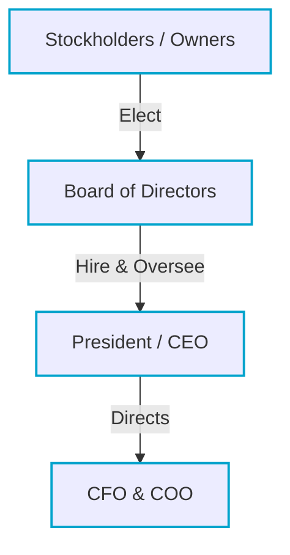
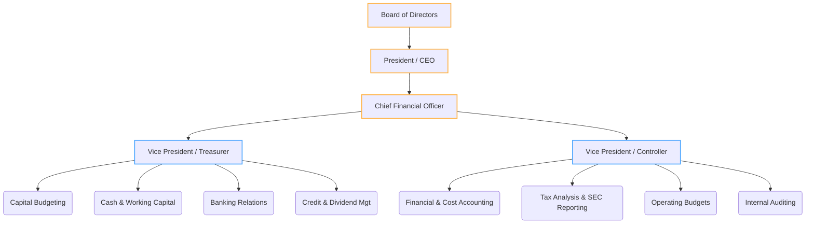
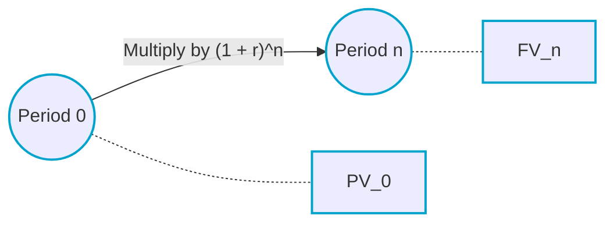
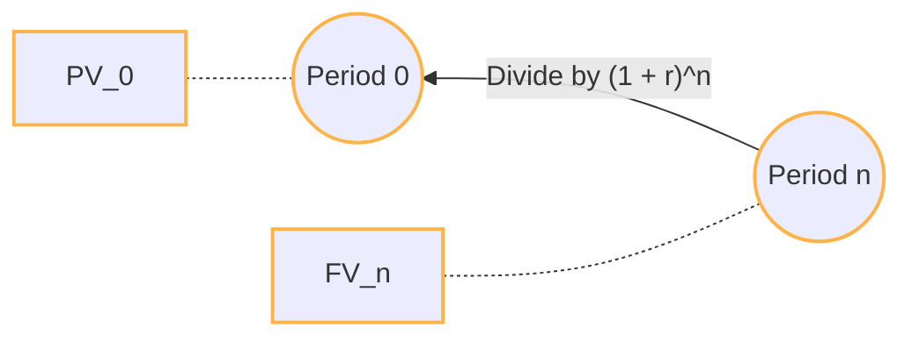

# Foundations of Financial Management & The Time Value of Money

> [!abstract] Curriculum & Syllabus Context
>
> - **Course:** ACC 302 Financial Management
> - **Phase:** Phase 1: Foundations of Financial Management & The Core Mathematical Tool
> - **Target Reading:** Smart & Zutter (16e) Chapters 1 & 5; Van Horne (13e) Chapters 1 & 3
> - **Syllabus Focus:** Scope of financial management, investment/financing/asset management decisions, shareholder wealth maximization vs profit/EPS maximization, agency conflicts and corporate governance, simple vs compound interest, annuities, perpetuities, intra-year compounding, and loan amortization.

---

### Learning Objective 1.1: Scope of Financial Management and Core Decision Functions

#### 1. Definition and Nature of Finance
> [!info] Key Definition: Finance
>
> Finance is defined as the **science and art of managing money**.

* **Personal Context:** Finance addresses individual decisions regarding how much earnings to spend, how much to save, and how to invest accumulated savings across assets of varying risk and return profiles.
* **Business Context:** Business finance (managerial finance) involves the identical core logic applied at the firm level: how businesses raise capital from external investors, how they allocate and invest that capital in operational and long-term productive assets to create value, and how they decide whether to retain and reinvest operating cash flows or distribute them back to debt and equity investors.
* **Definition of a Firm:** A firm is a risky business organization that functions as an economic intermediary. It pools investment capital from investors and manages risky productive investment opportunities on behalf of investors who cannot manage those assets as effectively or efficiently on an individual basis.

#### 2. Three Interrelated Areas of Finance
1. **Money and Capital Markets:** Focuses on the financial markets, financial instruments (stocks, bonds, mortgages, commercial paper), and financial institutions (banks, insurance companies, investment banks) that facilitate the transfer of funds between net savers and net demanders of capital.
2. **Investments:** Focuses on decision-making by individual and institutional investors when selecting financial assets for investment portfolios. Key activities include:
   * Security analysis (establishing intrinsic valuation of individual securities).
   * Portfolio theory (determining the optimal mix of assets to minimize risk for a given expected return).
   * Market analysis (evaluating market efficiency and behavioral finance dynamics).
3. **Financial Management (Business Finance):** The broadest of the three areas with the greatest number of career opportunities. It involves managing the internal financial operations and strategic decisions of all types of organizations—including industrial corporations, retail enterprises, financial institutions, private firms, and public/non-profit entities.

#### 3. Three Major Decision Functions of Financial Management (Balance Sheet Mapping)
The decision-making duties of the financial manager map directly onto the corporate Balance Sheet:

> [!quote] Formula & Derivation: Balance Sheet Mapping
>
> $$\text{Balance Sheet: } \underbrace{\text{Assets (Left-Hand Side)}}_{\text{Investment \& Asset Management Decisions}} = \underbrace{\text{Liabilities + Equity (Right-Hand Side)}}_{\text{Financing Decision}}$$

1. **The Investment Decision (Left-Hand Side of the Balance Sheet):**
   * Considered the **most critical decision** for corporate value creation.
   * Begins by determining the overall **dollar size** of the firm (the total asset base above the double lines on the left side of the balance sheet).
   * Dictates the **composition of assets**: the proportion of total capital allocated to short-term current assets (cash, marketable securities, inventory, accounts receivable) versus long-term fixed assets (property, plant, equipment, technology).
   * Encompasses **Capital Budgeting**—the formal process of evaluating and selecting long-term capital projects whose benefits extend beyond one year.
   * Includes **Disinvestment / Capital Asset Rationalization**: identifying and liquidating or replacing unproductive assets that no longer meet required economic returns.

2. **The Financing Decision (Right-Hand Side of the Balance Sheet):**
   * Focuses on determining the **capital structure**—the specific mix or proportions of short-term debt, long-term debt, preferred stock, and common equity used to fund the firm's total asset base.
   * Analyzes the trade-offs between debt financing (fixed contractual interest obligations, tax-deductible interest, higher financial leverage risk) and equity financing (residual claim, higher required return, no tax deduction).
   * **Dividend Policy** is an integral component of the financing decision: the **dividend payout ratio** determines how much net income is distributed as cash dividends versus retained as internal equity financing.
     > [!quote] Formula & Derivation: Dividend Policy
     > $$\text{Payout Ratio} = \frac{\text{Dividends}}{\text{Net Income}}$$
     > $$\text{Retention Ratio } (b) = 1 - \text{Payout Ratio}$$
   * Involves the physical acquisition of funds: negotiating short-term bank loans, issuing commercial paper, structuring long-term leases, or underwriting public bond and stock offerings.

3. **The Asset Management Decision (Operational Efficiency):**
   * Focuses on managing existing assets efficiently after they have been acquired and financed.
   * Financial managers hold primary direct operating responsibility for **current asset management** (cash balances, credit terms, accounts receivable collections, and marketable securities portfolios) and spontaneous current liabilities.
   * **Fixed Asset Management** is shared between financial managers and operational plant managers who physically deploy heavy equipment and facilities.

---

### Learning Objective 1.2: The Goal of the Firm — Shareholder Wealth Maximization vs. Profit Maximization

#### 1. Primary Goal of the Firm: Shareholder Wealth Maximization
In financial management, the primary objective of corporate decision-making is to **maximize the wealth of the firm's present owners (shareholders)**.
* **Metric of Success:** In a publicly traded corporation, shareholder wealth is represented directly by the **current market price per share of the firm's common stock**.
* Every corporate action, investment project, capital structure change, or working capital adjustment must be evaluated based on its net effect on the market price per share.

#### 2. Intrinsic Value vs. Current Market Price
* **Intrinsic Value:** An unbiased estimate of a stock's true, long-run value based on complete, accurate risk and expected cash flow data. It cannot be observed directly in real time; it is estimated using valuation models.
* **Market Price:** The actual trading price established in public stock exchanges based on perceived investor cash flows and perceived risk.
* **Market Equilibrium:** Occurs when a stock's market price equals its intrinsic value ($P_0 = \text{Intrinsic Value}$). Management's primary long-term goal is to take actions that maximize the stock's **intrinsic value**, ensuring that as full information is communicated to the market, long-term share prices reach their highest achievable sustainable level.

#### 3. Critique: Why Profit Maximization / EPS Maximization Fails
Corporations report accounting profits in terms of **Earnings Per Share $EPS$**:

> [!quote] Formula & Derivation: Earnings Per Share $EPS$
>
> $$\text{EPS} = \frac{\text{Total Earnings Available for Common Stockholders}}{\text{Number of Common Shares Outstanding}}$$

> [!warning] Key Exam Pitfall: Profit Maximization
>
> Relying on Profit / EPS Maximization as the core corporate goal is fundamentally flawed for four major reasons:
> 1. **Timing of Cash Flows (Time Value of Money):** Accounting profit ignores when cash flows are received. 
> 2. **Cash Flows vs. Accounting Profits:** Firms pay bills using **realized cash flows**, not accrual accounting profits.
> 3. **Risk and Uncertainty:** EPS maximization ignores the return-risk trade-off.
> 4. **Dividend Policy Impact:** If EPS maximization were the goal, a firm would **never pay a cash dividend**, retaining 100% of earnings to artificially inflate EPS.

#### 4. Corporate Social Responsibility $CSR$, Business Ethics, and Stakeholders
* **Stakeholders:** All constituencies with a direct or indirect economic link to the firm, including stockholders, debtholders/creditors, employees, customers, suppliers, and local/global communities.
* **Enlightened Wealth Maximization:** Maximizing shareholder wealth does *not* mean ignoring society, breaking laws, or exploiting stakeholders. Unethical behavior, environmental pollution, unfair labor practices, or poor customer treatment result in severe social costs: consumer boycotts, lawsuits, worker turnover, regulatory fines, and brand destruction—all of which depress long-run cash flows and destroy stock value.
* **Business Ethics:** Standards of moral conduct in commercial dealings. High ethical standards build investor confidence, reduce litigation risk, lower required capital costs, and enhance share price.

---

### Learning Objective 1.3: Corporate Governance, Agency Relationships, and Conflict Resolution

#### 1. Corporate Governance and Corporate Structure
**Corporate Governance** is the legal and operational framework of rules, relationships, and processes by which corporations are managed, directed, and controlled.

* **Board of Directors:** The primary link between stockholders and managers. Responsible for establishing company-wide policies, approving major capital budgets and strategic M&A deals, reviewing financial statements, and hiring, firing, and setting compensation for the CEO.
  * **Inside Directors:** Senior executive officers (e.g., CEO, CFO) who also hold seats on the board.
  * **Outside / Independent Directors:** Non-employee directors (executives from other firms, major shareholders, community leaders) who provide independent oversight.
#### 2. Agency Theory and Agency Conflicts
> [!info] Key Definition: Agency Relationship & Problem
>
> An **agency relationship** exists when **principals** hire **agents** to perform a service on their behalf and delegate decision-making authority to them.
> The **Agency Problem** occurs due to the separation of ownership (shareholders) and control (managers), creating potential conflicts of interest where managers may act in their own personal self-interest.

* **Agency Costs:** The total costs borne by shareholders as a result of agency relationships, including:
  1. Direct expenditures to monitor managerial actions (e.g., external auditing fees, board oversight costs).
  2. Bonding expenditures to structure executive compensation contracts.
  3. Opportunity losses (residual loss) resulting from suboptimal managerial decisions or missed positive-NPV projects.
#### 3. Conflict 1: Stockholders vs. Managers
* **Managerial Self-Interest:** Managers may seek to maximize their personal wealth, job security, corporate perquisites ("perks"), or firm size (building corporate empires through unprofitable acquisitions).
* **Mechanisms for Aligning Managerial and Shareholder Interests:**
  1. **Structured Managerial Compensation:** Performance Shares, Executive Stock Options, and Restricted Stock.
  2. **Direct Shareholder Intervention:** Large institutional investors hold significant voting blocks and actively lobby management.
  3. **Threat of Firing:** The board of directors can fire underperforming executive management.
  4. **Threat of Hostile Takeover / Corporate Raiders:** If undervalued due to poor management, raiders can launch a tender offer to acquire a controlling stock interest and replace management.
#### 4. Conflict 2: Stockholders vs. Debtholders (Creditors)
* **Contractual Disparity:** Debtholders receive fixed payments; stockholders hold residual claims and benefit from upside gains.
* **Major Conflict Sources:**
  1. **Asset Substitution / Risk Shifting:** Stockholders have an incentive to induce management to undertake high-risk, high-return projects.
  2. **Over-issuance of Additional Debt:** Dilutes the safety margin and recovery value of existing bondholders.
* **Debtholder Protection:** Lenders impose restrictive **protective covenants** in bond indentures and charge higher interest rates (risk premiums) if they suspect risk-shifting.
#### 5. Regulatory Environment
* **Sarbanes-Oxley Act of 2002 $SOX$:** Requires CEOs and CFOs to personally certify the accuracy of public financial statements, establishes the PCAOB, and enforces strict internal financial controls.
* **Dodd-Frank Wall Street Reform Act $2010$:** Mandates "say-on-pay" advisory votes for shareholders on executive compensation and grants the SEC authority to regulate proxy access.

---
### Learning Objective 1.4: Organizational Forms of Business and Financial Functions
#### 1. Legal Forms of Business Organization
1. **Sole Proprietorship:**
   * Owned by one individual. Represents the majority of total business numbers (~70–75%).
   * *Advantages:* Simple and inexpensive, minimal regulations, owner retains all profits and control, taxed once as personal income.
   * *Disadvantages:* **Unlimited personal liability**, limited ability to raise capital, limited life.
2. **Partnership (General vs. Limited):**
   * *General Partnership:* All partners have unlimited personal liability.
   * *Limited Partnership $LP$:* General partners have unlimited liability; limited partners' liability is strictly capped at their invested capital.
   * *Taxation:* Pass-through taxation.
3. **Corporation (C Corporation):**
   * A legal entity separate and distinct from its owners and managers. Conducts over 80–85% of total business revenue.
   * *Advantages:* **Limited liability**, **unlimited life**, easy transferability of ownership, superior capital-raising ability.
   * *Disadvantages:* **Double taxation** (corporate level and personal dividend level), complex legal setup, extensive regulatory reporting $SEC$.
4. **Hybrid Forms (S Corporation, LLC, LLP):**
   * Provide corporate limited liability for all owners while retaining partnership pass-through tax status.
#### 2. Financial Markets and Capital Transfer Mechanisms
Capital is transferred between net savers (households) and net demanders of funds (corporations) through three primary channels:
1. **Direct Transfers:** Business sells securities directly to savers.
2. **Indirect Transfers via Investment Banks:** Underwriters purchase new security issues and resell them to public investors in a **primary market transaction**.
3. **Indirect Transfers via Financial Intermediaries:** Banks and funds collect deposits from savers and allocate capital to businesses.
##### Market Classifications:
* **Money Markets vs. Capital Markets:** Money markets deal in short-term, highly liquid debt (< 1 year). Capital markets deal in intermediate and long-term debt and equity.
* **Primary vs. Secondary Markets:** Primary markets are where *new capital* is raised. Secondary markets are where existing securities are traded among investors (NYSE, Nasdaq).
* **Spot vs. Futures Markets:** Immediate "on-the-spot" delivery vs. contracts for future settlement.
* **Private vs. Public Markets:** Customized direct negotiations vs. standardized contracts on organized exchanges.
#### 3. Organization of the Financial Management Function

#### 4. Finance vs. Economics and Accounting
* **Finance vs. Economics:** The primary economic principle used is **Marginal Cost-Benefit Analysis** ($\Delta \text{Benefits} > \Delta \text{Costs}$).
* **Finance vs. Accounting:** Accountants use the **accrual basis**; financial managers focus on **cash basis thinking** to maintain solvency and assess risk for valuation.

---
### Learning Objective 1.5: Foundations of Time Value of Money $TVM$ and Single Amounts
#### 1. Role of TVM in Financial Decision-Making
> [!info] Key Definition: Time Value of Money $TVM$
>
> A dollar received today is worth more than a dollar to be received in the future because cash held today can be invested to earn interest.
> **Opportunity Cost:** The rate of return ($r$ or $i$) that could be earned on an alternative investment of similar risk.

#### 2. Simple Interest vs. Compound Interest
* **Simple Interest ($SI$):** Interest paid or earned strictly on the original principal amount ($PV_0$).
  $$SI = PV_0 \times r \times n$$
  $$FV_n = PV_0 + SI = PV_0 \times [1 + (r \times n)]$$
* **Compound Interest:** Interest earned on both the original principal balance and on all accumulated interest from prior periods. Creates exponential growth.

#### 3. Future Value ($FV_n$) of a Single Amount (Compounding)
**Compounding** is the arithmetic process of going from a present value ($PV_0$) to a future value ($FV_n$).

> [!quote] Formula & Derivation: Future Value
>
> * End of Period 1: $FV_1 = PV_0(1 + r)$
> * End of Period 2: $FV_2 = PV_0(1 + r)^2$
> * **General Future Value Equation:**
> $$FV_n = PV_0 (1 + r)^n$$

#### 4. Present Value ($PV_0$) of a Single Amount (Discounting)
**Discounting** is the arithmetic process of finding the present value ($PV_0$) of a future cash flow ($FV_n$). It is the inverse of compounding.

> [!quote] Formula & Derivation: Present Value
>
> $$PV_0 = \frac{FV_n}{(1 + r)^n} = FV_n \times (1 + r)^{-n}$$

##### Key Dynamics of Present Value:
1. As time ($n$) extends further into the future, $PV_0$ **decreases** and approaches zero.
2. As the discount rate ($r$) increases, $PV_0$ **decreases** at an accelerating rate.

#### 5. The Rule of 72 (Mental Shortcut)
Provides a rapid approximation of the time ($n$) or interest rate ($r$) required for an initial sum to double in value:
$$n \approx \frac{72}{r \text{ (in \%)}} \quad \text{or} \quad r \text{ (in \%)} \approx \frac{72}{n}$$

---

### Learning Objective 1.6: Annuities and Perpetuities

#### 1. Definition and Classification of Annuities
> [!info] Key Definition: Annuities
>
> An **Annuity** is a stream of equal periodic cash flows ($PMT$ or $R$) occurring at fixed intervals over a specified duration of $n$ periods.
> * **Ordinary (Deferred) Annuity:** Cash flows occur at the **end** of each period.
> * **Annuity Due:** Cash flows occur at the **beginning** of each period.

#### 2. Mathematical Relationship
Because every payment in an annuity due occurs one period earlier, it earns interest for one additional period:
$$FV_{\text{Annuity Due}} = FV_{\text{Ordinary Annuity}} \times (1 + r)$$
$$PV_{\text{Annuity Due}} = PV_{\text{Ordinary Annuity}} \times (1 + r)$$

#### 3. Future Value of an Ordinary Annuity ($FV_{OA}$)
Calculates the accumulated terminal sum at time $n$ of equal end-of-period deposits.

> [!quote] Formula & Derivation: FV of Ordinary Annuity
>
> $$FV_{OA} = PMT \times \left[ \frac{(1 + r)^n - 1}{r} \right]$$

#### 4. Present Value of an Ordinary Annuity ($PV_{OA}$)
Calculates the current lump-sum equivalent at time 0 of a series of equal end-of-period cash flows.

> [!quote] Formula & Derivation: PV of Ordinary Annuity
>
> $$PV_{OA} = PMT \times \left[ \frac{1 - (1 + r)^{-n}}{r} \right]$$

#### 5. Perpetuities
A **Perpetuity** is an ordinary annuity whose equal periodic payments continue indefinitely ($n \to \infty$).

> [!quote] Formula & Derivation: Perpetuities
>
> **Level Perpetuity:**
> $$PV_{\text{Perpetuity}} = \frac{PMT}{r}$$
> 
> **Growing Perpetuity (Constant growth $g$):**
> $$PV_{\text{Growing Perpetuity}} = \frac{CF_1}{r - g}$$

---

### Learning Objective 1.7: Mixed Streams, Intra-Year Compounding, and Amortization Schedules

#### 1. Mixed / Uneven Cash Flow Streams
* **Present Value:** Found by discounting each individual cash flow back to time 0:
  $$PV_0 = \sum_{t=1}^{n} \frac{CF_t}{(1 + r)^t} = \frac{CF_1}{(1+r)^1} + \frac{CF_2}{(1+r)^2} + \dots + \frac{CF_n}{(1+r)^n}$$
* **Future Value:** Compounding each forward to terminal period $n$:
  $$FV_n = \sum_{t=1}^{n} CF_t \times (1 + r)^{n-t}$$

#### 2. Intra-Year Compounding
When interest is credited more frequently than once a year ($m$ times):
1. **Periodic Interest Rate:** $r_{\text{per}} = \frac{r_{\text{nom}}}{m}$
2. **Total Compounding Periods:** $N = m \times n$

> [!quote] Formula & Derivation: Intra-Year TVM
>
> $$FV_n = PV_0 \times \left(1 + \frac{r_{\text{nom}}}{m}\right)^{m \times n}$$
> $$PV_0 = FV_n \times \left(1 + \frac{r_{\text{nom}}}{m}\right)^{-m \times n}$$

#### 3. Effective Annual Rate $EAR$
> [!warning] Key Exam Pitfall: Nominal vs. Effective Rates
>
> Do not use the Nominal/Stated Rate ($r_{\text{nom}}$) to compare alternative investments with different compounding frequencies. Always convert to EAR!

$$ \text{EAR} = \left(1 + \frac{r_{\text{nom}}}{m}\right)^m - 1.0 $$

#### 4. Continuous Compounding ($m \to \infty$)
Using the mathematical constant $e \approx 2.71828$:
* **Future Value:** $FV_n = PV_0 \times e^{r_{\text{nom}} \times n}$
* **Present Value:** $PV_0 = FV_n \times e^{-r_{\text{nom}} \times n}$
* **EAR:** $\text{EAR}_{\text{continuous}} = e^{r_{\text{nom}}} - 1.0$

#### 5. Loan Amortization
An **Amortized Loan** requires equal periodic installment payments ($PMT$) that cover interest charges and reduce principal to zero at maturity.

> [!quote] Formula & Derivation: Amortization Payment
>
> $$PMT = \frac{PV_0 \times r}{1 - (1 + r)^{-n}}$$

##### General Amortization Structure:

$$ \begin{array}{cccccc}
\hline
\textbf{Period } (t) & \textbf{Beginning Principal} & \textbf{Installment } (PMT) & \textbf{Interest Portion } (I_t) & \textbf{Principal Portion } (P_t) & \textbf{Ending Principal Balance} \\
\hline
1 & PV_0 & PMT & PV_0 \times r & PMT - I_1 & PV_0 - P_1 \\
2 & \text{Balance}_1 & PMT & \text{Balance}_1 \times r & PMT - I_2 & \text{Balance}_1 - P_2 \\
\hline \hline
\end{array} $$

* **Key Property:** Over time, the interest component ($I_t$) steadily **decreases**, while the principal repayment component ($P_t$) steadily **increases**.

