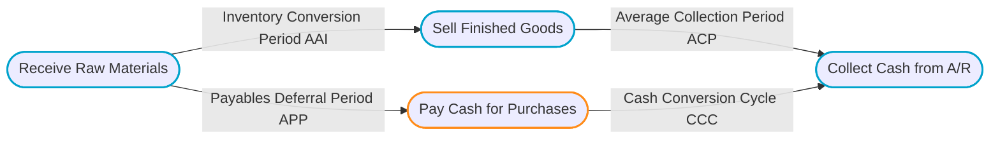

# Working Capital Management: Short-Term Operations

> [!abstract] Curriculum & Syllabus Context
>
> - **Course:** ACC 302 Financial Management
> - **Phase:** Phase 8: Working Capital Management (Short-Term Operations)
> - **Target Reading:** Smart & Zutter (16e) Chapters 15 & 16; Van Horne (13e) Chapters 8, 9, 10 & 11
> - **Syllabus Focus:** Gross vs Net Working Capital, NOWC, current asset investment policies (relaxed, restricted, moderate), financing policies (maturity matching, aggressive, conservative), Cash Conversion Cycle (AAI, ACP, APP), cash budget construction, float management, credit policy and 5 Cs, EOQ inventory model, and cost of trade credit.

---

### LO 8.1: Fundamentals of Working Capital & Terminology

#### 1. Core Concepts
> [!info] Key Definition: Working Capital
>
> * **Working Capital (Gross Working Capital):** Refers to the firm's total investment in short-term assets—specifically cash, marketable securities, accounts receivable, and inventories.
> * **Net Working Capital (NWC):** The dollar safety margin preventing cash insolvency.
> * **Net Operating Working Capital (NOWC):** The operating current assets required to support day-to-day production and sales, minus spontaneous non-interest-bearing operating current liabilities.

> [!quote] Formula & Derivation: NWC and NOWC
>
> $$\text{Net Working Capital (NWC)} = \text{Current Assets} - \text{Current Liabilities}$$
> $$\text{NOWC} = (\text{Operating Current Assets} - \text{Excess Cash}) - (\text{Operating Current Liabilities} - \text{Notes Payable})$$
> * *Notes Payable Exclusion:* Notes payable represent interest-bearing short-term debt (a financing choice) and are excluded from operating current liabilities.
> * *Excess Cash Exclusion:* Cash held for non-operating/speculative purposes is excluded from operating assets.

#### 2. The Trade-Off Between Profitability and Risk
Working capital management involves managing the balance between liquidity and profitability:
* **Profitability Varies Inversely with Liquidity:** Liquid assets (e.g., cash and low-yield Treasury bills) earn near-zero or low returns relative to long-term productive fixed assets. Holding high levels of current assets depresses the firm's Return on Total Assets ($\text{ROA}$) and Return on Equity ($\text{ROE}$).
* **Profitability Moves Together with Risk:** Reducing current asset investments increases potential $\text{ROA}$/$\text{ROE}$ via higher total asset turnover ($\text{Sales} / \text{Assets}$), but exposes the firm to higher risk of insolvency, stockouts, and lost credit sales.

---

### LO 8.2: Current Asset Investment & Financing Policies

#### 1. Current Asset Investment Policies
1. **Relaxed (Liberal / Fat) Investment Policy:**
   * High holdings of cash, marketable securities, and inventory, accompanied by liberal credit terms (high Accounts Receivable).
   * *Impact:* Minimizes operating stockouts and customer friction; results in low asset turnover and low $\text{ROE}$.
2. **Restricted (Lean-and-Mean / Aggressive) Investment Policy:**
   * Minimizes holdings of cash, securities, inventory, and receivables.
   * *Impact:* Maximizes asset turnover and expected $\text{ROE}$; increases risk of work stoppages, stockouts, and lost sales.
3. **Moderate Investment Policy:**
   * Balances liquidity and expected return between the relaxed and restricted extremes.

#### 2. Current Asset Financing Policies
Current assets consist of two temporal components:
* **Permanent Current Assets:** The baseline level of current assets required even at the lowest trough of the firm’s business/seasonal cycle.
* **Temporary Current Assets:** The fluctuating pool of current assets that builds up during seasonal or cyclical sales peaks.

![[ai-comprehension/acc-302-financial-management/assets/acc302-current-asset-financing-curves.svg]]

##### Financing Strategies:
1. **Maturity Matching (Self-Liquidating / Hedging) Approach:** Matches the maturity of financing assets with the economic life of the assets. Fixed assets and permanent current assets are financed with long-term capital. Temporary current assets are financed with short-term nonspontaneous debt.
2. **Aggressive Financing Policy:** Finances all temporary current assets and a portion of permanent current assets with short-term debt. *Trade-off:* Capitalizes on lower short-term interest rates but exposes the firm to steep **refinancing risk**.
3. **Conservative Financing Policy:** Finances all fixed assets, all permanent current assets, and the peak portion of temporary current assets with long-term capital. During seasonal troughs, excess liquidity is stored in short-term marketable securities. *Trade-off:* Lowest risk of insolvency, but higher interest costs reduce profitability.

---

### LO 8.3: The Cash Conversion Cycle (CCC)

#### 1. Definitions and Equations

> [!quote] Formula & Derivation: Operating & Cash Conversion Cycles
>
> 1. **Operating Cycle (OC):** Total time from committing cash to purchasing inventory until cash is collected from receivables.
>    $$\text{Operating Cycle (OC)} = \text{Average Age of Inventory (AAI)} + \text{Average Collection Period (ACP)}$$
> 2. **Cash Conversion Cycle (CCC):** The length of time between paying cash for raw materials and collecting cash from sales.
>    $$\text{CCC} = \text{Operating Cycle (OC)} - \text{Payables Deferral Period (APP)}$$
>    $$\text{CCC} = \text{AAI} + \text{ACP} - \text{APP}$$

#### 2. Calculating Cycle Components from Financial Statements ($365$-Day Basis)
> [!quote] Formula & Derivation: Cycle Components
>
> 1. **Average Age of Inventory (AAI):**
>    $$\text{AAI} = \frac{\text{Inventory}}{\text{Cost of Goods Sold} / 365}$$
> 2. **Average Collection Period (ACP) / Days Sales Outstanding (DSO):**
>    $$\text{ACP} = \frac{\text{Accounts Receivable}}{\text{Annual Sales} / 365}$$
> 3. **Payables Deferral Period (APP):**
>    $$\text{APP} = \frac{\text{Accounts Payable}}{\text{Cost of Goods Sold} / 365}$$

#### 3. Strategies for Minimizing the CCC
To reduce the required working capital investment without compromising sales:
* **Accelerate Inventory Turnover:** Speed up manufacturing and sales processes.
* **Accelerate Receivables Collection:** Tighten collection procedures and offer early payment discounts.
* **Slow Down Payables:** Defer accounts payable payments as long as legally and contractually possible without damaging credit standing.

---

### LO 8.4: Cash Management & Cash Budgeting

#### 1. Motives for Holding Cash
* **Transactions Motive:** Cash needed to conduct day-to-day business disbursements (wages, raw materials, taxes, dividends).
* **Precautionary Motive:** Safety cushion held to absorb unforeseen cash drains (e.g., unexpected economic slumps).
* **Speculative Motive:** Cash held to take advantage of unexpected bargain opportunities (e.g., distressed competitor acquisitions).

#### 2. Float Management & Collection/Disbursement Speedups
* **Float:** The dollar difference between the balance shown in the firm’s checkbook and the balance recorded on the bank's books.
  * *Net Float = Disbursement Float - Collection Float.*
* **Accelerating Cash Receipts:**
  * **Lockbox Systems:** P.O. boxes operated by local banks where customer checks are directly collected, processed, and deposited multiple times daily.
  * **Zero Balance Accounts (ZBA):** Master concentration accounts where individual disbursement sub-accounts maintain a zero balance, automatically drawing exact funding from the master account only when checks clear.
  * **Wire Transfers & Remote Deposit Capture (RDC):** Electronic clearing methods eliminating physical check mail/processing time.

#### 3. Construction of the Cash Budget
The **Cash Budget** is a short-term financial planning schedule that forecasts expected cash inflows and outflows to identify future cash surpluses or financing deficits.

$$ \begin{array}{llr}
\hline
\multicolumn{3}{c}{\textbf{Corporate Cash Budget Schedule}} \\
\hline
\textbf{Gross Cash Collections:} & & \\
\quad \text{Cash Sales} & \text{XX,XXX} & \\
\quad \text{Collections of Accounts Receivable} & \text{XX,XXX} & \text{XX,XXX} \\
\textbf{Less: Total Cash Disbursements:} & & \\
\quad \text{Cash Purchases of Raw Materials} & (\text{XX,XXX}) & \\
\quad \text{Wages, Salaries, and Rent} & (\text{XX,XXX}) & \\
\quad \text{Taxes, Dividends, and Capital Outlays} & (\text{XX,XXX}) & (\text{XX,XXX}) \\
\hline
\textbf{Net Cash Flow (NCF)} & & \mathbf{\pm \text{XX,XXX}} \\
\quad \text{Add: Beginning Cash Balance} & & \text{XX,XXX} \\
\hline
\textbf{Cumulative Ending Cash Balance} & & \text{XX,XXX} \\
\quad \text{Less: Target Cash Balance (Buffer)} & & (\text{XX,XXX}) \\
\hline \hline
\textbf{Surplus Cash (for Investment) / Deficit (Required Loan)} & & \mathbf{\pm \text{XX,XXX}} \\
\hline
\end{array} $$

---

### LO 8.5: Credit and Accounts Receivable Management

#### 1. The 4 Credit Policy Variables
1. **Credit Period:** The length of time allowed for buyers to pay for purchases (e.g., 30 or 60 days).
2. **Cash Discount:** Percentage discount offered for early invoice payment (e.g., $2/10, \text{net } 30$).
3. **Credit Standards:** The minimum financial strength required for a customer to qualify for credit.
4. **Collection Policy:** The toughness or laxity of procedures used to collect past-due accounts.

#### 2. Evaluating Credit Applicants: The 5 C's of Credit
* **Character:** Moral commitment and historical record of meeting financial obligations.
* **Capacity:** Cash-flow capability to service debt, evaluated via income statement.
* **Capital:** Financial strength and net worth (equity buffer).
* **Collateral:** Assets pledged to secure credit in the event of default.
* **Conditions:** Macroeconomic conditions affecting repayment capability.

#### 3. Monitoring Accounts Receivable
* **Days Sales Outstanding (DSO):** Measures whether customers pay in accordance with credit terms.
* **Aging Schedules:** Categorizes total receivables by age bracket (0–30 days, 31–60 days, >90 days) to detect emerging delinquency trends.

---

### LO 8.6: Inventory Management

#### 1. Inventory Categories & Control Systems
* **Categories:** Raw Materials, Work-In-Process (WIP), Finished Goods, and In-Transit.
* **ABC System:** Categorizes inventory by dollar value ($A$: high value/strict control; $B$: moderate value; $C$: low value/loose control).
* **Just-In-Time (JIT):** Philosophy minimizing raw material and WIP inventories by having inputs arrive exactly as needed.

#### 2. The Economic Order Quantity (EOQ) Model
Determines the optimal order quantity ($Q^*$) that minimizes total annual inventory costs by balancing annual ordering costs against annual inventory carrying costs.

![[ai-comprehension/acc-302-financial-management/assets/acc302-economic-order-quantity-curves.svg]]

> [!quote] Formula & Derivation: EOQ and Reorder Point
>
> **Total Annual Inventory Cost ($T$):**
> $$T = \text{Carrying Cost} + \text{Ordering Cost} = C \times \left(\frac{Q}{2}\right) + O \times \left(\frac{S}{Q}\right)$$
> 
> **Economic Order Quantity ($Q^*$ / EOQ):**
> $$Q^* = \sqrt{\frac{2 \cdot S \cdot O}{C}}$$
> *Where $S$ = Annual usage (units), $O$ = Order cost, $C$ = Carrying cost per unit.*
> 
> **Reorder Point (ROP):**
> $$\text{ROP} = (\text{Lead Time in Days} \times \text{Daily Usage}) + \text{Safety Stock}$$

---

### LO 8.7: Short-Term Financing & Current Liabilities Management

#### 1. Spontaneous Liabilities
Short-term liabilities that arise automatically from ordinary business operations:
1. **Accounts Payable (Trade Credit):** Unsecured short-term financing provided by suppliers.
2. **Accruals:** Continually recurring liabilities for services received but not yet paid (e.g., accrued wages and taxes).

#### 2. Cost of Trade Credit
When a firm purchases goods under terms like $2/10, \text{net } 30$, it receives 10 days of **free trade credit**. If it foregoes the discount and pays on day 30, it incurs **costly trade credit**.

> [!quote] Formula & Derivation: Cost of Foregoing a Discount
>
> **Nominal Annualized Cost:**
> $$\text{Nominal Cost} = \frac{\text{Discount \%}}{100 - \text{Discount \%}} \times \frac{365}{\text{Days Credit Outstanding} - \text{Discount Period}}$$
> 
> **Effective Annual Rate (EAR):**
> $$\text{EAR} = \left(1 + \frac{\text{Discount \%}}{100 - \text{Discount \%}}\right)^{\frac{365}{\text{Days Credit Outstanding} - \text{Discount Period}}} - 1$$

#### 3. Unsecured & Secured Short-Term Loans
* **Lines of Credit:** Informal bank agreements allowing maximum borrowing up to a specified cap.
  * *Compensating Balances:* Banks may require $10\%\text{--}20\%$ minimum checking balances, raising the effective borrowing cost:
    $$\text{Effective Rate} = \frac{\text{Loan Amount} \times r}{\text{Loan Amount} \times (1 - \text{Compensating Balance \%})}$$
* **Revolving Credit Agreements:** Formal, legally binding lines of credit where the bank charges an annual **commitment fee** on the unused balance.
* **Secured Loans:** Include pledging accounts receivable, factoring (selling receivables at a discount), and inventory financing (floating liens, warehouse receipts).

---

### LO 8.8: High-Yield Numerical Walkthroughs

> [!example] Problem 1: Cash Conversion Cycle (CCC)
>
> **Scenario:** A company generates annual sales of $\$12,000,000$ with Cost of Goods Sold equal to $75\%$ of sales ($\$9,000,000$). Balance sheet accounts show: Inventory = $\$3,000,000$, Accounts Receivable = $\$3,250,000$, Accounts Payable = $\$1,250,000$.
> 
> **Solution:**
> 1. $\text{AAI} = \frac{\$3,000,000}{\$9,000,000 / 365} = \frac{\$3,000,000}{\$24,657.53} = 121.67 \text{ days}$
> 2. $\text{ACP} = \frac{\$3,250,000}{\$12,000,000 / 365} = \frac{\$3,250,000}{\$32,876.71} = 98.85 \text{ days}$
> 3. $\text{APP} = \frac{\$1,250,000}{\$9,000,000 / 365} = \frac{\$1,250,000}{\$24,657.53} = 50.69 \text{ days}$
> 4. $\text{CCC} = 121.67 + 98.85 - 50.69 = 169.83 \text{ days}$

> [!example] Problem 2: Cost of Giving Up Trade Credit Discount
>
> **Scenario:** A firm buys raw materials under terms $3/10, \text{net } 55$. If the firm foregoes the discount and pays on day 55, calculate the nominal cost and the Effective Annual Rate ($\text{EAR}$).
> 
> **Solution:**
> 1. **Nominal Cost:**
>    $$\text{Nominal Cost} = \frac{3}{100 - 3} \times \frac{365}{55 - 10} = \frac{3}{97} \times \frac{365}{45} = 0.030928 \times 8.1111 = 25.09\%$$
> 2. **Effective Annual Rate (EAR):**
>    $$\text{EAR} = (1 + 0.030928)^{8.1111} - 1 = (1.030928)^{8.1111} - 1 = 1.2807 - 1 = 28.07\%$$

> [!example] Problem 3: Economic Order Quantity (EOQ) & Reorder Point (ROP)
>
> **Scenario:** Annual demand ($S$) = 20,000 units. Order cost ($O$) = $\$40$/order. Carrying cost ($C$) = $\$1.20$/unit/year. Lead time = 5 days. Safety stock = 200 units. Assume 365 days/year.
> 
> **Solution:**
> 1. **EOQ Calculation:**
>    $$Q^* = \sqrt{\frac{2 \cdot 20,000 \cdot 40}{1.20}} = \sqrt{\frac{1,600,000}{1.20}} = \sqrt{1,333,333.33} \approx 1,155 \text{ units}$$
> 2. **Reorder Point (ROP):**
>    $$\text{Daily Usage} = \frac{20,000}{365} = 54.79 \text{ units/day}$$
>    $$\text{ROP} = (5 \text{ days} \times 54.79 \text{ units/day}) + 200 \text{ safety stock} = 273.97 + 200 \approx 474 \text{ units}$$
