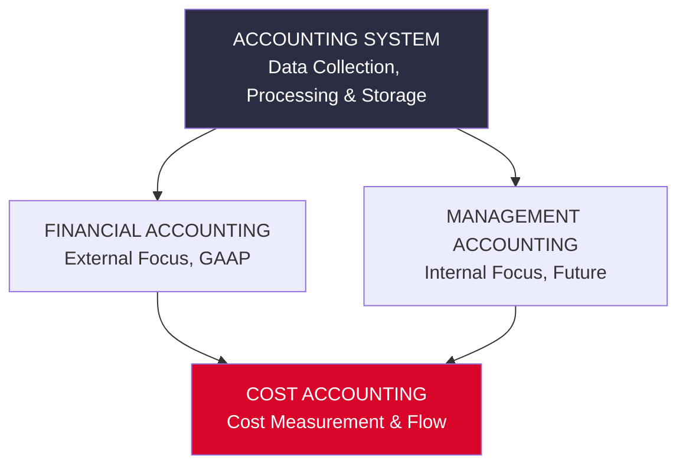
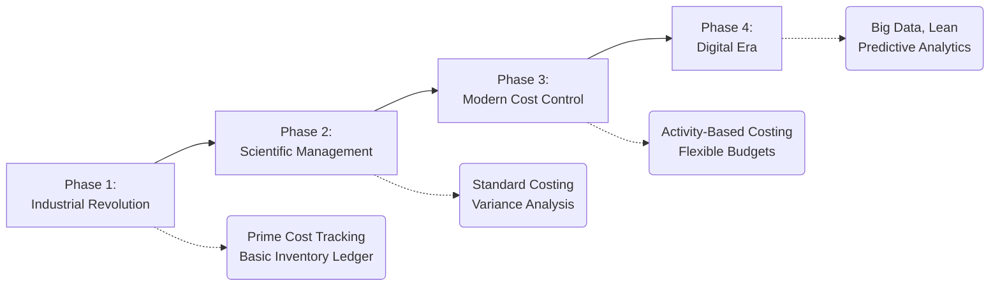

# Introduction to Cost Accounting as a Discipline

> [!abstract] Curriculum & Syllabus Context
>
> - **Course:** ACC 304 Cost Accounting I
> - **Step:** Step 1: Introduction to Cost Accounting as a Discipline
> - **Target Reading:** Datar & Rajan, *Horngren's Cost Accounting*, 17th/18th Edition — **Chapter 1: The Manager and Management Accounting**
> - **Syllabus Focus:** Manufacturing, merchandising, and service sectors; tripartite comparison of financial, management, and cost accounting; organizational structure (CFO vs. Controller, line vs. staff); IMA ethical standards; integral vs. non-integral accounting systems; and BCAS 1 overview.

---

### 1. Overview and Sectoral Context of Accounting Systems
#### 1.1 Business Sectors & Operational Characteristics
Accounting systems process economic transactions—collecting, categorizing, summarizing, and analyzing data—to support organizational decision-making. Operating organizations fall into three primary economic sectors:

> [!info] Key Definition
>
> **1. Manufacturing-Sector Concerns:**
> * **Definition:** Companies that purchase raw materials, components, and supplies and convert them into finished goods through physical, chemical, or assembly processes.
> * **Operational Cycle:** Involves three distinct phases: Procurement $\rightarrow$ Conversion $\rightarrow$ Sales/Dispatch.
> * **Inventory Structure:** Requires three distinct inventory accounts on the Balance Sheet:
>   * *Direct Materials Inventory:* Raw stock awaiting introduction into production.
>   * *Work-in-Process $WIP$ Inventory:* Partially completed goods undergoing conversion.
>   * *Finished Goods Inventory:* Fully manufactured goods ready for sale.
> * **Examples:** Automotive assembly plants (Tesla, Toyota), paper machinery manufacturers (Robinson Company), electronics producers.

> [!info] Key Definition
>
> **2. Merchandising-Sector Concerns:**
> * **Definition:** Companies that purchase tangible products from suppliers and resell them to customers without altering their basic physical form.
> * **Operational Cycle:** Procurement $\rightarrow$ Merchandising $\rightarrow$ Sales.
> * **Inventory Structure:** Holds a single inventory account (**Merchandise Inventory**) representing goods held for resale.
> * **Examples:** Retail giants (Walmart, Costco), university campus stores.

> [!info] Key Definition
>
> **3. Service-Sector Concerns:**
> * **Definition:** Companies that provide intangible services, intellectual capital, or expertise rather than tangible goods.
> * **Operational Cycle:** Service Design $\rightarrow$ Service Delivery.
> * **Inventory Structure:** Possesses **no tangible inventory** accounts on the Balance Sheet (or negligible physical supply inventories). Costs are expensed as period costs or accumulated against active service engagements/jobs.
> * **Examples:** Audit & advisory firms (PwC), healthcare institutions (Mayo Clinic), software/cloud providers, legal practices.

---
### 2. Tripartite Classification of Accounting Disciplines
Accounting information serves distinct audiences with differing requirements. The discipline is divided into three interconnected branches: Financial Accounting, Management Accounting, and Cost Accounting.

#### 2.1 Comparative Analysis Matrix

| Dimension / Feature | Financial Accounting | Management Accounting | Cost Accounting |
| :--- | :--- | :--- | :--- |
| **Primary Purpose** | Communicates financial position and operational results to external stakeholders. | Aids internal managers in formulating strategy, planning, controlling operations, and making decisions. | Measures, analyzes, and reports financial and non-financial data relating to resource acquisition and usage. |
| **Primary Users** | External parties: Investors, banks, regulatory agencies (SEC, BSEC, NBR), tax authorities, creditors. | Internal managers across all value-chain functions (CFO, plant managers, marketing executives, engineers). | Dual focus: Supplies cost data to both Financial Accountants (for valuation) and Management Accountants (for decisions). |
| **Time Horizon & Orientation** | **Past-oriented:** Historical evaluation of past financial periods (e.g., 2024 results audited in 2025). | **Future-oriented:** Forward-looking projections, operational budgets, capital budgets, and scenario models. | Both historical (actual costs incurred) and future-oriented (budgeted/standard overhead rates). |
| **Measurement Rules & Constraints** | Heavily regulated; must strictly follow **GAAP/IFRS** and regulatory mandates, validated by independent audit. | Unregulated by GAAP/IFRS; governed solely by internal **Cost-Benefit Analysis** and managerial utility. | Governed by GAAP for inventory pricing; governed by internal logic or specific standards (e.g., CASB, BCAS) for costing. |
| **Scope & Level of Aggregation** | **Macro-level:** Summary reports on the enterprise as a whole (Income Statement, Balance Sheet, Cash Flow). | **Micro-level:** Highly disaggregated reports by product line, job, department, process, territory, or customer. | **Disaggregated:** Focuses on individual cost objects (units, jobs, batches, activities, processes). |
| **Reporting Frequency** | Periodic: Quarterly and annual standardized financial statements. | Dynamic: Ranging from real-time/hourly operational metrics to weekly, monthly, or multi-year strategic plans. | Continuous tracking of cost flows, job-cost records, material requisitions, and labor-time tickets. |
| **Behavioral Impact** | Primarily reports economic events, but indirectly influences behavior via executive compensation metrics. | Explicitly designed to motivate employees, align goal congruence, and drive desired operational behaviors. | Influences cost-consciousness, waste reduction, and operational efficiency across plant floors. |

---
### 3. Core Concepts and Objectives of Cost Accounting
#### 3.1 Fundamental Definitions
> [!info] Key Definition
>
> * **Cost:** A monetary measure of the amount of resources sacrificed or forgone to achieve a specific objective.
> * **Actual Cost:** A historical or past cost that has already been incurred.
> * **Budgeted (or Standard) Cost:** A forecasted, predicted, or target cost established for future operations.
> * **Cost Object:** Anything for which a separate measurement of costs is desired (e.g., a product unit, distinct job, customer, department, or strategic activity).
> * **Cost Accumulation:** The systematic collection of cost data in an organized accounting structure.
> * **Cost Assignment:** A general term encompassing both **Cost Tracing** (assigning direct costs directly to a cost object) and **Cost Allocation** (assigning indirect costs using an allocation base).

#### 3.2 Objectives of Cost Accounting
1. **Product & Service Costing:** Accurately calculating unit costs for inventory valuation and Cost of Goods Sold $COGS$ determination to fulfill financial reporting requirements under GAAP/IFRS.
2. **Operational Planning & Control:** Establishing performance benchmarks through standard costing, budgeting, and variance analysis ($Variance = Actual - Budgeted$) to monitor efficiency and eliminate non-value-added activities.
3. **Managerial Decision-Support:** Providing relevant quantitative and qualitative cost figures for strategic pricing, product-mix decisions, make-or-buy decisions, and capacity management.
4. **Cost Control & Cost Reduction:** Continuously analyzing cost behavior, efficiency, and waste to achieve sustained cost leadership without sacrificing customer-perceived value.
#### 3.3 Limitations of Financial Accounting that Drove Cost Accounting Development
> [!warning] Exam Pitfall / Exception
>
> **Limitations of Financial Accounting:** Financial accounting developed primarily to fulfill stewardship obligations to external capital providers. Its inherent structural limitations necessitated the emergence of Cost Accounting:
> * **Historical Bias:** Financial accounting reports past costs, making it unsuited for real-time operational control or proactive future decision-making.
> * **Aggregated View:** It aggregates revenues and expenses across the entire firm, concealing which individual products, departments, or customers are profitable versus loss-making.
> * **Omission of Non-Financial Metrics:** It ignores operational, physical, and qualitative drivers (such as setup times, labor efficiency, machine hours, defect rates, and customer lead times).
> * **Rigidity of GAAP/IFRS:** Strict compliance rules prevent management from using alternative cost concepts (e.g., opportunity costs, replacement costs, or variable costing) for internal evaluation.
> * **Lack of Cost Behavior Insights:** Financial accounting fails to classify costs by behavior (fixed vs. variable), impeding Cost-Volume-Profit $CVP$ analysis and flexible budgeting.

---
### 4. Organizational Structure and Ethics of the Management Accountant
#### 4.1 Line vs. Staff Relationships
Within an organization's structure, management functions are classified into line and staff roles:
* **Line Management:** Directly responsible for achieving the core strategic goals of the organization. Line managers hold authority over operational decisions.
  * *Examples:* Production managers, manufacturing division heads, sales managers.
* **Staff Management:** Provides advice, specialized knowledge, analytical support, and administrative assistance to line management. Staff managers hold advisory authority.
  * *Examples:* Management accountants, cost analysts, IT specialists, HR managers.

The management accountant functions as a **strategic business partner** to line management, supplying real-time financial and operational intelligence to guide line managers' decisions.
#### 4.2 Executive Roles: CFO and Controller
> [!info] Key Definition
>
> * **Chief Financial Officer $CFO$:** The executive officer responsible for overseeing the entire financial operations of an organization. Key responsibilities include Treasury, Risk Management, Tax, Controllership, Investor Relations, and Strategic Planning.
> * **Controller (Chief Accounting Officer):** The senior financial executive directly responsible for management accounting, cost accounting, and financial accounting. The controller manages the daily general ledger, cost accounting systems, internal reporting, budgeting, and financial statement preparation.

#### 4.3 Professional Ethics: The IMA Statement
Management accountants hold sensitive financial data and are routinely exposed to ethical dilemmas. The **Institute of Management Accountants $IMA$** provides the *Statement of Ethical Professional Practice*, detailing four fundamental ethical standards:
1. **Competence:** Maintain professional expertise, perform duties within the law, and provide accurate, clear, and timely decision-support information.
2. **Confidentiality:** Keep information confidential except when legally required, and refrain from using it for unethical advantage.
3. **Integrity:** Mitigate conflicts of interest and abstain from activities that might discredit the profession.
4. **Credibility:** Communicate information fairly and objectively, disclosing all relevant details that could influence a user's understanding.
#### 4.4 Ethical Conflict Resolution
When facing ethical issues, management accountants must follow established organizational policies. If policies do not resolve the conflict, they should:
* Discuss the issue with an immediate supervisor.
* Clarify concepts with an IMA Ethics Counselor or legal advisor.
* If all internal recourse is exhausted, consider disassociating from the organization.

---
### 5. Cost Accounting Standards & Commonwealth Accounting Systems
#### 5.1 Purpose and Framework of Cost Accounting Standards
Cost Accounting Standards are codified rules designed to achieve global or national uniformity, consistency, and equity in cost measurement, cost assignment, and cost allocation.

> [!info] Key Definition
>
> * **Cost Accounting Standards Board $CASB$:** In the United States, the CASB issues standards to ensure uniform cost accounting practices for contractors bidding on government contracts.
> * **Bangladesh Cost Accounting Standards $BCAS$:** Issued by the **ICMAB**, these standards regulate cost determination across sectors in Bangladesh:
>   * **BCAS 1:** Cost Concepts and Classifications.
>   * **BCAS 4:** Indirect Costs.
>   * **BCAS 5:** Indirect Cost Rate.
>   * **BCAS 6:** Support Department Cost.
>   * **BCAS 7:** Job Order Costing.

#### 5.2 Integral vs. Non-Integral Accounting Systems
In international and Commonwealth cost accounting terminology, accounting ledgers are maintained under one of two general double-entry structures:
1. **Non-Integral (Non-Integrated) Accounting System:**
   * **Concept:** The Cost Accounting Ledger is kept completely separate and distinct from the Financial Accounting Ledger.
   * **Mechanism:** Two separate sets of books are maintained. A self-balancing control account called the **Cost Ledger Control Account** links them without duplicating transactions.
   * **Posting Logic:** External financial transactions are recorded in the financial ledger; the cost ledger records only internal cost allocations. Periodic reconciliation statements are required.
2. **Integral (Integrated) Accounting System:**
   * **Concept:** Cost and financial accounting records are combined into a single, unified general ledger.
   * **Mechanism:** Eliminates duplicate bookkeeping. A single chart of accounts captures both external financial transactions and internal cost flows.
   * **Posting Logic:** No end-of-period profit reconciliation is required because there is only one profit figure. Modern ERP systems natively operate as integrated systems.

---
### 6. Evolution, Methods, Techniques, and System Installation
#### 6.1 Historical Evolution of Cost Accounting

#### 6.2 Methods vs. Techniques of Cost Accounting
> [!warning] Exam Pitfall / Exception
>
> It is essential to distinguish between a *Method* of costing (how cost data is accumulated based on physical manufacturing) and a *Technique* of costing (how cost data is formatted and analyzed).

* **Methods of Costing (Determined by Industry Production Type):**
  1. *Job Order Costing:* Used when distinct, customized units are produced.
  2. *Batch Costing:* Used when distinct items are produced in identifiable lots.
  3. *Process Costing:* Used when continuous streams of identical units are manufactured.
  4. *Contract Costing:* Applied to large-scale infrastructure projects.
  5. *Operating / Service Costing:* Used by service organizations.
* **Techniques of Costing (Determined by Managerial Analytical Approach):**
  1. *Historical Costing:* Charging actual costs incurred after production occurs.
  2. *Standard Costing:* Comparing actual costs against predetermined standard costs to isolate price and efficiency variances.
  3. *Marginal / Variable Costing:* Separating costs into fixed and variable components; charging only variable manufacturing costs to inventory.
  4. *Absorption Costing:* Full cost technique mandating that both variable and fixed manufacturing overhead be absorbed into product inventory values (required by GAAP/IFRS).
  5. *Uniform Costing:* Standardized application across multiple enterprises within an industry.
#### 6.3 Interdisciplinary Relationships
Cost accounting synthesizes concepts from multiple quantitative and theoretical disciplines:
* **Economics:** Marginal revenue/marginal cost ($MR = MC$), opportunity costs, relevant range.
* **Mathematics:** Linear algebra, simultaneous linear equations, linear programming for bottlenecks.
* **Statistics:** Regression analysis ($y = a + bX$), correlation coefficients $$r^2$$, time-series forecasting.
#### 6.4 Characteristics of an Ideal Cost Accounting System
* **Simplicity & Clarity:** Easily understood by operational personnel.
* **Flexibility & Adaptability:** Capable of adjusting to changing business models.
* **Cost-Effectiveness (Cost-Benefit Principle):** System costs must be less than economic benefits gained.
* **Promptness & Accuracy:** Must provide real-time cost reporting for corrective action.
* **Integration:** Seamless interface with operational systems and financial ledgers.
#### 6.5 Steps in Installing a Cost Accounting System
1. **Preliminary Operational Survey:** Investigating plant layout and existing documentation.
2. **Determination of System Objectives:** Clarifying if the focus is inventory valuation, standard control, or profitability.
3. **Structuring Cost Centers:** Defining production and support departments.
4. **Designing Chart of Accounts:** Implementing structured coding.
5. **Establishing Standard Documentation:** Introducing Requisitions, Time Sheets, and Job Cost Sheets.
6. **Integration & Software Deployment:** Deploying ERP modules.
7. **Staff Training & System Audit:** Training personnel and conducting periodic audits.

---
### 7. Comprehensive Master Example & Mathematical Derivations
> [!example] Numerical Problem
>
> To demonstrate how the foundational financial statements of a manufacturing concern are constructed from underlying cost flows, consider the following comprehensive dataset for **Johnson & Howard Manufacturing Ltd.** for the fiscal year ended December 31, 2025.

#### 7.1 Input Operational Data

| Transaction / Account Title | Amount $TK$ |
| :--- | :--- |
| Direct Materials Inventory, January 1, 2025 | 40,000 |
| Work-in-Process Inventory, January 1, 2025 | 35,000 |
| Finished Goods Inventory, January 1, 2025 | 100,000 |
| Purchases of Direct Materials (gross invoice) | 460,000 |
| Freight-In on Direct Materials | 15,000 |
| Purchase Returns & Allowances (Direct Materials) | 12,000 |
| Direct Manufacturing Labor Wages Paid | 300,000 |
| Indirect Manufacturing Labor | 40,000 |
| Plant Supervision & Engineering Salaries | 54,000 |
| Factory Utilities, Heat, Light & Power | 25,000 |
| Depreciation – Plant & Machinery Equipment | 36,000 |
| Plant Insurance & Property Taxes | 7,000 |
| Factory Maintenance, Lubricants & Supplies | 12,000 |
| Direct Materials Inventory, December 31, 2025 | 50,000 |
| Work-in-Process Inventory, December 31, 2025 | 42,000 |
| Finished Goods Inventory, December 31, 2025 | 115,000 |
| Gross Sales Revenues | 1,360,000 |
| Sales Returns & Allowances | 20,000 |
| Marketing & Advertising Expenses | 120,000 |
| Distribution & Shipping Costs | 70,000 |
| Customer Service & Helpline Expenses | 50,000 |
| Corporate Administrative Salaries | 110,000 |

---
#### 7.2 Mathematical Formulations & Derivations
> [!quote] Formula & Derivation
>
> **1. Net Purchases of Direct Materials:**
> $$\text{Net Purchases} = \text{Gross Purchases} + \text{Freight-In} - \text{Purchase Returns \& Allowances}$$
> $$\text{Net Purchases} = 460,000 + 15,000 - 12,000 = \text{TK } 463,000$$
> **2. Direct Materials Used:**
> $$\text{DM Used} = \text{Beginning DM Inventory} + \text{Net Purchases} - \text{Ending DM Inventory}$$
> $$\text{DM Used} = 40,000 + 463,000 - 50,000 = \text{TK } 453,000$$
> **3. Total Manufacturing Costs Incurred (Current Period):**
> $$\text{Total Mfg Costs} = \text{DM Used} + \text{Direct Manufacturing Labor} + \text{Total Manufacturing Overhead}$$
> $$\text{MOH} = 40,000 + 54,000 + 25,000 + 36,000 + 7,000 + 12,000 = \text{TK } 174,000$$
> $$\text{Total Mfg Costs} = 453,000 + 300,000 + 174,000 = \text{TK } 927,000$$
> **4. Prime Costs & Conversion Costs:**
> $$\text{Prime Costs} = \text{Direct Materials Used} + \text{Direct Manufacturing Labor} = 453,000 + 300,000 = \text{TK } 753,000$$
> $$\text{Conversion Costs} = \text{Direct Manufacturing Labor} + \text{Manufacturing Overhead} = 300,000 + 174,000 = \text{TK } 474,000$$
> **5. Cost of Goods Manufactured $COGM$:**
> $$\text{COGM} = \text{Beginning WIP Inventory} + \text{Total Mfg Costs Incurred} - \text{Ending WIP Inventory}$$
> $$\text{COGM} = 35,000 + 927,000 - 42,000 = \text{TK } 920,000$$
> **6. Cost of Goods Sold $COGS$:**
> $$\text{COGS} = \text{Beginning Finished Goods Inventory} + \text{COGM} - \text{Ending Finished Goods Inventory}$$
> $$\text{COGS} = 100,000 + 920,000 - 115,000 = \text{TK } 905,000$$

---
#### 7.3 Statement Calculations

$$ \begin{array}{lrr}
\hline
\textbf{JOHNSON \& HOWARD MANUFACTURING LTD.} & & \\
\textbf{Schedule of Cost of Goods Manufactured} & & \\
\textbf{For the Year Ended December 31, 2025} & & \textbf{Amount (TK)} \\
\hline
\textbf{Direct Materials:} & & \\
\quad \text{Beginning Direct Materials Inventory, Jan 1, 2025} & \text{TK } 40,000 & \\
\quad \text{Add: Gross Purchases of Direct Materials} & 460,000 & \\
\quad \text{Add: Freight-In on Direct Materials} & 15,000 & \\
\quad \text{Less: Purchase Returns \& Allowances} & (12,000) & \\
\cline{2-2}
\quad \text{Net Purchases of Direct Materials} & 463,000 & \\
\hline
\quad \text{Cost of Direct Materials Available for Use} & \text{TK } 503,000 & \\
\quad \text{Less: Ending Direct Materials Inventory, Dec 31, 2025} & (50,000) & \\
\hline
\textbf{Direct Materials Used in Production} & & \text{TK } 453,000 \\
\textbf{Direct Manufacturing Labor Wages} & & 300,000 \\
\textbf{Manufacturing Overhead (MOH):} & & \\
\quad \text{Indirect Manufacturing Labor} & \text{TK } 40,000 & \\
\quad \text{Plant Supervision \& Engineering Salaries} & 54,000 & \\
\quad \text{Factory Utilities, Heat, Light \& Power} & 25,000 & \\
\quad \text{Depreciation -- Plant \& Machinery Equipment} & 36,000 & \\
\quad \text{Plant Insurance \& Property Taxes} & 7,000 & \\
\quad \text{Factory Maintenance, Lubricants \& Supplies} & 12,000 & \\
\hline
\quad \text{Total Manufacturing Overhead Costs} & & 174,000 \\
\hline
\textbf{Total Manufacturing Costs Incurred During the Year} & & \text{TK } 927,000 \\
\text{Add: Beginning Work-in-Process Inventory, Jan 1, 2025} & & 35,000 \\
\hline
\textbf{Total Manufacturing Costs to Account For} & & \text{TK } 962,000 \\
\text{Less: Ending Work-in-Process Inventory, Dec 31, 2025} & & (42,000) \\
\hline \hline
\textbf{COST OF GOODS MANUFACTURED (COGM)} & & \mathbf{\text{TK } 920,000} \\
\hline
\end{array} $$
---
$$ \begin{array}{lrr}
\hline
\textbf{JOHNSON \& HOWARD MANUFACTURING LTD.} & & \\
\textbf{Statement of Comprehensive Income} & & \\
\textbf{For the Year Ended December 31, 2025} & & \textbf{Amount (TK)} \\
\hline
\text{Gross Revenues from Sales} & \text{TK } 1,360,000 & \\
\text{Less: Sales Returns \& Allowances} & (20,000) & \\
\hline
\textbf{Net Sales Revenues} & & \text{TK } 1,340,000 \\
\textbf{Cost of Goods Sold (COGS):} & & \\
\quad \text{Beginning Finished Goods Inventory, Jan 1, 2025} & \text{TK } 100,000 & \\
\quad \text{Add: Cost of Goods Manufactured (COGM)} & 920,000 & \\
\hline
\quad \text{Cost of Finished Goods Available for Sale} & \text{TK } 1,020,000 & \\
\quad \text{Less: Ending Finished Goods Inventory, Dec 31, 2025} & (115,000) & \\
\hline
\text{Cost of Goods Sold} & & (905,000) \\
\hline
\textbf{GROSS MARGIN (Gross Profit)} & & \text{TK } 435,000 \\
\textbf{Operating (Period) Expenses:} & & \\
\quad \text{Marketing \& Advertising Expenses} & \text{TK } 120,000 & \\
\quad \text{Distribution \& Shipping Costs} & 70,000 & \\
\quad \text{Customer Service \& Helpline Expenses} & 50,000 & \\
\quad \text{Corporate Administrative Salaries} & 110,000 & \\
\hline
\text{Total Operating Expenses} & & (350,000) \\
\hline \hline
\textbf{OPERATING INCOME (Net Operating Profit)} & & \mathbf{\text{TK } 85,000} \\
\hline
\end{array} $$

---
### 8. Modern Trends and Future Directions in Cost Accounting
1. **Activity-Based Costing $ABC$ & Time-Driven ABC $TDABC$:** Replaces broad averaging ("peanut-butter costing") with multi-level activity pools and capacity-based time rates $$\text{Capacity Cost Rate} = \frac{\text{Total Cost of Capacity Supplied}}{\text{Practical Capacity of Time}}$$ to prevent product cost cross-subsidization.
2. **Predictive Analytics & Machine Learning:** Modern accountants work alongside data scientists using regression models, decision trees, and algorithm-based forecasting to predict cost drivers, customer churn, and equipment failures before they occur.
3. **Lean Accounting & Value Stream Mapping:** Replaces traditional departmental cost tracking with direct tracking of costs along entire Value Streams $$\text{Value Stream Profit} = \text{Value Stream Revenues} - \text{Actual Value Stream Costs}$$, eliminating accounting waste and non-value-added transaction logging.
4. **Sustainability, Environmental & Carbon Accounting:** Incorporating greenhouse gas $GHG$ emission imputations, carbon budgeting, and life-cycle environmental assessments into product pricing and capital budgeting decisions.
5. **Strategic Cost Management & Value Chain Analysis:** Evaluating cost structures across all value-chain functions—from initial R&D and design to production, marketing, distribution, and post-sales service—to secure sustainable cost leadership or product differentiation.

